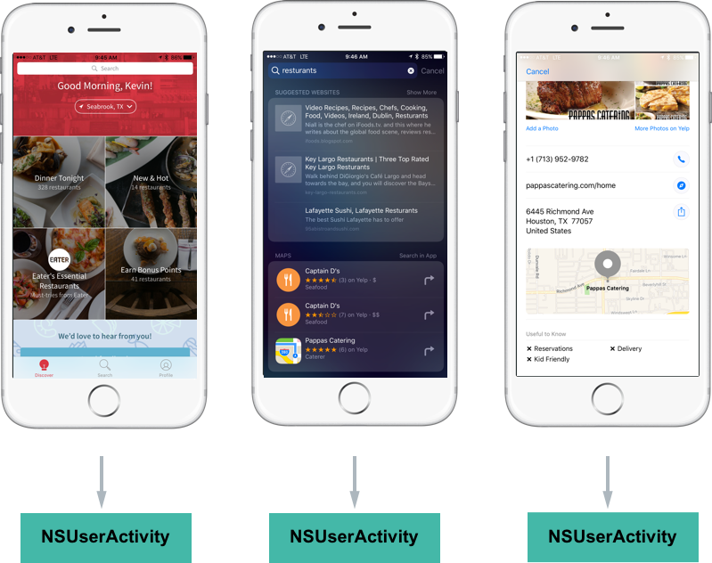
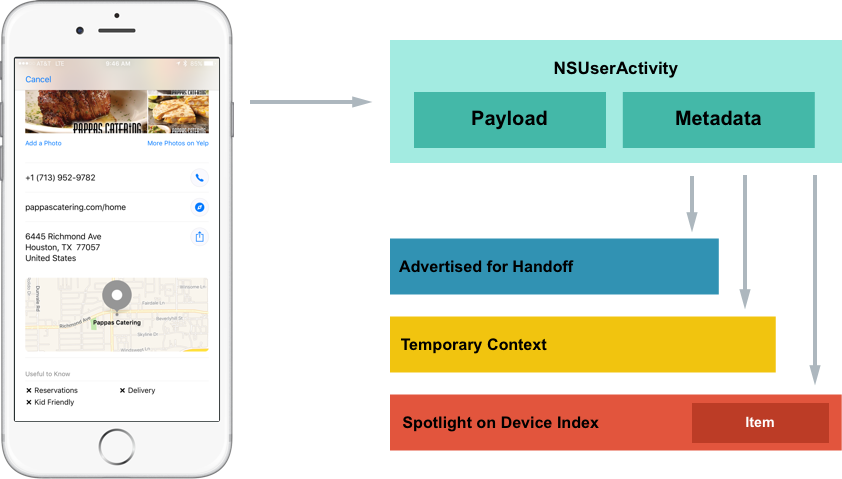
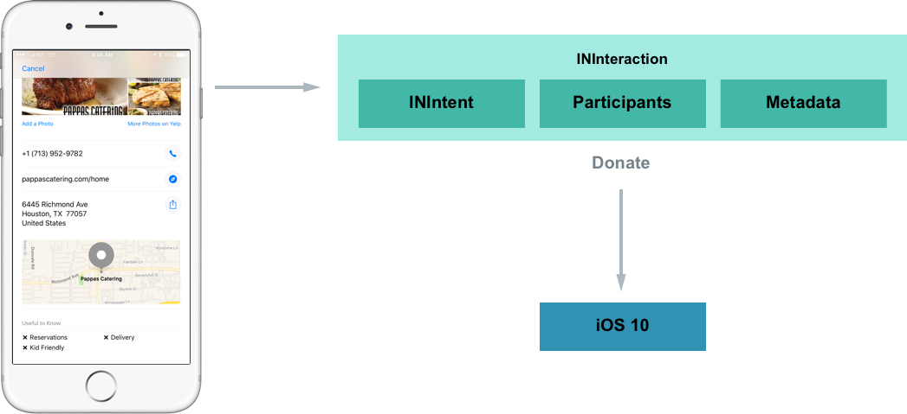
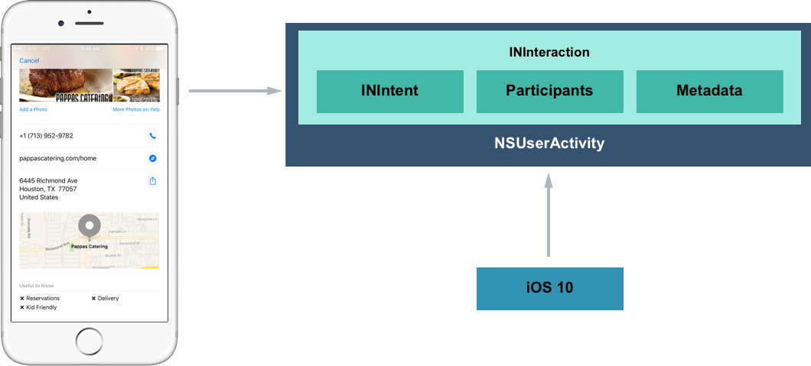

# Introduction to Proactive Suggestions in Xamarin.iOS

_This article shows how to use Proactive Suggestions in the Xamarin.iOS app to drive engagement by allowing the system to proactively present helpful information automatically to the user._

New to iOS 10, Proactive Suggestions present news ways for users to engage with a Xamarin.iOS app by proactively present helpful information automatically to the user at appropriate times.

iOS 10 presents new ways of driving engagement to the app by allowing the system to proactively present helpful information automatically to the user at appropriate times. Just as iOS 9 provided the ability to add deep search to the app using Spotlight, Handoff and Siri Suggestions (see [New Search APIs](~/ios/platform/search/index.md)), with iOS 10 an app can expose functionality that can be presented to the user by the system from within the following locations:

- The App Switcher
- The Lock Screen
- CarPlay
- Maps
- Siri Interactions
- QuickType Suggestions

The app exposes this functionality to the system using a collection of technologies such as `NSUserActivity`, web markup, Core Spotlight, MapKit, Media Player and UIKit. Additionally, by providing Proactive Suggestion support for the app, it gets deeper Siri integration for free.

## Location Based Suggestions

New to iOS 10, the `NSUserActivity` class includes a `MapItem` property that allows the developer to provide location information that can be used in other contexts. For example, if the app displays restaurant reviews, the developer can set the `MapItem` property to the location of the restaurant that the user is viewing in the app. If the user switches to the Maps app, the restaurant's location is automatically available.

If the app supports App Search, it can use the new address components of the `CSSearchableItemAttributesSet` class to specify locations that the user may want to visit. By setting the `MapItem` property, the other properties are automatically filled-in.

In addition to setting the `Latitude` and `Longitude` of the address component properties, it is recommended that the app supply the `NamedLocation` and `PhoneNumbers` properties too, so Siri can initiate a call to the location.

## Web Markup Based Suggestions

iOS 9 added to ability to include structured data markup in the website that enriches the content that users see in Spotlight and Safari search results (see [Search with Web Markup](~/ios/platform/search/web-markup.md)). iOS 10 adds the ability to include location-based markup (such as [PostalAddress](https://schema.org/PostalAddress) as defined by [Schema.org](https://schema.org/)) to further enhance the user's experience. For example, if a users views a location marked page on the website, the system can suggest the same location when they open Maps.

## Text Based Suggestions

UIKit has been expanded in iOS 10 to include the [TextContentType](https://developer.apple.com/reference/uikit/uitextinputtraits/1649656-textcontenttype) property of the [UITextInputTraits](https://developer.apple.com/reference/uikit/uitextinputtraits) class to specify the semantic meaning of the contents in a text area. With this information in place, the system can usually automatically select the appropriate keyboard type, improve autocorrection suggestions and proactively integrate information from other apps and websites.

For example, if the user is entering text into a text field marked `UITextContentType.FullStreetAddress`, the system can suggest auto-filling the field with the location the user was recently viewing.

## Media Based Suggestions

If the app plays media using the [MPPlayableContentManager](xref:MediaPlayer.MPPlayableContentManager) API, iOS 10 lets users view the album art and play media through the app on the lock screen.

## Contextual Siri Reminders

Allows the user to use Siri to quickly make a reminder to view the content they are currently viewing in the app at a later date. For example, if they were viewing a restaurant review in the app, they could invoke Siri and say *"Remind me about this when I get home."* Siri would generate the reminder with a link to the review in the app.

## Contact Based Suggestions

Allows the app's contacts (and contact related information) to appear in the **Contact** app on the iOS device along with all the users contacts stored in the system.

## Ride Sharing Based Suggestions

If a ride-sharing app uses the [MKDirectionsRequest](xref:MapKit.MKDirectionsRequest) API, iOS 10 will present it as an option in the app switcher at times when the user is likely to want a ride. The app must also be registered as a ride-sharing app by specifying the `MKDirectionsModeRideShare` for the [MKDirectionsApplicationSupportedModes](https://developer.apple.com/library/content/documentation/General/Reference/InfoPlistKeyReference/Articles/iPhoneOSKeys.html) key in its `Info.plist` file.

If the app only supports ride sharing, the system suggestion would begin with *"Get a ride to..."*, if other types of routing direction (such as Walking or Bike) are supported, the system will use *"Get directions to..."*

> [!IMPORTANT]
> The [MKMapItem](xref:MapKit.MKMapItem) object that the app receives may not include longitude and latitude information and will require geocoding.

## Implementing Proactive Suggestions

Adding Proactive Suggestion support to a Xamarin.iOS app is typically as easy as implementing a few APIs or expanding on a few APIs that the app might already be implementing.

Proactive Suggestions work with the apps in three main ways:

- **`NSUserActivity` and Schema.org** - `NSUserActivity` helps the system understand what information the user is currently working with on screen. Schema.org adds similar abilities to web pages.
- **Location Suggestions** - If the app offers or consumes location based information, these API extension offer new ways to share this information across apps.
- **Media App Suggestions** - The system can promote the app and its media content based on the context of the user's interaction with the iOS device.

And is supported in the app by implementing the following:

- **Handoff** - `NSUserActivity` was added in iOS 8 to support Handoff, that allows the developer to start an activity on one device, then continue it on another (see [Introduction to Handoff](~/ios/platform/handoff.md)).
- **Spotlight Search** - iOS 9 added the ability to promote app content from within the Spotlight Search results using `NSUserActivity` (see [Search with Core Spotlight](~/ios/platform/search/corespotlight.md)).
- **Contextual Siri Reminders** - In iOS 10, `NSUserActivity` has been expanded to allow Siri to quickly make a reminder to view the content the user is currently viewing in the app at a later date.
- **Location Suggestions** - iOS 10 enhances `NSUserActivity` to capture locations viewed inside of the app and promote them in many places throughout the system.
- **Contextual Siri Requests** - `NSUserActivity` provides context to the information presented inside of the app to Siri so that the user can get directions or place a call be invoking Siri from within the app.
- **Contact Interactions** - New in iOS 10, `NSUserActivity` allows communications apps to be promoted from a contact card (in the Contacts app) as an alternative communication method.

All of these features have one thing in common, they all use `NSUserActivity` in one form or another to provide their functionality. 

## NSUserActivity

As stated above, `NSUserActivity` helps the system understand what information the user is currently working with on screen. `NSUserActivity` is a light-weight state caching mechanism to capture the user's activity as they navigate through the app. For example, looking at a restaurant app:

[](proactive-suggestions-images/activity02.png#lightbox)

With the following interactions:

1. As the user works with the app, a `NSUserActivity` is created to recreate the state of the app later.
2. If the user searches for a restaurant, the same pattern of creating activities is followed.
3. And again, when the user views a result. In this last case, the user is viewing a location and in iOS 10, the system is more aware of certain concepts (such as location or communication interactions).

Take a closer look at the last screen:

[](proactive-suggestions-images/activity03.png#lightbox)

Here the app is creating a `NSUserActivity` and it has been populated with information to recreate the state later. The app has also included some metadata such as the location's name and address. With this activity created, the app lets iOS know that it represents the user's current state.

The app then decides if the activity will be advertised over-the-air for Handoff, saved as a temporary value for location suggestions or added to the on-device Spotlight index for displaying in search results.

For more information on Handoff and Spotlight search, please see our [Introduction to Handoff](~/ios/platform/handoff.md) and [iOS 9 New Search APIs](~/ios/platform/search/index.md) guides.

### Creating an Activity

Before creating an Activity, an Activity Type Identifier will needed to be created to identify it. The Activity Type Identifier is a short string added to the `NSUserActivityTypes` array of the app's `Info.plist` file used to uniquely identify a given User Activity Type. There will be one entry in the array for each activity that the app supports and exposes to App Search. See our [Creating Activity Type Identifiers Reference](~/ios/platform/search/nsuseractivity.md) for more details.

Look at an example of an activity:

```csharp
// Create App Activity
var activity = new NSUserActivity ("com.xamarin.platform");

// Define details
var info = new NSMutableDictionary ();
info.Add(new NSString("link"),new NSString("http://xamarin.com/platform"));

// Populate Activity
activity.Title = "The Xamarin Platform";
activity.UserInfo = info;

// Enable capabilities
activity.EligibleForSearch = true;
activity.EligibleForHandoff = true;
activity.EligibleForPublicIndexing = true;

// Inform system of Activity
activity.BecomeCurrent();
```

A new activity is created using an Activity Type Identifier. Next, some metadata defining the activity is created so this state can be restored at a later date. Then, the activity is given a meaningful title and attached to the user info. Finally, some capabilities are enabled and the activity is sent to the system.

The code above could further be enhanced to include metadata that provides context to the activity by making the following changes:

```csharp
...

// Provide context
var attributes = new CSSearchableItemAttributeSet ("com.xamarin.location");
attributes.ThumbnailUrl = myThumbnailURL;
attributes.Keywords = new string [] { "software", "mobile", "language" }; 
activity.ContentAttributeSet = attributes;

// Inform system of Activity
activity.BecomeCurrent();
```

If the developer has a website that is capable of displaying the same information as the app, the app can include the URL and the content can be displayed on other devices that don't have the app installed (via Handoff):

```csharp
// Restore on the web
activity.WebPageUrl = new NSUrl("http://xamarin.com/platform");
```

### Restoring an Activity

To respond to the user tapping on a search result (`NSUserActivity`) for the app, edit the **AppDelegate.cs** file and override the `ContinueUserActivity` method. For example:

```csharp
public override bool ContinueUserActivity (UIApplication application, NSUserActivity userActivity, UIApplicationRestorationHandler completionHandler)
{

    // Take action based on the activity type
    switch (userActivity.ActivityType) {
    case "com.xamarin.platform":
        // Restore the state of the app here...
        break;
    }

    return true;
}
```

The developer will need to ensure this is the same Activity Type Identifier (`com.xamarin.platform`) as the activity created above. The app uses the information stored in the `NSUserActivity` to restore the state back to where the user left off.

### Benefits of Creating an Activity

With the minimal amount of code presented above, the app is now able to take advantage of three new iOS 10 features:

- **Handoff**
- **Spotlight Search**
- **Contextual Siri Reminders**

The following section will take a look at enabling two other new iOS 10 features:

- **Location Suggestions**
- **Contextual Siri Requests**

### Location Based Suggestions 

Take the example of the restaurant search app above. If it has implemented `NSUserActivity` and correctly populated all of the metadata and attributes, the user would be able to do the following:

1. Find a restaurant in the app that they would like to meet a friend at.
2. As the user moves away from the app using the multitasking app switcher, the system will automatically display a suggestion (at the bottom of the screen) to get directions to the restaurant using their favorite navigation app.
3. If the user switches to the Messages app and starts typing *"Let's meet at"*, the QuickType keyboard will automatically suggest pasting in the address of the restaurant.
4. If the user switches to the Maps app, the restaurant's address is automatically suggested as a destination.
5. This even works for 3rd Party apps (that support `NSUserActivity`), so the user can switch to a ride-sharing app and the restaurant's address is automatically suggested as a destination there as well.
6. It also provides context to Siri, so the user can invoke Siri within the restaurant app and ask *"Get directions..."* and Siri will provide directions to the restaurant the user is viewing.

All of the above functionality has one thing in common, they all indicate where the suggestion is originally coming from. In the case of the example above, it's the fictitious restaurant review app.

iOS 10 has been enhanced to enable this functionality for an app through several small modifications and additions to existing frameworks:

- `NSUserActivity` has additional fields for capturing location information that is viewed inside of the app.
- Several additions have been made to MapKit and CoreSpotlight to capture location.
- Location aware functionality has been added to Siri, Maps, Keyboards, Multitasking and other apps within the system.

To implement location based suggestions, start with the same activity code presented above:

```csharp
// Create App Activity
var activity = new NSUserActivity ("com.xamarin.platform");

// Define details
var info = new NSMutableDictionary ();
info.Add(new NSString("link"),new NSString("http://xamarin.com/platform"));

// Populate Activity
activity.Title = "The Xamarin Platform";
activity.UserInfo = info;

// Enable capabilities
activity.EligibleForSearch = true;
activity.EligibleForHandoff = true;
activity.EligibleForPublicIndexing = true;

// Provide context
var attributes = new CSSearchableItemAttributeSet ("com.xamarin.location");
attributes.ThumbnailUrl = myThumbnailURL;
attributes.Keywords = new string [] { "software", "mobile", "language" }; 
activity.ContentAttributeSet = attributes;

// Restore on the web
activity.WebPageUrl = new NSUrl("http://xamarin.com/platform");

// Inform system of Activity
activity.BecomeCurrent();
```

If the app is using MapKit, it is as simple as adding the current map `MKMapItem` to the activity:

```csharp
// Save MKMapItem location
activity.MapItem = myMapItem;
```

If the app isn't using MapKit, it can adopt App Search and specify the following new attributes for location:

```csharp
// Provide context
var attributes = new CSSearchableItemAttributeSet ("com.xamarin.location");
...

attributes.NamedLocation = "Apple Inc.";
attributes.SubThoroughfare = "1";
attributes.Thoroughfare = "Infinite Loop";
attributes.City = "Cupertino";
attributes.StateOrProvince = "CA";
attributes.Country = "United States";
attributes.Latitude = 37.33072;
attributes.Longitude = 122.029674;
attributes.PhoneNumbers = new string[]{"(800) 275-2273"};
attributes.SupportsPhoneCalls = true;
attributes.SupportsNavigation = true;
```

Take a look at the above code in detail. First, the name of the location is required in every instance:

```csharp
attributes.NamedLocation = "Apple Inc.";
```

Then, the text based description of the location is required for text based instances (such as the QuickType keyboard):

```csharp
attributes.SubThoroughfare = "1";
attributes.Thoroughfare = "Infinite Loop";
attributes.City = "Cupertino";
attributes.StateOrProvince = "CA";
attributes.Country = "United States";
```

The latitude and longitude are optional, but ensure that the user is routed to the exact location the app is wanting to send them to, so it should be included:

```csharp
attributes.Latitude = 37.33072;
attributes.Longitude = 122.029674;
```

By setting the phone numbers, the app can gain access to Siri so the user can invoke Siri from the app by saying something like, *"Call this place"*:

```csharp
attributes.PhoneNumbers = new string[]{"(800) 275-2273"};
```

Finally, the app can indicate if the instance is suitable for navigation and phone calls:

```csharp
attributes.SupportsPhoneCalls = true;
attributes.SupportsNavigation = true;
```

### Implementing Contact Interactions

New in iOS 10, communication apps are deeply integrated into the Contacts app from the contact card. For apps that have implemented Contact Interactions, the user can add the given app's information to specific people in their contacts. And if, for example, they hit the quick action button at the top of a card to send a message, the attached app will be listed as an option to send the message from.

If a 3rd Party app is selected, it can be remembered and presented as the default way to message the given person the next time the user wants to contact them.

Contact Interactions are implemented in the app using `NSUserActivity` and the new Intents framework introduced in iOS 10. For more details on working with Intents, please see our [Understanding SiriKit Concepts](~/ios/platform/sirikit/understanding-sirikit.md) and [Implementing SiriKit](~/ios/platform/sirikit/implementing-sirikit.md) guides.

#### Donating Interactions

Take a look at how the app can donate interactions:

[](proactive-suggestions-images/activity04.png#lightbox)

The app creates an `INInteraction` object that contains an  **Intent** (`INIntent`), **Participants** and **Metadata**. The **Intent** represents a user action such as making a video call or sending a text message. The **Participants** include the people receiving the communication. The **Metadata** defines addition information such as successfully sending the message, etc.

The developer never directly creates an instance of `INIntent` or `INIntentResponse`, they will use one of the specific child classes (based on the task the app is accomplishing on behalf of the user) that inherit from these parent classes. For example, `INSendMessageIntent` and `INSendMessageIntentResponse` for sending a text message. 

Once the interaction is fully populated, call the `DonateInteraction` method to inform the system that the interaction is available to use.

When the user interacts with the app from the Contact card, the interaction gets bundled with a `NSUserActivity`, which is then used to launch the app:

[](proactive-suggestions-images/activity05.png#lightbox)

Take a look at the following example of a Send Message Intent:

```csharp
using System;
using Foundation;
using UIKit;
using Intents;

namespace MonkeyNotification
{
  public class DonateInteraction
  {
    #region Constructors
    public DonateInteraction ()
    {
    }
    #endregion

    #region Public Methods
    public void SendMessageIntent (string text, INPerson from, INPerson[] to)
    {

      // Create App Activity
      var activity = new NSUserActivity ("com.xamarin.message");

      // Define details
      var info = new NSMutableDictionary ();
      info.Add (new NSString ("message"), new NSString (text));

      // Populate Activity
      activity.Title = "Sent MonkeyChat Message";
      activity.UserInfo = info;

      // Enable capabilities
      activity.EligibleForSearch = true;
      activity.EligibleForHandoff = true;
      activity.EligibleForPublicIndexing = true;

      // Inform system of Activity
      activity.BecomeCurrent ();

      // Create message Intent
      var intent = new INSendMessageIntent (to, text, "", "MonkeyChat", from);

      // Create Intent Reaction
      var response = new INSendMessageIntentResponse (INSendMessageIntentResponseCode.Success, activity);

      // Create interaction
      var interaction = new INInteraction (intent, response);

      // Donate interaction to the system
      interaction.DonateInteraction ((err) => {
        // Handle donation error
        ...
      });
    }
    #endregion
  }
}
```

Looking at this code in detail, it creates and populates an instance of `NSUserActivity` (as shown in the [Creating an Activity](#creating-an-activity) section above). Next, it creates an instance of `INSendMessageIntent` (which inherits from `INIntent`) and populates it with the details of the message being sent:

```csharp
var intent = new INSendMessageIntent (to, text, "", "MonkeyChat", from);
```

An `INSendMessageIntentResponse` is created and passed the `NSUserActivity` created above:

```csharp
var response = new INSendMessageIntentResponse (INSendMessageIntentResponseCode.Success, activity);
```

An `INInteraction` is built from the Send Message Intent (`INSendMessageIntent`) and Response (`INSendMessageIntentResponse`) just created:

```csharp
var interaction = new INInteraction (intent, response);
```

Finally, the system is notification of the Interaction:

```csharp
// Donate interaction to the system
interaction.DonateInteraction ((err) => {
  // Handle donation error
  ...
});
```

A completion handler is passed in where the app can respond to the donation succeeding or failing.

### Activities Best Practices

Apple suggests the following best practices when working with activities:

- Use `NeedsSave` for lazy payload updates.
- Ensure to keep a strong reference to the current activity.
- Only transfer small payloads that include just enough information to restore the state.
- Ensure that the Activity Type Identifiers are unique and descriptive by using reverse-DNS notation to specify them. 

## Schema.org

As shown above, `NSUserActivity` helps the system understand what information the user is currently working with on screen. Schema.org adds similar abilities to web pages.

Schema.org can provide the same types of location based interactions to the website. Apple designed the new location suggestions to work just as well when viewed in Safari as they do in a native app.

Some Schema.org background:

- It provides an open web markup vocabulary standard.
- It works by including structured metadata on web pages.
- There are over 500 schemas representing various concepts available.
- By implementing it on the website, the developer can acquire some of the benefits of using `NSUserActivity` in a native app.

The schemas are arranged in a tree like structure, where specific types such as *Restaurant*, inherit from more generic types such as *Local Business*. For more information, please see [Schema.org](https://schema.org).

For example, if the web page included the following data:

```html
<script type="application/ld+json">
{
  "@context":"http://schema.org",
  "@type":"Restaurant",
  "telephone":"(415) 781-1111",
  "url":"https://www.yanksing.com",
  "address":{
    "@type":"PostalAddress",
    "streetAddress":"101 Spear St",
    "addressLocality":"San Francisco",
    "postalCode":"94105",
    "addressRegion":"CA"
  },
  "aggregateRating":{
    "@type":"AggregateRating",
    "ratingValue":"3.5",
    "reviewCount":"2022"
  }
}
</script>
```

If the user visited this page in Safari and then switched to another app, the location information from the page would be captured and offered as a Location Suggestion in other parts of the system (as seen in Activities above).

Safari will extract anything on a web page that adheres to any of the following schema properties:

- **PostalAddress**
- **GeoCoordinates**
- A telephone property.

For more information, please see our [Search with Web Markup](~/ios/platform/search/web-markup.md) guide.

## Consuming Location Suggestions

This next section will cover consuming Location Suggestion that have come from other parts of the system (such as the Maps app) or other 3rd party apps.

There are two main ways the app can consume Location Suggestions:

- Via the QuickType keyboard.
- Directly by consuming the location information in routing apps.

### Location Suggestions and the QuickType Keyboard

If the app deals with addresses in text based formats, the app can take advantage of Location Suggestions via the QuickType UI. iOS 10 expands the QuickType UI with the following features:

- The app can add hints about the semantic intent for text fields in the UI.
- The app can get proactive suggestions in the app.
- The app can benefit from enhanced autocorrection.

The new `TextContentType` property of the text field controls in iOS 10 allows the developer to define the semantic intent for the value that the user is going to enter in a given field. For example:

```csharp
var textField = new UITextField();
textField.TextContentType = UITextContentType.FullStreetAddress;
```

Would tell the system that the app expects the user to enter a full street address in the given field. This will allow the QuickType keyboard to automatically provide Location Suggestions on the keyboard when the user is entering a value in this field.

The following are a few of the more common types available to the developer in the `UITextContentType` static class:

- `Name`
- `GivenName`
- `FamilyName`
- `Location`
- `FullStreetAddress`
- `AddressCityAndState`
- `TelephoneNumber`
- `EmailAddress`

### Routing Apps and Locations Suggestions

This section will take a look at consuming Location Suggestions directly from within a routing app. For the routing app to add this functionality, the developer will leverage the existing `MKDirectionsRequest` framework as follows:

- To promote the app in Multitasking.
- To register the app as a routing app.
- To handle launching the app with a MapKit `MKDirectionsRequest` object.
- To give iOS the ability to learn to suggest the app to the user at appropriate times, based on user engagement.

When the app is started with a MapKit `MKDirectionsRequest` object, it should automatically start giving the user directions to the requested location, or present a UI that makes it easy for the user to start getting directions. For example:

```csharp
using System;
using Foundation;
using UIKit;
using MapKit;
using CoreLocation;

namespace MonkeyChat
{
  [Register ("AppDelegate")]
  public class AppDelegate : UIApplicationDelegate, IUISplitViewControllerDelegate
  {
    ...
    
    public override bool OpenUrl (UIApplication app, NSUrl url, NSDictionary options)
    {
      if (MKDirectionsRequest.IsDirectionsRequestUrl (url)) {
        var request = new MKDirectionsRequest (url);
        var coordinate = request.Destination?.Placemark.Location?.Coordinate;
        var address = request.Destination.Placemark.AddressDictionary;
        if (coordinate.IsValid()) {
          var geocoder = new CLGeocoder ();
          geocoder.GeocodeAddress (address, (place, err) => {
            // Handle the display of the address

          });
        }
      }

      return true;
    }
  }    
}
```

Take a look at this code in detail. It tests to see if it is a valid destination request:

```csharp
if (MKDirectionsRequest.IsDirectionsRequestUrl(url)) {
```

If it is, then it creates a `MKDirectionsRequest` from the URL:

```csharp
var request = new MKDirectionsRequest(url);
```

New in iOS 10, the app can be sent an address that does not have geo-coordinates, in that cause the developer needs to encode the address:

```csharp
var geocoder = new CLGeocoder();
geocoder.GeocodeAddress(address, (place, err)=> {
  // Handle the display of the address
  
});

```

## Media App Suggestions

If the app handles any type of media like a podcast app or a streaming media content such as audio or video, with iOS 10, it can take advantage of Media Suggestions in the system.

For apps that handle media, iOS supports the following behaviors:

- iOS promotes apps that the user is likely to use based on their previous behavior.
- Suggestions related to the app will be presented in Spotlight and the Today View.
- If the app meets one of the following triggers, it might be elevated to a lock screen suggestion:
  - After plugging in headphones or a Bluetooth device makes a connection.
  - After getting in a car.
  - After arriving at home or work. 

By including a simple API call in iOS 10, the developer can create a more engaging lock screen experience for users of the media app. By using the `MPPlayableContentManager` class to manage the media playback, full media controls (like those presented by the Music app) will be presented on the lock screen for the app.

```csharp
using System;
using MediaPlayer;
using UIKit;

namespace MonkeyPlayer
{
  public class PlayableContentDelegate : MPPlayableContentDelegate
  {
    #region Constructors
    public PlayableContentDelegate ()
    {
    }
    #endregion

    #region Override methods
    public override void InitiatePlaybackOfContentItem (MPPlayableContentManager contentManager, Foundation.NSIndexPath indexPath, Action<Foundation.NSError> completionHandler)
    {
      // Access the media item to play
      var item = LoadMediaItem (indexPath);

      // Populate the lock screen
      PopulateNowPlayingItem (item);

      // Prep item to be played
      var status = PreparePlayback (item);

      // Call completion handler
      completionHandler (null);
    }
    #endregion

    #region Public Methods
    public MPMediaItem LoadMediaItem (Foundation.NSIndexPath indexPath)
    {
      var item = new MPMediaItem ();

      // Load item from media store
      ...

      return item;
    }

    public void PopulateNowPlayingItem (MPMediaItem item)
    {
      // Get Info Center and album art
      var infoCenter = MPNowPlayingInfoCenter.DefaultCenter;
      var albumArt = (item.Artwork == null) ? new MPMediaItemArtwork (UIImage.FromFile ("MissingAlbumArt.png")) : item.Artwork;

      // Populate Info Center
      infoCenter.NowPlaying.Title = item.Title;
      infoCenter.NowPlaying.Artist = item.Artist;
      infoCenter.NowPlaying.AlbumTitle = item.AlbumTitle;
      infoCenter.NowPlaying.PlaybackDuration = item.PlaybackDuration;
      infoCenter.NowPlaying.Artwork = albumArt;
    }

    public bool PreparePlayback (MPMediaItem item)
    {
      // Prepare media item for playback
      ...

      // Return results
      return true;
    }
    #endregion
  }
}
```

## Summary

This article has covered Proactive Suggestions and showed how the developer can use them to drive traffic to the Xamarin.iOS app. It covered the step to implement Proactive Suggestions and presented usage guidelines.

## Related Links

- [iOS 10 Samples](/samples/browse/?products=xamarin&term=Xamarin.iOS%2biOS10)
- [SiriKit Programming Guide](https://developer.apple.com/library/prerelease/content/documentation/Intents/Conceptual/SiriIntegrationGuide/index.html)