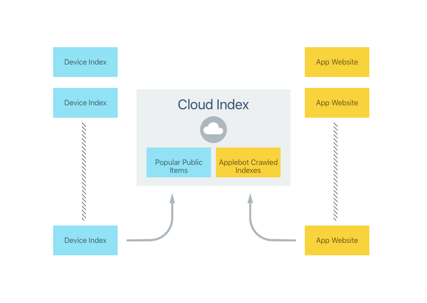
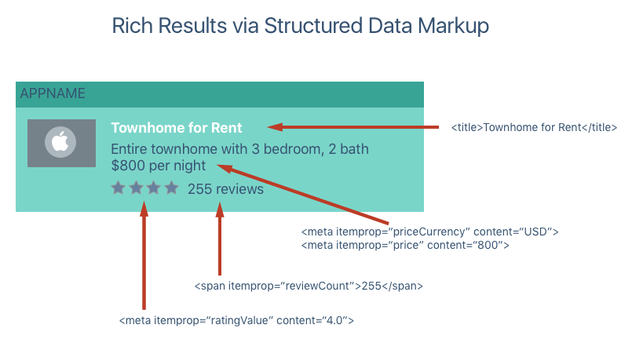

# Search with Web Markup in Xamarin.iOS

For apps that provide access to their content via a web site
(not only from within the app), web content can be marked up with special links
that will be crawled by Apple and provide deep linking to you app on the user's iOS 9 device.

If your iOS app already supports mobile deep linking and your website presented
deep links to content within your app, Apple's _Applebot_ web crawler will index
this content and automatically add it to their Cloud Index:

[](web-markup-images/webmarkup01.png#lightbox)

Apple will surface these results in Spotlight Search and Safari Search results.
If the user taps on one of these results (and they have your app installed) then
they will be taken to the content in your app:

[](web-markup-images/webmarkup02.png#lightbox)

## Enabling Web Content Indexing

There are four steps required to make you app's content searchable using Web Markup:

1. Ensure that Apple can discover and index your app's website by defining it as the **Support** or **Marketing** website in iTunes Connect.
2. Ensure that your app's website contains the required markup to implement mobile deep linking. See the sections below for more details.
3. Enable deep link handling in your iOS app.
4. Add markup for the structured data surfaced by your app's website to provide a rich and engaging result to the end user. While this step is not strictly required, it is highly recommended by Apple.

The following sections will go over these steps in detail.

## Make your App's Website Discoverable

The easiest way to have Apple find your app's website is to use it as either the **Support** or **Marketing** website when you submit your app to Apple via iTunes Connect.

## Using Smart App Banners

Provide a Smart App Banner on your website to present a clear link into your app. If the app is not already installed, Safari will automatically prompt the user to install your app. Otherwise the use can tap the **view** link to launch your app from the website. For example, to create a Smart App Banner, you can use the following code:

```html
<meta name="AppName" content="app-id=123456, app-argument=http://company.com/AppName">
```

For more information, please see Apple's [Promoting Apps with Smart App Banners](https://developer.apple.com/library/ios/documentation/AppleApplications/Reference/SafariWebContent/PromotingAppswithAppBanners/PromotingAppswithAppBanners.html) documentation.

## Using Universal Links

New to iOS 9, Universal Links provide a better alternative to Smart App Banners or existing custom URL schemes by providing the following:

- **Unique** – The same URL cannot be claimed by more than one website.
- **Secure** – A signed certificate is required for the website that ensures the website is owned by you and validly linked to the your app.
- **Flexible** – The end user can control whether the URL launches the website or the app.
- **Universal** – The same URL can be used to define both your website's and your app's content.

## Using Twitter Cards

You can provide deep links to your app's content using a Twitter Card. For example:

```html
<meta name="twitter:app:name:iphone" content="AppName">
<meta name="twitter:app:id:iphone" content="AppNameID">
<meta name="twitter:app:url:iphone" content="AppNameURL">
```

For more information, please see Twitter's [Twitter Card Protocol](https://developer.twitter.com/en/docs/tweets/optimize-with-cards/overview/abouts-cards) documentation.

## Using Facebook App Links

You can provide deep links to your app's content using a Facebook App Link. For example:

```html
<meta property="al:ios:app_name" content="AppName">
<meta property="al:ios:app_store_id" content="AppNameID">
<meta property="al:ios:url" content="AppNameURL">
```

For more information, please see Facebook's [App Links](https://developers.facebook.com/docs/applinks) documentation.

## Opening Deep Links

You need to add support for opening and displaying Deep Links in your Xamarin.iOS app. Edit the **AppDelegate.cs** file and override the `OpenURL` method to handle the custom URL format. For example:

```csharp
public override bool OpenUrl (UIApplication application, NSUrl url, string sourceApplication, NSObject annotation)
{

  // Handling a URL in the form http://company.com/appname/?123
  try {
    var components = new NSUrlComponents(url,true);
    var path = components.Path;
    var query = components.Query;

    // Is this a known format?
    if (path == "/appname") {
      // Display the view controller for the content
      // specified in query (123)
      return ContentViewController.LoadContent(query);
    }
  } catch {
    // Ignore issue for now
  }

  return false;
}
```

In the above code, we are looking for a URL containing `/appname` and passing the value of `query` (`123` in this example) to a custom view controller in our app to display the requested content to the user.

## Providing Rich Results with Structured Data

By including Structured Data Markup you can provide rich search results to the end user that go beyond simply a title and description. Include images, app specific data (such as ratings) and actions to results using Structured Data Markup.

Rich results are more engaging and can help improve your ranking in the Cloud based Search Index by enticing more users to interact with them.

One option for providing Structured Data Markup is by using Open Graph. For example:

```html
<meta property="og:image" content="http://company.com/appname/icon.jpg">
<meta property="og:audio" content="http://company.com/appname/theme.m4a">
<meta property="og:video" content="http://company.com/appname/tutorial.mp4">
```

For more information, please see the [Open Graph](https://ogp.me) website.

Another common format for Structured Data Markup is schema.org's Microdata format. For example:

```html
<div itemprop="aggregateRating" itemscope itemtype="http://schema.org/AggregateRating">
  <span itemprop="ratingValue">4** stars -
  <span itemprop="reviewCount">255** reviews
```

The same information can be represented in schema.org's JSON-LD format:

```html
<script type="application/ld+json">
  "@content":"http://schema.org",
  "@type":"AggregateRating",
  "ratingValue":"4",
  "reviewCount":"255"
</script>
```

The following shows an example of metadata from your website providing rich search results to the end user:

[](web-markup-images/deeplink01.png#lightbox)

Apple currently supports the following schema types from schema.org:

- AggregateRating
- ImageObject
- InteractionCount
- Offers
- Organization
- PriceRange
- Recipe
- SearchAction

For more information on these scheme types, please see [schema.org](https://schema.org).

## Providing Actions with Structured Data

Specific types of Structured Data will allow a Search Result to be actionable by the end user. Currently the following actions are supported:

- Dialing a phone number.
- Getting map direction to a given address.
- Playing an audio or video file.

For example, defining an Action to dial a phone number might look like the following:

```html
<div itemscope itemtype="http://schema.org/Organization">
  <span itemprop="telephone">(408) 555-1212**
```

When this search result is presented to the end user, a small phone icon will be displayed in the result. If the user taps the icon, the number specified will be called.

The following HTML would add an action to play an audio file from the search result:

```html
<div itemscope itemtype="http://schema.org/AudioObject">
  <span itemprop="contentUrl">http://company.com/appname/greeting.m4a**
```

Finally, the following HTML would add an action to get directions from the search result:

```html
<div itemscope itemtype="http://schema.org/PostalAddress">
  <span itemprop="streetAddress">1 Infinite Loop**
  <span itemprop="addressLocality">Cupertino**
  <span itemprop="addressRegion">CA**
  <span itemprop="postalCode">95014**
```

For more information, please see Apple's [App Search Developer Site](https://developer.apple.com/ios/search/).

## Related Links

- [iOS 9 Samples](/samples/browse/?products=xamarin&term=Xamarin.iOS%2biOS9)
- [iOS 9.0](https://developer.apple.com/library/prerelease/ios/releasenotes/General/WhatsNewIniOS/Articles/iOS9.html)
- [App Search Programming Guide](https://developer.apple.com/library/prerelease/ios/documentation/General/Conceptual/AppSearch/index.html#//apple_ref/doc/uid/TP40016308)