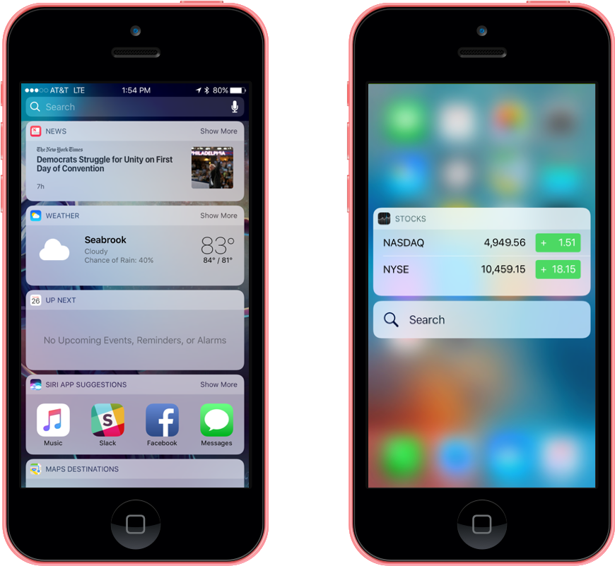

# Search and Home Screen Widget Enhancements in iOS 10

_This article covers the enhancements Apple has made to the Widget System in iOS 10._

Apple has introduced several enhancements to the Widget System to ensure that the widgets look great on any background that exists on the new iOS 10 Lock Screen. Additionally, widgets now contain a [NCWidgetDisplayMode](https://developer.apple.com/reference/notificationcenter/ncwidgetdisplaymode) property that allows the developer to describe how much content is available and allows the user to expand and collapse the content.

Widgets (also known as Today Extensions) are a special type of iOS Extension that display a small amount of useful information or expose app-specific functionality in a timely fashion. For example, the News app has a widget that shows the top headlines and the Calendar app provides two different widgets: one to display today's events and one to show the upcoming events.

Widgets are highly customizable and may contain UI elements such as text, images, buttons, etc. Additionally, the developer can further customize the layout of their widgets.

[](widgets-images/widgets01.png#lightbox)

There are two main places that a user can view and interact with an app's Widgets:

- **The Search Screen** - Users can add the Widgets they find most useful to their Search screen. The Search screen is accessed by swiping right on both the Home and Lock screens.
- **The Home Screen** - From the Home screen, the user can use 3D Touch to open the Quick Actions list by applying pressure to the app's icon. An app's Widgets will be displayed above the Quick Action List. Please see our [Introduction to 3D Touch](~/ios/platform/3d-touch.md) documentation for more information.

## Widgets Developer Suggestions

Ideally, the developer should always try and design Widgets that the user will want to add to their Search screens. To that end, Apple has the following suggestions:

- **Create a Great, Glanceable Experience** - User's want Widgets that provide brief, glanceable information of status updates or allow them to perform simple tasks quickly. This makes providing the right amount of information and interactivity an essential. Whenever possible, allow the user to perform a given task with a single tap. Additionally, since Widgets don't support panning or scrolling, this will have to be taken into consideration in the Widget's design.
- **Quickly Show Content** - Widgets are designed to be glanceable, so the user should never have to wait for content to load once a Widget is displayed. Widgets should cache their content locally so they can show recent content while fresh content is loading in the background.
- **Supply Appropriate Padding and Margins** - Widgets should never look crowded, so avoid extending content to the edges of a Widget's view. There should always be a several pixel wide margin between the edges and the content. Apple also suggests using the app's icon, displayed at the top of the Widget, as an alignment guide. If the Widget presents a grid layout, ensure that there is proper padding between the items in the grid and try to limit the number of items to four max.
- **Use Adaptable Layouts** - A Widget's width will vary based on the device it is running on and the device's orientation. A Widget's Height can also vary based on if it is being  displayed in a Collapsed (the default) or Expanded (not supported by all Widgets) state. A Collapsed Widget has a height of roughly two and a half standard iOS table rows. The developer can request the size for an Expanded Widget but it should ideally be less than the height of the screen. In the Collapsed state, the Widget should show only essential, stand-alone information. When Expanded, the Widget should show supplemental information that enhances the primary content shown in the Collapsed state. Widgets shown in the Quick Action List will only be in the Collapsed state.
- **Don't Customize the Widget's Background** - Widgets are displayed on a light, blurred background provided by the system. This is done to promote consistency between Widgets and improve the legibility of their content. Avoid using an image as a Widget background because it could clash with the user's Lock and Home Screen wallpapers.
- **Use the System Font in Black or Dark Gray** - When displaying text in a Widget, the System Font works best. The font should be in a black or dark gray color to stand out against the light, blurred Widget background.
- **Provide App Access When Appropriate** - Widget's should always operate separately from their app, however, if deeper functionality is required, the Widget should be able to launch the app to see or edit a specific piece of information. Never include an "open app" button, simply allow the user to tap the content itself and never open a 3rd party app.
- **Select a Clear, Concise Widget Name** - The app's icon and the Widget's name are always displayed over the Widget's content. Apple suggests using the App's name for its primary Widget and a clear, concise name for any others it provides. When providing a custom Widget Title, they should be prefixed with the app's name (such as Maps Nearby, Maps Restaurants, etc.).
- **Inform when Authentication Adds Value** - If additional functionality or information is available only when the user is authenticated and signed on, present this to the user. For example, a ride sharing app may say "Sign in to book ride".
- **Select a Quick Action List Widget** - If the app provides more than one Widget, the developer should choose the one to present when the user brings up the Quick Action List by applying pressure to the app's icon using 3D Touch.

For more details on working with widgets, please see our [Introduction to Extensions](~/ios/platform/extensions.md), [Introduction to 3D Touch](~/ios/platform/3d-touch.md) documentation and Apple's [App Extension Programming Guide](https://developer.apple.com/library/prerelease/content/documentation/General/Conceptual/ExtensibilityPG/index.html).

## Working with Vibrancy

Vibrancy ensures that a Widget's text stays legible when presented on the Widget's light, blurred background (supplied by the system). Prior to iOS 10, the developer would use a [NotificationCenterVibrancyEffect](https://developer.apple.com/reference/uikit/uivibrancyeffect/1613917-notificationcentervibrancyeffect) for the Widget's vibrancy. For example:

```csharp
// DEPRECATED: Get Widget Vibrancy Effect
var vibrancy = UIVibrancyEffect.CreateForNotificationCenter ();
```

This has be deprecated in iOS 10 and should be replaced with either a [WidgetPrimaryVibrancyEffect](https://developer.apple.com/reference/uikit/uivibrancyeffect/1771278-widgetprimaryvibrancyeffect) or a [WidgetSecondaryVibrancyEffect](https://developer.apple.com/reference/uikit/uivibrancyeffect/1771277-widgetsecondaryvibrancyeffect). For example:

```csharp
// Get Primary Widget Vibrancy Effect
var vibrancy = UIVibrancyEffect.CreatePrimaryVibrancyEffectForNotificationCenter ();

// Get Secondary Widget Vibrancy Effect
var vibrancy2 = UIVibrancyEffect.CreateSecondaryVibrancyEffectForNotificationCenter ();
```

## Working with Collapsed and Expanded Widgets

New to iOS 10, widgets now contain a [NCWidgetDisplayMode](https://developer.apple.com/reference/notificationcenter/ncwidgetdisplaymode) property that allows the developer to describe how much content is available and allows the user to expand and collapse the content.

When a Widget is initially shown, it is in a Collapsed state. A Collapsed Widget has a height of roughly two and a half standard iOS table rows. The developer can request the size for an Expanded Widget but it should ideally be less than the height of the screen.

In the Collapsed state, the Widget should show only essential, stand-alone information. When Expanded, the Widget should show supplemental information that enhances the primary content shown in the Collapsed state. For example, the Weather app shows the current weather conditions when collapsed, and adds the hourly forecast when expanded.

Widgets shown in the Quick Action List will only be in the Collapsed state. If the app provides more than one Widget, the developer should choose the one to present when the user brings up the Quick Action List by applying pressure to the app's icon using 3D Touch.

The following example is of a simple Today Extension (Widget) that handles the Collapsed and Expanded states:

```csharp
using System;
using NotificationCenter;
using Foundation;
using UIKit;
using CoreGraphics;

namespace MonkeyAbout
{
    public partial class TodayViewController : UIViewController, INCWidgetProviding
    {
        protected TodayViewController (IntPtr handle) : base (handle)
        {
            // Note: this .ctor should not contain any initialization logic.
        }

        public override void ViewDidLoad ()
        {
            base.ViewDidLoad ();

            // Tell widget it can be expanded
            ExtensionContext.SetWidgetLargestAvailableDisplayMode (NCWidgetDisplayMode.Expanded);

            // Get the maximum size
            var maxSize = ExtensionContext.GetWidgetMaximumSize (NCWidgetDisplayMode.Expanded);
        }

        [Export ("widgetPerformUpdateWithCompletionHandler:")]
        public void WidgetPerformUpdate (Action<NCUpdateResult> completionHandler)
        {
            // Take action based on the display mode
            switch (ExtensionContext.GetWidgetActiveDisplayMode()) {
            case NCWidgetDisplayMode.Compact:
                Content.Text = "Let's Monkey About!";
                break;
            case NCWidgetDisplayMode.Expanded:
                Content.Text = "Gorilla!!!!";
                break;
            }

            // Report results
            // If an error is encoutered, use NCUpdateResultFailed
            // If there's no update required, use NCUpdateResultNoData
            // If there's an update, use NCUpdateResultNewData
            completionHandler (NCUpdateResult.NewData);
        }

        [Export ("widgetActiveDisplayModeDidChange:withMaximumSize:")]
        public void WidgetActiveDisplayModeDidChange (NCWidgetDisplayMode activeDisplayMode, CGSize maxSize)
        {
            // Take action based on the display mode
            switch (activeDisplayMode) {
            case NCWidgetDisplayMode.Compact:
                PreferredContentSize = maxSize;
                Content.Text = "Let's Monkey About!";
                break;
            case NCWidgetDisplayMode.Expanded:
                PreferredContentSize = new CGSize (0, 200);
                Content.Text = "Gorilla!!!!";
                break;
            }
        }

    }
}
```

Take a look at the Widget Display Mode specific code in detail. To inform the system that this Widget supports the Expanded state, it uses:

```csharp
// Tell widget it can be expanded
ExtensionContext.SetWidgetLargestAvailableDisplayMode (NCWidgetDisplayMode.Expanded);
```

To get the Widget's current display mode, it uses:

```csharp
ExtensionContext.GetWidgetActiveDisplayMode()
```

To get the maximum size for either the Collapsed or Expanded state, it uses:

```csharp
// Get the maximum size
var maxSize = ExtensionContext.GetWidgetMaximumSize (NCWidgetDisplayMode.Expanded);
```

And to handle the state (Display Mode) changing, it uses:

```csharp
[Export ("widgetActiveDisplayModeDidChange:withMaximumSize:")]
public void WidgetActiveDisplayModeDidChange (NCWidgetDisplayMode activeDisplayMode, CGSize maxSize)
{
    // Take action based on the display mode
    switch (activeDisplayMode) {
    case NCWidgetDisplayMode.Compact:
        PreferredContentSize = maxSize;
        Content.Text = "Let's Monkey About!";
        break;
    case NCWidgetDisplayMode.Expanded:
        PreferredContentSize = new CGSize (0, 200);
        Content.Text = "Gorilla!!!!";
        break;
    }
}
```

In addition to setting the requested size for each state (Collapsed or Expanded), it also updates the content being displayed to match the new size.

## Summary

This article has covered the enhancements Apple has made to the Widget System in iOS 10 and shown how to implement them in Xamarin.iOS.

## Related Links

- [iOS 10 Samples](/samples/browse/?products=xamarin&term=Xamarin.iOS%2biOS10)
- [Introduction to Extensions](~/ios/platform/extensions.md)
- [Introduction to 3D Touch](~/ios/platform/3d-touch.md)
- [App Extension Programming Guide](https://developer.apple.com/library/prerelease/content/documentation/General/Conceptual/ExtensibilityPG/index.html)