# Implementing SiriKit in Xamarin.iOS

_This article covers the steps required to implement SiriKit support in a Xamarin.iOS apps._

New to iOS 10, SiriKit allows a Xamarin.iOS app to provide services that are accessible to the user using Siri and the Maps app on an iOS device. This article covers the steps required to implement SiriKit support in the Xamarin.iOS apps by adding the required Intents Extensions, Intents UI Extensions and Vocabulary.

Siri works with the concept of **Domains**, groups of know actions for related tasks. Each interaction that the app has with Siri must fall into one of its known service Domains as follows:

- Audio or video calling.
- Booking a ride.
- Managing workouts.
- Messaging.
- Searching photos.
- Sending or receiving payments.

When the user makes a request of Siri involving one of the App Extension's services, SiriKit sends the extension an **Intent** object that describes the user's request along with any supporting data. the App Extension then generates the appropriate **Response** object for the given **Intent**, detailing how the extension can handle the request.

This guide will present a quick example of including SiriKit support into an existing app. For the sake of this example, we'll be using the fake MonkeyChat app:

[](implementing-sirikit-images/monkeychat01.png#lightbox)

MonkeyChat keeps its own contact book of the user's friends, each associated with a screen name (like Bobo for example), and allows the user to send text chats to each friend by their screen name.

## Extending the App with SiriKit

As shown in the [Understanding SiriKit Concepts](~/ios/platform/sirikit/understanding-sirikit.md) guide, there are three main parts involved in extending an app with SiriKit:

[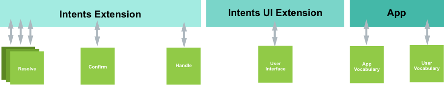](implementing-sirikit-images/elements01.png#lightbox)

These include:

1. **Intents Extension** - Verifies the users responses, confirms the app can handle the request and actually performs the task to fulfill the user's request.
2. **Intents UI Extension** - *Optional*, provides a custom UI to the responses in the Siri Environment and can bring the apps UI and branding into Siri to enrich the user's experience.
3. **App** - Provides the App with User specific vocabularies to assist Siri in working with it. 

All of these elements and the steps to include them in the app will be covered in detail in the sections below.

## Preparing the App

SiriKit is built on Extensions, however, before adding any Extensions to the app, there are a few things that the developer needs to do to help with the adoption of SiriKit.

### Moving Common Shared Code 

First, the developer can move some of the common code that will be shared between the app and the extensions into either _Shared Projects_, _Portable Class Libraries (PCLs)_ or _Native Libraries_.

The Extensions will need to be able to do all of the things that the app does. In the terms of the sample MonkeyChat app, things like finding contacts, adding new contacts, send messages and retrieve message history.

By moving this common code into a Shared Project, PCL or Native Library it makes it easy to maintain that code in one common place and ensures that the Extension and the parent app provide uniform experiences and functionality for the user.

In the case of the example app MonkeyChat, the data models and processing code such as network and database access will be moved into a Native Library.

Do the following:

<!-- markdownlint-disable MD001 -->

# [Visual Studio for Mac](#tab/macos)

1. Start Visual Studio for Mac and open the MonkeyChat app.
2. Right-click on the Solution Name in the **Solution Pad** and select **Add** > **New Project...**: 

    [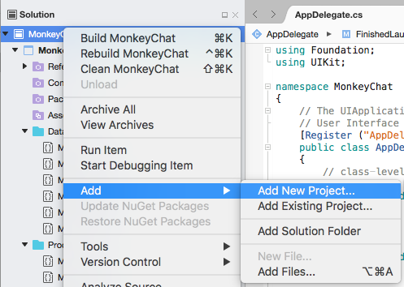](implementing-sirikit-images/prep01.png#lightbox)
3. Select **iOS** > **Library** > **Class Library** and click the **Next** button: 

    [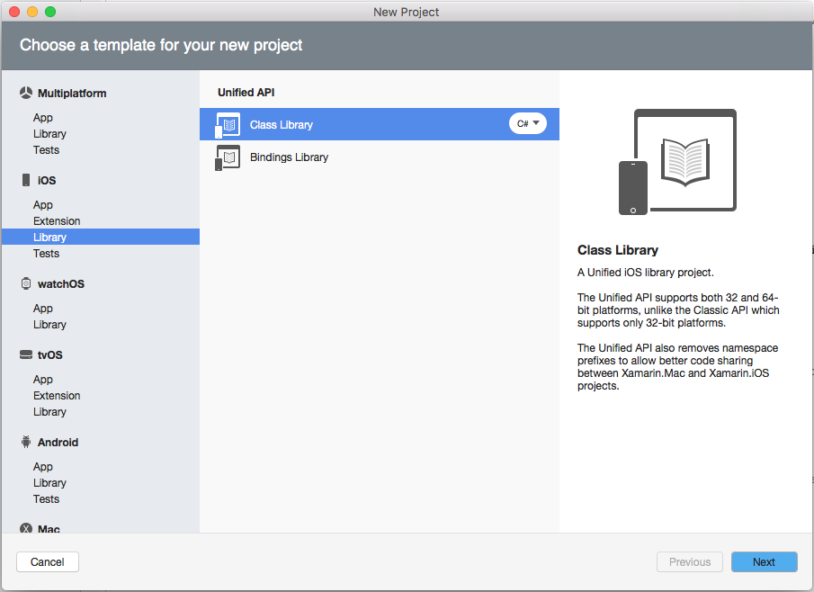](implementing-sirikit-images/prep02.png#lightbox)
4. Enter `MonkeyChatCommon` for the **Name** and click the **Create** button: 

    [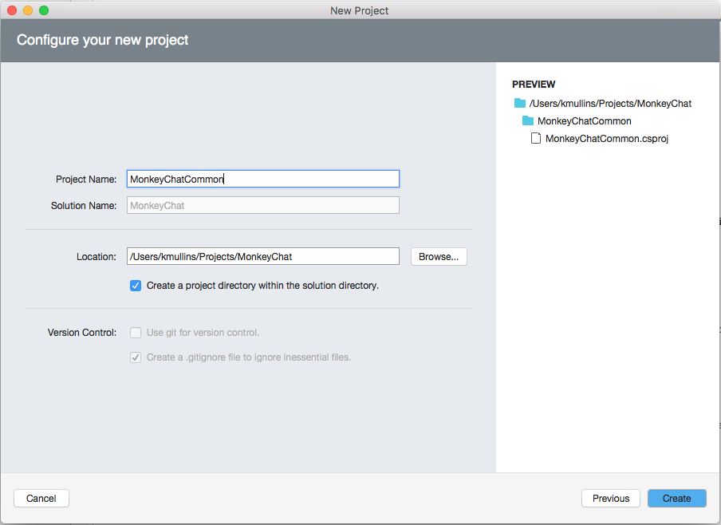](implementing-sirikit-images/prep03.png#lightbox)
5. Right-click on the **References** folder of the main app in the **Solution Explorer** and select **Edit References...**. Check the **MonkeyChatCommon** project and click the **OK** button: 

    [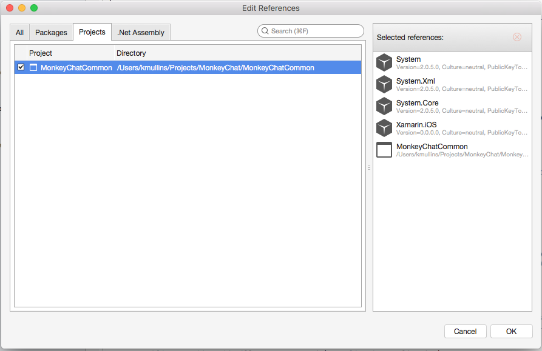](implementing-sirikit-images/prep05.png#lightbox)
6. In the **Solution Explorer**, drag the common shared code from the main app to the Native Library.
7. In the case of MonkeyChat, drag the **DataModels** and **Processors** folders from the main app into the Native Library: 

    [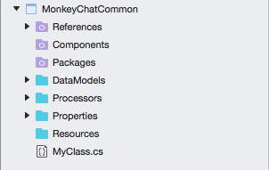](implementing-sirikit-images/prep06.png#lightbox)

# [Visual Studio](#tab/windows)

1. Start Visual Studio and open the MonkeyChat app.
2. Right-click on the Solution Name in the **Solution Explorer** and select **Add** > **New Project...**.
3. Select **Visual C#** > **Shared Project** and click the **Next** button: 

    [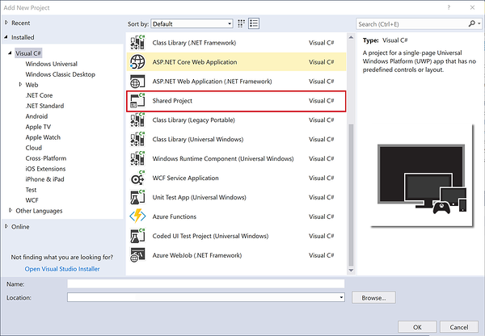](implementing-sirikit-images/prep02.w157.png#lightbox)
4. Enter `MonkeyChatCommon` for the **Name** and click the **Create** button.
5. Right-click on the **References** folder of the main app in the **Solution Explorer** and select **Edit References...**. Check the **MonkeyChatCommon** project and click the **OK** button: 

    [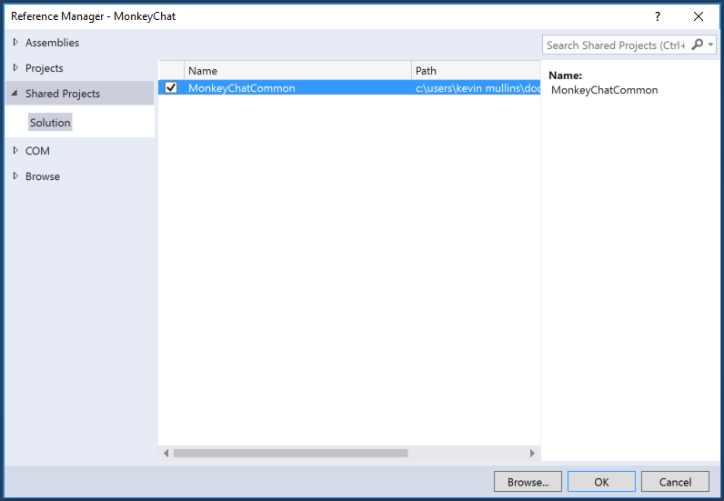](implementing-sirikit-images/prep05w.png#lightbox)
6. In the **Solution Explorer**, drag the common shared code from the main app to the Shared Project.
7. In the case of MonkeyChat, drag the **DataModels** and **Processors** folders from the main app into the Native Library.

-----

Edit any of the files that were moved to the Native Library and change the namespace to match that of the library. For example, changing `MonkeyChat` to `MonkeyChatCommon`:

```csharp
using System;
namespace MonkeyChatCommon
{
    /// <summary>
    /// A message sent from one user to another within a conversation.
    /// </summary>
    public class MonkeyMessage
    {
        public MonkeyMessage ()
        {
        }
        ...
    }
}
```

Next, go back to the main app and add a `using` statement for the Native Library's namespace anywhere the app uses one of the classes that have been moved:

```csharp
using System;
using System.Collections.Generic;
using UIKit;
using Foundation;
using CoreGraphics;
using MonkeyChatCommon;

namespace MonkeyChat
{
    public partial class MasterViewController : UITableViewController
    {
        public DetailViewController DetailViewController { get; set; }

        DataSource dataSource;
        ...
    }
}
```

### Architecting the App for Extensions

Typically, an app will sign up for multiple Intents and the developer needs to ensure that the app is architected for the appropriate number of Intent Extensions.

In the situation where an app requires more than one Intent, the developer has the option of placing all of its Intent handling in one Intent Extension or creating a separate Intent Extension for each Intent.

If choosing to create a separate Intent Extension for each Intent, the developer could end up duplicating a large amount of boilerplate code in each extension and create a large amount of processor and memory overhead.

To help choose between the two options, see if any of the Intents naturally belong together. For example, an app that made audio and video calls might want to include both of those Intents in a single Intent Extension as they are handling similar tasks and could provide the most code reuse.

For any Intent or group of Intents that don't fit into an existing group, create a new Intent Extension in the app's solution to contain them.

### Setting the Required Entitlements

Any Xamarin.iOS app that includes SiriKit integration, must have the correct entitlements set. If the developer doesn't set these required entitlements correctly, they will not be able to install or test the app on real iOS 10 (or greater) hardware, which is also requirement since the iOS 10 Simulator doesn't support SiriKit.

Do the following:

# [Visual Studio for Mac](#tab/macos)

1. Double-click the `Entitlements.plist` file in the **Solution Explorer** to open it for editing.
2. Switch to the **Source** tab.
3. Add the `com.apple.developer.siri` **Property**, set the **Type** to `Boolean` and the **Value** to `Yes`: 

    [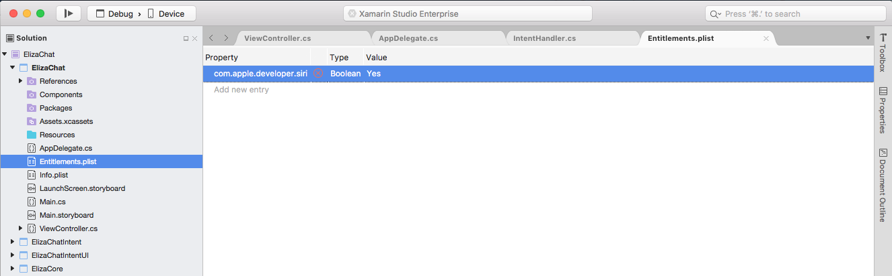](implementing-sirikit-images/setup01.png#lightbox)
4. Save the changes to the file.
5. Double-click the **Project File** in the **Solution Explorer** to open it for editing.
6. Select **iOS Bundle Signing** and ensure that the `Entitlements.plist` file is selected in the **Custom Entitlements** field: 

    [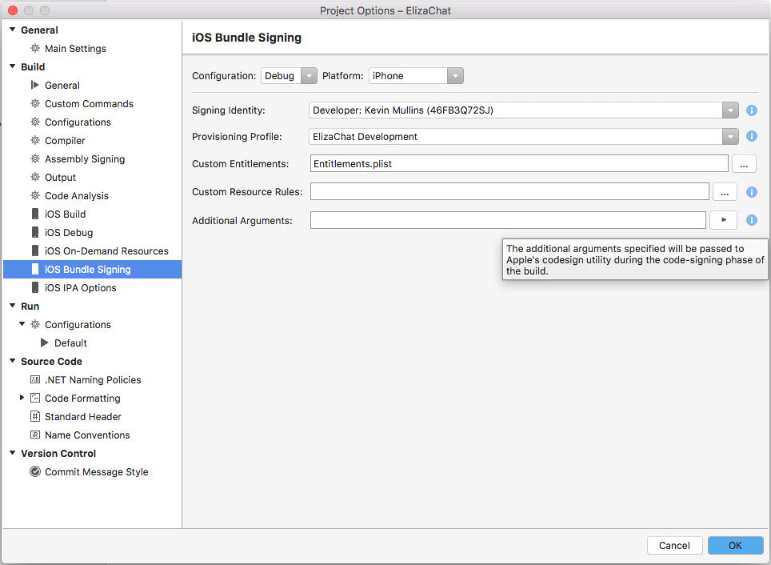](implementing-sirikit-images/setup02.png#lightbox)
7. Click the **OK** button to save the changes.

# [Visual Studio](#tab/windows)

1. Double-click the `Entitlements.plist` file in the **Solution Explorer** to open it for editing.
2. Add the `com.apple.developer.siri` **Property**, set the **Type** to `Boolean` and the **Value** to `Yes`: 

    [](implementing-sirikit-images/setup01w.png#lightbox)
3. Save the changes to the file.
4. Double-click the **Project File** in the **Solution Explorer** to open it for editing.
5. Select **iOS Bundle Signing** and ensure that the `Entitlements.plist` file is selected in the **Custom Entitlements** field.

-----

When finished, the app's `Entitlements.plist` file should look like the following (in opened in an external editor):

```xml
<?xml version="1.0" encoding="UTF-8"?>
<!DOCTYPE plist PUBLIC "-//Apple//DTD PLIST 1.0//EN" "http://www.apple.com/DTDs/PropertyList-1.0.dtd">
<plist version="1.0">
<dict>
    <key>com.apple.developer.siri</key>
    <true/>
</dict>
</plist>
```

### Correctly Provisioning the App

Because of the strict security that Apple has placed around the SiriKit framework, any Xamarin.iOS app that implements SiriKit _must_ have the correct App ID and Entitlements (see section above) and must be signed with a proper Provisioning Profile.

Do the following on your Mac:

1. In a web browser, navigate to [https://developer.apple.com](https://developer.apple.com) and log into your account.
2. Click on **Certificates**, **Identifiers** and **Profiles**.
3. Select **Provisioning Profiles** and select **App IDs**, then click the **+** button.
4. Enter a **Name** for the new Profile.
5. Enter a **Bundle ID** following Apple’s naming recommendation.
6. Scroll down to the **App Services** section, select **SiriKit** and click the **Continue** button: 

    [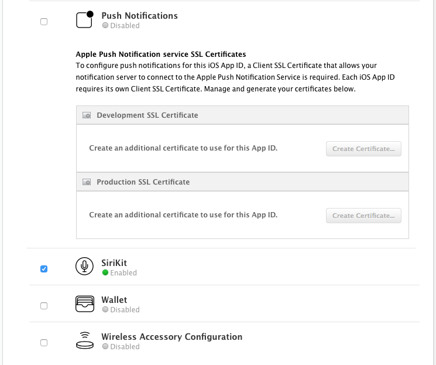](implementing-sirikit-images/setup03.png#lightbox)
7. Verify all of the settings, then **Submit** the App ID.
8. Select **Provisioning Profiles** > **Development**, click the **+** button, select the **Apple ID**, then click **Continue**.
9. Click Select **All**, then click **Continue**.
10. Click **Select All** again, then click **Continue**.
11. Enter a **Profile Name** using Apple’s naming suggestions, then click **Continue**.
12. Start Xcode.
13. From the Xcode menu select **Preferences…**
14. Select **Accounts**, then click the **View Details…** button: 

    [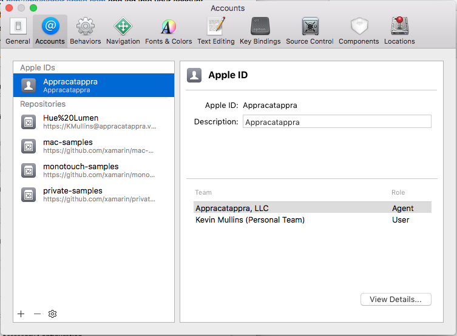](implementing-sirikit-images/setup04.png#lightbox)
15. Click the **Download All Profiles** Button in the lower left hand corner: 

    [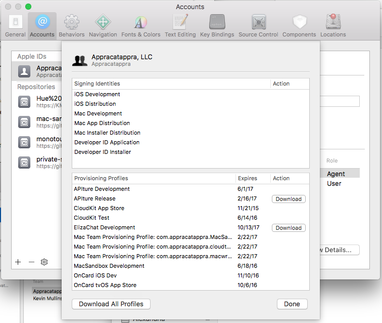](implementing-sirikit-images/setup05.png#lightbox)
16. Ensure that the **Provisioning Profile** created above has been installed in Xcode.
17. Open the project to add SiriKit support to in Visual Studio for Mac.
18. Double-click the `Info.plist` file in the **Solution Explorer**.
19. Ensure that the **Bundle Identifier** matches the one created in Apple's Developer Portal above: 

    [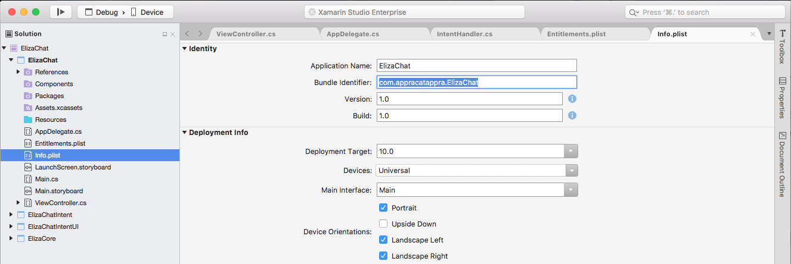](implementing-sirikit-images/setup06.png#lightbox)
20. In the **Solution Explorer**, select the **Project**.
21. Right-click the project and select **Options**.
22. Select **iOS Bundle Signing**, select the **Signing Identity** and **Provisioning Profile** created above: 

    [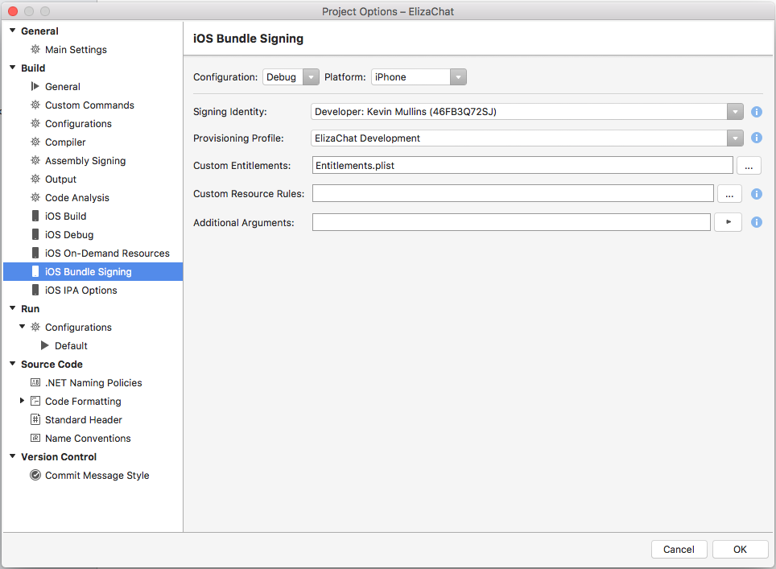](implementing-sirikit-images/setup07.png#lightbox)
23. Click the **OK** button to save the changes.

> [!IMPORTANT]
> Testing SiriKit only works on a real iOS 10 Hardware Device and not in the iOS 10 Simulator. If having issues installing a SiriKit enabled Xamarin.iOS app on real hardware, ensure that the required Entitlements, App ID, Signing Identifier and Provisioning Profile have been correctly configured in both Apple's Developer Portal and Visual Studio for Mac.

### Requesting Siri Authorization

Before the app adds any User Specific Vocabulary or the Intents Extensions connects to Siri, it must requests authorization from the user to access Siri.

# [Visual Studio for Mac](#tab/macos)

Edit the app's `Info.plist` file, switch to the **Source** view and add the `NSSiriUsageDescription` key with a string value describing how the app will use Siri and what types of data will be sent. For example, the MonkeyChat app might say "MonkeyChat contacts will be sent to Siri":

[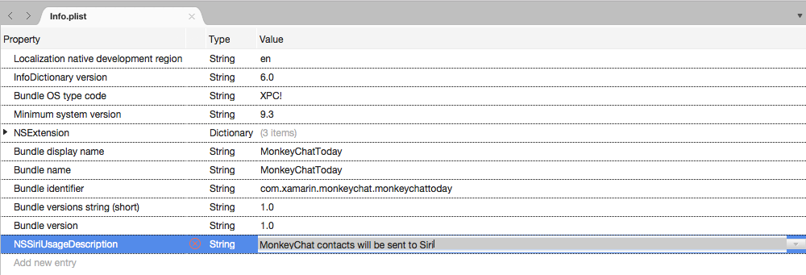](implementing-sirikit-images/request01.png#lightbox)

# [Visual Studio](#tab/windows)

Edit the app's `Info.plist` file and add the `NSSiriUsageDescription` key with a string value describing how the app will use Siri and what types of data will be sent. For example, the MonkeyChat app might say "MonkeyChat contacts will be sent to Siri":

[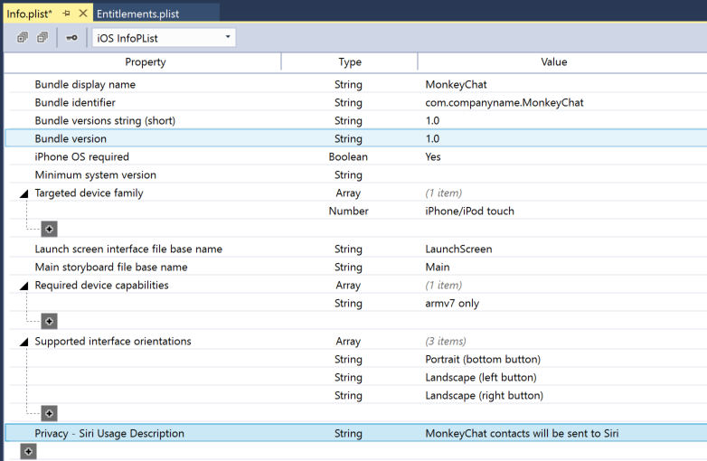](implementing-sirikit-images/request01w.png#lightbox)

-----

Call the `RequestSiriAuthorization` method of the `INPreferences` class when the app first starts. Edit the `AppDelegate.cs` class and make the `FinishedLaunching` method look like the following:

```csharp
using Intents;
...

public override bool FinishedLaunching (UIApplication application, NSDictionary launchOptions)
{

    // Request access to Siri
    INPreferences.RequestSiriAuthorization ((INSiriAuthorizationStatus status) => {
        // Respond to returned status
        switch (status) {
        case INSiriAuthorizationStatus.Authorized:
            break;
        case INSiriAuthorizationStatus.Denied:
            break;
        case INSiriAuthorizationStatus.NotDetermined:
            break;
        case INSiriAuthorizationStatus.Restricted:
            break;
        }
    });

    return true;
}
```

The first time this method is called, an alert is displayed prompting the user to allow the app to access Siri. The message that the developer added to the `NSSiriUsageDescription` above will be displayed in this alert. If the user initially denies access, they can use the **Settings** app to grant access to the app.

At any time, the app can check the app's ability to access Siri by calling the `SiriAuthorizationStatus` method of the `INPreferences` class.

### Localization and Siri

On an iOS device, the user is able to select a language for Siri that is different then the system default. When working with localized data, the app will need to use the `SiriLanguageCode` method of the `INPreferences` class to get the language code from Siri. For example:

```csharp
var language = INPreferences.SiriLanguageCode();

// Take action based on language
if (language == "en-US") {
    // Do something...
}
```

### Adding User Specific Vocabulary

The User Specific Vocabulary is going to provide words or phrases that are unique to individual users of the app. These will be provided at runtime from the main app (not the App Extensions) as an ordered set of terms, ordered in a most significant usage priority for the users, with the most important terms at the start of the list.

User Specific Vocabulary must belong to one of the following categories:

- Contact Names (that are not managed by the Contacts framework).
- Photo Tags.
- Photo Album Names.
- Workout Names.

When selecting terminology to register as custom vocabulary, only choose terms that might be misunderstood by someone not familiar with the app. Never register common terms such as "My Workout" or "My Album". For example, the MonkeyChat app will register the nicknames associated with each contact in the user's address book.

The app provides the User Specific Vocabulary by calling the `SetVocabularyStrings` method of the `INVocabulary` class and passing in a `NSOrderedSet` collection from the main app. The app should always call the `RemoveAllVocabularyStrings` method first, to remove any existing terms before adding new ones. For example:

```csharp
using System;
using System.Linq;
using System.Collections.Generic;
using Foundation;
using Intents;

namespace MonkeyChatCommon
{
    public class MonkeyAddressBook : NSObject
    {
        #region Computed Properties
        public List<MonkeyContact> Contacts { get; set; } = new List<MonkeyContact> ();
        #endregion

        #region Constructors
        public MonkeyAddressBook ()
        {
        }
        #endregion

        #region Public Methods
        public NSOrderedSet<NSString> ContactNicknames ()
        {
            var nicknames = new NSMutableOrderedSet<NSString> ();

            // Sort contacts by the last time used
            var query = Contacts.OrderBy (contact => contact.LastCalledOn);

            // Assemble ordered list of nicknames by most used to least
            foreach (MonkeyContact contact in query) {
                nicknames.Add (new NSString (contact.ScreenName));
            }

            // Return names
            return new NSOrderedSet<NSString> (nicknames.AsSet ());
        }

        // This method MUST only be called on a background thread!
        public void UpdateUserSpecificVocabulary ()
        {
            // Clear any existing vocabulary
            INVocabulary.SharedVocabulary.RemoveAllVocabularyStrings ();

            // Register new vocabulary
            INVocabulary.SharedVocabulary.SetVocabularyStrings (ContactNicknames (), INVocabularyStringType.ContactName);
        }
        #endregion
    }
}
```

With this code in place, it might be called as follows:

```csharp
using System;
using System.Threading;
using UIKit;
using MonkeyChatCommon;
using Intents;

namespace MonkeyChat
{
    public partial class ViewController : UIViewController
    {
        #region AppDelegate Access
        public AppDelegate ThisApp {
            get { return (AppDelegate)UIApplication.SharedApplication.Delegate; }
        }
        #endregion

        #region Constructors
        protected ViewController (IntPtr handle) : base (handle)
        {
            // Note: this .ctor should not contain any initialization logic.
        }
        #endregion

        #region Override Methods
        public override void ViewDidLoad ()
        {
            base.ViewDidLoad ();

            // Do we have access to Siri?
            if (INPreferences.SiriAuthorizationStatus == INSiriAuthorizationStatus.Authorized) {
                // Yes, update Siri's vocabulary
                new Thread (() => {
                    Thread.CurrentThread.IsBackground = true;
                    ThisApp.AddressBook.UpdateUserSpecificVocabulary ();
                }).Start ();
            }
        }

        public override void DidReceiveMemoryWarning ()
        {
            base.DidReceiveMemoryWarning ();
            // Release any cached data, images, etc that aren't in use.
        }
        #endregion
    }
}
```

> [!IMPORTANT]
> Siri treats custom vocabulary as hints and will incorporate as much of the terminology as possible. However, space for custom vocabulary is limited making it important to register _only_ the terminology that might be confusing, therefore keeping the total number of registered terms to a minimum.

For more information, please see our [User Specific Vocabulary Reference](~/ios/platform/sirikit/understanding-sirikit.md) and Apple's [Specifying Custom Vocabulary Reference](https://developer.apple.com/library/prerelease/content/documentation/Intents/Conceptual/SiriIntegrationGuide/SpecifyingCustomVocabulary.html#//apple_ref/doc/uid/TP40016875-CH6-SW1).

### Adding App Specific Vocabulary

The App Specific Vocabulary defines the specific words and phrases that will be known to all of the app's users, such as vehicle types or workout names. Because these are part of the application, they are defined in a `AppIntentVocabulary.plist` file as part of the main app bundle. Additionally, these words and phrases should be localized.

App Specific Vocabulary terms must belong to one of the following categories:

- Ride Options.
- Workout Names.

The App Specific Vocabulary file contains two root level keys:

- `ParameterVocabularies` **Required** - Defines the app's custom terms and Intent Parameters they apply to.
- `IntentPhrases` **Optional** - Contains example phrases using the custom terms defined in the `ParameterVocabularies`.

Each entry in the `ParameterVocabularies` must specify an ID string, term and the Intent that the term applies to. Additionally, a single term might apply to multiple Intents.

For a full list of acceptable values and required file structure, please see Apple's [App Vocabulary File Format Reference](https://developer.apple.com/library/prerelease/content/documentation/Intents/Conceptual/SiriIntegrationGuide/CustomVocabularyKeys.html#//apple_ref/doc/uid/TP40016875-CH10-SW1).

To add a `AppIntentVocabulary.plist` file to the app project, do the following:

# [Visual Studio for Mac](#tab/macos)

1. Right-click the Project Name in the **Solution Explorer** and select **Add** > **New File...** > **iOS**:

    [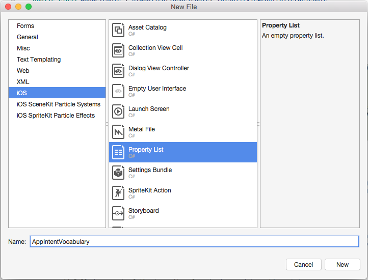](implementing-sirikit-images/plist01.png#lightbox)
2. Double-click the `AppIntentVocabulary.plist` file in the **Solution Explorer** to open it for editing.
3. Click the **+** to add a key, set the **Name** to `ParameterVocabularies` and the **Type** to `Array`:

    [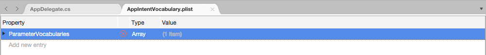](implementing-sirikit-images/plist02.png#lightbox)
4. Expand `ParameterVocabularies` and click the **+** button and set the **Type** to `Dictionary`:

    [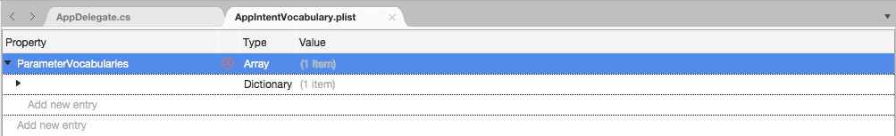](implementing-sirikit-images/plist03.png#lightbox)
5. Click the **+** to add a new key, set the **Name** to `ParameterNames` and the **Type** to `Array`:

    [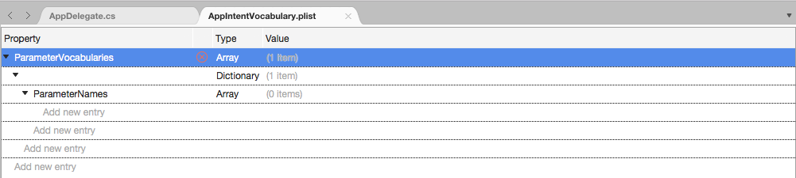](implementing-sirikit-images/plist04.png#lightbox)
6. Click the **+** to add a new key with the **Type** of `String` and the value as one of the available Parameter Names. For example, `INStartWorkoutIntent.workoutName`:

    [](implementing-sirikit-images/plist05.png#lightbox)
7. Add the `ParameterVocabulary` key to the `ParameterVocabularies` key with the **Type** of `Array`:

    [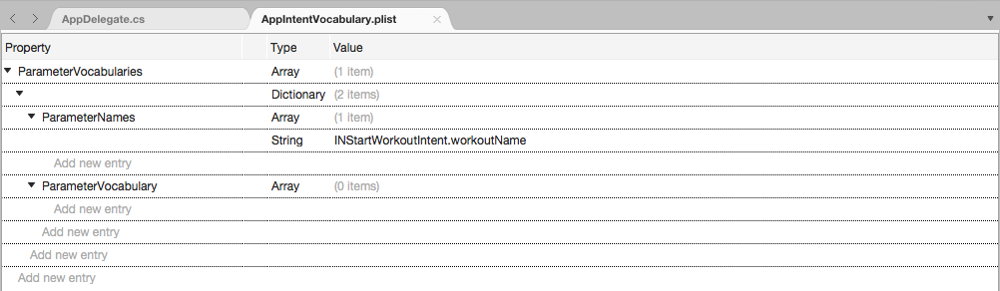](implementing-sirikit-images/plist06.png#lightbox)
8. Add a new key with the **Type** of `Dictionary`:

    [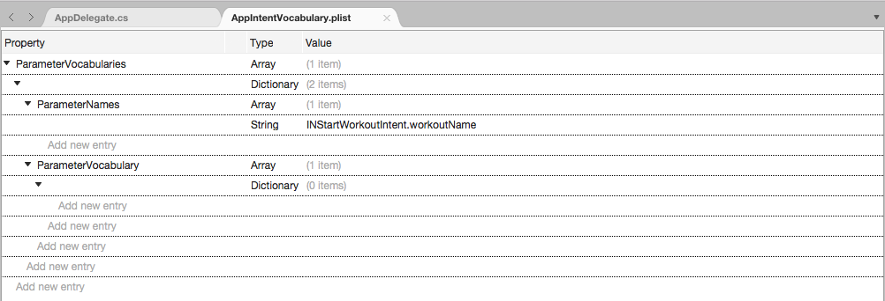](implementing-sirikit-images/plist07.png#lightbox)
9. Add the `VocabularyItemIdentifier` key with the **Type** of `String` and specify a unique ID for the term:

    [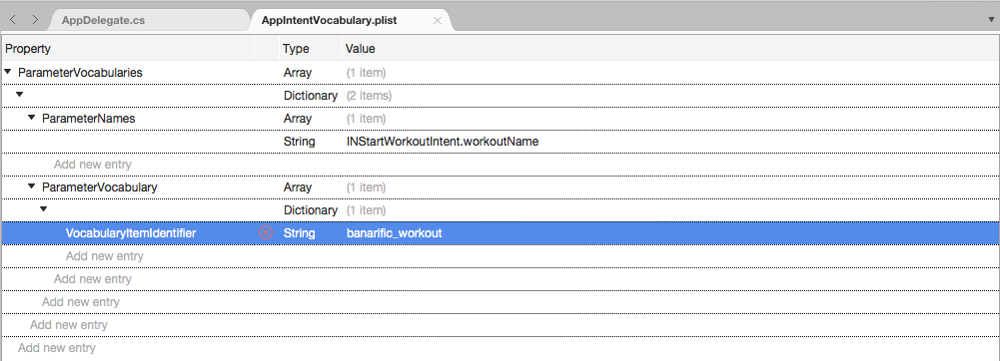](implementing-sirikit-images/plist08.png#lightbox)
10. Add the `VocabularyItemSynonyms` key with the **Type** of `Array`:

    [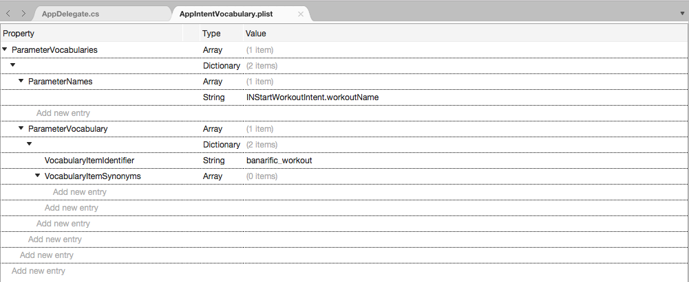](implementing-sirikit-images/plist09.png#lightbox)
11. Add a new key with the **Type** of `Dictionary`:

    [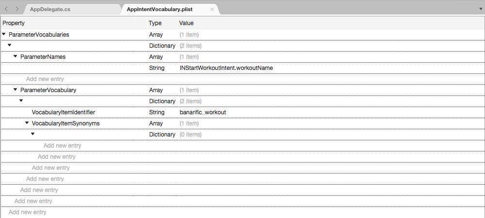](implementing-sirikit-images/plist10.png#lightbox)
12. Add the `VocabularyItemPhrase` key with the **Type** of `String` and the term the app are defining:

    [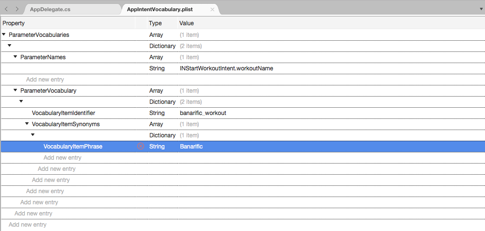](implementing-sirikit-images/plist11.png#lightbox)
13. Add the `VocabularyItemPronunciation` key with the **Type** of `String` and the phonetic pronunciation of the term:

    [](implementing-sirikit-images/plist12.png#lightbox)
14. Add the `VocabularyItemExamples` key with the **Type** of `Array`:

    [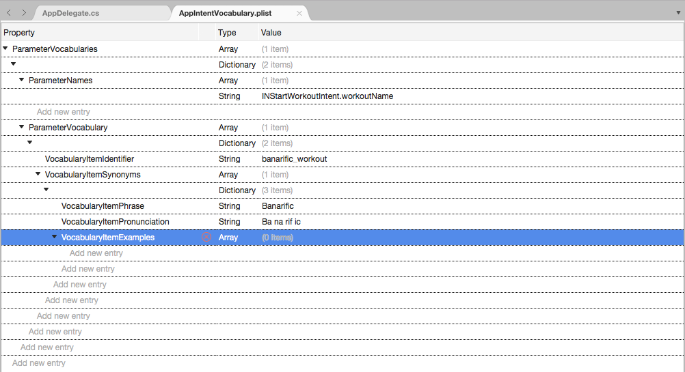](implementing-sirikit-images/plist13.png#lightbox)
15. Add a few `String` keys with example uses of the term:

    [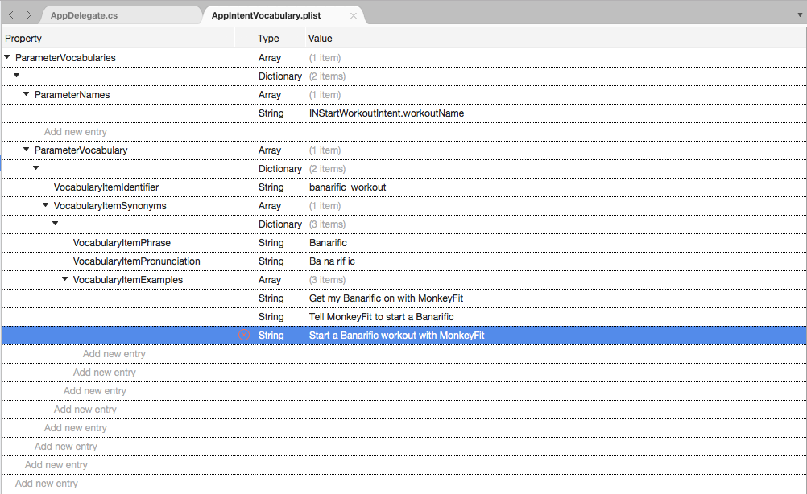](implementing-sirikit-images/plist14.png#lightbox)
16. Repeat the above steps for any other custom terms the app need to define.
17. Collapse the `ParameterVocabularies` key.
18. Add the `IntentPhrases` key with the **Type** of `Array`:

    [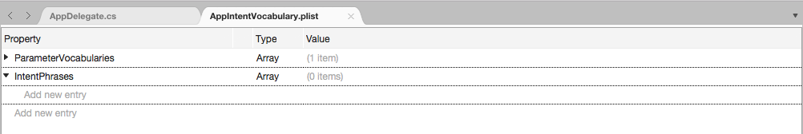](implementing-sirikit-images/plist15.png#lightbox)
19. Add a new key with the **Type** of `Dictionary`:

    [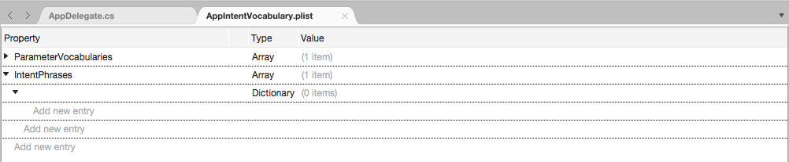](implementing-sirikit-images/plist16.png#lightbox)
20. Add the `IntentName` key with the **Type** of `String` and Intent for the example:

    [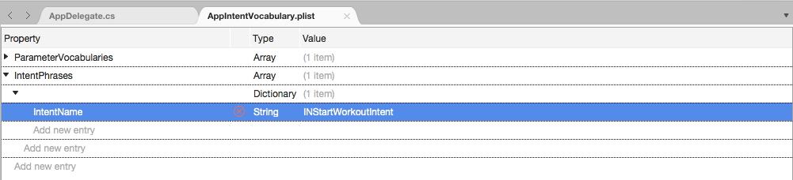](implementing-sirikit-images/plist17.png#lightbox)
21. Add the `IntentExamples` key with the **Type** of `Array`:

    [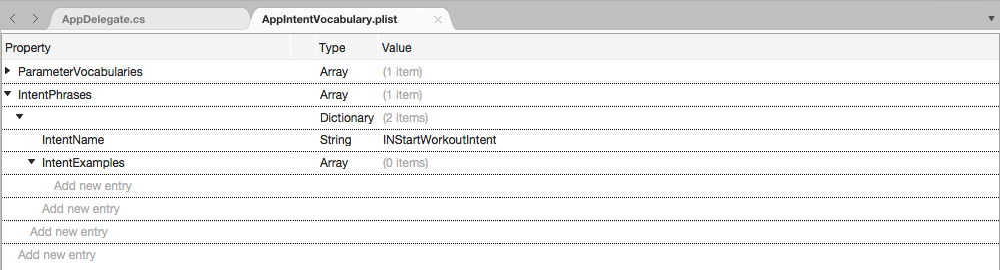](implementing-sirikit-images/plist18.png#lightbox)
22. Add a few `String` keys with example uses of the term:

    [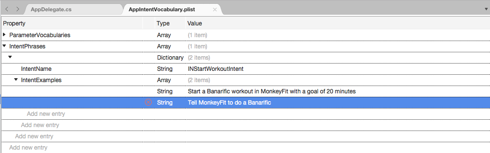](implementing-sirikit-images/plist19.png#lightbox)
23. Repeat the above steps for any Intents the app need to provide example usage of.

# [Visual Studio](#tab/windows)

1. Right-click the Project Name in the **Solution Explorer** and select **Add > New Item... > Apple > Property List > Info.plist**:

    [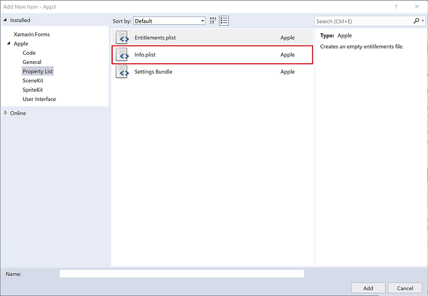](implementing-sirikit-images/plist01.w157.png#lightbox)

2. Double-click the `AppIntentVocabulary.plist` file in the **Solution Explorer** to open it for editing.
3. Click the **+** to add a key, set the **Name** to `ParameterVocabularies` and the **Type** to `Array`:

    [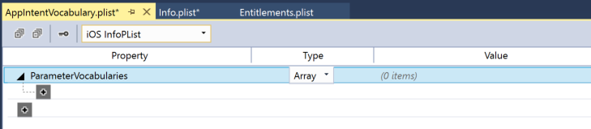](implementing-sirikit-images/plist02w.png#lightbox)
4. Expand `ParameterVocabularies` and click the **+** button and set the **Type** to `Dictionary`:

    [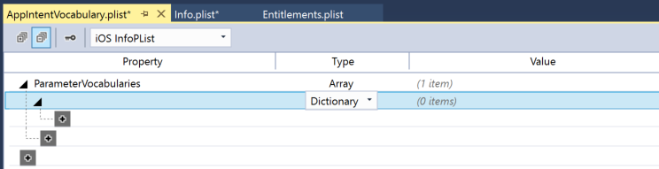](implementing-sirikit-images/plist03w.png#lightbox)
5. Click the **+** to add a new key, set the **Name** to `ParameterNames` and the **Type** to `Array`:

    [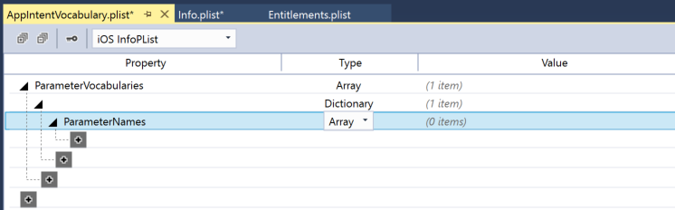](implementing-sirikit-images/plist04w.png#lightbox)
6. Click the **+** to add a new key with the **Type** of `String` and the value as one of the available Parameter Names. For example, `INStartWorkoutIntent.workoutName`:

    [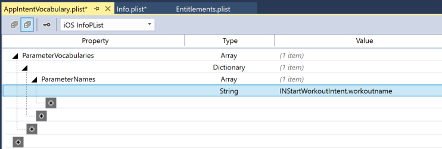](implementing-sirikit-images/plist05w.png#lightbox)
7. Add the `ParameterVocabulary` key to the `ParameterVocabularies` key with the **Type** of `Array`:

    [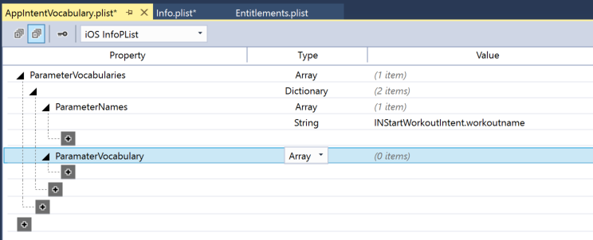](implementing-sirikit-images/plist06w.png#lightbox)
8. Add a new key with the **Type** of `Dictionary`:

    [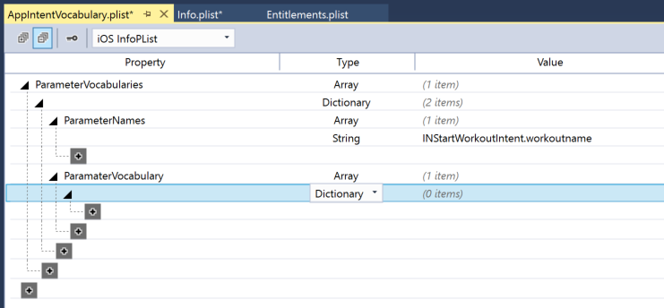](implementing-sirikit-images/plist07w.png#lightbox)
9. Add the `VocabularyItemIdentifier` key with the **Type** of `String` and specify a unique ID for the term:

    [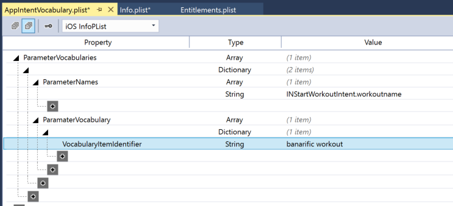](implementing-sirikit-images/plist08w.png#lightbox)
10. Add the `VocabularyItemSynonyms` key with the **Type** of `Array`:

    [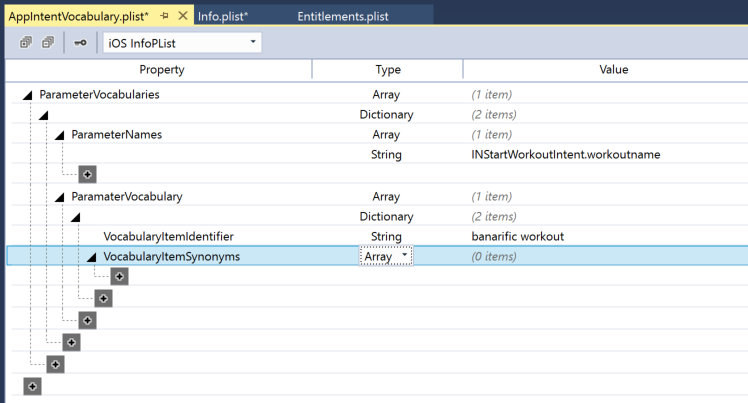](implementing-sirikit-images/plist09w.png#lightbox)
11. Add a new key with the **Type** of `Dictionary`:

    [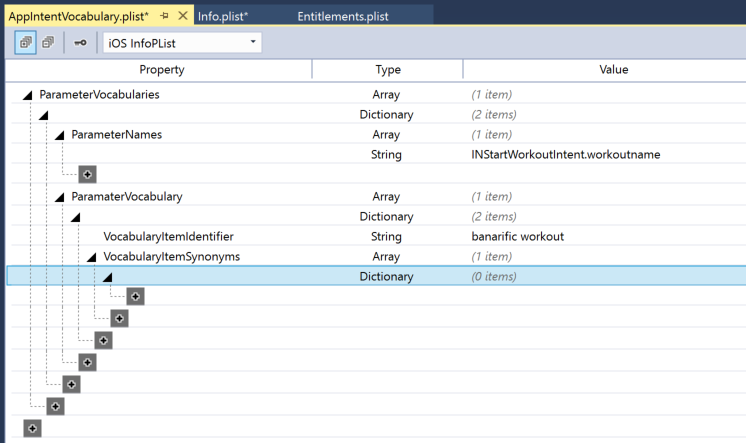](implementing-sirikit-images/plist10w.png#lightbox)
12. Add the `VocabularyItemPhrase` key with the **Type** of `String` and the term the app are defining:

    [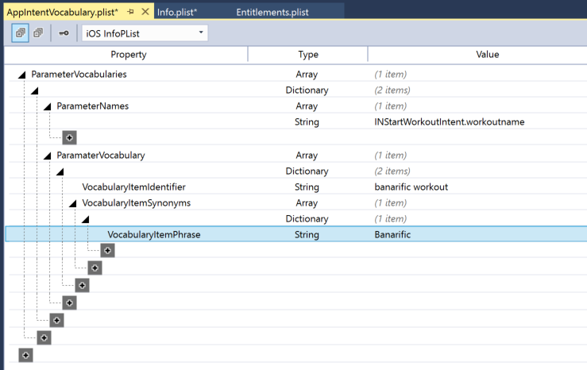](implementing-sirikit-images/plist11w.png#lightbox)
13. Add the `VocabularyItemPronunciation` key with the **Type** of `String` and the phonetic pronunciation of the term:

    [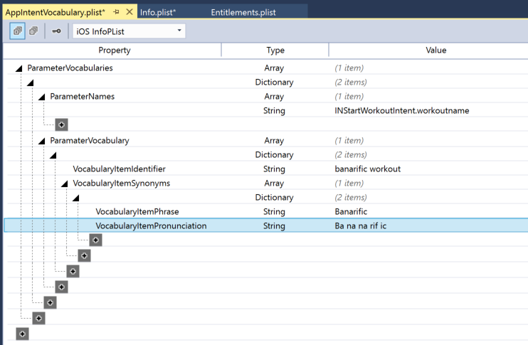](implementing-sirikit-images/plist12w.png#lightbox)
14. Add the `VocabularyItemExamples` key with the **Type** of `Array`:

    [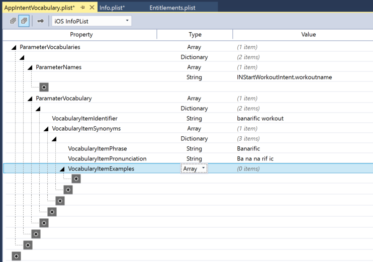](implementing-sirikit-images/plist13w.png#lightbox)
15. Add a few `String` keys with example uses of the term:

    [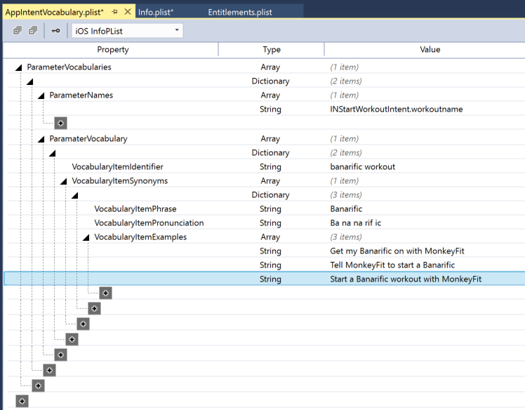](implementing-sirikit-images/plist14w.png#lightbox)
16. Repeat the above steps for any other custom terms the app need to define.
17. Collapse the `ParameterVocabularies` key.
18. Add the `IntentPhrases` key with the **Type** of `Array`:

    [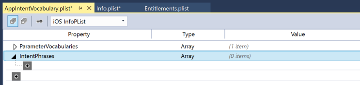](implementing-sirikit-images/plist15w.png#lightbox)
19. Add a new key with the **Type** of `Dictionary`:

    [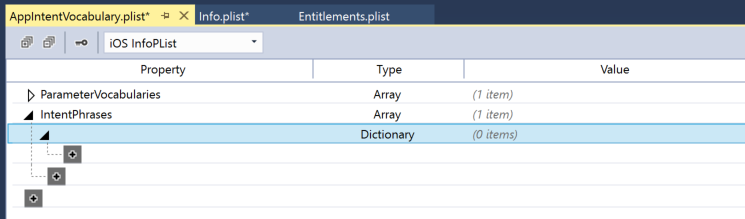](implementing-sirikit-images/plist16w.png#lightbox)
20. Add the `IntentName` key with the **Type** of `String` and Intent for the example:

    [](implementing-sirikit-images/plist17w.png#lightbox)
21. Add the `IntentExamples` key with the **Type** of `Array`:

    [](implementing-sirikit-images/plist18w.png#lightbox)
22. Add a few `String` keys with example uses of the term:

    [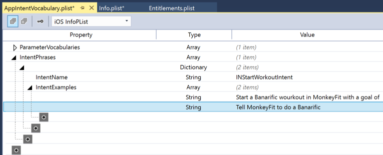](implementing-sirikit-images/plist19w.png#lightbox)
23. Repeat the above steps for any Intents the app need to provide example usage of.

-----

> [!IMPORTANT]
> The `AppIntentVocabulary.plist` will be registered with Siri on the test devices during development and it might take some time for Siri to incorporate the custom vocabulary. As a result, the tester will need to wait several minutes before attempting to test App Specific Vocabulary when it has been updated.

For more information, please see our [App Specific Vocabulary Reference](~/ios/platform/sirikit/understanding-sirikit.md) and Apple's [Specifying Custom Vocabulary Reference](https://developer.apple.com/library/prerelease/content/documentation/Intents/Conceptual/SiriIntegrationGuide/SpecifyingCustomVocabulary.html#//apple_ref/doc/uid/TP40016875-CH6-SW1).

## Adding an Intents Extension

Now that the app has been prepared to adopt SiriKit, the developer will need to add one (or more) Intents Extensions to the solution to handle the Intents required for Siri integration.

For each Intents Extension required, do the following:

- Add an Intents Extension project to the Xamarin.iOS app solution.
- Configure the Intents Extension `Info.plist` file.
- Modify the Intents Extension main class.

For more information, please see our [The Intents Extension Reference](~/ios/platform/sirikit/understanding-sirikit.md) and Apple's [Creating the Intents Extension reference](https://developer.apple.com/library/prerelease/content/documentation/Intents/Conceptual/SiriIntegrationGuide/CreatingtheIntentsExtension.html#//apple_ref/doc/uid/TP40016875-CH4-SW1).

### Creating the Extension

To add an Intents Extension to the solution, do the following:

# [Visual Studio for Mac](#tab/macos)

1. Right-click on the **Solution Name** in the **Solution Pad** and select **Add** > **Add New Project...**.
2. From the dialog box select **iOS** > **Extensions** > **Intent Extension** and click the **Next** button: 

    [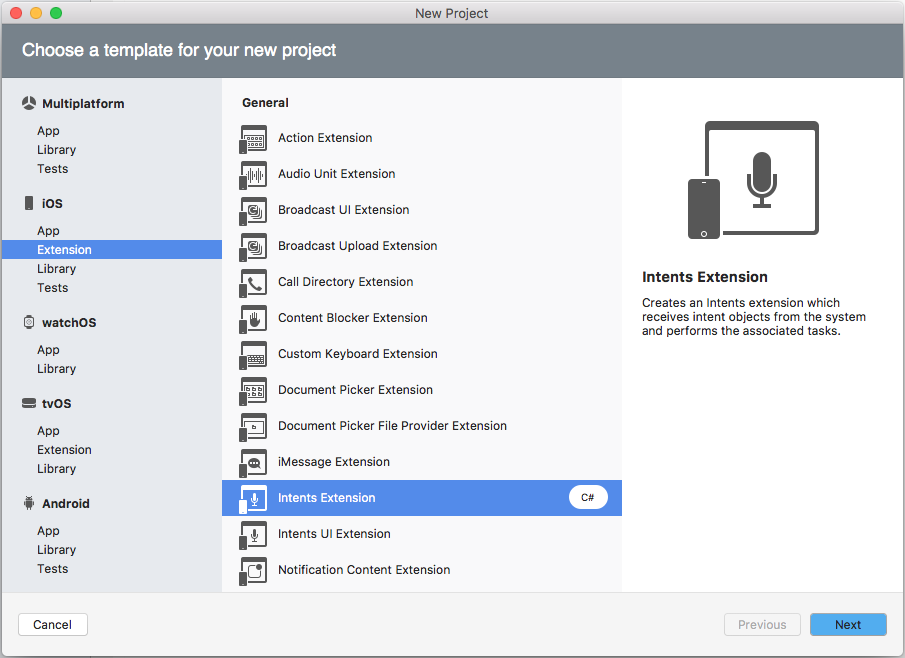](implementing-sirikit-images/intents05.png#lightbox)
3. Next enter a **Name** for the Intent Extension and click the **Next** button: 

    [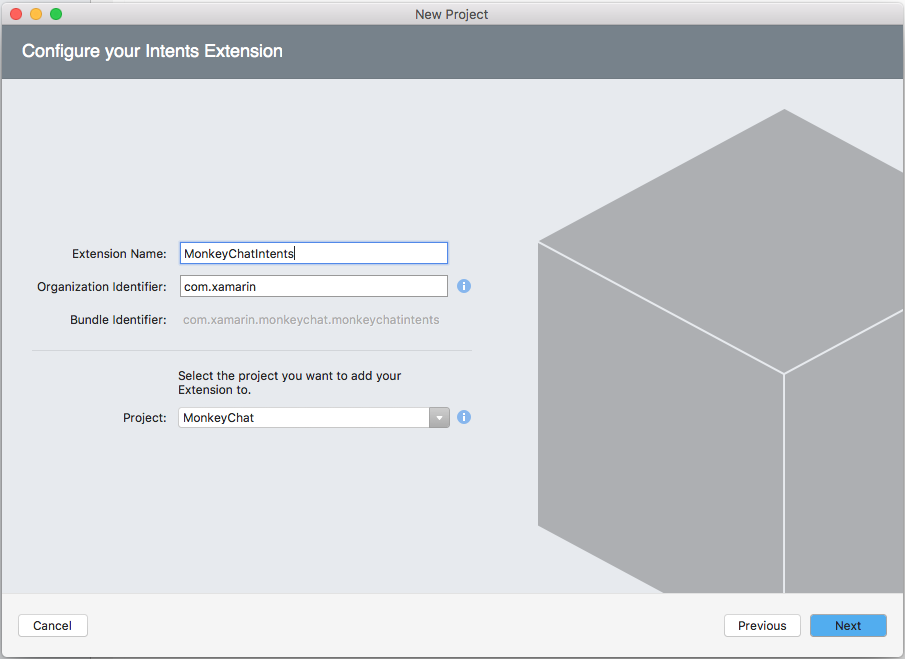](implementing-sirikit-images/intents06.png#lightbox)
4. Finally, click the **Create** button to add the Intent Extension to the apps solution: 

    [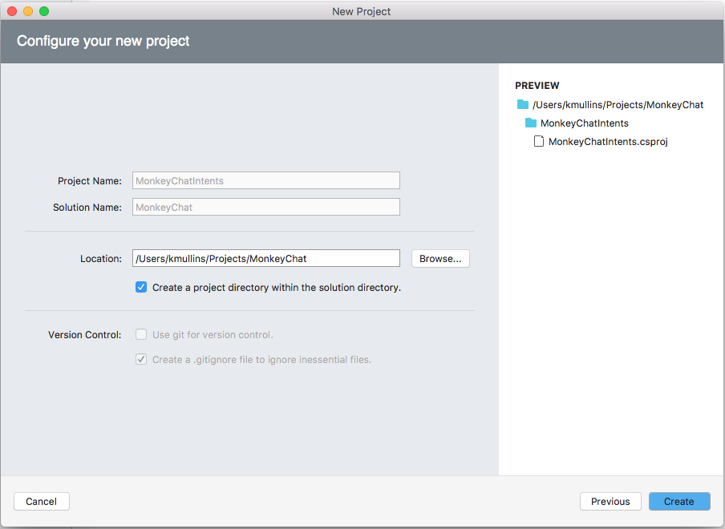](implementing-sirikit-images/intents07.png#lightbox)
5. In the **Solution Explorer**, right-click on the **References** folder of the newly created Intent Extension. Check the name of the common shared code library project (that the app created above) and click the **OK** button: 

    [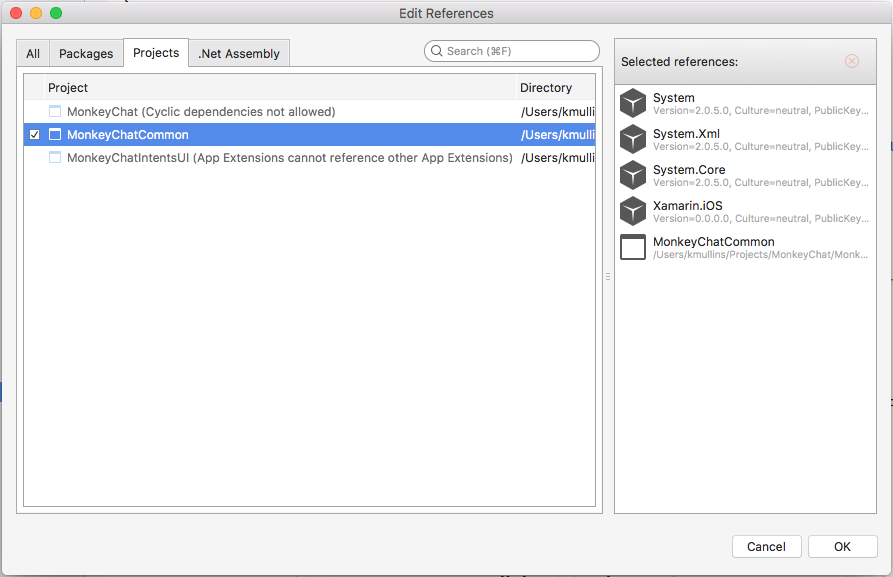](implementing-sirikit-images/intents08.png#lightbox)
    
# [Visual Studio](#tab/windows)

1. Right-click on the **Solution Name** in the **Solution Explorer** and select **Add** > **Add New Project...**.
2. From the dialog box select **Visual C# > iOS Extensions > Intent Extension** and click the **Next** button:

    [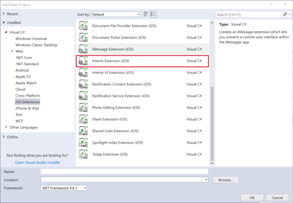](implementing-sirikit-images/intents05.w157.png#lightbox)
3. Next enter a **Name** for the Intent Extension and click the **OK** button.
4. In the **Solution Explorer**, right-click on the **References** folder of the newly-created Intents Extension and choose **Add > Reference**. Check the name of the common shared code library project (that the app created above) and click the **OK** button:

    [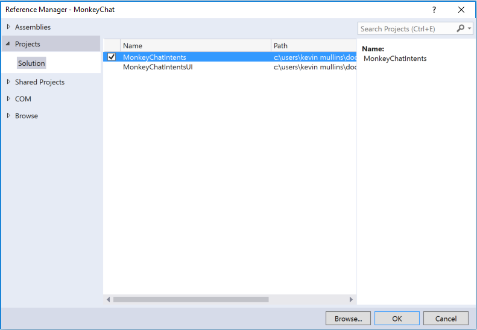](implementing-sirikit-images/intents08w.png#lightbox)
    
-----

Repeat these steps for the number of Intent Extensions (based on [Architecting the App for Extensions](#architecting-the-app-for-extensions) section above) that the app will require.

### Configuring the Info.plist

For each of the Intents Extensions that have added to the app's solution, must be configured in the `Info.plist` files to work with the app.

Just like any typical App Extension, the app will have the existing keys of `NSExtension` and `NSExtensionAttributes`. For an Intents Extension there are two new attributes that must be configured:

[](implementing-sirikit-images/intents01.png#lightbox)

- **IntentsSupported** - Is required and consists of an array of Intent Class names that the app wants to support from the Intent Extension.
- **IntentsRestrictedWhileLocked** - Is an optional key for the app to specify the extension's lock screen behavior. It consists of an array of Intent Class names that the app wants to require the user to be logged in to use from the Intent Extension.

To configure the Intent Extension's `Info.plist` file, double-click it in the **Solution Explorer** to open it for editing. Next, switch to the **Source** view then expand the `NSExtension` and `NSExtensionAttributes` keys in the editor:

# [Visual Studio for Mac](#tab/macos)

[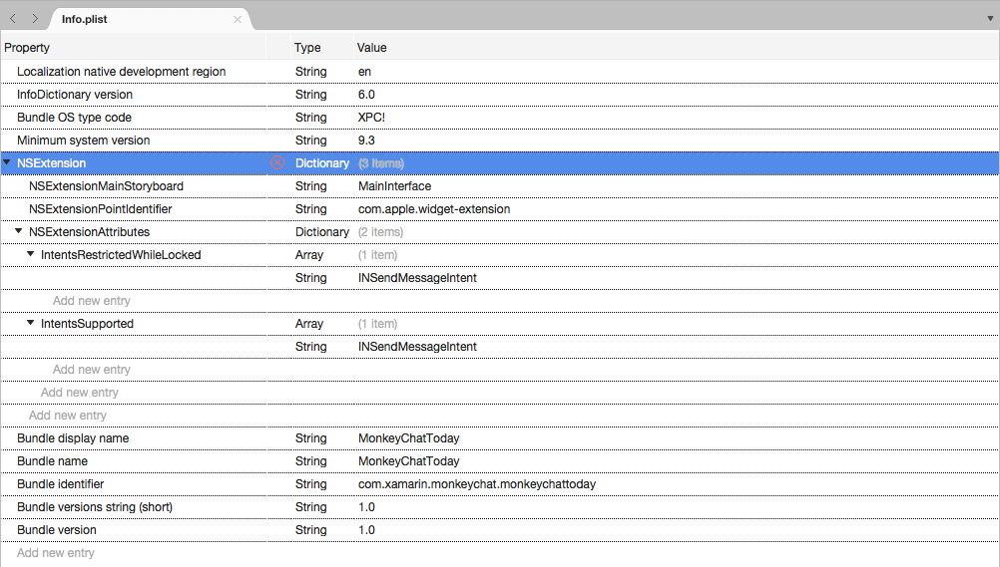](implementing-sirikit-images/intents02.png#lightbox)

# [Visual Studio](#tab/windows)

[](implementing-sirikit-images/intents02w.png#lightbox)

-----

Expand the `IntentsSupported` key and add the name of any Intent Class this extension will support. For the example MonkeyChat app, it supports the `INSendMessageIntent`:

# [Visual Studio for Mac](#tab/macos)

[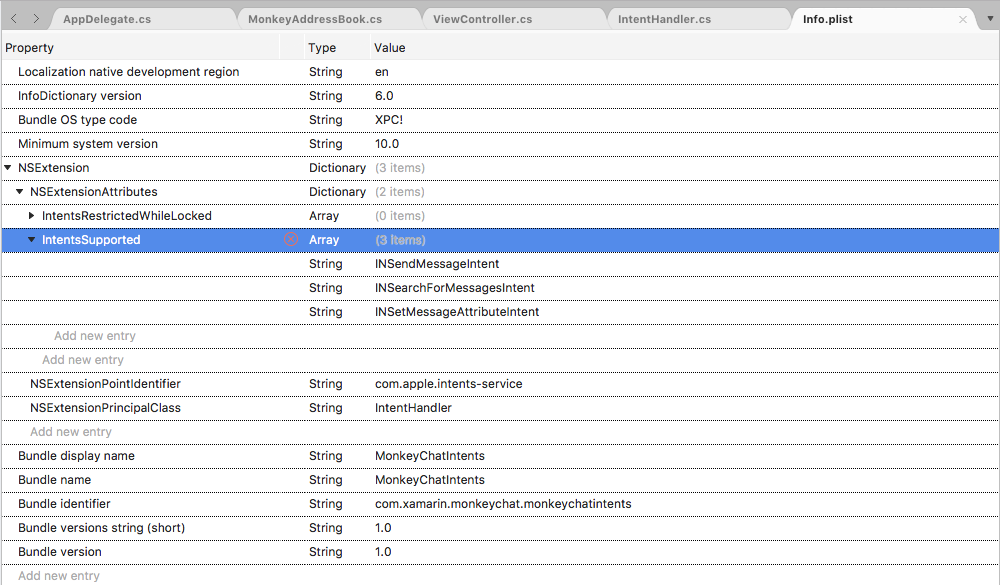](implementing-sirikit-images/intents09.png#lightbox)

# [Visual Studio](#tab/windows)

[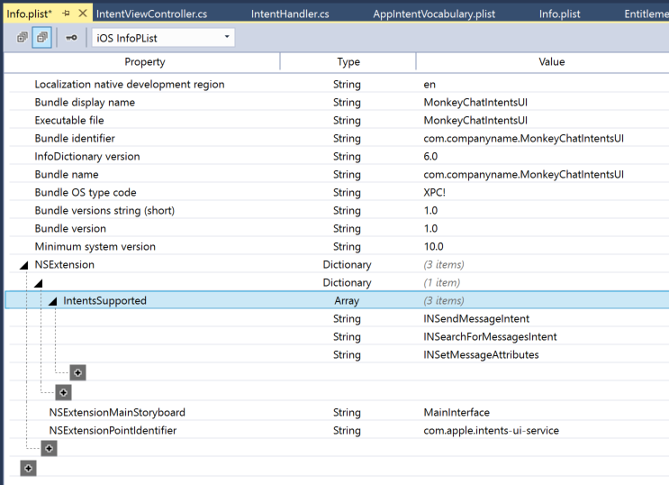](implementing-sirikit-images/intents09w.png#lightbox)

-----

If the app optionally requires that the user be logged on to the device to use a given intent, expand the `IntentRestrictedWhileLocked` key and add the Class names of the Intents that have restricted access. For the example MonkeyChat app, the user must be logged in to send a chat message so we have added `INSendMessageIntent`:

# [Visual Studio for Mac](#tab/macos)

[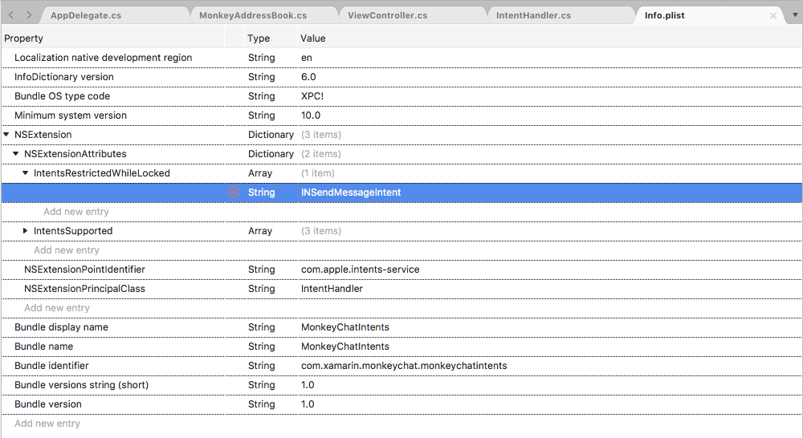](implementing-sirikit-images/intents10.png#lightbox)

# [Visual Studio](#tab/windows)

[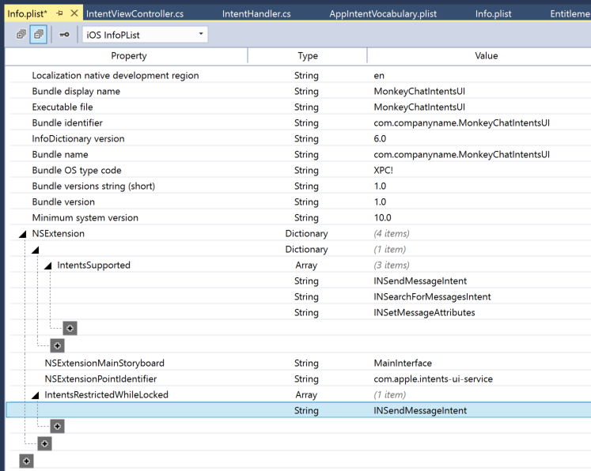](implementing-sirikit-images/intents10w.png#lightbox)

-----

For a complete list of available Intent Domains, please see Apple's [Intent Domains Reference](https://developer.apple.com/library/prerelease/content/documentation/Intents/Conceptual/SiriIntegrationGuide/SiriDomains.html#//apple_ref/doc/uid/TP40016875-CH9-SW2).

### Configuring the Main Class

Next, the developer will need to configure the main class that acts as the main entry point for the Intent Extension into Siri. It must be a subclass of `INExtension` which conforms to the `IINIntentHandler` delegate. For example:

```csharp
using System;
using System.Collections.Generic;

using Foundation;
using Intents;

namespace MonkeyChatIntents
{
    [Register ("IntentHandler")]
    public class IntentHandler : INExtension, IINSendMessageIntentHandling, IINSearchForMessagesIntentHandling, IINSetMessageAttributeIntentHandling
    {
        #region Constructors
        protected IntentHandler (IntPtr handle) : base (handle)
        {
            // Note: this .ctor should not contain any initialization logic.
        }
        #endregion

        #region Override Methods
        public override NSObject GetHandler (INIntent intent)
        {
            // This is the default implementation.  If you want different objects to handle different intents,
            // you can override this and return the handler you want for that particular intent.

            return this;
        }
        #endregion
        ...
    }
}
```

There is one solitary method that the app must implement on the Intent Extension main class, the `GetHandler` method. This method is passed an Intent by SiriKit and the app must return an **Intent Handler** that matches the type of the given Intent.

Since the example MonkeyChat app only handles one intent, it is returning itself in the `GetHandler` method. If the extension handled more than one intent, the developer would add a class for each intent type and return an instance here based on the `Intent` passed to the method.

### Handling the Resolve Stage

The Resolve Stage is where the Intent Extension will clarify and validate parameters passed in from Siri and have been set via the user's conversation.

For each parameter that gets sent from Siri, there is a `Resolve` method. The app will need to implement this method for every parameter that the app might need Siri's help to get the correct answer from the user.

In the case of the example MonkeyChat app, the Intent Extension will require a one or more recipients to send the message to. For each recipient in the list, the extension will need to do a contact search that can have the following outcome:

- Exactly one matching contact is found.
- Two or more matching contacts are found.
- No matching contacts are found.

Additionally, MonkeyChat requires content for the body of the message. If the user has not provided this, Siri needs to prompt the user for the content.

The Intent Extension will need to gracefully handle each of these cases.

```csharp
[Export ("resolveRecipientsForSearchForMessages:withCompletion:")]
public void ResolveRecipients (INSendMessageIntent intent, Action<INPersonResolutionResult []> completion)
{
    var recipients = intent.Recipients;
    // If no recipients were provided we'll need to prompt for a value.
    if (recipients.Length == 0) {
        completion (new INPersonResolutionResult [] { (INPersonResolutionResult)INPersonResolutionResult.NeedsValue });
        return;
    }

    var resolutionResults = new List<INPersonResolutionResult> ();

    foreach (var recipient in recipients) {
        var matchingContacts = new INPerson [] { recipient }; // Implement your contact matching logic here to create an array of matching contacts
        if (matchingContacts.Length > 1) {
            // We need Siri's help to ask user to pick one from the matches.
            resolutionResults.Add (INPersonResolutionResult.GetDisambiguation (matchingContacts));
        } else if (matchingContacts.Length == 1) {
            // We have exactly one matching contact
            resolutionResults.Add (INPersonResolutionResult.GetSuccess (recipient));
        } else {
            // We have no contacts matching the description provided
            resolutionResults.Add ((INPersonResolutionResult)INPersonResolutionResult.Unsupported);
        }
    }

    completion (resolutionResults.ToArray ());
}

[Export ("resolveContentForSendMessage:withCompletion:")]
public void ResolveContent (INSendMessageIntent intent, Action<INStringResolutionResult> completion)
{
    var text = intent.Content;
    if (!string.IsNullOrEmpty (text))
        completion (INStringResolutionResult.GetSuccess (text));
    else
        completion ((INStringResolutionResult)INStringResolutionResult.NeedsValue);
}
```

For more information, please see our [The Resolve Stage Reference](~/ios/platform/sirikit/understanding-sirikit.md) and Apple's [Resolving and Handling Intents Reference](https://developer.apple.com/library/prerelease/content/documentation/Intents/Conceptual/SiriIntegrationGuide/ResolvingandHandlingIntents.html#//apple_ref/doc/uid/TP40016875-CH5-SW1).

### Handling the Confirm Stage

The Confirm Stage is where the Intent Extension checks to see that it has all of the information to fulfill the user's request. The app wants to send confirmation along will all the supporting details of what is about to happen to Siri so it can be confirmed with the user that this is the intended action.

```csharp
[Export ("confirmSendMessage:completion:")]
public void ConfirmSendMessage (INSendMessageIntent intent, Action<INSendMessageIntentResponse> completion)
{
    // Verify user is authenticated and the app is ready to send a message.
    ...

    var userActivity = new NSUserActivity (nameof (INSendMessageIntent));
    var response = new INSendMessageIntentResponse (INSendMessageIntentResponseCode.Ready, userActivity);
    completion (response);
}
```

For more information, please see our [The Confirm Stage Reference](~/ios/platform/sirikit/understanding-sirikit.md).

### Processing the Intent

This is the point where the Intent Extension actually performs the task to fulfill the user's request and pass the results back to Siri so the user can be informed.

```csharp
public void HandleSendMessage (INSendMessageIntent intent, Action<INSendMessageIntentResponse> completion)
{
    // Implement the application logic to send a message here.
    ...

    var userActivity = new NSUserActivity (nameof (INSendMessageIntent));
    var response = new INSendMessageIntentResponse (INSendMessageIntentResponseCode.Success, userActivity);
    completion (response);
}

public void HandleSearchForMessages (INSearchForMessagesIntent intent, Action<INSearchForMessagesIntentResponse> completion)
{
    // Implement the application logic to find a message that matches the information in the intent.
    ...

    var userActivity = new NSUserActivity (nameof (INSearchForMessagesIntent));
    var response = new INSearchForMessagesIntentResponse (INSearchForMessagesIntentResponseCode.Success, userActivity);

    // Initialize with found message's attributes
    var sender = new INPerson (new INPersonHandle ("sarah@example.com", INPersonHandleType.EmailAddress), null, "Sarah", null, null, null);
    var recipient = new INPerson (new INPersonHandle ("+1-415-555-5555", INPersonHandleType.PhoneNumber), null, "John", null, null, null);
    var message = new INMessage ("identifier", "I am so excited about SiriKit!", NSDate.Now, sender, new INPerson [] { recipient });
    response.Messages = new INMessage [] { message };
    completion (response);
}

public void HandleSetMessageAttribute (INSetMessageAttributeIntent intent, Action<INSetMessageAttributeIntentResponse> completion)
{
    // Implement the application logic to set the message attribute here.
    ...

    var userActivity = new NSUserActivity (nameof (INSetMessageAttributeIntent));
    var response = new INSetMessageAttributeIntentResponse (INSetMessageAttributeIntentResponseCode.Success, userActivity);
    completion (response);
}
```

For more information, please see our [The Handle Stage Reference](~/ios/platform/sirikit/understanding-sirikit.md).

## Adding an Intents UI Extension

The optional Intents UI Extension presents the opportunity to bring the app's UI and branding into the Siri experience and make the users feel connected to the app. With this extension the app can bring the brand as well as visual and other information into the transcript.

[](implementing-sirikit-images/intentsui01.png#lightbox)

Just like the Intents Extension, the developer will do the following step for the Intents UI Extension:

- Add an Intents UI Extension project to the Xamarin.iOS app solution.
- Configure the Intents UI Extension `Info.plist` file.
- Modify the Intents UI Extension main class.

For more information, please see our [The Intents UI Extension Reference](~/ios/platform/sirikit/understanding-sirikit.md) and Apple's [Providing a Custom Interface Reference](https://developer.apple.com/library/prerelease/content/documentation/Intents/Conceptual/SiriIntegrationGuide/ProvidingaCustomInterface.html#//apple_ref/doc/uid/TP40016875-CH7-SW1).

### Creating the Extension

To add an Intents UI Extension to the solution, do the following:

# [Visual Studio for Mac](#tab/macos)

1. Right-click on the **Solution Name** in the **Solution Pad** and select **Add** > **Add New Project...**.
2. From the dialog box select **iOS** > **Extensions** > **Intent UI Extension** and click the **Next** button: 

    [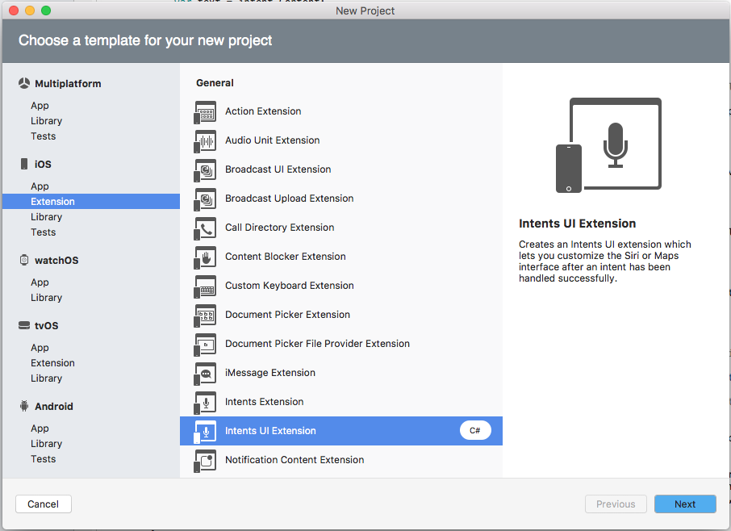](implementing-sirikit-images/intents11.png#lightbox)
3. Next enter a **Name** for the Intent Extension and click the **Next** button: 

    [](implementing-sirikit-images/intents12.png#lightbox)
4. Finally, click the **Create** button to add the Intent Extension to the apps solution: 

    [](implementing-sirikit-images/intents13.png#lightbox)
5. In the **Solution Explorer**, right-click on the **References** folder of the newly created Intent Extension. Check the name of the common shared code library project (that the app created above) and click the **OK** button: 

    [](implementing-sirikit-images/intents14.png#lightbox)
    
# [Visual Studio](#tab/windows)

1. Right-click on the **Solution Name** in the **Solution Explorer** and select **Add** > **Add New Project...**
2. From the dialog box select **iOS** > **Extensions** > **Intent UI Extension** and click the **Next** button.
3. Next enter a **Name** for the Intent Extension and click the **OK** button.
4. In the **Solution Explorer**, right-click on the **References** folder of the newly created Intent Extension. Check the name of the common shared code library project (that the app created above) and click the **OK** button.
    
-----

### Configuring the Info.plist

Configure the Intents UI Extension's `Info.plist` file to work with the app.

Just like any typical App Extension, the app will have the existing keys of `NSExtension` and `NSExtensionAttributes`. For an Intents Extension there is one new attribute that must be configured:

[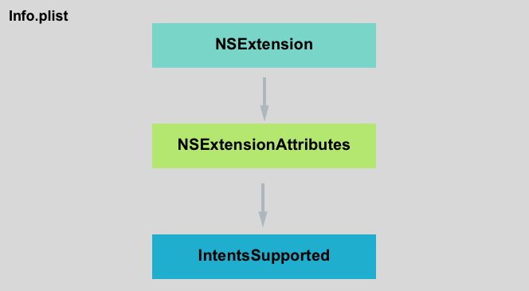](implementing-sirikit-images/intents03.png#lightbox)

**IntentsSupported** is required and consists of an array of Intent Class names that the app want to support from the Intent Extension.

# [Visual Studio for Mac](#tab/macos)

To configure the Intent UI Extension's `Info.plist` file, double-click it in the **Solution Explorer** to open it for editing. Next, switch to the **Source** view then expand the `NSExtension` and `NSExtensionAttributes` keys in the editor:

[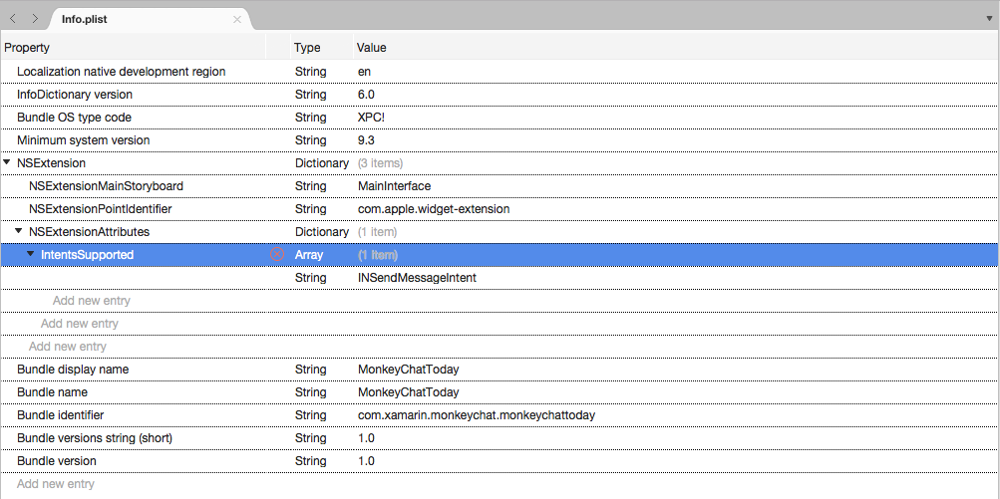](implementing-sirikit-images/intents04.png#lightbox)

# [Visual Studio](#tab/windows)

To configure the Intent UI Extension's `Info.plist` file, double-click it in the **Solution Explorer** to open it for editing. Expand the `NSExtension` and `NSExtensionAttributes` keys in the editor:

[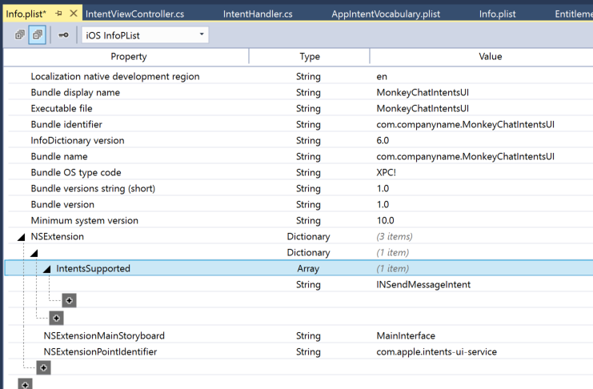](implementing-sirikit-images/intents04w.png#lightbox)

-----

Expand the `IntentsSupported` key and add the name of any Intent Class this extension will support. For the example MonkeyChat app, it supports the `INSendMessageIntent`:

# [Visual Studio for Mac](#tab/macos)

[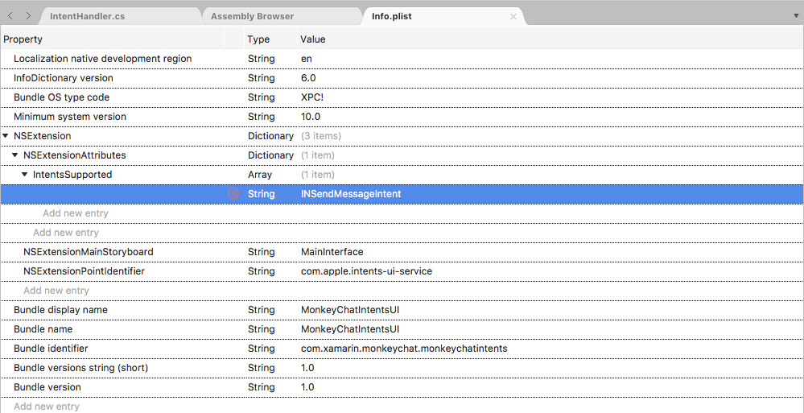](implementing-sirikit-images/intents15.png#lightbox)

# [Visual Studio](#tab/windows)

[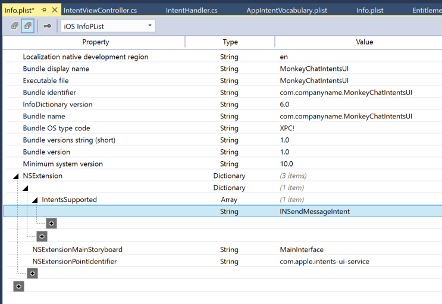](implementing-sirikit-images/intents15w.png#lightbox)

-----

For a complete list of available Intent Domains, please see Apple's [Intent Domains Reference](https://developer.apple.com/library/prerelease/content/documentation/Intents/Conceptual/SiriIntegrationGuide/SiriDomains.html#//apple_ref/doc/uid/TP40016875-CH9-SW2).

### Configuring the Main Class

Configure the main class that acts as the main entry point for the Intent UI Extension into Siri. It must be a subclass of `UIViewController` which conforms to the `IINUIHostedViewController` interface. For example:

```csharp
using System;
using Foundation;
using CoreGraphics;
using Intents;
using IntentsUI;
using UIKit;

namespace MonkeyChatIntentsUI
{
    public partial class IntentViewController : UIViewController, IINUIHostedViewControlling
    {
        #region Constructors
        protected IntentViewController (IntPtr handle) : base (handle)
        {
            // Note: this .ctor should not contain any initialization logic.
        }
        #endregion

        #region Override Methods
        public override void ViewDidLoad ()
        {
            base.ViewDidLoad ();

            // Do any required interface initialization here.
        }

        public override void DidReceiveMemoryWarning ()
        {
            // Releases the view if it doesn't have a superview.
            base.DidReceiveMemoryWarning ();

            // Release any cached data, images, etc that aren't in use.
        }
        #endregion

        #region Public Methods
        [Export ("configureWithInteraction:context:completion:")]
        public void Configure (INInteraction interaction, INUIHostedViewContext context, Action<CGSize> completion)
        {
            // Do configuration here, including preparing views and calculating a desired size for presentation.

            if (completion != null)
                completion (DesiredSize ());
        }

        [Export ("desiredSize:")]
        public CGSize DesiredSize ()
        {
            return ExtensionContext.GetHostedViewMaximumAllowedSize ();
        }
        #endregion
    }
}
```

Siri will pass a `INInteraction` class instance to the `Configure` method of the `UIViewController` instance inside of the Intent UI Extension.

The `INInteraction` object provides three key pieces of information to the extension:

1. The Intent object being processed.
2. The Intent Response object from the `Confirm` and `Handle` methods of the Intent Extension.
3. The Interaction State that defines the state of the interaction between the app and Siri.

The `UIViewController` instance is the principle class for the interaction with Siri and because it inherits from `UIViewController`, it has access to all of the features of UIKit.

When Siri calls the `Configure` method of the `UIViewController` it passes in a View Context stating that the View Controller will either be hosted in a Siri Snippit or Maps Card.

Siri will also pass in a completion handler that the app need to return the desired size of the view once the app have finished configuring it.

### Design the UI in iOS Designer

Layout the Intents UI Extension's user interface in the iOS Designer. Double-click the extension's `MainInterface.storyboard` file in the **Solution Explorer** to open it for editing. Drag in all of the required UI elements to build out the User Interface and save the changes.

> [!IMPORTANT]
> While it is possible to add interactive elements such as `UIButtons` or `UITextFields` to the Intent UI Extension's `UIViewController`, these are strictly forbidden as the Intent UI in non-interactive and the user will not be able to interact with them.

### Wire-Up the User Interface

With the Intents UI Extension's User Interface created in iOS Designer, edit the `UIViewController` subclass and override the `Configure` method as follows:

```csharp
[Export ("configureWithInteraction:context:completion:")]
public void Configure (INInteraction interaction, INUIHostedViewContext context, Action<CGSize> completion)
{
    // Do configuration here, including preparing views and calculating a desired size for presentation.
    ...

    // Return desired size
    if (completion != null)
        completion (DesiredSize ());
}

[Export ("desiredSize:")]
public CGSize DesiredSize ()
{
    return ExtensionContext.GetHostedViewMaximumAllowedSize ();
}
```

### Overriding the Default Siri UI

The Intents UI Extension will always be displayed along with other Siri content such as the app icon and name at the top of the UI or, based on the Intent, buttons (like Send or Cancel) may be displayed at the bottom.

There are a few instances where the app can replace the information that Siri is displaying to the user by default, such as messaging or maps where the app can replace the default experience with one tailored to the app.

If the Intents UI Extension needs to override elements of the default Siri UI, the `UIViewController` subclass will need to implement the `IINUIHostedViewSiriProviding` interface and opt-in to displaying a particular interface element.

Add the following code to the `UIViewController` subclass to tell Siri that the Intent UI Extension is already displaying the message contents:

```csharp
public bool DisplaysMessage {
    get {return true;}
}
```

### Considerations

Apple suggests that the developer take the following considerations into account when designing and implementing the Intent UI Extensions:

- **Be Conscious of Memory Usage** - Because Intent UI Extensions are temporary and only shown for a short time, the system imposes tighter memory constraints than are used with a full app.
- **Consider Minimum and Maximum View Sizes** - Ensure that the Intent UI Extensions looks good on every iOS device type, size and orientation. Additionally, the desired size that the app sends back to Siri might not be able to be granted.
- **Use Flexible and Adaptive Layout Patterns** - Again, to ensure that the UI looks great on every device.

## Summary

This article has covered SiriKit and shown how it can be added to the Xamarin.iOS apps to provide services that are accessible to the user using Siri and the Maps app on an iOS device.

## Related Links

- [ElizaChat Sample](/samples/xamarin/ios-samples/ios10-elizachat)
- [SiriKit Programming Guide](https://developer.apple.com/library/prerelease/content/documentation/Intents/Conceptual/SiriIntegrationGuide/index.html)
- [Intents Framework Reference](https://developer.apple.com/reference/intents)
- [Intents UI Framework Reference](https://developer.apple.com/reference/intentsui)
- [Intent Domains Reference](https://developer.apple.com/library/prerelease/content/documentation/Intents/Conceptual/SiriIntegrationGuide/SiriDomains.html#//apple_ref/doc/uid/TP40016875-CH9-SW2)