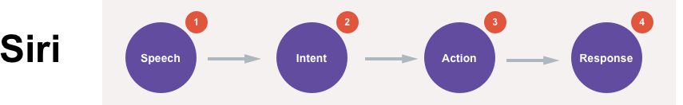
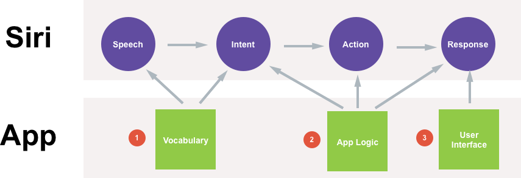
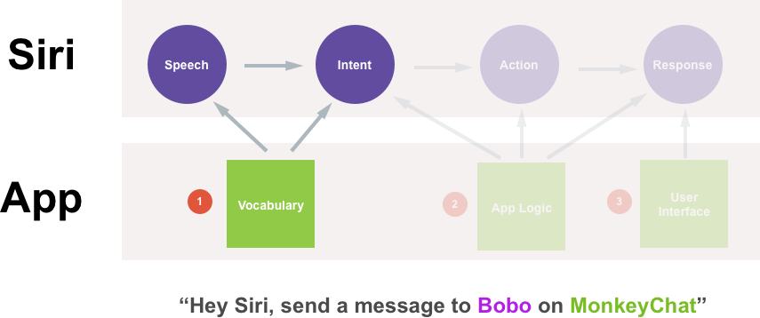
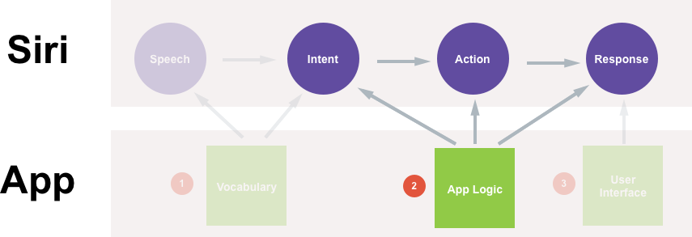
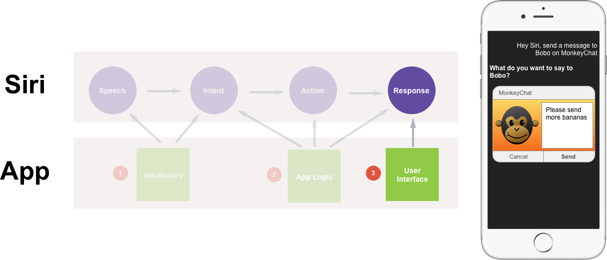
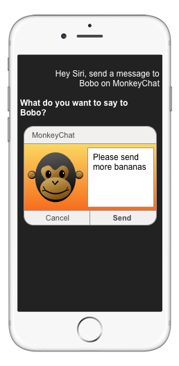

# Understanding SiriKit Concepts

_This article covers the key concepts that will be required for working with SiriKit in a Xamarin.iOS app._

New to iOS 10, SiriKit allows a Xamarin.iOS app to provide services that are accessible to the user using Siri and the Maps app on an iOS device. This functionality is provided in one or more App Extension using the new **Intents** and **Intents UI** frameworks.

SiriKit allows an iOS app to provide services that are accessible to the user using Siri and the Maps app on an iOS device using App Extensions and the new **Intents** and **Intents UI** frameworks.

Siri works with the concept of **Domains**, groups of know actions for related tasks. Each interaction that the app has with Siri must fall into one of its known service Domains as follows:

- Audio or video calling.
- Booking a ride.
- Managing workouts.
- Messaging.
- Searching photos.
- Sending or receiving payments.

When the user makes a request of Siri involving one of the App Extension's services, SiriKit sends the extension an **Intent** object that describes the user's request along with any supporting data. The App Extension then generates the appropriate **Response** object for the given **Intent**, detailing how the extension can handle the request.

## The Intents and Intents UI Extensions

Both Siri and the Maps app interact with the app's services via two different types of App Extensions:

- **Intents Extension** - Provides Siri and Maps with the app's content and performs the tasks required to fulfill any supported intents.
- **Intents UI Extension** - Provides a custom UI that will be displayed for the app's content inside of either Siri or Maps.

The app must provide an Intents Extension to support SiriKit and it is responsible for providing information that Siri and Maps can present to the user and for handling Intents.

Creating an Intents UI Extension is optional since Siri usually handles all user interaction, and has a standard, built-in UI for presenting information in each of the supported domains. By providing an Intents UI Extension, the app can use the **Intent UI** framework to present a rich, custom User Interface featuring the app's branding and additional information.

## Siri and the Maps App Role

The user's spoken requests are language processed and semantically analyzed by Siri which turns those requests into actionable Intents that the Intent Extensions can handle.

Maps uses the app's Intent Extensions to display information in the Map interface in response to user's actions. Such as requesting nearby restaurants or getting the app's restaurant reviews.

Both Siri and Maps manage all of the user's interactions and display results using the standard system interface. The app extensions role is primarily to provide the data that gets displayed. Optionally, the app can provide an Intents UI Extension and present a custom UI to enhance the default system interface.

## Interacting with Siri Via SiriKit

This section will present an overview of how SiriKit allows the user to interact with the app using Siri. For the sake of this example, we'll be using the fake MonkeyChat app:

[](understanding-sirikit-images/monkeychat01.png#lightbox)

MonkeyChat keeps its own contact book of the user's friends, each associated with a screen name (like Bobo for example), and allows the user to send text chats to each friend by their screen name.

There are many ways that the user might initiate an interaction with the app, since different people might make the same request in many different forms.

For example, if the user wanted to send a message to their friend Bobo, they might have the following conversation with Siri:

_User: Hey Siri, send a MonkeyChat message._<br />
_Siri: To whom?_<br />
_User: Bobo._<br />
_Siri: What do you want to say to Bobo?_<br />
_User: Please send more Bananas._<br />

Another person might make the same request with a different conversation:

_User: Send a message to Bobo on MonkeyChat._<br />
_Siri: What do you want to say to Bobo?_<br />
_User: Please send more bananas._<br />

And another user might make an even shorter request:

_User: MonkeyChat Bobo please send more bananas._<br />
_Siri: Ok, sending message please send more bananas to Bobo on Monkeychat._<br />

Or even make the same request in a different language:

_User: MonkeyChat Bobo s’il vous plaît envoyer plus de bananes._<br />
_Siri: Oui, envoi message s’il vous plaît envoyer plus de bananes à Bobo sur Monkeychat._<br />

Yet another user might be very verbose in their conversation:

_User: Hey Siri, can you please do me a favor and launch the MonkeyChat app to send a text with the message please send more bananas._<br />
_Siri: To whom?_<br />
_User: My best pal Bobo._<br />

Additionally, there are many ways that Siri might respond to a request, some based on how the request was made:

- **By Holding the Home Button** - Siri will provide more visual responses with limited verbal feedback.
- **By "Hey Siri"** - Siri will be more verbal and provide fewer visual responses.

Siri is also tuned to meet the accessibility needs of the user and will interact and respond based on those needs.

No matter how a request is made or how Siri responds to the request, Siri handles the conversation with the user and the app (via its Extensions) provides the functionality.

When the user makes a verbal request of Siri, these are the steps that Siri will follow:

[](understanding-sirikit-images/monkeychat02.png#lightbox)

1. First, Siri takes the audio of the user's **Speech** and converts it into text.
2. Next, the text is converted into an **Intent**, a structured representation of the user's request.
3. Based on the Intent, Siri will take **Action** to perform the user's request.
4. Finally, Siri will present **Responses** (both visual and verbal) to the user based on the Action taken.

There are three main ways that the app can take part in the user's conversation with Siri:

[](understanding-sirikit-images/monkeychat03.png#lightbox)

1. **Vocabulary** - This is how the app tells Siri the words it needs to know to interact with it.
2. **App Logic** - These are the actions and responses that the app will take based on given Intents.
3. **User Interface** - This is the optional, custom user interface that the app can give its responses in.

### Example

Given the above information, examine how the following conversation would interact with the MonkeyChat app:

_User: Hey Siri, send a message to Bobo on MonkeyChat._<br />
_Siri: What do you want to say to Bobo?_<br />
_User: Please send more bananas._<br />

The first role that the app takes in the conversation is to help Siri understand the user's speech:

[](understanding-sirikit-images/monkeychat04.png#lightbox)

Siri doesn't have the name "Bobo" in its database, but the app does and has shared this information with Siri via its Vocabulary. The app also helps Siri recognize that Bobo is a recipient, since it specified them to Siri as a *Contact*.

Siri knows that more is required to send a message than just a recipient, so it will quickly check with the App Extension to see if a message requires content. Since MonkeyChat does, Siri will respond to the user with the question: *"What do you want to say to Bobo?"*

In the example above, the user has responded, *"Please send more bananas"*, which Siri will bundle into a structured **Intent**:

[](understanding-sirikit-images/monkeychat05.png#lightbox)

The structured Intent will contain the following information:

- **Domain:** Messages
- **Intent:** sendMessage
- **Recipient:** Bobo
- **Content:** Please send more bananas

Every Domain has as set of know *Actions* that can be performed within them and based on the Domain and the Action, zero to many parameters might be included in the Intent sent to the app.

The Intent is then sent to the App Extension for processing. As a result of processing the Intent, the app will generate an **IntentResponse** which will be bundled with the Intent and include parameters describing what the app did with the Intent.

Each IntentResponse will also include a **Response Code** which tells Siri if the app was able to complete the request or not. Some Domains have very specific error response codes that can be sent as well.

Finally, the IntentResponse will include a `NSUserActivity` (like those used to support Hand Off). The `NSUserActivity` will be used to launch the app if the response requires them to leave the Siri environment and enter the app to complete it.

Siri will automatically build an appropriate `NSUserActivity` to start the app and pickup where the user left off in the Siri environment. However, the app can provide its own `NSUserActivity` with customized information, if it is required.

After the app has processed the Intent and returned a response to Siri, it then presents the results to the user (both verbally and visually):

[](understanding-sirikit-images/monkeychat06.png#lightbox)

Siri has several built-in response User Interfaces for each of the domains available to the app. However, since MonkeyChat has provided an optional Intent UI Extension, it is used to present the results of the conversation to the user in the above example.

## The Intent Lifecycle

There are three main tasks that the App Extension will need to perform when dealing with Intents:

[](understanding-sirikit-images/monkeychat07.png#lightbox)

1. The app must **Resolve** every parameter on an event. As a result, the app will call Resolve multiple times (once per each parameter), and sometimes multiple times on the same parameter until the app and the user agree on what is being requested.
2. The app must **Confirm** that it can handle the requested Intent and tell Siri about the expected outcome.
3. Finally, the app must **Handle** the Intent and perform the steps to achieve the requested outcome.

### The Resolve Stage

The Resolve stage helps Siri understand the values that the user has provided and ensures that what the user actually meant is what will happen when the Intent is processed by the app.

This stage also provides an opportunity for the app to influence Siri's behavior during the conversation with the user. To do this, the app will provide a **Resolution Response**. There are a number of predefined response to the different types of data that Siri understands.

The most common Resolution Response from the app will be **Success**, meaning the app matched the specific piece of data from a parameter (such as user screen name) to a piece of information it knows about.

There might be times when the app needs to confirm that a given request matches the correct piece of information it knows about. In these cases, it will send a **ConfirmationRequired** response to ask a yes or no question to the user such as *"Send message to Bobo the Great?"*

There may be other cases where the app will require the user to pick from a short list of options. In this case, the app will provide a **Disambiguation** response with a list of two to ten options for the user to choose from such as:

```csharp
Who do you want to message?

* Bobo the Great
* Bobo Jr.
* Little Bobo
```

Siri will handle the user making the selection, either verbally or by interacting with the Siri UI, and the result will be sent back to the app.

In other cases, there might not be enough information for the app to resolve the parameter or there might be too many matches to resolve using disambiguation (such as 80 users with Bobo in their name). In this cases, the app will send a **NeedsMoreDetails** response and Siri will prompt the user to be more specific.

If the user didn't provide a value that is required for it to process the Intent, it can send a **NeedsValue** response to have Siri prompt the user for the value.

If the app doesn't support a value that the user has given for a specific parameter, it can send the **UnsupportedWithReason** response to provide a reason why the value wasn't supported. Siri will then prompt the user for a completely new value and given them the reason it is required.

Finally use the **NotRequired** response to tell Siri that the app doesn't require a value for a given parameter. If the user provides one anyway, it will simply be ignored by Siri.

### The Confirm Stage

The Confirm Stage has two purposes:

- To tell Siri the expected result of handling an Intent so that Siri can tell the user what's going to happen.
- Provides an opportunity check any required states the app might need to complete the request presented by the user, such as having enough money in the bank to make the requested payment.

The app will provide an **Intent Response** from the confirm step, that should be populated with as much information the app has available so Siri can communicate it effectively with the user.

Based on the Domain and Action type, Siri may prompt the user for confirmation, such as before sending a payment or booking a ride.

### The Handle Stage

The Handle Stage is the most important part of working with an Intent because it is the point where the app fulfills the user's request by performing the task it has been asked to do.

Just like it did in the Confirm Stage, the app needs to provide as much information about the result as possible so Siri can relate this to the user. Sometimes this information will be presented visually or other times Siri will simply speak it back to the user.

There might be times when the app may require extra time to process a given request, such as network call delays or if a live person needs to fulfill the request (like completing and shipping an order or driving a car to the user's location). When Siri is waiting for a response back from the app, it will display a Waiting UI to the user telling them that the app is processing the request.

Ideally, the app should provide a response to Siri within two to three seconds at most. If the app knows that a given response is going to take longer to process, it needs to send an **InProgress** response code to Siri. Siri will then inform the user that the app is processing the request in the background and will continue to do so even if they leave the Siri environment.

## Adding SiriKit to the App

With SiriKit in iOS 10, Apple has created two new Extension points:

- **Intents Extension** - Provides Siri with the app's content and performs the tasks required to fulfill any supported intents.
- **Intents UI Extension** - Provides a custom UI that will be displayed for the apps content inside of Siri.

There is also an API to provide words and phrases to Siri to aid in recognition in the form of:

- **App Vocabulary** - Words and phrases that are common to every user of the app.
- **User Vocabulary** - Words and phrases that are unique to a given app user.

## The Intents Extension

The Intents Extension is responsible for handling the main interactions between the app and Siri as follows:

[](understanding-sirikit-images/intents01.png#lightbox)

The Intent Extension can support one or more Intents, it is up to the developer to decide how they wish to implement SiriKit in the app. The developer could also add a separate Intent Extension for each Intent needing to be handled.  That said, Apple requests that the developer limit the number of Intent Extensions so that Siri doesn't have multiple processes open against the app, which require more memory and time to handle.

The developer should also be aware that the Intent Extension will be running in the background while Siri is active. This allows Siri to actively carry on a conversation with the user while still communicating with the extension to process information about the request.

## Privacy and Security Considerations

Apple has taken great measures to ensure that a user private information is secure when working with Siri and as such, there are several interactions that require the user to be logged in on the iOS device. For example, when requesting a ride or making a payment.

Additionally, there are specific behaviors that the app might want to limit to the user being logged into the device. For these situations, the app can request the **Restrict While Locked** behavior. This is done via  a setting in the `Info.plist` file.

The Local Authentication Framework is available for the Intent Extension so the app can ask the user for additional authentication information, even if the device is already unlocked.

Finally, Apple Pay is available for the Intent Extension so the app can complete a transaction using Apple Pay and the built-in Apple Pay sheet will appear above the Siri interface.

Additionally, Apple wants to ensure that users knows when they are sending information to a 3rd party app and as such, the user **must** say the specific name of the app (as specified in the app's Bundle Display Name) when making a request.

Apple has designed Siri to carry out natural, fluid conversations with the user and because of this, the app's Bundle Name can be used in many parts of speech, wherever it fits in naturally in the user's request.

One of the common things that users will do is to "verbify" the app's name, in other words, taking the app name and using it as a verb in a request. For example, *"MonkeyChat Bobo those were great bananas."*

## The Intents UI Extension

The Intents UI Extension presents the opportunity to bring the app's UI and branding into the Siri experience and make the users feel connected to the app. With this extension, the app can bring the brand as well as visual and other information into the transcript.

[](understanding-sirikit-images/intents02.png#lightbox)

The Intents UI Extension will always return a `UIViewController` and the app can add anything it likes inside of the view controller such as showing additional information that goes beyond the initial response. The Intents UI can also update the user with the status of a long running event, such as how much longer it will take a ride sharing car to reach their location.

The Intents UI Extension will always be displayed along with other Siri content such as the app icon and name at the top of the UI or, based on the Intent, buttons (like Send or Cancel) may be displayed at the bottom.

There are a few instances where the app can replace the information that Siri is displaying to the user by default such as messaging or maps where the app can replace the default experience with one tailored to the app.

> [!IMPORTANT]
> While it is possible to add interactive elements such as `UIButtons` or `UITextFields` to the Intent UI Extension's `UIViewController`, these are strictly forbidden as the Intent UI in non-interactive and the user will not be able to interact with them.

It is totally optional for the app to provide an Intent UI Extension since Siri contains a default set of UI for each Intent type. Additionally, the Intents UI interfaces are only available for certain Intents that Apple has deemed would be helpful to the user.

## Adding SiriKit Vocabulary

The final piece of implementing SiriKit lies within the app by providing the required Vocabulary. Many Apps have unique ways of describing information to the user and unique ways that the user will provide information to the app.

Because of this, Siri requires the app's assistance to understand the words and phrases unique to the app. Some of these phrases will be part of the app so that every user will know and understand them. Yet others will be unique to a given user of the app.

### App Specific Vocabulary

The App Specific Vocabulary defines the specific words and phrases that will be known to all of the app's users, such as vehicle types or workout names. Because these are part of the application, they are defined in a `AppIntentVocabulary.plist` file as part of the main app bundle. Additionally, these words and phrases should be localized.

There are several parts to a Vocabulary `AppIntentVocabulary.plist` file:

- **Example App Uses** - These provide a set of common use cases for the requests that the user can make of the app. For example: *"Start a workout with MonkeyFit."*
- **Parameters** - These provide a set of non standard parameter types specific to the app. For example, workout names for the MonkeyFit app. These consist of:
  - **Phrase** - Allows the app to define unique terms for the app. For example: the "Bananarific" workout type for the MonkeyFit app.
  - **Pronunciation** - Gives pronunciation hints to Siri as a simple phonetic spelling for a given phrase. For example, "ba nana ri fic".
  - **Example** - Provides an example of using the given phrase in the app. For example, *"Start a Bananarific in MonkeyFit"*.

For more information, please see Apple's [App Vocabulary File Format Reference](https://developer.apple.com/library/prerelease/content/documentation/Intents/Conceptual/SiriIntegrationGuide/CustomVocabularyKeys.html#//apple_ref/doc/uid/TP40016875-CH10-SW1).

### User Specific Vocabulary

The User Specific Vocabulary is going to provide words or phrases that are unique to individual users of the app. These will be provided at runtime from the main app (not the App Extensions) as an ordered set of terms ordered in a most significant usage priority for the users, with the most important terms at the start of the list.

Take a look at the example of the MonkeyChat app presented above. MonkeyChat keeps a list of all of the user's contacts, that it will be sending to Siri via the User Specific Vocabulary. It also keeps a list of the 10 most recent contacts the user has messaged and it has a set of Favorite contacts for each user. For this example, the favorite contacts should be at the start of our User Specific Vocabulary, followed by the recent contacts then the rest of the user's contacts.

The following types of information are supported by User Specific Vocabulary:

- Contact Names.
- Workout Names.
- Photo Album Names.
- Photo Keywords.

If the app relies on the iOS Address Book, the app will not have to take any action, as this information is already available to Siri. The app only needs to provide contact names if the app has its own unique database of contacts.

When designing the vocabulary, only provide the necessary values that the users know and care about. Avoid providing information such as phone numbers or email addresses.

The app also needs to update Siri promptly when user specific vocabulary changes. Users are accustomed to requesting information from Siri the instant it has been added to their iOS device. For example, if the user adds a new contact in the app, send that information to Siri as soon as the user saves it.

More importantly, the app _must_ delete information from the Siri vocabulary promptly since a user could become upset if they deleted a piece of information but Siri was still recognizing it hours or days later.

> [!IMPORTANT]
> The app should remove all of the User Specific Vocabulary from Siri if the user chooses to reset the app or if they logout.

## SiriKit Permissions

The final piece of SiriKit is centered around permissions. Just like using other features of iOS (such as Photos, Camera or Contacts), users have to grant explicit permission for the app to talk to Siri.

The app is able to provide a string defining what information it will provide to Siri and give a reason as to why the user should grant this access.

Apple suggests the app should request permission from the user to use Siri the first time the user opens the app after they have upgraded to iOS 10. This is so users know about the Siri integration and can pre-approved usage before they make their first request.

## SiriKit and Maps

SiriKit is an integral part of iOS and makes use of the larger Intents framework added to iOS 10. The Intents framework was designed to share common and shared actions and intents with other parts of the system.

The Intents framework goes beyond just Siri integration and provides other features such as Contacts integration where the app can become the default telephony or messaging app for specific contacts. Intents also provide deep integration with CallKit to provide users with the best VOIP experience possible.

The Maps app in iOS 10 has added features such as ride sharing where the user can book a ride directly inside of the Maps UI. SiriKit provides a common extension point with Maps so ride sharing (and other) intents can be shared between Siri and Maps.

This means that if the app has adopted the SiriKit extensions, it will also get the Maps integration for free.

## Designing a Great Siri Experience

Designing a great user experience when integrating an app into Siri is different than designing a great app User interface. Unlike normal situations where the user is interacting with the app directly on screen, when using Siri there are many times when no visual interface is visible at all. For example, when the user has started the conversation with *"Hey Siri"*.

### How Siri Helps the Developer

When designing an app's interactions with Siri, the app will be building a *Conversational Interface*, meaning the context is derived from the conversation that Siri is having with the user on the app's behalf.

In the absence of a visual reference, the user must keep track of the information being presented in their head. Because of this, Siri presents the bare minimum information required to achieve the task the user is wishing to accomplish.

The Conversational Interface is shaped by the questions and responses from both the user and Siri during the conversation. So it is important to think about how Siri asks questions and responds when designing this interface.

Take the following example of the user creating a message, Siri might respond with the question, *"Ready to send it?"*. The user could respond in many different ways such as *"Send it"*, *"Cancel"* or even something totally unrelated to this question. No matter how the conversation plays out, Siri will handle it for the app, and only send it the relevant information as it becomes available.

There are several different ways that a user might initiate a conversation with Siri:

- By picking up the device, pressing the Home button. In this situation Siri will present more visual interfaces and less verbal responses.
- By saying *"Hey Siri"* and starting a Hands Free conversation. In this situation Siri will be less visual and more verbal.
- Using Accessibility features such as bluetooth enabled hearing aids where the UI will be tailored for a user with special needs.
- Using Car Play where the user needs to keep their attention focused on driving by keeping distractions to a minimum.

### How the Developer Helps Siri

When integrating an app with Siri, the developer needs to test this integration often and ensure that they are making many different requests by asking for the same piece of information or task in as many different ways as possible.

Since no two people think alike, it is critical that the developer gets as many different beta testers as possible to help fine tune the Siri integration. Users may ask for information or make requests in ways the developer never though of and this fine-tuning can help ensure that the broadest group of users have a great experience using their app with Siri.

Test in different situations and environments. Initiate the conversations with Siri in all of the ways possible to ensure that these conversations stay fluid and natural. Test in locations where the user would more than likely be using the app, like in a crowded gym.

Make sure that the app is providing all of the information that Siri needs to properly represent the request and outcome to the user. This is especially true when using Siri in a Hands Free situation.

### Siri Design Guidelines

Always remember that Siri is having a conversation with the user on the behalf of the app. The developer wants to unsure that this conversation stays as fluid and natural as possible.

As they would with any important conversation, the developer needs to ensure the following:

- That the app is prepared for the conversation.
- That the app listens to exactly what the user is trying to accomplish.
- That the app asks the appropriate questions at the appropriate times.
- That the app responds to the request with the information that the user is seeking.

#### Preparing for the Conversation

The first thing to remember is that the app's users aren't going to be exactly like the developer. They might come from different backgrounds, speak different languages or have special needs when working with the app.

Additionally, since the developer designed and built the app, they have deep, intimate knowledge of both the app and its inner workings and functions that a typical user will not have. So the developer might ask request of Siri differently than a normal user.

This is why it is critical to have as many different people as possible interact with the app via Siri. Users may make requests of the app via Siri that the developer has never thought of or in ways the developer didn't consider.

#### Ensure the App is a Good Listener

The developer needs to ensure that the app is a good listener and is getting the specifics of the conversation that meet the user's expectations. But it is also possible that they might not have provided all of the information that the app requires to achieve the requested task.

There are several ways that the app could handle this situation:

- **Pick a Good Default for the Missing Value** - For example a ride sharing app might default to the user's current location if they didn't specify where they wanted to be picked up from.
- **Make an Educated Guess** - Using specific information that the app has collected on the user, the app might be able to make and educated guess on the missing information, such as filling in a missing mobile number from the user's contact information. However, care should be taken to avoid bad surprises, such as picking the most expensive option, etc.
- **Prompt for More Information** - The app can have Siri prompt the user for the missing value. However, the key here is keeping the conversations simple and to the point. Users will quickly become frustrated if they have to answer several questions to achieve their request.
- **Handle Misinformation Gracefully** - The user might provide a value that the app wasn't expecting or that it cannot handle in the given context. Ensure that the app relates this situation to the user in a way that makes it clear and easy for them to correct.

When the app is presented with a single value that is in question, the preferred way to handle this is to have Siri ask the user for confirmation. For example, *"Did you mean Bobo the Great?"*, which they can reply to with a simple yes or no answer.

When there is a situation where several possible choices could be correct for a single value, disambiguation is the preferred handling method. In this situation Siri can prompt the user with up to ten possible options to choose from. For example:

```csharp
Who do you want to send the message to?

* Bobo the Great!
* Bobo Jr.
* Little Bobo
```

If still in question, have Siri prompt the user to provide a totally new, more specific answer for a given value.

#### Request Final Confirmation

Before the app actually performs the task to fulfill the user's request, Siri will check with the App Extension to ensure everything is in place. For example, does the user have enough money in their account to make the requested payment?

Additionally, the app needs to ensure that it is providing all of the information possible to Siri so it can present it to the user and confirm that the task about to be performed meets their expectations.

Once the user has confirmed the request and the app has performed it, the app needs to again ensure that it has provided all of the results back to Siri so it can relate them to the user.

#### Responding to the Request

Siri has several built-in User Interfaces for each of the Domains and Actions that it knows about. However, where appropriate, the app can provide a custom Intent UI Extension to enrich the user experience by presenting the app's branding and UI or more information than was present in the request.

That said, restraint should be used when designing custom interfaces for Siri. Typically, the user is wanting to get a specific task done as quickly as possible and doesn't want to be overloaded with unnecessary information.

Care should also be taken to ensure that the custom UI looks and responds correctly in all of the different iOS devices and orientations that the user might have or be using the device.

When appropriate, use the SiriKit API to hide any redundant information already present in the default Siri UI. Yet ensure that the app is still providing the information to Siri so it can present it verbally in a Hands Free situations.

There might be situations where Siri will launch the app to fulfill the user's request, such as presenting the photos the user has requested. In these situations, don't surprise the user. Display the expected information without having intermediate steps or further interaction required. Never display information or perform a task the user isn't expecting.

### Polishing the Design

There are several steps that Apple suggest to polish the design of the Conversational Interfaces. First, is by providing clear, concise vocabulary and use case examples to Siri.

One of the ways that a user discovers the app is by initiating a conversation with Siri and asking, *"What can you do?"* Siri will show several different things it can do, including the developer's app and the example hero use cases that it has provided via its `plist` file.

How to write good example use cases:

- Ensure that the examples include the app name.
- Keep the example short and to-the-point.
- Provide multiple examples for each of the Intents that the app supports.
- Prioritize both the Intents and the examples within them based on the most common use cases for the app.
- Ensure that the app provides localized examples.
- Ensure that each example given works as expected within the app.
- Avoid addressing Siri in the examples, so don't include text like *"Hey Siri..."*
- Avoid any unnecessary pleasantries such as *"please"* or *"thank you"*.

Take the appropriate time to explore and experiment on how the app can shape the conversation that Siri is having with the user on its behalf. Make sure to talk with typical users throughout the process, as their interactions with and expectations of the app might change over time.

Always remember to test the app in different situations and all of the different methods to invoke a conversation with Siri. Test in real world locations the user's might be using the app, away from the office and desk.

Strive to have the conversations with Siri (on behalf of the app) be fluid, natural and "feel just right".

## Summary

This article has covered the key concepts required to use SiriKit and shown it can interact with the Xamarin.iOS apps to provide services that are accessible to the user using Siri and the Maps app on an iOS device.

## Related Links

- [ElizaChat Sample](/samples/xamarin/ios-samples/ios10-elizachat)
- [SiriKit Programming Guide](https://developer.apple.com/library/prerelease/content/documentation/Intents/Conceptual/SiriIntegrationGuide/index.html)
- [Intents Framework Reference](https://developer.apple.com/reference/intents)
- [Intents UI Framework Reference](https://developer.apple.com/reference/intentsui)