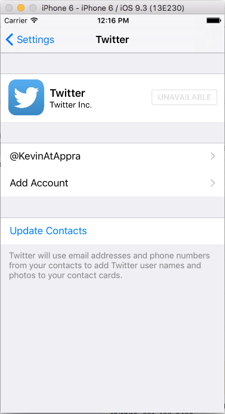
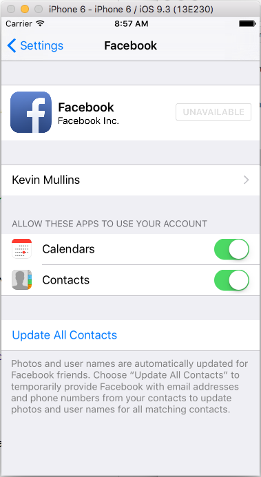

# Social Framework in Xamarin.iOS

_The Social Framework provides a unified API for interacting with social networks including Twitter and Facebook, as well as SinaWeibo for users in China._

Using the Social Framework allows applications to interact with social
networks from a single API without having to manage authentication. It includes
a system provided view controller for composing posts as well as an abstraction
that allows consuming each social network’s API over HTTP.

## Connecting to Twitter

### Twitter Account Settings

To connect to Twitter using the Social Framework, an account needs to be
configured in the device settings as shown below:

 [](social-framework-images/twitter01.png#lightbox)

Once an account has been entered and verified with Twitter, any application
on the device that uses the Social Framework classes to access Twitter will use
this account.

### Sending Tweets

The Social Framework includes a controller called `SLComposeViewController` that presents a system provided view for
editing and sending a tweet. The following screenshot shows an example of this
view:

 [](social-framework-images/twitter02.png#lightbox)

To use an `SLComposeViewController` with Twitter, an instance of
the controller must be created by calling the `FromService` method
with `SLServiceType.Twitter` as shown below:

```csharp
var slComposer = SLComposeViewController.FromService (SLServiceType.Twitter);
```

After the `SLComposeViewController` instance is returned, it can
be used to present a UI to post to Twitter. However, the first thing to do is to
check the availability of the social network, Twitter in this case, by calling `IsAvailable`:

```csharp
if (SLComposeViewController.IsAvailable (SLServiceKind.Twitter)) {
  ...
}
```

 `SLComposeViewController` never sends a tweet directly without
user interaction. However, it can be initialized with the following methods:

- `SetInitialText` – Adds the initial text to show in the tweet.
- `AddUrl` – Adds a Url to the tweet.
- `AddImage` – Adds an image to the tweet.

Once initialized, calling `PresentVIewController` displays the
view created by the `SLComposeViewController`. The user can then
optionally edit and send the tweet, or cancel sending it. In either case, the
controller should be dismissed in the `CompletionHandler`, where the
result can also be checked to see if the tweet was sent or cancelled, as shown
below:

```csharp
slComposer.CompletionHandler += (result) => {
  InvokeOnMainThread (() => {
    DismissViewController (true, null);
    resultsTextView.Text = result.ToString ();
  });
};
```

#### Tweet Example

The following code demonstrates using the `SLComposeViewController` to present a view used to send a tweet:

```csharp
using System;
using Social;
using UIKit;

namespace SocialFrameworkDemo
{
    public partial class ViewController : UIViewController
    {
        #region Private Variables
        private SLComposeViewController _twitterComposer = SLComposeViewController.FromService (SLServiceType.Twitter);
        #endregion

        #region Computed Properties
        public bool isTwitterAvailable {
            get { return SLComposeViewController.IsAvailable (SLServiceKind.Twitter); }
        }

        public SLComposeViewController TwitterComposer {
            get { return _twitterComposer; }
        }
        #endregion

        #region Constructors
        protected ViewController (IntPtr handle) : base (handle)
        {

        }
        #endregion

        #region Override Methods
        public override void ViewWillAppear (bool animated)
        {
            base.ViewWillAppear (animated);

            // Update UI based on state
            SendTweet.Enabled = isTwitterAvailable;
        }
        #endregion

        #region Actions
        partial void SendTweet_TouchUpInside (UIButton sender)
        {
            // Set initial message
            TwitterComposer.SetInitialText ("Hello Twitter!");
            TwitterComposer.AddImage (UIImage.FromFile ("Icon.png"));
            TwitterComposer.CompletionHandler += (result) => {
                InvokeOnMainThread (() => {
                    DismissViewController (true, null);
                    Console.WriteLine ("Results: {0}", result);
                });
            };

            // Display controller
            PresentViewController (TwitterComposer, true, null);
        }
        #endregion
    }
}
```

### Calling Twitter API

The Social Framework also includes support for making HTTP requests to social
networks. It encapsulates the request in an `SLRequest` class that is
used to target the particular social network’s API.

For example, the following code makes a request to Twitter to get the public timeline (by expanding on the code given above):

```csharp
using Accounts;
...

#region Private Variables
private ACAccount _twitterAccount;
#endregion

#region Computed Properties
public ACAccount TwitterAccount {
    get { return _twitterAccount; }
}
#endregion

#region Override Methods
public override void ViewWillAppear (bool animated)
{
    base.ViewWillAppear (animated);

    // Update UI based on state
    SendTweet.Enabled = isTwitterAvailable;
    RequestTwitterTimeline.Enabled = false;

    // Initialize Twitter Account access
    var accountStore = new ACAccountStore ();
    var accountType = accountStore.FindAccountType (ACAccountType.Twitter);

    // Request access to Twitter account
    accountStore.RequestAccess (accountType, (granted, error) => {
        // Allowed by user?
        if (granted) {
            // Get account
            _twitterAccount = accountStore.Accounts [accountStore.Accounts.Length - 1];
            InvokeOnMainThread (() => {
                // Update UI
                RequestTwitterTimeline.Enabled = true;
            });
        }
    });
}
#endregion

#region Actions
partial void RequestTwitterTimeline_TouchUpInside (UIButton sender)
{
    // Initialize request
    var parameters = new NSDictionary ();
    var url = new NSUrl("https://api.twitter.com/1.1/statuses/user_timeline.json?count=10");
    var request = SLRequest.Create (SLServiceKind.Twitter, SLRequestMethod.Get, url, parameters);

    // Request data
    request.Account = TwitterAccount;
    request.PerformRequest ((data, response, error) => {
        // Was there an error?
        if (error == null) {
            // Was the request successful?
            if (response.StatusCode == 200) {
                // Yes, display it
                InvokeOnMainThread (() => {
                    Results.Text = data.ToString ();
                });
            } else {
                // No, display error
                InvokeOnMainThread (() => {
                    Results.Text = string.Format ("Error: {0}", response.StatusCode);
                });
            }
        } else {
            // No, display error
            InvokeOnMainThread (() => {
                Results.Text = string.Format ("Error: {0}", error);
            });
        }
    });
}
#endregion
```

Let's look at this code in detail. First, it gains access to the Account Store and gets the type of a Twitter account:

```csharp
var accountStore = new ACAccountStore ();
var accountType = accountStore.FindAccountType (ACAccountType.Twitter);
```

Next, it asks the user if your app can have access to their Twitter account and, if access is granted, the account is loaded into memory and the UI updated:

```csharp
// Request access to Twitter account
accountStore.RequestAccess (accountType, (granted, error) => {
    // Allowed by user?
    if (granted) {
        // Get account
        _twitterAccount = accountStore.Accounts [accountStore.Accounts.Length - 1];
        InvokeOnMainThread (() => {
            // Update UI
            RequestTwitterTimeline.Enabled = true;
        });
    }
});
```

When the user requests the timeline data (by tapping a button in the UI), the app first forms a request to access the data from Twitter:

```csharp
// Initialize request
var parameters = new NSDictionary ();
var url = new NSUrl("https://api.twitter.com/1.1/statuses/user_timeline.json?count=10");
var request = SLRequest.Create (SLServiceKind.Twitter, SLRequestMethod.Get, url, parameters);
```

This example is limiting the returned results to the last ten entries by including `?count=10` in the URL. Finally, it attaches the request to the Twitter account (that was loaded above) and performs the call to Twitter to fetch the data:

```csharp
// Request data
request.Account = TwitterAccount;
request.PerformRequest ((data, response, error) => {
    // Was there an error?
    if (error == null) {
        // Was the request successful?
        if (response.StatusCode == 200) {
            // Yes, display it
            InvokeOnMainThread (() => {
                Results.Text = data.ToString ();
            });
        } else {
            // No, display error
            InvokeOnMainThread (() => {
                Results.Text = string.Format ("Error: {0}", response.StatusCode);
            });
        }
    } else {
        // No, display error
        InvokeOnMainThread (() => {
            Results.Text = string.Format ("Error: {0}", error);
        });
    }
});
```

If the data was successfully loaded, the raw JSON data will be displayed (as in the example output below):

[](social-framework-images/twitter03.png#lightbox)

In a real app, the JSON results could then be parsed as normal and the results presented to the user. See [Introduction Web Services](~/cross-platform/data-cloud/web-services/index.md) for information on how to parse JSON.

## Connecting to Facebook

### Facebook Account Settings

Connecting to Facebook with the Social Framework is nearly identical to the
process used for Twitter shown above. A Facebook user account must be configured
in the device settings as shown below:

[](social-framework-images/facebook01.png#lightbox)

Once configured, any application on the device that uses the Social Framework
will use this account to connect to Facebook.

### Posting to Facebook

As the Social Framework is a unified API designed to access multiple social
networks, the code remains nearly identical regardless of the social network
being used.

For example, the `SLComposeViewController` can be used exactly as
in the Twitter example shown earlier, the only different is switching to the Facebook-specific settings and options. For example:

```csharp
using System;
using Foundation;
using Social;
using UIKit;

namespace SocialFrameworkDemo
{
    public partial class ViewController : UIViewController
    {
        #region Private Variables
        private SLComposeViewController _facebookComposer = SLComposeViewController.FromService (SLServiceType.Facebook);
        #endregion

        #region Computed Properties
        public bool isFacebookAvailable {
            get { return SLComposeViewController.IsAvailable (SLServiceKind.Facebook); }
        }

        public SLComposeViewController FacebookComposer {
            get { return _facebookComposer; }
        }
        #endregion

        #region Constructors
        protected ViewController (IntPtr handle) : base (handle)
        {

        }
        #endregion

        #region Override Methods
        public override void ViewWillAppear (bool animated)
        {
            base.ViewWillAppear (animated);

            // Update UI based on state
            PostToFacebook.Enabled = isFacebookAvailable;
        }
        #endregion

        #region Actions
        partial void PostToFacebook_TouchUpInside (UIButton sender)
        {
            // Set initial message
            FacebookComposer.SetInitialText ("Hello Facebook!");
            FacebookComposer.AddImage (UIImage.FromFile ("Icon.png"));
            FacebookComposer.CompletionHandler += (result) => {
                InvokeOnMainThread (() => {
                    DismissViewController (true, null);
                    Console.WriteLine ("Results: {0}", result);
                });
            };

            // Display controller
            PresentViewController (FacebookComposer, true, null);
        }
        #endregion
    }
}
```

When used with Facebook, the `SLComposeViewController` displays a
view that looks nearly identical to the Twitter example, showing **Facebook** as the title in this case:

[](social-framework-images/facebook02.png#lightbox)

### Calling Facebook Graph API

Similar to the Twitter example, the Social Framework’s `SLRequest` object can be used with Facebook’s graph API. For
example, the following code returns information from the graph API about the
Xamarin account (by expanding on the code given above):

```csharp
using Accounts;
...

#region Private Variables
private ACAccount _facebookAccount;
#endregion

#region Computed Properties
public ACAccount FacebookAccount {
    get { return _facebookAccount; }
}
#endregion

#region Override Methods
public override void ViewWillAppear (bool animated)
{
    base.ViewWillAppear (animated);

    // Update UI based on state
    PostToFacebook.Enabled = isFacebookAvailable;
    RequestFacebookTimeline.Enabled = false;

    // Initialize Facebook Account access
    var accountStore = new ACAccountStore ();
    var options = new AccountStoreOptions ();
    var options.FacebookAppId = ""; // Enter your specific Facebook App ID here
    accountType = accountStore.FindAccountType (ACAccountType.Facebook);

    // Request access to Facebook account
    accountStore.RequestAccess (accountType, options, (granted, error) => {
        // Allowed by user?
        if (granted) {
            // Get account
            _facebookAccount = accountStore.Accounts [accountStore.Accounts.Length - 1];
            InvokeOnMainThread (() => {
                // Update UI
                RequestFacebookTimeline.Enabled = true;
            });
        }
    });

}
#endregion

#region Actions
partial void RequestFacebookTimeline_TouchUpInside (UIButton sender)
{
    // Initialize request
    var parameters = new NSDictionary ();
    var url = new NSUrl ("https://graph.facebook.com/283148898401104");
    var request = SLRequest.Create (SLServiceKind.Facebook, SLRequestMethod.Get, url, parameters);

    // Request data
    request.Account = FacebookAccount;
    request.PerformRequest ((data, response, error) => {
        // Was there an error?
        if (error == null) {
            // Was the request successful?
            if (response.StatusCode == 200) {
                // Yes, display it
                InvokeOnMainThread (() => {
                    Results.Text = data.ToString ();
                });
            } else {
                // No, display error
                InvokeOnMainThread (() => {
                    Results.Text = string.Format ("Error: {0}", response.StatusCode);
                });
            }
        } else {
            // No, display error
            InvokeOnMainThread (() => {
                Results.Text = string.Format ("Error: {0}", error);
            });
        }
    });
}
#endregion
```

The only real difference between this code and the Twitter version presented above, is Facebook's requirement to get a Developer/App specific ID (which you can generate from Facebook's Developer Portal) which must be set as an option when making the request:

```csharp
var options = new AccountStoreOptions ();
var options.FacebookAppId = ""; // Enter your specific Facebook App ID here
...

// Request access to Facebook account
accountStore.RequestAccess (accountType, options, (granted, error) => {
    ...
});
```

Failure to set this option (or using an invalid key) will result in either an error or no data being returned.

## Summary

This article showed how to use the Social Framework to interact with Twitter
and Facebook. It showed where to configure accounts for each social network in
the device settings. It also discussed how to use the `SLComposeViewController` to present a unified view for posting to
social networks. Additionally, it examined the `SLRequest` class that
is used to call each social network’s API.

## Related Links

- [SocialFrameworkDemo (sample)](/samples/xamarin/ios-samples/socialframeworkdemo)
- [Introduction to Web Services](~/cross-platform/data-cloud/web-services/index.md)