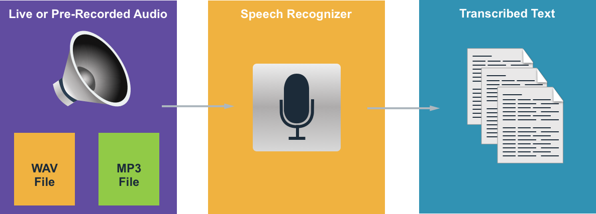
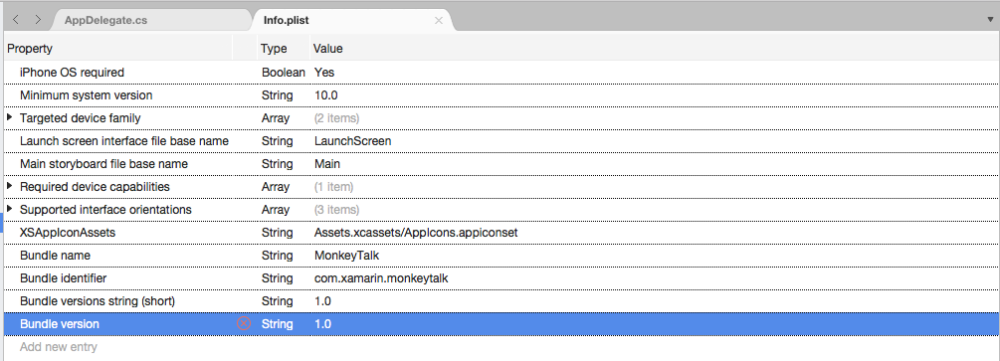
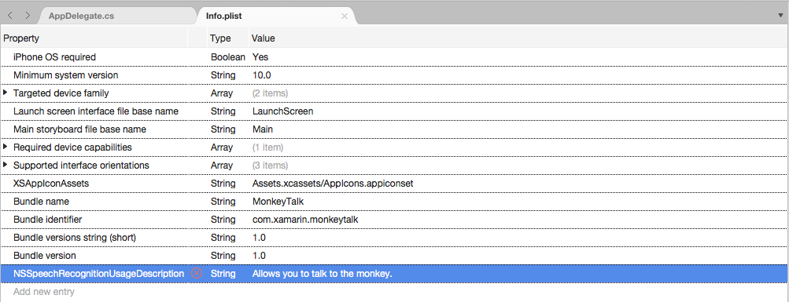
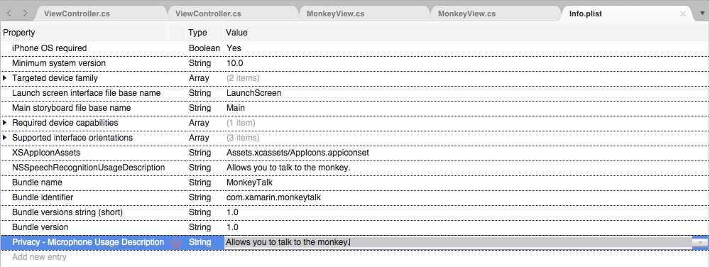
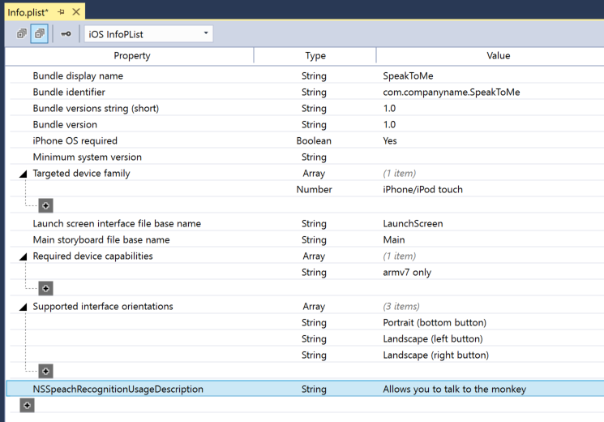

# Speech Recognition in Xamarin.iOS

_This article presents the new Speech API and shows how to implement it in a Xamarin.iOS app to support continuous speech recognition and transcribe speech (from live or recorded audio streams) into text._

New to iOS 10, Apple has release the Speech Recognition API that allows an iOS app to support continuous speech recognition and transcribe speech (from live or recorded audio streams) into text.

According to Apple, the Speech Recognition API has the following features and benefits:

- Highly Accurate
- State of the Art
- Easy to Use
- Fast
- Supports Multiple Languages
- Respects User Privacy

## How Speech Recognition Works

Speech Recognition is implemented in an iOS app by acquiring either live or pre-recorded audio (in any of the spoken languages that the API supports) and passing it to a Speech Recognizer which returns a plain-text transcription of the spoken words.

[](speech-images/speech01.png#lightbox)

### Keyboard Dictation

When most users think of Speech Recognition on an iOS device, they think of the built-in Siri voice assistant, which was released along with Keyboard Dictation in iOS 5 with the iPhone 4S.

Keyboard Dictation is supported by any interface element that supports TextKit (such as `UITextField` or `UITextArea`) and is activated by the user clicking the Dictation Button (directly to the left of the spacebar) in the iOS virtual keyboard.

Apple has released the following Keyboard Dictation statistics (collected since 2011):

- Keyboard Dictation has been widely used since it was released in iOS 5.
- Approximately 65,000 apps use it per day.
- About a third of all iOS Dictation is done in a 3rd party app.

Keyboard Dictation is extremely easy to use as it requires no effort on the developer's part, other than using a TextKit interface element in the app's UI design. Keyboard Dictation also has the advantage of not requiring any special privilege requests from the app before it can be used.

Apps that use the new Speech Recognition APIs will require special permissions to be granted by the user, since speech recognition requires the transmission and temporary storage of data on Apple's servers. Please see our [Security and Privacy Enhancements](~/ios/app-fundamentals/security-privacy.md) documentation for details.

While Keyboard Dictation is easy to implement, it does come with several limitations and disadvantages:

- It requires the use of a Text Input Field and display of a keyboard.
- It works with live audio input only and the app has no control over the audio recording process.
- It provides no control over the language that is used to interpret the user's speech.
- There is no way for the app to know if the Dictation button is even available to the user.
- The app cannot customize the audio recording process.
- It provides a very shallow set of results that lacks information such as timing and confidence.

### Speech Recognition API

New to iOS 10, Apple has released the Speech Recognition API which provides a more powerful way for an iOS app to implement speech recognition. This API is the same one that Apple uses to power both Siri and Keyboard Dictation and it is capable of providing fast transcription with state of the art accuracy.

The results provided by the Speech Recognition API are transparently customized to the individual users, without the app having to collect or access any private user data.

The Speech Recognition API provides results back to the calling app in near real-time as the user is speaking and it provides more information about the results of translation than just text. These include:

- Multiple interpretations of what the user said.
- Confidence levels for the individual translations.
- Timing information.

As stated above, audio for translation can be provided either by a live feed, or from pre-recorded source and in any of the over 50 languages and dialects supported by iOS 10.

The Speech Recognition API can be used on any iOS device running iOS 10 and in most cases, requires a live internet connection since the bulk of the translations takes place on Apple's servers. That said, some newer iOS devices support always on, on-device translation of specific languages.

Apple has included an Availability API to determine if a given language is available for translation at the current moment. The app should use this API instead of testing for internet connectivity itself directly.

As noted above in the Keyboard Dictation section, speech recognition requires the transmission and temporary storage of data on Apple's servers over the internet, and as such, the app _must_ request the user's permission to perform recognition by including the `NSSpeechRecognitionUsageDescription` key in its `Info.plist` file and calling the `SFSpeechRecognizer.RequestAuthorization` method. 

Based on the source of the audio being used for Speech Recognition, other changes to the app's `Info.plist` file may be required. Please see our [Security and Privacy Enhancements](~/ios/app-fundamentals/security-privacy.md) documentation for details.

## Adopting Speech Recognition in an App

There are four major steps that the developer must take to adopt speech recognition in an iOS app:

- Provide a usage description in the app's `Info.plist` file using the `NSSpeechRecognitionUsageDescription` key. For example, a camera app might include the following description, _"This allows you to take a photo just by saying the word 'cheese'."_
- Request authorization by calling the `SFSpeechRecognizer.RequestAuthorization` method to present an explanation (provided in the `NSSpeechRecognitionUsageDescription` key above) of why the app wants speech recognition access to the user in a dialog box and allow them to accept or decline.
- Create a Speech Recognition Request:
  - For pre-recorded audio on disk, use the `SFSpeechURLRecognitionRequest` class.
  - For live audio (or audio from memory), use the `SFSPeechAudioBufferRecognitionRequest` class.
- Pass the Speech Recognition Request to a Speech Recognizer (`SFSpeechRecognizer`) to begin recognition. The app can optionally hold onto the returned `SFSpeechRecognitionTask` to monitor and track the recognition results.

These steps will be covered in detail below.

### Providing a Usage Description

To provide the required `NSSpeechRecognitionUsageDescription` key in the `Info.plist` file, do the following:

# [Visual Studio for Mac](#tab/macos)

1. Double-click the `Info.plist` file to open it for editing.
2. Switch to the **Source** view: 

    [](speech-images/speech02.png#lightbox)
3. Click on **Add New Entry**, enter `NSSpeechRecognitionUsageDescription` for the **Property**, `String` for the **Type** and a **Usage Description** as the **Value**. For example: 

    [](speech-images/speech03.png#lightbox)
4. If the app will be handling live audio transcription, it will also require a Microphone Usage Description. Click on **Add New Entry**, enter `NSMicrophoneUsageDescription` for the **Property**, `String` for the **Type** and a **Usage Description** as the **Value**. For example: 

    [](speech-images/speech04.png#lightbox)
5. Save the changes to the file.

# [Visual Studio](#tab/windows)

1. Double-click the `Info.plist` file to open it for editing.
2. Click on **Add New Entry**, enter `NSSpeechRecognitionUsageDescription` for the **Property**, `String` for the **Type** and a **Usage Description** as the **Value**. For example: 

    [](speech-images/speech03w.png#lightbox)
3. If the app will be handling live audio transcription, it will also require a Microphone Usage Description. Click on **Add New Entry**, enter `NSMicrophoneUsageDescription` for the **Property**, `String` for the **Type** and a **Usage Description** as the **Value**. For example: 

    [](speech-images/speech04w.png#lightbox)
4. Save the changes to the file.

-----

> [!IMPORTANT]
> Failing to provide either of the above `Info.plist` keys (`NSSpeechRecognitionUsageDescription` or `NSMicrophoneUsageDescription`) can result in the app failing without warning when trying to access either Speech Recognition or the microphone for live audio.

### Requesting Authorization

To request the required user authorization that allows the app to access speech recognition, edit the main View Controller class and add the following code:

```csharp
using System;
using UIKit;
using Speech;

namespace MonkeyTalk
{
    public partial class ViewController : UIViewController
    {
        protected ViewController (IntPtr handle) : base (handle)
        {
            // Note: this .ctor should not contain any initialization logic.
        }

        public override void ViewDidLoad ()
        {
            base.ViewDidLoad ();

            // Request user authorization
            SFSpeechRecognizer.RequestAuthorization ((SFSpeechRecognizerAuthorizationStatus status) => {
                // Take action based on status
                switch (status) {
                case SFSpeechRecognizerAuthorizationStatus.Authorized:
                    // User has approved speech recognition
                    ...
                    break;
                case SFSpeechRecognizerAuthorizationStatus.Denied:
                    // User has declined speech recognition
                    ...
                    break;
                case SFSpeechRecognizerAuthorizationStatus.NotDetermined:
                    // Waiting on approval
                    ...
                    break;
                case SFSpeechRecognizerAuthorizationStatus.Restricted:
                    // The device is not permitted
                    ...
                    break;
                }
            });
        }
    }
}
```

The `RequestAuthorization` method of the `SFSpeechRecognizer` class will request permission from the user to access speech recognition using the reason that the developer provided in the `NSSpeechRecognitionUsageDescription` key of the `Info.plist` file.

A `SFSpeechRecognizerAuthorizationStatus` result is returned to the `RequestAuthorization` method's callback routine that can be used to take action based on the user's permission. 

> [!IMPORTANT]
> Apple suggests waiting until the user has started an action in the app that requires speech recognition before requesting this permission.

### Recognizing Pre-Recorded Speech

If the app wants to recognize speech from a pre-recorded WAV or MP3 file, it can use the following code:

```csharp
using System;
using UIKit;
using Speech;
using Foundation;
...

public void RecognizeFile (NSUrl url)
{
    // Access new recognizer
    var recognizer = new SFSpeechRecognizer ();

    // Is the default language supported?
    if (recognizer == null) {
        // No, return to caller
        return;
    }

    // Is recognition available?
    if (!recognizer.Available) {
        // No, return to caller
        return;
    }

    // Create recognition task and start recognition
    var request = new SFSpeechUrlRecognitionRequest (url);
    recognizer.GetRecognitionTask (request, (SFSpeechRecognitionResult result, NSError err) => {
        // Was there an error?
        if (err != null) {
            // Handle error
            ...
        } else {
            // Is this the final translation?
            if (result.Final) {
                Console.WriteLine ("You said, \"{0}\".", result.BestTranscription.FormattedString);
            }
        }
    });
}
```

Looking at this code in detail, first, it attempts to create a Speech Recognizer (`SFSpeechRecognizer`). If the default language isn't supported for speech recognition, `null` is returned and the functions exits.

If the Speech Recognizer is available for the default language, the app checks to see if it is currently available for recognition using the `Available` property. For example, recognition might not be available if the device doesn't have an active internet connection.

A `SFSpeechUrlRecognitionRequest` is created from the `NSUrl` location of the pre-recorded file on the iOS device and it is handed to the Speech Recognizer to process with a callback routine.

When the callback is called, if the `NSError` isn't `null` there has been an error that must be handled. Because speech recognition is done incrementally, the callback routine may be called more than once so the `SFSpeechRecognitionResult.Final` property is tested to see if the translation is complete and best version of the translation is written out (`BestTranscription`).

### Recognizing Live Speech

If the app wants to recognize live speech, the process is very similar to recognizing pre-recorded speech. For example:

```csharp
using System;
using UIKit;
using Speech;
using Foundation;
using AVFoundation;
...

#region Private Variables
private AVAudioEngine AudioEngine = new AVAudioEngine ();
private SFSpeechRecognizer SpeechRecognizer = new SFSpeechRecognizer ();
private SFSpeechAudioBufferRecognitionRequest LiveSpeechRequest = new SFSpeechAudioBufferRecognitionRequest ();
private SFSpeechRecognitionTask RecognitionTask;
#endregion
...

public void StartRecording ()
{
    // Setup audio session
    var node = AudioEngine.InputNode;
    var recordingFormat = node.GetBusOutputFormat (0);
    node.InstallTapOnBus (0, 1024, recordingFormat, (AVAudioPcmBuffer buffer, AVAudioTime when) => {
        // Append buffer to recognition request
        LiveSpeechRequest.Append (buffer);
    });

    // Start recording
    AudioEngine.Prepare ();
    NSError error;
    AudioEngine.StartAndReturnError (out error);

    // Did recording start?
    if (error != null) {
        // Handle error and return
        ...
        return;
    }

    // Start recognition
    RecognitionTask = SpeechRecognizer.GetRecognitionTask (LiveSpeechRequest, (SFSpeechRecognitionResult result, NSError err) => {
        // Was there an error?
        if (err != null) {
            // Handle error
            ...
        } else {
            // Is this the final translation?
            if (result.Final) {
                Console.WriteLine ("You said \"{0}\".", result.BestTranscription.FormattedString);
            }
        }
    });
}

public void StopRecording ()
{
    AudioEngine.Stop ();
    LiveSpeechRequest.EndAudio ();
}

public void CancelRecording ()
{
    AudioEngine.Stop ();
    RecognitionTask.Cancel ();
}
```

Looking at this code in detail, it creates several private variables to handle the recognition process:

```csharp
private AVAudioEngine AudioEngine = new AVAudioEngine ();
private SFSpeechRecognizer SpeechRecognizer = new SFSpeechRecognizer ();
private SFSpeechAudioBufferRecognitionRequest LiveSpeechRequest = new SFSpeechAudioBufferRecognitionRequest ();
private SFSpeechRecognitionTask RecognitionTask;
```

It uses AV Foundation to record audio that will be passed to a `SFSpeechAudioBufferRecognitionRequest` to handle the recognition request:

```csharp
var node = AudioEngine.InputNode;
var recordingFormat = node.GetBusOutputFormat (0);
node.InstallTapOnBus (0, 1024, recordingFormat, (AVAudioPcmBuffer buffer, AVAudioTime when) => {
    // Append buffer to recognition request
    LiveSpeechRequest.Append (buffer);
});
```

The app attempts to start recording and any errors are handled if the recording cannot be started:

```csharp
AudioEngine.Prepare ();
NSError error;
AudioEngine.StartAndReturnError (out error);

// Did recording start?
if (error != null) {
    // Handle error and return
    ...
    return;
}
```

The recognition task is started and a handle is kept to the Recognition Task (`SFSpeechRecognitionTask`):

```csharp
RecognitionTask = SpeechRecognizer.GetRecognitionTask (LiveSpeechRequest, (SFSpeechRecognitionResult result, NSError err) => {
    ...
});
```

The callback is used in a similar fashion to the one used above on pre-recorded speech.

If recording is stoped by the user, both the Audio Engine and the Speech Recognition Request are informed:

```csharp
AudioEngine.Stop ();
LiveSpeechRequest.EndAudio ();
```

If the user cancels recognition, then the Audio Engine and Recognition Task are informed:

```csharp
AudioEngine.Stop ();
RecognitionTask.Cancel ();
```

It is important to call `RecognitionTask.Cancel` if the user cancels the translation to free up both memory and the device's processor.

> [!IMPORTANT]
> Failing to provide the `NSSpeechRecognitionUsageDescription` or `NSMicrophoneUsageDescription` `Info.plist` keys can result in the app failing without warning when trying to access either Speech Recognition or the microphone for live audio (`var node = AudioEngine.InputNode;`). Please see the **Providing a Usage Description** section above for more information.

## Speech Recognition Limits

Apple imposes the following limitations when working with Speech Recognition in an iOS app:

- Speech Recognition is free to all apps, but its usage is not unlimited:
  - Individual iOS devices have a limited number of recognitions that can be performed per day.
  - Apps will be throttled globally on a request-per-day basis.
- The app must be prepared to handle Speech Recognition network connection and usage rate limit failures.
- Speech Recognition can have a high cost in both battery drain and high network traffic on the user's iOS device, because of this, Apple imposes a strict audio duration limit of approximately one minute of speech max.

If an app is routinely hitting its rate-throttling limits, Apple asks that the developer contact them.

## Privacy and Usability Considerations

Apple has the following suggestion for being transparent and respecting the user's privacy when including Speech Recognition in an iOS app:

- When recording the user's speech, be sure to clearly indicate that recording is taking place in the app's User Interface. For example, the app might play a "recording" sound and display a recording indicator.
- Don't use Speech Recognition for sensitive user information such as passwords, health data or financial information.
- Show the recognition results _before_ acting on them. This not only provides feedback as to what the app is doing, but allows the user to handle recognition errors as they are made.

## Summary

This article has presented the new Speech API and showed how to implement it in a Xamarin.iOS app to support continuous speech recognition and transcribe speech (from live or recorded audio streams) into text. 

## Related Links

- [SpeakToMe (sample)](/samples/xamarin/ios-samples/ios10-speaktome)