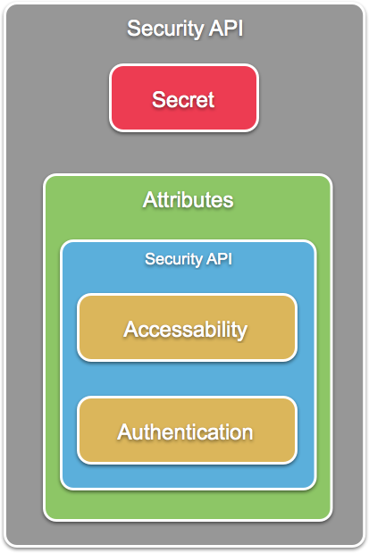
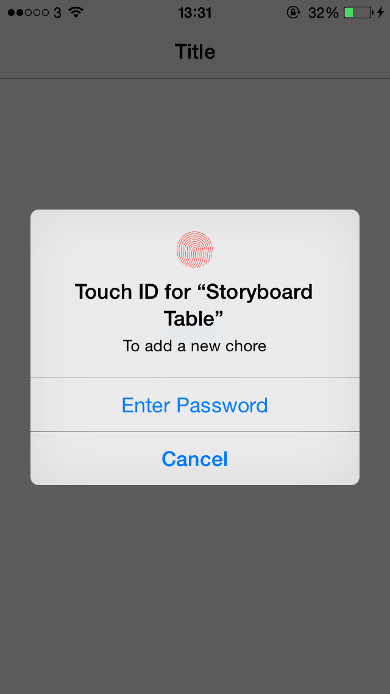
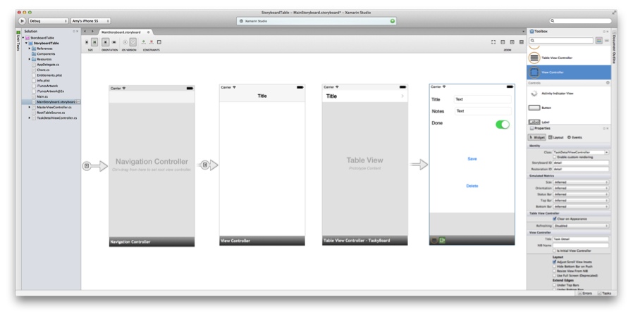
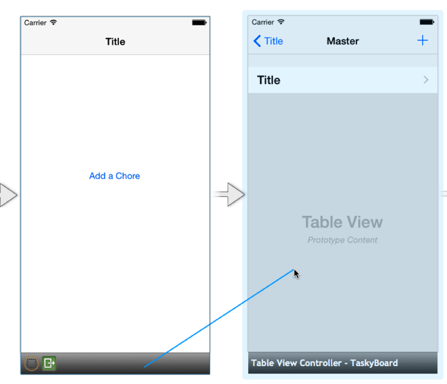
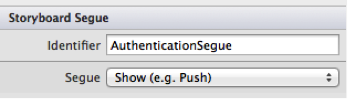
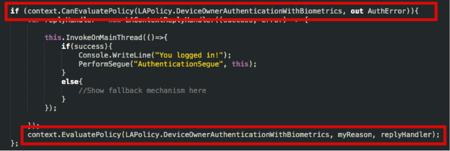
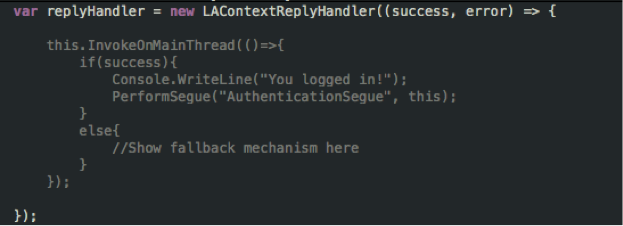
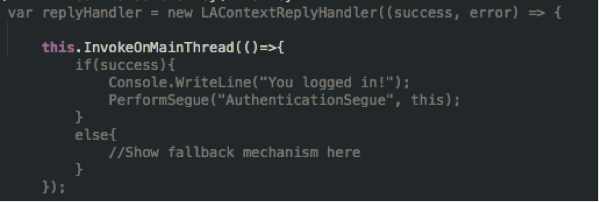
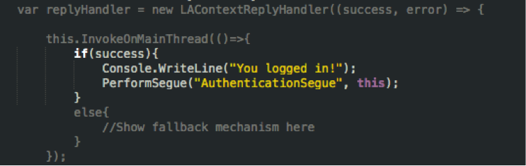

# Touch ID in Xamarin.iOS

Touch ID was introduced in iOS 7 as a means of authenticating the user - similar to a passcode. However, it was limited to unlocking the device, using the App Store, using iTunes and authenticating the iCloud keychain only.

There are now two ways to use Touch ID as an authentication mechanism in an iOS 8 application using the Local Authentication API. It is currently not possible to use Local Authentication to authenticate remotely.

To fully understand Touch ID and its worth, we should explore Keychain Services and what these new changes mean for your user's data. Keychain Access has also been expanded upon in iOS 8 through the use of the new Access Control Lists (ACLs) feature.

## Keychain & Secure Enclave

Keychain is a large database providing secure storage for passwords, keys, certificates and notes for one individual Apple ID. In iOS 8 an application always has access to its own unique keychain items, and cannot access any keychain items of other applications. This differs from OS X where the keychain is unlocked with a single password, letting any Keychain Services-aware application use the keychain. In this article we will focus on how the keychain works in iOS 8.

Keychain is a specialized database, where each row is known as a _Keychain Item_. Each item is described by keychain attributes and is composed of encrypted values. To allow for efficient use of keychain, it is optimized for small items, or _secrets_.
Each keychain item is protected by the users passcode and a unique device secret. Keychain items should be protected even when users are not using their devices. This is implemented in iOS by only allowing the items to become available when the device is unlocked — when the device is locked they become unavailable. They can also be stored in an encrypted backup. One of the key features of keychain is to enforce access control; an application has access to its portion of the keychain, and all other applications will be prevented. The diagram below illustrates how an application interacts with the keychain:

[](touchid-images/image1.png#lightbox)

### Secure Enclave

The Keychain can’t decrypt the keychain item by itself; instead it is done in the *Secure Enclave*. The Secure enclave is a co-processor within the A7 chip that is responsible for determining a successful match from fingerprint data from the Touch ID sensor against a registered print. It will then decrypt the keychain item, and return the decrypted secret to the keychain.

### Working with Keychain

First your application should query into the Keychain to see if a password exists. If it doesn’t exist, you may need to prompt for a password so the user isn’t continually asked. If the password needs to be updated, prompt the user for a new password and pass in the updated value to the keychain.

> [!NOTE]
> After using a secret retrieved from the Keychain, all references to the 
> data should be purged from memory. Never assign it to a global variable.

## Keychain ACL and Touch ID

Access Control List is a new keychain item attribute in iOS 8 that describes the information regarding what must happen to permit a particular operation to occur. This could be in the form of displaying an alert dialog or requesting a passcode. ACL allows you to set the accessibility and authentication for a keychain Item. The diagram below shows how this new attribute ties in with the rest of the keychain item:

[](touchid-images/image2.png#lightbox)

As of iOS 8, there is now a new user presence policy, `SecAccessControl`, which is enforced by the secure enclave on an iPhone 5s and above. We can see in the table below, just how the device configuration can influence the policy evaluation:

|Device Configuration|Policy Evaluation|Backup Mechanism|
|--- |--- |--- |
|Device without Passcode|No Access|None|
|Device with Passcode|Requires Passcode|None|
|Device with Touch ID|Prefers Touch ID|Allows Passcode|

All operations inside the Secure Enclave can trust each other. This means we can use the Touch ID authentication result to authorize the Keychain item decryption. The Secure Enclave also keeps a counter of failed Touch ID matches, in which case a user will have to revert to using the passcode.
A new framework in iOS 8, called _Local Authentication_, supports this process of authentication within the device. We will explore this in the next section.

## Local Authentication

As we established in the previous section, applications can use Local Authentication to authenticate the user in adherence with the security policy that has been set up on the device.

Currently, the API provides only two capabilities:
Firstly, it aids the existing Keychain services through the use of new Keychain Access Control Lists (ACLs). Keychain data can be unlocked with the successful authentication of a users fingerprint.

Secondly, LocalAuthentication provides two methods to authenticate your application locally. Developers should use `CanEvaluatePolicy` to determine if the device is capable of accepting Touch ID, and then `EvaluatePolicy` to start the authentication operation.

While both capabilities offer local authentication, they do not provide a mechanism for the application or the user to authenticate to a remote server.
Local Authentication provides a new standard user interface for authentication. In the case of Touch ID, this is an alert view with two buttons as illustrated below. One button to cancel, and one to use the fallback means of authentication – the passcode. There is also a custom message that must be set. It is good practice to use this to explain to the user why Touch ID authentication is required.

[](touchid-images/image12.png#lightbox)

### With Keychain Services

We looked a little earlier at how a keychain item is decrypted, using the secure enclave to verify our passcode. In iOS 8, we can use Local Authentication to request Touch ID verification in conjunction with the Access Control Lists feature, which provides the implementation of the fallback mechanism, or the password.
To use ACL we should be using the `SecAccessControl` policy, and then checking the state of the device using `SecAccessible.WhenPasscodeSetThisDeviceOnly` or `SecAccessible.WhenUnlocked`.

#### Considerations with ACL

There are many things we should keep in mind when using ACL with the keychain and some of these are listed below:

-	Only use with Foreground Application – if you call any keychain operation on a background thread the call will fail.
-	Adding and updating keychain items may require authentication.
-	If a request returns multiple matching items in the keychain, authentication may be required.
-	ACL protected items are device-only, and therefore not synchronized or backed up.

### Using Local Authentication without Keychain Services

Local Authentication was created as a way to collect credentials, such as passcode or Touch ID, and to work with the Secure Enclave to finish authenticating the user. Think of it as a bridge between your application and the Secure Enclave, which can never directly communicate with each other. It can also be used for policy evaluation for your application.

To do this an application calls the policy evaluation inside Local Authentication, which starts the operation inside Secure Enclave. You can leverage this to provide authentication to your app, without directly querying/accessing the Secure Enclave.

[](touchid-images/image13a.png#lightbox)

Using Local Authentication in your application provides a simple way of implementing user verification, for example to unlock a feature solely for the eyes of the device owner, such as banking applications, or to aide parental controls for the individual application. You can also use it as a way to extend authentication that already exists – users like their information to be secure, but they also like to have options.

The security of local authentication differs from that of the keychain. For example, when using the keychain, the trust is between the operating system and the Secure Enclave. With local authentication, it is between the application and the operating system, which means that you only have access to the results of the Secure Enclave, not the Secure Enclave itself.

On the subject of security, it is also extremely important to know that there is **no access** to registered fingers, or fingerprint images. The Secure Enclave is the owner of this information, and so no other system component has access to it.

To use Touch ID without keychain by leveraging the Local Authentication API, there are a few functions that we can use. These are detailed below:

*	`CanEvaluatePolicy` – This will simply check to see if the device is capable of accepting Touch ID.
*	`EvaluatePolicy` – This starts the authentication operation and displays the UI, and returns a `true` or `false` answer.
*	`DeviceOwnerAuthenticationWithBiometrics` – This is the policy that can be used to show the Touch ID screen. It is worth noting that there is no passcode fallback mechanism here, instead you should implement this fallback in your application to allow users to skip the Touch ID authentication.

There are a few caveats with using Local Authentication, which are listed below:

*	As with Keychain, it can only be run in the foreground. Calling it on a background thread will cause it to fail.
*	Keep in mind that the policy evaluation may fail. A passcode button will need to be implemented as a fall back.
*	You must supply a `localizedReason` to explain why Authentication is needed. This helps to build trust with the user.

Next, in the section below, we will look at how to implement the API taking these caveats into consideration.

## Adding Touch ID to your application

In the previous sections, we looked at the theory behind access and authentication using Keychain and Local Authentication. We will now take a look at how you can integrate Touch ID in to your application.

### Walkthrough

So let’s look at adding some Touch ID Authentication to our application. In this walkthrough we are going to update the [Storyboard Table](https://developer.xamarin.com/samples/StoryboardTable/) sample, adding local authentication so that it works like the [Storyboard Table – Local Authentication](https://developer.xamarin.com/samples/monotouch/StoryboardTable_LocalAuthentication/) sample, which only allows authenticated users to add chores to the list.

1. Download the sample and run it in Visual Studio for Mac.
2. Double Click on `MainStoryboard.Storyboard` to open the sample in the iOS Designer. With this sample, we want to add a new screen to our application, which will control the authentication. This will go before the current `MasterViewController`.
3. Drag a new **View Controller** from the **Toolbox** to the **Design Surface**. Set this as the **Root View Controller** by **Ctrl + Drag** from the **Navigation Controller**:

	[](touchid-images/image4.png#lightbox)
4.  Name the new View Controller `AuthenticationViewController`.
5. Next, drag a button and place it on the `AuthenticationViewController`. Call this `AuthenticateButton`, and give it the text `Add a Chore`.
6. Create an event on the `AuthenticateButton` called `AuthenticateMe`.
7. Create a manual segue from `AuthenticationViewController` by clicking the black bar at the bottom and **Ctrl + Drag** from the bar to the `MasterViewController` and choosing **push** (or **show** if using size classes):

	[](touchid-images/image6.png#lightbox)
8. Click on the newly created segue and give it the identifier `AuthenticationSegue`, as illustrated below:

	[](touchid-images/image7.png#lightbox)
9. Add the following code to `AuthenticationViewController`:

    ```csharp
    partial void AuthenticateMe (UIButton sender)
    {
        var context = new LAContext();
        NSError AuthError;
        var myReason = new NSString("To add a new chore");

        if (context.CanEvaluatePolicy(LAPolicy.DeviceOwnerAuthenticationWithBiometrics, out AuthError)){
            var replyHandler = new LAContextReplyHandler((success, error) => {
                this.InvokeOnMainThread(()=> {
                    if(success)
                    {
                        Console.WriteLine("You logged in!");
                        PerformSegue("AuthenticationSegue", this);
                    }
                    else
                    {
                        // Show fallback mechanism here
                    }
                });
            });
            context.EvaluatePolicy(LAPolicy.DeviceOwnerAuthenticationWithBiometrics, myReason, replyHandler);
        };
    }
    ```

This is all the code you need to implement Touch ID authentication using Local Authentication. The highlighted lines in the image below show the use of Local Authentication:

[](touchid-images/image8.png#lightbox)

First, we need to establish if the device is capable of accepting Touch ID input, by using the `CanEvaluatePolicy` and passing in the policy `DeviceOwnerAuthenticationWithBiometrics`. If this is true then we can display the Touch ID UI by using `EvaluatePolicy`. There are three pieces of information we have to pass into `EvaluatePolicy` – the policy itself, a string explaining why authentication is necessary, and a reply handler. The reply handler tells the application what it should do in the case of a successful, or unsuccessful, authentication. Let’s look closer at the reply handler:

[](touchid-images/image9.png#lightbox)

The reply handler is specified of type `LAContextReplyHandler`, which takes the parameters success – a `bool` value, and an `NSError` called `error`. If it is successful, this is where we will actually perform whatever it is we want to authenticate – in this case displaying the screen that will let us add a new chore. Remember one of the caveats of Local Authentication is that it must be run on the foreground, so make sure to use `InvokeOnMainThread`:

[](touchid-images/image10.png#lightbox)

Finally, when the authentication has been successful, we want to transition to the `MasterViewController`. The `PerformSegue` method can be used to do this:

[](touchid-images/image11.png#lightbox)

## Summary
In this guide we looked at Keychain and how this works in iOS. We also explored the keychain ACL, and changes to this in iOS. Next, we took a look at the Local Authentication framework, which is new in iOS 8 and then looked at implementing Touch ID authentication in our application.

## Related Links

- [Storyboard Table – Local Authentication](https://developer.xamarin.com/samples/monotouch/StoryboardTable_LocalAuthentication/) 
- [Keychain WWDC Sample](https://developer.xamarin.com/samples/KeychainTouchID/)
- [Keychain (sample)](https://developer.xamarin.com/samples/Keychain/)
