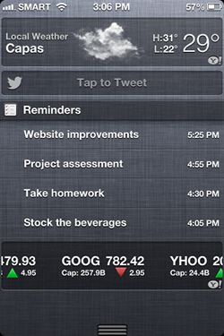
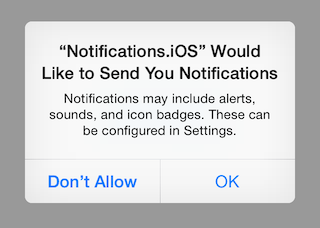
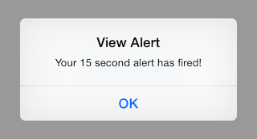

# Notifications in Xamarin.iOS

_This section shows how to implement local notifications in Xamarin.iOS. It will explain the various UI elements of an iOS notification and discuss the API's involved with creating and displaying a notification._

> [!IMPORTANT]
> **NOTE:** The information in this section pertains to iOS 9 and prior, it has been left here to support older iOS versions. For iOS 10 and later, please see the [User Notification Framework guide](~/ios/platform/user-notifications/index.md) for supporting both Local and Remote Notification on an iOS device.

iOS has three ways to indicate to the user that a notification has been received:

-  **Sound or Vibration** - iOS can play a sound to notify users. If the sound is disabled, the device can be configured to vibrate.
-  **Alerts** - It is possible to display a dialog on the screen with information about the notification.
-  **Badges** - When a notification is published, a number can be displayed (badged) on the application icon.


iOS also provides a *Notification Center* that will display all the notifications, both local and remote, to
    the user. Users may access this by swiping down from the top of the screen:

 

## Creating Local Notifications in iOS

iOS makes it fairly simple to create and handle local notifications.
  First, iOS 8 requires applications to ask for the user's permission
  to display notifications. Add the following code to your app before
  attempting to send a local notification - the attached sample places it in
  the **AppDelegate**'s **FinishedLaunching** method.

```csharp
var settings = UIUserNotificationSettings.GetSettingsForTypes(
  UIUserNotificationType.Alert | UIUserNotificationType.Badge | UIUserNotificationType.Sound
  , null);
UIApplication.SharedApplication.RegisterUserNotificationSettings (settings);
```

  [ ](local-notifications-in-ios-images/image0.png)

To schedule a local notification you create a `UILocalNotification` object, set the `FireDate`, and schedule it via the `ScheduleLocalNotification` method on the `UIApplication.SharedApplication` object. The following code snippet will show how to schedule a notification that
    will fire one minute in the future, and display an alert with a message:

```csharp
UILocalNotification notification = new UILocalNotification();
NSDate.FromTimeIntervalSinceNow(15);
//notification.AlertTitle = "Alert Title"; // required for Apple Watch notifications
notification.AlertAction = "View Alert";
notification.AlertBody = "Your 15 second alert has fired!";
UIApplication.SharedApplication.ScheduleLocalNotification(notification);
```

The following screenshot show what this alert looks like:

  [ ](local-notifications-in-ios-images/image2.png)

Note that if the user chose to *not allow* notifications then nothing will be displayed.

If you want to apply a badge to the application icon with a number, you can set it as shown in the following line code:

```csharp
notification.ApplicationIconBadgeNumber = 1;
```

In order play a sound with the icon, set the SoundName property on the notification as shown in the following code snippet:

```csharp
notification.SoundName = UILocalNotification.DefaultSoundName;
```

Per the Apple Human Interface Guidelines, if a notification plays a sound, it should also be accompanied by a badge
    or an alert to help the user identify the application that raised the alert. Also, if the sound is longer than 30
    seconds, iOS will play the default sound instead.

> [!IMPORTANT]
> **Note**: There is a bug in the iOS simulator that will fire the delegate notification twice. This issue should not occur when running the application on a device.

## Handling Notifications

iOS applications handle remote and local notifications in almost exactly the same fashion. When an application is
    running, the `ReceivedLocalNotification` method or the `ReceivedRemoteNotification` method on the AppDelegate class will
    be called, and the notification information will be passed as a parameter.

An application can handle a notification in different ways. For instance, the application might just display an alert
    to remind users about some event. Or the notification might be used to display an alert to the user that a process
    has finished, such as synching files to a server.

The following code shows how to handle a local notification and display an alert and reset the badge number to
    zero:

```csharp
 public override void ReceivedLocalNotification(UIApplication application, UILocalNotification notification)
        {
            // show an alert
			UIAlertController okayAlertController = UIAlertController.Create (notification.AlertAction, notification.AlertBody, UIAlertControllerStyle.Alert);
			okayAlertController.AddAction (UIAlertAction.Create ("OK", UIAlertActionStyle.Default, null));
			viewController.PresentViewController (okayAlertController, true, null);

            // reset our badge
            UIApplication.SharedApplication.ApplicationIconBadgeNumber = 0;
        }
```

If the application is not running, iOS will play the sound and/or update the icon badge as applicable. When the user
    starts up the application associated with the alert, the application will launch and the FinishedLaunching method on
    the app delegate will be called and the notification information will be passed in via the options parameter. If the
    options dictionary contains the key `UIApplication.LaunchOptionsLocalNotificationKey`, then the AppDelegate knows that
    the application was launched from a local notification. The following code snippet demonstrates this process:

```csharp
// check for a local notification
if (options.ContainsKey(UIApplication.LaunchOptionsLocalNotificationKey))
 {
     var localNotification = options[UIApplication.LaunchOptionsLocalNotificationKey] as UILocalNotification;
     if (localNotification != null)
     {
		UIAlertController okayAlertController = UIAlertController.Create (localNotification.AlertAction, localNotification.AlertBody, UIAlertControllerStyle.Alert);
		okayAlertController.AddAction (UIAlertAction.Create ("OK", UIAlertActionStyle.Default, null));
		viewController.PresentViewController (okayAlertController, true, null);

         // reset our badge
         UIApplication.SharedApplication.ApplicationIconBadgeNumber = 0;
     }
 }
```

If it's a remote notification the options dictionary would instead contain a `LaunchOptionsRemoteNotificationKey`, and the resulting value for that key would an `NSDictionary` object with the remote notification payload. You can extract the notification payload via
    the alert, badge, and sound keys. The following code snippet shows how to get remote notifications:

```csharp
NSDictionary remoteNotification = options[UIApplication.LaunchOptionsRemoteNotificationKey];
if(remoteNotification != null)
{
    string alert = remoteNotification["alert"];
}
```

## Summary

This section showed how to create and publish a notification in Xamarin.iOS. It show how an application may react
to notifications by overriding the `ReceivedLocalNotification` method or the `ReceivedRemoteNotification` method in the `AppDelegate`.


## Related Links

- [Local Notifications (sample)](https://developer.xamarin.com/samples/monotouch/LocalNotifications)
- [Local and Push Notifications for Developers](https://developer.apple.com/notifications/)
- [Local and Push Notification Programming Guide](https://developer.apple.com/library/prerelease/content/documentation/NetworkingInternet/Conceptual/RemoteNotificationsPG/)
- [UIApplication](http://iosapi.xamarin.com/?link=T%3aMonoTouch.UIKit.UIApplication)
- [UILocalNotification](http://iosapi.xamarin.com/?link=T%3aMonoTouch.UIKit.UILocalNotification)
