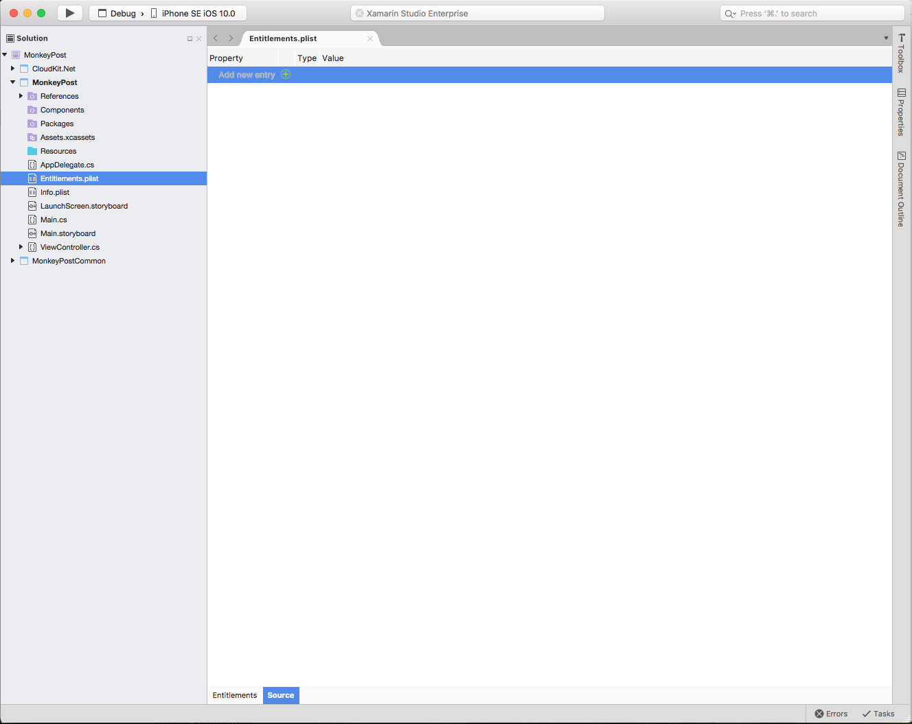
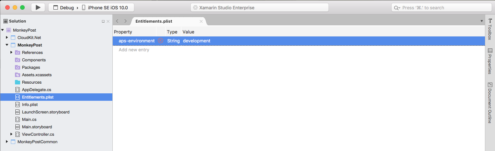
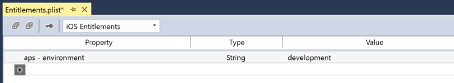
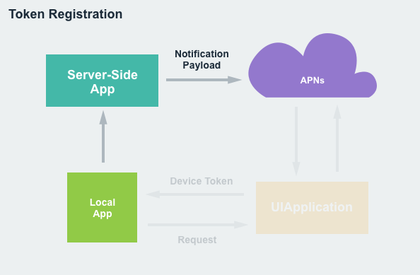
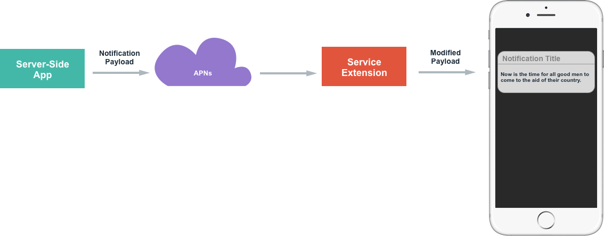
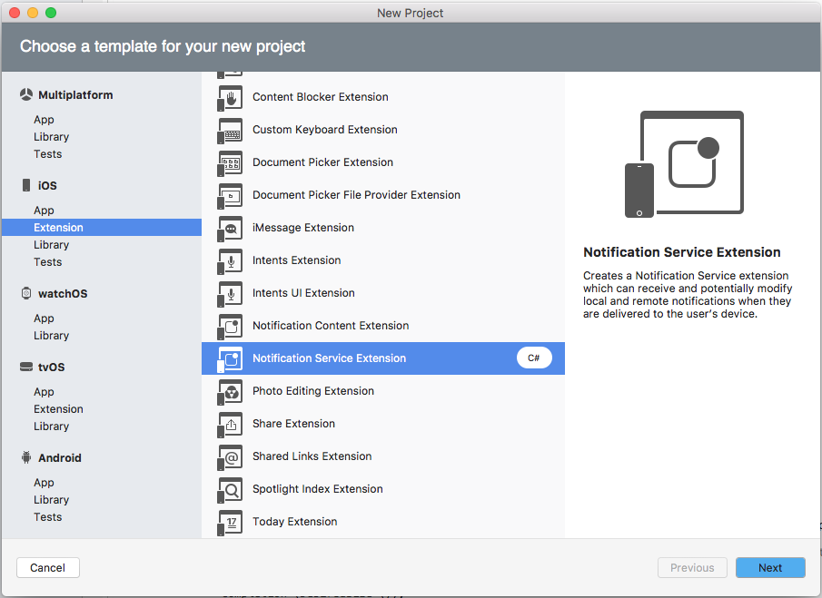
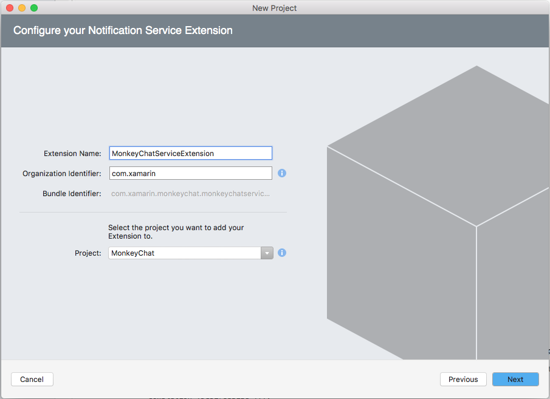
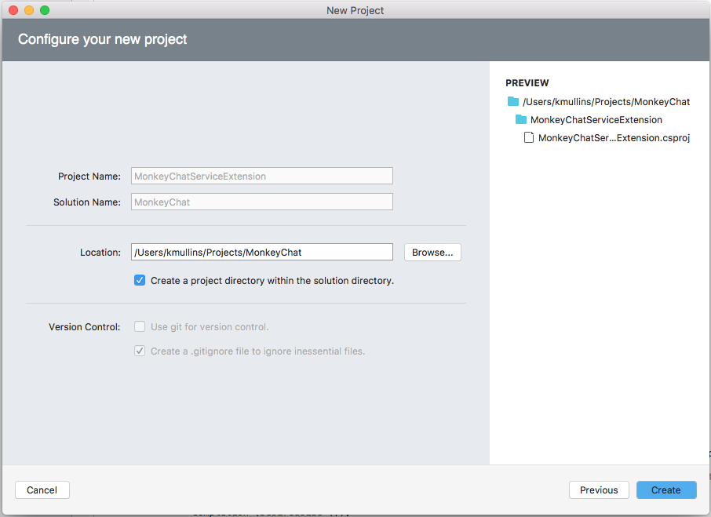
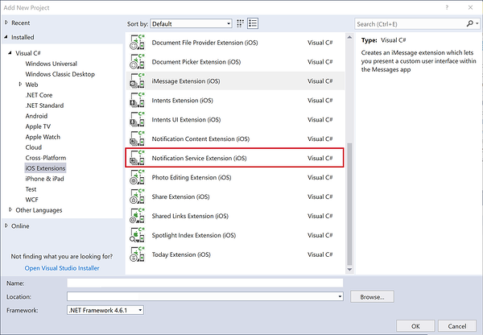

# Enhanced User Notifications in Xamarin.iOS

New to iOS 10, the User Notification framework allows for the delivery and handling of local and remote notifications. Using this framework, an app or App Extension can schedule the delivery of local notifications by specifying a set of conditions such as location or time of day.

## About User Notifications

As stated above, the new User Notification framework allows for the delivery and handling of local and remote notifications. Using this framework, an app or App Extension can schedule the delivery of local notifications by specifying a set of conditions such as location or time of day.

Additionally, the app or extension can receive (and potentially modify) both local and remote notifications as they are delivered to the user's iOS device.

The new User Notification UI framework allows an app or App Extension to customize the appearance of both local and remote notifications when they are presented to the user.

This framework provides the following ways that an app can deliver notifications to a user:

- **Visual Alerts** - Where the notification rolls down from the top of the screen as a banner.
- **Sound and Vibrations** - Can be associated with a notification.
- **App Icon Badging** - Where the app's icon displays a badge showing that new content is available, such as the number of unread email messages.

Additionally, depending on the user's current context, there are different ways that a notification will be presented:

- If the device is unlocked, the notification will roll down from the top of the screen as a banner.
- If the device is locked, the notification will be displayed on the user's lock screen.
- If the user has missed a notification, they can open the Notification Center and view any available, waiting notifications there.

A Xamarin.iOS app has two types of User Notifications that it is able to send:

- **Local Notifications** - These are sent by apps installed locally on the users device.
- **Remote Notifications** - Are sent from a remote server and either presented to the user or they trigger a background update of the app's content.

### About Local Notifications

The Local Notifications that an iOS app can send have the following features and attributes:

- They are sent by apps that are local on the user's device. 
- They are can be configured to use either time or location based triggers. 
- The app schedules the notification with the user's device and it is displayed when the trigger condition is met.
- When the user interacts with a notification, the app will receive a callback.

Some examples of Local Notifications include:

- Calendar Alerts
- Reminder Alerts
- Location Aware Triggers

For more information, please see Apple's [Local and Remote Notification Programming Guide](https://developer.apple.com/documentation/usernotifications) documentation.

### About Remote Notifications

The Remote Notifications that an iOS app can send have the following features and attributes:

- The app has a server-side component that it communicates with.
- The Apple Push Notification Service (APNs) is used to transmit a best-effort delivery of Remote Notifications to the user's device from the developer's cloud based servers.
- When the app receives the Remote Notification it will be displayed to the user.
- When the user interacts with the notification, the app will receive a callback.

Some examples of Remote Notifications include:

- News Alerts
- Sports Updates
- Instant Messaging Messages

There are two types of Remote Notifications available to a iOS app:

- **User Facing** - These are displayed to the user on the device.
- **Silent Updates** - These provide a mechanism to update the contents of an iOS app in the background. When a Silent Update is received, the app can reach out to the remote servers to pull down the latest content.

For more information, please see Apple's [Local and Remote Notification Programming Guide](https://developer.apple.com/documentation/usernotifications) documentation.

### About The Existing Notifications API

Prior to iOS 10, an iOS app would use `UIApplication` to register a notification with the system and to schedule how that notification should be triggered (either by time or location).

There are several issue that a developer might encounter when working with the existing notification API:

- There were different callbacks required for Local or Remote Notifications which could lead to duplication of code.
- The app had limited control of the notification after it had been scheduled with the system.
- There were differing levels of support across all of Apple's existing platforms.

### About the New User Notification Framework

With iOS 10, Apple has introduced the new User Notification framework, which replaces the existing `UIApplication` method noted above.

The User Notification framework provides the following:

- A familiar API that includes feature parity with the previous methods making it easy to port code from the existing framework.
- Includes an expanded set of content options that allows richer notifications to be sent to the user.
- Both Local and Remote Notifications can be handled by the same code and callbacks.
- Simplifies the process of handling callbacks that are sent to an app when the user interacts with a notification.
- Enhanced management of both pending and delivered notifications including the ability to remove or update notifications.
- Adds the ability to do in-app presentation of notifications.
- Adds the ability to schedule and handle notifications from within App Extensions.
- Adds new extension point for the notifications themselves. 

The new User Notification framework provides a unified notification API across the multiple of the platforms that Apple supports including: 

- **iOS** - Full support to manage and schedule notifications.
- **tvOS** - Adds the ability to badge app icons for local and remote notifications.
- **watchOS** - Adds the ability to forward notifications from the user's paired iOS device to their Apple Watch and gives watch apps the ability to do local notifications directly on the watch itself.
- **macOS** - Full support to manage and schedule notifications.

For more information, please see Apple's [UserNotifications Framework Reference](https://developer.apple.com/reference/usernotifications) and [UserNotificationsUI](https://developer.apple.com/reference/usernotificationsui) documentation.

## Preparing for Notification Delivery

Before an iOS app can send notifications to the user the app must be registered with the system and, because a notification is an interruption to the user, an app must explicitly request permission before sending them.

There are three different levels of notification requests that the user can approve for an app:

- Banner displays.
- Sound alerts.
- Badging the app icon.

Additionally, these approval levels must be requested and set for both local and remote notifications.

Notification permission should be requested as soon as the app launches by adding the following code to the `FinishedLaunching` method of the `AppDelegate` and setting the desired notification type (`UNAuthorizationOptions`):

> [!NOTE]
> `UNUserNotificationCenter` is only available from iOS 10+. Therefore, it's best practice to check the macOS version before sending the request. 

```csharp
using UserNotifications;
...

public override bool FinishedLaunching (UIApplication application, NSDictionary launchOptions)
{
    // Version check
    if (UIDevice.CurrentDevice.CheckSystemVersion (10, 0)) {
        // Request notification permissions from the user
        UNUserNotificationCenter.Current.RequestAuthorization (UNAuthorizationOptions.Alert, (approved, err) => {
            // Handle approval
        });
    }

    return true;
}
```

As this API is unified and also works on Mac 10.14+, if you are targetting macOS you must also check for the Notification permission as soon as possible:

```csharp
using UserNotifications;
...

public override void DidFinishLaunching (NSNotification notification)
{
    // Check we're at least v10.14
    if (NSProcessInfo.ProcessInfo.IsOperatingSystemAtLeastVersion (new NSOperatingSystemVersion (10, 14, 0))) {
        // Request notification permissions from the user
        UNUserNotificationCenter.Current.RequestAuthorization (UNAuthorizationOptions.Alert | UNAuthorizationOptions.Badge | UNAuthorizationOptions.Sound, (approved, err) => {
            // Handle approval
        });
    }
}

> [!NOTE]
> With MacOS apps, for the permission dialog to appear, you must sign your macOS app, even if building locally in DEBUG mode. Therefore, **Project->Options->Mac Signing->Sign the application bundle** must be checked.

Additionally, a user can always change the notification privileges for an app at any time using the **Settings** app on the device. The app should check for the user's requested notification privileges before presenting a notification using the following code:

```csharp
// Get current notification settings
UNUserNotificationCenter.Current.GetNotificationSettings ((settings) => {
    var alertsAllowed = (settings.AlertSetting == UNNotificationSetting.Enabled);
});    
``` 

### Configuring the Remote Notifications Environment

New to iOS 10, the developer must inform the OS what environment Push Notification are running in as either Development or Production. Failure to provide this information can result in the app being rejected when submitted to the iTune App Store with a notification similar to the following:

> Missing Push Notification Entitlement - Your app includes an API for Apple's Push Notification service, but the `aps-environment` entitlement is missing from the app's signature.

To provide the required entitlement, do the following:

# [Visual Studio for Mac](#tab/macos)

1. Double-click the `Entitlements.plist` file in the **Solution Pad** to open it for editing.
2. Switch to the **Source** view: 

    [](enhanced-user-notifications-images/setup01.png#lightbox)
3. Click the **+** button to add a new key.
4. Enter `aps-environment` for the **Property**, leave the **Type** as `String` and enter either `development` or `production` for the **Value**: 

    [](enhanced-user-notifications-images/setup02.png#lightbox)
5. Save the changes to the file.

# [Visual Studio](#tab/windows)

1. Double-click the `Entitlements.plist` file in the **Solution Explorer** to open it for editing.
2. Click the **+** button to add a new key.
3. Enter `aps-environment` for the **Property**, leave the **Type** as `String` and enter either `development` or `production` for the **Value**: 

    [](enhanced-user-notifications-images/setup02.png#lightbox)
4. Save the changes to the file.

-----

### Registering for Remote Notifications

If the app will be sending and receiving Remote Notifications, it will still need to do _Token Registration_ using the existing `UIApplication` API. This registration requires the device to have a live network connection access APNs, which will generate the necessary token that will be sent to the app. The app needs to then forward this token to the developer's server side app to register for remote notifications:

[](enhanced-user-notifications-images/token01.png#lightbox)

Use the following code to initialize the required registration:

```csharp
UIApplication.SharedApplication.RegisterForRemoteNotifications ();
```

The token that gets sent to the developer's server side app will need to be included as part of the Notification Payload that get's sent from the server to APNs when sending a Remote Notification:

[](enhanced-user-notifications-images/token02.png#lightbox)

The token acts as the key that ties together the notification and the app used to open or respond to the notification.

For more information, please see Apple's [Local and Remote Notification Programming Guide](https://developer.apple.com/documentation/usernotifications) documentation.

## Notification Delivery

With the app fully registered and the required permissions requested from and granted by the user, the app is now ready to send and receive notifications. 

### Providing Notification Content

New to iOS 10, all notifications contain both a **Title** and **Subtitle** that will always be displayed with the **Body** of the notification content. Also new, is the ability to add **Media Attachments** to the notification content.

To create the content of a Local Notification, use the following code:

```csharp
var content = new UNMutableNotificationContent();
content.Title = "Notification Title";
content.Subtitle = "Notification Subtitle";
content.Body = "This is the message body of the notification.";
content.Badge = 1;
```

For Remote Notifications, the process is similar:

```csharp
{
    "aps":{
        "alert":{
            "title":"Notification Title",
            "subtitle":"Notification Subtitle",
            "body":"This is the message body of the notification."
        },
        "badge":1
    }
}
```

### Scheduling When a Notification is Sent

With the content of the Notification created, the app needs to schedule when the notification will be presented to the user by setting a *Trigger*. iOS 10 provides four different Trigger types:

- **Push Notification** - Is used exclusively with Remote Notifications and is triggered when APNs sends a notification package to the app running on the device.
- **Time Interval** - Allows a Local Notification to be scheduled from a time interval start with now and ending a some future point. For example, `var trigger =  UNTimeIntervalNotificationTrigger.CreateTrigger (5, false);`
- **Calendar Date** - Allows Local Notifications to be scheduled for a specific date and time.
- **Location Based** - Allows Local Notifications to be scheduled when the iOS device is entering or leaving a specific geographic location or is in a given proximity to any Bluetooth Beacons.

When a Local Notification is ready, the app needs to call the `Add` method of the `UNUserNotificationCenter` object to schedule its display to the user. For Remote Notifications, the server-side app sends a Notification Payload to the APNs, which then sends the packet on to the user's device.

Bringing all of the pieces together, a sample Local Notification might look like:

```csharp
using UserNotifications;
...

var content = new UNMutableNotificationContent ();
content.Title = "Notification Title";
content.Subtitle = "Notification Subtitle";
content.Body = "This is the message body of the notification.";
content.Badge = 1;

var trigger =  UNTimeIntervalNotificationTrigger.CreateTrigger (5, false);

var requestID = "sampleRequest";
var request = UNNotificationRequest.FromIdentifier (requestID, content, trigger);

UNUserNotificationCenter.Current.AddNotificationRequest (request, (err) => {
    if (err != null) {
        // Do something with error...
    }
});
```

## Handling Foreground App Notifications

New to iOS 10, an app can handle Notifications differently when it is in the foreground and a Notification is triggered. By providing a `UNUserNotificationCenterDelegate` and implementing the `WillPresentNotification` method, the app can take over responsibility for displaying the Notification. For example:

```csharp
using System;
using UserNotifications;

namespace MonkeyNotification
{
    public class UserNotificationCenterDelegate : UNUserNotificationCenterDelegate
    {
        #region Constructors
        public UserNotificationCenterDelegate ()
        {
        }
        #endregion

        #region Override Methods
        public override void WillPresentNotification (UNUserNotificationCenter center, UNNotification notification, Action<UNNotificationPresentationOptions> completionHandler)
        {
            // Do something with the notification
            Console.WriteLine ("Active Notification: {0}", notification);

            // Tell system to display the notification anyway or use
            // `None` to say we have handled the display locally.
            completionHandler (UNNotificationPresentationOptions.Alert);
        }
        #endregion
    }
}
```

This code is simply writing out the contents of the `UNNotification` to the Application Output and asking the system to display the standard Alert for the notification. 

If the app wanted to display the notification itself when it was in the foreground, and not use the system defaults, pass `None` to the completion handler. Example:

```csharp
completionHandler (UNNotificationPresentationOptions.None);
```

With this code in place, open the `AppDelegate.cs` file for editing and change the `FinishedLaunching` method to look like the following:

```csharp
public override bool FinishedLaunching (UIApplication application, NSDictionary launchOptions)
{
    // Request notification permissions from the user
    UNUserNotificationCenter.Current.RequestAuthorization (UNAuthorizationOptions.Alert, (approved, err) => {
        // Handle approval
    });

    // Watch for notifications while the app is active
    UNUserNotificationCenter.Current.Delegate = new UserNotificationCenterDelegate ();

    return true;
}
```

This code is attaching the custom `UNUserNotificationCenterDelegate` from above to the current `UNUserNotificationCenter` so the app can handle notification while it is active and in the foreground.

## Notification Management

New to iOS 10, Notification Management provides access to both pending and delivered Notifications and adds the ability to remove, update or promote these Notifications.

An important part of Notification Management is the _Request Identifier_ that was assigned to the Notification when it was created and scheduled with the system. For Remote Notifications, this is assigned via the new `apps-collapse-id` field in the HTTP request header.

The Request Identifier is used to select the Notification that the app wishes to perform Notification Management on.

### Removing Notifications

To remove a pending Notification from the system, use the following code:

```csharp
var requests = new string [] { "sampleRequest" };
UNUserNotificationCenter.Current.RemovePendingNotificationRequests (requests);
```

To remove an already delivered Notification, use the following code:

```csharp
var requests = new string [] { "sampleRequest" };
UNUserNotificationCenter.Current.RemoveDeliveredNotifications (requests);
```

### Updating an Existing Notification

To update an existing Notification, simply create a new notification with the desired parameters modified (such as a new trigger time) and add it to the system with the same Request Identifier as the Notification that needs to be modified. Example:

```csharp
using UserNotifications;
...

// Rebuild notification
var content = new UNMutableNotificationContent ();
content.Title = "Notification Title";
content.Subtitle = "Notification Subtitle";
content.Body = "This is the message body of the notification.";
content.Badge = 1;

// New trigger time
var trigger = UNTimeIntervalNotificationTrigger.CreateTrigger (10, false);

// ID of Notification to be updated
var requestID = "sampleRequest";
var request = UNNotificationRequest.FromIdentifier (requestID, content, trigger);

// Add to system to modify existing Notification
UNUserNotificationCenter.Current.AddNotificationRequest (request, (err) => {
    if (err != null) {
        // Do something with error...
    }
});
```

For already delivered Notifications, the existing Notification will get updated and promoted to the top of the list on the Home and Lock screens and in the Notification Center if it has already been read by the user.

## Working with Notification Actions

In iOS 10, Notifications that are delivered to the user are not static, and provide several ways that the user can interact with them (from built-in to custom Actions).

There are three types of Actions that an iOS app can respond to:

- **Default Action** - This is when the user taps a Notification to open the app and display the details of the given Notification.
- **Custom Actions** - These were added in iOS 8 and provide a quick way for the user to perform a custom task directly from the Notification without needing to launch the app. They can be presented as either a list of buttons with customizable titles or a text input field which can run either in the Background (where the app is given a small amount of time to fulfill the request) or the Foreground (where the app is launched in the foreground to fulfill the request). Custom Actions are available on both iOS and watchOS.
- **Dismiss Action** - This Action is sent to the app when the user dismisses a given Notification.

### Creating Custom Actions

To create and register a Custom Action with the system, use the following code:

```csharp
// Create action
var actionID = "reply";
var title = "Reply";
var action = UNNotificationAction.FromIdentifier (actionID, title, UNNotificationActionOptions.None);

// Create category
var categoryID = "message";
var actions = new UNNotificationAction [] { action };
var intentIDs = new string [] { };
var categoryOptions = new UNNotificationCategoryOptions [] { };
var category = UNNotificationCategory.FromIdentifier (categoryID, actions, intentIDs, UNNotificationCategoryOptions.None);
    
// Register category
var categories = new UNNotificationCategory [] { category };
UNUserNotificationCenter.Current.SetNotificationCategories (new NSSet<UNNotificationCategory>(categories)); 
```

When creating a new `UNNotificationAction`, it is assigned a unique ID and the title that will appear on the button. By default, the Action will be created as a Background Action, however options can be supplied to adjust the Action's behavior (for example setting it to be a Foreground Action).

Each of the Actions created need to be associated with a Category. When creating a new `UNNotificationCategory`, it is assigned a unique ID, a list of Actions it can perform, a list of Intent IDs to provide more information about the intent of the Actions in the Category and some options to control the behavior of the Category.

Finally, all of the Categories are registered with the system using the `SetNotificationCategories` method.

### Presenting Custom Actions

Once a set of Custom Actions and Categories have been created and registered with the system, they can be presented from either Local or Remote Notifications.

For Remote Notification, set a `category` in the Remote Notification Payload that matches one of the Categories created above. For example:

```csharp
{
    aps:{
        alert:"Hello world!",
        category:"message"
    }
}
```

For Local Notifications, set the `CategoryIdentifier` property of the `UNMutableNotificationContent` object. For example:

```csharp
var content = new UNMutableNotificationContent ();
content.Title = "Notification Title";
content.Subtitle = "Notification Subtitle";
content.Body = "This is the message body of the notification.";
content.Badge = 1;
content.CategoryIdentifier = "message";
...
```

Again, this ID needs to match one of the Categories that was created above.

### Handling Dismiss Actions

As stated above, a Dismiss Action can be sent to the app when the user dismisses a Notification. Since this is not a standard Action, a option will need to be set when the Category is created. For example:

```csharp
var categoryID = "message";
var actions = new UNNotificationAction [] { action };
var intentIDs = new string [] { };
var categoryOptions = new UNNotificationCategoryOptions [] { };
var category = UNNotificationCategory.FromIdentifier (categoryID, actions, intentIDs, UNNotificationCategoryOptions.CustomDismissAction);

```

### Handling Action Responses

When the user interacts with the Custom Actions and Categories that were created above, the app needs to fulfill the requested task. This is done by providing a `UNUserNotificationCenterDelegate` and implementing the `UserNotificationCenter` method. For example:

```csharp
using System;
using UserNotifications;

namespace MonkeyNotification
{
    public class UserNotificationCenterDelegate : UNUserNotificationCenterDelegate
    {
        ...

        #region Override Methods
        public override void DidReceiveNotificationResponse (UNUserNotificationCenter center, UNNotificationResponse response, Action completionHandler)
        {
            // Take action based on Action ID
            switch (response.ActionIdentifier) {
            case "reply":
                // Do something
                break;
            default:
                // Take action based on identifier
                if (response.IsDefaultAction) {
                    // Handle default action...
                } else if (response.IsDismissAction) {
                    // Handle dismiss action
                }
                break;
            }

            // Inform caller it has been handled
            completionHandler();
        }
        #endregion
    }
}
```

The passed in `UNNotificationResponse` class has an `ActionIdentifier` property that can either be the Default Action or the Dismiss Action. Use `response.Notification.Request.Identifier` to test for any custom actions.

The `UserText` property holds the value of any user text input. The `Notification` property holds the originating Notification that includes the Request with the Trigger and Notification Content. The app can decide if it was a Local or Remote Notification based on the type of trigger.

> [!NOTE]
> iOS 12 makes it possible for a custom notification UI to modify its
> action buttons at runtime. For more information, take a look at the
> [dynamic notification action buttons](~/ios/platform/introduction-to-ios12/notifications/dynamic-actions.md)
> documentation.

## Working with Service Extensions

When working with Remote Notifications, _Service Extensions_ provide a way to enable end-to-end encryption inside of the Notification Payload. Service Extensions are a non-User Interface extension (available in iOS 10) that run in the background with the main purpose of augmenting or replacing the visible content of a Notification before it is presented to the user. 

[](enhanced-user-notifications-images/extension01.png#lightbox)

Service Extensions are meant to run quickly and are only given a short amount of time to execute by the system. In the event that the Service Extension fails to complete its task in the allotted amount of time, a fallback method will be called. If the fallback fails, the original Notification Content will be displayed to the user.

Some potential uses of Service Extensions include:

- Providing end-to-end encryption of the Remote Notification content.
- Adding attachments to Remote Notifications to enrich them.

### Implementing a Service Extension

To implement a Service Extension in a Xamarin.iOS app, do the following:

# [Visual Studio for Mac](#tab/macos)

1. Open the app's solution in Visual Studio for Mac.
2. Right-click on the Solution Name in the **Solution Pad** and select **Add** > **Add New Project**.
3. Select **iOS** > **Extensions** > **Notification Service Extensions** and click the **Next** button: 

    [](enhanced-user-notifications-images/extension02.png#lightbox)
4. Enter a **Name** for the extension and click the **Next** button: 

    [](enhanced-user-notifications-images/extension03.png#lightbox)
5. Adjust the **Project Name** and/or **Solution Name** if required and click the **Create** button: 

    [](enhanced-user-notifications-images/extension04.png#lightbox) 

# [Visual Studio](#tab/windows)

1. Open the app's solution in Visual Studio.
2. Right-click on the Solution Name in the **Solution Explorer** and select **Add > New Project...**.
3. Select **Visual C# > iOS Extensions > Notification Service Extension**:

    [](enhanced-user-notifications-images/extension01.w157.png#lightbox)
4. Enter a **Name** for the extension and click the **OK** button.

-----

> [!IMPORTANT]
> The Bundle Identifier for the service extension should match the Bundle Identifier of the main app with `.appnameserviceextension` appended to the end. For example, if the main app had a Bundle Identifier of  `com.xamarin.monkeynotify`, the service extension should have a Bundle Identifier of `com.xamarin.monkeynotify.monkeynotifyserviceextension`. This should automatically be set when the extension is added to the solution. 

There is one main class in the Notification Service Extension that will need to be modified to provide the required functionality. For example:

```csharp
using System;
using Foundation;
using UIKit;
using UserNotifications;

namespace MonkeyChatServiceExtension
{
    [Register ("NotificationService")]
    public class NotificationService : UNNotificationServiceExtension
    {
        #region Computed Properties
        public Action<UNNotificationContent> ContentHandler { get; set; }
        public UNMutableNotificationContent BestAttemptContent { get; set; }
        #endregion

        #region Constructors
        protected NotificationService (IntPtr handle) : base (handle)
        {
            // Note: this .ctor should not contain any initialization logic.
        }
        #endregion

        #region Override Methods
        public override void DidReceiveNotificationRequest (UNNotificationRequest request, Action<UNNotificationContent> contentHandler)
        {
            ContentHandler = contentHandler;
            BestAttemptContent = (UNMutableNotificationContent)request.Content.MutableCopy ();

            // Modify the notification content here...
            BestAttemptContent.Title = $"{BestAttemptContent.Title}[modified]";

            ContentHandler (BestAttemptContent);
        }

        public override void TimeWillExpire ()
        {
            // Called just before the extension will be terminated by the system.
            // Use this as an opportunity to deliver your "best attempt" at modified content, otherwise the original push payload will be used.

            ContentHandler (BestAttemptContent);
        }
        #endregion
    }
}
```

The first method, `DidReceiveNotificationRequest`, will be passed the Notification Identifier as well as the Notification Content via the `request` object. The passed in `contentHandler` will need to be called to present the Notification to the user.

The second method, `TimeWillExpire`, will be called just before time is about to run out for the Service Extension to process the request. If the Service Extension fails to call the `contentHandler` in the allotted amount of time, the original content will be displayed to the user.

### Triggering a Service Extension

With a Service Extension created and delivered with the app, it can be triggered by modifying the Remote Notification Payload sent to the device. For example:

```csharp
{
    aps : {
        alert : "New Message Available",
        mutable-content: 1
    },
    encrypted-content : "#theencryptedcontent"
}
```

The new `mutable-content` key specifies that the Service Extension will need to be launched to update the Remote Notification content. The `encrypted-content` key holds the encrypted data that the Service Extension can decrypt before presenting to the user.

Take a look at the following example Service Extension:

```csharp
using UserNotification;

namespace myApp {
    public class NotificationService : UNNotificationServiceExtension {
    
        public override void DidReceiveNotificationRequest(UNNotificationRequest request, contentHandler) {
            // Decrypt payload
            var decryptedBody = Decrypt(Request.Content.UserInfo["encrypted-content"]);
            
            // Modify Notification body
            var newContent = new UNMutableNotificationContent();
            newContent.Body = decryptedBody;
            
            // Present to user
            contentHandler(newContent);
        }
        
        public override void TimeWillExpire() {
            // Handle out-of-time fallback event
            ...
        }
        
    }
}
```

This code decrypts the encrypted content from the `encrypted-content` key, creates a new `UNMutableNotificationContent`, sets the `Body` property to the decrypted content and uses the `contentHandler` to present the notification to the user.

## Summary

This article has covered all of the ways that Users Notification have been enhanced by iOS 10. It presented the new User Notification framework and how to use it in a Xamarin.iOS app or App Extension.

## Related Links

- [iOS 10 Samples](/samples/browse/?products=xamarin&term=Xamarin.iOS%2biOS10)
- [UserNotifications Framework Reference](https://developer.apple.com/reference/usernotifications)
- [UserNotificationsUI](https://developer.apple.com/reference/usernotificationsui)
- [Local and Remote Notification Programming Guide](https://developer.apple.com/documentation/usernotifications)
