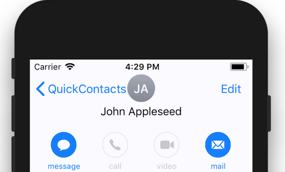
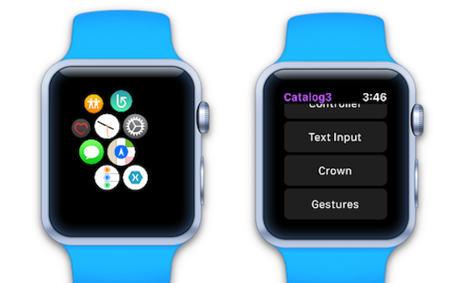
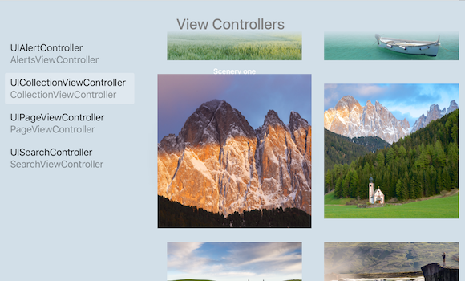

# Xamarin.iOS samples

Xamarin.iOS sample apps and code demos to help you get started building mobile apps with C# and Xamarin.

[All Xamarin.iOS samples](/samples/browse/?products=xamarin&term=Xamarin.iOS)

:::row:::
      :::column:::

### [ARKit (iOS 11)](/samples/xamarin/ios-samples/ios11-arkitplacingobjects/)

ARKit augmented reality demo to place objects on detected surfaces.
    :::column-end:::
    :::column:::

### [MapKit (iOS 11)](/samples/xamarin/ios-samples/ios11-mapkitsample/)

New iOS 11 features in MapKit: grouping and splitting markers based on zoom-level.
    :::column-end:::
    :::column:::

### [CoreML & Azure (iOS 11)](/samples/xamarin/ios-samples/ios11-coremlazuremodel/)

iOS 11 Vision framework and CoreML, using a model trained with Azure's Custom Vision Service.
    :::column-end:::
:::row-end:::

:::row:::
    :::column:::

### [Contacts](/samples/xamarin/ios-samples/contacts)

How to use ContactsUI view controllers and properties.
    :::column-end:::
    :::column:::

### [WatchKit Catalog](/samples/xamarin/ios-samples/watchos-watchkitcatalog/)

UI control suite available in watchOS.
    :::column-end:::
    :::column:::

### [tvOS UI Catalog](/samples/xamarin/ios-samples/tvos-uicatalog/)

Demonstrates how to use many views and controls in the UIKit framework on tvOS.
    :::column-end:::
:::row-end:::

## All samples

For the complete set of Xamarin iOS sample apps and code demos, see [All Xamarin.iOS samples](/samples/browse/?products=xamarin&term=Xamarin.iOS).