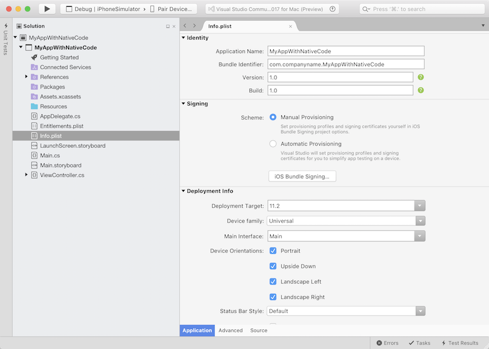
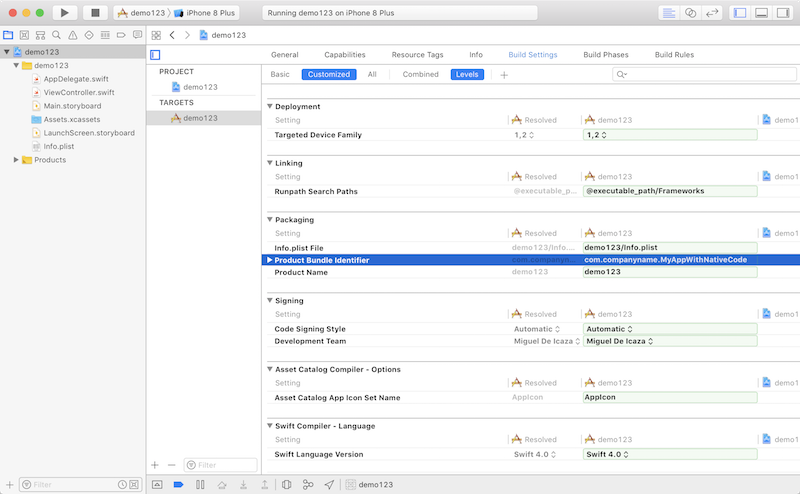
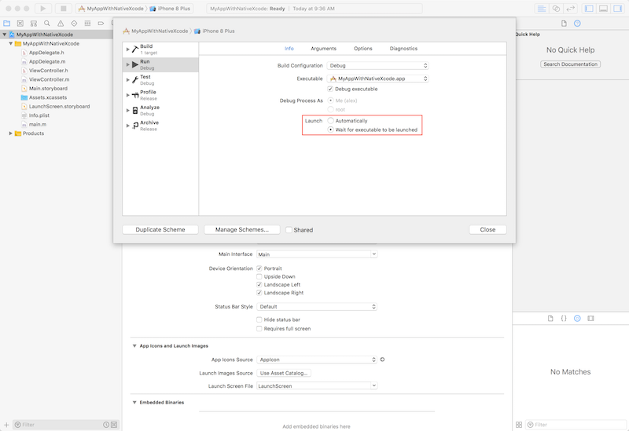

# Debugging Xamarin.iOS apps with Xcode

There might be scenarios where you want to use Xcode to debug some parts
of your Xamarin.iOS application. While you will not be able to debug the
.NET code in it, you will still be able to debug native code and use some
of the native visualizers in Xcode.

## Walkthrough

While there is no built-in support for Xcode debugging in Visual Studio
for Mac, you can use the following steps to achieve this:

1. Create an Xcode iOS app with the same bundle ID as the one in your
   Xamarin app.
   
    - You can find your Xamarin.iOS project's bundle identifier by
    opening the **Info.plist** file:

        

    - In Xcode, you set the bundle identifier when creating your project or
    by selecting your target in the project:

        

2. Change the Xcode project to wait for launch instead of launching the app
   automatically:

    - Open the **Edit Scheme Panel** by selecting **Product >
    Scheme > Edit Scheme** or using the **cmd⌘ + <** keyboard shortcut.

    - Select the **Run** scheme, and in the right panel you should see
    **Launch** options. Select **Wait for executable to be launched** and
    click **Close**.

        

3. Run the Xcode project.

    This will install the dummy Xcode app on your device, but will not
    launch it.

4. Run the Xamarin app.

    Xcode should attach to the Xamarin app when it launches.

### Caveats

You might have to make a small change to the Xamarin.iOS app every time you
launch. Otherwise, Visual Studio for Mac will detect that the app doesn't
need to be built *and* is already installed, and it won't reinstall it over 
the Xcode dummy app.

## Alternative - using lldb

If you are comfortable with using **lldb** from the command line, there's
a much simpler solution.

On the shell, type the following command:

```bash
touch ~/.mtouch-launch-with-lldb
```

You will get instructions in the **Application Output** window on what to
do, but basically, when you run your application, you will be able to use
**lldb** from the command line to debug your application.
