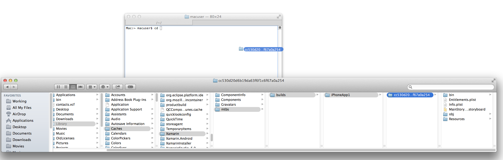
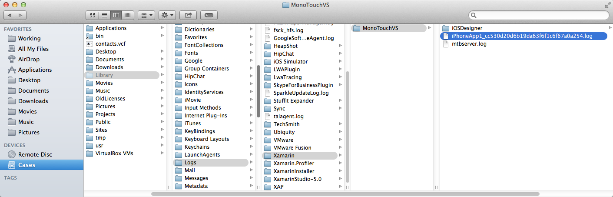

# Can I add files to or remove files from an IPA file after building it in Visual Studio?

Yes, it is possible but it will usually require that you re-sign the `.app` bundle after making the change.

Note that modifying the `.ipa` file is not necessary in normal use. This article is provided purely for informational purposes.

## Example: removing a file from a `.ipa` archive

For this example assume that the name of the Xamarin.iOS project is `iPhoneApp1` and the `generated session id` is `cc530d20d6b19da63f6f1c6f67a0a254`

1. Build the `.ipa` file as normal from Visual Studio.

2. Switch over to the Mac build host.

3. Find the build in the `~/Library/Caches/Xamarin/mtbs/builds` folder. You can paste this path into **Finder > Go > Go to Folder** to browse the folder in Finder. Look for the folder that matches the project name. Within that folder, look for the folder that matches the `generated session id` of the build. This will most likely be the subfolder that has the most recent modification time.

4. Open a new `Terminal.app` window.

5. Type `cd` into the Terminal.app window, and then drag & drop the `generated session id` folder into the `Terminal.app` window:

    

6. Type the return key to change directory into the `generated session id` folder.

7. Unzip the `.ipa` file into a temporary `old/` folder using the following command. Adjust the `Ad-Hoc` and `iPhoneApp1` names as needed for your particular project.

    > ditto -xk bin/iPhone/Ad-Hoc/iPhoneApp1-1.0.ipa old/

8. Keep the `Terminal.app` window open.

9. Delete the desired files from the `.ipa`. You can either move them to the Trash using Finder, or delete them on the command line using `Terminal.app`. To view the contents of the `Payload/iPhone` file in Finder, Control-click the file and select **Show Package Contents**.

10. Using the same general approach as in step 3, find the log file under `~/Library/Logs/Xamarin/MonoTouchVS/` that has both the project name and the `generated session id` in the name:
    

11. Open the build log from step 10, for example by double-clicking it.

12. Find the line that includes `tool /usr/bin/codesign execution started with arguments: -v --force --sign`.

13. Type `/usr/bin/codesign` into the Terminal.app window from step 8.

14. Copy all of the arguments starting with `-v` from the line in step 12, and paste them into the Terminal.app window.

15. Change the last argument to be the `.app` bundle located within the `old/Payload/` folder, and then run the command.

    ```bash
    /usr/bin/codesign -v --force --sign SOME_LONG_STRING in/iPhone/Ad-Hoc/iPhoneApp1.app/ResourceRules.plist --entitlements obj/iPhone/Ad-Hoc/Entitlements.xcent old/Payload/iPhoneApp1.app
    ```

16. Change into the `old/` directory in Terminal:

    ```bash
    cd old
    ```

17. Zip up the contents of the directory into a new `.ipa` file using the `zip` command. You can change the `"$HOME/Desktop/iPhoneApp1-1.0.ipa"` argument to output the `.ipa` file wherever you'd like:

    ```bash
    zip -yr "$HOME/Desktop/iPhoneApp1-1.0.ipa" *
    ```

## Common error messages

If you see `Invalid Signature. A sealed resource is missing or invalid.`, that generally means that something was changed within the `.app` bundle, and that the `.app` bundle was not correctly re-signed afterwards. Also note that if you wish to create an `.ipa` with a distribution profile, you _must_ build the original `.ipa` with a distribution profile. Otherwise the `Entitlements.xcent` will be incorrect.

To give a concrete example of how this error can arise, if you run the following `codesign --verify` command in the Terminal window after step 9, you will see the error along with the precise cause of the error:

```bash
$ codesign -dvvv --no-strict --verify old/Payload/iPhoneApp1.app
old/Payload/iPhoneApp1.app: a sealed resource is missing or invalid
file missing: /Users/macuser/Library/Caches/Xamarin/mtbs/builds/iPhoneApp1/cc530d20d6b19da63f6f1c6f67a0a254/old/Payload/iPhoneApp1.app/MyFile.png
```

And the App Store verification process will report a similar error message:

> ERROR ITMS-90035: "Invalid Signature. A sealed resource is missing or invalid. The binary at path [iPhoneApp1.app/iPhoneApp1] contains an invalid signature. Make sure you have signed your application with a distribution certificate, not an ad hoc certificate or a development certificate. Verify that the code signing settings in Xcode are correct at the target level (which override any values at the project level). Additionally, make sure the bundle you are uploading was built using a Release target in Xcode, not a Simulator target. If you are certain your code signing settings are correct, choose "Clean All" in Xcode, delete the "build" directory in the Finder, and rebuild your release target. For more information, please consult [https://developer.apple.com/library/ios/documentation/Security/Conceptual/CodeSigningGuide/Introduction/Introduction.html](https://developer.apple.com/library/ios/documentation/Security/Conceptual/CodeSigningGuide/Introduction/Introduction.html)"
