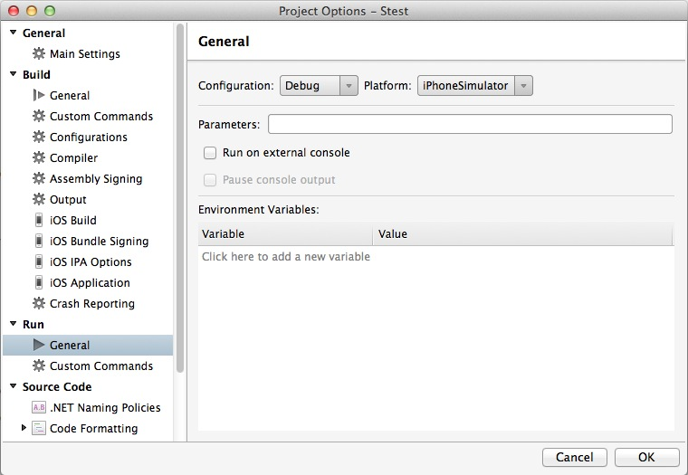

# How do I set Mono Runtime environment variables for iOS projects in Xamarin Studio?

If you need to set any runtime environment variables for Mono, they can be set in the **Project Options > Run > General** page.

Note: Garbage Collection environment variables for SGen (MONO\_GC\_PARAMS) set this way will only be used when launching from Xamarin Studio. If you launch the app from the device, the settings for Sgen will be ignored. 

To permanently set an environment variable for an app, you need to add this as an additional mtouch argument (for all relevant configurations):

```csharp
   --setenv=NAME=VALUE
```

To see the environment variables that can be set, refer to the Mono man page:  [http://docs.go-mono.com/?link=man%3amono(1)](http://docs.go-mono.com/?link=man%3amono(1))
See the section titled: `ENVIRONMENT VARIABLES`


