# Working with tvOS Icons and Images in Xamarin

Creating captivating icons and imagery are a critical part of developing an immersive user experience for your Apple TV apps. This guide will cover the steps required to create and include the necessary graphic assets for your Xamarin.tvOS apps:

- [Launch Image](#Launch-Image) - A launch image displays when your app is first started, and is replaced by the app's first screen once launch has completed.
- [Layered Images](#Layered-Images) - Specific to the Apple TV, Apple's new Layered Images work with the Parallax Effect to create a 3D effect for selected items. There are several ways to [Create Layered Images](#Creating-Layered-Images).
- [App Icon](#App-Icons) - Icons are required for not only the Apple TV Home screen but for the App Store. They must be provided as a Layered Image.
- [Top Shelf Image](#Top-Shelf-Image) - If your app is placed on the Top Row of the Home screen, it will need a Top Shelf Image to highlight your app's features. Optionally, you can provide [Dynamic Top Shelf Content](#Dynamic-Top-Shelf-Content) to highlight the content in your app.
- [Game Center Images](#Game-Center-Images) - If your app is a game and uses Game Center, several additional images will be required.
- [Setting Xamarin.tvOS Project Images](#Setting-Xamarin.tvOS-Project-Images) - Covers the steps required to set the Launch Image and App Icon for your Xamarin.tvOS app.

> [!IMPORTANT]
> All images on the Apple TV are at the 1x resolution (`@1x`) and you should _only_ use images of this size. Including larger, higher-resolution graphics not only take time to download and use more memory and storage, but they have to be dynamically rescaled at runtime and will negatively affect drawing performance.

## Launch Image

The Launch Image is the first thing that is displayed when your Xamarin.tvOS app is initially started on the Apple TV, and as such, every tvOS app must supply a Launch Image.

The Launch Image appears quickly and gives the impression that your app is fast and responsive. The Apple TV will replace the Launch Image with the first screen of your app shortly there after.

Launch Images are not an opportunity for ads or artistic expression, they exist only to give the impression that your app launches quickly and is ready to use.

|Launch Image Size|Notes|
|---|---|
|1920x1080px|Non-layered .png files only|

Apple makes the following suggestions for designing your app's Launch Image:

- **Nearly Identical to the First Screen** - Your Launch Screen should be as close to your app's first screen as possible. Including different graphics or element can result in an annoying "flash" when the first screen appears.
- **Avoid Using Text** - Launch Images are static and as such, will not be localized before being displayed.
- **Downplay Launch** - Because Apple TV users frequently switch apps, you shouldn't draw attention to the app launch process.
- **No Ads or Branding** - Your Launch Image should not be used as an About screen or include any branding unless it is static part of your app's first screen. Ads are strictly prohibited.

### Setting the Launch Image

To set the Launch Image for your tvOS project, please do the following:

1. In the **Solution Explorer**, double-click `Assets.xcassets` to open it for editing:

    [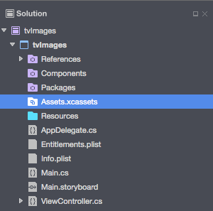](icons-images-images/asset01.png#lightbox)
2. In the **Asset Editor**, click on the `LaunchImages` asset:

    
3. Click on the **1x Apple TV** entry and select the Launch Image or optionally drag a new image in from the file system:

    [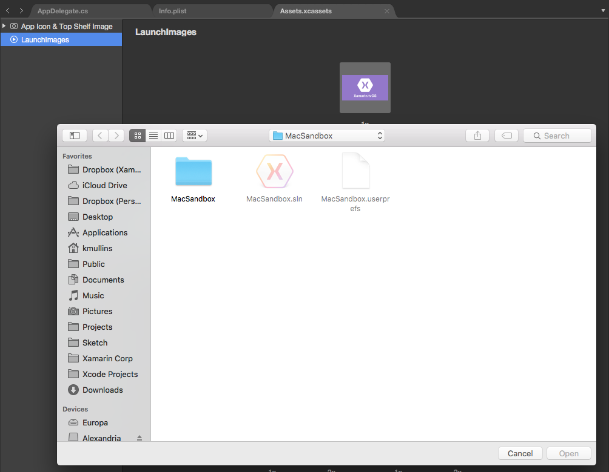](icons-images-images/asset03.png#lightbox)
4. Save your changes.

## Layered Images

New to the Apple TV, Layered Images work with the Parallax Effect to produce a 3D effect that helps to keep the user on the couch mentally connected to the content on the screen across the room.

Layered Images contain from two (2) to five (5) separate layers that are combined to form a complete image. With the exception of the background layer, each layer uses its Z-order along with transparency to create an illusion of depth. When the user interacts with a Layered Image, higher Z-ordered layers are scaled and overlapped to create this effect.

[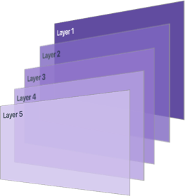](icons-images-images/layered01.png#lightbox)

> [!IMPORTANT]
> Layered Images are required for your app's icons and are optional for other [Focusable Items](~/ios/tvos/app-fundamentals/navigation-focus.md#Focus-and-Selection) (such as the Top Shelf Image). However, Apple suggests using Layered Images for any image that can get focus in your app.

Apple makes the following suggestions for designing your Layered Images:

- **Make the Background Layer Opaque** - Your background layer (layer 1) **must** be opaque or you'll get an error when you try to use the Layered Image on Apple TV. All other layers can contain multiple levels of transparency to enhance the 3D effect.
- **Isolate Foreground, Middle and Background Elements** - Place prominent elements (like game characters) in the foreground, use the middle for secondary elements or shadows. Finally, include a neutral background to provide a stage for your upper layers.
- **Keep Text in the Foreground** - Unless you want your text to be obscured by higher levels, generally it should be on the topmost layer.
- **Use Simple Layering** - The Parallax Effect was designed to be subtle so keep your layers to a minimal to prevent jarring, unrealistic effects.
- **Include a Safe Zone** - Because upper layers can be cropped during a Parallax Effect, you need to build a Safe Zone border into each layer. If you get your content too close the layers edge, it can become cropped off. Upper layers will experience more scaling and cropping than lower layers. See the [Sizing Image Layers](#Sizing-Image-Layers) section below.
- **Preview Often** - Layered Images should be previewed often to ensure that the desired 3D effect occurs and that none of the content on the individual layers is being cropped. You should preview your Layered Images on real Apple TV hardware to make sure they render as expected.

Whenever possible, you should always use the built-in `UIKit` controls to display your Layered Images, as they will automatically get the Parallax Effect when they come into focus.

### Sizing Image Layers

It is important to remember to include a _Safe Zone_ border into each layer that will compose your Layered Image. Because the individual layers can be scaled and cropped during the Parallax Effect, the content of the layers can be cropped off if it is too close to the layer's edge:

[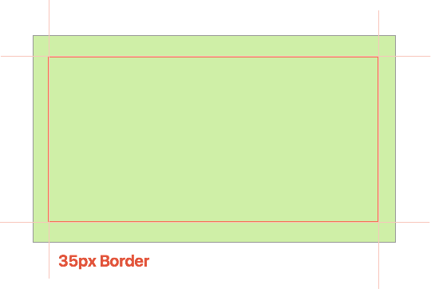](icons-images-images/layered02.png#lightbox)

### Creating Layered Images

tvOS works with Layered Images in the following formats:

- **CAR Files** - This is a proprietary Asset Catalog format created by Apple. You do not create CAR files directly, they are created at compile time from any LSR files and included in your app bundle.
- **LSR Images** - This is a proprietary image format created by Apple. Use the [Parallax Exporter Adobe Photoshop Plugin](https://itunespartner.apple.com/assets/downloads/ParallaxExporter_Apps.zip) or the [Parallax Previewer](https://itunespartner.apple.com/assets/downloads/Parallax%20Previewer.dmg) to create and preview Layered Images in the LSR format.
- **Assets.xcassets** - From two (2) to five (5) standard `.png` formatted images included in an Asset Catalog that will be compiled into a CAR or LSR formatted Layered Image at compile time.
- **LCR Files** - This is a proprietary file format created by Apple. LCR files are intended to be used as additional content downloaded from one of your content servers. LCR file should never be included in your app bundle. LCR files are generated from LSR or Photoshop files using the `layerutil` command line tool included with Xcode.

### The Parallax Previewer

Apple created the [Parallax Previewer](https://itunespartner.apple.com/assets/downloads/Parallax%20Previewer.dmg) to preview and created Layered Images required for App Icons and optional Focusable Items. The previewer shows every layer that forms the completed Layered Image:

[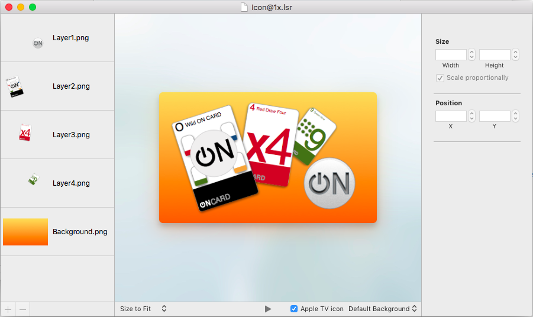](icons-images-images/layered03.png#lightbox)

While previewing a Layered Image, you can use the mouse to rotate the image and preview the Parallax Effect. Use the **+** (plus) and **-** (minus) buttons to add and remove layers.

When creating a new Layered Image, it can be exported in the LSR format and included in your app's bundle.

For more information on creating and previewing Layered Images, please see Apple's [Creating Parallax Artwork](https://developer.apple.com/library/prerelease/tvos/documentation/General/Conceptual/AppleTV_PG/CreatingParallaxArtwork.html#//apple_ref/doc/uid/TP40015241-CH19-SW1) section of the [App Programming Guide for tvOS](https://developer.apple.com/library/prerelease/tvos/documentation/General/Conceptual/AppleTV_PG/).

## App Icons

Your Xamarin.tvOS app will require not only an App Icon for the Apple TV Home screen, but also an icon for the App Store. The App Icon is the your first change to make a great impression on your potential user and should communicate your app's purpose at a glance.

[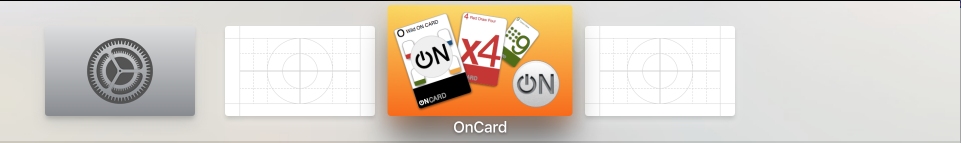](icons-images-images/icon01.png#lightbox)

Every app must supply both a small and a large version of its App Icon. The small icon will be used on the Apple TV Home screen when the app is installed. The large version is used by the App Store. The large App Icon should mimic the look and feel of the small icon version.

|Small Icon|Resolution|Large Icon|Resolution|
|---|---|---|---|
|Actual Size|400x240px||1280x768px|
|Safe Zone Size|370x222px|||
|Unfocused Size|300x180px|||
|Focused Size|370x222px|||

> [!IMPORTANT]
> Your App Icons must be provided as **Layered Images**. Please see the [Layered Image](#Layered-Images) section above for more details.

Apple provides the following suggestions for creating your App Icons:

- **Provide a Single Focus Point** – Design your icon with a single focus point placed directly in the center of the icon.
- **Use a Simple Background** – Keep your icon background simple so that the upper layers stand out. Consider using a simple color or subtle gradient.
- **Limit the Amount of Text** – Since the app's name will appear below the icon when it is selected by the user, you should only include text when it is essential to the design of the icon.
- **Don't use Screenshots** – Screenshots are too complex for an icon and don't allow the user to see the purpose of your app at a glance.
- **Keep Icons Square** – tvOS automatically applies a mask that subtly rounds the corners of your icons. Don't include this rounding yourself.
- **Separate Your Layers Carefully** – Text should be on the upper most layer, secondary items in the middle and a neutral background that allows your upper layers to shine.
- **Use Gradients and Shadows Carefully** – Gradients and shadows can clash with the Parallax Effect so they should be used carefully. Simple top-to-bottom, light-to-dark gradient styles work best. Shadows normally work best as sharp, hard-edged tints.
- **Vary Layer Transparency** – Use varying levels of transparency on the upper levels of your App Icon to increase the 3D effect. The background layer must be opaque or it will result in an error.

### Setting the App Icons

To set the App Icons required for your tvOS project, please do the following:

1. In the **Solution Explorer**, double-click `Assets.xcassets` to open it for editing:

    
2. In the **Asset Editor**, expand the `App Icon & Top Shelf Image` asset:

    [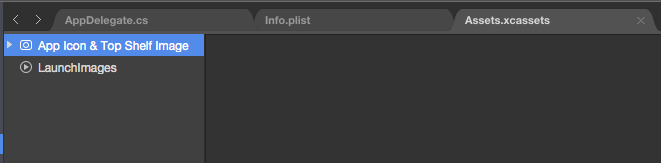](icons-images-images/asset04.png#lightbox)
3. Next, Expand the `App Icon - Small` asset:

    [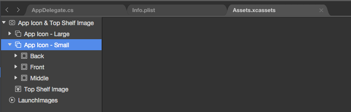](icons-images-images/asset05.png#lightbox)
4. Then expand the `Back` asset and click on the `Contents` entry:

    [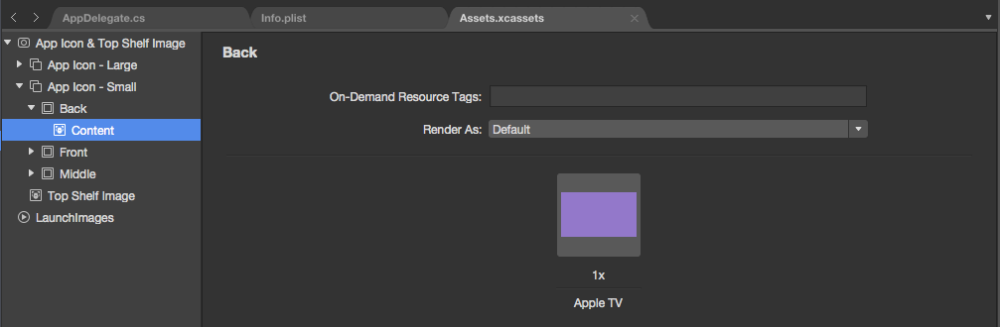](icons-images-images/asset06.png#lightbox)
5. Click on the **1x Apple TV entry** and select an image file.
6. Repeat the above steps for the `Front` and `Middle` assets.
7. Then repeat the same steps to define the `App Icon - Large` asset.
8. Save your changes.

## Top Shelf Image

If the user has placed your Xamarin.tvOS app on the Top Row on the Apple TV Home screen, a large Top Shelf Image will be displayed when your app is selected by the user. This image should highlight the features of your app or provide direct links to its content.

The Top Shelf Image can either be provided as a single static `.png` or `.lsr` file (see [Creating Layered Images](#Creating-Layered-Images)) or it can be dynamically created at runtime as a single row of Focusable Items (see [Dynamic Top Shelf Content](#Dynamic-Top-Shelf-Content) below).

|Top Shelf Image Size|Notes|
|---|---|
|1920x720px|Static .png or layered .lsr file|

Apple provides the following suggestions for creating your Top Shelf Images:

- **Use Rich Static Imagery** – If your app does not provide a dynamic content, its Top Shelf Image will be non-focusable. Use this image to highlight the features of the app or your brand.
- **Link to App Content** – Dynamic Top Shelf Layouts provide a quick link to the content that your user finds most important in your app. Use this area to provide a quick link to start your app and immediately jump into the given content.
- **Showcase the Latest Content** – Rich Top Shelf content can draw a user into your app and make them want to use it more. Use this as an area to showcase the highest rated or newest content.
- **Personalized Content** – Users place their most frequently used or favorite apps in the Top Row of the Home screen. Use the Top Shelf to display the content they would be most interested in.
- **Ads Not Allowed** – Ads are strictly prohibited from being displayed in the Top Shelf. You may show the latest purchasable content, but no pricing information should be displayed.

### Setting the Top Shelf Image

To set the Top Shelf Image required for your tvOS project, please do the following:

1. In the **Solution Explorer**, double-click `Assets.xcassets` to open it for editing:

    
2. In the **Asset Editor**, expand the `App Icon & Top Shelf Image` asset:

    
3. Click on the `Top Shelf Image` asset:

    [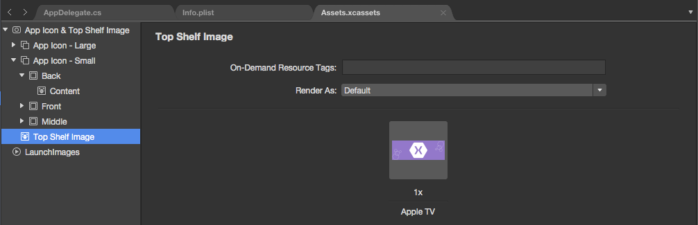](icons-images-images/asset07.png#lightbox)
4. Click on the **1x Apple TV entry** and select an image file.
5. Save your changes.

### Dynamic Top Shelf Content

Instead of displaying a static Top Shelf Image, the Top Shelf can contain a dynamic row of [Focusable Items](~/ios/tvos/app-fundamentals/navigation-focus.md#Focus-and-Selection) or a dynamic set of scrolling banners. Both of these dynamic style allow you to highlight the content provided by your app or jump into its most used features.

#### Sectioned Content Row

This dynamic Top Shelf content type presents a single row of scrolling, Focusable Items optionally broken down into sections. It's typically used to highlight new, favorite or recently viewed app content.

Content is presented as a single, horizontal scrolling list of content with a label appearing under the current piece of content selected (that currently has focus). If the user selects a given piece of content, your app will be launched and they should be taken directly into that content.

The following content sizes will be required:

|Size|Poster (2:3)|Square (1:1)|HDTV (16:9)|
|---|---|---|---|
|Actual Size|404x608px|608x608px|908x512px|
|Safe Zone Size|380x570px|570x570px|852x479px|
|Unfocused Size|333x500px|500x500px|782x440px|
|Focused Size|380x570px|570x570px|852x479px|

Apple provides the following suggestions for the Sectioned Content Row:

- **Complete the Row** – You should provide enough content to span the full width of the screen.
- **Scaling Mixed Images** – The Sectioned Content Row was designed to hold a mix of image sizes (from the list provided above). If you do mix image sizes however, be aware that additional scaling will be applied to normalize the content display.

#### Scrolling Inset Banners

Optionally, your Xamarin.tvOS app can present its content in the Top Shelf as an automatically scrolling and looping collection of banners that nearly fill the screen. This style is typically used to showcase rich, new content like new TV shows.

In addition to the automatic scrolling, the user can take control of the banners and scroll in either direction using the Siri Remote. Making a small, circular gesture on the Siri Remote when a banner is in focus will activate the Parallax Effect for that banner.

**Banner Image (Extra Wide)**

| Size | Resolution |
|---|---|
|Actual Size|1940x624px|
|Safe Zone Size|1740x620px|
|Unfocused Size|1740x560px|
|Focused Size|1740x620px|

Scrolling Inset Banners can either be provided as a static `.png` or layered `.lsr` file.

Apple provides the following suggestions for the Scrolling Inset Banners:

- **Content Amount** - You should provide a minimum of three (3) banners for the scrolling to feel natural. You should include no more than eight (8) banners or it make navigation hard for the end user.
- **Content Text** - If your banner requires text in should be included in the banner image. If you are using Layered Images, your text should be in the topmost layer.

Please see Apple's [TVServices Framework Reference](https://developer.apple.com/library/prerelease/tvos/documentation/TVServices/Reference/TVServices_Ref/index.html#//apple_ref/doc/uid/TP40016412) for more information on adding a Top Shelf Extension to your app to provide dynamic Top Shelf content.

## Game Center Images

If your Xamarin.tvOS app is a game and you've included Game Center support, several more image assets will be required:

- **Achievement Icons** - An opaque image is required for each achievement that will be automatically cropped into a circle. Achievements are non-focusable items.
- **Dashboard Artwork** - An optional image can be provided that will appear at the top of your app's dashboard within Game Center. These images are non-focusable.
- **Leaderboard Artwork** - You must provide between one (1) to three (3) 16:9 aspect ratio images for each leaderboard that your app supports. These may be either static `.png` or layered `.lsr` files. The Leaderboard artwork is focusable.

|Size|Achievement Icons|Dashboard Artwork|Leaderboard Artwork|
|---|---|---|---|
|Visible Size|200x200px|923x150px|n/a|
|Actual Size|320x320px|n/a|659x371px|
|Safe Zone Size|n/a|n/a|618x348px|
|Unfocused Size|n/a|n/a|548x309px|
|Focused Size|n/a|n/a|618x348px|

For more information about working with Game Center, please see Apple's [Game Center Programming Guide](https://developer.apple.com/library/prerelease/tvos/documentation/NetworkingInternet/Conceptual/GameKit_Guide/Introduction/Introduction.html).

## Working with Images

Since tvOS 9 is a subset of iOS 9, the same techniques used to include and display images in a Xamarin.iOS app, also work for a Xamarin.tvOS app. Please see our [Displaying an Image](~/ios/app-fundamentals/images-icons/displaying-an-image.md) documentation for more information.

## Setting Xamarin.tvOS Project Images

As stated above, all tvOS apps require a [Launch Image](#Launch-Image), and [App Icon](#App-Icons). This section covers selecting the Launch Image and App Icon for your Xamarin.tvOS app project after they have been set in an Asset Catalog.

Do the following:

1. In the **Solution Explorer**, double-click the `Info.plist` to open it for editing:

    [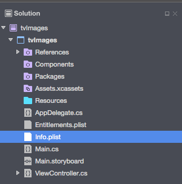](icons-images-images/info01.png#lightbox)
2. In the **Info.Plist Editor**, select the Assets Catalog (configured above in the [Setting the App Icons](#Setting-the-App-Icons) section) for the **App Icons**:

    [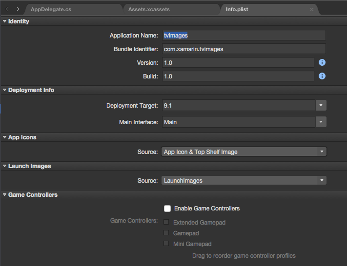](icons-images-images/info02.png#lightbox)
3. Next, select the Assets Catalog (configured above in the [Setting the Launch Image](#Setting-the-Launch-Image) section) for the **Launch Images**.
4. Save your changes.

## Summary

This article has covered all of the image types and sizes used in a Xamarin.tvOS app. First, it covered Launch Images, Layered Images, App Icons, Top Shelf Images and Game Center Images. Then it covered working with images in your Xamarin.tvOS app.

## Related Links

- [tvOS Samples](/samples/browse/?products=xamarin&term=Xamarin.iOS%2btvOS)
- [tvOS](https://developer.apple.com/tvos/)
- [tvOS Human Interface Guides](https://developer.apple.com/design/human-interface-guidelines/designing-for-tvos)
- [App Programming Guide for tvOS](https://developer.apple.com/library/prerelease/tvos/documentation/General/Conceptual/AppleTV_PG/)