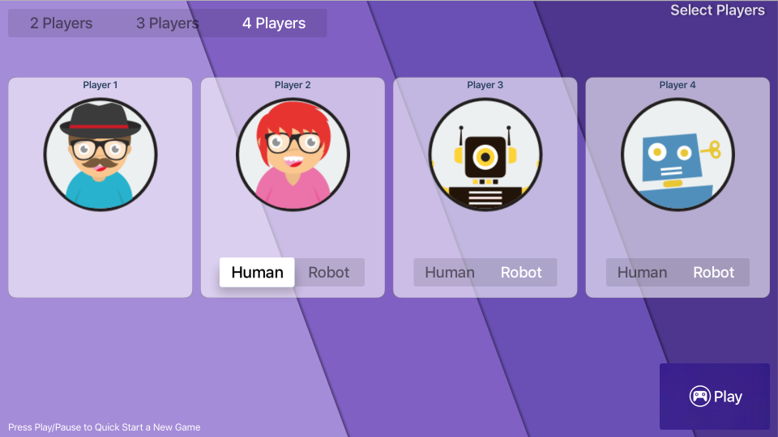
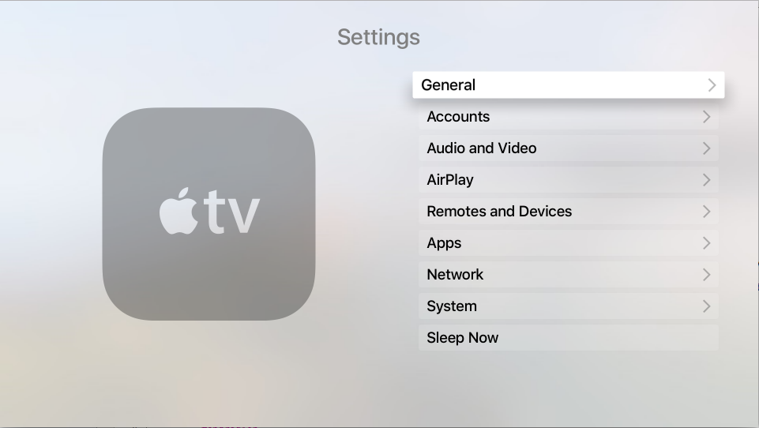
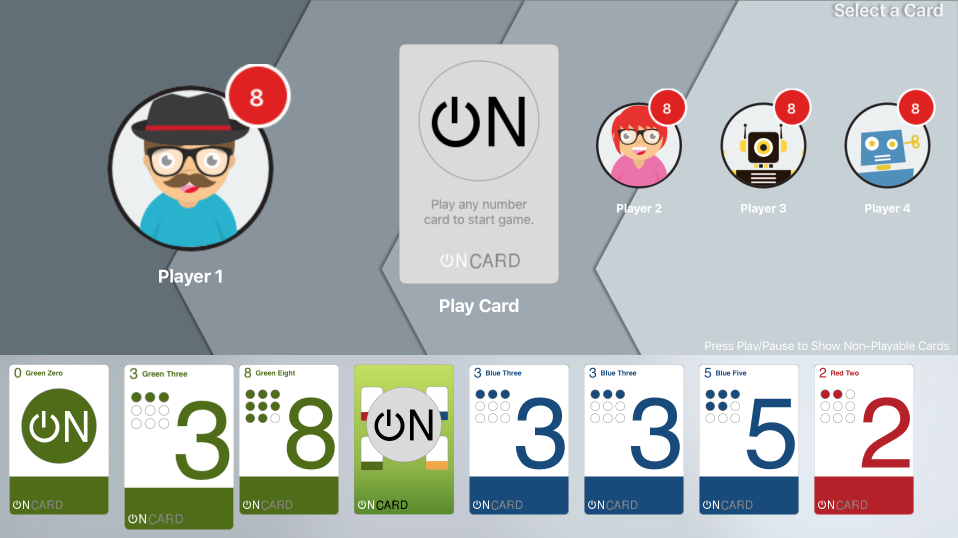
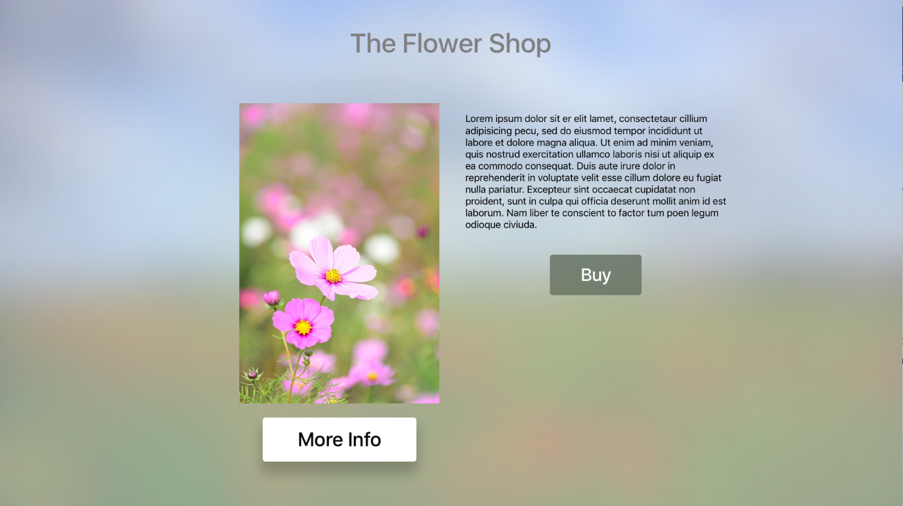
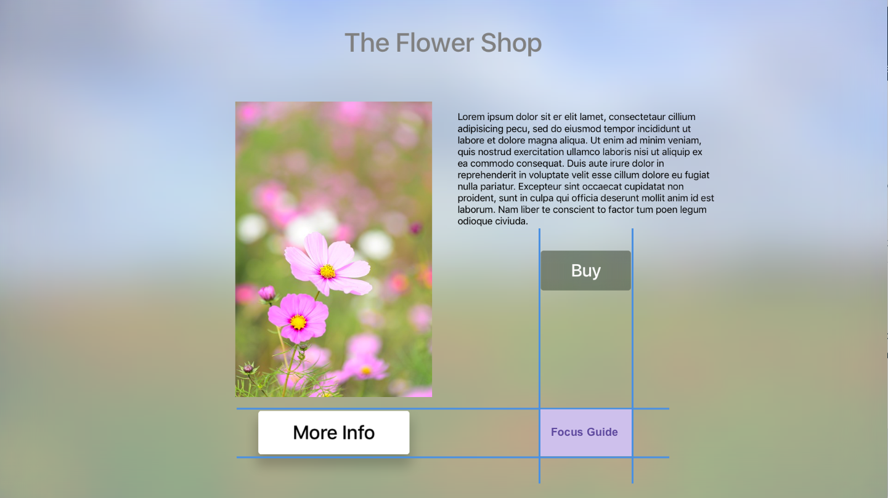

# Working with tvOS Navigation and Focus in Xamarin

_This article covers the concept of Focus and how it is used to present and handle Navigation inside of a Xamarin.tvOS app._

This article covers the concept of [Focus](#Focus-and-Selection) and how it is used to handle [Navigation](#Navigation) in a Xamarin.tvOS app's User Interface. We'll examine how the built-in tvOS Navigation controls use Focus, Highlighting and Selection to provide your Xamarin.tvOS app's User Interface Navigation.

[](navigation-focus-images/intro01.png#lightbox)

Next, we'll take a look at how Focus can be used with [Parallax](#Focus-and-Parallax) and *Layered Images* to provide visual clues for the current Navigation State to the end user.

Finally, we'll look at working with [Focus](#Working-with-Focus), [Focus Updates](#Working-with-Focus-Updates), [Focus Guides](#Working-with-Focus-Guides), [Focus in Collections](#Working-with-Focus-in-Collections) and [Enabling Parallax](#enabling-parallax) on Image Views in your Xamarin.tvOS apps.

<a name="Navigation"></a>

## Navigation

Users of your Xamarin.tvOS app will not be interacting with it's interface directly as with iOS where they tap images on the device's screen, but indirectly from across the room using the [Siri Remote](~/ios/tvos/platform/remote-bluetooth.md#The-Siri-Remote). You will need to keep this in mind when designing your app's User Interface so that it flows naturally, yet keeps the user immersed in the Apple TV experience.

A successful tvOS app implements navigation in a way that smoothly supports the purpose of the app and the structure of the data it presents without calling attention to the navigation itself. Design your navigation so that it feels natural and familiar without dominating the User Interface or drawing focus away from the content and the apps user experience.

[](navigation-focus-images/nav01.png#lightbox)

While using an Apple TV, the user typically navigates through a stacked set of screens, each presenting a given set of content. In turn, every new screen may lead to one or more sub-screens of content using standard UI controls such as [Buttons](~/ios/tvos/user-interface/buttons.md), [Tab Bars](~/ios/tvos/user-interface/tab-bars.md), Tables, [Collection Views](~/ios/tvos/user-interface/collection-views.md) or [Split Views](~/ios/tvos/user-interface/split-views.md).

With each new screen of data, the user navigates deeper into this stack of screens. By using the **Menu** button on the Siri Remote, they can navigate backwards through the stack to return to a previous screen or Main Menu.

Apple suggests keeping the following in mind when designing the navigation for your tvOS app:

- **Layout your Navigation to Make Finding Content Fast and Easy** - Users want to access content within your app in the fewest number of taps, clicks and swipes as possible. Simplify your navigation and organize content to the minimal numbers of screens.
- **Create a Fluid Interface Using Touch** - Ensure that a user can move between _Focusable Items_ with minimal friction by using the fewest number of gestures possible.
- **Design with Focus in Mind** - Since the user is interacting with content across the room, they need to move Focus to a User Interface item before interacting with it using the Siri Remote. Users will get frustrated with your app if it requires too many gestures for them to achieve their goals.
- **Provide Backwards Navigation via the Menu Button** - To create an easy and familiar experience, allow users to navigate backwards using the Siri Remote's **Menu** button. Pressing the **Menu** button should always return to the previous screen or return to the app's Main Menu. At the app's top level, pressing the **Menu** button should return to the Apple TV Home screen.
- **Typically Avoid Displaying a Back Button** - Because pressing the **Menu** button on the Siri Remote navigates backwards through the screen stack, avoid displaying a extra control that duplicates this behavior. An exception to this rule is for purchasing screens or screens with destructive actions (like deleting content) where a **Cancel** button should be displayed as well.
- **Show Large Collections on a Single Screen, Instead of Many** - The Siri Remote was designed to make moving through a large collection of content quick and easy using gestures. If your app works with a large collection of Focusable Items, consider keeping them on a single screen instead of breaking them into many screens which require more navigation on the user's part.
- **Use Standard Controls for Navigation** - Again, to create an easy and familiar user experience, wherever possible, use built-in `UIKit` controls such as Page Controls, Tab Bars, Segmented Controls, Table Views, Collection Views and Split Views for your app's navigation. Since user are already familiar with these elements, they will intuitively be able to navigate your app.
- **Favor Horizontal Content Navigation** - Because of the nature of the Apple TV, swiping left to right on the Siri Remote is more natural than up and down. Consider this option when designing content layouts for your app.

<a name="Focus-and-Selection"></a>

## Focus and Selection

On the Apple TV, an image, button or other UI element is considered to be _in focus_ when it is the target of the current navigation.

[](navigation-focus-images/focus01.png#lightbox)

Unlike, iOS devices where the user is directly interacting with elements on the device's touchscreen, users interact with tvOS elements from across the room using the Siri Remote. To present and handle this user interaction, the Apple TV uses a _Focus_ based model.

Using gestures and button presses on the [Siri Remote](~/ios/tvos/platform/remote-bluetooth.md#The-Siri-Remote), the user moves focus from one UI element to another. Once focus has shifted to the desired element, the user clicks to select the content or activate the action represented by that element.

As focus changes, subtle animations and effects (such as the Parallax Effect on images) are used to clearly identify the User Interface item that currently has focus.

Apple has the following suggestions for working with Focus and Selection:

- **Use Built-In UI Controls for Motion Effects** - By using `UIKit` and the Focus API in your User Interface, the Focus Model will automatically apply the default motion and visual effects to your UI elements. This makes your app feel native and familiar to users of the Apple TV platform and allows for fluid and intuitive movement between Focusable Items.
- **Move Focus in Expected Directions** - On Apple TV, nearly every element uses indirect manipulation. For example, the user uses the Siri Remote to move focus and the system automatically scrolls the interface to keep the currently focused item visible. If your app implements this type of interaction, ensure that focus moves in the direction of the user's gesture. So if the user swipe right on the Siri Remote focus should move to the right (which could cause the screen to scroll to the left). The one exception to this rule is fullscreen items that use direct manipulation (where swiping up moves the element up).
- **Ensure that the Focused Item is Obvious** - Because your users are interacting with your UI elements from afar, it is critical that the currently focused item stands out. Typically this will be handled automatically by built-in `UIKit` elements. For custom controls, use features such as item size or shadow to show focus.
- **Use Parallax to Make Focused Items Responsive** - Small, circular gestures on the Siri Remote result in gentle, real-time movement of the focused item. This [Parallax Effect](#Focus-and-Parallax) is built into `UIKit` _Layered Images_ to give the user a sense of connection to the focused item.
- **Create Focusable Items of the Appropriate Size** - Large items with ample spacing are easier to select and navigate than smaller items.
- **Design UI Element to Look Good Either Focused or Unfocused** - Typically Apple TV represents the Focused Item by increasing its size. Ensure that your apps's UI elements look great at any presentation size and, if required, supply assets for larger sized elements.
- **Represent Focus Changes Fluidly** - Use animation to smoothly fade between an items **Focused** and **Unfocused** state to keep transitions from being jarring.
- **Don't Display a Cursor** - Users expect to navigate your app's UI using Focus and not by moving a cursor around the screen. Your User Interface should always use the Focus Model to present a consistent user experience.

<a name="Working-with-Focus"></a>

### Working with Focus

There might be times that you want to create a custom control that can become a Focusable Item. If so override the `CanBecomeFocused` property and return `true`, else return `false`. For example:

```csharp
public class myView : UIView
{
    public override bool CanBecomeFocused {
        get {return true;}
    }
}
```

At any time you can use the `Focused` property of a `UIKit` control to see if it is current item. If `true` the UI item currently has focus, else it does not. For example:

```csharp
// Is my view in focus?
if (myView.Focused) {
    // Do something
    ...
}
```

While you cannot directly move focus to another UI element via code, you can specify which UI element first gets focus when a screen is loaded by setting its `PreferredFocusedView` property to `true`. For example:

```csharp
// Make the play button the starting focus item
playButton.PreferredFocusedView = true;
```

<a name="Working-with-Focus-Updates"></a>

### Working with Focus Updates 

When the user causes focus to shift from one UI element to another (for example, in response to a gesture on the Siri Remote) a _Focus Update Event_ will be sent to both the item losing focus and the item gaining focus.

For custom elements that inherit from `UIView` or `UIViewController`, you can override several methods to work with the Focus Update Event:

- **DidUpdateFocus** - This method will be called any time the view gains or loses focus.
- **ShouldUpdateFocus** - Use this method to define where focus is allowed to move.

To request that the Focus Engine moves focus back to the `PreferredFocusedView` UI element, call the `SetNeedsUpdateFocus` method of the View Controller.

> [!IMPORTANT]
> Calling `SetNeedsUpdateFocus` only has effect if the View Controller it is being called against contains the View that currently has focus.

<a name="Working-with-Focus-Guides"></a>

### Working with Focus Guides

The Focus Engine built into tvOS is great at handling movements between items that fall on a horizontal and vertical grid. Typically, you need to do nothing more than add the UI elements to your interface design and the Focus Engine will automatically handle the movement between those elements without developer intervention.

However, there might be times, because of the necessities of your UI design, when UI elements don't fall on a horizontal and vertical grid and might be inaccessible because they are diagonal to each other. This happens because the Focus Engine was designed to handle simple Up, Down, Left and Right movement between UI items only.

Take the following UI layout for an example:

 [](navigation-focus-images/guide01.png#lightbox)

Because the **More Info** button does not fall on a horizontal and vertical grid with the **Buy** button it would be inaccessible to the user. However, this can be easily corrected using a _Focus Guide_ to provide movement hints to the Focus Engine. 

A Focus Guide (`UIFocusGuide`) exposes a non-visible area of the view as Focusable to the Focus Engine, thus allowing Focus to be redirected to another view.

So, to solve the example given above, the following code could be added to the View Controller to create a Focus Guide between the **More Info** and **Buy** buttons:

```csharp
public UIFocusGuide FocusGuide = new UIFocusGuide ();
...

public override void ViewDidLoad ()
{
    base.ViewDidLoad ();

    // Add Focus Guide to layout
    View.AddLayoutGuide (FocusGuide);

    // Define Focus Guide that will allow the user to move
    // between the More Info and Buy buttons.
    FocusGuide.LeftAnchor.ConstraintEqualTo (BuyButton.LeftAnchor).Active = true;
    FocusGuide.TopAnchor.ConstraintEqualTo (MoreInfoButton.TopAnchor).Active = true;
    FocusGuide.WidthAnchor.ConstraintEqualTo (BuyButton.WidthAnchor).Active = true;
    FocusGuide.HeightAnchor.ConstraintEqualTo (MoreInfoButton.HeightAnchor).Active = true;
}
```

First, a new `UIFocusGuide` is created and added to the View's Layout Guide collection using the `AddLayoutGuide` method.

Next, the Focus Guide's Top, Left, Width and Height Anchors are adjusted relative to the **More Info** and **Buy** buttons to position it between them. See:

[](navigation-focus-images/guide02.png#lightbox)

It's also important to note that the new constraints are being activated as they are created by setting their `Active` property to `true`:

```csharp
FocusGuide.LeftAnchor.ConstraintEqualTo (...).Active = true;
```

With the new Focus Guide established and added to the View, the View Controller's `DidUpdateFocus` method can be overridden and the following code added to move between the **More Info** and **Buy** buttons:

```csharp
public override void DidUpdateFocus (UIFocusUpdateContext context, UIFocusAnimationCoordinator coordinator)
{
    base.DidUpdateFocus (context, coordinator);

    // Get next focusable item from context
    var nextFocusableItem = context.NextFocusedView;

    // Anything to process?
    if (nextFocusableItem == null) return;

    // Decide the next focusable item based on the current
    // item with focus
    if (nextFocusableItem == MoreInfoButton) {
        // Move from the More Info to Buy button
        FocusGuide.PreferredFocusedView = BuyButton;
    } else if (nextFocusableItem == BuyButton) {
        // Move from the Buy to the More Info button
        FocusGuide.PreferredFocusedView = MoreInfoButton;
    } else {
        // No valid move
        FocusGuide.PreferredFocusedView = null;
    }
}
```

First, this code get's the `NextFocusedView` from the `UIFocusUpdateContext` that has been passed in (`context`). If this view is `null`, then no processing is needed and the method exited.

Next, the `nextFocusableItem` is evaluated. If it matches either the **More Info** or **Buy** buttons, Focus is sent to the opposite button using the Focus Guide's `PreferredFocusedView` property. For example:

```csharp
// Move from the More Info to Buy button
FocusGuide.PreferredFocusedView = BuyButton;
```

In the event that neither button is the source of the Focus shift, the `PreferredFocusedView` property is cleared:

```csharp
// No valid move
FocusGuide.PreferredFocusedView = null;
```

<a name="Working-with-Focus-in-Collections"></a>

### Working with Focus in Collections

When deciding whether or not an individual item can be focusable in a `UICollectionView` or a `UITableView`, you'll override methods of the `UICollectionViewDelegate` or `UITableViewDelegate` respectively. For example:

```csharp
public class CardHandDelegate : UICollectionViewDelegateFlowLayout
{
    ...
    public override bool CanFocusItem (UICollectionView collectionView, NSIndexPath indexPath)
    {
        if (indexPath == null) {
            return false;
        } else {
            var controller = collectionView as CardHandViewController;
            return !controller.Hand [indexPath.Row].IsFaceDown;
        }
    }
}
```

The `CanFocusItem` method returns `true` if the current item can be in focus, else it returns `false`.

If you want a `UICollectionView` or a `UITableView` to remember and restore focus to the last item when it loses and regains focus, set the `RemembersLastFocusedIndexPath` property to `true`.

<a name="Focus-and-Parallax"></a>

## Focus and Parallax

As stated above, a User Interface element is considered to be _in focus_ when it is the current item during a navigation event. Typically as an item comes into focus, it's size is slightly increased and it is visually elevated using a shadow. 

If the user makes a slow, circular gesture on the Siri Remote, the Focused Item will sway real-time in response to this movement. As the sway occurs, an illuminated sheen is applied to its image making the surface appear to shine. After a given amount of inactivity, any out-of-focus content dims and the Focused item will grow even larger. 

These effects work together to provide a mental connection between the content on the TV screen and the user interacting with the Apple TV from the couch.

On the Apple TV, this Parallax Effect is used throughout the system to convey a sense of 3D depth and dynamics to in-focus items. tvOS uses a series of transparent, [Layered Images](~/ios/tvos/app-fundamentals/icons-images.md#Layered-Images) which it moves and scales dynamically to create this effect.

Layered Images are required for your tvOS app's icon and is supported for dynamic Top Shelf content. While not required, Apple strongly suggests implementing Layered Images in any other Focusable Items in your app's UI.

### Enabling Parallax

The `UIImageView` control (or any control that inherits from `UIImageView`) automatically supports the Parallax Effect. By default, this support is disabled, to enable it, use the following code:

```csharp
myImageView.AdjustsImageWhenAncestorFocused = true;
```

With this property set to `true`, the Image View will automatically get the Parallax Effect when it is selected by the user and in focus.

<a name="Summary"></a>

## Summary

This article has covered the concept of Focus and how it is used to handle Navigation in a Xamarin.tvOS app's User Interface. It examine how the built-in tvOS Navigation controls use Focus, Highlighting and Selection to provide navigation. Next, it looked at how Focus can be used with Parallax and Layered Images to provide visual clues for the current Navigation State to the end user. Finally, it examined working with Focus, Focus Updates, Focus in Collections and Enabling Parallax.

## Related Links

- [tvOS Samples](/samples/browse/?products=xamarin&term=Xamarin.iOS%2btvOS)
- [tvOS](https://developer.apple.com/tvos/)
- [tvOS Human Interface Guides](https://developer.apple.com/design/human-interface-guidelines/designing-for-tvos)
- [App Programming Guide for tvOS](https://developer.apple.com/library/prerelease/tvos/documentation/General/Conceptual/AppleTV_PG/)