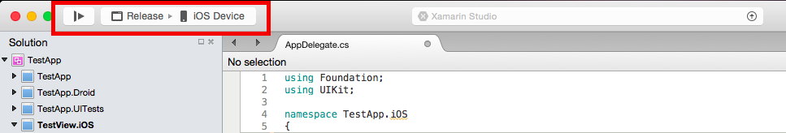
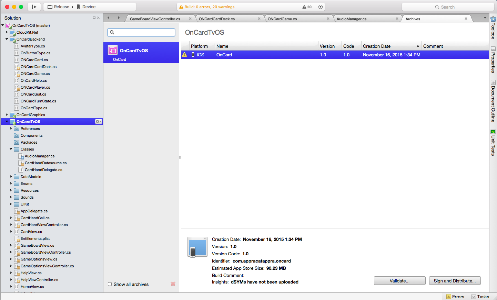
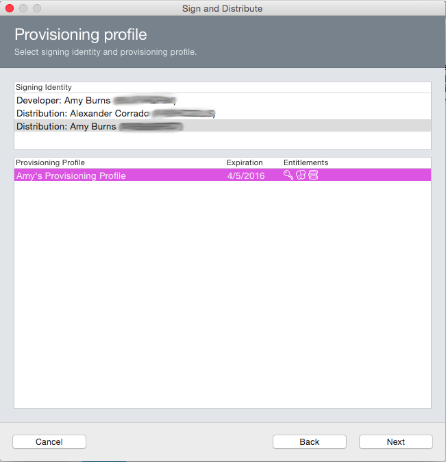
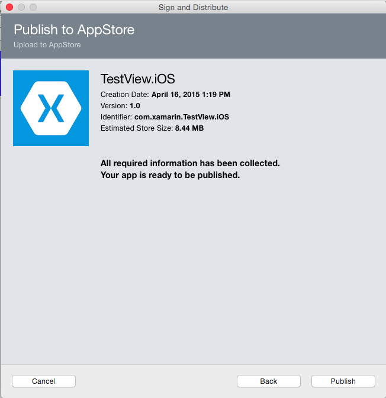
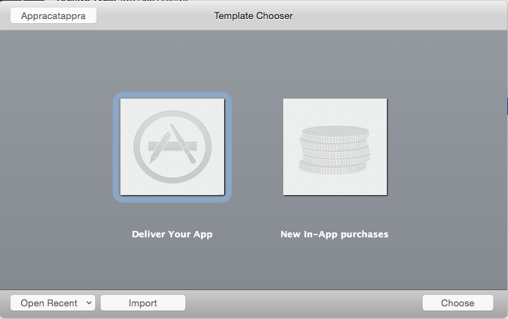
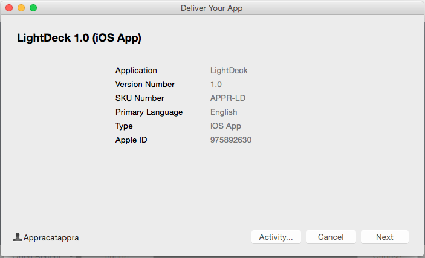
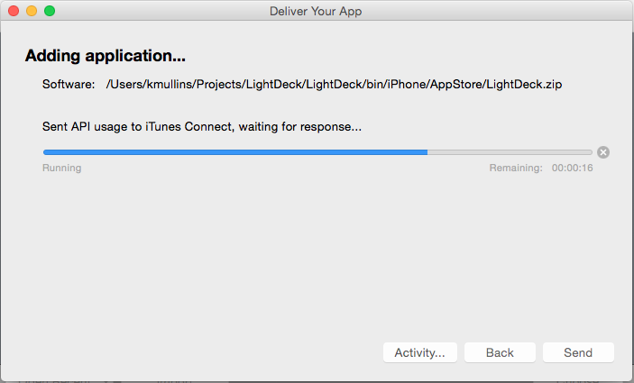

# Publishing to the Apple TV App Store

In order distribute applications to all Apple TV devices, Apple requires apps to be published through the *Apple TV App Store*, making the App Store the one-stop shopping location for tvOS apps. Developers of many types of apps can capitalized on the massive success of this single point of distribution. The Apple TV App Store is a turnkey solution, offering app developers both distribution and payment systems.

The process of submitting an application to the Apple TV App Store involves:

1. Creating an *App ID* and selecting *Entitlements*.
2. Creating a  *Distribution Provisioning Profile.*
3. Using this profile to build your app.
4. Submitting your app through  *iTunes Connect*.

In this article we will cover all the steps needed to provision, build, and submit an app for Apple TV App Store distribution.

## Before You Submit an Application

After you submit an app for publication to the Apple TV App Store, it  goes through a review process by Apple to insure that it meets Apple’s guidelines for quality and content. If your application fails to meet these guidelines, Apple will reject it, at which time you will need to address the non-conformance cited by Apple, and then resubmit.
Therefore, you stand the best chance of making it through Apple review by familiarizing yourself with these guidelines and trying to adapt your application to them. Apple’s guidelines are available at [App Store Review Guidelines](https://developer.apple.com/appstore/resources/approval/guidelines.html) and [Prepare Your App Submission for the new Apple TV](https://developer.apple.com/tvos/submit/).

A couple of things to watch out for when submitting an app are:

1. Make sure the app’s description matches the functionality included in the app.
2. Test that the app doesn’t crash under normal usage. This includes usage on every Apple TV device you support.

Apple also maintains a list of Apple TV App Store submission tips. You can read these at [Distributing on the App Store](https://developer.apple.com/appstore/resources/submission/tips.html).

## Configuring your Application in iTunes Connect

[iTunes Connect](https://itunesconnect.apple.com/WebObjects/iTunesConnect.woa) is a suite of web based tools for, among other things, managing your tvOS apps on the Apple TV App Store. Your Xamarin.tvOS app will need to be properly setup and configured in iTunes Connect before it can be submitted to Apple for review and ultimately, be released for sale or as a free app in the Apple TV App Store.

Do the following:

1. Verify that the proper agreements are in place and up to date in the **Agreements, Tax, and Banking** section of iTunes Connect to release an iOS application for free or for sale.
2. Create a new **iTunes Connect Record** for the application and specify its **Display Name** (as seen in the Apple TV App Store).
3. Select a **Sale Price** or specify that the application will be released for free.
4. Provide an **App Store Icon** (Large Icon) and screenshots of your application in action, on the Apple TV devices it supports. See our [Working with Icons and Images](~/ios/tvos/app-fundamentals/icons-images.md) guide for more details.
5. Provide a clear, succinct **Description** of the app including its features and benefit to the end user.
6. Provide **Categories**, **Sub Categories**, and **Keywords** to help the user find your app in the Apple TV App Store.
7. Provide **Contact** and **Support** URLs to your website required by Apple.
8. Set your application's **Rating**, which is used by parental controls on the Apple TV App Store.
9. Configure optional App Store technologies, such as **Game Center** and **In-App Purchase**.

For more details, please see our [Configure your tvOS App in iTunes Connect](~/ios/tvos/deploy-test/app-distribution/itunes-connect.md) documentation.

## Preparing for App Store Distribution

To publish an app to the Apple TV App Store, you first need to build it for distribution, which involves many steps. The following sections covers everything required to prepare a Xamarin.tvOS app for publication so that it can be built and submit it to the Apple TV App Store for review and release.

### Provisioning for Application Services

Apple provides a selection of special Application Services, also called entitlements, that can be activated for your tvOS app when you create a unique ID for it. Whether you are using custom entitlements or not, you'll still need to create a unique ID for your Xamarin.tvOS app before it can be published on the Apple TV App Store.

Creating an App ID and optionally selecting entitlements involves the following steps using Apple's web-based iOS Provisioning Portal:

1. Select **Provisioning** > **Development**.
2. Click the **+** button and provide a **Name** and **Bundle ID** for the new application.
3. Scroll to the bottom of the screen and select any **App Services** that will be required by your Xamarin.tvOS app.
4. Click the **Continue** button and following the on-screen instructions to create the new App ID.

In addition to selecting and configuring the required Application Services when defining your App ID, you also need to configure the App ID and entitlements in your Xamarin.tvOS project by editing both the `Info.plist` and `Entitlements.plist` files.

Do the following in Visual Studio for Mac:

1. In the **Solution Explorer**, double-click the `Info.plist` file to open it for editing.
2. In the **tvOS Application Target** section, fill in a name for your application and enter the **Bundle Identifier** that you created when you defined the App ID.
3. Save the changes to the `Info.plist` file.
4. In the **Solution Explorer**, double-click the `Entitlements.plist` file to open it for editing.
5. Select and configure the entitlements required for you Xamarin.tvOS app so that they match the setup you performed above when you defined the App ID.
6. Save the changes to the `Entitlements.plist` file.

For detailed instructions, please see our [Provisioning for Application Services](~/ios/get-started/installation/device-provisioning/manual-provisioning.md#provisioning-for-application-services) documentation. While this document was written for iOS, the same steps are used to provision a Xamarin.tvOS app.

### Setting the Apps Icons, Launch Image and Top Shelf Image

For an tvOS app to be accepted by Apple for inclusion in the Apple TV App Store, it requires proper icons, launch and Top Shelf images for all of the Apple TV devices that it will be running on. You'll need add the required Image Assets that will be compiled into a `Assets.car` file and included in your Xamarin.tvOS app's bundle before it is uploaded to iTunes Connect.

For detailed instructions, please see our [Working with Icons and Images](~/ios/tvos/app-fundamentals/icons-images.md) documentation.

### Creating and Installing a Distribution Profile

tvOS uses *provisioning profiles* to control how a particular application build can be deployed. These are files that contain information about the certificate used to sign an app, the *Application ID*, and where the app can be installed. For development and ad-hoc distribution, the provisioning profile also includes the list of allowed devices to which you can
deploy the app. However, for Apple TV App Store distribution, only certificate and app ID information are included, since the only mechanism for public distribution is through the Apple TV App Store.

Provisioning involves the following steps using Apple's web based iOS Provisioning Portal:

1. Select **Provisioning** > **Distribution**.
2. Click the **+** button and select the type of Distribution Profile that you want to create as **Apple TV App Store**.
3. Select **App ID** from the dropdown list that you want to create a Distribution Profile for.
4. Select certificate required to sign the application.
5. Enter a **Name** for the new **Distribution Profile** and generate the profile.
6. Refresh the list of available profiles in Xcode.
7. Select the Distribution Provisioning Profile in Visual Studio for the **App Store** _Build Configuration_.

For detailed instructions, please see the [Creating a Distribution Profile](~/ios/deploy-test/app-distribution/app-store-distribution/index.md#creatingprofile) and [Selecting a Distribution Profile in a Xamarin.iOS Project](~/ios/deploy-test/app-distribution/app-store-distribution/index.md#selectprofile). Again, both of these documents are specific to iOS but the same technique is used for tvOS apps.

### Setting the Build Configuration for your Application

By default, when you create a new Xamarin.tvOS app, _Build Configurations_ are automatically created for both **Debug** and **Release** deployment. Before doing the final build of your app that you will be submitting to Apple, there are a few modification that you will need to make to the base **Release** configuration.

Do the following:

1. Right-click on the **Project Name** in the **Solution Explorer** and selection **Options** to open them for editing.
2. If you are targeting a specific version of tvOS, select it under **tvOS Build** > **iOS SDK Version**. For the Preview Release of tvOS Support, please leave this value set to **Default**.
3. Linking reduces the overall size of your app's distributable by stripping out unused Methods, Properties, Classes, etc. and in most cases should be left to the default value of **Link framework SDK only**. In some situations, such as when using some specific 3rd party libraries, you may be forced to set this value to **Don't link** to keep needed element from being removed.
4. To ship a Xamarin.tvOS app, you'll need to be using the LLVM optimizing compiler. Ensure that the **Use the LLVM optimizing compiler** box is checked under the **Release** configuration.
5. Apple also required that tvOS apps use bitcode. Again under the **Release** configuration, add `--bitcode=asmonly` to the **Additional mtouch arguments** box.
6. The **Optimize PNG image files for iOS** checkbox should be checked as this will help to further decrease your app's deliverable size.
7. Debugging should *not* be enabled as it will make the build unnecessarily larger.

## Building and Submitting the Distributable

With your Xamarin.tvOS app properly configured, you are now ready to do the final distribution build that you will be submitting to Apple for review and release.

#### Build your Archive

1. Select the **Release | Device** configuration in Visual Studio for Mac:

    
2. From the **Build** menu, select **Archive for Publishing**:

    
3. Once the archive has been created, the **Archives** view will be displayed:

    

### Sign and Distribute your App

Each time you build your application for Archive, it will automatically open the *Archives View*, displaying all archived projects; grouped by solution. By default this view only shows the current, open solution. To see all solutions that have archives, click on the **Show all archives** option.

It is recommended that archives deployed to customers (either App Store or Enterprise deployments) be kept, so that any debug information that is generated can be symbolized at a later date.

To sign your app and prepare it for distribution:

1. Select the **Sign and Distribute...**, illustrated below:

    
2. This will open the publishing wizard. Select the **App Store** distribution channel to create a package, and open Application Loader:

    
3. On the Provisioning Profile screen, Select your signing identity and corresponding provisioning profile, or re-sign with another identity:

    
4. Verify the details of your package, and click **Publish** to save your `.ipa` package:

    
5. Once your `.ipa` has been saved, your App is ready to be uploaded to iTunes Connect via the Application Loader:

    

With your distribution build created and archived, you are now ready to submit your application to iTunes Connect.

## Submitting Your App to Apple

With the distribution build completed, you are ready to submit your iOS application to Apple for review and release on the App Store.

The archive workflow in Visual Studio for Mac will open Application Loader automatically, once you have saved the `.ipa`:

1. Select *Deliver Your App* and click the *Choose* button:

    

2. Select the zip or IPA file you created above and click the **OK** button.
3. The Application Loader will validate the file:

    
4. Click the *Next* button and the application will be validated against the App Store:

    
5. Click the **Send** button to send the application to Apple for review.
6. The Application Loader will inform you when the file has been successfully uploaded.

### iTunes Connect Status

If you log back into iTunes Connect and select your app from the list of available apps, the status in iTunes Connect should now show that it is **Waiting for Review** (it may temporarily read **Upload Received** while it is processed):

## Troubleshooting

If you are having issues submitting your Xamarin.tvOS app to the Apple TV App Store, please see our [Troubleshooting](~/ios/tvos/troubleshooting.md) guide. It contains several known issues that you might encounter and how to solve them in the Xamarin.tvOS.

## Summary

This article presented a step-by-step guide to configuring, building, and submitting an app for Apple TV App Store publication. First, it covered the steps needed to create and install a distribution provisioning profile. Next, it walked through how to use Visual Studio for Mac to create a distribution build. Finally, it showed you how to use iTunes Connect and the Xcode Archive Tool to submit an application to the Apple TV App Store.

## Related Links

- [Working with Icons and Images](~/ios/tvos/app-fundamentals/icons-images.md)
- [Prepare Your App Submission for the new Apple TV](https://developer.apple.com/tvos/submit/)
- [App Store Submission Tips](https://developer.apple.com/appstore/resources/submission/tips.html)
- [Common App Rejections](https://developer.apple.com/app-store/review/rejections/)
- [App Store Review Guidelines](https://developer.apple.com/appstore/resources/approval/guidelines.html)
