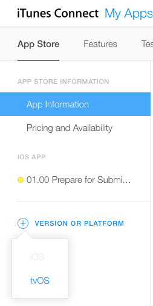
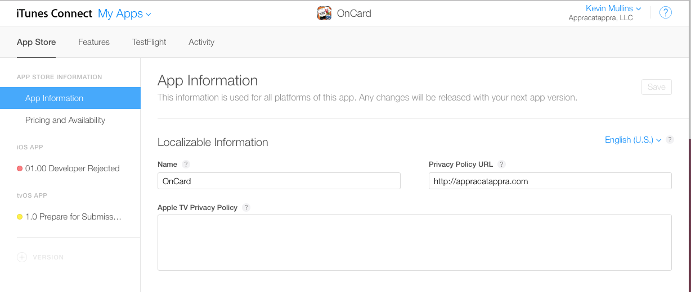
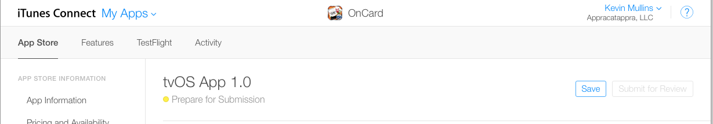
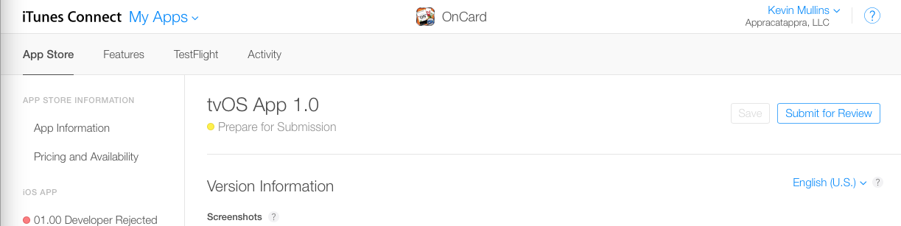

# Configure your tvOS App in iTunes Connect

_This article provides a supplemental guide to the iOS Configure your App in iTunes Connect for the tvOS specific configurations._

In addition to the configurations and setting that you will need to make by following the iOS [Configure your App in iTunes Connect](~/ios/deploy-test/app-distribution/app-store-distribution/itunesconnect.md) guide, this document covers the specific configurations that will be required to release a Xamarin.tvOS app in the Apple TV App Store.

<a name="Adding-a-tvOS-Release-Version" />

## Adding a tvOS Release Version

Whether you are creating a new App to be released on the Apple TV App Store, or adding Apple TV support to an existing iOS app, you'll need to have created an iTunes Connect Record and configured it using the following iOS specific guides:

- [Creating an iTunes Connect Record](~/ios/deploy-test/app-distribution/app-store-distribution/itunesconnect.md#creating)
- [Managing App Videos and Screenshots](~/ios/deploy-test/app-distribution/app-store-distribution/itunesconnect.md#managing)
- [Managing Name, Description, What's New, Keywords and URLs](~/ios/deploy-test/app-distribution/app-store-distribution/itunesconnect.md#metadata)
- [Maintaining General Information](~/ios/deploy-test/app-distribution/app-store-distribution/itunesconnect.md#general)

Optionally, you might also require:

- [Maintaining Game Center Information](~/ios/deploy-test/app-distribution/app-store-distribution/itunesconnect.md#game-center)
- [Maintaining In-App Purchase Information](~/ios/deploy-test/app-distribution/app-store-distribution/itunesconnect.md#iap)

With all of the above steps completed, open your app's iTunes Connect Record and select to add tvOS support using the left hand sidebar:

The tvOS specific information screens will then be available for the given iTunes Connect Record:

<a name="tvOS-Version-Information" />

## tvOS Version Information

From the left hand sidebar, select **1.0 Prepare for Submission** under the tvOS APP section:

On this screen provide the following information:

- The required Screenshots, Description, keywords and URLs.
- General App Information such as Version Number, Copyright and Age Rating.
- Optional In-App Purchases.
- Optional Game Center support with Leaderboards and Achievements.
- Required App Review Information such as Contact, Demo Accounts and Notes.

Once you have entered the required information, click the **Save** button in the upper right-hand corner of the screen to save your changes:

<a name="Submitting-for-Review" />

## Preparing to Submit for Review

When you are finally ready to submit your Xamarin.tvOS app to the Apple TV App Store for review, return to the app's iTunes Connect Record and click the **Submit for Review** button in the upper right hand corner of the screen:

<a name="Summary" />

## Summary

This article gave overview of the tvOS specific setting required in iTunes Connect to release a tvOS app to the Apple TV App Store.

## Related Links

- [tvOS Samples](https://developer.xamarin.com/samples/tvos/all/)
- [tvOS](https://developer.apple.com/tvos/)
- [tvOS Human Interface Guides](https://developer.apple.com/tvos/human-interface-guidelines/)
- [App Programming Guide for tvOS](https://developer.apple.com/library/prerelease/tvos/documentation/General/Conceptual/AppleTV_PG/)
