# Hello, tvOS Quick Start Guide

_This guide walks through creating your first Xamarin.tvOS app and its development toolchain. It also introduces the Xamarin Designer, which exposes UI controls to code, and illustrates how to build, run, and test a Xamarin.tvOS application._

> [!WARNING]
> The iOS Designer was deprecated in Visual Studio 2019 version 16.8 and Visual Studio 2019 for Mac version 8.8, and 
> removed in Visual Studio 2019 version 16.9 and Visual Studio for Mac version 8.9.
> The recommended way to build iOS user interfaces is directly on a Mac running Xcode's Interface Builder. For more information, see [Designing user interfaces with Xcode](~/ios/user-interface/storyboards/index.md). 

Apple has released the 5th generation of the Apple TV, the Apple TV 4K, which runs tvOS 11.

The Apple TV platform is open to developers, allowing them to create rich, immersive apps and release them through the Apple TV's built-in App Store.

If you are familiar with Xamarin.iOS development, you should find the transition to tvOS fairly simple. Most of the APIs and features are the same, however, many common APIs are unavailable (such as WebKit). Additionally, working with the with the Siri Remote poses some design challenges that are not present in touchscreen based iOS devices.

This guide will give an introduction to working with tvOS in a Xamarin app. For more information on tvOS, please see Apple's [Get ready for Apple TV 4K](https://developer.apple.com/tvos/) documentation.

## Overview

Xamarin.tvOS allows you to develop fully native Apple TV apps in C# and .NET using the same OS X libraries and interface controls that are used when developing in *Swift* (or *Objective-C*) and *Xcode*.

Additionally, since Xamarin.tvOS apps are written in C# and .NET, common, backend code can be shared with Xamarin.iOS, Xamarin.Android and Xamarin.Mac apps; all while delivering a native experience on each platform.

This article will introduce you to the key concepts needed to create an Apple TV App using Xamarin.tvOS and Visual Studio by walking you through the process of building a basic **Hello, tvOS** app that counts the number of times a button has been clicked:

[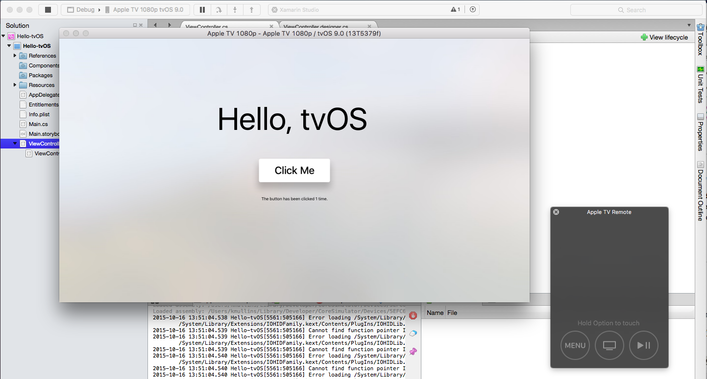](hello-tvos-images/run05.png#lightbox)

We’ll cover the following concepts:

- **Visual Studio for Mac**  – Introduction to the Visual Studio for Mac and how to create Xamarin.tvOS applications with it.
- **Anatomy of a Xamarin.tvOS App** – What a Xamarin.tvOS app consists of.
- **Creating a User Interface** – How to use to Xamarin Designer for iOS to create a user interface.
- **Deployment and Testing** – How to run and test your app in the tvOS Simulator and on real tvOS hardware.

## Starting a new Xamarin.tvOS App in Visual Studio for Mac

As stated above, we’ll create an Apple TV app called `Hello-tvOS` that adds a single button and label to the main screen. When the button is clicked, the label will display the number of times it has been clicked.

To get started, let's do the following:

1. Start Visual Studio for Mac:

    [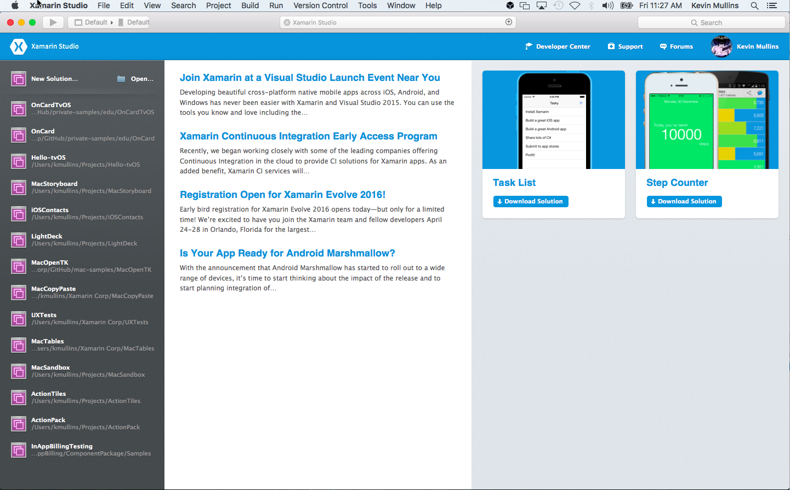](hello-tvos-images/setup01.png#lightbox)
2. Click on the **New Solution...** link in the upper left hand corner of the screen to open the **New Project** dialog box.
3. Select **tvOS** > **App** > **Single View App** and click the **Next** button:

    [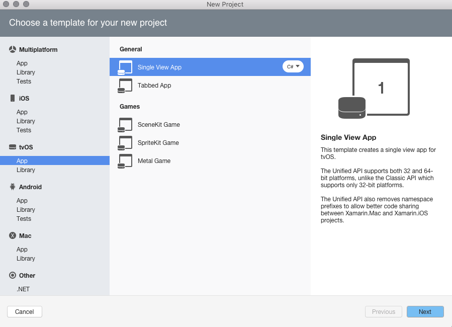](hello-tvos-images/setup02.png#lightbox)
4. Enter `Hello, tvOS` for the **App Name**, enter your **Organization Identifier** and click the **Next** button:

    [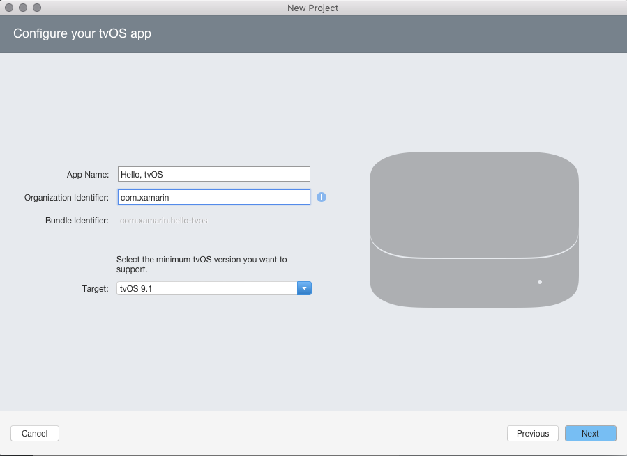](hello-tvos-images/setup04.png#lightbox)
5. Enter `Hello_tvOS` for the **Project Name** and click the **Create** button:

    [](hello-tvos-images/setup03.png#lightbox)

Visual Studio for Mac will create the new Xamarin.tvOS app and display the default files that get added to your application's solution:

 [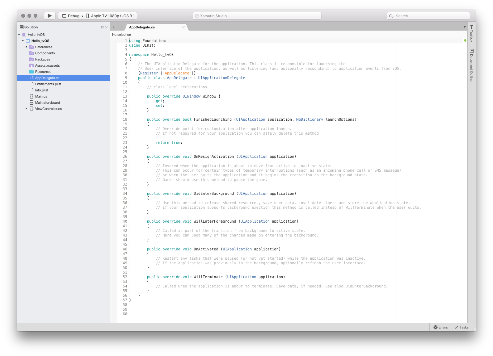](hello-tvos-images/project01.png#lightbox)

Visual Studio for Mac uses **Solutions** and **Projects**, in the exact same way that Visual Studio does. A solution is a container that can hold one or more projects; projects can include applications, supporting libraries, test applications, etc. In this case, Visual Studio for Mac has created both a solution and an application project for you.

If you wanted to, you could create one or more code library projects that contain common, shared code. These library projects can be consumed by the application project or shared with other Xamarin.tvOS app projects (or Xamarin.iOS, Xamarin.Android and Xamarin.Mac based on the type of code), just as you would if you were building a standard .NET application.

## Anatomy of a Xamarin.tvOS App

If you’re familiar with iOS programming, you’ll notice a lot of similarities here. In fact, tvOS 9 is a subset of iOS 9, so a lot of concepts will cross over here.

Let’s take a look at the files in the project:

- `Main.cs` – This contains the main entry point of the app. When the app is launched, this contains the very first class and method that is run.
- `AppDelegate.cs` – This file contains the main application class that is responsible for listening to events from the operating system.
- `Info.plist` – This file contains application properties such as the application name, icons, etc.
- `ViewController.cs` – This is the class that represents the main window and controls the lifecycle of it.
- `ViewController.designer.cs` – This file contains plumbing code that helps you integrate with the main screen’s user interface.
- `Main.storyboard` – The UI for the main window. This file can be created and maintained by the Xamarin Designer for iOS.

In the following sections, we'll take a quick look through some of these files. We’ll explore them in more detail later, but it’s a good idea to understand their basics now.

### Main.cs

The `Main.cs` file contains a static `Main` method which creates a new Xamarin.tvOS app instance and passes the name of the class that will handle OS events, which in our case is the `AppDelegate` class:

```csharp
using UIKit;

namespace Hello_tvOS
{
    public class Application
    {
        // This is the main entry point of the application.
        static void Main (string[] args)
        {
            // if you want to use a different Application Delegate class from "AppDelegate"
            // you can specify it here.
            UIApplication.Main (args, null, "AppDelegate");
        }
    }
}
```

### AppDelegate.cs

The `AppDelegate.cs` file contains our `AppDelegate` class, which is responsible for creating our window and listening to OS events:

```csharp
using Foundation;
using UIKit;

namespace Hello_tvOS
{
    // The UIApplicationDelegate for the application. This class is responsible for launching the
    // User Interface of the application, as well as listening (and optionally responding) to application events from iOS.
    [Register ("AppDelegate")]
    public class AppDelegate : UIApplicationDelegate
    {
        // class-level declarations

        public override UIWindow Window {
            get;
            set;
        }

        public override bool FinishedLaunching (UIApplication application, NSDictionary launchOptions)
        {
            // Override point for customization after application launch.
            // If not required for your application you can safely delete this method

            return true;
        }

        public override void OnResignActivation (UIApplication application)
        {
            // Invoked when the application is about to move from active to inactive state.
            // This can occur for certain types of temporary interruptions (such as an incoming phone call or SMS message)
            // or when the user quits the application and it begins the transition to the background state.
            // Games should use this method to pause the game.
        }

        public override void DidEnterBackground (UIApplication application)
        {
            // Use this method to release shared resources, save user data, invalidate timers and store the application state.
            // If your application supports background execution this method is called instead of WillTerminate when the user quits.
        }

        public override void WillEnterForeground (UIApplication application)
        {
            // Called as part of the transition from background to active state.
            // Here you can undo many of the changes made on entering the background.
        }

        public override void OnActivated (UIApplication application)
        {
            // Restart any tasks that were paused (or not yet started) while the application was inactive.
            // If the application was previously in the background, optionally refresh the user interface.
        }

        public override void WillTerminate (UIApplication application)
        {
            // Called when the application is about to terminate. Save data, if needed. See also DidEnterBackground.
        }
    }
}
```

This code is probably unfamiliar unless you’ve built an iOS application before, but it’s fairly straightforward. Let’s examine the important lines.

First, let’s take a look at the class-level variable declaration:

```csharp
public override UIWindow Window {
            get;
            set;
        }

```

The `Window` property provides access to the main window. tvOS uses what’s known as the *Model View Controller* (MVC) pattern. Generally, for every window you create (and for many other things within windows), there is a controller, which is responsible for the window’s life cycle, such as showing it, adding new views (controls) to it, etc.

Next, we have the `FinishedLaunching` method. This method runs after the application has been instantiated, and it’s responsible for actually creating the application window and beginning the process of displaying the view in it. Because our app uses a Storyboard to define its UI, no additional code is required here.

There are many other methods that are provided in the template such as `DidEnterBackground` and `WillEnterForeground`. These can be safely removed if the application events are not being used in your app.

### ViewController.cs

The `ViewController` class is our main window’s controller. That means it’s responsible for the lifecycle of the main window. We’re going to examine this in detail later, for now let's just take a quick look at it:

```csharp
using System;
using Foundation;
using UIKit;

namespace Hello_tvOS
{
    public partial class ViewController : UIViewController
    {
        public ViewController (IntPtr handle) : base (handle)
        {
        }

        public override void ViewDidLoad ()
        {
            base.ViewDidLoad ();
            // Perform any additional setup after loading the view, typically from a nib.
        }

        public override void DidReceiveMemoryWarning ()
        {
            base.DidReceiveMemoryWarning ();
            // Release any cached data, images, etc that aren't in use.
        }
    }
}
```

#### ViewController.Designer.cs

The designer file for the Main Window class is empty right now, but it will be automatically populated by Visual Studio for Mac as we create our User Interface with the iOS Designer:

```csharp
using Foundation;

namespace HellotvOS
{
    [Register ("ViewController")]
    partial class ViewController
    {
        void ReleaseDesignerOutlets ()
        {
        }
    }
}
```

We aren’t usually concerned with designer files, as they’re just automatically managed by Visual Studio for Mac and just provide the requisite plumbing code that allows access to controls that we add to any window or view in our application.

Now that we have created our Xamarin.tvOS app and we have a basic understanding of its components, let’s look at creating the UI.

<a name="Creating-the-User-Interface"></a>

## Creating the User Interface

You don't have to use Xamarin Designer for iOS to create the User Interface for your Xamarin.tvOS app, the UI can be created directly from C# code but that is beyond the scope of this article. For the sake of simplicity, we'll be using the iOS Designer to create our UI throughout the rest of this tutorial.

To start creating your UI, let's double-click the `Main.storyboard` file in the **Solution Explorer** to open it for editing in the iOS Designer:

[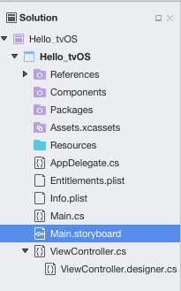](hello-tvos-images/designer01.png#lightbox)

This should launch the Designer and look like the following:

[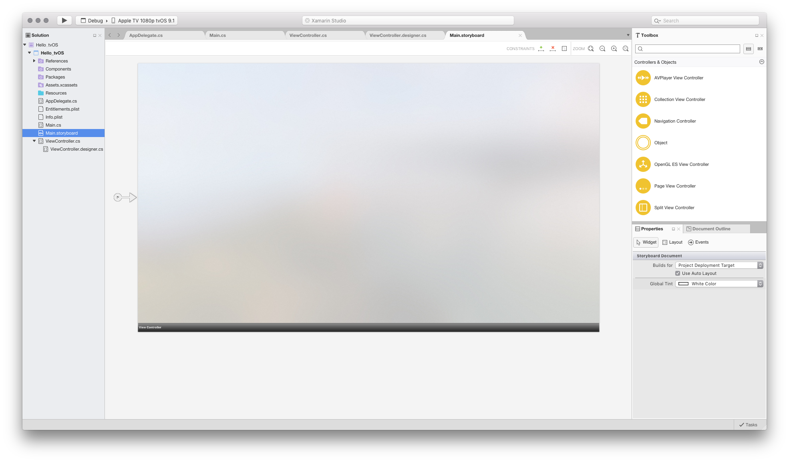](hello-tvos-images/designer02.png#lightbox)

For more information on the iOS Designer and how it works, refer to the [Introduction to the Xamarin Designer for iOS](~/ios/user-interface/designer/introduction.md) guide.

We can now start adding controls to the design surface of our Xamarin.tvOS app.

Do the following:

1. Locate the **Toolbox**, which should be to the right of the design surface:

    [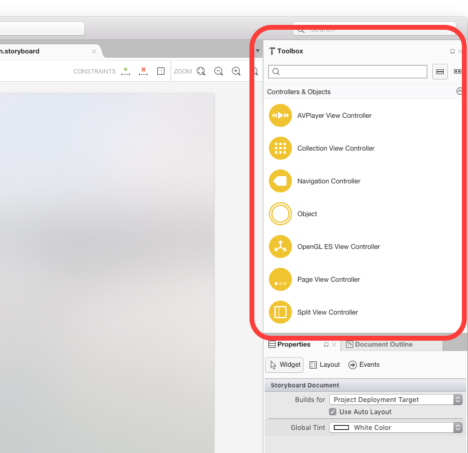](hello-tvos-images/designer03.png#lightbox)

    If you can't locate it here, browse to **View > Pads > Toolbox** to view it.
2. Drag a **Label** from the **Toolbox** to the design surface:

    [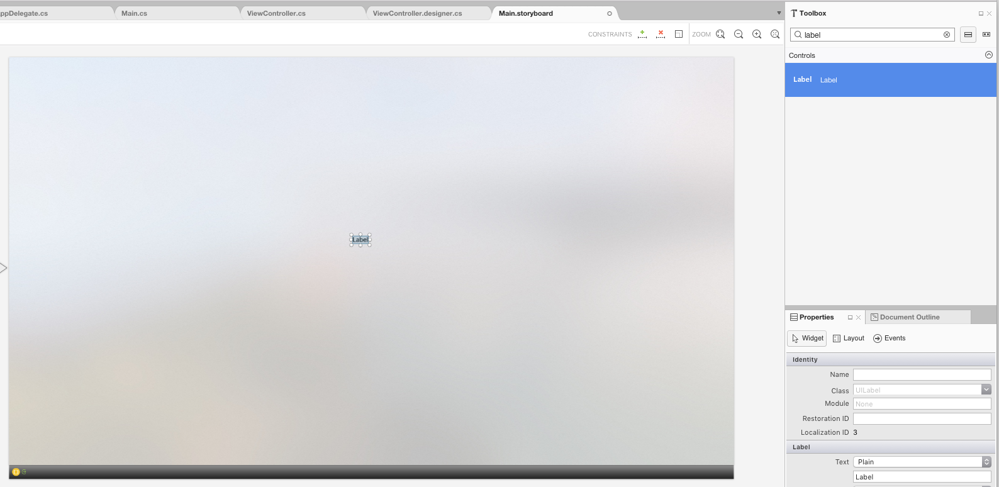](hello-tvos-images/designer04.png#lightbox)
3. Click on the **Title** property in the **Property pad** and change the button's title to `Hello, tvOS` and set the **Font Size** to 128:

    [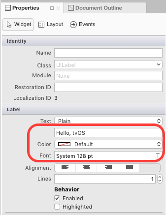](hello-tvos-images/designer05.png#lightbox)
4. Resize the label so that all of the words are visible and place it centered near the top of the window:

    [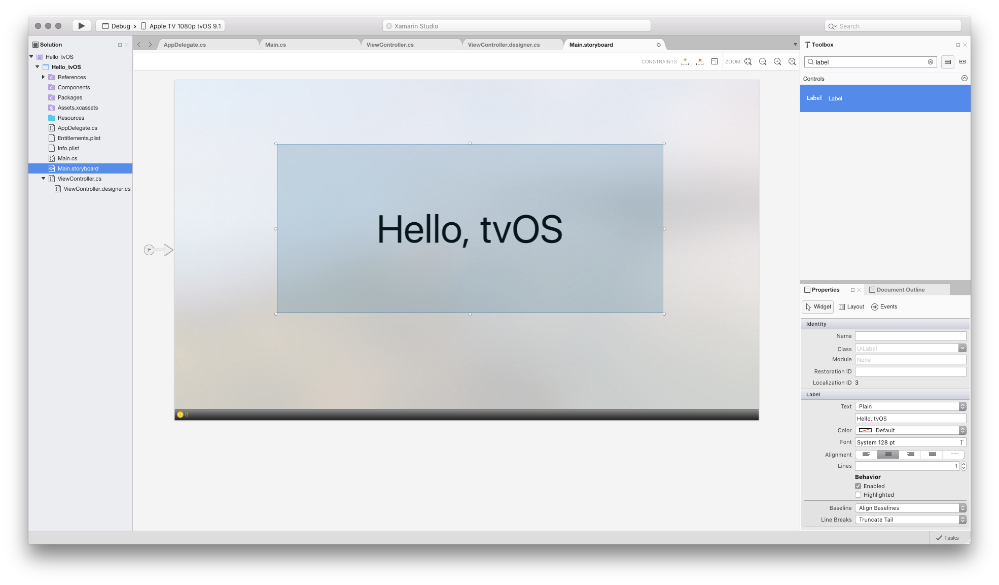](hello-tvos-images/designer06.png#lightbox)
5. The label will now need to be constrained to it's position, so that it appears as intended. regardless of screen size. To do this, click on the label until the *T-shaped handle* appears:

    [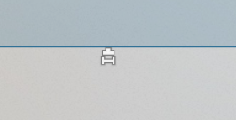](hello-tvos-images/designer07.png#lightbox)
6. To constrain the label horizontally, select the center square and drag it to the vertically dashed line:

    [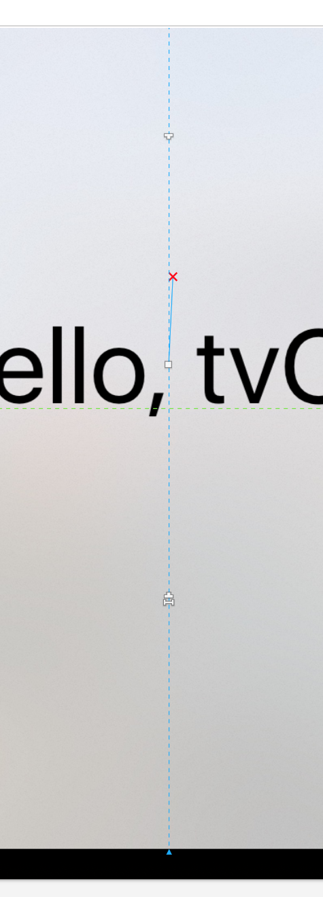](hello-tvos-images/designer08zoom.png#lightbox)

     The label should turn orange.
7. Select the T handle at the top of the label, and drag it to the top edge of the window:

    [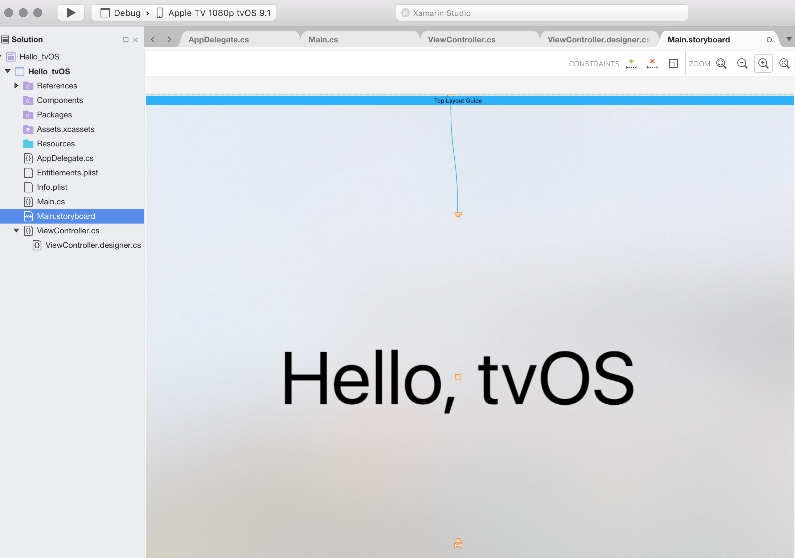](hello-tvos-images/designer09.png#lightbox)
8. Next, click the width and then the height *bone handle* as illustrated below:

    [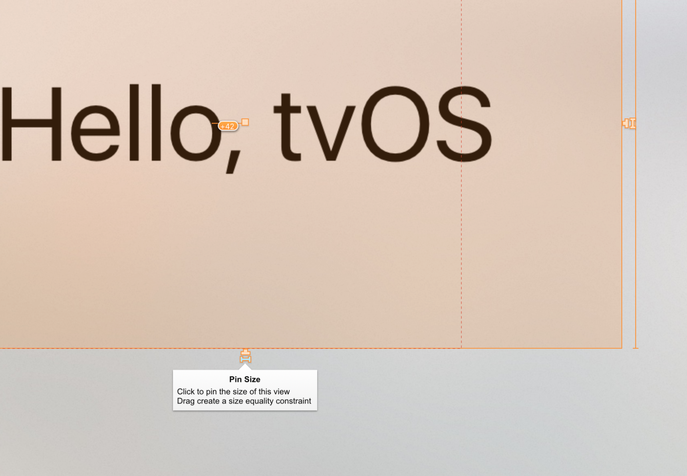](hello-tvos-images/designer10.png#lightbox)

     When each *bone handle* is clicked, select both Width and Height respectively to set fixed dimensions.
9. When completed, your Constraints should look similar to those in the Layout tab of the Properties pad:

    [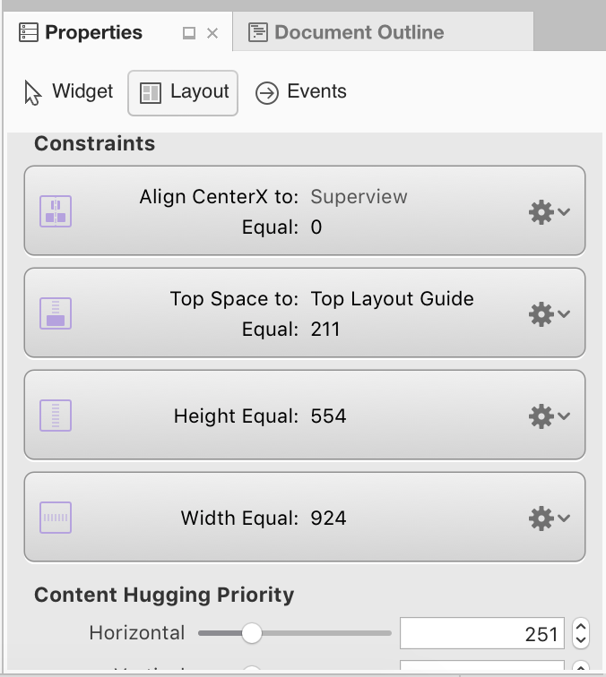](hello-tvos-images/designer11.png#lightbox)
10. Drag a **Button** from the **Toolbox** and place it under the Label.
11. Click on the **Title** property in the **Property pad** and change the button's title to `Click Me`:

    [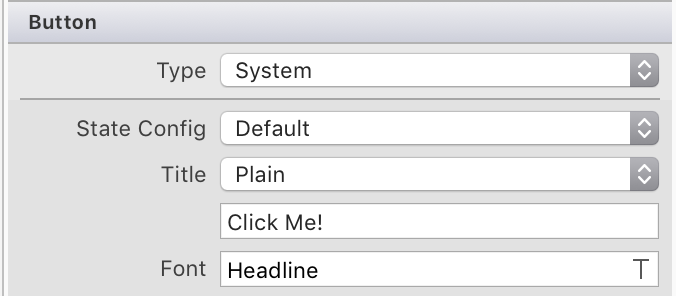](hello-tvos-images/designer12.png#lightbox)
12. Repeat steps 5 to 8 above to constrain the button in the tvOS window. However, instead of dragging  the T-handle to the top of the window (as in step #7), drag it to the bottom of the label:

    [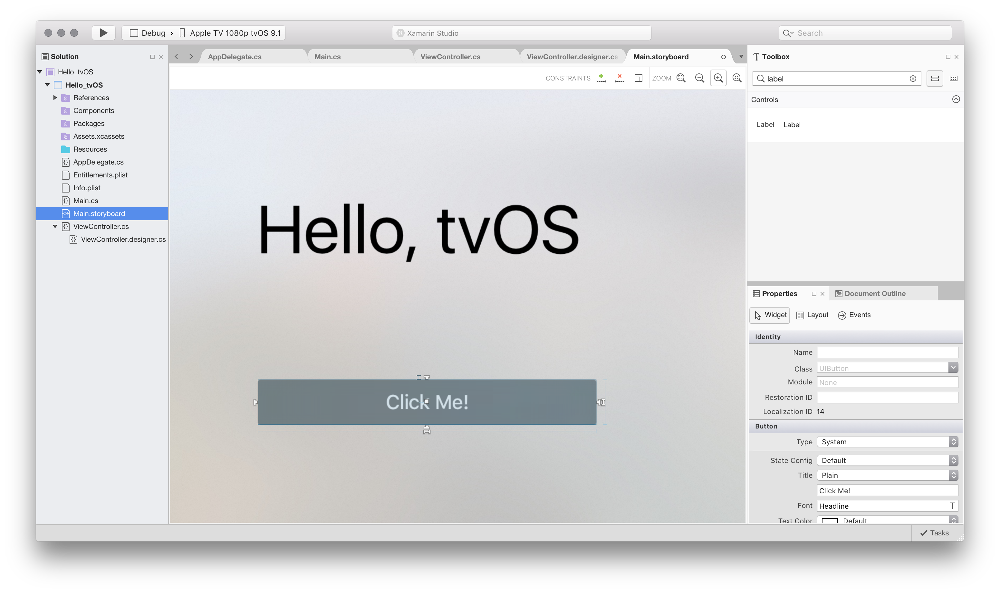](hello-tvos-images/designer14.png#lightbox)
13. Drag another label under the button, size it to be the same width as the first label and set its **Alignment** to **Center**:

    [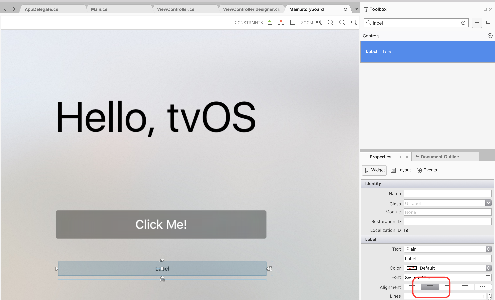](hello-tvos-images/designer15.png#lightbox)
14. Like the first label and button, set this label to center and pin it into location and size:

    [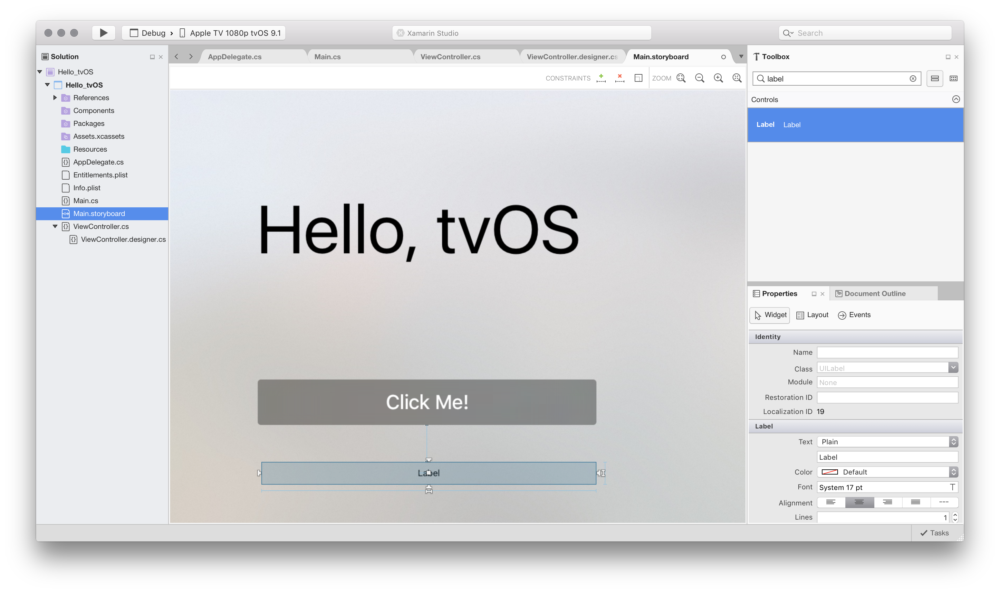](hello-tvos-images/designer16.png#lightbox)
15. Save your changes to the User Interface.

As you were resizing and moving controls around, you should have noticed that the designer gives you helpful snap hints that are based on [Apple TV Human Interface Guidelines](https://developer.apple.com/design/human-interface-guidelines/designing-for-tvos). These guidelines will help you create high quality applications that will have a familiar look and feel for Apple TV users.

If you look in the **Document Outline** section, notice how the layout and hierarchy of the elements that make up our user Interface are shown:

[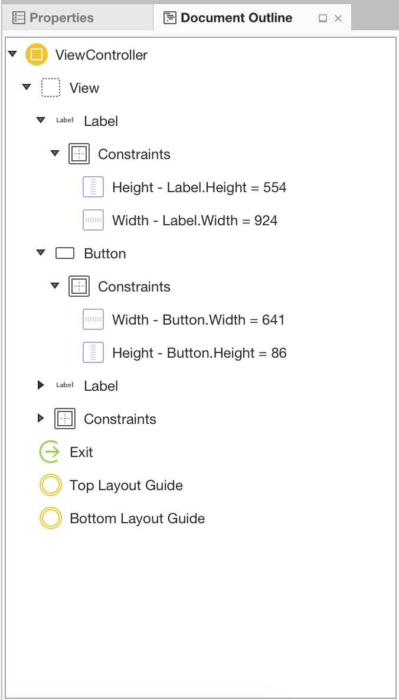](hello-tvos-images/designer17.png#lightbox)

From here you can select items to edit or drag to reorder UI elements if needed. For example, if a UI element was being covered by another element, you could drag it to the bottom of the list to make it the top-most item on the window.

Now that we have our User Interface created, we need to expose the UI items so that Xamarin.tvOS can access and interact with them in C# code.

### Accessing the controls in the code behind

There are two main ways to access the controls that you have added in the iOS designer from code:

- Creating an event handler on a control.
- Giving the control a name, so that we can later reference it.

When either of these are added, the partial class within the `ViewController.designer.cs` will be updated to reflect the changes. This will allow you to then access the controls in the View Controller.

### Creating an event handler

In this sample application, when the button is clicked we want _something_ to happen, so an event handler needs to be added to a specific event on the button. To set this up, do the following:

1. In the Xamarin iOS Designer, select the button on the View Controller.
2. In the Properties pad, select the **Events** tab:

    [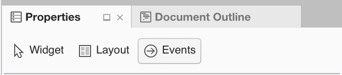](hello-tvos-images/event1.png#lightbox)
3. Locate the TouchUpInside event, and give it an event handler named `Clicked`:

    [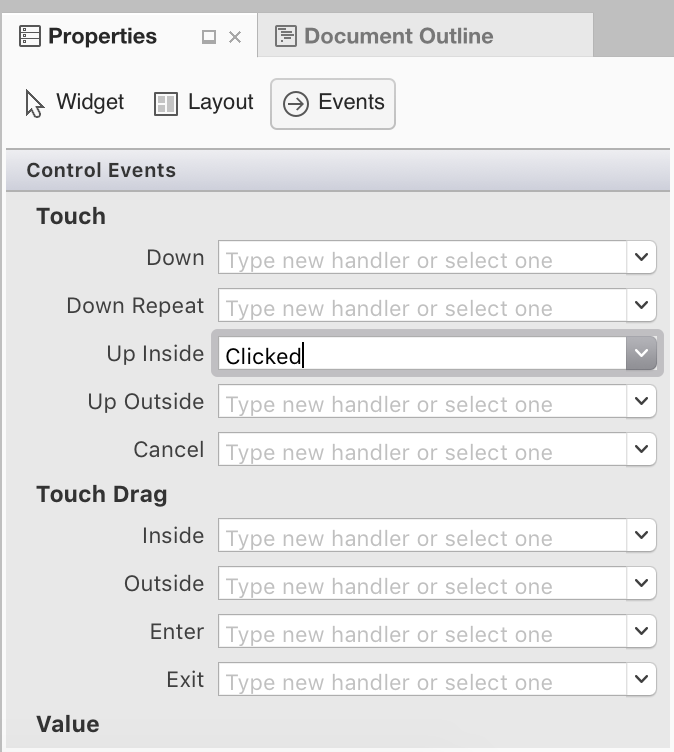](hello-tvos-images/event2.png#lightbox)
4. When you press **Enter**, the **ViewController**.cs file will open, suggesting locations for your event handler in code. Use the arrow keys on your keyboard to set the location:

    [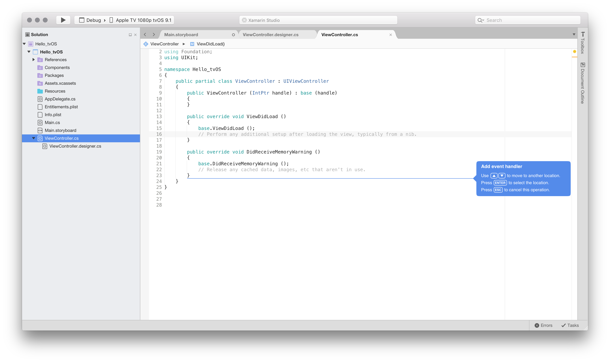](hello-tvos-images/event3.png#lightbox)
5. This will create a partial method as shown below:

    [](hello-tvos-images/event4.png#lightbox)

We are now ready to start adding some code to allow the button to function.

### Naming a control

When the button is clicked, the label should update based on the number of clicks. To do this, we will need to access the label in code. This is done by giving it a name. Do the following:

1. Open the Storyboard, and select the Label at the bottom of the View Controller.
2. In the Properties pad, select the **Widget** tab:

    [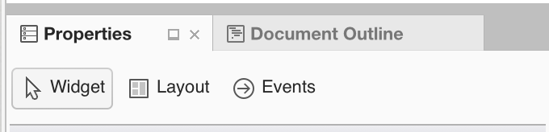](hello-tvos-images/name1.png#lightbox)
3. Under **Identity > Name**, add `ClickedLabel`:

    [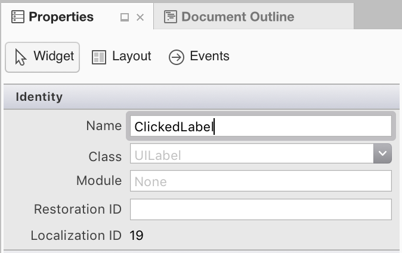](hello-tvos-images/name2.png#lightbox)

We are now ready to start updating the label!

### How controls are accessed

If you select the `ViewController.designer.cs` in the **Solution Explorer** you'll be able to see how the `ClickedLabel` label and the `Clicked` event handler have been mapped to an **Outlet** and **Action** in C#:

[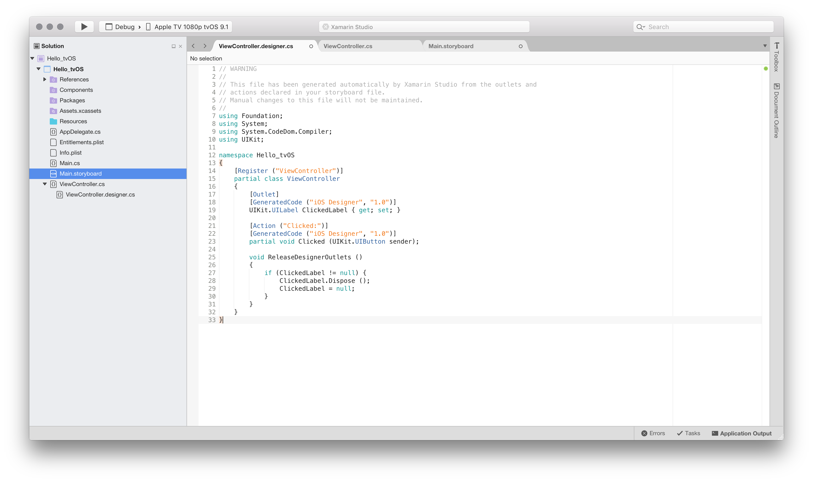](hello-tvos-images/accesscontrol.png#lightbox)

You may also notice that `ViewController.designer.cs` is a partial class, so that Visual Studio for Mac doesn't have to modify `ViewController.cs` which would overwrite any changes that we have made to the class.

Exposing the UI elements in this way, allows you to access them in the View Controller.

You normally will never need to open the `ViewController.designer.cs` yourself, it was presented here for educational purposes only.

<a name="Writing-the-Code"></a>

## Writing the Code

With our User Interface created and its UI elements exposed to code via **Outlets** and **Actions**, we are finally ready to write the code to give the program functionality.

In our application, every time the first button is clicked, we’re going to update our label to show how many times the button has been clicked. To accomplish this, we need to open the `ViewController.cs` file for editing by double-clicking it in the **Solution Pad**:

[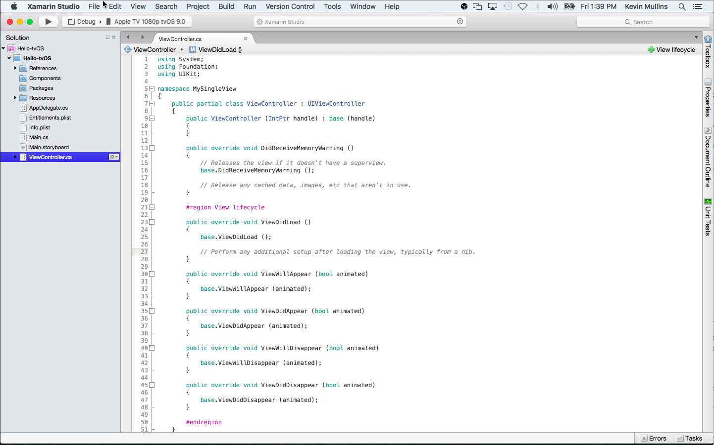](hello-tvos-images/code01.png#lightbox)

First, we need to create a class-level variable in our `ViewController` class to track the number of clicks that have happened. Edit the class definition and make it look like the following:

```csharp
using System;
using Foundation;
using UIKit;

namespace Hello_tvOS
{
    public partial class ViewController : UIViewController
    {
        private int numberOfTimesClicked = 0;
        ...
```

Next, in the same class (`ViewController`), we need to override the **ViewDidLoad** method and add some code to set the initial message for our label:

```csharp
public override void ViewDidLoad ()
{
    base.ViewDidLoad ();

    // Set the initial value for the label
    ClickedLabel.Text = "Button has not been clicked yet.";
}
```

We need to use `ViewDidLoad`, instead of another method such as `Initialize`, because `ViewDidLoad` is called *after* the OS
has loaded and instantiated the User Interface from the `.storyboard` file. If we tried to access the label control before the `.storyboard` file has been fully loaded and instantiated, we’d get a `NullReferenceException` error because the label control would not be created yet.

Next, we need to add the code to respond to the user clicking the button. Add the following to partial class to that we created:

```csharp
partial void Clicked (UIButton sender)
{
    ClickedLabel.Text = string.Format("The button has been clicked {0} time{1}.", ++numberOfTimesClicked, (numberOfTimesClicked
```

This code will be called any time the user clicks our button.

With everything in place, we are now ready to build and test our Xamarin.tvOS application.

## Testing the Application

It’s time to build and run our application to make sure it runs as expected. We can build and run all in one step, or we can build it without running it.

Whenever we build an application, we can choose what kind of build we want:

- **Debug** – A debug build is compiled into an `` (application) file with extra metadata that allows us to debug what’s happening while the application is running.
- **Release** – A release build also creates an `` file, but it doesn’t include debug information, so it’s smaller and executes faster.  

You can select the type of build from the **Configuration Selector** at the upper left hand corner of the Visual Studio for Mac screen:

[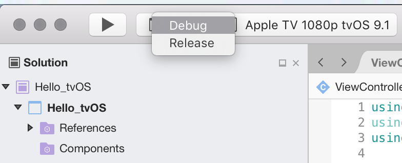](hello-tvos-images/run01.png#lightbox)

### Building the Application

In our case, we just want a debug build, so let’s make sure that **Debug** is selected. Let's build our application first by either pressing **⌘B**, or from the **Build** menu, choose **Build All**.

If there weren't any errors, you’ll see a **Build Succeeded** message in Visual Studio for Mac's status bar. If there were errors, review your project and make sure that you’ve followed the steps correctly. Start by confirming that your code (both in Xcode and in Visual Studio for Mac) matches the code in the tutorial.

### Running the Application

To run the application, we have three options:

- Press **⌘+Enter**.
- From the **Run** menu, choose **Debug**.
- Click the **Play** button in the Visual Studio for Mac toolbar (just above the **Solution Explorer**).

The application will build (if it hasn’t been built already), start in debug mode, the tvOS Simulator will start and the app will launch and display it's main interface window:

[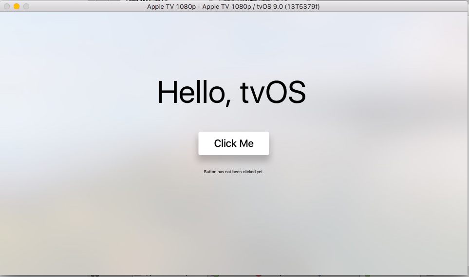](hello-tvos-images/run03.png#lightbox)

From the **Hardware** menu select **Show Apple TV Remote** so you can control the simulator.

[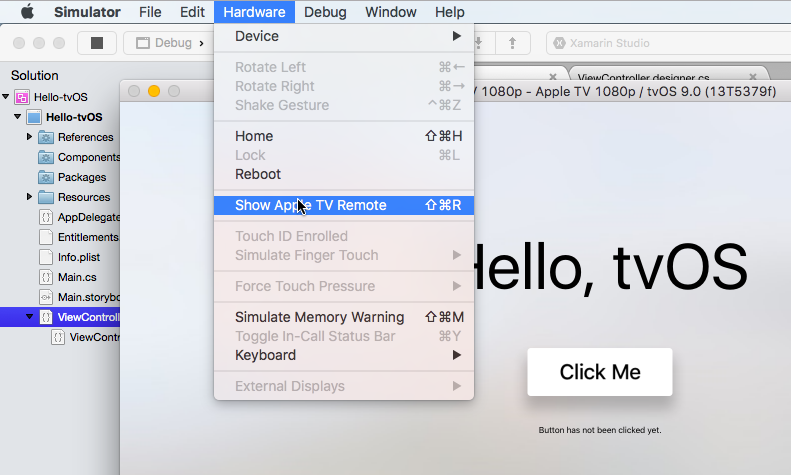](hello-tvos-images/run04.png#lightbox)

Using the Simulator's remote, if you click the button a few times the label should be updated with the count:

[](hello-tvos-images/run05.png#lightbox)

Congratulations! We covered a lot of ground here, but if you followed this tutorial from start to finish, you should now have a solid understanding of the components of a Xamarin.tvOS app as well as the tools used to create them.

## Where to Next?

Developing Apple TV apps presents a few challenges because of the disconnect between the user and the interface (it's across the room not in the user's hand) and the limitations tvOS places on app size and storage.

As a result, we highly suggest that your read the following documents before jumping into a Xamarin.tvOS app's design:

- [Introduction to tvOS 9](~/ios/tvos/platform/tvos9.md) – This article introduces all of the new and modified APIs and features available in tvOS 9 for Xamarin.tvOS developers.
- [Working with Navigation and Focus](~/ios/tvos/app-fundamentals/navigation-focus.md) – Users of your Xamarin.tvOS app will not be interacting with it's interface directly as with iOS where they tap images on the device's screen, but indirectly from across the room using the Siri Remote. This article covers the concept of Focus and how it is used to handle Navigation in a Xamarin.tvOS app's User Interface.
- [Siri Remote and Bluetooth Controllers](~/ios/tvos/platform/remote-bluetooth.md) – The main way that users will be interacting with the Apple TV, and your Xamarin.tvOS app, is through the included Siri Remote. If your app is a game, you can optionally build in support for 3rd party, Made For iOS (MFI) Bluetooth Game Controllers in your app as well. This article covers supporting the new Siri Remote and Bluetooth game controllers in your Xamarin.tvOS apps.
- [Resources and Data Storage](~/ios/tvos/app-fundamentals/resources-data-storage.md) – Unlike iOS devices, the new Apple TV does not provide persistent, local storage for tvOS apps. As a result, if your Xamarin.tvOS app needs to persist information (such as user preferences) it must store and retrieve that data from iCloud. This article covers working with resources and persistent data storage in a Xamarin.tvOS app.
- [Working with Icons and Images](~/ios/tvos/app-fundamentals/icons-images.md) – Creating captivating icons and imagery are a critical part of developing an immersive user experience for your Apple TV apps. This guide will cover the steps required to create and include the necessary graphic assets for your Xamarin.tvOS apps.
- [User Interface](~/ios/tvos/user-interface/index.md) – General User Experience (UX) coverage including User Interface (UI) controls, use Xcode's Interface Builder and UX design principles when working with Xamarin.tvOS.
- [Deployment and Testing](~/ios/tvos/deploy-test/index.md) – This section covers topics used to test an app as well as how to distribute it. Topics here include things such as tools used for debugging, deployment to testers and how to publish an application to the Apple TV App Store.

If you run into any problems working with Xamarin.tvOS, please see our [Troubleshooting](~/ios/tvos/troubleshooting.md) documentation for a list on know issues and solutions.

## Summary

This article provided a quick start to developing apps for tvOS with Visual Studio for Mac by creating a simple Hello, tvOS app. It covered the basics of tvOS device provisioning, interface creation, coding for tvOS and testing on the tvOS simulator.

## Related Links

- [tvOS Samples](/samples/browse/?products=xamarin&term=Xamarin.iOS%2btvOS)
- [tvOS](https://developer.apple.com/tvos/)
- [tvOS Human Interface Guides](https://developer.apple.com/design/human-interface-guidelines/designing-for-tvos)
- [App Programming Guide for tvOS](https://developer.apple.com/library/prerelease/tvos/documentation/General/Conceptual/AppleTV_PG/)
- [Building apps for tvOS with Xamarin (video)](https://university.xamarin.com/lightninglectures/tvos-with-xamarin)