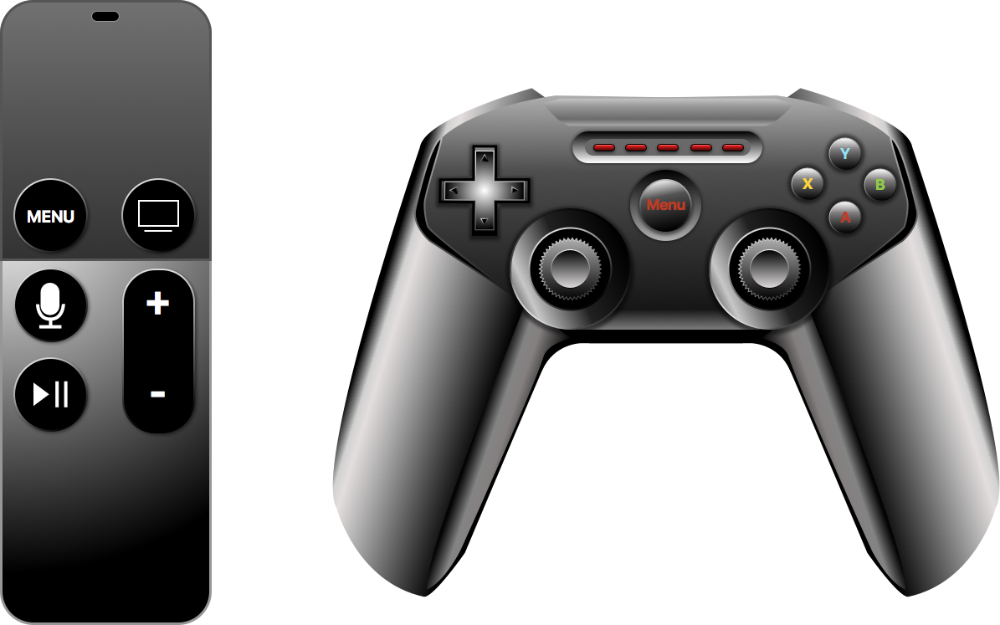
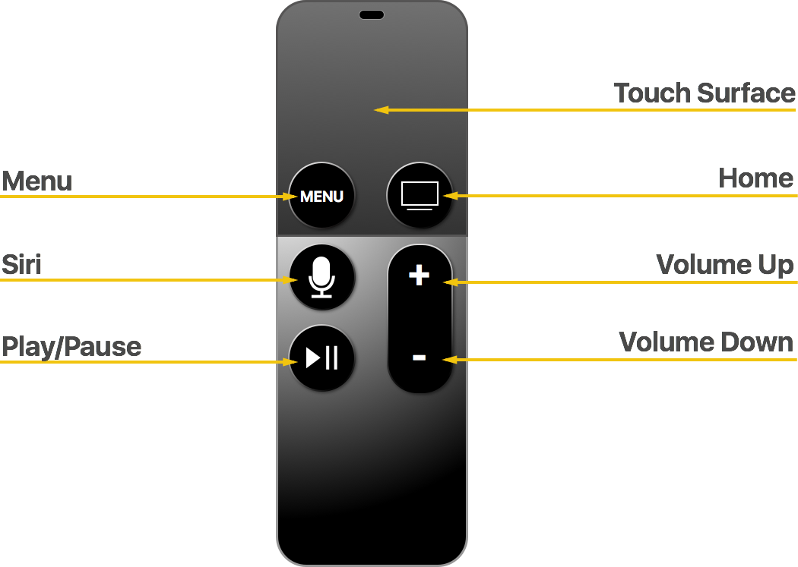
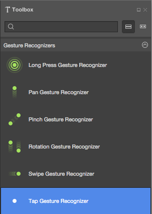
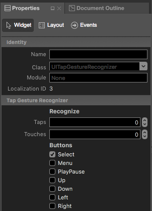
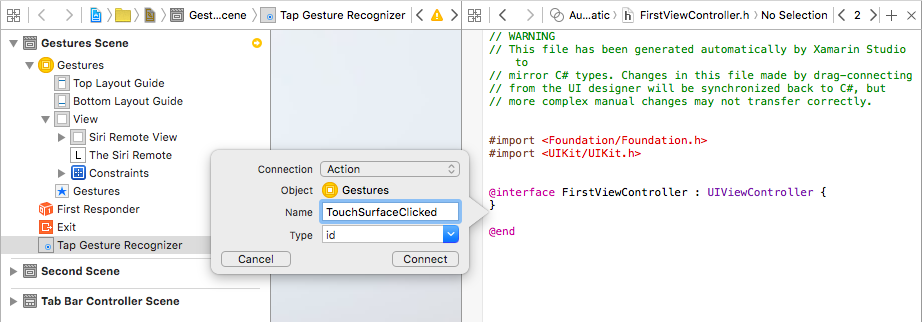
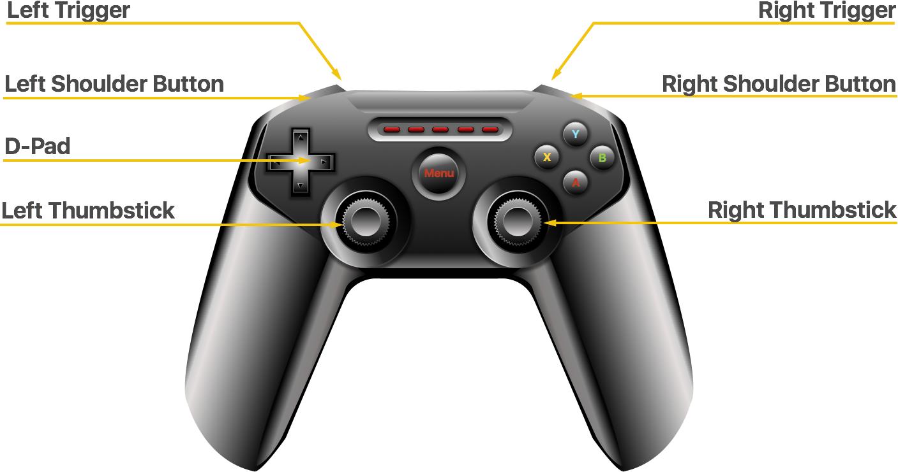
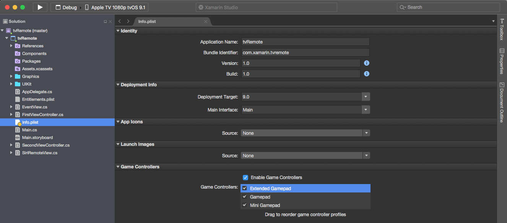

# Siri Remote and Bluetooth Controllers for tvOS in Xamarin

Users of your Xamarin.tvOS app will not be interacting with it's interface directly as with iOS where they tap images on the device's screen, but indirectly from across the room using the [Siri Remote](#The-Siri-Remote).

If your app is a game, you can optionally build in support for 3rd party, Made For iOS (MFI) [Bluetooth Game Controllers](#Bluetooth-Game-Controllers) in your app as well.

[](remote-bluetooth-images/intro01.png#lightbox)

This article describes the [Siri Remote](#The-Siri-Remote), [Touch Surface Gestures](#Touch-Surface-Gestures) and [Siri Remote Buttons](#Siri-Remote-Buttons) and shows how to work with them via [Gestures and Storyboards](#Gestures-and-Storyboards), [Gestures and Code](#Gestures-and-Code) and [Low-Level Event Handling](#Low-Level-Event-Handling). Finally, it discusses [Working with Game Controllers](#Working-with-Game-Controllers) in a Xamarin.tvOS app.

<a name="The-Siri-Remote"></a>

## The Siri Remote

The main way that users will be interacting with the Apple TV, and your Xamarin.tvOS app, is through the included Siri Remote. Apple designed the remote to bridge the distance between the user sitting on the couch and the Apple TV's user interface displayed across the room on the TV screen.

Your challenge as a tvOS app developer is the create a quick, easy to use and visually compelling user interface that leverages the Siri Remote's touch surface, accelerometer, gyroscope and buttons.

[](remote-bluetooth-images/remote01.png#lightbox)

The Siri Remote has the following features and expected usages within your tvOS app:

|Feature|General App Usage|Game App Usage|
|---|---|---|
|**Touch Surface**<br />Swipe to navigate, press to select and hold for contextual menus.|**Tap/Swipe**<br />UI Navigation between focusable items.<br /><br />**Click**<br />Activates selected (in-focus) item.|**Tap/Swipe**<br />Depends on game design and can be used as a D-Pad by tapping on the edges.<br /><br />**Click**<br />Perform primary button function.|
|**Menu**<br />Press to return to previous screen or menu.|Returns to previous screen and exits to Apple TV Home screen from the main app screen.|Pause and resume gameplay, returns to previous screen and exits to Apple TV Home screen from the main app screen.|
|**Siri/Search**<br />In countries with Siri, press and hold for voice control, in all other countries, displays Search Screen.|n/a|n/a|
|**Play/Pause**<br />Play and Pause media or provides a secondary function in apps.|Starts media playback and pause/resume playback.|Performs secondary button function or skips intro video (if exists).|
|**Home**<br />Press to return to the Home screen, double-click to display running apps, press and hold to sleep device.|n/a|n/a|
|**Volume**<br />Controls attached audio/video equipment volume.|n/a|n/a|

<a name="Touch-Surface-Gestures"></a>

## Touch Surface Gestures

The Siri Remote's Touch Surface is able to detect a variety of single-finger gestures that you can respond to in your Xamarin.tvOS app:

|Swipe|Click|Tap|
|---|---|---|
||||
|Moves selection (focus) between UI elements on screen (up, down left, right). Swiping can be used to scroll through large lists of content quickly using inertia.|Activates the selected (in-focus) item or acts like the primary button in a game. Clicking and holding can activate contextual menus or secondary functions.|Lightly tapping the Touch Surface on the edges acts like directional buttons on a D-Pad, moving focus up, down, left or right depending on the area tapped. Depending on the app, can be used to reveal hidden controls.|

Apple provides the following suggestions for working with Touch Surface gestures:

- **Differentiate between Clicks and Taps** - Clicking is an intentional action by the user and is well suited for selection, activation and the primary button of a game. Tapping is more subtle and should be used sparingly because the user is often holding the Siri Remote in their hand and can accidentally activate a Tap event easily.
- **Don't Redefine Standard Gestures** - The user has an expectation that specific gestures will perform specific actions, you shouldn't redefine the meaning or function of these gestures in your app. The one exception is a game app during active gameplay.
- **Define New Gestures Sparingly** - Again, the user has an expectation that specific gestures will perform specific actions. You should avoid defining custom gestures to perform standard actions. And again, games are the most usual exception where custom gestures can add fun, immersive play to the game.
- **If Appropriate, Respond to D-Pad Taps** - Lightly tapping on the corner edges of the Touch Surface will react like a D-Pad on a game controller moving focus or direction up, down, left or right. If appropriate, you should respond to these gestures in your app or game.

<a name="Siri-Remote-Buttons"></a>

## Siri Remote Buttons

In addition to gestures on the Touch Surface, your app can respond to the user clicking the Touch Surface or pressing the Play/Pause button. If you are accessing the Siri Remote using the Game Controller Framework, you can also detect the Menu button being pressed.

Additionally, menu button presses can be detected using a Gesture Recognizer with standard `UIKit` elements. If you intercept the Menu button being pressed, you'll be responsible for closing the current View and View Controller and return to the previous one.

> [!IMPORTANT]
> You should **always** assign a function to the Play/Pause button on the remote. Having a non-functional button can make your app look broken to the end user. If you don't have a valid function for this button, assign the same function as the primary button (Touch Surface Click).

<a name="Gestures-and-Storyboards"></a>

## Gestures and Storyboards

The easiest way to work with the Siri Remote in your Xamarin.tvOS app is to add Gesture Recognizers to your views in the Interface Designer.

To add a Gestures Recognizer, do the following:

1. In the **Solution Explorer**, double-click the `Main.storyboard` file and open it for editing the Interface Designer.
2. Drag a **Tap Gesture Recognizer** from the **Library** and drop it on the View:

    [](remote-bluetooth-images/storyboard01.png#lightbox)
3. Check **Select** in the **Button** section of the **Attribute Inspector**:

    [](remote-bluetooth-images/storyboard02.png#lightbox)
4. **Select** means the gesture will respond to the user clicking the **Touch Surface** on the Siri Remote. You also have the option of responding to the **Menu**, **Play/Pause**, **Up**, **Down**, **Left** and **Right** buttons.
5. Next, wire up an **Action** from the **Tap Gesture Recognizer** and call it `TouchSurfaceClicked`:

    [](remote-bluetooth-images/storyboard03.png#lightbox)
6. Save your changes and return to Visual Studio for Mac.

Edit your View Controller (example `FirstViewController.cs`) file and add the following code to handle the gesture being triggered:

```csharp
using System;
using UIKit;

namespace tvRemote
{
    public partial class FirstViewController : UIViewController
    {
        ...

        #region Custom Actions
        partial void TouchSurfaceClicked (Foundation.NSObject sender) {
            // Handle click here
            ...
        }
        #endregion
    }
}
```

For more information on working with Storyboards, please see our [Hello, tvOS Quick Start Guide](~/ios/tvos/get-started/hello-tvos.md). Specifically the [Creating the User Interface](~/ios/tvos/get-started/hello-tvos.md#Creating-the-User-Interface) and [Writing the Code with outlets and actions](~/ios/tvos/get-started/hello-tvos.md#Writing-the-Code) sections.

<a name="Gestures-and-Code"></a>

## Gestures and Code

Optionally, you can create gestures directly in C# code and add them to views in your User Interface. For example, to add a series of Swipe Gesture Recognizers, edit your View Controller and add the following code:

```csharp
using System;
using UIKit;

namespace tvRemote
{
    public partial class SecondViewController : UIViewController
    {
        #region Constructors
        public SecondViewController (IntPtr handle) : base (handle)
        {
        }
        #endregion

        #region Override Methods
        public override void ViewDidLoad ()
        {
            base.ViewDidLoad ();

            // Wire-up gestures
            var upGesture = new UISwipeGestureRecognizer (() => {
                RemoteView.ArrowPressed = "Up";
                ButtonLabel.Text = "Swiped Up";
            }) {
                Direction = UISwipeGestureRecognizerDirection.Up
            };
            this.View.AddGestureRecognizer (upGesture);

            var downGesture = new UISwipeGestureRecognizer (() => {
                RemoteView.ArrowPressed = "Down";
                ButtonLabel.Text = "Swiped Down";
            }) {
                Direction = UISwipeGestureRecognizerDirection.Down
            };
            this.View.AddGestureRecognizer (downGesture);

            var leftGesture = new UISwipeGestureRecognizer (() => {
                RemoteView.ArrowPressed = "Left";
                ButtonLabel.Text = "Swiped Left";
            }) {
                Direction = UISwipeGestureRecognizerDirection.Left
            };
            this.View.AddGestureRecognizer (leftGesture);

            var rightGesture = new UISwipeGestureRecognizer (() => {
                RemoteView.ArrowPressed = "Right";
                ButtonLabel.Text = "Swiped Right";
            }) {
                Direction = UISwipeGestureRecognizerDirection.Right
            };
            this.View.AddGestureRecognizer (rightGesture);
        }
        #endregion
    }
}
```

<a name="Low-Level-Event-Handling"></a>

## Low-Level Event Handling

If you are creating a custom type based on `UIKit` in your Xamarin.tvOS app (for example `UIView`), you also have the ability to provide low-level handling of button press via `UIPress` events.

A `UIPress` event is to tvOS what a `UITouch` event is to iOS, except `UIPress` returns information about button presses on the Siri Remote or other attached Bluetooth devices (like a Game Controller). `UIPress` events describe the button being pressed and its state (Began, Canceled, Changed or Ended).

For analog buttons on devices like Bluetooth Game Controllers, `UIPress` also returns the amount of force being applied to the button. The `Type` property of the `UIPress` event defines which physical button has changed state, while the rest of the properties describe the change that occurred.

The following code shows an example of handling low-level `UIPress` events for a `UIView`:

```csharp
using System;
using Foundation;
using UIKit;

namespace tvRemote
{
    public partial class EventView : UIView
    {
        #region Computed Properties
        public override bool CanBecomeFocused {
            get {
                return true;
            }
        }
        #endregion

        #region
        public EventView (IntPtr handle) : base (handle)
        {
        }
        #endregion

        #region Override Methods
        public override void PressesBegan (NSSet<UIPress> presses, UIPressesEvent evt)
        {
            base.PressesBegan (presses, evt);

            foreach (UIPress press in presses) {
                // Was the Touch Surface clicked?
                if (press.Type == UIPressType.Select) {
                    BackgroundColor = UIColor.Red;
                }
            }
        }

        public override void PressesCancelled (NSSet<UIPress> presses, UIPressesEvent evt)
        {
            base.PressesCancelled (presses, evt);

            foreach (UIPress press in presses) {
                // Was the Touch Surface clicked?
                if (press.Type == UIPressType.Select) {
                    BackgroundColor = UIColor.Clear;
                }
            }
        }

        public override void PressesChanged (NSSet<UIPress> presses, UIPressesEvent evt)
        {
            base.PressesChanged (presses, evt);
        }

        public override void PressesEnded (NSSet<UIPress> presses, UIPressesEvent evt)
        {
            base.PressesEnded (presses, evt);

            foreach (UIPress press in presses) {
                // Was the Touch Surface clicked?
                if (press.Type == UIPressType.Select) {
                    BackgroundColor = UIColor.Clear;
                }
            }
        }
        #endregion
    }
}
```

As with `UITouch` events, if you need to implement any of the `UIPress` event overrides, you should implement all four.

<a name="Bluetooth-Game-Controllers"></a>

## Bluetooth Game Controllers

In addition to the standard Siri Remote that ships with the Apple TV, 3rd party, Made For iOS (MFI) Bluetooth Game Controllers can be paired with the Apple TV and used to control your Xamarin.tvOS app.

[](remote-bluetooth-images/game01.png#lightbox)

Game Controllers can be used to enhance gameplay and provide a sense of immersion in a game. They can also be used to control the standard Apple TV interface so the use doesn't have to switch between the remote and the controller.

> [!IMPORTANT]
> Bluetooth Game Controllers are an optional purchase that end users might make, your app cannot force the user to purchase one. If your app supports Game Controllers it must also support the Siri Remote so that the game is useable by all Apple TV users.

A Game Controller has the following features and expected usages within your tvOS app:

|Feature|General App Usage|Game App Usage|
|---|---|---|
|**D-Pad**|Navigates through UI elements (changes focus).|Depends on game.|
|**A**|Activates the selected (in-focus) item.|Performs primary button function and confirms dialog actions.|
|**B**|Returns to previous screen or exits to the Home screen if on the app's main screen.|Performs the secondary button function or returns to the previous screen.|
|**X**|Starts media playback or pause/resumes playback.|Depends on game.|
|**Y**|n/a|Depends on game.|
|**Menu**|Returns to previous screen or exits to the Home screen if on the app's main screen.|Pause/resume gameplay, returns to previous screen or exits to the Home screen if on the app's main screen.|
|**Left Shoulder Button**|Navigates Left.|Depends on game.|
|**Left Trigger**|Navigates Left.|Depends on game.|
|**Right Shoulder Button**|Navigates Right.|Depends on game.|
|**Right Trigger**|Navigates Right|Depends on game.|
|**Left Thumbstick**|Navigates through UI elements (changes focus).|Depends on game.|
|**Right Thumbstick**|n/a|Depends on game.|

Apple provides the following suggestions for working with Game Controllers:

- **Confirm Game Controller Connections** - Your tvOS app can be started and stopped at any time by the end user. You should always check for the presence of a Game Controller at app start or awake times and take action as needed.
- **Ensure Your App Works on both Siri Remote and Game Controllers** - Don't require users to switch between the Siri Remote and a Game Controller to use your app. Test your app often with both types of controllers ensuring that everything is easy to navigate and works as expected.
- **Provide a Way Back** - Pressing the Menu button should always return to the previous screen. If the user is at the main app screen, the Menu button should return them to the Apple TV Home screen. During gameplay, the Menu button should display an alert giving the user the ability to pause/resume gameplay or return to the main menu.

<a name="Working-with-Game-Controllers"></a>

## Working with Game Controllers

As stated above, in addition to the standard Siri Remote that ships with the Apple TV, the user can optionally attach a 3rd party, Made For iOS (MFI) Bluetooth Game Controllers and use it to control your Xamarin.tvOS app.

If your app required low-level controller input, you can uses Apple's [Game Controller Framework](https://developer.apple.com/library/prerelease/tvos/documentation/ServicesDiscovery/Conceptual/GameControllerPG/Introduction/Introduction.html#//apple_ref/doc/uid/TP40013276) which has the following modifications for tvOS:

- The Micro Game Controller profile (`GCMicroGamepad`) has been added to target the Siri Remote.
- The new `GCEventViewController` class can be used to route game controller events through your app. See the [Determining Game Controller Input](#determining-game-controller-input) section below for more details.

<a name="Game-Controller-Support-Requirements"></a>

### Game Controller Support Requirements

Apple has several specific requirements that must be met if your Xamarin.tvOS app supports Game Controllers:

- **You Must Support the Siri Remote** - You must always support the Siri Remote. Your game cannot require a 3rd party Game Controller to be playable.
- **You Must Support the Extended Control Layout** - All tvOS Game Controllers are non-formfitting, extended controllers.
- **Games Must be Playable with Stand-Alone Controllers** - If your app supports an Extended Game Controller, it must be playable solely with that Game Controller.
- **You Must Support the Play/Pause Button** - During gameplay, if the user presses the Play/Pause button, you should display an alert giving the user the ability to pause/resume gameplay or return to the main menu.

<a name="Enabling-Game-Controller-Support"></a>

### Enabling Game Controller Support

To enable Game Controller support in your Xamarin.tvOS app, double-click the `Info.plist` file in the **Solution Explorer** to open it for editing:

[](remote-bluetooth-images/game02.png#lightbox)

Under the **Game Controller** section, place a check by **Enable Game Controllers**, then check all of the Game Controller types that will be supported by the app.

<a name="Using-the-Siri-Remote-as-a-Game-Controller"></a>

### Using the Siri Remote as a Game Controller

The Siri Remote that come with the Apple TV can be used as a limited Game Controller. Like other Game Controllers, it shows up in the Game Controller Framework as a `GCController` object and supports both the `GCMotion` and the `GCMicroGamepad` profiles.

The Siri Remote has the following characteristics when being used as a Game Controller:

- The Touch Surface can be used as a D-pad that provides analog input data.
- The remote can be used in either a portrait or landscape orientation and your app decides if the profile object should flip input data automatically.
- Clicking the Touch Surface acts like pressing button **A** on a Game Controller.
- The Play/Pause button acts like button **X** on a Game Controller.
- The Menu button should display an alert giving the user the ability to pause/resume gameplay or return to the main menu.

<a name="Summary"></a>

### Determining Game Controller Input

Unlike iOS where Game Controller events can be received in parallel with Touch events, tvOS processes all low-level events to deliver high-level `UIKit` events. As a result, if you need access to the low level Game Controller events, you'll need to turn off `UIKit`'s default behavior.

On tvOS, when you want to process Game Controller input directly you need to use a `GCEventViewController` (or a subclass) to display the game's User Interface. Whenever a `GCEventViewController` is the *First Responder*, Game Controller input will be captured and delivered to your app through the Game Controller Framework.

You can use the `UserInteractionEnabled` property of the `GCEventViewController` class to toggle how events are processed and handled.

For information about implementing Game Controller support, please see Apple's [Working with Game Controllers](https://developer.apple.com/library/prerelease/tvos/documentation/General/Conceptual/AppleTV_PG/WorkingwithGameControllers.html) section in the [App Programming Guide for tvOS](https://developer.apple.com/library/prerelease/tvos/documentation/General/Conceptual/AppleTV_PG/index.html) and [Game Controller Programming Guide](https://developer.apple.com/library/prerelease/tvos/documentation/ServicesDiscovery/Conceptual/GameControllerPG/Introduction/Introduction.html).

<a name="Summary"></a>

## Summary

This article has covered the new Siri Remote that ships with the Apple TV, Touch Surface gestures and Siri Remote buttons. Next, it covered working with gestures and Storyboards, gestures and code and low-level events. Finally, if discussed working with Game Controllers.

## Related Links

- [tvOS Samples](/samples/browse/?products=xamarin&term=Xamarin.iOS%2btvOS)
- [tvOS](https://developer.apple.com/tvos/)
- [tvOS Human Interface Guides](https://developer.apple.com/design/human-interface-guidelines/designing-for-tvos)
- [App Programming Guide for tvOS](https://developer.apple.com/library/prerelease/tvos/documentation/General/Conceptual/AppleTV_PG/)