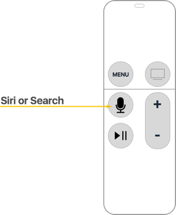
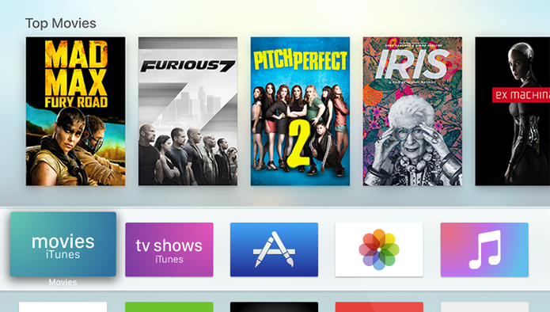

# Introduction to tvOS 9

_This article introduces all of the new and modified APIs and features available in tvOS 9 for Xamarin.tvOS developers._

Apple has released the 4th generation of the Apple TV hardware featuring a redesigned, touch-enable remote, running the new tvOS operating system (based on iOS 9).

For the first time, tvOS opens the Apple TV platform to the developer, allowing you to create rich, immersive apps and release them through the Apple TV's built-in App Store in a process similar to the experience of writing and releasing apps for iOS using the iTunes App Store.

If you are familiar with Xamarin.iOS development, you should find the transition to tvOS fairly simple. Most of the APIs and features are the same, however, many common APIs are unavailable (such as WebKit). Additionally, working with the with the Siri Remote poses some design challenges that are not present in touchscreen based iOS devices.

This guide will give an introduction to all of the new and modified APIs and features available in tvOS 9 for Xamarin.tvOS developers. For more information on tvOS, please see Apple's [Developing for the new Apple TV](https://developer.apple.com/tvos/) documentation.

## Supported and Unsupported Capabilities

tvOS apps running on the Apple TV have the following supported capabilities and features:

- App Groups
- Background Modes
- Data Protection
- Game Center
- Game Controllers
- iCloud
- In-App Purchases
- Keychain Sharing

The following features and capabilities are not supported:

- Apple Pay
- App Sandbox
- Associated Domains
- HealthKit
- HomeKit
- Inter-App Audio
- Maps
- Personal VPN
- Push Notifications
- Wallet
- Wireless Accessory Configuration

Please see our [Supported Assemblies](~/ios/tvos/internals/assemblies.md) and [Supported Frameworks](~/ios/tvos/internals/frameworks.md) documentation for more information.

## Apple TV Hardware

The new Apple TV has the following hardware specifications:

- 64-bit A8 processor
- 32GB or 64GB of storage
- 2GB of RAM
- 10/100Mbps Ethernet
- WiFi 802.11a/b/g/n/ac
- 1080p resolution
- HDMI
- USB C Port (for developer and diagnostic use only)
- New Siri Remote or Apple TV Remote (based on region)

### Siri Remote

Based on the region, the supplied Apple TV Remote will come in either one configurations: Siri Remote or Apple TV Remote.

The Siri Remote is currently available in the following countries/regions:

- Australia
- Canada
- France
- Germany
- Japan
- Spain
- United Kingdom
- United States

All other countries/regions will receive the Apple TV Remote that replaces the Siri button with a Search button that brings up the default Search screen with text input for searching:

For more information, please see our [Siri Remote and Bluetooth Controllers](~/ios/tvos/platform/remote-bluetooth.md) documentation.

## Apple TV Provisioning

Just like developing for iOS, the new tvOS will require the proper Provisioning Profile for both development and distribution based on the Team Membership and Signing Identities that you have already established with Apple.

Proper provisioning is also necessary to access tvOS features such as iCloud KVS or CloudKit data stores. Please see our [Resources and Data Storage](~/ios/tvos/app-fundamentals/resources-data-storage.md) for information on supporting iCloud in your Xamarin.tvOS apps.

Provisioning Profiles are created and installed the same way as working with Xamarin.iOS apps. As such, please see our iOS [Device Provisioning](~/ios/get-started/installation/device-provisioning/index.md) documentation for more details.

## Apple TV Apps

The new Apple TV hardware and tvOS 9 supports two types of apps: traditional and client-server apps.

### Traditional Apps

Traditional apps are purchased from the Apple TV App Store and are installed directly on the device. These apps can be games, utilities or media apps that are developed using the same frameworks and techniques as Xamarin.iOS apps.

Apple TV apps have a maximum size of 200MB and can download an additional 2GB of content using On-Demand Resources. Please see our [Resources and Data Storage](~/ios/tvos/app-fundamentals/resources-data-storage.md) for more information.

See our [Hello, tvOS Quick Start Guide](~/ios/tvos/get-started/hello-tvos.md) to familiarize yourself with the tools and concepts required to develop tvOS apps using Xamarin.tvOS.

### Client-Server Apps

In Addition to installed traditional apps, Apple TV makes it easy to create web-based client-server media streaming apps using web technologies (HTTPS, XML and JavaScript). You will design the user interface using Apple's TVML markup language and use JavaScript to define the app's behaviors using TVMLKit.

For more information, please see Apple's [Apple TV Markup Language Reference](https://developer.apple.com/library/prerelease/tvos/documentation/LanguagesUtilities/Conceptual/ATV_Template_Guide/index.html#//apple_ref/doc/uid/TP40015064), [TVJS Framework Reference](https://developer.apple.com/library/prerelease/tvos/documentation/TVMLJS/Reference/TVJSFrameworkReference/index.html#//apple_ref/doc/uid/TP40016076), [TVMLKit Framework Reference](https://developer.apple.com/library/prerelease/tvos/documentation/TVMLKit/Reference/TVMLKit_Collection/index.html#//apple_ref/doc/uid/TP40016429), [About HTTP Live Streaming](https://developer.apple.com/library/prerelease/tvos/referencelibrary/GettingStarted/AboutHTTPLiveStreaming/about/about.html#//apple_ref/doc/uid/TP40013978) and [HLS Authoring Specification for Apple TV](https://developer.apple.com/services-account/download?path=/Documentation/HLS_Authoring_Specification_for_Apple_TV/HLS_Authoring_Specification_for_Apple_TV.pdf) documentation.

## User Interface Challenges

Unlike iOS or OS X, the Apple TV does not have a touchscreen or mouse that allow the user to directly select and interact with an app or its content. Instead they user the new Siri Remote or a Bluetooth Game Controller to navigate an app's User Interface. For more information, please see our [Siri Remote and Bluetooth Controllers](~/ios/tvos/platform/remote-bluetooth.md) documentation.

Additionally, the overall user experience is drastically different than iOS or Mac apps that tend to be single user experiences. With the Apple TV, user experiences tend to be more social in nature, where several people may be sitting on the couch interacting with a single app and each other. To design a successful Apple TV app experience (either a new app or porting an existing one), these changes must be taken into consideration. 

### Working with Focus and Parallax Images

As stated above, users of your Xamarin.tvOS app will not be interacting with it's interface directly as with iOS where they tap images on the device's screen, but indirectly from across the room using the Siri Remote. To present and handle this user interaction, the Apple TV uses a Focus based model. 

As focus changes, subtle animations and effects (such as the Parallax Effect on images) are used to clearly identify the User Interface item that currently has focus.

If the user makes a slow, circular gesture on the Siri Remote, the Focused Item will sway real-time in response to this movement. As the sway occurs, an illuminated sheen is applied to its image making the surface appear to shine. After a given amount of inactivity, any out-of-focus content dims and the Focused item will grow even larger.

For more information, please see our [Working with Navigation and Focus](~/ios/tvos/app-fundamentals/navigation-focus.md) and [Working with Icons and Images](~/ios/tvos/app-fundamentals/icons-images.md) documentation.

### The Home Screen

The Apple TV Home screen shows all the apps that are installed and provides a way to access the User Preferences:

The user navigates a grid of app icons using touch gestures on the Siri Remote using focus to select an app and launch it. The App Icon is the your first chance to make a great impression on your potential user and should communicate your app's purpose at a glance.

Every app must supply both a small and a large version of its App Icon. The small icon will be used on the Apple TV Home screen when the app is installed. The large version is used by the App Store. The large App Icon should mimic the look and feel of the small icon version.

For more information, please see our [Working with Icons and Images](~/ios/tvos/app-fundamentals/icons-images.md) documentation.

### The Top Shelf

If the user has placed your Xamarin.tvOS app on the Top Row on the Apple TV Home screen, a large Top Shelf Image will be displayed when your app is selected by the user. This image should highlight the features of your app or provide direct links to its content.

The Top Shelf Image can either be provided as a single static `.png` or `.lsr` file or it can be dynamically created at runtime as a single row of Focusable Items.

Instead of displaying a static Top Shelf Image, it can contain a dynamic row or Focusable Items or a dynamic set of scrolling banners. Both of these dynamic style allow you to highlight the content provided by your app or jump into its most used features.

For more information, please see our [Working with Icons and Images](~/ios/tvos/app-fundamentals/icons-images.md) documentation and Apple's [TVServices Framework Reference](https://developer.apple.com/library/prerelease/tvos/documentation/TVServices/Reference/TVServices_Ref/index.html#//apple_ref/doc/uid/TP40016412) for more information on adding a Top Shelf Extension to your app to provide dynamic Top Shelf content.

## Related Links

- [tvOS Samples](/samples/browse/?products=xamarin&term=Xamarin.iOS%2btvOS)
- [tvOS](https://developer.apple.com/tvos/)
- [tvOS Human Interface Guides](https://developer.apple.com/design/human-interface-guidelines/designing-for-tvos)
- [App Programming Guide for tvOS](https://developer.apple.com/library/prerelease/tvos/documentation/General/Conceptual/AppleTV_PG/)
- [Building apps for tvOS with Xamarin (video)](https://university.xamarin.com/lightninglectures/tvos-with-xamarin)