# tvOS User interface Styles in Xamarin

_This article covers the Light and Dark UI Themes that Apple has added to tvOS 10 and how to implement them in a Xamarin.tvOS app._

tvOS 10 now supports both a Dark and Light User Interface theme that all of the build-in UIKit controls will automatically adapt to, based on the user's preferences. Additionally, the developer can manually adjust UI elements based on the theme that the user has selected and can override a given theme.

<a name="About-the-New-User-Interface-Styles"></a>

## About the New User Interface Styles

As stated above, tvOS 10 now supports both a Dark and Light User Interface theme that all of the build-in UIKit controls will automatically adapt to, based on the user's preferences.

The user can switch this theme by going to **Settings** > **General** > **Appearance** and switching between **Light** and **Dark**:

[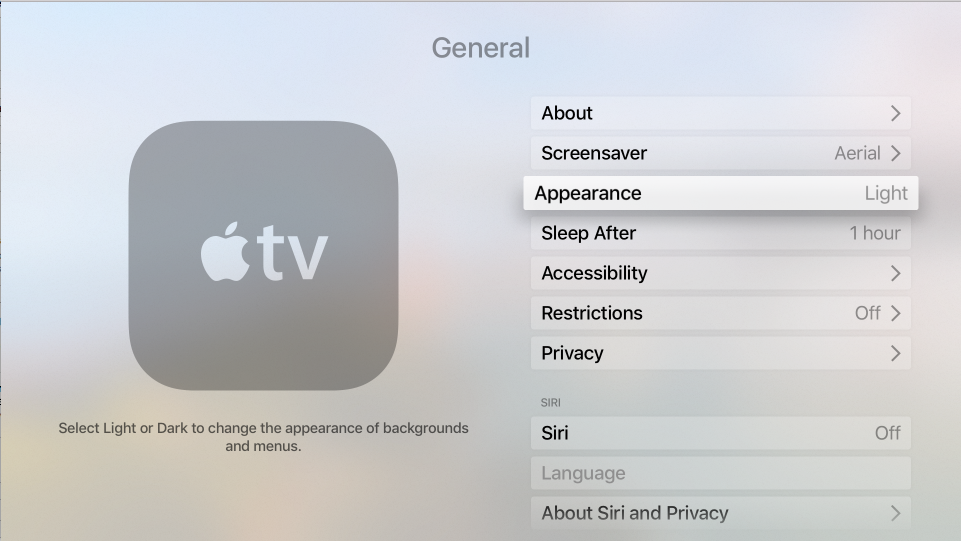](user-interface-styles-images/theme01.png#lightbox)

When the **Dark** theme is selected, all of the User Interface elements will switch to light text on a dark background:

[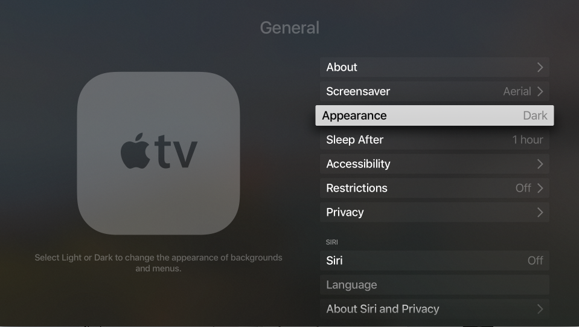](user-interface-styles-images/theme02.png#lightbox)

The user has the option to switch the theme at any time and might do so based on the current activity, where the Apple TV is located or the time of day.

The Light UI Theme is the default theme, and any existing tvOS apps will still use the Light theme, regardless of the user's preferences, unless they are modified for tvOS 10 to take advantage of the Dark theme. A tvOS 10 app also has the ability to override the current theme and always use either the Light or Dark theme for some or all of its UI.

<a name="Adopting-the-Light-and-Dark-Themes"></a>

## Adopting the Light and Dark Themes

To support this feature, Apple has added a new API to the `UITraitCollection` class and a tvOS app must opt-in to support the Dark appearance (via a setting in its `Info.plist` file).

To opt-in to Light and Dark theme support, do the following:

1. In the **Solution Explorer**, double-click the `Info.plist` file to open it for editing.
2. Select the **Source** view (from the bottom of the editor).
3. Add a new key and call it `UIUserInterfaceStyle`:

    [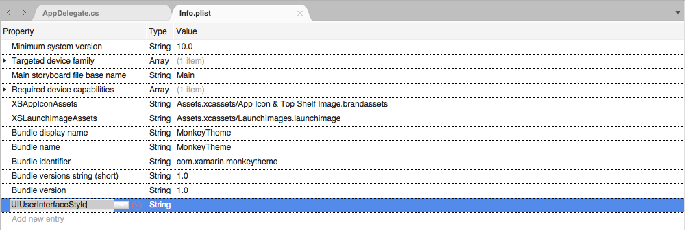](user-interface-styles-images/theme03.png#lightbox)
4. Leave the type set to `String` and enter a value of `Automatic`:

    [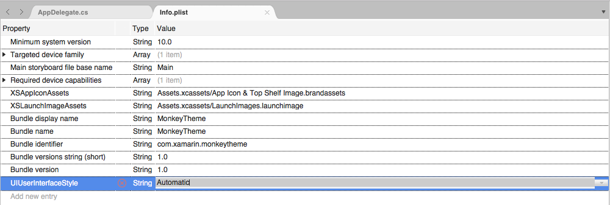](user-interface-styles-images/theme04.png#lightbox)
5. Save the changes to the file.

There are three possible values for the `UIUserInterfaceStyle` key:

- **Light** - Forces the tvOS app's UI to always use the Light theme.
- **Dark** - Forces the tvOS app's UI to always use the Dark theme.
- **Automatic** - Switches between the Light and Dark theme based on the user's preferences in Settings. This is the preferred setting.

<a name="UIKit-Theme-Support"></a>

### UIKit Theme Support

If a tvOS app is using standard, built-in `UIView` based controls, they will automatically respond to the UI theme without any developer intervention.

Additionally, `UILabel` and `UITextView` will automatically change their color based on the select UI theme:

- The text will be black in the Light theme.
- The text will be white in the Dark theme.

If the developer ever changes the text color manually (either in the Storyboard or code), they will be responsible for handling color changes based on the UI theme.

<a name="New-Blur-Effects"></a>

### New Blur Effects

For supporting the Light and Dark themes in a tvOS 10 app, Apple has added two new Blur Effects. These new effects will automatically adjust the blur based on the UI theme that the user has selected as follows:

- `UIBlurEffectStyleRegular` - Uses a light blur in the Light theme and a dark blur in the Dark theme.
- `UIBlurEffectStyleProminent` - Uses an extra-light blur in the Light theme and an extra-dark blur in the Dark theme.

<a name="Working-with-Trait-Collections"></a>

## Working with Trait Collections

The new `UserInterfaceStyle` property of the `UITraitCollection` class can be used to get the currently selected UI theme and will be a `UIUserInterfaceStyle` enum of one of the following values:

- **Light** - The Light UI theme is selected.
- **Dark** - The Dark UI theme is selected.
- **Unspecified** - The View has not been displayed to screen yet, so the current UI theme is unknown.

Additionally, Trait Collections have the following features in tvOS 10:

- The Appearance proxy can be customized based on the `UserInterfaceStyle` of a given `UITraitCollection` to change things such as images or item colors based on theme.
- A tvOS app can handle Trait Collection changes by overriding the `TraitCollectionDidChange` method of a `UIView` or `UIViewController` class.

> [!IMPORTANT]
> The Xamarin.tvOS Early Preview for tvOS 10 doesn't fully support `UIUserInterfaceStyle` for `UITraitCollection` yet. Full support will be added in a future release.

<a name="Customizing-Appearance-Based-on-Theme"></a>

### Customizing Appearance Based on Theme

For User Interface elements that support the Appearance proxy, their appearance can be adjusted based on the UI Theme of their Trait Collection. So, for a given UI element, the developer can specify one color for the Light theme and another color for the Dark theme.

```csharp
button.SetTitleColor (UIColor.Red, UIControlState.Normal);

// TODO - Pseudocode because this isn't currently supported in the preview bindings.
var light = new UITraitCollection(UIUserInterfaceStyle.Light);
var dark = new UITraitCollection(UIUserInterfaceStyle.Dark);

button.ForTraitCollection(light).SetTitleColor (UIColor.Red, UIControlState.Normal);
button.ForTraitCollection(dark).SetTitleColor (UIColor.White, UIControlState.Normal);
```

> [!IMPORTANT]
> Unfortunately, the Xamarin.tvOS Preview for tvOS 10 doesn't fully support `UIUserInterfaceStyle` for `UITraitCollection`, so this type of customization is not yet available. Full support will be added in a future release.

<a name="Responding-to-Theme-Changes-Directly"></a>

### Responding to Theme Changes Directly

In the developer requires deeper control over the appearance of a UI Element based on the UI theme selected, they can override the `TraitCollectionDidChange` method of a `UIView` or `UIViewController` class.

For example:

```csharp
public override void TraitCollectionDidChange (UITraitCollection previousTraitCollection)
{
    base.TraitCollectionDidChange (previousTraitCollection);

    // Take action based on the Light or Dark theme
    ...
}
```

<a name="Responding-to-Theme-Changes-Directly"></a>

### Overriding a Trait Collection

Based on the design of a tvOS app, there might be times when the developer needs to override the Trait Collection of a given User Interface element and have it always use a specific UI theme.

This can be done using the `SetOverrideTraitCollection` method on the `UIViewController` class. For example:

```csharp
// Create new trait and configure it
var trait = new UITraitCollection ();
...

// Apply new trait collection
SetOverrideTraitCollection (trait, this);
```

For more information, please see the [Traits](~/ios/user-interface/storyboards/unified-storyboards.md) and [Overriding Traits](~/ios/user-interface/storyboards/unified-storyboards.md) sections of our [Introduction to Unified Storyboards](~/ios/user-interface/storyboards/unified-storyboards.md) documentation.

<a name="Trait-Collections-and-Storyboards"></a>

### Trait Collections and Storyboards

In tvOS 10, an app's Storyboard can be set to respond to Trait Collections and many UI elements can be made Light and Dark Theme aware. The current Xamarin.tvOS Early Preview for tvOS 10 doesn't support this feature in the Interface Designer yet, so the Storyboard will need to be edited in Xcode's Interface Builder as a workaround.

To enable Trait Collection support, do the following:

1. Right-click on the Storyboard file in the **Solution Explorer** and select **Open With** > **Xcode Interface Builder**:

    [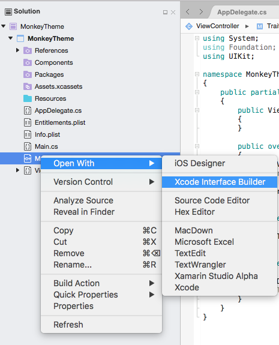](user-interface-styles-images/theme05.png#lightbox)
2. To enable Trait Collection support, switch to the **File Inspector** and check the **Use Trait Variations** property in the **Interface Builder Document** section:

    [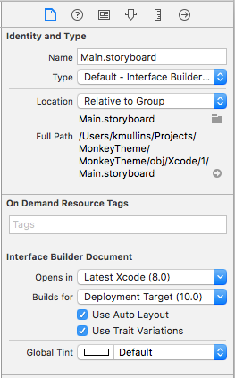](user-interface-styles-images/theme06.png#lightbox)
3. Confirm the change to use Trait Variations:

    [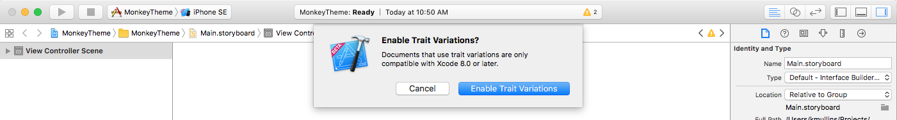](user-interface-styles-images/theme07.png#lightbox)
4. Save the changes to the Storyboard file.

Apple has added the following abilities when editing tvOS Storyboards in Interface Builder:

- The developer can specify different variations of User Interface elements based on UI theme in the **Attribute Inspector**:

  - Several properties now have a **+** beside them which can be clicked to add a UI theme specific version:

    [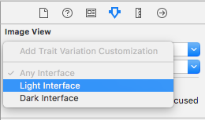](user-interface-styles-images/theme08.png#lightbox)

  - The developer can specify a new property or click the **x** button to remove it:

    [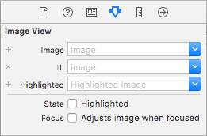](user-interface-styles-images/theme09.png#lightbox)
- The developer can preview a UI design in either the Light or Dark theme from within Interface Builder:

  - The bottom of the Design Surface allows the developer to switch the current UI theme:

    [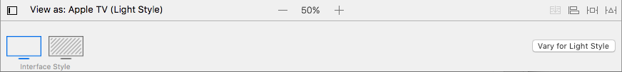](user-interface-styles-images/theme10.png#lightbox)

  - The new theme will be displayed in Interface Builder and any Trait Collection specific adjustments will be displayed:

    [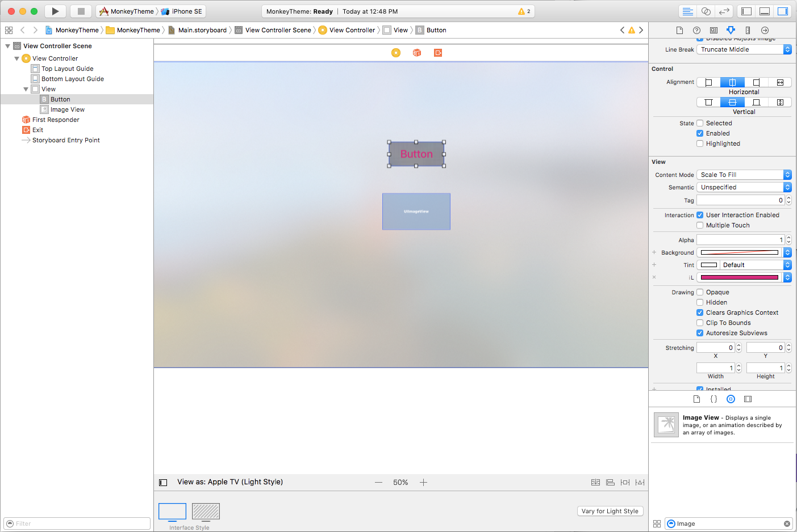](user-interface-styles-images/theme11.png#lightbox)

Additionally, the tvOS Simulator now has a keyboard shortcut to allow the developer to quickly switch between the Light and Dark themes when debugging a tvOS app. Use the **Command-Shift-D** keyboard sequence to toggle between Light and Dark.

<a name="Summary"></a>

## Summary

This article has covered the Light and Dark UI Themes that Apple has added to tvOS 10 and how to implement them in a Xamarin.tvOS app.

## Related Links

- [tvOS Samples](/samples/browse/?products=xamarin&term=Xamarin.iOS%2btvOS)
- [What's new in tvOS 10](https://developer.apple.com/library/prerelease/content/releasenotes/General/WhatsNewinTVOS/Articles/tvOS10.html#//apple_ref/doc/uid/TP40017259-SW1)