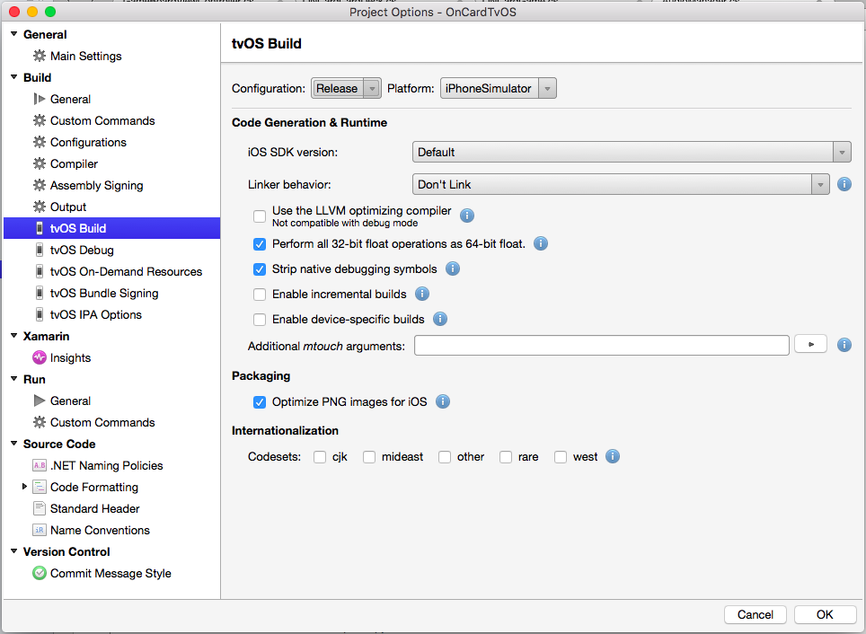
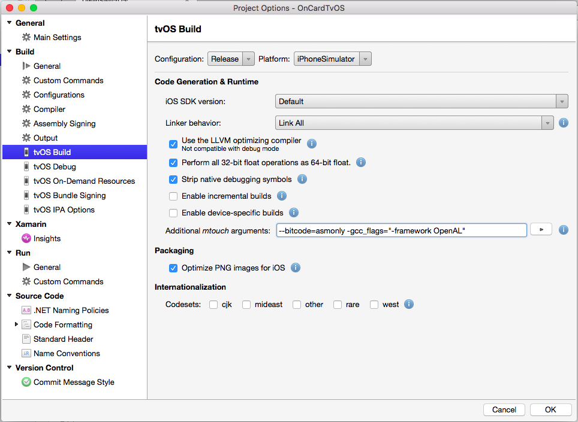

# Troubleshooting tvOS apps built with Xamarin

_This article covers know issues you might encounter while working with Xamarin's tvOS support._

<a name="Known-Issues"></a>

## Known Issues

The current release of Xamarin's tvOS support has the following known issues:

- **Mono Framework** – Mono 4.3 Cryptography.ProtectedData fails to decrypt data from Mono 4.2. As a result, NuGet packages will fail to restore with the error `Data unprotection failed` when a protected NuGet source is configured.
  - **Workaround** – In Visual Studio for Mac you will need to add back any NuGet package sources that use password authentication before re-attempting to restore the packages.
- **Visual Studio for Mac w/ F# Add-in** – Error when creating an F# Android template on Windows. This should still function correctly on Mac.
- **Xamarin.Mac** – When running the Xamarin.Mac unified template project with the target Framework set to `Unsupported`, the popup `Could not connect to the debugger` may appear.
  - **Potential Workaround** – Downgrade the Mono framework version available in our Stable channel.
- **Xamarin Visual Studio & Xamarin.iOS** – When deploying WatchKit applications in Visual studio, the error `The file ‘bin\iPhoneSimulator\Debug\WatchKitApp1WatchKitApp.app\WatchKitApp1WatchKitApp’ does not exist` may appear.

Please report any bugs you find on [GitHub](https://github.com/xamarin/xamarin-macios/issues/new).

## Troubleshooting

The following sections list some known issues that can occur when using tvOS 9 with Xamarin.tvOS and the solution to those issues:

### Invalid Executable - The executable does not contain bitcode

When attempting to submit a Xamarin.tvOS app to the Apple TV App Store, you might get an error message in the form _"Invalid Executable - The executable does not contain bitcode"_.

To solve this issue, do the following:

1. In Visual Studio for Mac, right-click on your Xamarin.tvOS Project File in the **Solution Explorer** and select **Options**.
2. Select **tvOS Build** and ensure that you are on the **Release** configuration: 

    [](troubleshooting-images/ts01.png#lightbox)
3. Add `--bitcode=asmonly` to the **Additional mtouch arguments** field and click the **OK** button.
4. Rebuild your app in the **Release** configuration.

### Verifying that your tvOS App Contains Bitcode

To verify that your Xamarin.tvOS App build contains Bitcode, open the Terminal app and enter the following:

```csharp
otool -l /path/to/your/tv.app/tv
```

In the output, look for the following:

```csharp
Section
  sectname __bundle
   segname __LLVM
      addr 0x0000000100001000
      size 0x000000000000124f
    offset 4096
     align 2^0 (1)
    reloff 0
    nreloc 0
     flags 0x00000000
 reserved1 0
 reserved2 0
```

`addr` and `size` will be different but other fields should be identical.

You will need to make sure that any third party static (`.a`) libraries you're using were built against tvOS libraries (not iOS libraries) and that they also includes bitcode information.

For apps or libraries that include valid bitcode the `size` will be greater than one. There are some situations where a library can have the bitcode marker, yet not contain valid bitcode. For example:

**Invalid Bitcode**

```csharp
 $ otool -arch arm64 libLibrary.a | grep __bitcode -A 3
   sect name __bitcode
   segname __LLVM
      add 0x0000000000000670
      size 0x0000000000000001
```

**Valid Bitcode** 

```csharp
$ otool -l -arch arm64 libDownloadableAgent-tvos.a |grep __bitcode -A 3
   sectname __bitcode
   segname __LLVM
      addr 0x000000000001d2d0
      size 0x0000000000045440
```

Note the difference in `size` between the two libraries in the listed example runs above. The library must be generated from a Xcode archive build with bitcode enabled (Xcode setting `ENABLE_BITCODE`) as a solution to this size problem.

### Apps that only contain the arm64 slice must also have “arm64” in the list of UIRequiredDeviceCapabilities in Info.plist

When submitting an app to the Apple TV App Store for publication, you might get an error in the form:

_"Apps that only contain the arm64 slice must also have “arm64” in the list of UIRequiredDeviceCapabilities in Info.plist"_

If this occurs, edit your `Info.plist` file and ensure that it has the  following keys:

```xml
<key>UIRequiredDeviceCapabilities</key>
<array>
  <string>arm64</string>
</array>
```

Recompile your app for release and resubmit to iTunes Connect.

### Task "MTouch" execution -- FAILED

If you are using a 3rd party library (such as MonoGame) and your release compile failed with a long series of error messages ending in `Task "MTouch" execution -- FAILED`, try adding `-gcc_flags="-framework OpenAL"` to your **Additional touch arguments**:

[](troubleshooting-images/mtouch01.png#lightbox)

You should also include `--bitcode=asmonly` in the **Additional touch arguments**, have your linker options set to **Link All** and do a clean compile.

### ITMS-90471 error. The Large icon is missing

If you get a message in the form "ITMS-90471 error. The Large icon is missing" while attempting to submit a Xamarin.tvOS app to the Apple TV App Store for release, please check the following:

1. Ensure that you have included the Large Icon assets in your `Assets.car` file that you created using the [App Icons](~/ios/tvos/app-fundamentals/icons-images.md#App-Icons) documentation.
2. Ensure that you included the `Assets.car` file from the [Working with Icons and Images](~/ios/tvos/app-fundamentals/icons-images.md) documentation in your final application bundle.

### Invalid bundle – An app that supports game controllers must also support the Apple TV remote

or 

### Invalid bundle – Apple TV apps with the GameController framework must include the GCSupportedGameControllers key in the app’s Info.plist

Game Controllers can be used to enhance gameplay and provide a sense of immersion in a game. They can also be used to control the standard Apple TV interface so the user doesn't have to switch between the remote and the controller.

If you are submitting a Xamarin.tvOS app with Game Controller support to the Apple TV App store and you are getting an error message in the form of:

_We have discovered one or more issues with your recent delivery for “app name”. Your delivery was successful, but you may wish to correct the following issues in your next delivery:_

_Invalid bundle – An app that supports game controllers must also support the Apple TV remote._

or 

_Invalid bundle – Apple TV apps with the GameController framework must include the GCSupportedGameControllers key in the app’s Info.plist._

The solution is to add support for the Siri Remote (`GCMicroGamepad`) to your app's `Info.plist` file. The Micro Game Controller profile has been added by Apple to target the Siri Remote. For example, include the following keys:

```xml
<key>GCSupportedGameControllers</key>  
  <array>  
    <dict>  
      <key>ProfileName</key>  
      <string>ExtendedGamepad</string>  
    </dict>  
    <dict>  
      <key>ProfileName</key>  
      <string>MicroGamepad</string>  
    </dict>  
  </array>  
<key>GCSupportsControllerUserInteraction</key>  
<true/>
```

> [!IMPORTANT]
> Bluetooth Game Controllers are an optional purchase that end users might make, your app cannot force the user to purchase one. If your app supports Game Controllers it must also support the Siri Remote so that the game is useable by all Apple TV users.

For more information, please see our [Working with Game Controllers](~/ios/tvos/platform/remote-bluetooth.md#Working-with-Game-Controllers) section of our [Siri Remote and Bluetooth Controllers](~/ios/tvos/platform/remote-bluetooth.md) documentation.

### Incompatible target framework: .NetPortable, Version=v4.5, Profile=Profile78

When trying to include a Portable Class Library (PCL) into a Xamarin.tvOS project you might get a message in to form:

_Incompatible target framework: .NetPortable, Version=v4.5, Profile=Profile78_

To solve this issue, add an XML file called `Xamarin.TVOS.xml` with the following content:

```xml
<Framework Identifier="Xamarin.TVOS" MinimumVersion="1.0" Profile="*" DisplayName="Xamarin.TVOS"/>
```

To the following path:

```csharp
/Library/Frameworks/Mono.framework/Versions/Current/lib/mono/xbuild-frameworks/.NETPortable/v4.5/Profile/Profile259/SupportedFrameworks/

```

Note that the profile number in the path must match the profile number of the PCL.

With this file in place, you should be able to successfully add the PCL file to the Xamarin.tvOS project.

## Related Links

- [tvOS Samples](/samples/browse/?products=xamarin&term=Xamarin.iOS%2btvOS)
- [tvOS](https://developer.apple.com/tvos/)
- [tvOS Human Interface Guides](https://developer.apple.com/design/human-interface-guidelines/designing-for-tvos)
- [App Programming Guide for tvOS](https://developer.apple.com/library/prerelease/tvos/documentation/General/Conceptual/AppleTV_PG/)