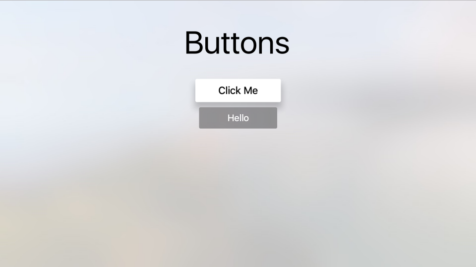
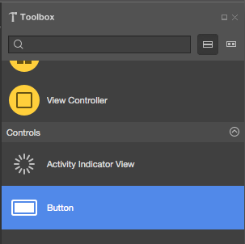
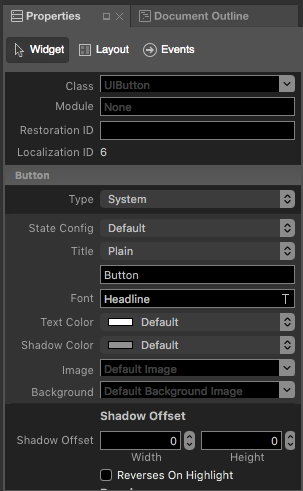
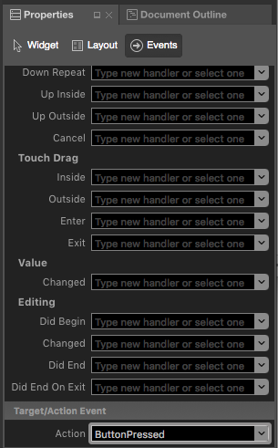
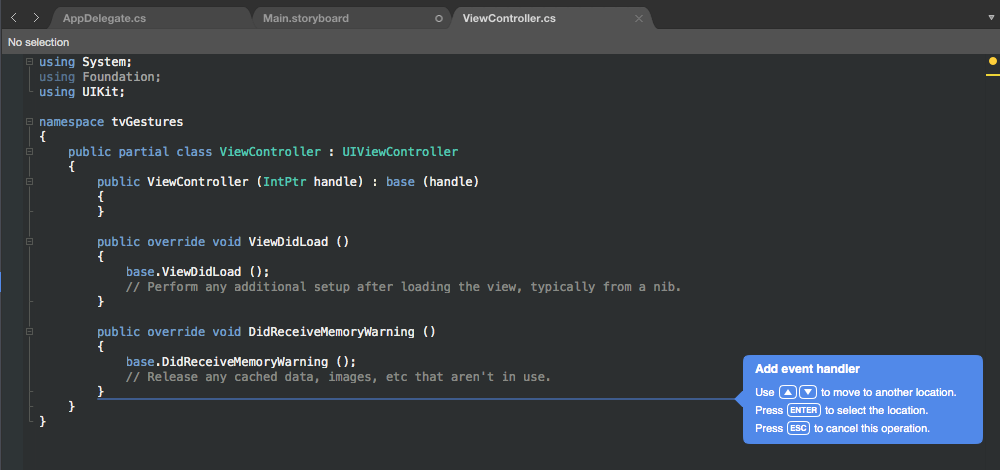
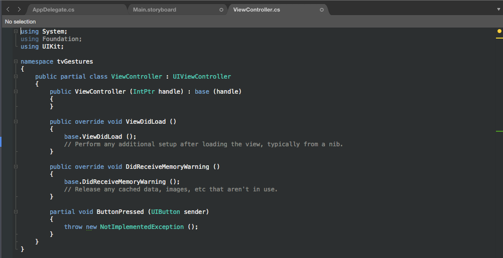
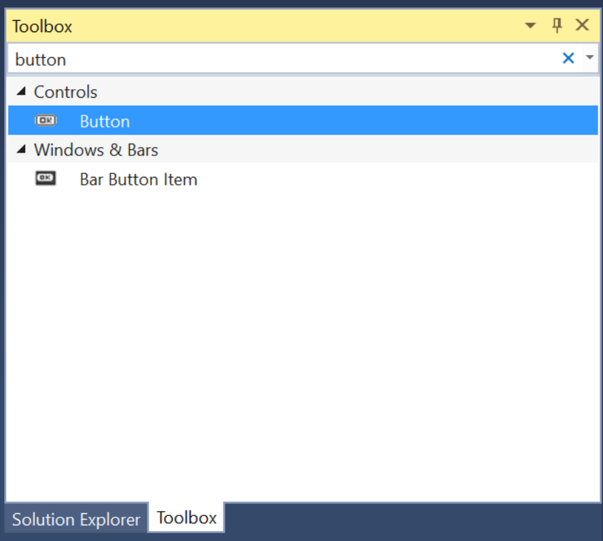
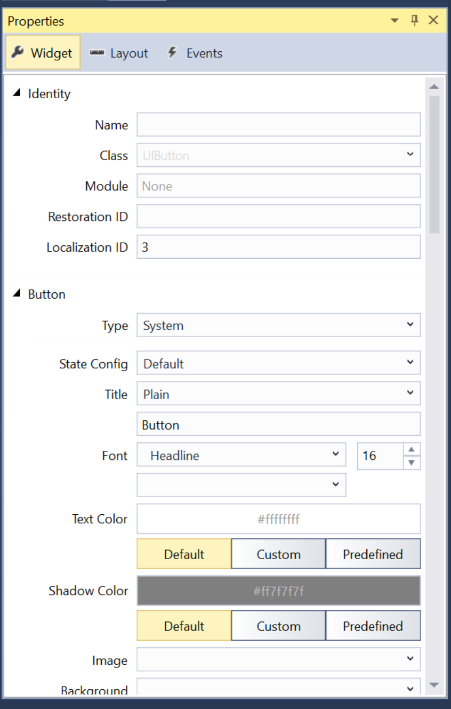
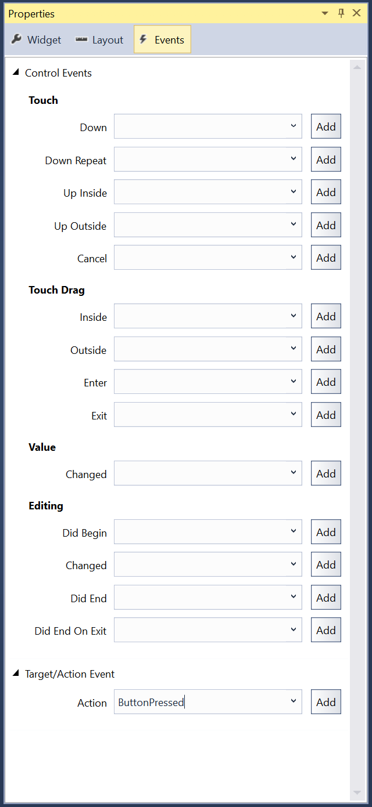

# Working with tvOS Buttons in Xamarin

> [!WARNING]
> The iOS Designer was deprecated in Visual Studio 2019 version 16.8 and Visual Studio 2019 for Mac version 8.8, and 
> removed in Visual Studio 2019 version 16.9 and Visual Studio for Mac version 8.9.
> The recommended way to build iOS user interfaces is directly on a Mac running Xcode's Interface Builder. For more information, see [Designing user interfaces with Xcode](~/ios/user-interface/storyboards/index.md). 

Use an instance of the `UIButton` class to create a focusable, selectable button in a tvOS window. When the user selects a button, it sends an Action message to the target object allow your Xamarin.tvOS app respond to the user's input.

[](buttons-images/buttons01.png#lightbox)

For more information on working with Focus and navigating with the Siri Remote, please see our [Working with Navigation and Focus](~/ios/tvos/app-fundamentals/navigation-focus.md) and [Siri Remote and Bluetooth Controllers](~/ios/tvos/platform/remote-bluetooth.md) documentation.

<a name="About-Buttons"></a>

## About Buttons

In tvOS, Buttons are used for app-specific actions and may contain a title, a icon or both. As the user navigates the app's User Interface using the [Siri Remote](~/ios/tvos/platform/remote-bluetooth.md#The-Siri-Remote), Focus shifts to the given Button making it change text and background colors. A shadow is also applied to the Button adding a 3D effect making it appear to rise above the rest of the User Interface.

[](buttons-images/buttons01.png#lightbox)

Apple has the following suggestions for working with Buttons:

- **Use Either a Title or an Icon** - While the both an icon and a title can be included in a Button, space is limited so try not to combine both.
- **Clearly Mark Destructive Buttons** - If the Button performs a destructive action (such as deleting a file), clearly mark it as such using text and/or icon. Destructive actions should always present an [Alert](~/ios/tvos/user-interface/alerts.md) asking the user to confine the action.
- **Don't Use Back Buttons** - The Menu button on the Siri Remote is used to return to the previous screen. The one exception to this rule is for In-App Purchases or destructive actions where a **Cancel** button should be displayed.

For more information on working with Focus and Navigation, please see our [Working with Navigation and Focus](~/ios/tvos/app-fundamentals/navigation-focus.md) documentation.

<a name="Button-Icons"></a>

### Button Icons

Apple suggests that you use simple, highly recognizable images for your Button icons. Overly complex icons are hard to recognize on a TV screen across the room on a couch, so try to use the simplest representation possible to get the idea across. Whenever possible, use standard, well-know images for icons (such as a magnifying glass for search).

<a name="Button-Titles"></a>

### Button Titles

Apple has the following suggestions when creating the titles for your Buttons:

- **Show Descriptive Text Below Icons Buttons** - Where possible, place clear, descriptive text below icon only Buttons to further get the Button's purpose across.
- **Use Verbs or Verb Phrases for the Title** - Clearly state the action that will take place when the user clicks the Button.
- **Use Title-Style Capitalization** - With the exception of articles, conjunctions or prepositions (four letters or less), every word of the Button's title should be capitalized.
- **Use a Short, To-The-Point Title** - Use the shortest possible verbiage to describe the Button's action.

<a name="Buttons-and-Storyboards"></a>

## Buttons and Storyboards

The easiest way to work with buttons in a Xamarin.tvOS app is to add them to the app's UI using the Xamarin Designer for iOS.

# [Visual Studio for Mac](#tab/macos)

1. In the **Solution Explorer**, double-click the `Main.storyboard` file and open it for editing.
1. Drag a **Button** from the **Library** and drop it on the View: 

    [](buttons-images/storyboard01.png#lightbox)
1. In the **Properties Explorer**, you can adjust several properties of the button such as its **Title** and **Text Color**: 

    [](buttons-images/storyboard02.png#lightbox)
1. Next, switch to the **Events Tab** and wire-up an **Event** from the **Button** and call it `ButtonPressed`: 

    [](buttons-images/storyboard03.png#lightbox)
1. You will be automatically switched to the `ViewController.cs` view where you can place the new Action in your code using the **Up** and **Down** arrow keys: 

    [](buttons-images/storyboard04.png#lightbox)
1. Press the **Enter** to select the location: 

    [](buttons-images/storyboard05.png#lightbox)
1. Save the changes to all files.

# [Visual Studio](#tab/windows)

1. In the **Solution Explorer**, double-click the `Main.storyboard` file and open it for editing.
1. Drag a **Button** from the **Library** and drop it on the View: 

    [](buttons-images/storyboard01vs.png#lightbox)
1. In the **Properties Explorer**, you can adjust several properties of the button such as its **Title** and **Text Color**: 

    [](buttons-images/storyboard02vs.png#lightbox)
1. Next, switch to the **Events Tab** and wire-up an **Event** from the **Button** and call it `ButtonPressed`: 

    [](buttons-images/storyboard03vs.png#lightbox)
1. Save the changes to all files.

Edit your View Controller (example `ViewController.cs`) file and add the following code to handle the button being selected:

```

using System;
using UIKit;

namespace tvRemote
{
    public partial class ViewController : UIViewController
    {
        ...

        partial void ButtonPressed (UIButton sender) {
            // Handle click here
            ...
        }
    }
}

```

-----

As long as a button's `Enabled` property is `true` and it is not covered by another control or view, it can be made the in-focus item using the Siri Remote. If the user selects the button and clicks the Touch Surface, the `ButtonPressed` action defined above would be executed.

> [!IMPORTANT]
> While it is possible to assign actions such as `TouchUpInside` to a `UIButton` when creating an **Event Handler**, it will never be called because Apple TV doesn't have a touch screen or support touch events. You should always use the default **Action Type** when creating **Actions** for tvOS user interface elements.

For more information on working with Storyboards, please see our [Hello, tvOS Quick Start Guide](~/ios/tvos/get-started/hello-tvos.md).

<a name="Buttons-and-Code"></a>

## Buttons and Code

Optionally, a `UIButton` can be created in C# code and added to the tvOS app's view. For example:

```csharp
var button = new UIButton(UIButtonType.System);
button.Frame = new CGRect (25, 25, 300, 150);
button.SetTitle ("Hello", UIControlState.Normal);
button.AllEvents += (sender, e) => {
    // Do something when the button is clicked
    ...
};
View.AddSubview (button);
```

When you create a new `UIButton` in code, you specify its `UIButtonType` as one of the following:

- **System** - This is the standard type of button presented by tvOS and is the type that you will use most often.
- **DetailDisclosure** - Presents a "turn down" type of button used to hide or show detailed information.
- **InfoDark** - A dark detailed info button displayed an "i" in a circle.
- **InfoLight** - A light detailed info button displayed an "i" in a circle.
- **AddContact** - Display the button as an Add Contact button.
- **Custom** - Allows you to customize several traits of the button.

Next, you define the on-screen size and location of the button. Example:

```csharp
button.Frame = new CGRect (25, 25, 300, 150);
```

Then, set the title for the button. `UIButtons` are different than most `UIKit` controls in that they have a State so you can't just simply change the title, you have to change it for a given `UIControlState`. For example:

```csharp
button.SetTitle ("Hello", UIControlState.Normal);
```

Next, use the `AllEvents` event to see when the user has clicked the button. Example:

```csharp
button.AllEvents += (sender, e) => {
    // Do something when the button is clicked
    ...
};
```

Finally, you add the button to the view to display it:

```csharp
View.AddSubview (button);
```

> [!IMPORTANT]
> While it is possible to assign actions such as `TouchUpInside` to a `UIButton`, it will never be called because Apple TV doesn't have a touch screen or support touch events. You should always use events such as **AllEvents** or **PrimaryActionTriggered**.

<a name="Styling-a-Button"></a>

## Styling a Button

tvOS provides several properties of a `UIButton` that can be used to provide its title and style it with things like background color and images.

<a name="Button-Titles"></a>

### Button Titles

As we saw above, `UIButtons` are different than most `UIKit` controls in that they have a State so you can't just simply change the title, you have to change it for a given `UIControlState`. For example:

```csharp
button.SetTitle ("Hello", UIControlState.Normal);
```

You can set the title color for the button using the `SetTitleColor` method. For example:

```csharp
button.SetTitleColor (UIColor.White, UIControlState.Normal);
```

And you can adjust the title's shadow using the `SetTitleShadowColor`. For example:

```csharp
button.SetTitleShadowColor(UIColor.Black, UIControlState.Normal);
```

You can set the title shadow to change from *Engraved* to *Embossed* when the button is highlighted using the following code:

```csharp
button.ReverseTitleShadowWhenHighlighted = true;
```

Additionally, you can use attributed text as the button's title. For example:

```csharp
var normalAttributedTitle = new NSAttributedString (buttonTitle, foregroundColor: UIColor.Blue, strikethroughStyle: NSUnderlineStyle.Single);
myButton.SetAttributedTitle (normalAttributedTitle, UIControlState.Normal);

var highlightedAttributedTitle = new NSAttributedString (buttonTitle, foregroundColor: UIColor.Green, strikethroughStyle: NSUnderlineStyle.Thick);
myButton.SetAttributedTitle (highlightedAttributedTitle, UIControlState.Highlighted);
```

### Button Images

A `UIButton` can have an image attached to it and can use an image as its background.

To set the background image of a button for a given `UIControlState`, use the following code:

```csharp
button.SetBackgroundImage(UIImage.FromFile("my image.png"), UIControlState.Normal);
```

Set the `AdjustsImageWhenHiglighted` property to `true` to draw the image lighter when the button is highlighted (this is the default). Set the `AdjustsImageWhenDisabled` property to `true` to draw the image darker when the button is disabled (again, this is the default).

To set the image displayed on the button, use the following code:

```csharp
button.SetImage(UIImage.FromFile("my image.png"), UIControlState.Normal);
```

Use the `TintColor` property to set a color tint that is applied to both the title and the button's image. For buttons of the `Custom` type, this property has no effect, you must implement the `TintColor` behavior yourself.

<a name="Summary"></a>

## Summary

This article has covered designing and working with buttons inside of a Xamarin.tvOS app. It showed how to work with buttons in the iOS Designer and how to create buttons in C# code. Finally, it showed how to modify a button's title and change its style and appearance.

## Related Links

- [tvOS Samples](/samples/browse/?products=xamarin&term=Xamarin.iOS%2btvOS)
- [tvOS](https://developer.apple.com/tvos/)
- [tvOS Human Interface Guides](https://developer.apple.com/design/human-interface-guidelines/designing-for-tvos)
- [App Programming Guide for tvOS](https://developer.apple.com/library/prerelease/tvos/documentation/General/Conceptual/AppleTV_PG/)