# Working with tvOS Collection Views in Xamarin

Collection Views allow for a group of content to be displayed using arbitrary layouts. Using built-in support, they allow for the easy creation grid-like or linear layouts, while also supporting custom layouts.

[](collection-views-images/collection01.png#lightbox)

The Collection View maintains a collection of items using both a Delegate  and a Data Source to provide user interaction and the content of the collection. Since the Collection View is based on a Layout Subsystem that is independent of the view itself, providing a different Layout can easily change the presentation of the Collection View's data on-the-fly.

<a name="About-Collection-Views"></a>

## About Collection Views

As stated above, a Collection View (`UICollectionView`) manages an ordered collection of items and presents those items with customizable layouts. Collection Views work in a similar fashion to Table Views (`UITableView`), except they can use layouts to present items in more than just a single column.

When using a Collection View in tvOS, your app is responsible for providing the data associated to the collection using a Data Source (`UICollectionViewDataSource`). Collection View data can optionally be organized and presented into different groups (Sections).

The Collection View presents the individual items onscreen using a Cell (`UICollectionViewCell`) that provides the presentation of a given piece of information from the collection (like an image and its title).

Optionally, Supplementary Views can be added to the Collection View's presentation to act as Header and Footers for the Sections and Cells. The Collection View's Layout is responsible for defining the placement of these views along with the individual cells.

The Collection View can respond to user interaction using a Delegate (`UICollectionViewDelegate`). This delegate is also responsible for determining if a given cell can get focus, if a cell has been highlighted or if one has been selected. In some cases, the Delegate determines the size of the individual cells.

<a name="Collection-View-Layouts"></a>

## Collection View Layouts

A key feature of a Collection View is its separation between the data it is presenting and its Layout. A Collection View Layout (`UICollectionViewLayout`) is responsible for providing the organization and the location of the cells (and any supplementary views) with in the Collection View's onscreen presentation.

The individual cells are created by the Collection View from its attached Data Source and are then arranged and displayed by the given Collection View Layout.

The Collection View Layout is normally provided when the Collection View is created. However, you can change the Collection View Layout at any time and the onscreen presentation of the Collection View's data will automatically be updated using the new layout provided.

The Collection View Layout provides several methods that can be used to animate the transition between two different layouts (by default no animation is done). Additionally, Collection View Layouts can work with Gesture Recognizers to further animate user interaction that results in a change in layout.

<a name="Creating-Cells-and-Supplementary-Views"></a>

## Creating Cells and Supplementary Views

A Collection View's Data Source is not only responsible for providing the data backing the collection's item, but also the cells that are used to display the content.

Because Collection Views were designed to handle large collections of items, the individual cells can be dequeued and reused to keep from overrunning memory limitations. There are two different methods for dequeueing views:

- `DequeueReusableCell` - Creates or returns a cell of the given type (as specified in the app's Storyboard).
- `DequeueReusableSupplementaryView` - Creates or returns a supplementary view of the given type (as specified in the app's Storyboard).

Before calling either of these methods, you must register the class, Storyboard or `.xib` file used to create the cell's view with the Collection View. For example:

```csharp
public CityCollectionView (IntPtr handle) : base (handle)
{
    // Initialize
    RegisterClassForCell (typeof(CityCollectionViewCell), CityViewDatasource.CardCellId);
    ...
}
```

Where `typeof(CityCollectionViewCell)` provides the class that supports the view and `CityViewDatasource.CardCellId` provides the ID used when the cell (or view) is dequeued.

After the cell is dequeued, you configure it with the data for the item it is representing and return to the Collection View for display.

<a name="About-Collection-View-Controllers"></a>

## About Collection View Controllers

A Collection View Controller (`UICollectionViewController`) is a specialized View Controller (`UIViewController`) that provides the following behavior:

- It is responsible for loading the Collection View from its Storyboard or `.xib` file and instantiating the view. If created in code, it automatically creates an new, unconfigured Collection View.
- Once the Collection View is loaded, the controller attempts to load its Data Source and Delegate from the Storyboard or `.xib` file. If none are available, it sets itself as the source of both.
- Ensures that the data is loaded before the collection view is populated on
first displayed, and reloads and clear the select on each subsequent display.

Additionally, the Collection View Controller provides overridable methods that can be used to manage the lifecycle of the Collection View such as `AwakeFromNib` and `ViewWillDisplay`.

<a name="Collection-Views-and-Storyboards"></a>

## Collection Views and Storyboards

The easiest way to work with a Collection View in your Xamarin.tvOS app, is to add one to its Storyboard. As a quick example, we are going to create a sample app that presents an image, title and a select button. If the user click the select button, a Collection View will be displayed that allow the user to choose a new image. When an image is chosen, the Collection View is closed and the new image and title will be displayed.

Let's do the following:

# [Visual Studio for Mac](#tab/macos)

1. Start a new **Single View tvOS App** in Visual Studio for Mac.
1. In the **Solution Explorer**, double-click the `Main.storyboard` file and open it in the iOS Designer.
1. Add a Image View, a Label and a Button to the existing view and configure them to look like the following: 

    [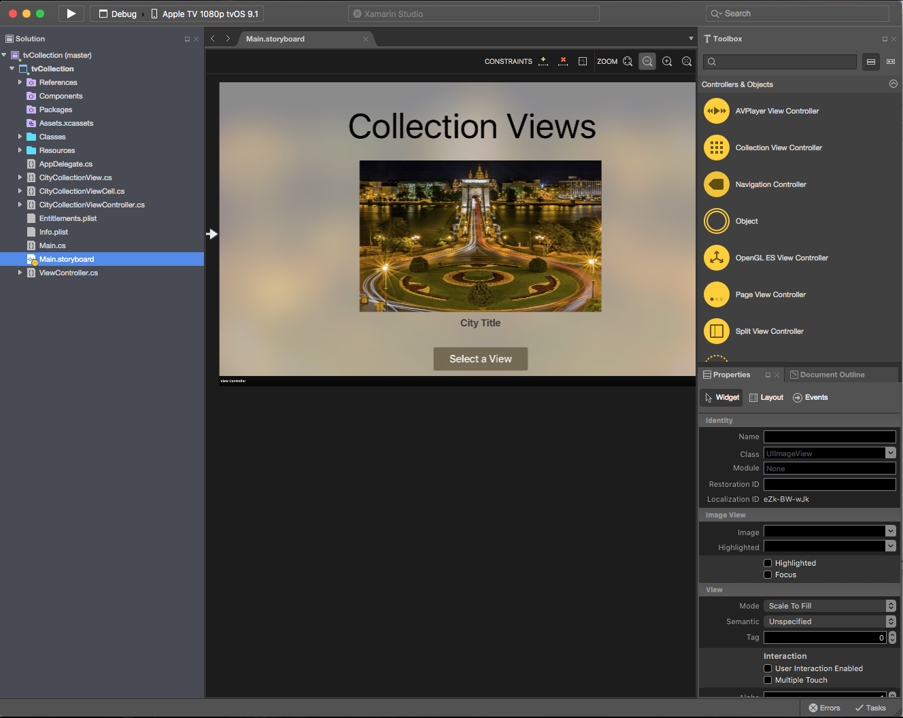](collection-views-images/collection02.png#lightbox)
1. Assign a **Name** to the Image View and the Label in the **Widget Tab** of the **Properties Explorer**. For example: 

    [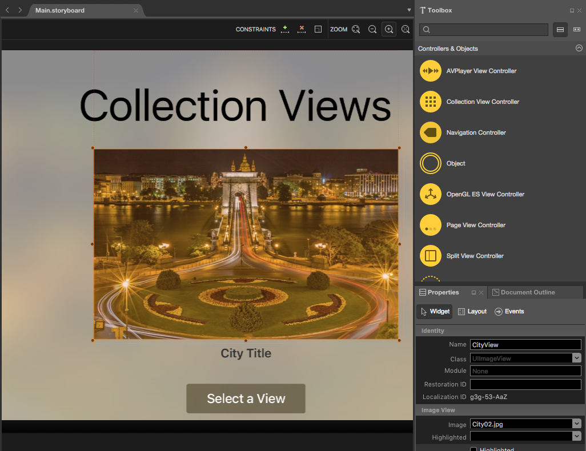](collection-views-images/collection03.png#lightbox)
1. Next, drag a Collection View Controller onto the Storyboard: 

    [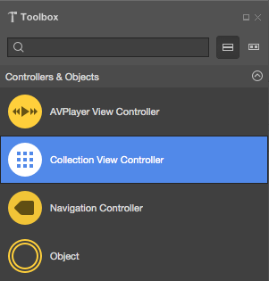](collection-views-images/collection04.png#lightbox)
1. Control-drag from the Button to the Collection View Controller and select **Push** from the popup: 

    [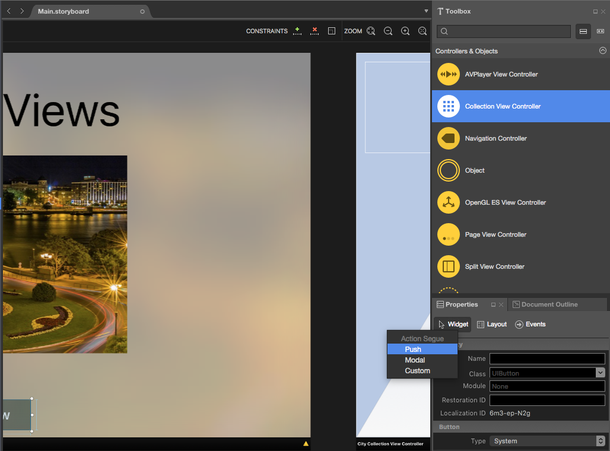](collection-views-images/collection05.png#lightbox)
1. When the app is run, this will make the Collection View be show whenever the user clicks the Button.
1. Select the Collection View and enter the following values in the **Layout Tab** of the **Properties Explorer**: 

    [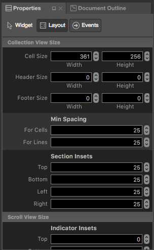](collection-views-images/collection06.png#lightbox)
1. This controls the size of the individual cells and the borders between the cells and the outer edge of the Collection View.
1. Select the Collection View Controller and set its class to `CityCollectionViewController` in the **Widget Tab**: 

    [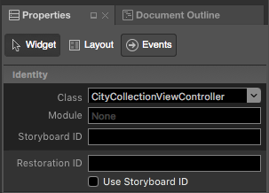](collection-views-images/collection07.png#lightbox)
1. Select the Collection View and set its class to `CityCollectionView` in the **Widget Tab**: 

    [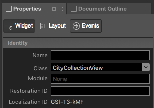](collection-views-images/collection08.png#lightbox)
1. Select the Collection View Cell and set its class to `CityCollectionViewCell` in the **Widget Tab**: 

    [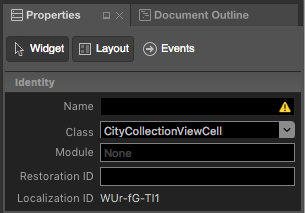](collection-views-images/collection09.png#lightbox)
1. In the **Widget Tab** ensure that the **Layout** is `Flow` and the **Scroll Direction** is `Vertical` for the Collection View: 

    [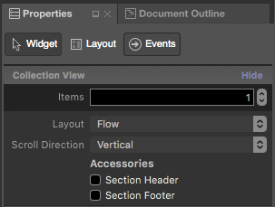](collection-views-images/collection10.png#lightbox)
1. Select the Collection View Cell and set its **Identity** to `CityCell` in the **Widget Tab**: 

    [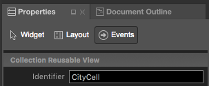](collection-views-images/collection11.png#lightbox)
1. Save your changes.

# [Visual Studio](#tab/windows)

1. Start a new **Single View tvOS App** in Visual Studio.
1. In the **Solution Explorer**, double-click the `Main.storyboard` file and open it in the iOS Designer.
1. Add a Image View, a Label and a Button to the existing view and configure them to look like the following: 

    [](collection-views-images/collection02vs.png#lightbox)
1. Assign a **Name** to the Image View and the Label in the **Widget Tab** of the **Properties Explorer**. For example: 

    [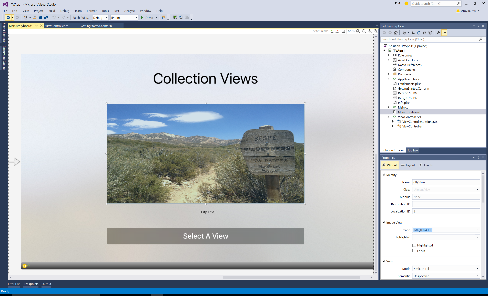](collection-views-images/collection03vs.png#lightbox)
1. Next, drag a Collection View Controller onto the Storyboard: 

    [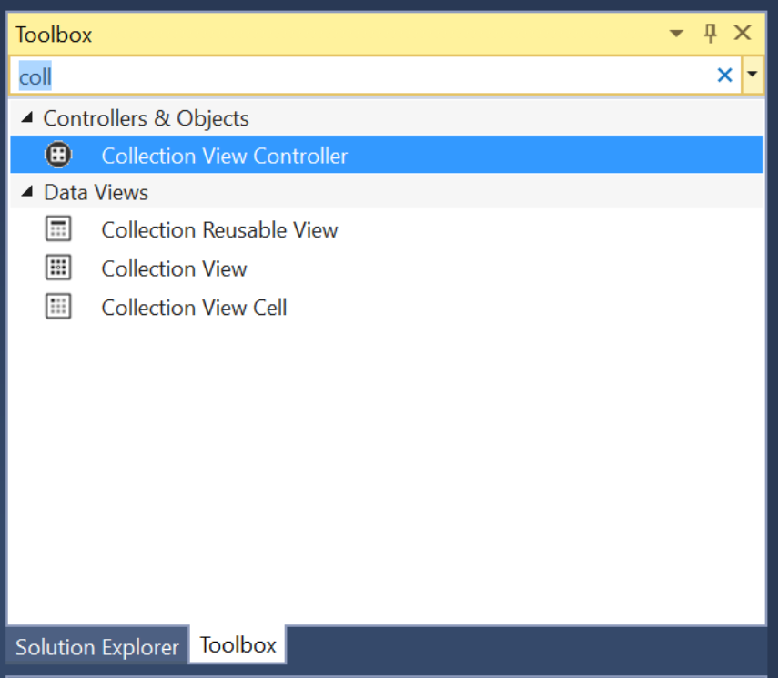](collection-views-images/collection04vs.png#lightbox)
1. Control-drag from the Button to the Collection View Controller and select **Push** from the popup: 

    [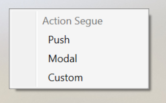](collection-views-images/collection05vs.png#lightbox)
1. When the app is run, this will make the Collection View be show whenever the user clicks the Button.
1. Select the Collection View and in the **Layout Tab** of the **Properties Explorer** enter the **Width** as _361_ and **Height** as _256_ 
1. This controls the size of the individual cells and the borders between the cells and the outer edge of the Collection View.
1. Select the Collection View Controller and set its class to `CityCollectionViewController` in the **Widget Tab**: 

    [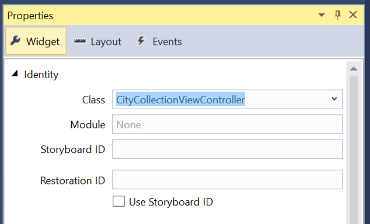](collection-views-images/collection07vs.png#lightbox)
1. Select the Collection View and set its class to `CityCollectionView` in the **Widget Tab**: 

    [](collection-views-images/collection08vs.png#lightbox)
1. Select the Collection View Cell and set its class to `CityCollectionViewCell` in the **Widget Tab**: 

    [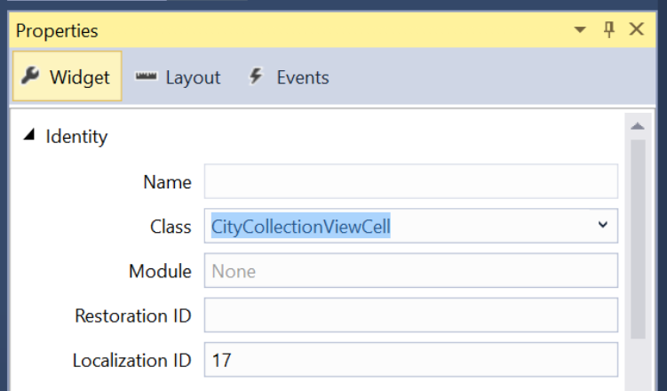](collection-views-images/collection09vs.png#lightbox)
1. In the **Widget Tab** ensure that the **Layout** is `Flow` and the **Scroll Direction** is `Vertical` for the Collection View: 

    [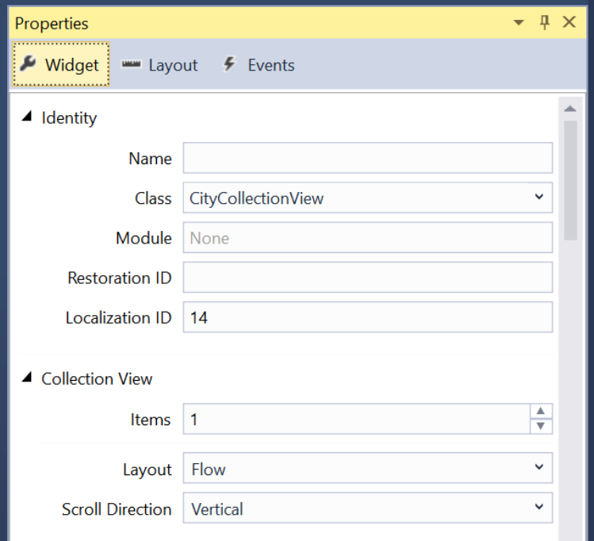](collection-views-images/collection10vs.png#lightbox)
1. Select the Collection View Cell and set its **Identity** to `CityCell` in the **Widget Tab**: 

    [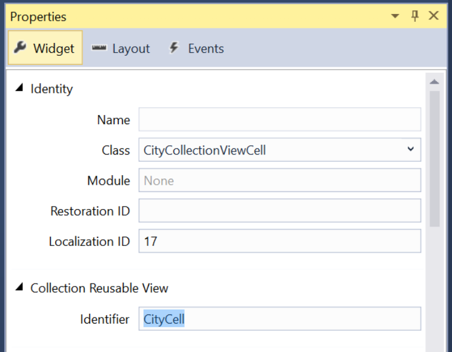](collection-views-images/collection11vs.png#lightbox)
1. Save your changes.

-----

If we had chosen `Custom` for the Collection View's **Layout**, we could have specified a custom layout. Apple provides a built-in `UICollectionViewFlowLayout` and `UICollectionViewDelegateFlowLayout` that can easily present data in a grid-based layout (these are used by the `flow` layout style). 

For more information on working with Storyboards, please see our [Hello, tvOS Quick Start Guide](~/ios/tvos/get-started/hello-tvos.md).

<a name="Providing-Data-for-the-Collection-View"></a>

## Providing Data for the Collection View

Now that we have our Collection View (and Collection View Controller) added to our Storyboard, we need to provide the data for the collection. 

<a name="The-Data-Model"></a>

### The Data Model

First, we are going to create a model for our data that holds the filename for the image to display, the title and a flag for allowing the city to be selected.

Create a `CityInfo` class and make it look like the following:

```csharp
using System;

namespace tvCollection
{
    public class CityInfo
    {
        #region Computed Properties
        public string ImageFilename { get; set; }
        public string Title { get; set; }
        public bool CanSelect{ get; set; }
        #endregion

        #region Constructors
        public CityInfo (string filename, string title, bool canSelect)
        {
            // Initialize
            this.ImageFilename = filename;
            this.Title = title;
            this.CanSelect = canSelect;
        }
        #endregion
    }
}
```

### The Collection View Cell

Now we need to define how the data will be presented for each cell. Edit the `CityCollectionViewCell.cs` file (created for you automatically from your Storyboard file) and make it look like the following:

```csharp
using System;
using Foundation;
using UIKit;
using CoreGraphics;

namespace tvCollection
{
    public partial class CityCollectionViewCell : UICollectionViewCell
    {
        #region Private Variables
        private CityInfo _city;
        #endregion

        #region Computed Properties
        public UIImageView CityView { get ; set; }
        public UILabel CityTitle { get; set; }

        public CityInfo City {
            get { return _city; }
            set {
                _city = value;
                CityView.Image = UIImage.FromFile (City.ImageFilename);
                CityView.Alpha = (City.CanSelect) ? 1.0f : 0.5f;
                CityTitle.Text = City.Title;
            }
        }
        #endregion

        #region Constructors
        public CityCollectionViewCell (IntPtr handle) : base (handle)
        {
            // Initialize
            CityView = new UIImageView(new CGRect(22, 19, 320, 171));
            CityView.AdjustsImageWhenAncestorFocused = true;
            AddSubview (CityView);

            CityTitle = new UILabel (new CGRect (22, 209, 320, 21)) {
                TextAlignment = UITextAlignment.Center,
                TextColor = UIColor.White,
                Alpha = 0.0f
            };
            AddSubview (CityTitle);
        }
        #endregion
    

    }
}
```

For our tvOS app, we will be displaying an image and an optional title. If the given city cannot be selected, we are dimming the image view using the following code:

```csharp
CityView.Alpha = (City.CanSelect) ? 1.0f : 0.5f;
```

When the cell containing the image is brought in-focus by the user, we want to use the built-in Parallax Effect on it be setting the following property:

```csharp
CityView.AdjustsImageWhenAncestorFocused = true;
```

For more information on Navigation and Focus, please see our [Working with Navigation and Focus](~/ios/tvos/app-fundamentals/navigation-focus.md) and [Siri Remote and Bluetooth Controllers](~/ios/tvos/platform/remote-bluetooth.md) documentation.

<a name="The-Collection-View-Data-Provider"></a>

### The Collection View Data Provider

With our data model created and our Cell layout defined, let's create a Data Source for our Collection View. The Data Source will be responsible for not only providing the backing data, but also dequeueing the cells to display the individual cells onscreen.

Create a `CityViewDatasource` class and make it look like the following:

```csharp
using System;
using System.Collections.Generic;
using UIKit;
using Foundation;
using CoreGraphics;
using ObjCRuntime;

namespace tvCollection
{
    public class CityViewDatasource : UICollectionViewDataSource
    {
        #region Application Access
        public static AppDelegate App {
            get { return (AppDelegate)UIApplication.SharedApplication.Delegate; }
        }
        #endregion

        #region Static Constants
        public static NSString CardCellId = new NSString ("CityCell");
        #endregion

        #region Computed Properties
        public List<CityInfo> Cities { get; set; } = new List<CityInfo>();
        public CityCollectionView ViewController { get; set; }
        #endregion

        #region Constructors
        public CityViewDatasource (CityCollectionView controller)
        {
            // Initialize
            this.ViewController = controller;
            PopulateCities ();
        }
        #endregion

        #region Public Methods
        public void PopulateCities() {

            // Clear existing cities
            Cities.Clear();

            // Add new cities
            Cities.Add(new CityInfo("City01.jpg", "Houses by Water", false));
            Cities.Add(new CityInfo("City02.jpg", "Turning Circle", true));
            Cities.Add(new CityInfo("City03.jpg", "Skyline at Night", true));
            Cities.Add(new CityInfo("City04.jpg", "Golden Gate Bridge", true));
            Cities.Add(new CityInfo("City05.jpg", "Roads by Night", true));
            Cities.Add(new CityInfo("City06.jpg", "Church Domes", true));
            Cities.Add(new CityInfo("City07.jpg", "Mountain Lights", true));
            Cities.Add(new CityInfo("City08.jpg", "City Scene", false));
            Cities.Add(new CityInfo("City09.jpg", "House in Winter", true));
            Cities.Add(new CityInfo("City10.jpg", "By the Lake", true));
            Cities.Add(new CityInfo("City11.jpg", "At the Dome", true));
            Cities.Add(new CityInfo("City12.jpg", "Cityscape", true));
            Cities.Add(new CityInfo("City13.jpg", "Model City", true));
            Cities.Add(new CityInfo("City14.jpg", "Taxi, Taxi!", true));
            Cities.Add(new CityInfo("City15.jpg", "On the Sidewalk", true));
            Cities.Add(new CityInfo("City16.jpg", "Midnight Walk", true));
            Cities.Add(new CityInfo("City17.jpg", "Lunchtime Cafe", true));
            Cities.Add(new CityInfo("City18.jpg", "Coffee Shop", true));
            Cities.Add(new CityInfo("City19.jpg", "Rustic Tavern", true));
        }
        #endregion

        #region Override Methods
        public override nint NumberOfSections (UICollectionView collectionView)
        {
            return 1;
        }

        public override nint GetItemsCount (UICollectionView collectionView, nint section)
        {
            return Cities.Count;
        }

        public override UICollectionViewCell GetCell (UICollectionView collectionView, NSIndexPath indexPath)
        {
            var cityCell = (CityCollectionViewCell)collectionView.DequeueReusableCell (CardCellId, indexPath);
            var city = Cities [indexPath.Row];

            // Initialize city
            cityCell.City = city;

            return cityCell;
        }
        #endregion
    }
}
```

Let look at this class in detail. First, we inherit from `UICollectionViewDataSource` and provide a shortcut to the Cells ID (that we assigned in the iOS Designer):

```csharp
public static NSString CardCellId = new NSString ("CityCell");
```

Next we provide storage for our collection data and provide a class to populate the data:

```csharp
public List<CityInfo> Cities { get; set; } = new List<CityInfo>();
...

public void PopulateCities() {

    // Clear existing cities
    Cities.Clear();

    // Add new cities
    Cities.Add(new CityInfo("City01.jpg", "Houses by Water", false));
    Cities.Add(new CityInfo("City02.jpg", "Turning Circle", true));
    ...
}
```

Then we override the `NumberOfSections` method and return the number of sections (groups of items) that our Collection View has. In this case, there is only one:

```csharp
public override nint NumberOfSections (UICollectionView collectionView)
{
    return 1;
}
```

Next, we return the number of items in our collection using the following code:

```csharp
public override nint GetItemsCount (UICollectionView collectionView, nint section)
{
    return Cities.Count;
}
```

Finally, we dequeue a reusable cell when the Collection View request with the following code:

```csharp
public override UICollectionViewCell GetCell (UICollectionView collectionView, NSIndexPath indexPath)
{
    var cityCell = (CityCollectionViewCell)collectionView.DequeueReusableCell (CardCellId, indexPath);
    var city = Cities [indexPath.Row];

    // Initialize city
    cityCell.City = city;

    return cityCell;
}
```

After we get a Collection View Cell of our `CityCollectionViewCell` type, we populate it with the given item.

<a name="Responding-to-User-Events"></a>

## Responding to User Events

Because we want the user to be able to select an item from our collection, we need to provide a Collection View Delegate to handle this interaction. And we need to provide a way to let our calling view know what item the user has selected.

<a name="The-App-Delegate"></a>

### The App Delegate

We need a way to relate the currently selected item from the Collection View back to the calling view. We'll be using a custom property on our `AppDelegate`. Edit the `AppDelegate.cs` file and add the following code:

```csharp
public CityInfo SelectedCity { get; set;} = new CityInfo("City02.jpg", "Turning Circle", true);
```

This defines the property and sets the default city that will initially be shown. Later, we'll consume this property to display the user's selection and allow the select to be changed.

<a name="The-Collection-View-Delegate"></a>

### The Collection View Delegate

Next, add a new `CityViewDelegate` class to the project and make it look like the following:

```csharp
using System;
using System.Collections.Generic;
using UIKit;
using Foundation;
using CoreGraphics;

namespace tvCollection
{
    public class CityViewDelegate : UICollectionViewDelegateFlowLayout
    {
        #region Application Access
        public static AppDelegate App {
            get { return (AppDelegate)UIApplication.SharedApplication.Delegate; }
        }
        #endregion

        #region Constructors
        public CityViewDelegate ()
        {
        }
        #endregion

        #region Override Methods
        public override CGSize GetSizeForItem (UICollectionView collectionView, UICollectionViewLayout layout, NSIndexPath indexPath)
        {
            return new CGSize (361, 256);
        }

        public override bool CanFocusItem (UICollectionView collectionView, NSIndexPath indexPath)
        {
            if (indexPath == null) {
                return false;
            } else {
                var controller = collectionView as CityCollectionView;
                return controller.Source.Cities[indexPath.Row].CanSelect;
            }
        }

        public override void ItemSelected (UICollectionView collectionView, NSIndexPath indexPath)
        {
            var controller = collectionView as CityCollectionView;
            App.SelectedCity = controller.Source.Cities [indexPath.Row];

            // Close Collection
            controller.ParentController.DismissViewController(true,null);
        }
        #endregion
    }
}
```

Let's take a closer look at this class. First, we inherit from `UICollectionViewDelegateFlowLayout`. The reason that we inherit from this class and not the `UICollectionViewDelegate` is that we are using the built-in `UICollectionViewFlowLayout` to present our items and not a custom layout type.

Next, we return the size for the individual items using this code:

```csharp
public override CGSize GetSizeForItem (UICollectionView collectionView, UICollectionViewLayout layout, NSIndexPath indexPath)
{
    return new CGSize (361, 256);
}
```

Then, we decide if a given cell can get focus using the following code: 

```csharp
public override bool CanFocusItem (UICollectionView collectionView, NSIndexPath indexPath)
{
    if (indexPath == null) {
        return false;
    } else {
        var controller = collectionView as CityCollectionView;
        return controller.Source.Cities[indexPath.Row].CanSelect;
    }
}
```

We check to see if a given piece of backing data has its `CanSelect` flag set to `true` and return that value. For more information on Navigation and Focus, please see our [Working with Navigation and Focus](~/ios/tvos/app-fundamentals/navigation-focus.md) and [Siri Remote and Bluetooth Controllers](~/ios/tvos/platform/remote-bluetooth.md) documentation.

Finally, we respond to the user selecting an item with the following code:

```csharp
public override void ItemSelected (UICollectionView collectionView, NSIndexPath indexPath)
{
    var controller = collectionView as CityCollectionView;
    App.SelectedCity = controller.Source.Cities [indexPath.Row];

    // Close Collection
    controller.ParentController.DismissViewController(true,null);
}
```

Here we set the `SelectedCity` property of our `AppDelegate` to the item that the user selected and we close the Collection View Controller, returning to the view that called us. We haven't defined the `ParentController` property of our Collection View yet, we'll do that next.

<a name="Configuring-the-Collection-View"></a>

## Configuring the Collection View

Now we need to edit our Collection View and assign our Data Source and Delegate. Edit the `CityCollectionView.cs` file (created for us automatically from our Storyboard) and make it look like the following:

```csharp
using System;
using Foundation;
using UIKit;

namespace tvCollection
{
    public partial class CityCollectionView : UICollectionView
    {
        #region Application Access
        public static AppDelegate App {
            get { return (AppDelegate)UIApplication.SharedApplication.Delegate; }
        }
        #endregion

        #region Computed Properties
        public CityViewDatasource Source {
            get { return DataSource as CityViewDatasource;}
        }

        public CityCollectionViewController ParentController { get; set;}
        #endregion

        #region Constructors
        public CityCollectionView (IntPtr handle) : base (handle)
        {
            // Initialize
            RegisterClassForCell (typeof(CityCollectionViewCell), CityViewDatasource.CardCellId);
            DataSource = new CityViewDatasource (this);
            Delegate = new CityViewDelegate ();
        }
        #endregion

        #region Override Methods
        public override nint NumberOfSections ()
        {
            return 1;
        }

        public override void DidUpdateFocus (UIFocusUpdateContext context, UIFocusAnimationCoordinator coordinator)
        {
            var previousItem = context.PreviouslyFocusedView as CityCollectionViewCell;
            if (previousItem != null) {
                Animate (0.2, () => {
                    previousItem.CityTitle.Alpha = 0.0f;
                });
            }

            var nextItem = context.NextFocusedView as CityCollectionViewCell;
            if (nextItem != null) {
                Animate (0.2, () => {
                    nextItem.CityTitle.Alpha = 1.0f;
                });
            }
        }
        #endregion
    }
}
```

First, we provide a shortcut to access our `AppDelegate`: 

```csharp
public static AppDelegate App {
    get { return (AppDelegate)UIApplication.SharedApplication.Delegate; }
}
```

Next, we provide a shortcut to the Collection View's Data Source and a property to access the Collection View Controller (used by our Delegate above to close the collection when the user makes a selection):

```csharp
public CityViewDatasource Source {
    get { return DataSource as CityViewDatasource;}
}

public CityCollectionViewController ParentController { get; set;}
```

Then, we use the following code to initialize the Collection View and assign our Cell Class, Data Source and Delegate:

```csharp
public CityCollectionView (IntPtr handle) : base (handle)
{
    // Initialize
    RegisterClassForCell (typeof(CityCollectionViewCell), CityViewDatasource.CardCellId);
    DataSource = new CityViewDatasource (this);
    Delegate = new CityViewDelegate ();
}
```

Finally, we want the title under the image to only be visible when the user has it highlighted (in-focus). We do that with the following code:

```csharp
public override void DidUpdateFocus (UIFocusUpdateContext context, UIFocusAnimationCoordinator coordinator)
{
    var previousItem = context.PreviouslyFocusedView as CityCollectionViewCell;
    if (previousItem != null) {
        Animate (0.2, () => {
            previousItem.CityTitle.Alpha = 0.0f;
        });
    }

    var nextItem = context.NextFocusedView as CityCollectionViewCell;
    if (nextItem != null) {
        Animate (0.2, () => {
            nextItem.CityTitle.Alpha = 1.0f;
        });
    }
}
```

We set the transparence of the previous item losing focus to zero (0) and the transparence of the next item gain focus to 100%. These transition get animated as well.

## Configuring the Collection View Controller

Now we need to do the final configuration on our Collection View and allow the controller to set the property that we defined so the Collection View can be closed after the user makes a selection.

Edit the `CityCollectionViewController.cs` file (created automatically from our Storyboard) and make it look like the following:

```csharp
// This file has been autogenerated from a class added in the UI designer.

using System;

using Foundation;
using UIKit;

namespace tvCollection
{
    public partial class CityCollectionViewController : UICollectionViewController
    {
        #region Computed Properties
        public CityCollectionView Collection {
            get { return CollectionView as CityCollectionView; }
        }
        #endregion

        #region Constructors
        public CityCollectionViewController (IntPtr handle) : base (handle)
        {
        }
        #endregion

        #region Override Methods
        public override void AwakeFromNib ()
        {
            base.AwakeFromNib ();

            // Save link to controller
            Collection.ParentController = this;
        }
        #endregion
    }
}

```

## Putting it all Together 

Now that we have all of the parts put together to populate and control our Collection View, we need to make the final edits to our main view to bring everything together.

Edit the `ViewController.cs` file (created automatically from our Storyboard) and make it look like the following:

```csharp
using System;
using Foundation;
using UIKit;
using tvCollection;

namespace MySingleView
{
    public partial class ViewController : UIViewController
    {
        #region Application Access
        public static AppDelegate App {
            get { return (AppDelegate)UIApplication.SharedApplication.Delegate; }
        }
        #endregion

        #region Constructors
        public ViewController (IntPtr handle) : base (handle)
        {
        }
        #endregion

        #region Override Methods
        public override void ViewDidLoad ()
        {
            base.ViewDidLoad ();
            // Perform any additional setup after loading the view, typically from a nib.
        }

        public override void ViewWillAppear (bool animated)
        {
            base.ViewWillAppear (animated);

            // Update image with the currently selected one
            CityView.Image = UIImage.FromFile(App.SelectedCity.ImageFilename);
            BackgroundView.Image = CityView.Image;
            CityTitle.Text = App.SelectedCity.Title;
        }

        public override void DidReceiveMemoryWarning ()
        {
            base.DidReceiveMemoryWarning ();
            // Release any cached data, images, etc that aren't in use.
        }
        #endregion
    }
}
```

The following code initially displays the selected item from the `SelectedCity` property of the `AppDelegate` and redisplays it when the user has made a selection from the Collection View:

```csharp
public override void ViewWillAppear (bool animated)
{
    base.ViewWillAppear (animated);

    // Update image with the currently selected one
    CityView.Image = UIImage.FromFile(App.SelectedCity.ImageFilename);
    BackgroundView.Image = CityView.Image;
    CityTitle.Text = App.SelectedCity.Title;
}
```

<a name="Testing-the-app"></a>

## Testing the app

With everything in place, if you build and run the app, the main view is displayed with the default city:

[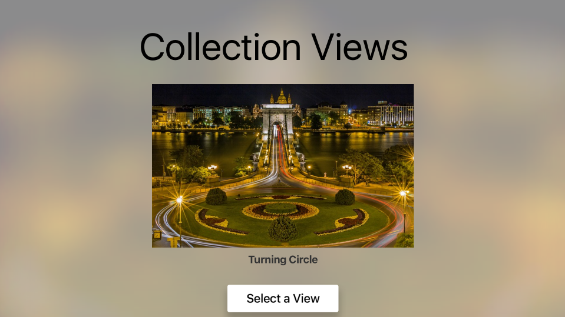](collection-views-images/run01.png#lightbox)

If the user click the **Select a View** button, the Collection View will be displayed:

[](collection-views-images/run02.png#lightbox)

Any city that has its `CanSelect` property set to `false` will be displayed dimmed and the user will not be able to set focus to it. When the user highlights an item (make it in-focus) the title is displayed and they can use the Parallax Effect to subtlety tilt the image in 3D.

When the user clicks a select image, the Collection View is closed and the main view is redisplayed with the new image:

[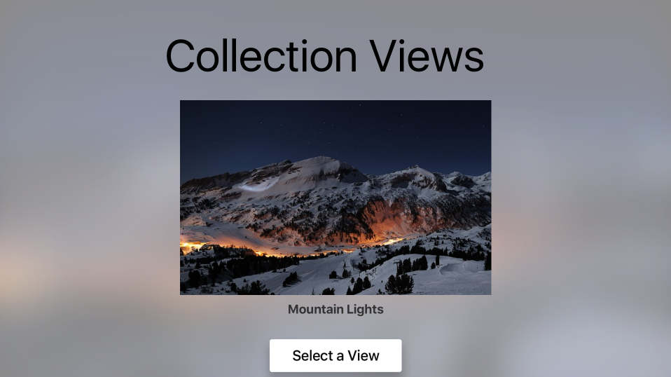](collection-views-images/run03.png#lightbox)

<a name="Creating-Custom-Layout-and-Reordering-Items"></a>

## Creating Custom Layout and Reordering Items

One of the key features of using a Collection View is the ability to create custom layouts. Since tvOS inherits from iOS, the process for creating a custom layout is the same. Please see our [Introduction to Collection Views](~/ios/user-interface/controls/uicollectionview.md) documentation for more information.

Recently added to Collection Views for iOS 9 was the ability to easily allow the reordering of items in the collection. Again, since tvOS 9 is a subset of iOS 9, this is done them same way. Please see our [Collection View Changes](~/ios/user-interface/controls/uicollectionview.md) document for more details.

<a name="Summary"></a>

## Summary

This article has covered designing and working with Collection Views inside of a Xamarin.tvOS app. First, it discussed all of the elements that make up the Collection View. Next, it showed how to design and implement a Collection View using a Storyboard. Finally, is provided links to information on creating custom layouts and reordering items.

## Related Links

- [tvOS Samples](/samples/browse/?products=xamarin&term=Xamarin.iOS%2btvOS)
- [tvOS](https://developer.apple.com/tvos/)
- [tvOS Human Interface Guides](https://developer.apple.com/design/human-interface-guidelines/designing-for-tvos)
- [App Programming Guide for tvOS](https://developer.apple.com/library/prerelease/tvos/documentation/General/Conceptual/AppleTV_PG/)