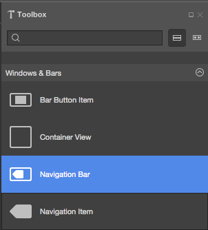
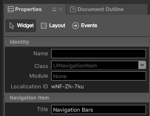
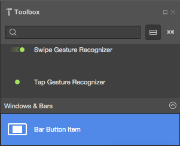
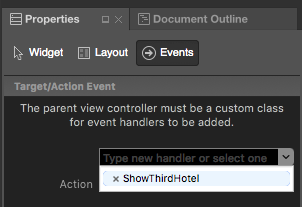
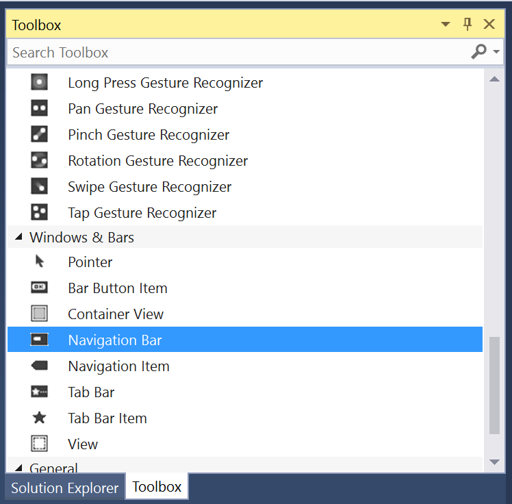
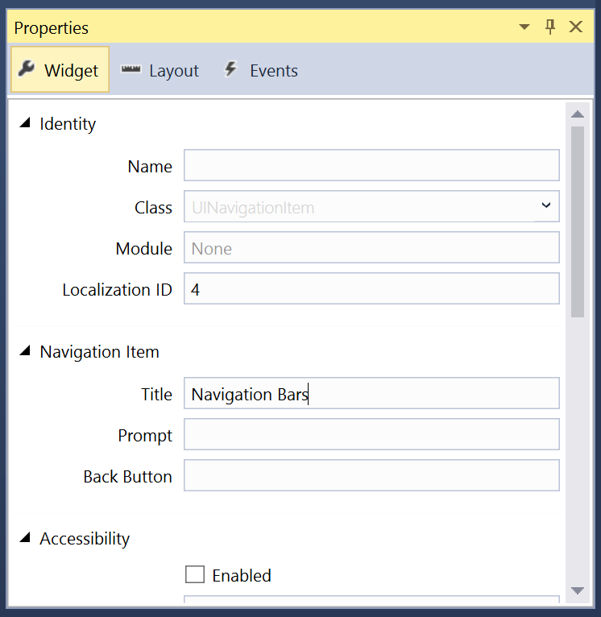
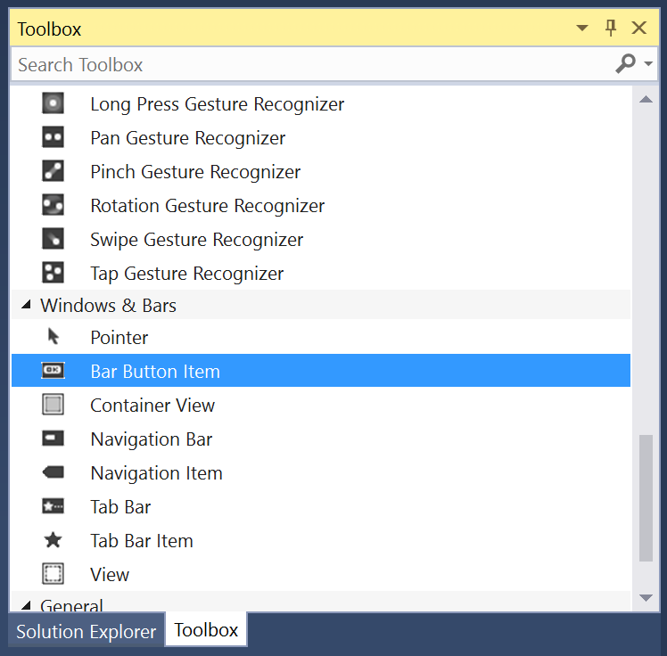
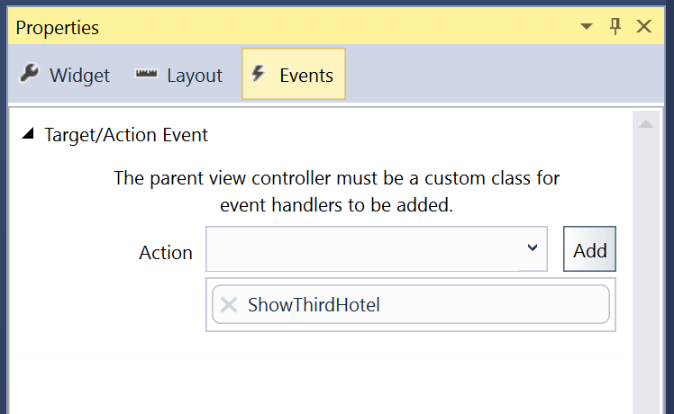

# Working with tvOS Navigation Bars in Xamarin

Navigation Bars can be added to the top of views to display a Title and optional Navigation Bar Buttons. Typically they are used when the user has navigated from a main page, like a Table View, Collection or Menu to a subview showing the details of the selected item.

[](navigation-bars-images/navbar01.png#lightbox)

In addition to the Title (that is displayed in the center), Navigation Bars can contain one or more Navigation Bar Buttons (`UIBarButtonItem`) on the left and right sides of the bar.

> [!IMPORTANT]
> Navigation Bars are totally transparent by default. Care should be taken to ensure that the content of the Navigation Bar stays readable over the content underneath it. For example, when content in a Table View or Collection scrolls under it.

<a name="Navigation-Bars-and-Storyboards"></a>

## Navigation Bars and Storyboards

The easiest way to work with Navigation Bars in a Xamarin.tvOS app is to add them to the app's UI using the iOS Designer.

# [Visual Studio for Mac](#tab/macos)

1. In the **Solution Pad**, double-click `Main.storyboard` file and open it for editing.
1. Drag a **Navigation Bar** from the **Toolbox** and drop it on the View at the top of the screen:

    [](navigation-bars-images/navbar02.png#lightbox)
1. Double-click on the **Navigation Bar** to select to **Navigation Item**. In the **Widget** tab of the **Properties Pad**, you can set the **Title**:

    [](navigation-bars-images/navbar03.png#lightbox)
1. Next, you can add one or more **Bar Button Items** to either end of the bar:

    [](navigation-bars-images/navbar04.png#lightbox)
1. Finally, wire-up the **Bar Button Items** to Actions in the **Events** tab of the **Properties Explorer**:

    [](navigation-bars-images/navbar05.png#lightbox)
1. Save your changes.

# [Visual Studio](#tab/windows)

1. In the **Solution Explorer**, double-click `Main.storyboard` file and open it for editing.
1. Drag a **Navigation Bar** from the **Toolbox** and drop it on the View at the top of the screen:

    [](navigation-bars-images/navbar02-vs.png#lightbox)
1. Double-click on the **Navigation Bar** to select to **Navigation Item**. In the **Widget** tab of the **Properties Explorer**, you can set the **Title**:

    [](navigation-bars-images/navbar03-vs.png#lightbox)
1. Next, you can add one or more **Bar Button Items** to either end of the bar:

    [](navigation-bars-images/navbar04-vs.png#lightbox)
1. Finally, wire-up the **Bar Button Items** to Actions in the **Events** tab of the **Properties Explorer**:

    [](navigation-bars-images/navbar05-vs.png#lightbox)
1. Save your changes.

-----

> [!IMPORTANT]
> While it is possible to assign events such as `TouchUpInside` to a UI element (such as a UIButton) in the iOS Designer, it will never be called because Apple TV doesn't have a touch screen or support touch events. You should always use the `Primary Action` event when creating event handlers for tvOS user interface elements.

The following code gives an example of events handlers on three different BarButtonItems: `ShowFirstHotel`, `ShowSecondHotel`, and `ShowThirdHotel`. When each item is clicked, the background image `HotelImage` is changed. This is edited in the View Controller (example `ViewController.cs`) file:

```csharp
using System;
using Foundation;
using UIKit;

namespace MySingleView
{
    public partial class ViewController : UIViewController
    {
        #region Constructors
        public ViewController (IntPtr handle) : base (handle)
        {
        }
        #endregion

        #region Override Methods
        public override void ViewDidLoad ()
        {
            base.ViewDidLoad ();
            // Perform any additional setup after loading the view, typically from a nib.
        }

        public override void DidReceiveMemoryWarning ()
        {
            base.DidReceiveMemoryWarning ();
            // Release any cached data, images, etc that aren't in use.
        }
        #endregion

        #region Custom Actions
        partial void ShowFirstHotel (UIBarButtonItem sender) {
            // Change background image
            HotelImage.Image = UIImage.FromFile("Motel01.jpg");
        }

        partial void ShowSecondHotel (UIBarButtonItem sender) {
            // Change background image
            HotelImage.Image = UIImage.FromFile("Motel02.jpg");
        }

        partial void ShowThirdHotel (UIBarButtonItem sender) {
            // Change background image
            HotelImage.Image = UIImage.FromFile("Motel03.jpg");
        }
        #endregion
    }
}
```

As long as a button's `Enabled` property is `true` and it is not covered by another control or view, it can be made the in-focus item using the Siri Remote.

For more information on working with Storyboards, please see our [Hello, tvOS Quick Start Guide](~/ios/tvos/get-started/hello-tvos.md).

<a name="Summary"></a>

## Summary

This article has covered designing and working with Navigation Bars inside of a Xamarin.tvOS app.

## Related Links

- [tvOS Samples](/samples/browse/?products=xamarin&term=Xamarin.iOS%2btvOS)
- [tvOS](https://developer.apple.com/tvos/)
- [tvOS Human Interface Guides](https://developer.apple.com/design/human-interface-guidelines/designing-for-tvos)
- [App Programming Guide for tvOS](https://developer.apple.com/library/prerelease/tvos/documentation/General/Conceptual/AppleTV_PG/)