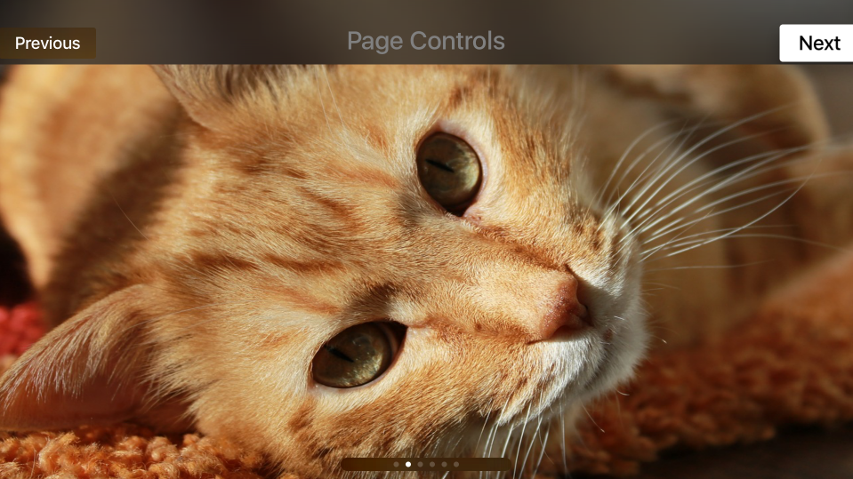
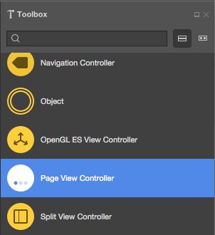
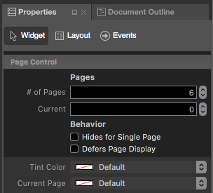
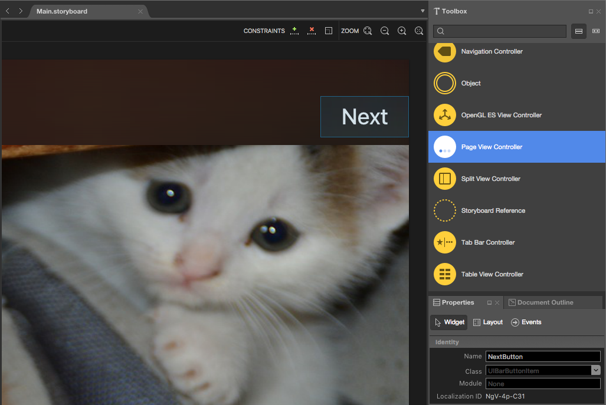
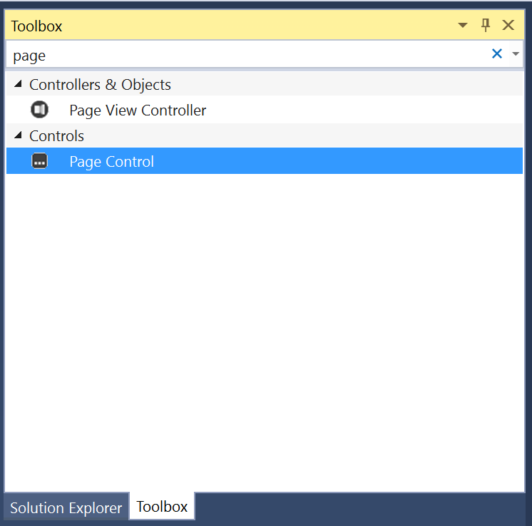
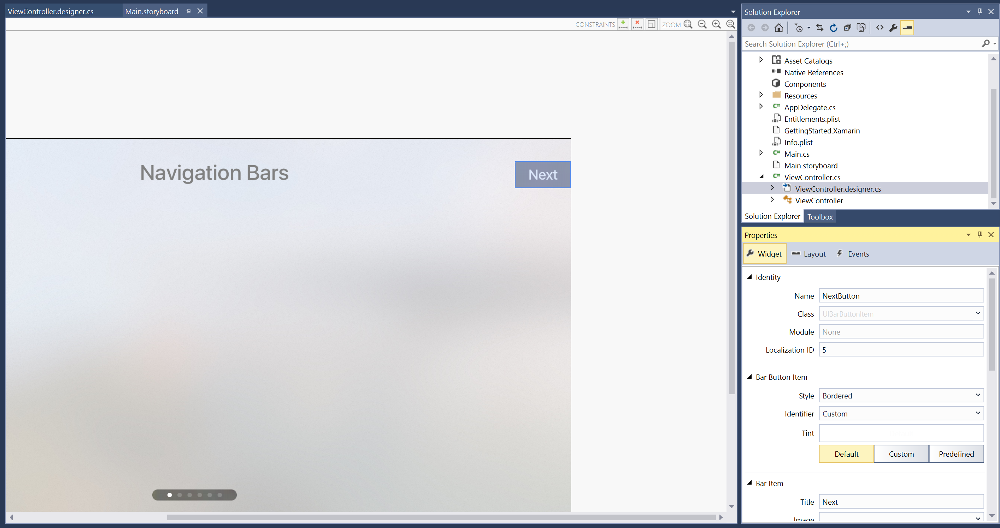

# Working with tvOS Page Controls in Xamarin

Sometimes you might need to display a series of pages or images in your Xamarin.tvOS app. A Page Control was designed to clearly show which page a user is on out of the maximum number of pages. A Page Control displays a series of dots against a dark, oval shaped background. The current page will display a filled dot, all other pages show as hollow dots. The Page control will clip the outer most dots if there are too many to fit in its background area.

[](page-controls-images/page01.png#lightbox)

A Page Control in a non-interactive element designed to give feedback to the user only. You will need to add other controls to change the current page number (such as gestures or Buttons).

Apple has the following suggestions when using a Page Control:

- **Use on Full Collections Only** - Page Controls work best in a full screen environment to display multiple pages that exist in a single collection.
- **Limit the Number of Pages** - Page Controls work best for ten (10) or fewer pages, and a maximum of twenty (20) pages. For more than twenty pages, consider using a [Collection View](~/ios/tvos/user-interface/collection-views.md) and displaying the pages in a grid.

<a name="Page-Controls-and-Storyboards"></a>

## Page Controls and Storyboards

The easiest way to work with Page Controls in a Xamarin.tvOS app is to add them to the app's UI using the iOS Designer.

# [Visual Studio for Mac](#tab/macos)

1. In the **Solution Pad**, double-click the `Main.storyboard` file and open it for editing.
1. Drag a **Page Control** from the **Toolbox** and drop it on the View:

    [](page-controls-images/page02.png#lightbox)
1. In the **Widget Tab** of the **Properties Pad**, you can adjust several properties of the Page Control such as its **Current Page** and **# of Pages**:

    [](page-controls-images/page03.png#lightbox)
1. Next, add controls or gestures to the view to move backward and forward through the collection of pages.
1. Finally, assign **Names** to the controls so that you can respond to them in C# code. For example:

    [](page-controls-images/page04.png#lightbox)
1. Save your changes.

# [Visual Studio](#tab/windows)

1. In the **Solution Explorer**, double-click the `Main.storyboard` file and open it for editing.
1. Drag a **Page Control** from the **Toolbox** and drop it on the View:

    [](page-controls-images/page02-vs.png#lightbox)
1. In the **Widget Tab** of the **Properties Explorer**, you can adjust several properties of the Page Control such as its **Current Page** and **# of Pages**:

    [](page-controls-images/page03-vs.png#lightbox)
1. Next, add controls or gestures to the view to move backward and forward through the collection of pages.
1. Finally, assign **Names** to the controls so that you can respond to them in C# code. For example:

    [](page-controls-images/page04-vs.png#lightbox)
1. Save your changes.

-----

> [!IMPORTANT]
> While it is possible to assign events such as `TouchUpInside` to a UI element (such as a UIButton) in the iOS Designer, it will never be called because Apple TV doesn't have a touch screen or support touch events. You should always use the `Primary Action` event when creating event handlers for tvOS user interface elements.

Edit your View Controller (example `ViewController.cs`) file and add the code to handle the pages being changed. For example:

```csharp
using System;
using Foundation;
using UIKit;

namespace MySingleView
{
    public partial class ViewController : UIViewController
    {
        #region Computed Properties
        public nint PageNumber { get; set; } = 0;
        #endregion

        #region Constructors
        public ViewController (IntPtr handle) : base (handle)
        {
        }
        #endregion

        #region Override Methods
        public override void ViewDidLoad ()
        {
            base.ViewDidLoad ();

            // Initialize
            PageView.Pages = 6;
            ShowCat ();
        }

        public override void DidReceiveMemoryWarning ()
        {
            base.DidReceiveMemoryWarning ();
            // Release any cached data, images, etc that aren't in use.
        }
        #endregion

        #region Custom Actions
        partial void NextCat (UIBarButtonItem sender) {

            // Display next Cat
            if (++PageNumber > 5) {
                PageNumber = 5;
            }
            ShowCat();

        }

        partial void PreviousCat (UIBarButtonItem sender) {
            // Display previous cat
            if (--PageNumber < 0) {
                PageNumber = 0;
            }
            ShowCat();
        }
        #endregion

        #region Private Methods
        private void ShowCat() {

            // Adjust UI
            PreviousButton.Enabled = (PageNumber > 0);
            NextButton.Enabled = (PageNumber < 5);
            PageView.CurrentPage = PageNumber;

            // Display new cat
            CatView.Image = UIImage.FromFile(string.Format("Cat{0:00}.jpg",PageNumber+1));
        }
        #endregion
    }
}
```

Let's take a closer look at two properties of the Page Control. First, to specify the maximum number of pages, use the following:

```csharp
PageView.Pages = 6;
```

To change the current page number, use the following code:

```csharp
PageView.CurrentPage = PageNumber;
```

The `CurrentPage` property is zero (0) based, so the first page will be zero and the last will be one minus the maximum number of pages.

For more information on working with Storyboards, please see our [Hello, tvOS Quick Start Guide](~/ios/tvos/get-started/hello-tvos.md).

<a name="Summary"></a>

## Summary

This article has covered designing and working with Page Control inside of a Xamarin.tvOS app.

## Related Links

- [tvOS Samples](/samples/browse/?products=xamarin&term=Xamarin.iOS%2btvOS)
- [tvOS](https://developer.apple.com/tvos/)
- [tvOS Human Interface Guides](https://developer.apple.com/design/human-interface-guidelines/designing-for-tvos)
- [App Programming Guide for tvOS](https://developer.apple.com/library/prerelease/tvos/documentation/General/Conceptual/AppleTV_PG/)