# Working with Progress Indicators

_This article covers designing and working with Progress Indicators inside of a Xamarin.tvOS app._


There might be times when your Xamarin.tvOS app needs to load new content or perform a lengthy processing operation. During these times, you should present either an Activity Indicator or Progress Bar to let the user know that the app is still running and to give them some indication as to the length of the task being run.

[ 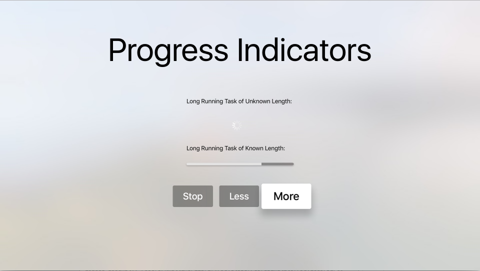](progress-indicators-images/intro01.png)

<a name="About-Activity-Indicators" />

## About Activity Indicators

An Activity Indicator presents as a spinning cog visually and is used to represent a task of an undetermined length. The indicator is presented when the task starts and disappears when the task is completed.

Apple has the following suggestions for working with Activity Indicators:

- **Whenever Possible, use Progress Bars Instead** - Because an Activity Indicator gives the user no feedback as to how long the process being run will take, always use a Progress Bar if the length is know (for example, how many bytes to download in a file).
- **Keep the Indicator Animated** - Users relate a stationary Activity Indicator to a stalled app so you should always have the indicator animated while it is being displayed.
- **Describe the Task being Processed** - Just displaying the Activity Indicator by itself isn't enough, the user needs to be informed about the process they are waiting on. Include a meaningful label (usually a single, complete sentence) that clearly defines the task.

<a name="Summary" />

## About Progress Bars

A Progress Bar presents as a line that fills with color to indicate the state and length of a time-consuming task. Progress Bars should always be used when the length of the tasks is know or can be computed.

Apple has the following suggestions for working with Progress Bars:

- **Accurately Report Progress** - Progress Bars should always be an accurate representation of the time required to complete a task. Never misrepresent the time to make the app appear busy.
- **Use for Well-Defined Durations** - Progress Bar should not only show that a lengthy task is taking place, but give the user and indication of how much of the task is completed and an estimate of the time remaining.

<a name="Progress-Indicators-and-Storyboards" />

## Progress Indicators and Storyboards

The easiest way to work with Progress Indicator in a Xamarin.tvOS app is to add them to the app's UI using the iOS Designer.

# [Visual Studio for Mac](#tab/vsmac)
	
1. In the **Solution Pad**, double-click the `Main.storyboard` file and open it for editing.
1. Drag a **Activity Indicator** from the **Toolbox** and drop it on the View: 

	[ 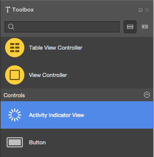](progress-indicators-images/activity01.png)
1. In the **Widget Tab** of the **Properties Pad**, you can adjust several properties of the Activity Indicator such as its **Style** and **Behavior**: 

	[ 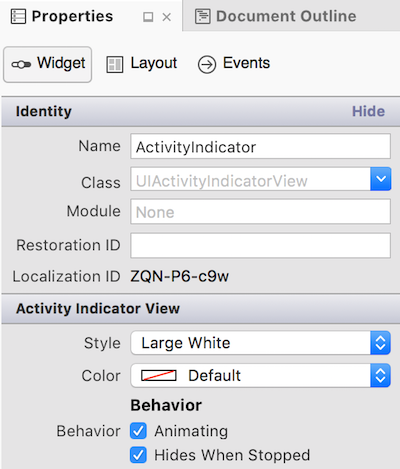](progress-indicators-images/activity02.png)
1. Drag a **Progress View** from the **Toolbox** and drop it on the View: 

	[ 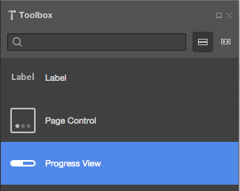](progress-indicators-images/activity03.png)
1. In the **Widget Tab** of the **Property Explorer**, you can adjust several properties of the Progress View such as its **Style** and **Progress** (percent complete): 

	[ 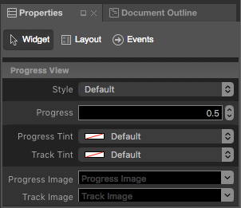](progress-indicators-images/activity04.png)
1. Finally, assign **Names** to the controls so that you can respond to them in C# code. For example: 

	[ 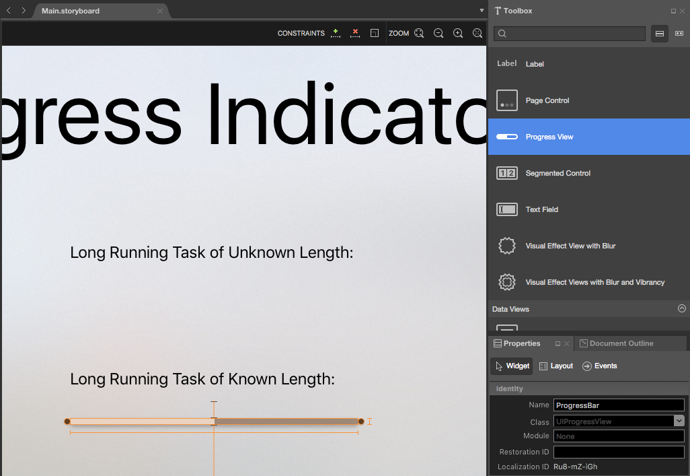](progress-indicators-images/activity05.png)
1. Save your changes.

# [Visual Studio](#tab/vswin)
	
1. In the **Solution Explorer**, double-click the `Main.storyboard` file and open it for editing.
1. Drag a **Activity Indicator** from the **Toolbox** and drop it on the View: 

	[ 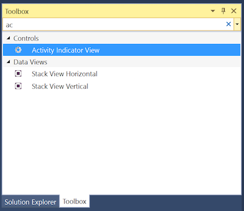](progress-indicators-images/activity01-vs.png)
1. In the **Widget Tab** of the **Properties Explorer**, you can adjust several properties of the Activity Indicator such as its **Style** and **Behavior**: 

	[ 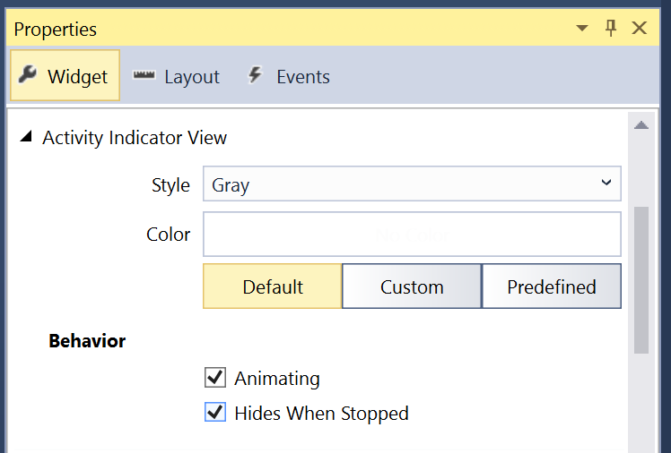](progress-indicators-images/activity02-vs.png)
1. Drag a **Progress View** from the **Toolbox** and drop it on the View: 

	[ 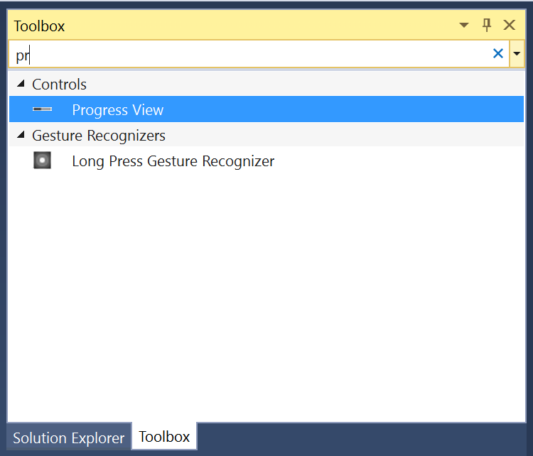](progress-indicators-images/activity03-vs.png)
1. In the **Widget Tab** of the **Property Explorer**, you can adjust several properties of the Progress View such as its **Style** and **Progress** (percent complete): 

	[ 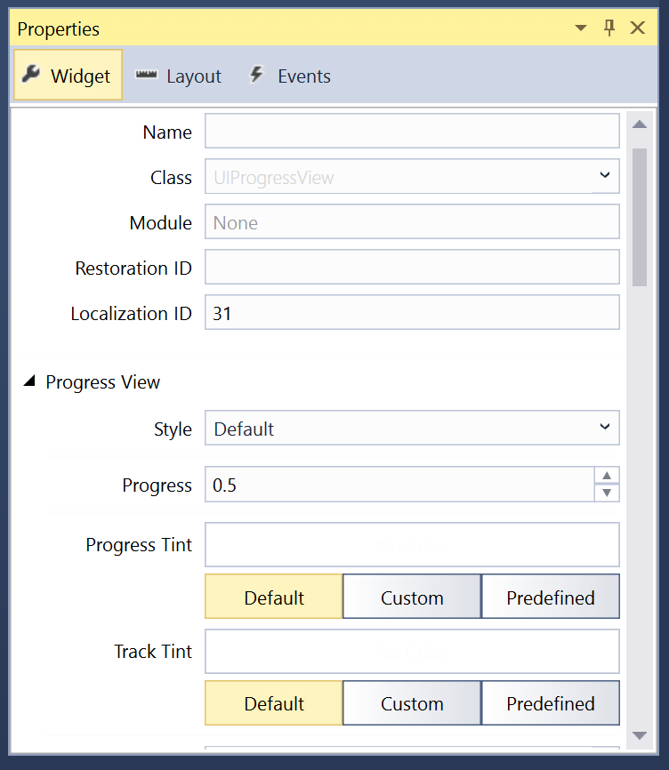](progress-indicators-images/activity04-vs.png)
1. Finally, assign **Names** to the controls so that you can respond to them in C# code. For example: 

	[ 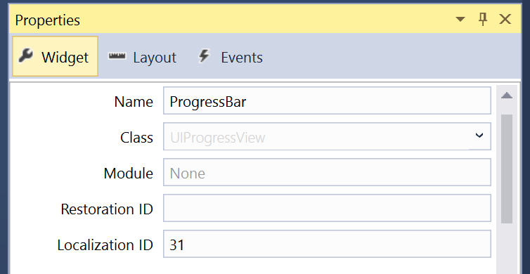](progress-indicators-images/activity05-vs.png)
1. Save your changes.

-----

For more information on working with Storyboards, please see our [Hello, tvOS Quick Start Guide](~/ios/tvos/get-started/hello-tvos.md). 

<a name="Working-with-Activity-Indicators" />

## Working with Activity Indicators

As stated above, Activity Indicators should be shown when your app is running a long process, but you don't know the exact length of time the task will require.

At any point you can see if the Activity Indicator is running its spinning animation by checking the `IsAnimating` property. If the `HidesWhenStopped` property is `true`, the Activity Indicator will automatically be hidden when its animation is stopped.

You can use the following code to start the animation: 

```csharp
ActivityIndicator.StartAnimating();
```

And the following will stop the animation:

```csharp
ActivityIndicator.StopAnimating();
```

<a name="Working-with-Progress-Bars" />

## Working with Progress Bars

Again, a Progress Bar should be used any time your app is executing a long running task of a know duration. 

The `Progress` property is used to set the amount of the task that has been completed from 0% to 100% (0.0 to 1.0). Use the `ProgressTintColor` property to set the color of the amount completed bar and the `TrackTintColor` property to set the background color (uncompleted amount).

<a name="Summary" />

## Summary

This article has covered designing and working with Progress Indicators inside of a Xamarin.tvOS app.


## Related Links

- [tvOS Samples](https://developer.xamarin.com/samples/tvos/all/)
- [tvOS](https://developer.apple.com/tvos/)
- [tvOS Human Interface Guides](https://developer.apple.com/tvos/human-interface-guidelines/)
- [App Programming Guide for tvOS](https://developer.apple.com/library/prerelease/tvos/documentation/General/Conceptual/AppleTV_PG/)
