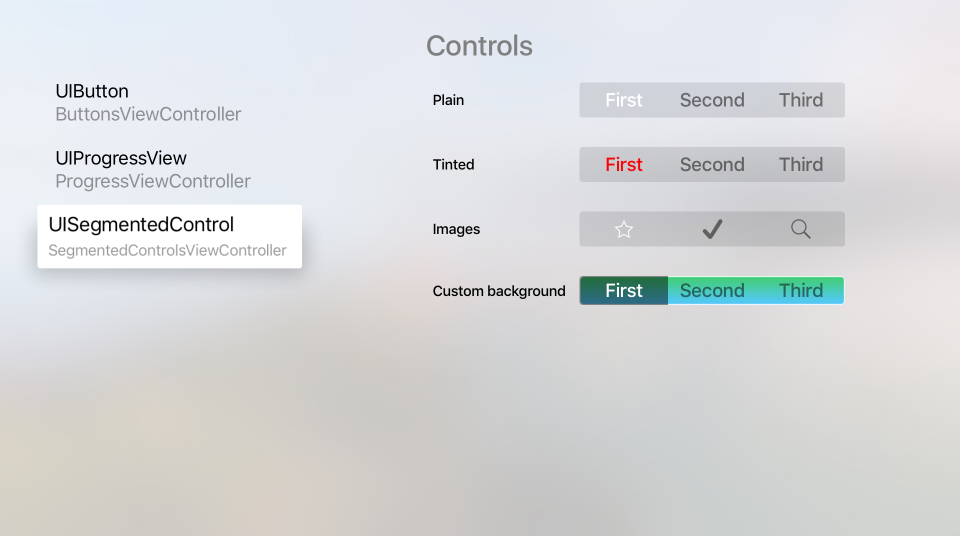
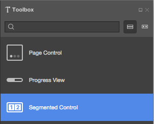
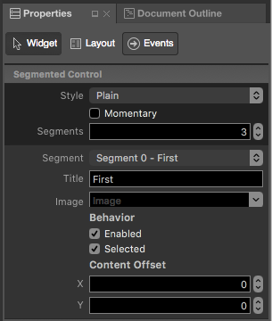
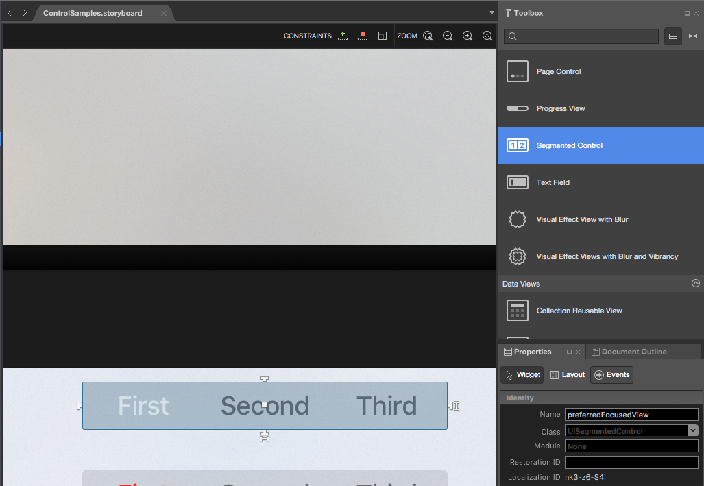
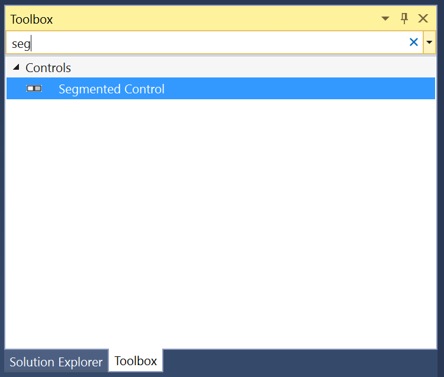
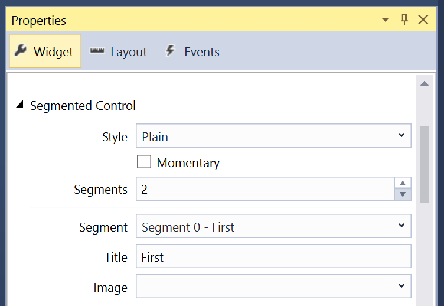
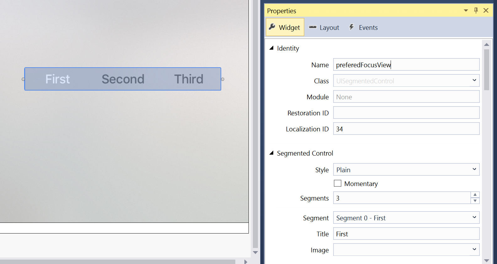

# Working with tvOS Segmented Controls in Xamarin

A Segmented Control provides a set of linear elements, each of which can contain an icon or text, and is used to provide a set of related choices to the user.

[](segmented-controls-images/segment01.png#lightbox)

Apple has the following suggestions for working with Segmented Controls:

- **Provide Ample Space** - Care should be take to provide ample space between other [Focusable Items](~/ios/tvos/app-fundamentals/navigation-focus.md) and a Segmented Control. An individual Segment becomes selected when it is in-focus (not when it is clicked) and the user can accidentally change segments when they actually want to select another Focusable Item on the current segment.
- **Use Split Views for Content Filtering** - Segmented Controls don't make good choices for content filtering as Split Views were designed for easy navigation between the content and the filters.
- **Limit to Seven Segments Max** - You should try to keep the maximum number of segments below eight (8) as this is easier to parse from across the room on the couch and easier to navigate.
- **Use Consistent Segment Content Size** - All Segments have the same width and, if possible, you should try to keep the content in each segment the same size. This not only makes the Segment Controls more visually pleasing, but makes it easier to read at a glance.
- **Avoid Mixing Icons and Text** - Each individual Segment can contain either an icon or text, but not both. While it is possible to mix both icons and text in the same Segmented Control, this should be avoided.

<a name="About-Segment-Icons"></a>

## About Segment Icons

Apple suggests using simple, recognizable images for Segment icons, such as a magnifying glass for search. Overly complex icons are hard to recognize on a TV screen across the room, so it's best to limit your icons to simple representations.

You cannot mix both text and icons on a given Segment and you should avoid mixing icons and text in a single Segmented Control. It should be either all icons or all text.

<a name="Summary"></a>

## Segment Text

Apple makes the following suggestions for working with Segment Text:

- **Use Short, Meaningful Nouns** - The Segment title should clearly state the type of content that the user should expect when selecting the given Segment. For example: Music or Videos.
- **Use Title-Case Capitalization** - Every word of the Segments title should be capitalized except articles, conjunctions and prepositions of less than four (4) characters.
- **Use Short, Focused Titles** - Keep the titles, short and focused on the type of content to expect when the Segment is selected.

Again, you cannot mix both text and icons on a given Segment and you should avoid mixing icons and text in a single Segmented Control.

<a name="Segment-Controls-and-Storyboards"></a>

## Segment Controls and Storyboards

The easiest way to work with Segment Controls in a Xamarin.tvOS app is to add them to the app's UI using the iOS Designer.

# [Visual Studio for Mac](#tab/macos)

1. In the **Solution Pad**, double-click the `Main.storyboard` file and open it for editing.
1. Drag a **Segment Control** from the **Toolbox** and drop it on the View: 

    [](segmented-controls-images/segment02.png#lightbox)
1. In the **Widget Tab** of the **Property Pad**, you can adjust several properties of the Segment Control such as its **Style** and **State**: 

    [](segmented-controls-images/segment03.png#lightbox)
1. Use the **Segments** field to control the number of Segments in the controller.
1. Select a given Segment from the **Segment Dropdown** to adjust its individual properties such as **Title** or **Image** and to control if a given Segment is **Enabled** or **Selected** when the control is displayed.
1. Finally, assign **Names** to the controls so that you can respond to them in C# code. For example: 

    [](segmented-controls-images/segment04.png#lightbox)
1. Save your changes.

# [Visual Studio](#tab/windows)

1. In the **Solution Explorer**, double-click the `Main.storyboard` file and open it for editing.
1. Drag a **Segment Control** from the **Toolbox** and drop it on the View: 

    [](segmented-controls-images/segment02-vs.png#lightbox)
1. In the **Widget Tab** of the **Property Explorer**, you can adjust several properties of the Segment Control such as its **Style** and **State**: 

    [](segmented-controls-images/segment03-vs.png#lightbox)
1. Use the **Segments** field to control the number of Segments in the controller.
1. Select a given Segment from the **Segment Dropdown** to adjust its individual properties such as **Title** or **Image** and to control if a given Segment is **Enabled** or **Selected** when the control is displayed.
1. Finally, assign **Names** to the controls so that you can respond to them in C# code. For example: 

    [](segmented-controls-images/segment04-vs.png#lightbox)
1. Save your changes.

-----

For more information on working with Storyboards, please see our [Hello, tvOS Quick Start Guide](~/ios/tvos/get-started/hello-tvos.md). 

<a name="Working-with-Segmented-Controls"></a>

## Working with Segmented Controls

As stated above, s Segmented Control provides a set of linear elements, each of which can contain an icon or text, and is used to provide a set of related choices to the user.

There are several different ways that you can work with Segmented Controls in your Xamarin.tvOS app.

<a name="Exposed-as-Outlets-and-Actions"></a>

## Exposed as Names and Events

If you created your Segment Control in the Interface Designer and exposed it as a Named Control and an Event you can use the following code to respond to the segment changing:

```csharp
partial void PlayerCountChanged (Foundation.NSObject sender) {

    // Take action based on the number of players selected
    switch(PlayerCount.SelectedSegment) {
    case 0:
        // Do something if the segment is selected
        ...
        break;
    case 1:
        // Do something if the segment is selected
        ...
        break;
    case 2:
        // Do something if the segment is selected
        ...
        break;
    }
}
```

In the case of the example above, the Segment Control was exposed as a `PlayerCount` Name and a `PlayerCountChanged` Event Action. For more information on working with Actions and Outlets, please see the [Writing the Code with outlets and actions](~/ios/tvos/get-started/hello-tvos.md#Writing-the-Code) section of our [Hello, tvOS Quick Start Guide](~/ios/tvos/get-started/hello-tvos.md).

The `SelectedSegment` property gets or sets the currently selected segment as a zero (0) based index. So if you have five (5) Segments, the first Segment will have an index of zero (0) and the last an index of four (4).

<a name="Modifying-Segments"></a>

## Modifying Segments

At any time you can modify both the number and the content of your Segmented Controls. Use the following code to insert a new icon Segment:

```csharp
// Icon Segment
SegmentedControl.InsertSegment(UIImage.FromFile("icon.png"), 0, true);

// Text Segment
SegmentedControl.InsertSegment("New Segment", 0, true);
```

The second parameter defines where the Segment will be inserted using a zero (0) based index. If the last parameter is `true` the insert will be animated.

To remove a given Segment, use the following:

```csharp
SegmentedControl.RemoveSegmentAtIndex(0, true);
```

Or the following to remove all segments:

```csharp
SegmentedControl.RemoveAllSegments();
```

Again, if the last parameter is `true`, the removal will be animated. Use the `NumberOfSegments` property to return the current number of Segments.

To get the **Title** or **Icon** for a given segment, use the following:

```csharp
// Get title
var title = SegmentedControl.TitleAt(0);

// Get icon
var icon = SegmentedControl.ImageAt(0);
```

And to change the **Title** or **Icon**, use the following:

```csharp
// Set title
SegmentedControl.SetTitle("New Title", 0);

// Set icon
SegmentedControl.SetImage(UIImage.FromFile("icon.png"), 0);
```

To see if a given Segment is **Enabled**, use the following:

```csharp
if (SegmentedControl.IsEnabled(0)) {
    // Do something
    ...
}
```

And to **Enable/Disable** a given Segment, use the following:

```csharp
SegmentedControl.SetEnabled(false, 0);
```

<a name="Modifying-the-Segmented-Controls-Appearance"></a>

## Modifying the Segmented Control's Appearance

You can use the following code to change the background of a given Segment to an image:

```csharp
SegmentedControl.SetBackgroundImage (UIImage.FromFile("background.png"), UIControlState.Normal, UIBarMetrics.Default);
```

Where `UIControlState` specifies the state of the control that you are setting the image for as:

- Normal
- Highlighted
- Disabled
- Selected
- Focused

And `UIBarMetrics` specifies the metrics to use as:

- Default
- Compact
- DefaultPrompt
- CompactPrompt

Additionally, you can set the divider between the Segments using:

```csharp
SegmentedControl.SetDividerImage (UIImage.FromFile("divider.png"), UIControlState.Normal, UIControlState.Normal, UIBarMetrics.Default);
```

Where the first `UIControlState` specifies the state of the Segment to the left of the divider and the second `UIControlState` specifies the state of the Segment to the right.

<a name="Summary"></a>

## Summary

This article has covered designing and working with Segmented Control inside of a Xamarin.tvOS app.

## Related Links

- [tvOS Samples](/samples/browse/?products=xamarin&term=Xamarin.iOS%2btvOS)
- [tvOS](https://developer.apple.com/tvos/)
- [tvOS Human Interface Guides](https://developer.apple.com/design/human-interface-guidelines/designing-for-tvos)
- [App Programming Guide for tvOS](https://developer.apple.com/library/prerelease/tvos/documentation/General/Conceptual/AppleTV_PG/)