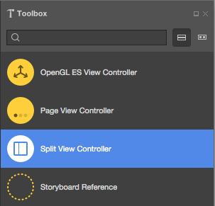
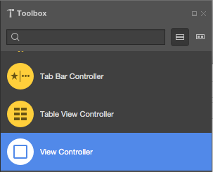
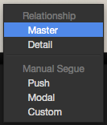
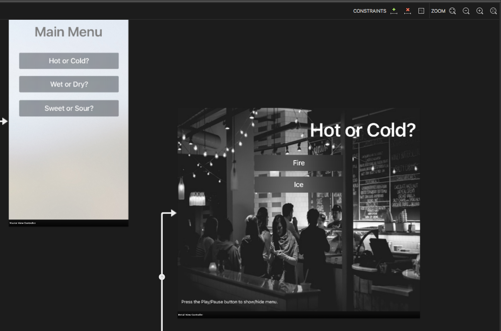
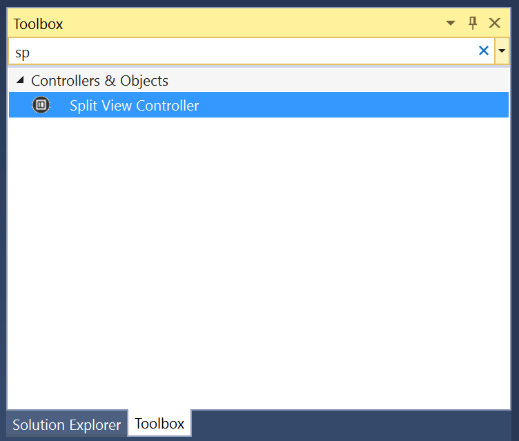
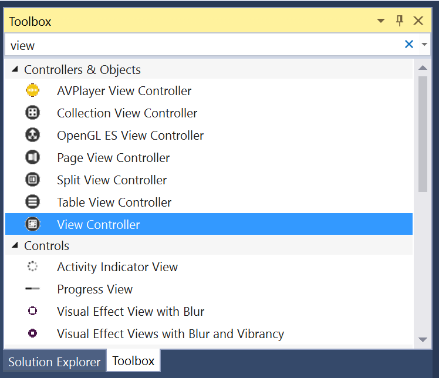
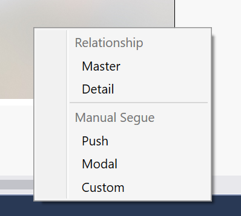

# Working with tvOS Split View Controllers in Xamarin
> [!WARNING]
> The iOS Designer was deprecated in Visual Studio 2019 version 16.8 and Visual Studio 2019 for Mac version 8.8, and 
> removed in Visual Studio 2019 version 16.9 and Visual Studio for Mac version 8.9.
> The recommended way to build iOS user interfaces is directly on a Mac running Xcode's Interface Builder. For more information, see [Designing user interfaces with Xcode](~/ios/user-interface/storyboards/index.md). 

A Split View Controller presents and manages a Master and Detail View Controller side-by-side, on screen at the same time. Split View Controllers are used to present persistent, focusable content in the Master View (the smaller section on the left) and related details in the Detail View (the larger section on the right).

[](split-views-images/intro01.png#lightbox)

<a name="About-Split-View-Controllers"></a>

## About Split View Controllers

As stated above, a Split View Controller manages a Master and Detail View Controller that are presented side-by-side, with the Master being the smaller view on the left, the Detail the larger on the right. 

Additionally, the Master View Controller can been hidden or shown as required: 

[](split-views-images/intro02.png#lightbox)

Split Views Controllers are often use to present a list of filterable content, with the categories in the Master View and the filtered results in the Detail View. This is typically presented as a Table View on the left, and a [Collection View](~/ios/tvos/user-interface/collection-views.md) on the right.

When designing a User Interface that requires a Split View Controller, Apple suggests using Master and Detail View Controllers that do not change (only the content changes, not the structure). If you do need to swap-out View Controllers, it's best to use a Navigation Controller as the base of View Controller that needs to change (Master or Detail).

Apple has the following suggestions for working with Split View Controllers:

- **Use the Correct Split Percentage** - By default the Split View Controller uses one-third of the screen for the Master View Controller and two-thirds for the Detail View Controller. Optionally, you can use a 50/50 split. Choose the correct percentage to make your content appear balanced on screen.
- **Persist the Main Selection** - While the content on the Detail View can change is response to a user's selection in the Master View, the Master View content should be fixed. Additionally, you should clearly show the currently selected item in the Master View.
- **Use a Single, Unified Title** - Typically, you'll want to use a single, centered title in the Detail View, instead of a Title in both the Detail and the Master View.

<a name="Split-View-Controllers-and-Storyboards"></a>

## Split View Controllers and Storyboards

The easiest way to work with Split View Controllers in a Xamarin.tvOS app is to add them to the app's UI using the iOS Designer.

# [Visual Studio for Mac](#tab/macos)

1. In the **Solution Pad**, double-click the `Main.storyboard` file and open it for editing.
1. Drag a **Split View Controllers** from the **Toolbox** and drop it on the View: 

    [](split-views-images/activity01.png#lightbox)
1. By default, the iOS Designer will install a Navigation Controller and a View Controller in the Master View. If this does not fit your app's requirements, simply delete them.
1. If you do remove the default Master View, drag a new View Controller onto the design surface: 

    [](split-views-images/activity02.png#lightbox)
1. Control-Click and drag from the Split View Controller to the new Master View Controller. 
1. Select **Master** from the **Popup Menu**: 

    [](split-views-images/activity03.png#lightbox)
1. Design the contents of your Master and Detail Views: 

    [](split-views-images/activity04.png#lightbox)
1. Assign **Names** in the **Widget Tab** of the **Properties Pad** to work with your UI controls in C# code.
1. Save your changes and return to Visual Studio for Mac.

# [Visual Studio](#tab/windows)

1. In the **Solution Explorer**, double-click the `Main.storyboard` file and open it for editing.
1. Drag a **Split View Controllers** from the **Toolbox** and drop it on the View: 

    [](split-views-images/activity01-vs.png#lightbox)
1. By default, the iOS Designer will add a Navigation Controller and View Controller in the Master View. If this does not fit your app's requirements, simply delete them.
1. If you do remove the default Master View, drag a new View Controller onto the design surface: 

    [](split-views-images/activity02-vs.png#lightbox)
1. Control-Click and drag from the Split View Controller to the new Master View Controller. 
1. Select **Master** from the **Popup Menu**: 

    [](split-views-images/activity03-vs.png#lightbox)
1. Design the contents of your Master and Detail Views: 

    [](split-views-images/activity04.png#lightbox)
1. Assign **Names** in the **Widget Tab** of the **Properties Explorer** to work with your UI controls in C# code.
1. Save your changes.

-----

For more information on working with Storyboards, please see our [Hello, tvOS Quick Start Guide](~/ios/tvos/get-started/hello-tvos.md).

<a name="Working-with-Split-View-Controllers"></a>

## Working with Split View Controllers

As stated above, a Split View Controller is often used in situations where you are displaying filtered content to the user. The main categories are displayed on the left in the Master View, and the filtered results on the right in the Detail View based on the user's selection.

<a name="Accessing-Master-and-Detail"></a>

### Accessing Master and Detail

If you need to access the Master and Detail View Controllers programmatically, use the `ViewControllers` property of the Split View Controller. For example:

```csharp
// Gain access to master and detail view controllers
var masterController = ViewControllers [0] as MasterViewController;
var detailController = ViewControllers [1] as DetailViewController;
```

It is presented as an array, where the first element (0) in the Master View Controller and the second element (1) is the Detail.

<a name="Accessing-Detail-from-Master"></a>

### Accessing Detail from Master

Since you are usually displaying detailed information in the Detail View  based on the user's selection in the Master, you'll need a way to access the Detail from the Master.

The easiest way to do this is to expose a property on your Master View Controller class, for example:

```csharp
public DetailViewController DetailController { get; set;}
```

In the Split View Controller, override the `ViewDidLoad` method and tie the two views together. For example:

```csharp
public override void ViewDidLoad ()
{
    base.ViewDidLoad ();

    // Gain access to master and detail view controllers
    var masterController = ViewControllers [0] as MasterViewController;
    var detailController = ViewControllers [1] as DetailViewController;

    // Wire-up views
    masterController.SplitViewController = this;
    masterController.DetailController = detailController;
    detailController.SplitViewController = this;
}
```

You can expose properties and methods on your Detail View Controller that the Master can use to present new data as required.

<a name="Showing-and-Hiding-Master"></a>

### Showing and Hiding Master

Optionally, you can show and hide the Master View Controller using the `PreferredDisplayMode` property of the Split View Controller. For example:

```csharp
// Show hide split view
if (SplitViewController.DisplayMode == UISplitViewControllerDisplayMode.PrimaryHidden) {
    SplitViewController.PreferredDisplayMode = UISplitViewControllerDisplayMode.AllVisible;
} else {
    SplitViewController.PreferredDisplayMode = UISplitViewControllerDisplayMode.PrimaryHidden;
}
```

The `UISplitViewControllerDisplayMode` enum defines how the Master View Controller will be presented as one of the following:

- **Automatic** - tvOS will control the presentation of the Master and Detail Views.
- **PrimaryHidden** - This hides the Master View Controller.
- **AllVisible** - Displays both the Master and the Detail View Controllers side-by-side. This is the normal, default presentation.
- **PrimaryOverlay** - The Detail View Controller extends under, and is covered by the Master.

To get the current presentation state, use the `DisplayMode` property of the Split View Controller.

<a name="Summary"></a>

## Summary

This article has covered designing and working with Split View Controllers inside of a Xamarin.tvOS app.

## Related Links

- [tvOS Samples](/samples/browse/?products=xamarin&term=Xamarin.iOS%2btvOS)
- [tvOS](https://developer.apple.com/tvos/)
- [tvOS Human Interface Guides](https://developer.apple.com/design/human-interface-guidelines/designing-for-tvos)
- [App Programming Guide for tvOS](https://developer.apple.com/library/prerelease/tvos/documentation/General/Conceptual/AppleTV_PG/)