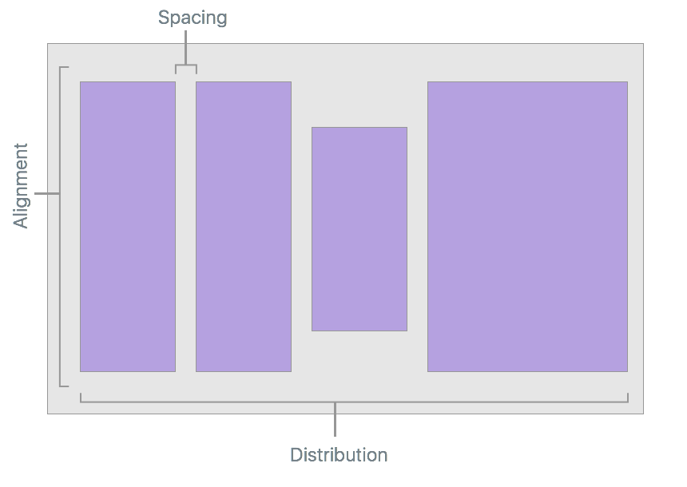
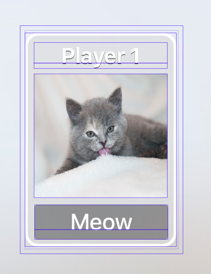
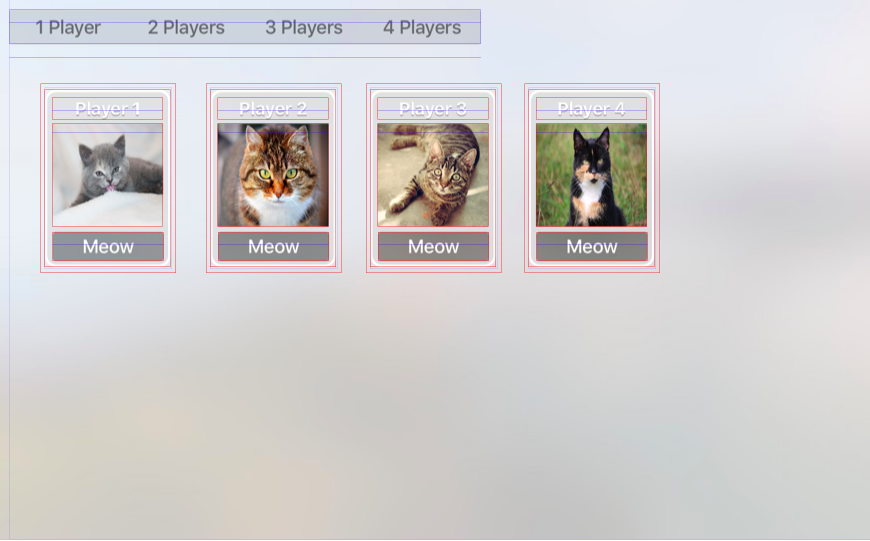
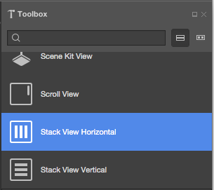
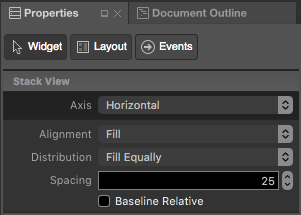
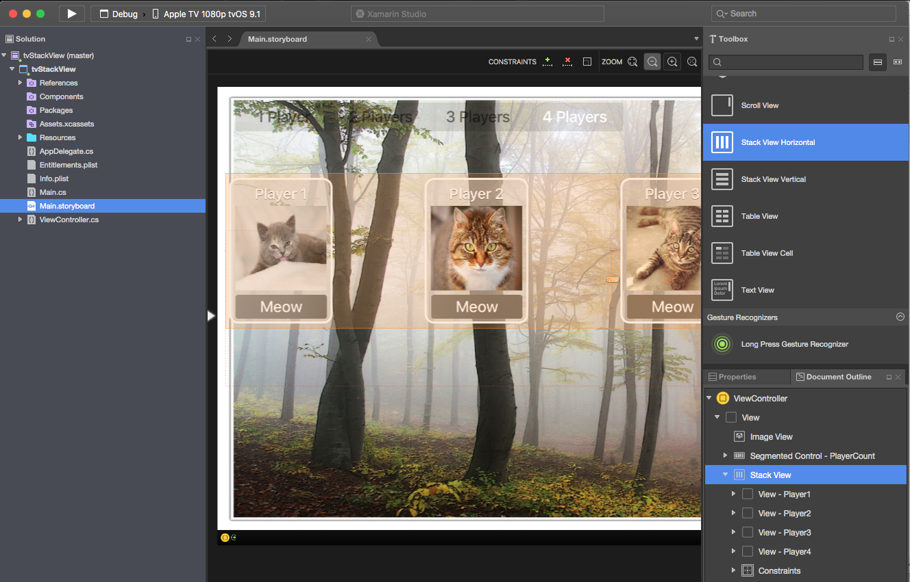
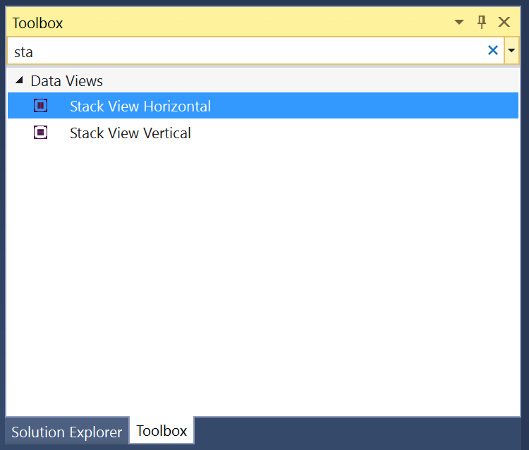
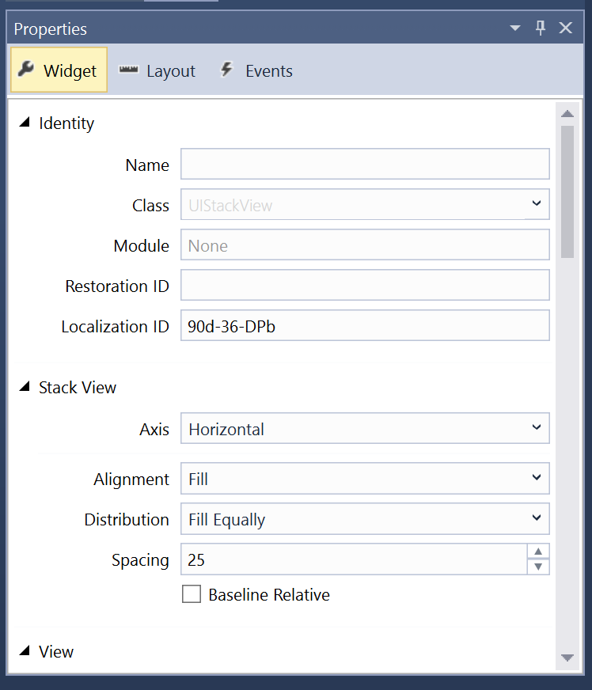
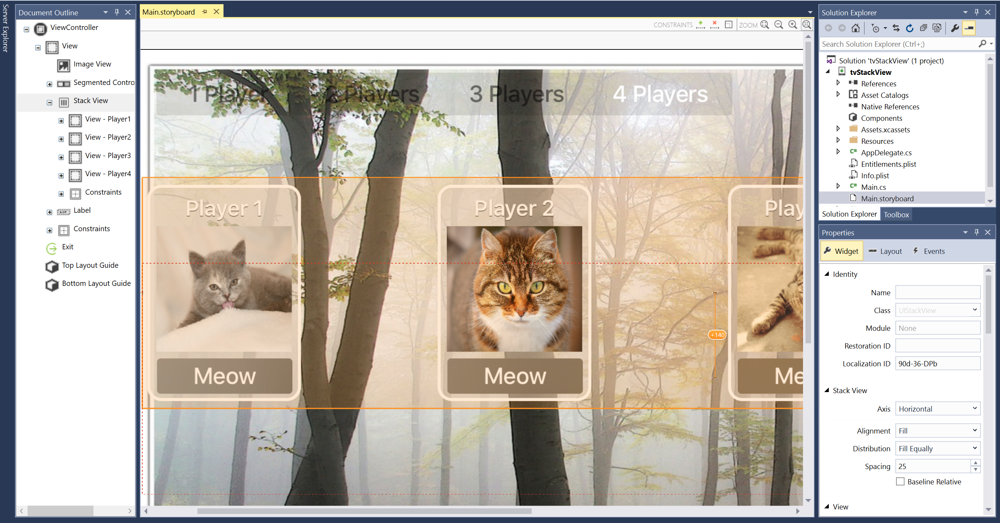

# Working with tvOS Stacked Views in Xamarin
> [!WARNING]
> The iOS Designer was deprecated in Visual Studio 2019 version 16.8 and Visual Studio 2019 for Mac version 8.8, and 
> removed in Visual Studio 2019 version 16.9 and Visual Studio for Mac version 8.9.
> The recommended way to build iOS user interfaces is directly on a Mac running Xcode's Interface Builder. For more information, see [Designing user interfaces with Xcode](~/ios/user-interface/storyboards/index.md). 

The Stack View control (`UIStackView`) leverages the power of Auto Layout and Size Classes to manage a stack of subviews, either horizontally or vertically, which dynamically responds to content changes and screen size of the Apple TV device.

The layout of all subviews attached to a Stack View are managed by it based on developer defined properties such as axis, distribution, alignment and spacing:

[](stacked-views-images/stacked01.png#lightbox)

When using a `UIStackView` in a Xamarin.tvOS app, the developer can either define the subviews either inside a Storyboard in the iOS Designer, or by adding and removing subviews in C# code.

## About Stacked View Controls

The `UIStackView` is designed as a non-rendering container view and as such, it is not drawn to the canvas like other subclasses of `UIView`. Setting properties such as `BackgroundColor` or overriding `DrawRect` will have no visual effect.

There are several properties that control how a Stack View will arrange its collection of subviews:

- **Axis** – Determines if the Stack View arranges the subviews either **Horizontally** or **Vertically**.
- **Alignment** – Controls how the subviews are aligned within the Stack View.
- **Distribution** – Controls how the subviews are sized within the Stack View.
- **Spacing** – Controls the minimal space between each subview in the Stack View.
- **Baseline Relative** – If `true`, the vertical spacing of each subview will be derived from it's baseline.
- **Layout Margins Relative** – Places the subviews relative to the standard layout margins.

Typically you will use a Stack View to arrange a small number of subviews. More complex User Interfaces can be created by nesting one or more Stack Views inside each other.

You can further fine-tune the UIs appearance by adding additional constraints to the subviews (for example to control the Height or Width). However, care should be taken not to include conflicting constraints to those introduced by the Stack View itself.

<a name="Auto-Layout-and-Size-Classes"></a>

## Auto Layout and Size Classes

When a subview is added to a Stack View its layout is totally controlled by that Stack View using Auto Layout and Size Classes to position and size the arranged views.

The Stack View will _pin_ the first and last subview in its collection to the **Top** and **Bottom** edges for Vertical Stack Views or the **Left** and **Right** edges for Horizontal Stack Views. If you set the `LayoutMarginsRelativeArrangement` property to `true`, then the view pins the subviews to the relevant margins instead of the edge.

The Stack View uses the subview's `IntrinsicContentSize` property when calculating the subviews size along the defined `Axis` (except for the `FillEqually Distribution`). The `FillEqually Distribution` resizes all subviews so that they are the same size, thus filling the Stack View along the `Axis`.

With the exception of the `Fill Alignment`, the Stack View uses the subview's `IntrinsicContentSize` property for calculating the view's size perpendicular to the given `Axis`. For the `Fill Alignment`, all subviews are sized so that they fill the Stack View perpendicular to the given `Axis`.

<a name="Positioning-and-Sizing-the-Stack-View"></a>

## Positioning and Sizing the Stack View

While the Stack View has total control over the layout of any subview (based on properties such as `Axis` and `Distribution`), you still need to position the Stack View (`UIStackView`) within its parent view using Auto Layout and Size Classes.

Generally, this means pinning at least two edges of the Stack View to expand and contract, thus defining its position. Without any additional constraints, the Stack View will automatically be resized to fit all of its subviews as follows:

- The size along its `Axis` will be the sum of all subview sizes plus any space that has been defined between each subview.
- If the `LayoutMarginsRelativeArrangement` property is `true`, the Stack Views size will also include room for the margins.
- The size perpendicular to the `Axis` will be set to the largest subview in the collection.

Additionally, you can specify constraints for the Stack View's **Height** and **Width**. In this case, the subviews will be laid out (sized) to fill the space specified by the Stack View as determined by the `Distribution` and `Alignment` properties.

If the `BaselineRelativeArrangement` property is `true`, the subviews will be laid out based on the first or last subview's baseline, instead of using the **Top**, **Bottom** or **Center** - **Y** position. These are calculated on the Stack View's content as follows:

- A Vertical Stack View will return the first subview for the first baseline and the last for the last. If either of these subviews are themselves Stack Views, then their first or last baseline will be used.
- A Horizontal Stack View will use its tallest subview for both the first and last baseline. If the tallest view is also a Stack View, it will use it's tallest subview as the baseline.

> [!IMPORTANT]
> Baseline Alignment does not work on stretched or compressed subview sizes as the baseline will be calculated to the wrong position. For Baseline Alignment, ensure that the subview's **Height** matches the Intrinsic Content View's **Height**.

<a name="Common-Stack-View-Uses"></a>

## Common Stack View Uses

There are several layout types that work well with Stack View controls. According to Apple, here are a few of the more common uses:

- **Define the Size Along the Axis** – By pinning both edges along the Stack View's `Axis` and one of the adjacent edges to set the position, the Stack view will grow along the axis to fit the space defined by its subviews.
- **Define the Subview's Position** – By pinning to adjacent edges of the Stack View to it's parent view, the Stack View will grow in both dimensions to fit it's containing subviews.
- **Define the Size and Position of the Stack** – By pinning all four edges of the Stack View to the parent view, the Stack View arranges the subviews based on the space defined within the Stack View.
- **Define the Size Perpendicular the Axis** – By pinning both edges perpendicular to the Stack View's `Axis` and one of the edges along the axis to set the position, the Stack view will grow perpendicular to the axis to fit the space defined by its subviews.

<a name="Stack-Views-and-Storyboards"></a>

## Stack Views and Storyboards

The easiest way to work with Stack Views in a Xamarin.tvOS app is to add them to the app's UI using the iOS Designer.

# [Visual Studio for Mac](#tab/macos)

1. In the **Solution Pad**, double-clicking the `Main.storyboard` file and open it for editing.
1. Design the layout of your individual elements that you are going to add to the Stack View:

    [](stacked-views-images/layout01.png#lightbox)
1. Add any required constraints to the elements to ensure they scale correctly. This step is important once the element is added to the Stack View.
1. Make the required number of copies (four in this case):

    [](stacked-views-images/layout02.png#lightbox)
1. Drag a **Stack View** from the **Toolbox** and drop it on the View:

    [](stacked-views-images/layout03.png#lightbox)
1. Select the Stack View, in the **Widget Tab** of the **Properties Pad** select **Fill** for the **Alignment**, **Fill Equally** for the **Distribution** and enter `25` for the **Spacing**:

    [](stacked-views-images/layout04.png#lightbox)
1. Position the Stack View on the screen where you want it and add Constraints to keep it in the required location.
1. Select the individual elements and drag them into the Stack View:

    [](stacked-views-images/layout05.png#lightbox)
1. The layout will be adjusted and the elements will be arranged in the Stack View based on the attributes you set above.
1. Assign **Names** in the **Widget Tab** of the **Properties Explorer** to work with your UI controls in C# code.
1. Save your changes.

# [Visual Studio](#tab/windows)

1. In the **Solution Explorer**, double-clicking the `Main.storyboard` file and open it for editing.
1. Design the layout of your individual elements that you are going to add to the Stack View:

    [](stacked-views-images/layout01.png#lightbox)
1. Add any required constraints to the elements to ensure they scale correctly. This step is important once the element is added to the Stack View.
1. Make the required number of copies (four in this case):

    [](stacked-views-images/layout02.png#lightbox)
1. Drag a **Stack View** from the **Toolbox** and drop it on the View:

    [](stacked-views-images/layout03-vs.png#lightbox)
1. Select the Stack View, in the **Widget Tab** of the **Properties Explorer** select **Fill** for the **Alignment**, **Fill Equally** for the **Distribution** and enter `25` for the **Spacing**:

    [](stacked-views-images/layout04-vs.png#lightbox)
1. Position the Stack View on the screen where you want it and add Constraints to keep it in the required location.
1. Select the individual elements and drag them into the Stack View:

    [](stacked-views-images/layout05-vs.png#lightbox)
1. The layout will be adjusted and the elements will be arranged in the Stack View based on the attributes you set above.
1. Assign **Names** in the **Widget Tab** of the **Properties Explorer** to work with your UI controls in C# code.
1. Save your changes.

-----

> [!IMPORTANT]
> While it is possible to assign actions such as `TouchUpInside` to a UI element (such as a `UIButton`) in the iOS Designer when creating an Event Handler, it will never be called because Apple TV doesn't have a touch screen or support touch events. You should always use the default `Action Type` when creating Actions for tvOS user interface elements.

For more information on working with Storyboards, please see our [Hello, tvOS Quick Start Guide](~/ios/tvos/get-started/hello-tvos.md).

In the case of our example, we've exposed an Outlet and Action for the Segment Control and an Outlet for each "player card". In code, we hide and show player based on the current segment. For example:

```csharp
partial void PlayerCountChanged (Foundation.NSObject sender) {

    // Take Action based on the segment
    switch(PlayerCount.SelectedSegment) {
    case 0:
        Player1.Hidden = false;
        Player2.Hidden = true;
        Player3.Hidden = true;
        Player4.Hidden = true;
        break;
    case 1:
        Player1.Hidden = false;
        Player2.Hidden = false;
        Player3.Hidden = true;
        Player4.Hidden = true;
        break;
    case 2:
        Player1.Hidden = false;
        Player2.Hidden = false;
        Player3.Hidden = false;
        Player4.Hidden = true;
        break;
    case 3:
        Player1.Hidden = false;
        Player2.Hidden = false;
        Player3.Hidden = false;
        Player4.Hidden = false;
        break;
    }
}
```

When the app is run, the four elements will equally be distributed in our Stack View:

[](stacked-views-images/layout06.png#lightbox)

If the number of players is decreased, the unused views are hidden and the Stack View adjust the layout to fit:

[](stacked-views-images/layout07.png#lightbox)

<a name="Populate-a-Stack-View-from-Code"></a>

### Populate a Stack View from Code

In addition to totally defining the contents and layout of a Stack View in the iOS Designer, you can create and remove it dynamically from C# code.

Take the following example that uses a Stack View to handle "stars" in a review (1 to 5):

```csharp
public int Rating { get; set;} = 0;
...

partial void IncreaseRating (Foundation.NSObject sender) {

    // Maximum of 5 "stars"
    if (++Rating > 5 ) {
        // Abort
        Rating = 5;
        return;
    }

    // Create new rating icon and add it to stack
    var icon = new UIImageView (new UIImage("icon.png"));
    icon.ContentMode = UIViewContentMode.ScaleAspectFit;
    RatingView.AddArrangedSubview(icon);

    // Animate stack
    UIView.Animate(0.25, ()=>{
        // Adjust stack view
        RatingView.LayoutIfNeeded();
    });

}

partial void DecreaseRating (Foundation.NSObject sender) {

    // Minimum of zero "stars"
    if (--Rating < 0) {
        // Abort
        Rating =0;
        return;
    }

    // Get the last subview added
    var icon = RatingView.ArrangedSubviews[RatingView.ArrangedSubviews.Length-1];

    // Remove from stack and screen
    RatingView.RemoveArrangedSubview(icon);
    icon.RemoveFromSuperview();

    // Animate stack
    UIView.Animate(0.25, ()=>{
        // Adjust stack view
        RatingView.LayoutIfNeeded();
    });
}
```

Let's take a look at a few pieces of this code in detail. First, we use an `if` statements to check that there isn't more than five "stars" or less than zero.

To add a new "star" we load its image and set its **Content Mode** to **Scale Aspect Fit**:

```csharp
var icon = new UIImageView (new UIImage("icon.png"));
icon.ContentMode = UIViewContentMode.ScaleAspectFit;
```

This keeps the "star" icon from being distorted when it is added to the Stack View.

Next, we add the new "star" icon to the Stack View's collection of subviews:

```csharp
RatingView.AddArrangedSubview(icon);
```

You'll notice that we added the `UIImageView` to the `UIStackView`'s `ArrangedSubviews` property and not to the `SubView`. Any view that you want the Stack View to control its layout must be added to the `ArrangedSubviews` property.

To remove a subview from a Stack View, first we get the subview to remove:

```csharp
var icon = RatingView.ArrangedSubviews[RatingView.ArrangedSubviews.Length-1];
```

Then we need to remove it from both the `ArrangedSubviews` collection and the Super View:

```csharp
// Remove from stack and screen
RatingView.RemoveArrangedSubview(icon);
icon.RemoveFromSuperview();
```

Removing a subview from just the `ArrangedSubviews` collection takes it out of the Stack View's control, but does not remove it from the screen.

<a name="Dynamically-Changing-Content"></a>

## Dynamically Changing Content

A Stack View will automatically adjust the layout of the subviews whenever a subview is added, removed or hidden. The layout will also be adjusted if any property of the Stack View is adjusted (such as its `Axis`).

Layout changes can be animated by placing them within an Animation Block, for example:

```csharp
// Animate stack
UIView.Animate(0.25, ()=>{
    // Adjust stack view
    RatingView.LayoutIfNeeded();
});
```

Many of the Stack View's properties can be specified using Size Classes within a Storyboard. These properties will be automatically animated is response to size or orientation changes.

<a name="Summary"></a>

## Summary

This article has covered designing and working with Stacked View inside of a Xamarin.tvOS app.

## Related Links

- [tvOS Samples](/samples/browse/?products=xamarin&term=Xamarin.iOS%2btvOS)
- [tvOS](https://developer.apple.com/tvos/)
- [tvOS Human Interface Guides](https://developer.apple.com/design/human-interface-guidelines/designing-for-tvos)
- [App Programming Guide for tvOS](https://developer.apple.com/library/prerelease/tvos/documentation/General/Conceptual/AppleTV_PG/)
