# Working with tvOS Tab Bar Controllers in Xamarin

For many types of tvOS apps, primary navigation is presented as a Tab Bar running across the top of the screen. The user swipes left and right across the list of possible Categories and the content area below the changes to reflect the user's selection.

[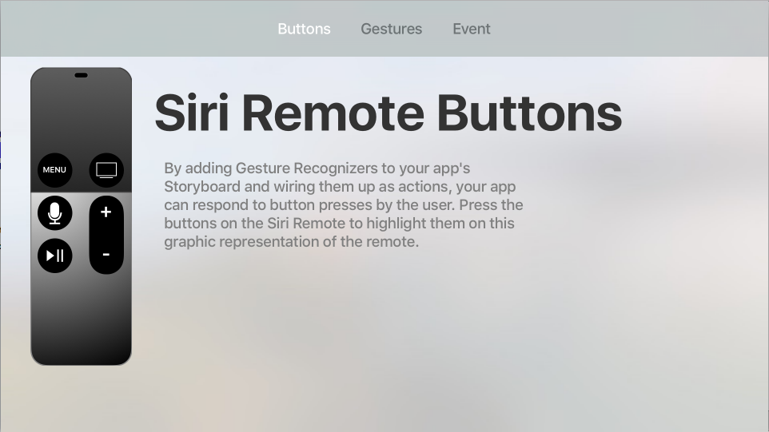](tab-bars-images/tab01.png#lightbox)

The Tab Bar is translucent by default and always appears at the top of the screen. When in focus, a Tab Bar will cover the top 140 pixels of the screen but will quickly slide away when focus shifts to the content area below.

<a name="Tab-Bars-in-tvOS"></a>

## Tab Bars in tvOS

The `UITabViewController` works in a similar manner and serves a similar purpose on tvOS as it does in iOS, with the following key differences:

- Unlike the Tab Bar on iOS which appears at the bottom of the screen, Tab Bars in tvOS occupy the top 140 pixels of the screen and are translucent by default.
- When focus leaves the Tab Bar for the content area below, the Tab Bar will quickly slide off the top of the screen and be hidden. The user can either tap the Menu button once or swipe up on the [Siri Remote](~/ios/tvos/platform/remote-bluetooth.md#The-Siri-Remote) to show the Tab Bar again.
- Swiping down on the Siri Remote will move focus to the content area below the Tab Bar to the first [Focusable Item](~/ios/tvos/app-fundamentals/navigation-focus.md#Focus-and-Selection) in the content being shown. Again, this will hide the Tab Bar once focus shifts.
- Clicking to select a Category displayed in the Tab Bar will switch to that category's content and focus will be switched to the first Focusable Item in that view.
- The number of Categories displayed in the Tab Bar should be fixed and all Categories should be accessible at all times, a given Category should never be disabled.
- Tab Bars do not support customization on tvOS. Additionally, they do not show the **More** Category (like iOS) if there are more Categories than can fit in the Tab Bar.

Apple has the following suggestions for working with Tab Bars:

- **Use Tab Bars to Logically Organize Content** - Use the Tab Bar to logically organize the content that your tvOS app works with. For example, Featured, Top Charts, Purchased and Search.
- **Add Badges to Inform Users of New Content** - You can optionally display a Badge (a red oval with a white number or exclamation point) to inform the user of new content in a Category.
- **Use Badges Sparingly** - Don't clutter the Tab Bar with Badges and only display them where they provide critical information to the user.
- **Limit the Number of Categories** - To reduce complexity and keep you app manageable, don't overload your Tab Bar with Categories and ensure that all of the Categories are visible and not crowded. Simple, short titles work best.
- **Don't Disable a Category** - All Tabs (Categories) should always be visible and enabled at all times. If a given Tab has no content, provide an explanation to the user why. For example, the Purchases Tab will be empty if the user has made no purchases.

<a name="Tab-Bar-Items"></a>

## Tab Bar Items

Each Category (Tab) in the Tab Bar is represented by a Tab Bar Item (`UITabBarItem`). Apple has the following suggestions for working with Tab Bar Items:

- **Use Text Based Tabs** - While the Tab Bar Item is able to be represented as an icon, Apple suggests using text only because a concise title is easier to interpret than an icon.
- **Use Short, Meaningful Nouns or Verbs** - A Tab Bar Item should clearly relay the content that it contains and works best when it is a simple noun (such as Photos, Movies or Music) or verbs (such as Search or Play).

<a name="Tab-Bars-and-Storyboards"></a>

## Tab Bars and Storyboards

The easiest way to work with Tab Bars in a Xamarin.tvOS app is to add them to the app's UI using the iOS Designer.

# [Visual Studio for Mac](#tab/macos)

1. Start a new Xamarin.tvOS app and select **tvOS** > **App** > **Tabbed App**: 

    [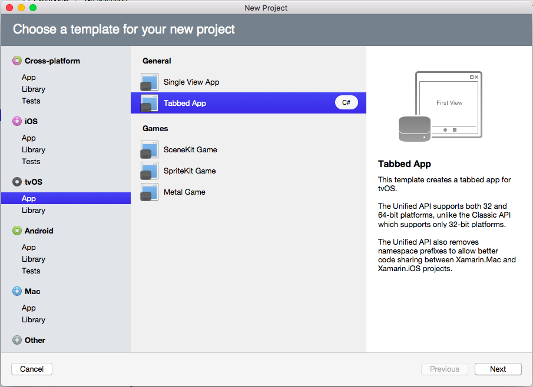](tab-bars-images/tab02.png#lightbox)
1. Follow all of the prompts to create a new Xamarin.tvOS Solution.
1. In the **Solution Pad**, double-click the `Main.storyboard` file and open it for editing.
1. To change the **Icon** or **Title** for a given Category, select the **Tab Bar Item** for the **View Controller** in the **Document Outline**:

    [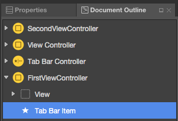](tab-bars-images/tab03a.png#lightbox)
1. Then set the required properties in the **Widget Tab** of the **Properties Explorer**: 

    [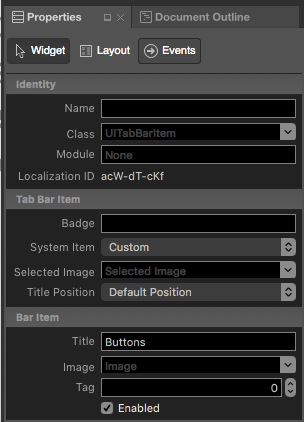](tab-bars-images/tab03.png#lightbox)
1. To add a new Category (Tab), drop a **View Controller** onto your design surface: 

    [](tab-bars-images/tab04.png#lightbox)
1. Control-click and drag from the **Tab View Controller** to the new **View Controller**.
1. From the popup, select **view controllers** to add the new view as a Tab (Category): 

    [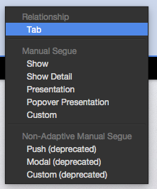](tab-bars-images/tab05.png#lightbox)
1. Design the layout of the UI for each Caterogies content area as normal, by adding UI elements in the iOS Designer.
1. Expose any required events to work with your UI controls in C# code.
1. Name any UI controls that you want to expose in C# code.
1. Save your changes.

# [Visual Studio](#tab/windows)

1. Start a new Xamarin.tvOS app and select **tvOS** > **App** > **Tabbed App**: 

    [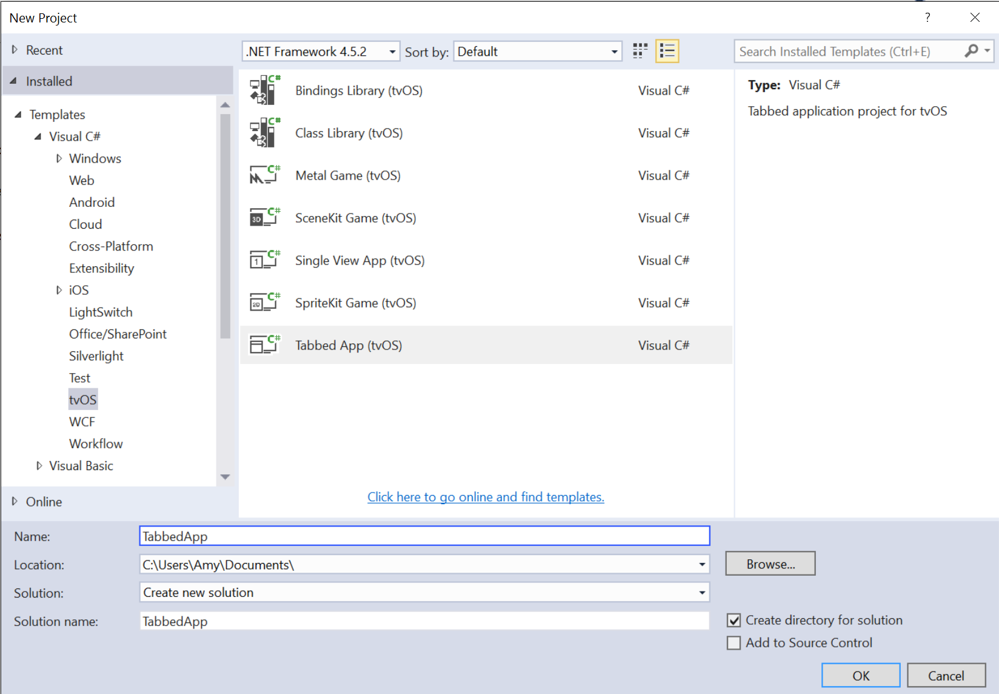](tab-bars-images/tab02vs.png#lightbox)
1. Follow all of the prompts to create a new Xamarin.tvOS Solution.
1. In the **Solution Explorer**, double-click the `Main.storyboard` file and open it for editing.
1. To change the **Icon** or **Title** for a given Category, select the **Tab Bar Item** for the **View Controller** in the **Document Outline**:

    [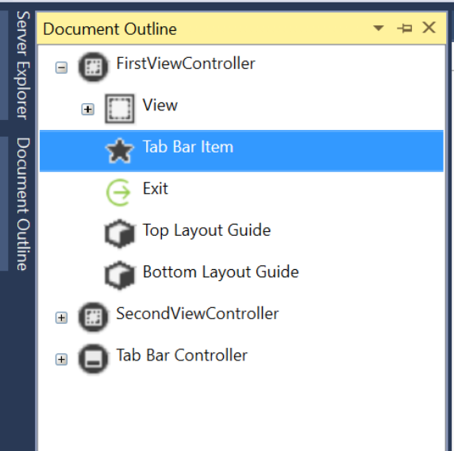](tab-bars-images/tab03avs.png#lightbox)
1. Then set the required properties in the **Widget Tab** of the **Properties Explorer**: 

    [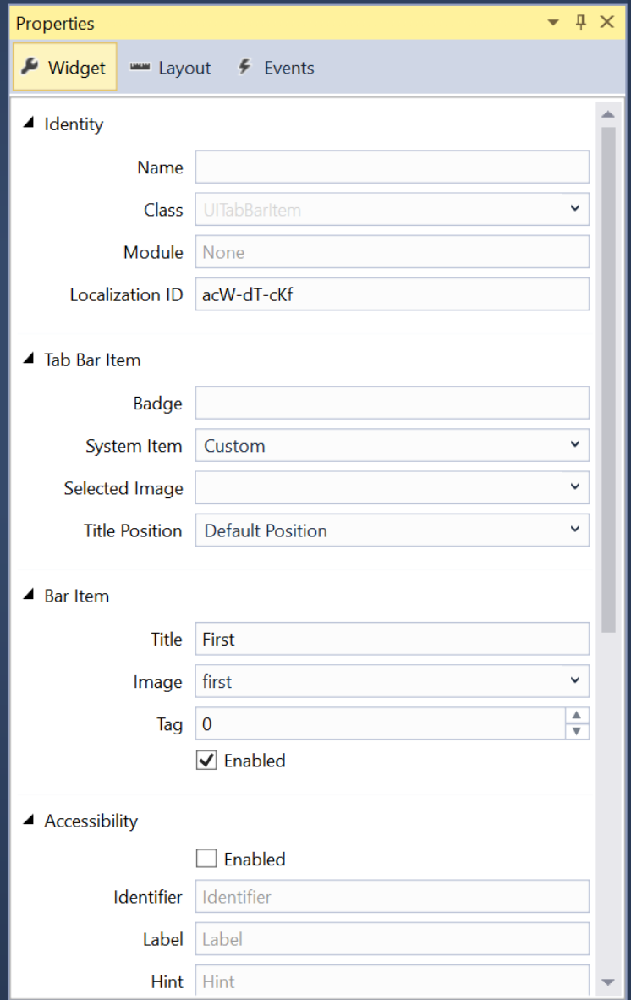](tab-bars-images/tab03vs.png#lightbox)
1. To add a new Category (Tab), drag a **View Controller** from the **Toolbox** and drop it onto your design surface: 

    [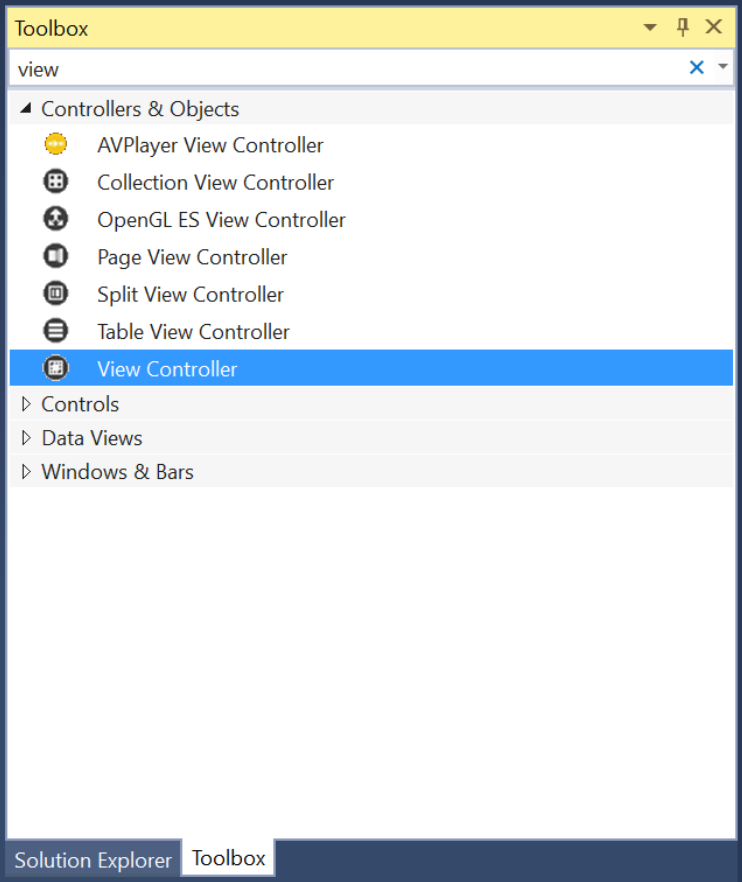](tab-bars-images/tab04vs.png#lightbox)
1. Control-click and drag from the **Tab View Controller** to the new **View Controller**.
1. From the popup, select **view controllers** to add the new view as a Tab (Category): 

    [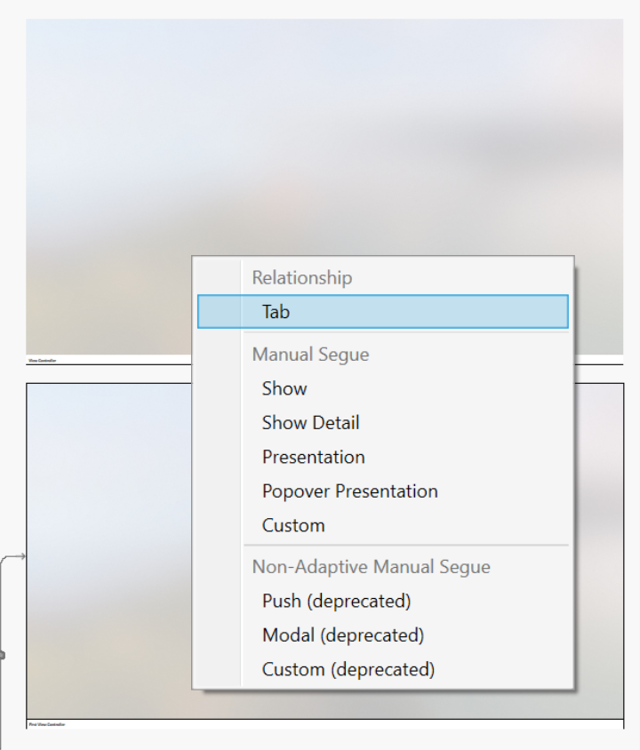](tab-bars-images/tab05vs.png#lightbox)
1. Design the layout of the UI for each Caterogies content area as normal, by adding UI elements in iOS Designer.
1. Expose any required events to work with your UI controls in C# code.
1. Name any UI controls that you want to expose in C# code.
1. Save your changes.

-----

> [!IMPORTANT]
> While it is possible to assign events such as `TouchUpInside` to a UI element (such as a `UIButton`) in the iOS Designer, it will never be called because Apple TV doesn't have a touch screen or support touch events. You should always use the `Primary Action` event when creating event handlers for tvOS user interface elements.

For more information on working with Storyboards, please see our [Hello, tvOS Quick Start Guide](~/ios/tvos/get-started/hello-tvos.md). 

<a name="Working-with-Tab-Bars"></a>

## Working with Tab Bars

Use the `Items` property of the `UITabBar` to access the collection of `UITabBarItems` it contains as a zero (0) indexed array. The `SelectedItem` property will return the currently selected Tab (Category) as a `UITabBarItem`.

<a name="Working-with-Tab-Bar-Items"></a>

## Working with Tab Bar Items

To display a Badge on a given tab (a red oval with white text), use the following code:

```csharp
// Display a badge
TabBar.Items [2].BadgeValue = "10";
```

Which would produce the following results when run:

[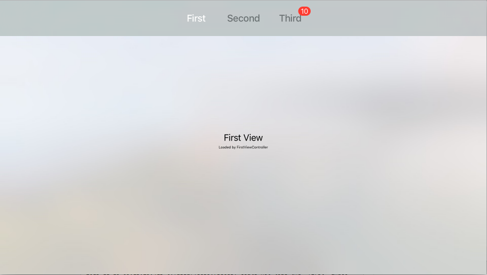](tab-bars-images/tab06.png#lightbox)

Use the `Title` property of the `UITabBarItem` to change the title and the `Image` property to change the icon.

<a name="Summary"></a>

## Summary

This article has covered designing and working with Tab Bar Controller inside of a Xamarin.tvOS app.

## Related Links

- [tvOS Samples](/samples/browse/?products=xamarin&term=Xamarin.iOS%2btvOS)
- [tvOS](https://developer.apple.com/tvos/)
- [tvOS Human Interface Guides](https://developer.apple.com/design/human-interface-guidelines/designing-for-tvos)
- [App Programming Guide for tvOS](https://developer.apple.com/library/prerelease/tvos/documentation/General/Conceptual/AppleTV_PG/)