# Working with tvOS Text and Search Fields in Xamarin

When required, your Xamarin.tvOS app can request small pieces of text from the user (such as User IDs and Passwords) using a Text Field and the on-screen keyboard:

[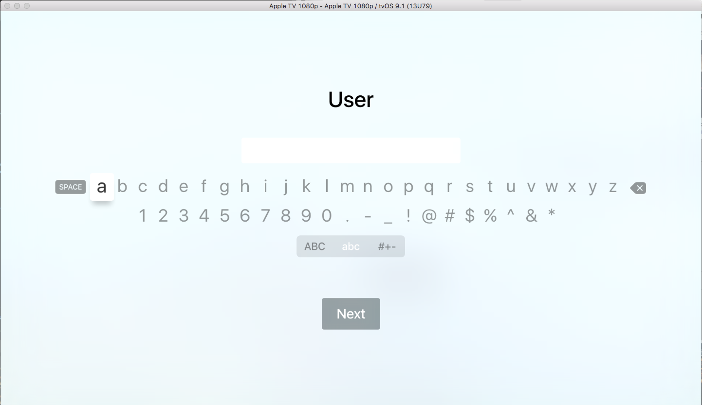](text-fields-and-search-images/intro01.png#lightbox)

You can optionally provide keyword search ability of the app's content using a Search Field:

[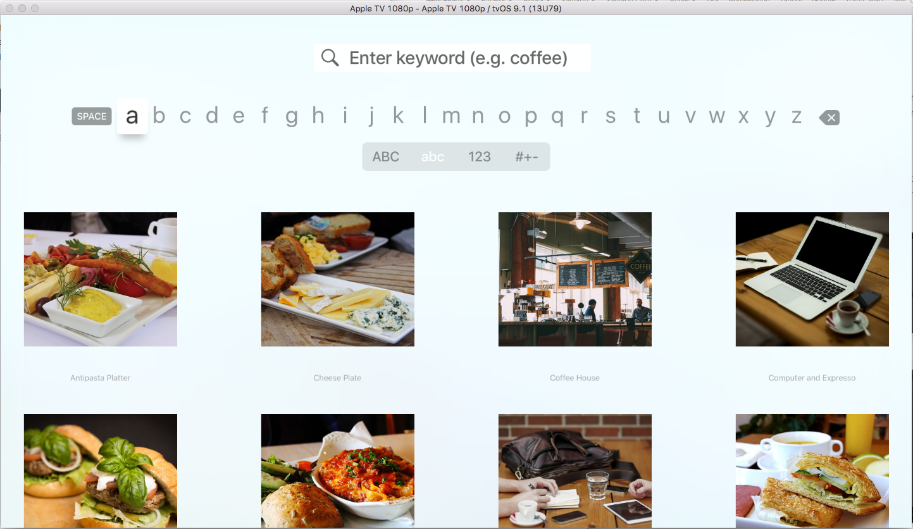](text-fields-and-search-images/intro02.png#lightbox)

This document will cover the details of working with Text and Search Fields in a Xamarin.tvOS app.

<a name="About-Text-and-Search-Fields"></a>

## About Text and Search Fields

As stated above, if required, your Xamarin.tvOS can present one or more Text Fields to collect small amounts of text from the user using an on-screen (or optional bluetooth keyboard depending on the version of tvOS the user has installed).

Additionally, if your app presents large amounts of content to the user (such as a music, movies or a picture collection), you might want to include a Search Field that allows the user to enter a small amount of text to filter the list of available items.

<a name="Text-Fields"></a>

## Text Fields

In tvOS, a Text Field is presented as a fixed-height, rounded-corner entry box that will bring up an on-screen keyboard when the user clicks on it:

[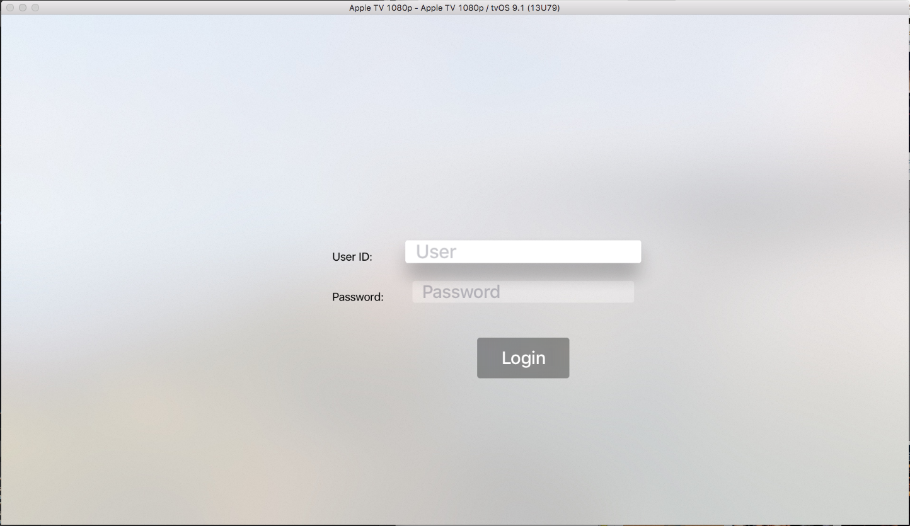](text-fields-and-search-images/text01.png#lightbox)

When the user moves [Focus](~/ios/tvos/app-fundamentals/navigation-focus.md) to a given Text Field, it will grow larger and display a deep shadow. You will need to keep this in mind when designing your User Interface, as Text Fields can overlap other UI elements when in-focus.

Apple has the following suggestions for working with Text Fields:

- **Use Text Entry Sparingly** - Because of the nature of the on-screen keyboard, entering long sections of text or filling out multiple Text Fields is tedious to the user. A better solution is to limit the amount of text entry by using selection lists or [Buttons](~/ios/tvos/user-interface/buttons.md).
- **Use Hints to Communicate Purpose** - Text Field can display placeholder "hints" when empty. Where applicable, use hints to describe the purpose of your Text Field instead of a separate Label.
- **Select the Appropriate Default Keyboard Type** - tvOS provides several different, purpose built keyboard types that you can specify for your Text Field. For example, the Email Address Keyboard can ease entry by allowing the user to select from a list of recently entered addresses.
- **When Appropriate, use Secure Text Fields** - A Secure Text Field presents the characters entered as dots (instead of the real letters). Always use a Secure Text Field when gathering sensitive information such as passwords.

<a name="Keyboards"></a>

## Keyboards

Whenever the user clicks on a Text Field in the User Interface, a linear on-screen keyboard is displayed. The user uses the Touch Surface the [Siri Remote](~/ios/tvos/platform/remote-bluetooth.md#The-Siri-Remote) to select individual letters from the keyboard and enter the requested information:

[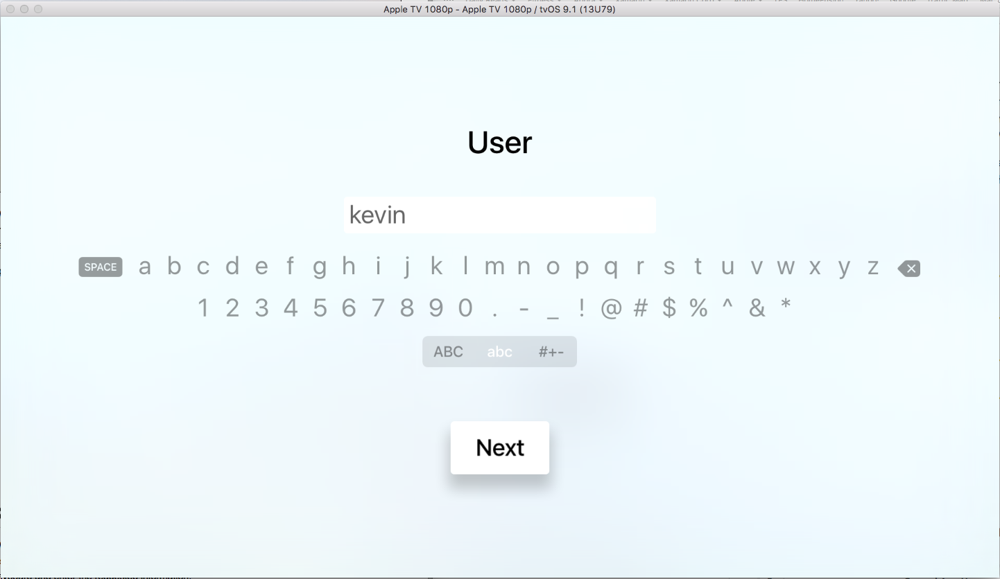](text-fields-and-search-images/keyboard01.png#lightbox)

If there is more than one Text Field on the current view, a **Next** button will automatically be displayed to take the user to the next Text Field. A **Done** button will be displayed for the last Text Field that will end text entry and return the user to the previous screen.

At any time, the user can also press the **Menu** button on the Siri Remote to end text entry and again return to the previous screen.

Apple has the following suggestions for working with on-screen keyboards:

- **Select the Appropriate Default Keyboard Type** - tvOS provides several different, purpose built keyboard types that you can specify for your Text Field. For example, the Email Address Keyboard can ease entry by allowing the user to select from a list of recently entered addresses.
- **When Appropriate, use Keyboard Accessory Views** - In addition to the standard information that is always displayed, optional Accessory Views (such as Images or Labels) can be added to the on-screen keyboard to clarify the purpose of text entry or to assist the user in entering the required information.

For more information about working with the on-screen keyboard, please see Apple's [UIKeyboardType](https://developer.apple.com/library/ios/documentation/UIKit/Reference/UITextInputTraits_Protocol/index.html#//apple_ref/c/tdef/UIKeyboardType), [Managing the Keyboard](https://developer.apple.com/library/tvos/documentation/StringsTextFonts/Conceptual/TextAndWebiPhoneOS/KeyboardManagement/KeyboardManagement.html#//apple_ref/doc/uid/TP40009542-CH5-SW1), [Custom Views for Data Input](https://developer.apple.com/library/tvos/documentation/StringsTextFonts/Conceptual/TextAndWebiPhoneOS/InputViews/InputViews.html#//apple_ref/doc/uid/TP40009542-CH12-SW1) and [Text Programming Guide to iOS](https://developer.apple.com/library/tvos/documentation/StringsTextFonts/Conceptual/TextAndWebiPhoneOS/Introduction/Introduction.html) documentation.

<a name="Search"></a>

## Search

A Search Field present a specialized screen providing a Text Field and on-screen keyboard that allows the user to filter a collection of items that are displayed below the keyboard:

[](text-fields-and-search-images/search01.png#lightbox)

As the user enters letters in the Search Field, the results below will automatically reflect the results of the search. At any time, the user can shift Focus to the results and select one of the items presented.

Apple has the following suggestions for working with Search Fields:

- **Provide Recent Searches** - Because entering text with the Siri Remote can be tedious and users tend to repeat search requests, consider adding a section of Recent Search Results before the current results under the keyboard area.
- **When Possible, Limit the Number of Results** - Because a large list of items can be difficult for the user to parse and navigate, consider limiting the number of returned results.
- **If Appropriate, Provide Search Result Filters** - If the content provided by your app lends itself, consider adding scope bars to allow the user to further filter the search results returned.

For more information, please see Apple's [UISearchController Class Reference](https://developer.apple.com/library/tvos/documentation/UIKit/Reference/UISearchController/index.html).

<a name="Working-with-Text-Fields"></a>

## Working with Text Fields

The easiest way to work with Text Fields in a Xamarin.tvOS app is to add them to the User Interface design using the iOS Designer.

Do the following:

<!-- markdownlint-disable MD001 -->

# [Visual Studio for Mac](#tab/macos)

1. In the **Solution Pad**, double-click the `Main.storyboard` file to open it for editing.
1. Drag one or more **Text Fields** int the design surface onto a View:

    [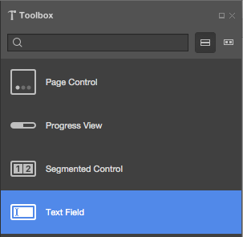](text-fields-and-search-images/text02.png#lightbox)
1. Select the **Text Fields** and give each a unique **Name** in the **Widget** tab of the **Properties Pad**:

    [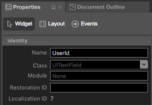](text-fields-and-search-images/text03.png#lightbox)
1. In the **Text Field** section, you can define elements such as the **Placeholder** hint and default **Value**:

    [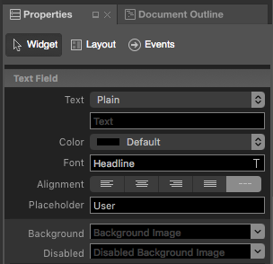](text-fields-and-search-images/text04.png#lightbox)
1. Scroll down to define properties such as **Spell Checking**, **Capitalization** and the default **Keyboard Type**:

    [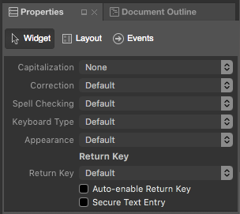](text-fields-and-search-images/text05.png#lightbox)
1. Save the changes to your Storyboard.

# [Visual Studio](#tab/windows)

1. In the **Solution Explorer**, double-click the `Main.storyboard` file to open it for editing.
1. Drag one or more **Text Fields** int the design surface onto a View:

    [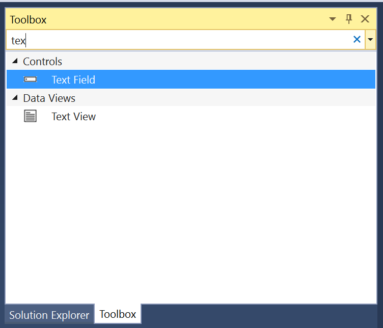](text-fields-and-search-images/text02-vs.png#lightbox)
1. Select the **Text Fields** and give each a unique **Name** in the **Widget** tab of the **Properties Explorer**:

    [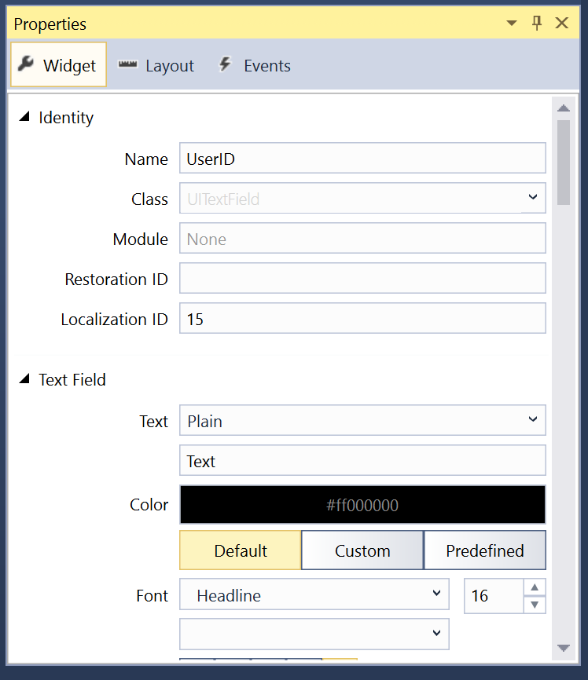](text-fields-and-search-images/text03-vs.png#lightbox)
1. In the **Text Field** section, you can define elements such as the **Placeholder** hint and default **Value**:

    [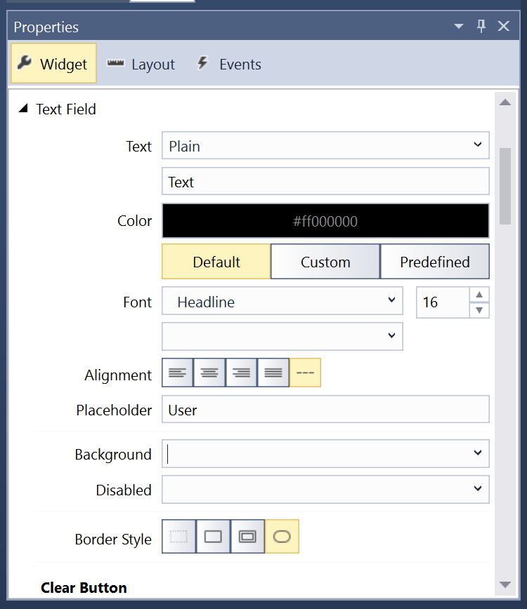](text-fields-and-search-images/text04-vs.png#lightbox)
1. Scroll down to define properties such as **Spell Checking**, **Capitalization** and the default **Keyboard Type**:

    [](text-fields-and-search-images/text05-vs.png#lightbox)
1. Save the changes to your Storyboard.

-----

In code, you can get or set the value of a Text Field using its `Text` property:

```csharp
Console.WriteLine ("User ID {0} and Password {1}", UserId.Text, Password.Text);
```

You can optionally use the `Started` and `Ended` Text Field events to respond to text entry starting and ending.

<a name="Working-with-Search-Fields"></a>

## Working with Search Fields

The easiest way to work with Search Fields in a Xamarin.tvOS app is to add them to the User Interface design using the Interface Designer.

Do the following:

# [Visual Studio for Mac](#tab/macos)

1. In the **Solution Pad**, double-click the `Main.storyboard` file to open it for editing.
1. Drag a new Collection View Controller to the Storyboard to present the results of the user's search:

    [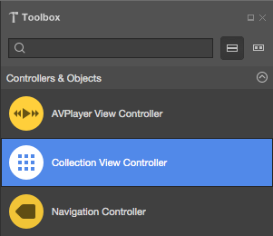](text-fields-and-search-images/search02.png#lightbox)
1. In the **Widget** tab of the **Properties Pad**, use `SearchResultsViewController` for the **Class** and `SearchResults` for the **Storyboard ID**:

    [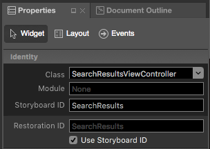](text-fields-and-search-images/search03.png#lightbox)
1. Select the **Cell Prototype** on the design surface.
1. In the **Widget** tab of the **Properties Explorer**, use `SearchResultCell` for the **Class** and `ImageCell` for the **Identifier**:

    [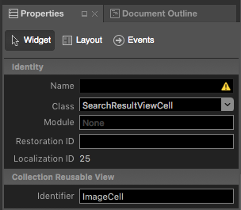](text-fields-and-search-images/search04.png#lightbox)
1. Layout the design of the **Cell Prototype** and expose each element with a unique **Name** in the **Widget** tab of the **Properties Explorer**:

    [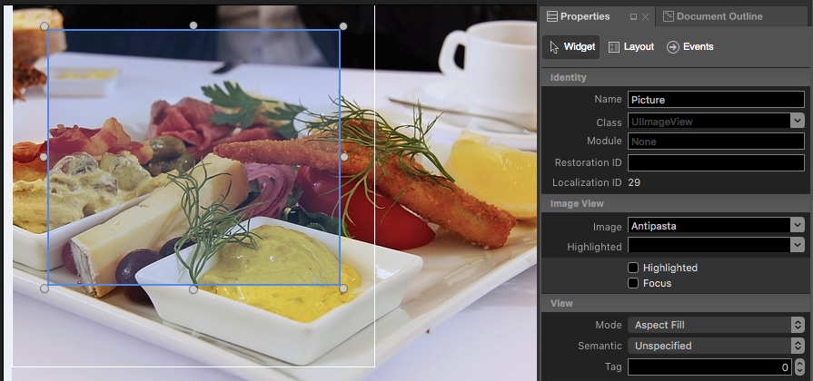](text-fields-and-search-images/search05.png#lightbox)
1. Save the changes to your Storyboard.

# [Visual Studio](#tab/windows)

1. In the **Solution Explorer**, double-click the `Main.storyboard` file to open it for editing.
1. Drag a new Collection View Controller to the Storyboard to present the results of the user's search:

    [](text-fields-and-search-images/seach02-vs.png#lightbox)
1. In the **Widget** tab of the **Properties Explorer**, use `SearchResultsViewController` for the **Class** and `SearchResults` for the **Storyboard ID**:

    [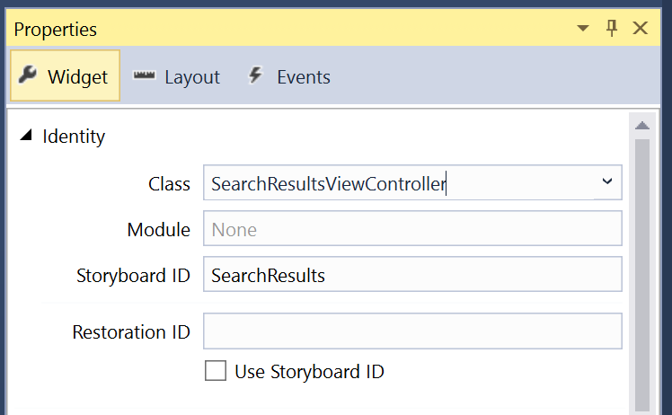](text-fields-and-search-images/search03-vs.png#lightbox)
1. Select the **Cell Prototype** on the design surface.
1. In the **Widget** tab of the **Properties Explorer**, use `SearchResultCell` for the **Class** and `ImageCell` for the **Identifier**:

    [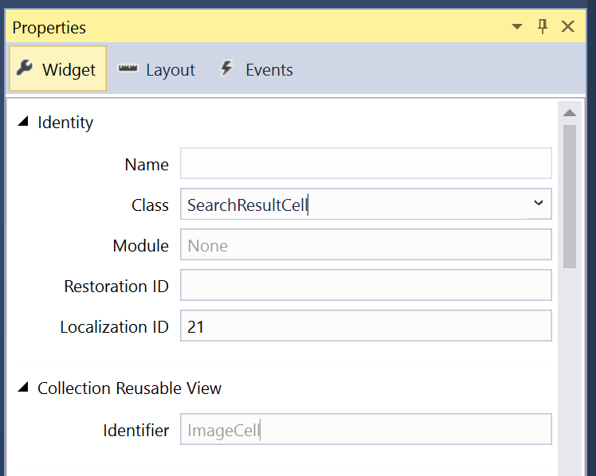](text-fields-and-search-images/search04-vs.png#lightbox)
1. Layout the design of the **Cell Prototype** and expose each element with a unique **Name** in the **Widget** tab of the **Properties Explorer**:

    [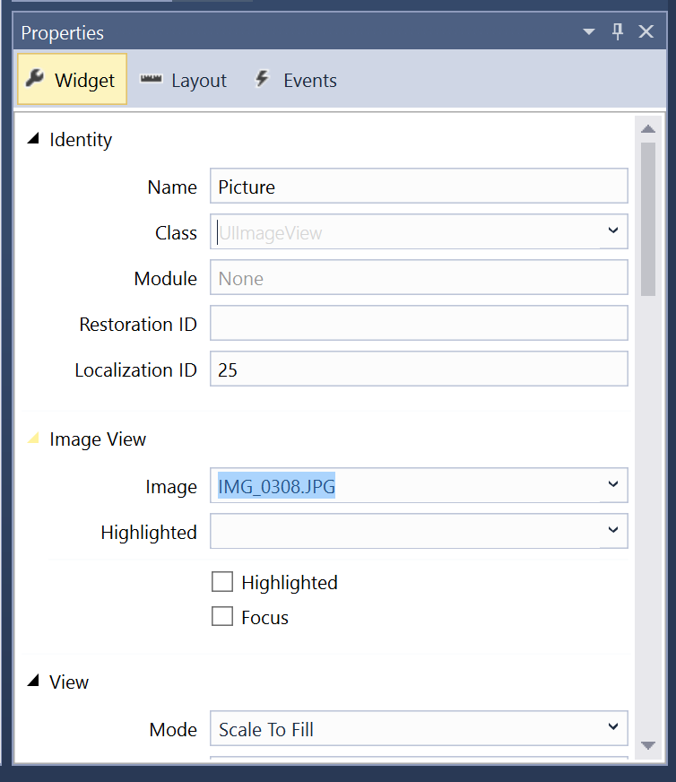](text-fields-and-search-images/search05-vs.png#lightbox)
1. Save the changes to your Storyboard.

-----

<a name="Provide-a-Data-Model"></a>

### Provide a Data Model

# [Visual Studio for Mac](#tab/macos)

Next, you will need to provide a class to act as the Data Model for the results that the user will be searching for. In the **Solution Explorer**, right-click the Project Name and select **Add** > **New File...** > **General** > **Empty Class** and provide a **Name**:

[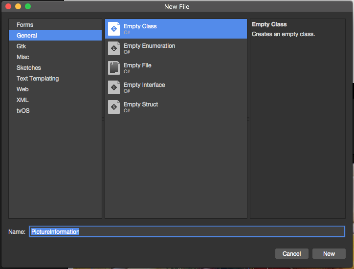](text-fields-and-search-images/search06.png#lightbox)

# [Visual Studio](#tab/windows)

Next, you will need to provide a class to act as the Data Model for the results that the user will be searching for. In the **Solution Explorer**, right-click the Project Name and select **Add** > **New Item...** > **Apple** > **Misc** > **Class** and provide a **Name**:

[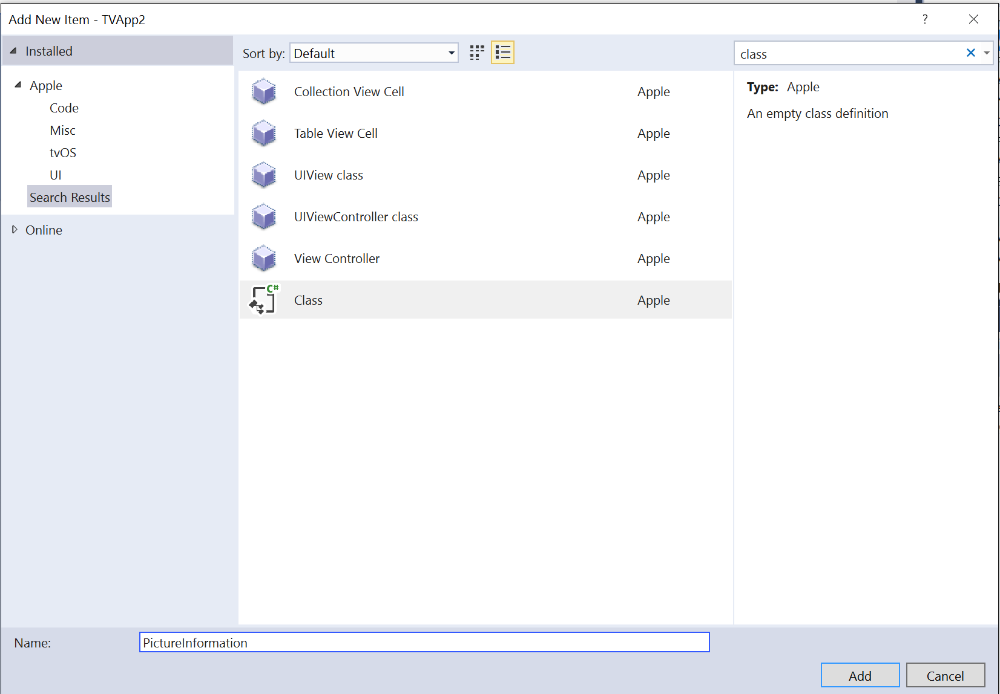](text-fields-and-search-images/search06-vs.png#lightbox)

-----

As an example, an app that allows the user to search a collection of Pictures by Title and Keyword might look like the following:

```csharp
using System;
using Foundation;

namespace tvText
{
    public class PictureInformation : NSObject
    {
        #region Computed Properties
        public string Title { get; set;}
        public string ImageName { get; set;}
        public string Keywords { get; set;}
        #endregion

        #region Constructors
        public PictureInformation (string title, string imageName, string keywords)
        {
            // Initialize
            this.Title = title;
            this.ImageName = imageName;
            this.Keywords = keywords;
        }
        #endregion
    }
}
```

<a name="The-Collection-View-Cell"></a>

### The Collection View Cell

With the Data Model in place, edit the **Prototype Cell** (`SearchResultViewCell.cs`) and make it look lie the following:

```csharp
using Foundation;
using System;
using UIKit;

namespace tvText
{
    public partial class SearchResultViewCell : UICollectionViewCell
    {
        #region Private Variables
        private PictureInformation _pictureInfo = null;
        #endregion

        #region Computed Properties
        public PictureInformation PictureInfo {
            get { return _pictureInfo; }
            set {
                _pictureInfo = value;
                UpdateUI ();
            }
        }
        #endregion

        #region Constructors
        public SearchResultViewCell (IntPtr handle) : base (handle)
        {
            // Initialize
            UpdateUI ();
        }
        #endregion

        #region Private Methods
        private void UpdateUI ()
        {
            // Anything to process?
            if (PictureInfo == null) return;

            try {
                Picture.Image = UIImage.FromBundle (PictureInfo.ImageName);
                Picture.AdjustsImageWhenAncestorFocused = true;
                Title.Text = PictureInfo.Title;
                TextColor = UIColor.LightGray;
            } catch {
                // Ignore errors if view isn't fully loaded
            }
        }
        #endregion
    }

}
```

The `UpdateUI` method will be used to display individual fields of the **PictureInformation** items (the `PictureInfo` property) in the named UI elements each time the property is updated. For example, the Image and Title associated with the Picture.

<a name="The-Collection-View-Controller"></a>

### The Collection View Controller

Next, edit the Search Results Collection View Controller (`SearchResultsViewController.cs`), and make it look like the following:

```csharp
using Foundation;
using System;
using UIKit;
using System.Collections.Generic;

namespace tvText
{
    public partial class SearchResultsViewController : UICollectionViewController , IUISearchResultsUpdating
    {
        #region Constants
        public const string CellID = "ImageCell";
        #endregion

        #region Private Variables
        private string _searchFilter = "";
        #endregion

        #region Computed Properties
        public List<PictureInformation> AllPictures { get; set;}
        public List<PictureInformation> FoundPictures { get; set; }
        public string SearchFilter {
            get { return _searchFilter; }
            set {
                _searchFilter = value.ToLower();
                FindPictures ();
                CollectionView?.ReloadData ();
            }
        }
        #endregion

        #region Constructors
        public SearchResultsViewController (IntPtr handle) : base (handle)
        {
            // Initialize
            this.AllPictures = new List<PictureInformation> ();
            this.FoundPictures = new List<PictureInformation> ();
            PopulatePictures ();
            FindPictures ();

        }
        #endregion

        #region Private Methods
        private void PopulatePictures ()
        {
            // Clear list
            AllPictures.Clear ();

            // Add images
            AllPictures.Add (new PictureInformation ("Antipasta Platter","Antipasta","cheese,grapes,tomato,coffee,meat,plate"));
            AllPictures.Add (new PictureInformation ("Cheese Plate", "CheesePlate", "cheese,plate,bread"));
            AllPictures.Add (new PictureInformation ("Coffee House", "CoffeeHouse", "coffee,people,menu,restaurant,cafe"));
            AllPictures.Add (new PictureInformation ("Computer and Expresso", "ComputerExpresso", "computer,coffee,expresso,phone,notebook"));
            AllPictures.Add (new PictureInformation ("Hamburger", "Hamburger", "meat,bread,cheese,tomato,pickle,lettus"));
            AllPictures.Add (new PictureInformation ("Lasagna Dinner", "Lasagna", "salad,bread,plate,lasagna,pasta"));
            AllPictures.Add (new PictureInformation ("Expresso Meeting", "PeopleExpresso", "people,bag,phone,expresso,coffee,table,tablet,notebook"));
            AllPictures.Add (new PictureInformation ("Soup and Sandwich", "SoupAndSandwich", "soup,sandwich,bread,meat,plate,tomato,lettus,egg"));
            AllPictures.Add (new PictureInformation ("Morning Coffee", "TabletCoffee", "tablet,person,man,coffee,magazine,table"));
            AllPictures.Add (new PictureInformation ("Evening Coffee", "TabletMagCoffee", "tablet,magazine,coffee,table"));
        }

        private void FindPictures ()
        {
            // Clear list
            FoundPictures.Clear ();

            // Scan each picture for a match
            foreach (PictureInformation picture in AllPictures) {
                if (SearchFilter == "") {
                    // If no search term, everything matches
                    FoundPictures.Add (picture);
                } else if (picture.Title.Contains (SearchFilter) || picture.Keywords.Contains (SearchFilter)) {
                    // If the search term is in the title or keywords, we've found a match
                    FoundPictures.Add (picture);
                }
            }
        }
        #endregion

        #region Override Methods
        public override nint NumberOfSections (UICollectionView collectionView)
        {
            // Only one section in this collection
            return 1;
        }

        public override nint GetItemsCount (UICollectionView collectionView, nint section)
        {
            // Return the number of matching pictures
            return FoundPictures.Count;
        }

        public override UICollectionViewCell GetCell (UICollectionView collectionView, NSIndexPath indexPath)
        {
            // Get a new cell and return it
            var cell = collectionView.DequeueReusableCell (CellID, indexPath);
            return (UICollectionViewCell)cell;
        }

        public override void WillDisplayCell (UICollectionView collectionView, UICollectionViewCell cell, NSIndexPath indexPath)
        {
            // Grab the cell
            var currentCell = cell as SearchResultViewCell;
            if (currentCell == null)
                throw new Exception ("Expected to display a `SearchResultViewCell`.");

            // Display the current picture info in the cell
            var item = FoundPictures [indexPath.Row];
            currentCell.PictureInfo = item;
        }

        public override void ItemSelected (UICollectionView collectionView, NSIndexPath indexPath)
        {
            // If this Search Controller was presented as a modal view, close
            // it before continuing
            // DismissViewController (true, null);

            // Grab the picture being selected and report it
            var picture = FoundPictures [indexPath.Row];
            Console.WriteLine ("Selected: {0}", picture.Title);
        }

        public void UpdateSearchResultsForSearchController (UISearchController searchController)
        {
            // Save the search filter and update the Collection View
            SearchFilter = searchController.SearchBar.Text ?? string.Empty;
        }

        public override void DidUpdateFocus (UIFocusUpdateContext context, UIFocusAnimationCoordinator coordinator)
        {
            var previousItem = context.PreviouslyFocusedView as SearchResultViewCell;
            if (previousItem != null) {
                UIView.Animate (0.2, () => {
                    previousItem.TextColor = UIColor.LightGray;
                });
            }

            var nextItem = context.NextFocusedView as SearchResultViewCell;
            if (nextItem != null) {
                UIView.Animate (0.2, () => {
                    nextItem.TextColor = UIColor.Black;
                });
            }
        }
        #endregion
    }
}
```

First, the `IUISearchResultsUpdating` Interface is added to the class to handle the Search Controller filter being updated by the user:

```csharp
public partial class SearchResultsViewController : UICollectionViewController , IUISearchResultsUpdating
```

A constant is also defined to specify the ID of the **Prototype Cell** (that matches the ID defined in the Interface Designer above) that will be used later when the Collection Controller requests a new Cell:

```csharp
public const string CellID = "ImageCell";
```

Storage is created for the full list of items being searched, the search filter term and the a list of items matching that term:

```csharp
private string _searchFilter = "";
...

public List<PictureInformation> AllPictures { get; set;}
public List<PictureInformation> FoundPictures { get; set; }
public string SearchFilter {
    get { return _searchFilter; }
    set {
        _searchFilter = value.ToLower();
        FindPictures ();
        CollectionView?.ReloadData ();
    }
}
```

When the `SearchFilter` is changed, the list of matching items is updated and the Collection View's content is reloaded. The `FindPictures` routine is responsible for finding items that match the new search term:

```csharp
private void FindPictures ()
{
    // Clear list
    FoundPictures.Clear ();

    // Scan each picture for a match
    foreach (PictureInformation picture in AllPictures) {
        if (SearchFilter == "") {
            // If no search term, everything matches
            FoundPictures.Add (picture);
        } else if (picture.Title.Contains (SearchFilter) || picture.Keywords.Contains (SearchFilter)) {
            // If the search term is in the title or keywords, we've found a match
            FoundPictures.Add (picture);
        }
    }
}
```

The value of the `SearchFilter` will be updated (which will update the Results Collection View) when the user changes the Filter in the Search Controller:

```csharp
public void UpdateSearchResultsForSearchController (UISearchController searchController)
{
    // Save the search filter and update the Collection View
    SearchFilter = searchController.SearchBar.Text ?? string.Empty;
}
```

The `PopulatePictures` method initially populates the collection of available items:

```csharp
private void PopulatePictures ()
{
    // Clear list
    AllPictures.Clear ();

    // Add images
    AllPictures.Add (new PictureInformation ("Antipasta Platter","Antipasta","cheese,grapes,tomato,coffee,meat,plate"));
    ...
}
```

For the sake of this example, all of the sample data is being created in memory when the Collection View Controller loads. In a real app, this data would probably be read from a database or web service, and only as needed to keep from overrunning the Apple TV's limited memory.

The `NumberOfSections` and `GetItemsCount` methods provide the number of matched items:

```csharp
public override nint NumberOfSections (UICollectionView collectionView)
{
    // Only one section in this collection
    return 1;
}

public override nint GetItemsCount (UICollectionView collectionView, nint section)
{
    // Return the number of matching pictures
    return FoundPictures.Count;
}
```

The `GetCell` method returns a new **Prototype Cell** (based on the `CellID` defined above in the Storyboard) for each item in the Collection View:

```csharp
public override UICollectionViewCell GetCell (UICollectionView collectionView, NSIndexPath indexPath)
{
    // Get a new cell and return it
    var cell = collectionView.DequeueReusableCell (CellID, indexPath);
    return (UICollectionViewCell)cell;
}
```

The `WillDisplayCell` method is called prior to the Cell being displayed so it can be configured:

```csharp
public override void WillDisplayCell (UICollectionView collectionView, UICollectionViewCell cell, NSIndexPath indexPath)
{
    // Grab the cell
    var currentCell = cell as SearchResultViewCell;
    if (currentCell == null)
        throw new Exception ("Expected to display a `SearchResultViewCell`.");

    // Display the current picture info in the cell
    var item = FoundPictures [indexPath.Row];
    currentCell.PictureInfo = item;
}
```

The `DidUpdateFocus` method provides visual feedback to the user as they highlight items in the Results Collection View:

```csharp
public override void DidUpdateFocus (UIFocusUpdateContext context, UIFocusAnimationCoordinator coordinator)
{
    var previousItem = context.PreviouslyFocusedView as SearchResultViewCell;
    if (previousItem != null) {
        UIView.Animate (0.2, () => {
            previousItem.TextColor = UIColor.LightGray;
        });
    }

    var nextItem = context.NextFocusedView as SearchResultViewCell;
    if (nextItem != null) {
        UIView.Animate (0.2, () => {
            nextItem.TextColor = UIColor.Black;
        });
    }
}
```

Finally, the `ItemSelected` method handles the user selecting an item  (clicking on the Touch Surface with the Siri Remote) in the Results Collection View:

```csharp
public override void ItemSelected (UICollectionView collectionView, NSIndexPath indexPath)
{
    // If this Search Controller was presented as a modal view, close
    // it before continuing
    // DismissViewController (true, null);

    // Grab the picture being selected and report it
    var picture = FoundPictures [indexPath.Row];
    Console.WriteLine ("Selected: {0}", picture.Title);
}
```

If the Search Field was presented as a modal dialog view (over the top of the view calling it), use the `DismissViewController` method to dismiss the Search View when the user selects an item. For this example, the Search Field is presented as the content of a Tab View tab, so it is not being dismissed here.

For more information on Collection Views, please see our [Working with Collection Views](~/ios/tvos/user-interface/collection-views.md) documentation.

<a name="Presenting the Search Field"></a>

### Presenting the Search Field

There are two main ways that a Search Field (and its associated on-screen keyboard and search results) can be presented to the user in tvOS:

- **Modal Dialog View** - The Search Field can be presented over the current View and View Controller as a full screen modal dialog view. This is usually done in response to the user clicking a Button or other UI element. The dialog is dismissed when the user selects an item from the search results.
- **View Contents** - The Search Field is a direct part of a given View. For example, as the contents of a Search Tab in a Tab View Controller.

For the example of a searchable list of pictures given above, the Search Field is presented as View Contents in the Search Tab and the Search Tab View Controller looks like the following:

```csharp
using System;
using UIKit;

namespace tvText
{
    public partial class SecondViewController : UIViewController
    {
        #region Constants
        public const string SearchResultsID = "SearchResults";
        #endregion

        #region Computed Properties
        public SearchResultsViewController ResultsController { get; set;}
        #endregion

        #region Constructors
        public SecondViewController (IntPtr handle) : base (handle)
        {
        }
        #endregion

        #region Private Methods
        public void ShowSearchController ()
        {
            // Build an instance of the Search Results View Controller from the Storyboard
            ResultsController = Storyboard.InstantiateViewController (SearchResultsID) as SearchResultsViewController;
            if (ResultsController == null)
                throw new Exception ("Unable to instantiate a SearchResultsViewController.");

            // Create an initialize a new search controller
            var searchController = new UISearchController (ResultsController) {
                SearchResultsUpdater = ResultsController,
                HidesNavigationBarDuringPresentation = false
            };

            // Set any required search parameters
            searchController.SearchBar.Placeholder = "Enter keyword (e.g. coffee)";

            // The Search Results View Controller can be presented as a modal view
            // PresentViewController (searchController, true, null);

            // Or in the case of this sample, the Search View Controller is being
            // presented as the contents of the Search Tab directly. Use either one
            // or the other method to display the Search Controller (not both).
            var container = new UISearchContainerViewController (searchController);
            var navController = new UINavigationController (container);
            AddChildViewController (navController);
            View.Add (navController.View);
        }
        #endregion

        #region Override Methods
        public override void ViewDidLoad ()
        {
            base.ViewDidLoad ();

            // If the Search Controller is being displayed as the content
            // of the search tab, include it here.
            ShowSearchController ();
        }

        public override void ViewDidAppear (bool animated)
        {
            base.ViewDidAppear (animated);

            // If the Search Controller is being presented as a modal view,
            // call it here to display it over the contents of the Search
            // tab.
            // ShowSearchController ();
        }
        #endregion
    }
}
```

First, a constant is defined that matches the **Storyboard Identifier** that was assigned to the Search Results Collection View controller in the Interface Designer:

```csharp
public const string SearchResultsID = "SearchResults";
```

Next, the `ShowSearchController` method creates a new Search View Collection Controller and displays it was needed:

```csharp
public void ShowSearchController ()
{
    // Build an instance of the Search Results View Controller from the Storyboard
    ResultsController = Storyboard.InstantiateViewController (SearchResultsID) as SearchResultsViewController;
    if (ResultsController == null)
        throw new Exception ("Unable to instantiate a SearchResultsViewController.");

    // Create an initialize a new search controller
    var searchController = new UISearchController (ResultsController) {
        SearchResultsUpdater = ResultsController,
        HidesNavigationBarDuringPresentation = false
    };

    // Set any required search parameters
    searchController.SearchBar.Placeholder = "Enter keyword (e.g. coffee)";

    // The Search Results View Controller can be presented as a modal view
    // PresentViewController (searchController, true, null);

    // Or in the case of this sample, the Search View Controller is being
    // presented as the contents of the Search Tab directly. Use either one
    // or the other method to display the Search Controller (not both).
    var container = new UISearchContainerViewController (searchController);
    var navController = new UINavigationController (container);
    AddChildViewController (navController);
    View.Add (navController.View);
}
```

In the above method, once a `SearchResultsViewController` has been instantiated from the Storyboard, a new `UISearchController` is created to present the Search Field and on-screen keyboard to the user. The Search Results collection (as defined by the `SearchResultsViewController`) will be displayed under this keyboard.

Next, the `SearchBar` is configured with information such as the **Placeholder** hint. This provides information to the user about the type of search being preformed.

Then the Search Field is presented to the user in one of two ways:

- **Modal Dialog View** - The `PresentViewController` method is called to present the search over the existing view, full-screen.
- **View Contents** - A `UISearchContainerViewController` is created to contain the Search Controller. A `UINavigationController` is created to contain the Search Container, then the Navigation Controller is added to the View Controller `AddChildViewController (navController)`, and the View presented `View.Add (navController.View)`.

Finally, and again based on the presentation type, either the `ViewDidLoad` or `ViewDidAppear` method will call the `ShowSearchController` method to present the search to the user:

```csharp
public override void ViewDidLoad ()
{
    base.ViewDidLoad ();

    // If the Search Controller is being displayed as the content
    // of the search tab, include it here.
    ShowSearchController ();
}

public override void ViewDidAppear (bool animated)
{
    base.ViewDidAppear (animated);

    // If the Search Controller is being presented as a modal view,
    // call it here to display it over the contents of the Search
    // tab.
    // ShowSearchController ();
}
```

When the app is run and the Search Tab selected by the user, the full unfiltered list of items will be presented to the user:

[](text-fields-and-search-images/intro02.png#lightbox)

As the user begins to enter a search term, the list of results will be filtered by that term and updated automatically:

[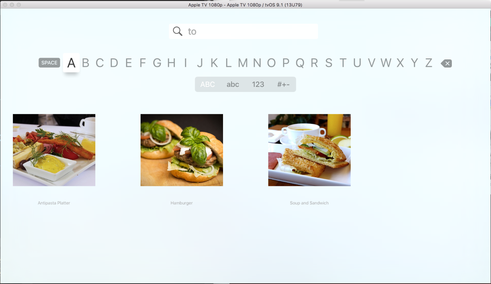](text-fields-and-search-images/intro03.png#lightbox)

At any time, the user can switch Focus to an item in the search results and click the Touch Surface of the Siri Remote to select it.

<a name="Summary"></a>

## Summary

This article has covered designing and working with Text and Search Fields inside of a Xamarin.tvOS app. It showed how to create Text and Search Collection contents in the Interface Designer and it showed to two different ways that a Search Field could be presented to the user in tvOS.

## Related Links

- [tvOS Samples](/samples/browse/?products=xamarin&term=Xamarin.iOS%2btvOS)
- [tvOS](https://developer.apple.com/tvos/)
- [tvOS Human Interface Guides](https://developer.apple.com/design/human-interface-guidelines/designing-for-tvos)
- [App Programming Guide for tvOS](https://developer.apple.com/library/prerelease/tvos/documentation/General/Conceptual/AppleTV_PG/)