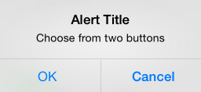
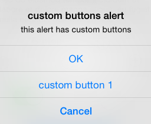

# Displaying Alerts in Xamarin.iOS

Starting with iOS 8, UIAlertController has completed replaced UIActionSheet and UIAlertView both of which are now deprecated.

Unlike the classes it replaced, which are subclasses of UIView, UIAlertController is a subclass of UIViewController.

Use `UIAlertControllerStyle` to indicate the type of alert to display. These alerts types are:

- **UIAlertControllerStyleActionSheet**
  - Pre-iOS 8 this would have been a UIActionSheet
- **UIAlertControllerStyleAlert**
  - Pre-iOS 8 this would have been UIAlertView 

There are three necessary steps to take when creating an Alert Controller:

- Create and configure the Alert with a:
  - title
  - message
  - preferredStyle

- (Optional) Add a text field
- Add the Required actions
- Present the View Controller

The simplest alert contains a single button, as shown in this screenshot:

 

The code to display a simple alert is as follows:

```csharp
okayButton.TouchUpInside += (sender, e) => {

    //Create Alert
    var okAlertController = UIAlertController.Create ("Title", "The message", UIAlertControllerStyle.Alert);

    //Add Action
    okAlertController.AddAction (UIAlertAction.Create ("OK", UIAlertActionStyle.Default, null));

    // Present Alert
    PresentViewController (okAlertController, true, null);
};
```

Displaying an alert with multiple options, is done in a similar fashion but add two actions. For example, the following screenshot shows an alert with two buttons:

 

```csharp
okayCancelButton.TouchUpInside += ((sender, e) => {

    //Create Alert
    var okCancelAlertController = UIAlertController.Create("Alert Title", "Choose from two buttons", UIAlertControllerStyle.Alert);

    //Add Actions
    okCancelAlertController.AddAction(UIAlertAction.Create("OK", UIAlertActionStyle.Default, alert => Console.WriteLine ("Okay was clicked")));
    okCancelAlertController.AddAction(UIAlertAction.Create("Cancel", UIAlertActionStyle.Cancel, alert => Console.WriteLine ("Cancel was clicked")));

    //Present Alert
    PresentViewController(okCancelAlertController, true, null);
});
```

Alerts can also display an action sheet, similar to the screenshot below:

 

Buttons are added to the alert with the `AddAction` method:

```csharp
actionSheetButton.TouchUpInside += ((sender, e) => {

    // Create a new Alert Controller
    UIAlertController actionSheetAlert = UIAlertController.Create("Action Sheet", "Select an item from below", UIAlertControllerStyle.ActionSheet);

    // Add Actions
    actionSheetAlert.AddAction(UIAlertAction.Create("OK",UIAlertActionStyle.Default, (action) => Console.WriteLine ("Item One pressed.")));

    actionSheetAlert.AddAction(UIAlertAction.Create("custom button 1",UIAlertActionStyle.Default, (action) => Console.WriteLine ("Item Two pressed.")));

    actionSheetAlert.AddAction(UIAlertAction.Create("Cancel",UIAlertActionStyle.Cancel, (action) => Console.WriteLine ("Cancel button pressed.")));

    // Required for iPad - You must specify a source for the Action Sheet since it is
    // displayed as a popover
    UIPopoverPresentationController presentationPopover = actionSheetAlert.PopoverPresentationController;
    if (presentationPopover!=null) {
        presentationPopover.SourceView = this.View;
        presentationPopover.PermittedArrowDirections = UIPopoverArrowDirection.Up;
    }

    // Display the alert
    this.PresentViewController(actionSheetAlert,true,null);
});
```

## Related Links

- [Controls (sample)](/samples/xamarin/ios-samples/controls)
- [Alert Controller](https://github.com/xamarin/recipes/tree/master/Recipes/ios/standard_controls/alertcontroller)