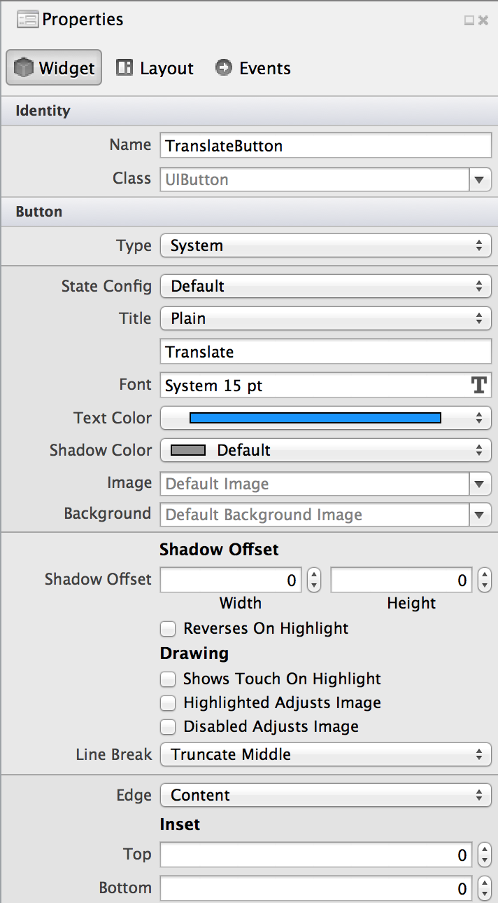
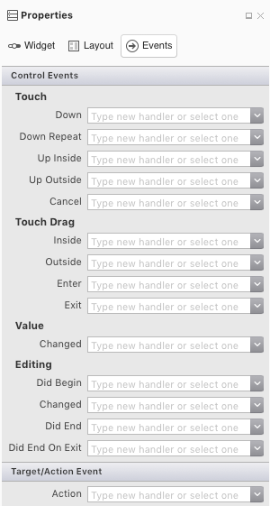

# Buttons in Xamarin.iOS

In iOS, the `UIButton` class represents a button control.

A button's properties can be modified either programmatically or with the
**Properties Window or Pad** of the iOS Designer:



## Creating a button programmatically

A `UIButton` can be created with only a few lines of code.

- Instantiate a button and specify its type:

  ```csharp
  UIButton myButton = new UIButton(UIButtonType.System);
  ```

  The button's type is specified by a `UIButtonType` property:

  - `UIButtonType.System` - A general-purpose button
  - `UIButtonType.DetailDisclosure` - Indicates the availability of detailed information, usually about a specific item in a table
  - `UIButtonType.InfoDark` - Indicates the availability of configuration information; dark-colored
  - `UIButtonType.InfoLight` - Indicates the availability of configuration information; light-colored
  - `UIButtonType..AddContact` - Indicates that a contact can be added
  - `UIButtonType.Custom` - Customizable button

  For more information about the different button types, take a look at:
  
  - The [Custom button types](#custom-button-types) section of this document
  - The [Button types](https://github.com/xamarin/recipes/tree/master/Recipes/ios/standard_controls/buttons/create_different_types_of_buttons) 
    recipe
  - Apple's [iOS Human Interface Guidelines](https://developer.apple.com/design/human-interface-guidelines/ios/controls/buttons/).

- Define the button's size and position:

  ```csharp
  myButton.Frame = new CGRect(25, 25, 300, 150);
  ```

- Set the button's text. Use the `SetTitle` method, which requires the text
  and a `UIControlState` value for button state:

  ```csharp
  myButton.SetTitle("Hello, World!", UIControlState.Normal);
  ```
  
  The button's state types are listed below:
  
  - `UIControlState.Normal`
  - `UIControlState.Highlighted`
  - `UIControlState.Disabled`
  - `UIControlState.Selected`
  - `UIControlState.Focused`
  - `UIControlState.Application`
  - `UIControlState.Reserved`
  
  For more information about styling a button and setting its text, refer
  to:

  - The [Styling a button](#styling-a-button) section of this document
  - The [Set button text](https://github.com/xamarin/recipes/tree/master/Recipes/ios/standard_controls/buttons/set_button_text)
    recipe.

## Handling a button tap

To respond to a button tap, provide a handler for the button's
`TouchUpInside` event:

```csharp
myButton.TouchUpInside += (sender, e) => {
    DoSomething();
};
```

> [!NOTE]
> `TouchUpInside` is not the only available button event. `UIButton` is a
> child class of `UIControl`, which defines
> [many different events](xref:UIKit.UIControlEvent).

### Using the iOS Designer to specify button event handlers

Use the **Events** tab of the **Properties Pad** to specify event handlers
for a button's various events.

For the appropriate event, either type the name of a new event handler or
select one from the list. Doing this will create an event handler in
the code for the button's view controller.



## Styling a button

`UIButton` controls can exist in a number of different states, each
specified by a `UIControlState` value – `Normal`, `Disabled`,
`Focused`, `Highlighted`, etc. Each state can be given a unique style,
specified programmatically or with the iOS Designer.

> [!NOTE]
> For a complete list of all `UIControlState` values, take a look at the
> [`UIKit.UIControlState enumeration`](xref:UIKit.UIControlState)
> documentation.

For example, to set the title color and shadow color for
`UIControlState.Normal`:

```csharp
myButton.SetTitleColor(UIColor.White, UIControlState.Normal);
myButton.SetTitleShadowColor(UIColor.Black, UIControlState.Normal);
```

The following code sets the button title to an attributed (stylized) string 
for `UIControlState.Normal` and `UIControlState.Highlighted`:

```csharp
var normalAttributedTitle = new NSAttributedString(buttonTitle, foregroundColor: UIColor.Blue, strikethroughStyle: NSUnderlineStyle.Single);
myButton.SetAttributedTitle(normalAttributedTitle, UIControlState.Normal);

var highlightedAttributedTitle = new NSAttributedString(buttonTitle, foregroundColor: UIColor.Green, strikethroughStyle: NSUnderlineStyle.Thick);
myButton.SetAttributedTitle(highlightedAttributedTitle, UIControlState.Highlighted);
```

## Custom button types

Buttons with a `UIButtonType` of `Custom` have no default styles. However,
it's possible to configure the button's appearance by setting an image for
its different states:

```csharp
myButton.SetImage (UIImage.FromBundle ("Buttons/MagicWand.png"), UIControlState.Normal);
myButton.SetImage (UIImage.FromBundle ("Buttons/MagicWand_Highlight.png"), UIControlState.Highlighted);
myButton.SetImage (UIImage.FromBundle ("Buttons/MagicWand_On.png"), UIControlState.Selected);
```

Depending on whether the user is touching the button or not, it will
render as one of the following images (`UIControlState.Normal`,
`UIControlState.Highlighted` and `UIControlState.Selected` states,
respectively):


For more information about working with custom buttons, refer to the
[Use an image for a button](https://github.com/xamarin/recipes/tree/master/Recipes/ios/standard_controls/buttons/use_an_image_for_a_button)
recipe.
