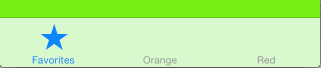
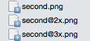
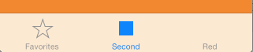
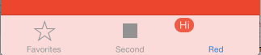
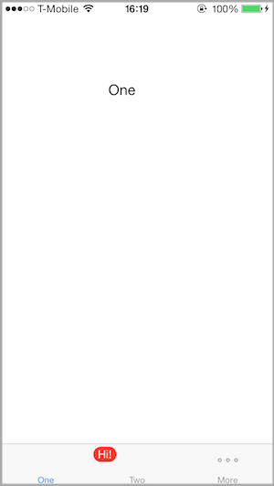

# Tab bars and tab bar controllers in Xamarin.iOS

Tabbed applications are used in iOS to support user interfaces where multiple
screens can be accessed in no particular order. Through the `UITabBarController` class, applications can easily include support
for such multi-screen scenarios. `UITabBarController` takes care of
the multi-screen management, allowing the application developer to focus on the
details of each screen.

Usually, tabbed applications are built with the `UITabBarController` being the `RootViewController` of the
main window. However, with a bit of additional code, tabbed applications can
also be used in succession to some other initial screen, such as the scenario
where an application first presents a login screen, followed by the tabbed
interface.

This page discusses both scenarios: when the tabs are at the root of the application view hierarchy
and also in the non-`RootViewController` scenario.

## Introducing UITabBarController

The `UITabBarController` supports tabbed application development
by the following:

- Allowing multiple controllers to be added to it.
- Providing a tabbed user interface, via the  `UITabBar` class, to allow a user to switch between controllers and their views.

Controllers are added to the `UITabBarController` via its `ViewControllers` property, which is a `UIViewController`
array. The `UITabBarController` itself handles loading the proper
controller and presenting its view based upon the selected tab.

The tabs are instances of the `UITabBarItem` class, which are
contained in a `UITabBar` instance. Each `UITabBar`
instance is accessible through the `TabBarItem` property of the
controller in each tab.

To get an understanding of how to work with the `UITabBarController`, let’s walk through building a simple
application that uses one.

## Tabbed application walkthrough

For this walkthrough we’re going to create the following application:

[](creating-tabbed-applications-images/00-app.png#lightbox)

Although there is already a tabbed application template available in
Visual Studio for Mac, for this example, these instructions work from an empty project to
gain a better understanding of how the application is constructed.

### Creating the application

Start by creating a new application.

Select the **File > New > Solution** menu item in
Visual Studio for Mac and select a **iOS > App > Empty Project** template, Name the project `TabbedApplication`, as shown below:

[](creating-tabbed-applications-images/newsolution1.png#lightbox)

[](creating-tabbed-applications-images/newsolution2.png#lightbox)

### Adding the UITabBarController

Next, add an empty class by selecting **File > New
File** and choosing the **General : Empty Class** template. Name the file `TabController` as shown below:

[](creating-tabbed-applications-images/02-newclass.png#lightbox)

The `TabController` class will contain the implementation of the `UITabBarController` that will manage an array of `UIViewControllers`. When the user selects a tab, the `UITabBarController` will take care of presenting the view for the
appropriate view controller.

To implement the `UITabBarController` we need to do the
following:

1. Set the base class of  `TabController` to  `UITabBarController` .
1. Create  `UIViewController` instances to add to the  `TabController` .
1. Add the  `UIViewController` instances to an array assigned to the  `ViewControllers` property of the  `TabController` .

Add the following code to the `TabController` class to achieve
these steps:

```csharp
using System;
using UIKit;

namespace TabbedApplication {
    public class TabController : UITabBarController {

        UIViewController tab1, tab2, tab3;

        public TabController ()
        {
            tab1 = new UIViewController();
            tab1.Title = "Green";
            tab1.View.BackgroundColor = UIColor.Green;

            tab2 = new UIViewController();
            tab2.Title = "Orange";
            tab2.View.BackgroundColor = UIColor.Orange;

            tab3 = new UIViewController();
            tab3.Title = "Red";
            tab3.View.BackgroundColor = UIColor.Red;

            var tabs = new UIViewController[] {
                tab1, tab2, tab3
            };

            ViewControllers = tabs;
        }
    }
}
```

Notice that for each `UIViewController` instance, we set the `Title` property of the `UIViewController`. When the
controllers are added to the `UITabBarController`, the `UITabBarController` will read the `Title` for each
controller and display it on the associated tab’s label as shown below:

[](creating-tabbed-applications-images/00-app.png#lightbox)

#### Setting the TabController as the RootViewController

The order that the controllers are placed in the tabs corresponds to the
order they are added to the `ViewControllers` array.

To get the `UITabController` to load as the first screen, we need
to make it the window’s `RootViewController`, as shown in the
following code for the `AppDelegate`:

```csharp
[Register ("AppDelegate")]
public partial class AppDelegate : UIApplicationDelegate
{
    UIWindow window;
    TabController tabController;

    public override bool FinishedLaunching (UIApplication app, NSDictionary options)
    {
        window = new UIWindow (UIScreen.MainScreen.Bounds);

        tabController = new TabController ();
        window.RootViewController = tabController;

        window.MakeKeyAndVisible ();

        return true;
    }
}
```

If we run the application now, the `UITabBarController` will load
with the first tab selected by default. Selecting any of the other tabs results
in the associated controller’s view being presented by the `UITabBarController,` as shown below where the end user has selected
the second tab:


### Modifying TabBarItems

Now that we have a running tab application, let’s modify the `TabBarItem` to change the image and text that is displayed, as well as to add a badge to one of the tabs.

#### Setting a system item

First, let’s set the first tab to use a system item. In the constructor of
the `TabController`, remove the line that sets the controller’s `Title` for the `tab1` instance and replace it with the
following code to set the controller’s `TabBarItem` property:

```csharp
tab1.TabBarItem = new UITabBarItem (UITabBarSystemItem.Favorites, 0);
```

When creating the `UITabBarItem` using a `UITabBarSystemItem`, the title and image are provided automatically
by iOS, as seen in the screenshot below showing the **Favorites**
icon and title on the first tab:

 

#### Setting the image

In addition to using a system item, the title and image of a `UITabBarItem` can be set to custom values. For example, change the
code that sets the `TabBarItem` property of the controller named `tab2` as follows:

```csharp
tab2 = new UIViewController ();
tab2.TabBarItem = new UITabBarItem ();
tab2.TabBarItem.Image = UIImage.FromFile ("second.png");
tab2.TabBarItem.Title = "Second";
tab2.View.BackgroundColor = UIColor.Orange;
```

The above code assumes an image named `second.png` has been added
to the root of the project (or a **Resources** directory). To support all screen densities, you need three images, as shown below:



The recommended size varies based on the style of the image (circular, square, wide, or tall).

The `Image` property only needs to be set to the **second.png** filename, iOS will automatically load the higher resolution files when needed. You can read more about this in the [Working with Images](~/ios/app-fundamentals/images-icons/index.md) guides. By default tab bar items are grey, with a blue tint when selected.

#### Overriding the title

When the `Title` property is set directly on the `TabBarItem`, it will override any value set for `Title` on the controller itself.

The second (middle) tab in this screenshot shows a custom title and image:



#### Setting the badge value

A tab can also display a badge. For example, add the following line of code
to set a badge on the third tab:

```csharp
tab3.TabBarItem.BadgeValue = "Hi";
```

Running this results in a red label with the string “Hi” in the upper
left corner of the tab as shown below:



The badge is often used to display a number indication unread, new items. To
remove the badge, set the `BadgeValue` to null as shown below:

```csharp
tab3.TabBarItem.BadgeValue = null;
```

## Tabs in non-RootViewController scenarios

In the example above, we showed how to work with a `UITabBarController` when it is the `RootViewController`
of the window. In this example we will examine how to use a `UITabBarController`
when it is not the `RootViewController` and show how this is created use Storyboards.

### Initial screen example

For this scenario, the initial screen loads from a controller that is not a `UITabBarController`. When the user interacts with the screen by
tapping a button, the same View Controller will be loaded into a `UITabBarController`, which is then presented to the user. The
following screenshot shows the application flow:

[](creating-tabbed-applications-images/inital-screen-application.png#lightbox)

Let’s start a new application for this example. Again, we’ll use the **iPhone > App > Empty Project (C#)** template,
this time naming the project `InitialScreenDemo`.

In this example, a storyboard is used to lay out view controllers. To add a storyboard:

- Right-click on the Project name, and select **Add > New File**.

- When the New File dialog appears, navigate to **iOS > Empty iPhone Storyboard**.

Let's call this new Storyboard **MainStoryboard** , as illustrated below:

[](creating-tabbed-applications-images/new-file-dialog.png#lightbox)

There are a few important steps to note when adding a Storyboard to a previously non-storyboard file, which are covered in the [Introduction to Storyboards](~/ios/user-interface/storyboards/index.md) guide. These are:

1. Add your Storyboard name to the **Main Interface** section of the `Info.plist`:

    [](creating-tabbed-applications-images/project-options.png#lightbox)
1. In your `App Delegate`, override the Window method, with the following code:

    ```csharp
    public override UIWindow Window {
        get;
        set;
    }
    ```

We are going to need three View Controllers for this example. One, named `ViewController1`, will be used as our Initial View Controller and in the first tab. The other two, named `ViewController2` and `ViewController3`, which will be used in the second and third tabs respectively.

Open the Designer by double clicking the MainStoryboard.storyboard file, and drag three View Controllers on to the design surface. We want each of these View Controllers to have their own class corresponding to the name above, So, under **Identity > Class**, type in its name, as illustrated in the screenshot below:

[](creating-tabbed-applications-images/class-name.png#lightbox)

Visual Studio for Mac will automatically generate the classes and designer files needed, this can be seen in the Solution Pad, as illustrated below:

[](creating-tabbed-applications-images/solution-pad2.png#lightbox)

#### Creating the UI

Next, we’ll create a simple user interface for  each of the ViewController's views,
using the Xamarin iOS Designer.

We want to drag a `Label` and a `Button` onto ViewController1 from the **ToolBox** on the right hand side. Next we'll use the Properties Pad to edit the name and text of the controls to the following:

- **Label** : `Text` = **One**
- **Button** : `Title` = **User Takes Some Initial Action**

We will be controlling the visibility of our button in a `TouchUpInside` event, and we need to refer to it in the code behind. Let's identify it with the **Name** `aButton` in the Properties Pad, as depicted in the following screenshot:

[](creating-tabbed-applications-images/abutton-properties.png#lightbox)

Your Design Surface should now look similar to the screenshot below:

[](creating-tabbed-applications-images/design-surface1.png#lightbox)

Let's add a little more detail to `ViewController2` and `ViewController3`, by adding a label to each, and changing the text to 'Two' and 'Three' respectively. This  highlights to the user which tab/View we are looking at.

#### Wiring up the button

We’re going to load `ViewController1` when the application first starts. When the user taps the button, we’ll hide the button and load a `UITabBarController` with the `ViewController1` instance
in the first tab.

When the user releases the `aButton`, we want a TouchUpInside event to be triggered. Let's select the button, and in the **Events Tab** of the Properties pad, declare the event handler – `InitialActionCompleted` – so it can be referred  to in code. This is illustrated in the screenshot below:

[](creating-tabbed-applications-images/event-handler.png#lightbox)

We now need to tell the View Controller to hide the button when the event fires `InitialActionCompleted`. In `ViewController1`, add the following partial method:

```csharp
partial void InitialActionCompleted (UIButton sender)
{
    aButton.Hidden = true;  
}
```

Save the file, and run the application. We should see screen one appear and the button disappear on Touch Up.

#### Adding the tab bar controller

We now have our Initial view working as expected. Next, we want to add it to a `UITabBarController`, along with Views 2 and 3. Let's open the Storyboard in the Designer.

In the **Toolbox**, search for the **Tab Bar Controller** under Controllers & Objects and drag this onto the Design Surface. As you can see in the screenshot below, the Tab Bar Controller is UI-less and therefore brings two View Controllers with it by default:

[](creating-tabbed-applications-images/tabbarcontroller.png#lightbox)

Delete these new View controllers by selecting the black bar at the bottom and pressing delete.

In our Storyboard, we can use Segues to handle the transitions between the TabBarController and our View Controllers. After interacting with the Initial View, we want to load it into the TabBarController presented to the user. Let's set this up in the designer.

**Ctrl-Click** and **Drag** from the button to the TabBarController. On mouse-up, a context menu will appear. We want to use a modal segue.

To set up each of our tabs, **Ctrl-Click** from the TabBarController to each of our View Controllers in order from one to three, and select the Relationship **Tab** from the context menu, as illustrated below:

[](creating-tabbed-applications-images/context-menu.png#lightbox)

Your Storyboard should resemble the screenshot below:

[](creating-tabbed-applications-images/segue-layout.png#lightbox)

If we click on one of the tab bar items and explore the properties panel, you can see a number of different options, as illustrated below:

[](creating-tabbed-applications-images/properties-panel.png#lightbox)

We can use this to edit certain attributes such as the badge, the title and the iOS identifier, among others.

If we save and run the application now, we'll find that the button reappears when the ViewController1 instance is loaded into the TabBarController. Let's fix this by checking to see if the current View has a parent View Controller. If it does, we know we are inside the TabBarController, and therefore the button should be hidden. Let's add the code below to the ViewController1 class:

```csharp
public override void ViewDidLoad ()
{
    if (ParentViewController != null){
        aButton.Hidden = true;
    }
}
```

When the application runs and the user taps the button on the first screen, the UITabBarController is loaded, with the view from the first screen placed in the first tab as shown below:

[](creating-tabbed-applications-images/first-view.png#lightbox)

## Summary

This article covered how to use a `UITabBarController` in an
application. We walked through how to load controllers into each tab as well as
how to set properties on tabs such the title, image and badge. We then examined, using storyboards,
how to load a `UITabBarController` at runtime when it is not the `RootViewController` of the window.

## Related links

- [Creating Tabbed Applications (sample)](/samples/xamarin/ios-samples/creatingtabbedapplications)
- [Images.zip](https://github.com/xamarin/ios-samples/blob/master/CreatingTabbedApplications/Resources/images.zip?raw=true)
- [UITabBarController Class Reference](https://developer.apple.com/library/ios/#documentation/uikit/reference/UITabBarController_Class/Reference/Reference.html)