# Manual Camera Controls in Xamarin.iOS

The Manual Camera Controls, provided by the `AVFoundation Framework` in iOS 8, allow a mobile application to take full control over an iOS device's camera. This fine-grained level of control can be used to create professional level camera applications and provide artist compositions by tweaking the parameters of the camera while taking a still image or video.

These controls can also be useful when developing scientific or industrial applications, where the results are less geared towards the correctness or beauty of the image, and are geared more towards highlighting some feature or element of the image being taken.

## AVFoundation Capture Objects

Whether taking video or still images using the camera on an iOS device, the process used to capture those images is largely the same. This is true of applications that use the default automated camera controls or ones that take advantage of the new Manual Camera Controls:

 [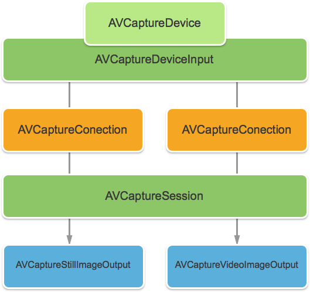](intro-to-manual-camera-controls-images/image1.png#lightbox)

Input is taken from an `AVCaptureDeviceInput` into an `AVCaptureSession` by way of an `AVCaptureConnection`. The result is either output as a still image or as a video stream. The entire process is controlled by an `AVCaptureDevice`.

## Manual Controls Provided

Using the new APIs provided by iOS 8, the application can take control of the following camera features:

- **Manual Focus** – By allowing the end user to take control of the focus directly, an application can provide more control over the image taken.
- **Manual Exposure** – By providing manual control over the exposure, an application can provide more freedom to users and allow them to achieve a stylized look.
- **Manual White Balance** – White Balance is used to adjust the color in an image—often to make it look realistic. Different light sources have different color temperatures, and the camera settings used to capture an image is adjusted to compensate for these differences. Again, by allowing the user control over the white balance, users can make adjustments that cannot be done automatically.

iOS 8 provides extensions and enhancements to existing iOS APIs to provide this fine-grained control over the image capture process.

## Requirements

The following are required to complete the steps presented in this article:

- **Xcode 7+ and iOS 8 or newer** – Apple's Xcode 7 and iOS 8 or newer  APIs need to be installed and configured on the developer's computer.
- **Visual Studio for Mac** – The latest version of Visual Studio for Mac should be installed and configured on the user device.
- **iOS 8 Device** – An iOS device running the latest version of iOS 8. Camera features cannot be tested in the iOS Simulator.

## General AV Capture Setup

When recording video on an iOS device, there is some general setup code that is always required. This section will cover the minimal setup that is required to record video from the iOS device's camera and display that video in real-time in a `UIImageView`.

### Output Sample Buffer Delegate

One of the first things needed will be a delegate to monitor the Sample Output buffer and display an image grabbed from the buffer to a `UIImageView` in the application UI.

The following routine will monitor the Sample Buffer and update the UI:

```csharp
using System;
using Foundation;
using UIKit;
using System.CodeDom.Compiler;
using System.Collections.Generic;
using System.Linq;
using AVFoundation;
using CoreVideo;
using CoreMedia;
using CoreGraphics;

namespace ManualCameraControls
{
    public class OutputRecorder : AVCaptureVideoDataOutputSampleBufferDelegate
    {
        #region Computed Properties
        public UIImageView DisplayView { get; set; }
        #endregion

        #region Constructors
        public OutputRecorder ()
        {

        }
        #endregion

        #region Private Methods
        private UIImage GetImageFromSampleBuffer(CMSampleBuffer sampleBuffer) {

            // Get a pixel buffer from the sample buffer
            using (var pixelBuffer = sampleBuffer.GetImageBuffer () as CVPixelBuffer) {
                // Lock the base address
                pixelBuffer.Lock (0);

                // Prepare to decode buffer
                var flags = CGBitmapFlags.PremultipliedFirst | CGBitmapFlags.ByteOrder32Little;

                // Decode buffer - Create a new colorspace
                using (var cs = CGColorSpace.CreateDeviceRGB ()) {

                    // Create new context from buffer
                    using (var context = new CGBitmapContext (pixelBuffer.BaseAddress,
                        pixelBuffer.Width,
                        pixelBuffer.Height,
                        8,
                        pixelBuffer.BytesPerRow,
                        cs,
                        (CGImageAlphaInfo)flags)) {

                        // Get the image from the context
                        using (var cgImage = context.ToImage ()) {

                            // Unlock and return image
                            pixelBuffer.Unlock (0);
                            return UIImage.FromImage (cgImage);
                        }
                    }
                }
            }
        }
        #endregion

        #region Override Methods
        public override void DidOutputSampleBuffer (AVCaptureOutput captureOutput, CMSampleBuffer sampleBuffer, AVCaptureConnection connection)
        {
            // Trap all errors
            try {
                // Grab an image from the buffer
                var image = GetImageFromSampleBuffer(sampleBuffer);

                // Display the image
                if (DisplayView !=null) {
                    DisplayView.BeginInvokeOnMainThread(() => {
                        // Set the image
                        if (DisplayView.Image != null) DisplayView.Image.Dispose();
                        DisplayView.Image = image;

                        // Rotate image to the correct display orientation
                        DisplayView.Transform = CGAffineTransform.MakeRotation((float)Math.PI/2);
                    });
                }

                // IMPORTANT: You must release the buffer because AVFoundation has a fixed number
                // of buffers and will stop delivering frames if it runs out.
                sampleBuffer.Dispose();
            }
            catch(Exception e) {
                // Report error
                Console.WriteLine ("Error sampling buffer: {0}", e.Message);
            }
        }
        #endregion
    }
}
```

With this routine in place, the `AppDelegate` can be modified to open an AV Capture Session to record a live video feed.

### Creating an AV Capture Session

The AV Capture session is used to control recording of live video from the iOS Device's camera and is required to get video into an iOS application. Since the example `ManualCameraControl` sample application is using the capture session in several different places, it will be configured in the `AppDelegate` and made available to the entire application.

Do the following to modify the application's `AppDelegate` and add the necessary code:

1. Double-click the `AppDelegate.cs` file in the Solution Explorer to open it for editing.
1. Add the following using statements to the top of the file:

    ```csharp
    using System;
    using Foundation;
    using UIKit;
    using System.CodeDom.Compiler;
    using System.Collections.Generic;
    using System.Linq;
    using AVFoundation;
    using CoreVideo;
    using CoreMedia;
    using CoreGraphics;
    using CoreFoundation;
    ```

1. Add the following private variables and computed properties to the `AppDelegate` class:

    ```csharp
    #region Private Variables
    private NSError Error;
    #endregion

    #region Computed Properties
    public override UIWindow Window {get;set;}
    public bool CameraAvailable { get; set; }
    public AVCaptureSession Session { get; set; }
    public AVCaptureDevice CaptureDevice { get; set; }
    public OutputRecorder Recorder { get; set; }
    public DispatchQueue Queue { get; set; }
    public AVCaptureDeviceInput Input { get; set; }
    #endregion
    ```

1. Override the finished method and change it to:

    ```csharp
    public override void FinishedLaunching (UIApplication application)
    {
        // Create a new capture session
        Session = new AVCaptureSession ();
        Session.SessionPreset = AVCaptureSession.PresetMedium;

        // Create a device input
        CaptureDevice = AVCaptureDevice.DefaultDeviceWithMediaType (AVMediaType.Video);
        if (CaptureDevice == null) {
            // Video capture not supported, abort
            Console.WriteLine ("Video recording not supported on this device");
            CameraAvailable = false;
            return;
        }

        // Prepare device for configuration
        CaptureDevice.LockForConfiguration (out Error);
        if (Error != null) {
            // There has been an issue, abort
            Console.WriteLine ("Error: {0}", Error.LocalizedDescription);
            CaptureDevice.UnlockForConfiguration ();
            return;
        }

        // Configure stream for 15 frames per second (fps)
        CaptureDevice.ActiveVideoMinFrameDuration = new CMTime (1, 15);

        // Unlock configuration
        CaptureDevice.UnlockForConfiguration ();

        // Get input from capture device
        Input = AVCaptureDeviceInput.FromDevice (CaptureDevice);
        if (Input == null) {
            // Error, report and abort
            Console.WriteLine ("Unable to gain input from capture device.");
            CameraAvailable = false;
            return;
        }

        // Attach input to session
        Session.AddInput (Input);

        // Create a new output
        var output = new AVCaptureVideoDataOutput ();
        var settings = new AVVideoSettingsUncompressed ();
        settings.PixelFormatType = CVPixelFormatType.CV32BGRA;
        output.WeakVideoSettings = settings.Dictionary;

        // Configure and attach to the output to the session
        Queue = new DispatchQueue ("ManCamQueue");
        Recorder = new OutputRecorder ();
        output.SetSampleBufferDelegate (Recorder, Queue);
        Session.AddOutput (output);

        // Let tabs know that a camera is available
        CameraAvailable = true;
    }
    ```

1. Save the changes to the file.

With this code in place, the Manual Camera Controls can be easily implemented for experimentation and testing.

## Manual Focus

By allowing the end user to take controls of the focus directly, an application can provide more artistic control over the image taken.

For example, a professional photographer can soften the focus of an image to achieve a [Bokeh Effect](https://en.wikipedia.org/wiki/Bokeh). Or, create a [Focus Pull Effect](http://www.mediacollege.com/video/camera/focus/pull.html).

For scientists or a writer of medical applications, the application might want to programmatically move the lens around for experiments. Either way the new API allows either the end user or the application to take control over focus at the time the image is taken.

### How Focus Works

Before discussing the details of controlling focus in an IOS 8 application. Let's take a quick look at how focus works in an iOS device:

[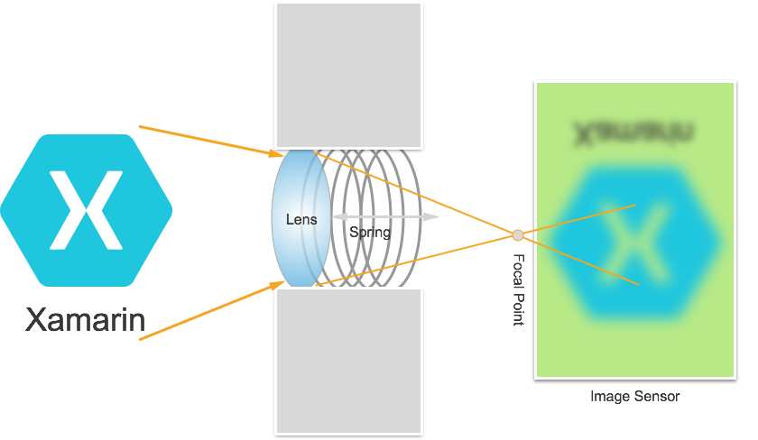](intro-to-manual-camera-controls-images/image4.png#lightbox)

Light enters the camera lens on the iOS device and is focused on an image sensor. The distance of the lens from the sensor controls where the Focal Point (the area where the image will appear the sharpest) is, in relationship to the sensor. The farther the lens is from the sensor, distance objects seem sharpest and the closer, near objects seem sharpest.

In an iOS device, the lens is moved closer to, or further from, the sensor by magnets and springs. As a result, exact positioning of the lens is impossible, as it will vary from device to device, and can be affected by parameters such as the orientation of the device or the age of the device and spring.

### Important Focus Terms

When dealing with focus, there are a few terms that the developer should be familiar with:

- **Depth of Field** – The distance between the nearest and farthest in-focus objects.
- **Macro** - This is the near end of the focus spectrum and is the closest distance at which the lens can focus.
- **Infinity** – This is the far end of the focus spectrum and is the farthest distance at which the lens can focus.
- **Hyperfocal Distance** – This is the point in the focus spectrum where the farthest object in the frame is just at the far end of focus. In other words, this is the focal position that maximizes Depth of Field.
- **Lens Position** – That's what controls all of the above other terms. This is the distance of the lens from the sensor and thereby the controller of focus.

With these terms and knowledge in mind, the new Manual Focus Controls can be successfully implemented in an iOS 8 application.

### Existing Focus Controls

iOS 7, and earlier versions, provided existing Focus Controls via `FocusMode`property as:

- `AVCaptureFocusModeLocked` – The focus is locked at a single focus point.
- `AVCaptureFocusModeAutoFocus` – The camera sweeps the lens through all focal points until it finds sharp focus and then stays there.
- `AVCaptureFocusModeContinuousAutoFocus` – The camera refocuses whenever it detects an out-of-focus condition.

The existing controls also provided a settable point of interest via the`FocusPointOfInterest` property, so that the user can tap to focus on a particular area. The application can also track the lens movement by monitoring the `IsAdjustingFocus` property.

In addition, range restriction was provided by the `AutoFocusRangeRestriction` property as:

- `AVCaptureAutoFocusRangeRestrictionNear` – Restricts the autofocus to nearby depths. Useful in situations such as scanning a QR Code or barcode.
- `AVCaptureAutoFocusRangeRestrictionFar` – Restricts the autofocus to distant depths. Useful in situations where objects that are known to be irrelevant are in the field of view (for instance, a window frame).

Finally there is the `SmoothAutoFocus` property that slows down the auto focus algorithm and steps it in smaller increments to avoid moving artifacts when recording video.

### New Focus Controls in iOS 8

In addition to the features already provided by iOS 7 and above, the following features are now available to control focus in iOS 8:

- Full manual control of the lens position when locking focus.
- Key-value observation of the lens position in any focus mode.

To implement the above features, the `AVCaptureDevice` class has been modified to include a read-only `LensPosition` property used to get the current position of the camera lens.

To take manual control of the Lens Position, the Capture Device must be in the Locked Focus Mode. Example:

 `CaptureDevice.FocusMode = AVCaptureFocusMode.Locked;`

The `SetFocusModeLocked` method of the Capture Device is used to adjust the position of the camera lens. An optional callback routine can be provide to get notification when the change takes effect. Example:

```csharp
ThisApp.CaptureDevice.LockForConfiguration(out Error);
ThisApp.CaptureDevice.SetFocusModeLocked(Position.Value,null);
ThisApp.CaptureDevice.UnlockForConfiguration();
```

As seen in the code above, the Capture Device must be locked for configuration before a change in Lens Position can be made. Valid Lens Position values are between 0.0 and 1.0.

### Manual Focus Example

With the General AV Capture Setup code in place, a `UIViewController` can be added to the application's Storyboard and configured as follows:

[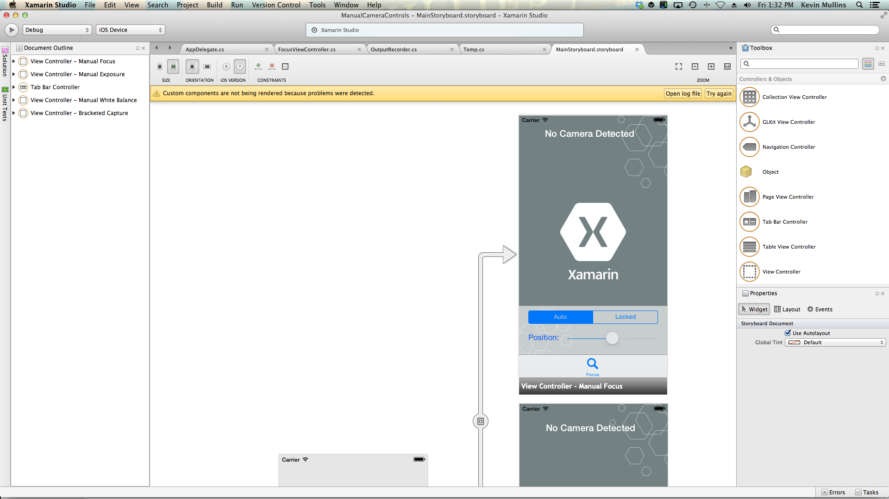](intro-to-manual-camera-controls-images/image5.png#lightbox)

The view contains the following main elements:

- A  `UIImageView` that will display the video feed.
- A  `UISegmentedControl` that will change the Focus Mode from Automatic to Locked.
- A  `UISlider` that will show and update the current Lens Position.

Do the following to wire-up the view controller for Manual Focus Control:

1. Add the following using statements:

    ```csharp
    using System;
    using Foundation;
    using UIKit;
    using System.CodeDom.Compiler;
    using System.Collections.Generic;
    using System.Linq;
    using AVFoundation;
    using CoreVideo;
    using CoreMedia;
    using CoreGraphics;
    using CoreFoundation;
    using System.Timers;
    ```

1. Add the following private variables:

    ```csharp
    #region Private Variables
    private NSError Error;
    private bool Automatic = true;
    #endregion
    ```

1. Add the following computed properties:

    ```csharp
    #region Computed Properties
    public AppDelegate ThisApp {
        get { return (AppDelegate)UIApplication.SharedApplication.Delegate; }
    }
    public Timer SampleTimer { get; set; }
    #endregion
    ```

1. Override the `ViewDidLoad` method and add the following code:

    ```csharp
    public override void ViewDidLoad ()
    {
        base.ViewDidLoad ();

        // Hide no camera label
        NoCamera.Hidden = ThisApp.CameraAvailable;

        // Attach to camera view
        ThisApp.Recorder.DisplayView = CameraView;

        // Create a timer to monitor and update the UI
        SampleTimer = new Timer (5000);
        SampleTimer.Elapsed += (sender, e) => {
            // Update position slider
            Position.BeginInvokeOnMainThread(() =>{
                Position.Value = ThisApp.Input.Device.LensPosition;
            });
        };

        // Watch for value changes
        Segments.ValueChanged += (object sender, EventArgs e) => {

            // Lock device for change
            ThisApp.CaptureDevice.LockForConfiguration(out Error);

            // Take action based on the segment selected
            switch(Segments.SelectedSegment) {
            case 0:
                // Activate auto focus and start monitoring position
                Position.Enabled = false;
                ThisApp.CaptureDevice.FocusMode = AVCaptureFocusMode.ContinuousAutoFocus;
                SampleTimer.Start();
                Automatic = true;
                break;
            case 1:
                // Stop auto focus and allow the user to control the camera
                SampleTimer.Stop();
                ThisApp.CaptureDevice.FocusMode = AVCaptureFocusMode.Locked;
                Automatic = false;
                Position.Enabled = true;
                break;
            }

            // Unlock device
            ThisApp.CaptureDevice.UnlockForConfiguration();
        };

        // Monitor position changes
        Position.ValueChanged += (object sender, EventArgs e) => {

            // If we are in the automatic mode, ignore changes
            if (Automatic) return;

            // Update Focus position
            ThisApp.CaptureDevice.LockForConfiguration(out Error);
            ThisApp.CaptureDevice.SetFocusModeLocked(Position.Value,null);
            ThisApp.CaptureDevice.UnlockForConfiguration();
        };
    }
    ```

1. Override the `ViewDidAppear` method and add the following to start recording when the view loads:

    ```csharp
    public override void ViewDidAppear (bool animated)
    {
        base.ViewDidAppear (animated);

        // Start udating the display
        if (ThisApp.CameraAvailable) {
            // Remap to this camera view
            ThisApp.Recorder.DisplayView = CameraView;

            ThisApp.Session.StartRunning ();
            SampleTimer.Start ();
        }
    }
    ```

1. With the camera in the Auto mode, the slider will move automatically as the camera adjusts focus:

    [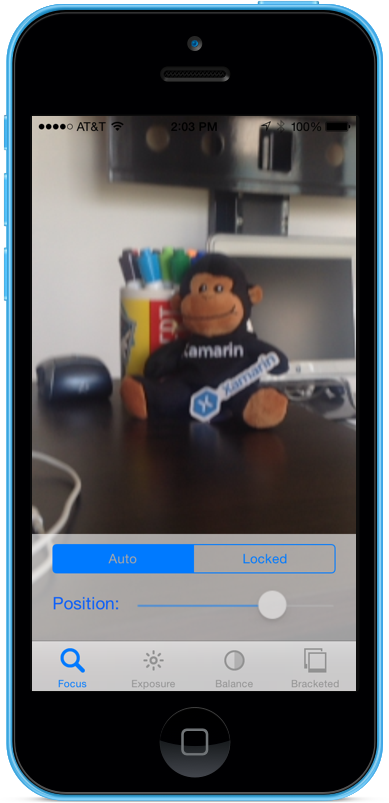](intro-to-manual-camera-controls-images/image6.png#lightbox)
1. Tap the Locked segment and drag the position slider to adjust the lens position manually:

    [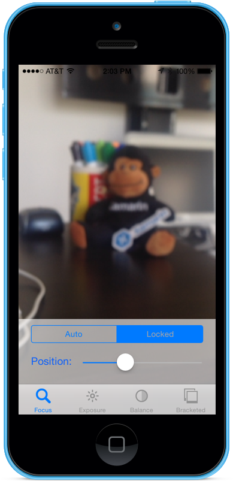](intro-to-manual-camera-controls-images/image7.png#lightbox)
1. Stop the application.

The above code has shown how to monitor the lens position when the camera is in the Automatic mode or use a slider to control the lens position when it is in the Locked mode.

## Manual Exposure

Exposure refers to the brightness of an image relative to the source brightness, and is determined by how much light hits the sensor, for how long, and by the gain-level of the sensor (ISO mapping). By providing manual control over the exposure, an application can provide more freedom to the end user and allow them to achieve a stylized look.

Using the Manual Exposure Controls, the user can take an image from unrealistically bright to dark and moody:

[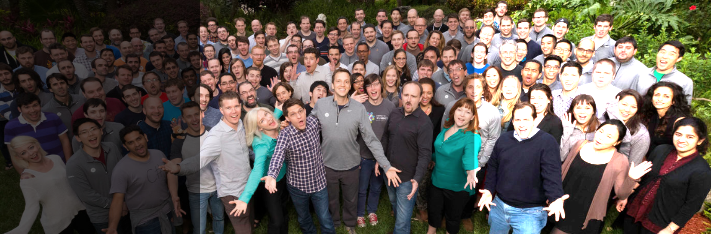](intro-to-manual-camera-controls-images/image8.png#lightbox)

Again, this can be done automatically using programmatic control for scientific applications or via manual controls provided by the applications user interface. Either way, the new iOS 8 Exposure APIs provide fine-grained control over the camera's exposure settings.

### How Exposure Works

Before discussing the details of controlling exposure in an IOS 8 application. Let's take a quick look at how exposure works:

[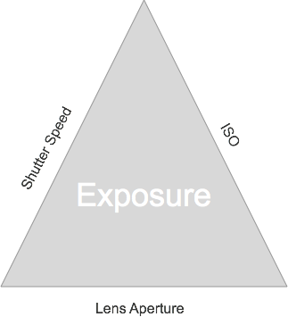](intro-to-manual-camera-controls-images/image9.png#lightbox)

The three basic elements that come together to control exposure are:

- **Shutter Speed** – This is the length of time that the shutter is open to let light onto the camera sensor. The shorter the time the shutter is open, the less light is let in and the crisper the image is (less motion blur). The longer the shutter is open, the more light is let in and the more motion blur that occurs.
- **ISO Mapping** – This is a term borrowed from film photography and refers to the sensitivity of the chemicals in the film to light. Low ISO values in film have less grain and finer color reproduction; low ISO values on digital sensors have less sensor noise but less brightness. The higher the ISO value, the brighter the image but with more sensor noise. “ISO” on a digital sensor is a measure of [electronic gain](https://en.wikipedia.org/wiki/Gain), not a physical feature.
- **Lens Aperture** – This is the size of the lens opening. On all iOS devices the lens aperture is fixed, so the only two values that can be used to adjust exposure are Shutter Speed and ISO.

### How Continuous Auto Exposure Works

Before learning how manual exposure works, it’s a good idea to understand how continuous auto exposure works in an iOS device.

[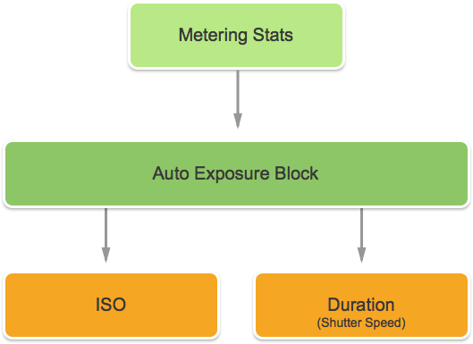](intro-to-manual-camera-controls-images/image10.png#lightbox)

First is the Auto Exposure Block, it has the job of calculating ideal exposure and is continuously being fed Metering Stats. It uses this information to calculate the optimal mixture of ISO and Shutter Speed to get the scene well lit. This cycle is referred to as the AE Loop.

### How Locked Exposure Works

Next, let's examine how locked exposure works in iOS devices.

[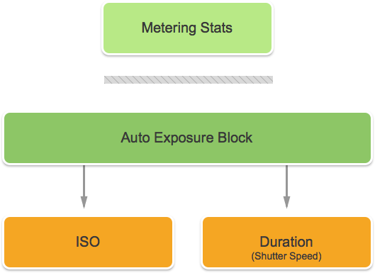](intro-to-manual-camera-controls-images/image11.png#lightbox)

Again, you have the Auto Exposure Block that is trying to calculate the optimal iOS and Duration values. However, in this mode the AE Block is disconnected from the Metering Stats engine.

### Existing Exposure Controls

iOS 7 and above, provide the following existing Exposure controls via the `ExposureMode` property:

- `AVCaptureExposureModeLocked` – Samples the scene once and uses those values throughout the scene.
- `AVCaptureExposureModeContinuousAutoExposure` – Samples the scene continuously to ensure that it is well lit.

The `ExposurePointOfInterest` can be used to tap to expose the scene by selecting a target object to expose on, and the application can monitor the `AdjustingExposure` property to see when exposure is being adjusted.

### New Exposure Controls in iOS 8

In addition to the features already provided by iOS 7 and above, the following features are now available to control exposure in iOS 8:

- Fully manual custom exposure.
- Get, Set and Key-Value Observe IOS and Shutter Speed (Duration).

To implement the above features, a new `AVCaptureExposureModeCustom` mode has been added. When the camera in is the custom mode, the following code can be used to adjust the Exposure Duration and ISO:

```csharp
CaptureDevice.LockForConfiguration(out Error);
CaptureDevice.LockExposure(DurationValue,ISOValue,null);
CaptureDevice.UnlockForConfiguration();
```

In the Auto and Locked modes, the application can adjust the Bias of the automatic exposure routine using the following code:

```csharp
CaptureDevice.LockForConfiguration(out Error);
CaptureDevice.SetExposureTargetBias(Value,null);
CaptureDevice.UnlockForConfiguration();
```

The minimum and maximum setting ranges depend on the device the application is running on, so they should never be hard coded. Instead, use the following properties to get the minimum and maximum value ranges:

- `CaptureDevice.MinExposureTargetBias`
- `CaptureDevice.MaxExposureTargetBias`
- `CaptureDevice.ActiveFormat.MinISO`
- `CaptureDevice.ActiveFormat.MaxISO`
- `CaptureDevice.ActiveFormat.MinExposureDuration`
- `CaptureDevice.ActiveFormat.MaxExposureDuration`

As seen in the code above, the Capture Device must be locked for configuration before a change in exposure can be made.

### Manual Exposure Example

With the General AV Capture Setup code in place, a `UIViewController` can be added to the application's Storyboard and configured as follows:

[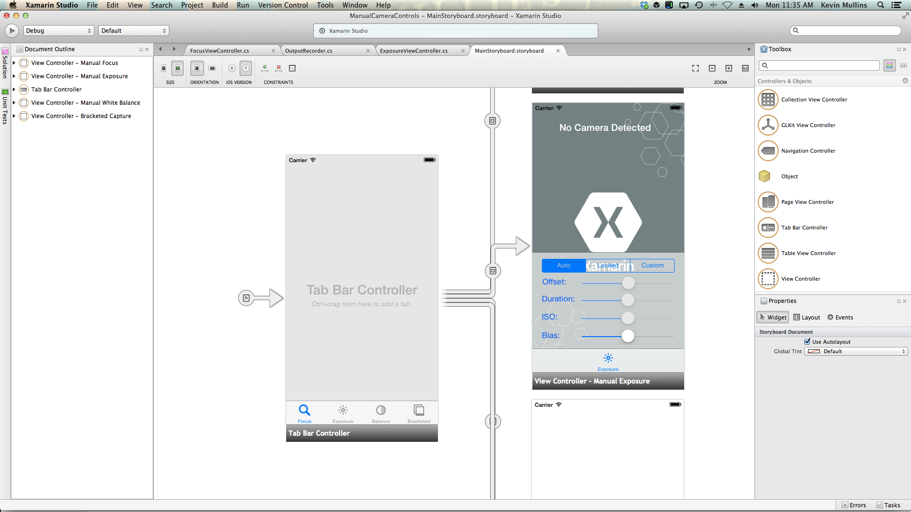](intro-to-manual-camera-controls-images/image12.png#lightbox)

The view contains the following main elements:

- A  `UIImageView` that will display the video feed.
- A  `UISegmentedControl` that will change the Focus Mode from Automatic to Locked.
- Four  `UISlider` controls that will show and update the Offset, Duration, ISO and Bias.

Do the following to wire-up the view controller for Manual Exposure Control:

1. Add the following using statements:

    ```csharp
    using System;
    using Foundation;
    using UIKit;
    using System.CodeDom.Compiler;
    using System.Collections.Generic;
    using System.Linq;
    using AVFoundation;
    using CoreVideo;
    using CoreMedia;
    using CoreGraphics;
    using CoreFoundation;
    using System.Timers;
    ```

1. Add the following private variables:

    ```csharp
    #region Private Variables
    private NSError Error;
    private bool Automatic = true;
    private nfloat ExposureDurationPower = 5;
    private nfloat ExposureMinimumDuration = 1.0f/1000.0f;
    #endregion
    ```

1. Add the following computed properties:

    ```csharp
    #region Computed Properties
    public AppDelegate ThisApp {
        get { return (AppDelegate)UIApplication.SharedApplication.Delegate; }
    }
    public Timer SampleTimer { get; set; }
    #endregion
    ```

1. Override the `ViewDidLoad` method and add the following code:

    ```csharp
    public override void ViewDidLoad ()
    {
        base.ViewDidLoad ();

        // Hide no camera label
        NoCamera.Hidden = ThisApp.CameraAvailable;

        // Attach to camera view
        ThisApp.Recorder.DisplayView = CameraView;

        // Set min and max values
        Offset.MinValue = ThisApp.CaptureDevice.MinExposureTargetBias;
        Offset.MaxValue = ThisApp.CaptureDevice.MaxExposureTargetBias;

        Duration.MinValue = 0.0f;
        Duration.MaxValue = 1.0f;

        ISO.MinValue = ThisApp.CaptureDevice.ActiveFormat.MinISO;
        ISO.MaxValue = ThisApp.CaptureDevice.ActiveFormat.MaxISO;

        Bias.MinValue = ThisApp.CaptureDevice.MinExposureTargetBias;
        Bias.MaxValue = ThisApp.CaptureDevice.MaxExposureTargetBias;

        // Create a timer to monitor and update the UI
        SampleTimer = new Timer (5000);
        SampleTimer.Elapsed += (sender, e) => {
            // Update position slider
            Offset.BeginInvokeOnMainThread(() =>{
                Offset.Value = ThisApp.Input.Device.ExposureTargetOffset;
            });

            Duration.BeginInvokeOnMainThread(() =>{
                var newDurationSeconds = CMTimeGetSeconds(ThisApp.Input.Device.ExposureDuration);
                var minDurationSeconds = Math.Max(CMTimeGetSeconds(ThisApp.CaptureDevice.ActiveFormat.MinExposureDuration), ExposureMinimumDuration);
                var maxDurationSeconds = CMTimeGetSeconds(ThisApp.CaptureDevice.ActiveFormat.MaxExposureDuration);
                var p = (newDurationSeconds - minDurationSeconds) / (maxDurationSeconds - minDurationSeconds);
                Duration.Value = (float)Math.Pow(p, 1.0f/ExposureDurationPower);
            });

            ISO.BeginInvokeOnMainThread(() => {
                ISO.Value = ThisApp.Input.Device.ISO;
            });

            Bias.BeginInvokeOnMainThread(() => {
                Bias.Value = ThisApp.Input.Device.ExposureTargetBias;
            });
        };

        // Watch for value changes
        Segments.ValueChanged += (object sender, EventArgs e) => {

            // Lock device for change
            ThisApp.CaptureDevice.LockForConfiguration(out Error);

            // Take action based on the segment selected
            switch(Segments.SelectedSegment) {
            case 0:
                // Activate auto exposure and start monitoring position
                Duration.Enabled = false;
                ISO.Enabled = false;
                ThisApp.CaptureDevice.ExposureMode = AVCaptureExposureMode.ContinuousAutoExposure;
                SampleTimer.Start();
                Automatic = true;
                break;
            case 1:
                // Lock exposure and allow the user to control the camera
                SampleTimer.Stop();
                ThisApp.CaptureDevice.ExposureMode = AVCaptureExposureMode.Locked;
                Automatic = false;
                Duration.Enabled = false;
                ISO.Enabled = false;
                break;
            case 2:
                // Custom exposure and allow the user to control the camera
                SampleTimer.Stop();
                ThisApp.CaptureDevice.ExposureMode = AVCaptureExposureMode.Custom;
                Automatic = false;
                Duration.Enabled = true;
                ISO.Enabled = true;
                break;
            }

            // Unlock device
            ThisApp.CaptureDevice.UnlockForConfiguration();
        };

        // Monitor position changes
        Duration.ValueChanged += (object sender, EventArgs e) => {

            // If we are in the automatic mode, ignore changes
            if (Automatic) return;

            // Calculate value
            var p = Math.Pow(Duration.Value,ExposureDurationPower);
            var minDurationSeconds = Math.Max(CMTimeGetSeconds(ThisApp.CaptureDevice.ActiveFormat.MinExposureDuration),ExposureMinimumDuration);
            var maxDurationSeconds = CMTimeGetSeconds(ThisApp.CaptureDevice.ActiveFormat.MaxExposureDuration);
            var newDurationSeconds = p * (maxDurationSeconds - minDurationSeconds) +minDurationSeconds;

            // Update Focus position
            ThisApp.CaptureDevice.LockForConfiguration(out Error);
            ThisApp.CaptureDevice.LockExposure(CMTime.FromSeconds(p,1000*1000*1000),ThisApp.CaptureDevice.ISO,null);
            ThisApp.CaptureDevice.UnlockForConfiguration();
        };

        ISO.ValueChanged += (object sender, EventArgs e) => {

            // If we are in the automatic mode, ignore changes
            if (Automatic) return;

            // Update Focus position
            ThisApp.CaptureDevice.LockForConfiguration(out Error);
            ThisApp.CaptureDevice.LockExposure(ThisApp.CaptureDevice.ExposureDuration,ISO.Value,null);
            ThisApp.CaptureDevice.UnlockForConfiguration();
        };

        Bias.ValueChanged += (object sender, EventArgs e) => {

            // If we are in the automatic mode, ignore changes
            // if (Automatic) return;

            // Update Focus position
            ThisApp.CaptureDevice.LockForConfiguration(out Error);
            ThisApp.CaptureDevice.SetExposureTargetBias(Bias.Value,null);
            ThisApp.CaptureDevice.UnlockForConfiguration();
        };
    }
    ```

1. Override the `ViewDidAppear` method and add the following to start recording when the view loads:

    ```csharp
    public override void ViewDidAppear (bool animated)
    {
        base.ViewDidAppear (animated);

        // Start udating the display
        if (ThisApp.CameraAvailable) {
            // Remap to this camera view
            ThisApp.Recorder.DisplayView = CameraView;

            ThisApp.Session.StartRunning ();
            SampleTimer.Start ();
        }
    }
    ```

1. With the camera in the Auto mode, the sliders will move automatically as the camera adjusts exposure:

    [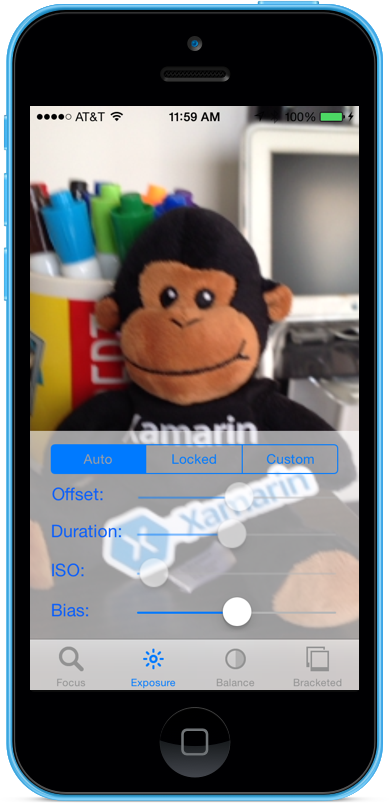](intro-to-manual-camera-controls-images/image13.png#lightbox)
1. Tap the Locked segment and drag the Bias slider to adjust the bias of the automatic exposure manually:

    [](intro-to-manual-camera-controls-images/image14.png#lightbox)
1. Tap the Custom segment and drag the Duration and ISO sliders to manually control exposure:

    [](intro-to-manual-camera-controls-images/image15.png#lightbox)
1. Stop the application.

The above code has shown how to monitor the exposure settings when the camera is in the Automatic mode, and how to use sliders to control the exposure when it is in the Locked or Custom modes.

## Manual White Balance

White Balance controls allow users to adjust the balance of colosr in an image to make them  look more realistic. Different light sources have different color temperatures, and the camera settings used to capture an image must be adjusted to compensate for these differences. Again, by allowing the user control over the white balance they can make professional adjustments that the automatic routines are incapable of to achieve artistic effects.

[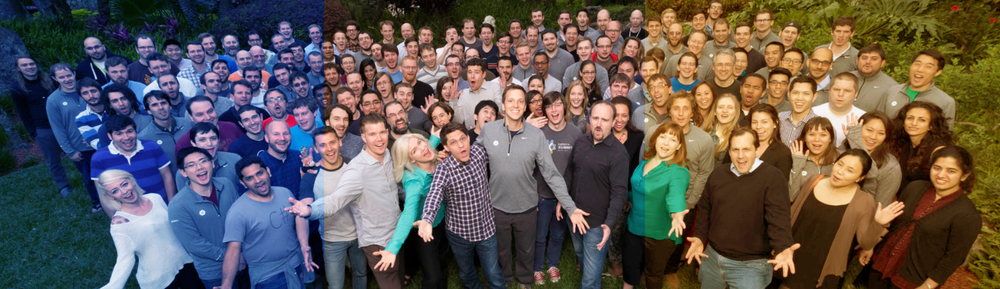](intro-to-manual-camera-controls-images/image16.png#lightbox)

For instance, daylight has a blueish cast, whereas tungsten incandescent lights have a warmer, yellow-orange tint. (Confusingly, “cool” colors have higher color temperatures than “warm” colors. Color temperatures are a physical measure, not a perceptual one.)

The human mind is very good at compensating for the differences in color temperature, but this is something that a camera cannot do. The camera works by boosting color on the opposite spectrum to adjust for the color differences.

The new iOS 8 Exposure API allows the application to take control of the process and provide fine-grained control over the camera's white balance settings.

### How White Balance Works

Before discussing the details of controlling white balance in an IOS 8 application. Let's take a quick look at how white balance works:

In the study of color perception, the [CIE 1931 RGB color space and CIE 1931 XYZ color space](https://en.wikipedia.org/wiki/CIE_1931_color_space) are the first mathematically defined color spaces. They were created by the International Commission on Illumination (CIE) in 1931.

[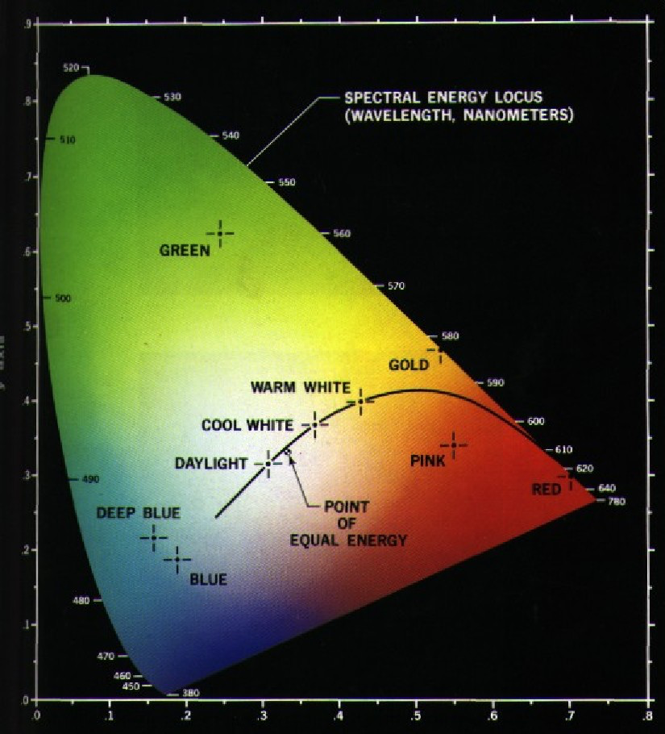](intro-to-manual-camera-controls-images/image17.png#lightbox)

The above chart shows us all of the colors visible to the human eye, from deep blue to bright green to bright red. Any point on the diagram can be plotted with an X and Y value, as shown on the graph above.

As visible in the graph, there are X and Y values that can be plotted on the graph that would be outside of the range of human vision, and as a result these colors cannot be reproduced by a camera.

The smaller curve in the above chart is called the [Planckian Locus](https://en.wikipedia.org/wiki/Planckian_locus), which expresses the color temperature (in degrees kelvin), with higher numbers on the blue side (hotter) and lower numbers on the red side (cooler). These are useful for typical lighting situations.

In mixed lighting conditions, the white balance adjustments will need to deviate from the Planckian Locus to make the required changes. In these situations the adjustment will need to be shifted either to the green or red/magenta side of the CIE scale.

iOS Devices compensate for color casts by boosting the opposite color gain. For instance, if a scene has too much blue, then the red gain will be boosted to compensate. These gain values are calibrated for specific devices so they are device dependent.

### Existing White Balance Controls

iOS 7 and above provided the following existing White Balance controls via `WhiteBalanceMode` property:

- `AVCapture WhiteBalance ModeLocked` – Samples the scene once and using those values throughout the scene.
- `AVCapture WhiteBalance ModeContinuousAutoExposure` – Samples the scene continuously to ensure that it is well balanced.

And the application can monitor the `AdjustingWhiteBalance` property to see when exposure is being adjusted.

### New White Balance Controls in iOS 8

In addition to the features already provided by iOS 7 and above, the following features are now available to control White Balance in iOS 8:

- Fully manual control of the device RGB gains.
- Get, Set and Key-Value Observe the device RGB gains.
- Support for White Balance using a Gray Card.
- Conversion routines to and from device independent color spaces.

To implement the above features, the `AVCaptureWhiteBalanceGain` structure has been added with the following members:

- `RedGain`
- `GreenGain`
- `BlueGain`

The maximum white balance gain is currently four (4) and can be ready from the `MaxWhiteBalanceGain` property. So the legal range is from one (1) to `MaxWhiteBalanceGain` (4) currently.

The `DeviceWhiteBalanceGains` property can be used to observe the current values. Use `SetWhiteBalanceModeLockedWithDeviceWhiteBalanceGains` to adjust the balance gains when the camera is in the locked white balance mode.

#### Conversion Routines

Conversion routines have been added to iOS 8 to help with converting to, and from, device independent color spaces. To implement the conversion routines, the `AVCaptureWhiteBalanceChromaticityValues` structure has been added with the following members:

- `X` - is a value from 0 to 1.
- `Y` - is a value from 0 to 1.

An `AVCaptureWhiteBalanceTemperatureAndTintValues` structure has also been added with the following members:

- `Temperature` - is a floating point value in degrees Kelvin.
- `Tint` - is an offset from green or magenta from 0 to 150 with positive values towards the green direction and negative toward in the magenta.

Use the `CaptureDevice.GetTemperatureAndTintValues`and the `CaptureDevice.GetDeviceWhiteBalanceGains`methods to convert between temperature and tint, chromaticity and RGB gain color spaces.

> [!NOTE]
> The conversion routines are more accurate the closer the value to be converted is to the Planckian Locus.

#### Gray Card Support

Apple uses the term Gray World to refer to the Gray Card support built into iOS 8. It allows the user to focus on a physical Gray Card that covers at least 50% of the center of the frame and uses that to adjust the White Balance. The purpose of the Gray Card is to achieve white that appears neutral.

This can be implemented in an application by prompting the user to place a physical gray card in front of the camera, monitoring the `GrayWorldDeviceWhiteBalanceGains` property and waiting until the values settle down.

The application would then lock the White Balance gains for the `SetWhiteBalanceModeLockedWithDeviceWhiteBalanceGains` method using the values from the `GrayWorldDeviceWhiteBalanceGains` property to apply the changes.

The Capture Device must be locked for configuration before a change in White Balance can be made.

### Manual White Balance Example

With the General AV Capture Setup code in place, a `UIViewController` can be added to the application's Storyboard and configured as follows:

[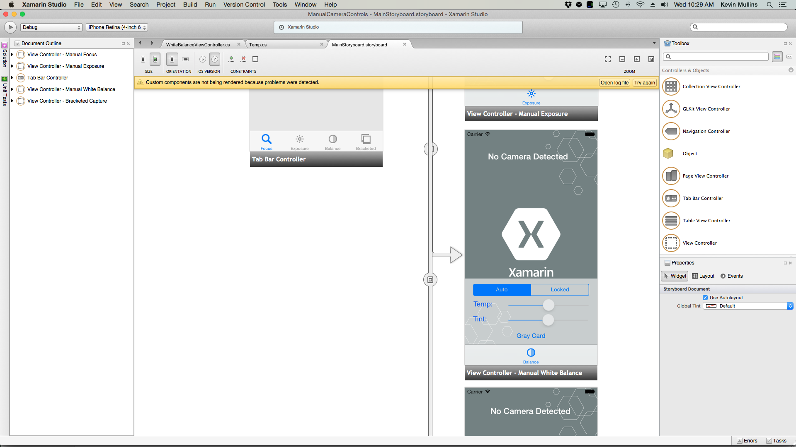](intro-to-manual-camera-controls-images/image18.png#lightbox)

The view contains the following main elements:

- A  `UIImageView` that will display the video feed.
- A  `UISegmentedControl` that will change the Focus Mode from Automatic to Locked.
- Two  `UISlider` controls that will show and update the Temperature and Tint.
- A  `UIButton` used to sample a Gray Card (Gray World) space and set the White Balance using those values.

Do the following to wire-up the view controller for Manual White Balance Control:

1. Add the following using statements:

    ```csharp
    using System;
    using Foundation;
    using UIKit;
    using System.CodeDom.Compiler;
    using System.Collections.Generic;
    using System.Linq;
    using AVFoundation;
    using CoreVideo;
    using CoreMedia;
    using CoreGraphics;
    using CoreFoundation;
    using System.Timers;
    ```

1. Add the following private variables:

    ```csharp
    #region Private Variables
    private NSError Error;
    private bool Automatic = true;
    #endregion
    ```

1. Add the following computed properties:

    ```csharp
    #region Computed Properties
    public AppDelegate ThisApp {
        get { return (AppDelegate)UIApplication.SharedApplication.Delegate; }
    }
    public Timer SampleTimer { get; set; }
    #endregion
    ```

1. Add the following private method to set the new white balance Temperature and Tint:

    ```csharp
    #region Private Methods
    void SetTemperatureAndTint() {
        // Grab current temp and tint
        var TempAndTint = new AVCaptureWhiteBalanceTemperatureAndTintValues (Temperature.Value, Tint.Value);

        // Convert Color space
        var gains = ThisApp.CaptureDevice.GetDeviceWhiteBalanceGains (TempAndTint);

        // Set the new values
        if (ThisApp.CaptureDevice.LockForConfiguration (out Error)) {
            gains = NomralizeGains (gains);
            ThisApp.CaptureDevice.SetWhiteBalanceModeLockedWithDeviceWhiteBalanceGains (gains, null);
            ThisApp.CaptureDevice.UnlockForConfiguration ();
        }
    }

    AVCaptureWhiteBalanceGains NomralizeGains (AVCaptureWhiteBalanceGains gains)
    {
        gains.RedGain = Math.Max (1, gains.RedGain);
        gains.BlueGain = Math.Max (1, gains.BlueGain);
        gains.GreenGain = Math.Max (1, gains.GreenGain);

        float maxGain = ThisApp.CaptureDevice.MaxWhiteBalanceGain;
        gains.RedGain = Math.Min (maxGain, gains.RedGain);
        gains.BlueGain = Math.Min (maxGain, gains.BlueGain);
        gains.GreenGain = Math.Min (maxGain, gains.GreenGain);

        return gains;
    }
    #endregion
    ```

1. Override the `ViewDidLoad` method and add the following code:

    ```csharp
    public override void ViewDidLoad ()
    {
        base.ViewDidLoad ();

        // Hide no camera label
        NoCamera.Hidden = ThisApp.CameraAvailable;

        // Attach to camera view
        ThisApp.Recorder.DisplayView = CameraView;

        // Set min and max values
        Temperature.MinValue = 1000f;
        Temperature.MaxValue = 10000f;

        Tint.MinValue = -150f;
        Tint.MaxValue = 150f;

        // Create a timer to monitor and update the UI
        SampleTimer = new Timer (5000);
        SampleTimer.Elapsed += (sender, e) => {
            // Convert color space
            var TempAndTint = ThisApp.CaptureDevice.GetTemperatureAndTintValues (ThisApp.CaptureDevice.DeviceWhiteBalanceGains);

            // Update slider positions
            Temperature.BeginInvokeOnMainThread (() => {
                Temperature.Value = TempAndTint.Temperature;
            });

            Tint.BeginInvokeOnMainThread (() => {
                Tint.Value = TempAndTint.Tint;
            });
        };

        // Watch for value changes
        Segments.ValueChanged += (sender, e) => {
            // Lock device for change
            if (ThisApp.CaptureDevice.LockForConfiguration (out Error)) {

                // Take action based on the segment selected
                switch (Segments.SelectedSegment) {
                case 0:
                // Activate auto focus and start monitoring position
                    Temperature.Enabled = false;
                    Tint.Enabled = false;
                    ThisApp.CaptureDevice.WhiteBalanceMode = AVCaptureWhiteBalanceMode.ContinuousAutoWhiteBalance;
                    SampleTimer.Start ();
                    Automatic = true;
                    break;
                case 1:
                // Stop auto focus and allow the user to control the camera
                    SampleTimer.Stop ();
                    ThisApp.CaptureDevice.WhiteBalanceMode = AVCaptureWhiteBalanceMode.Locked;
                    Automatic = false;
                    Temperature.Enabled = true;
                    Tint.Enabled = true;
                    break;
                }

                // Unlock device
                ThisApp.CaptureDevice.UnlockForConfiguration ();
            }
        };

        // Monitor position changes
        Temperature.TouchUpInside += (sender, e) => {

            // If we are in the automatic mode, ignore changes
            if (Automatic)
                return;

            // Update white balance
            SetTemperatureAndTint ();
        };

        Tint.TouchUpInside += (sender, e) => {

            // If we are in the automatic mode, ignore changes
            if (Automatic)
                return;

            // Update white balance
            SetTemperatureAndTint ();
        };

        GrayCardButton.TouchUpInside += (sender, e) => {

            // If we are in the automatic mode, ignore changes
            if (Automatic)
                return;

            // Get gray card values
            var gains = ThisApp.CaptureDevice.GrayWorldDeviceWhiteBalanceGains;

            // Set the new values
            if (ThisApp.CaptureDevice.LockForConfiguration (out Error)) {
                ThisApp.CaptureDevice.SetWhiteBalanceModeLockedWithDeviceWhiteBalanceGains (gains, null);
                ThisApp.CaptureDevice.UnlockForConfiguration ();
            }
        };
    }
    ```

1. Override the `ViewDidAppear` method and add the following to start recording when the view loads:

    ```csharp
    public override void ViewDidAppear (bool animated)
    {
        base.ViewDidAppear (animated);

        // Start udating the display
        if (ThisApp.CameraAvailable) {
            // Remap to this camera view
            ThisApp.Recorder.DisplayView = CameraView;

            ThisApp.Session.StartRunning ();
            SampleTimer.Start ();
        }
    }
    ```

1. Save the changes the to code and run the application.
1. With the camera in the Auto mode, the sliders will move automatically as the camera adjusts white balance:

    [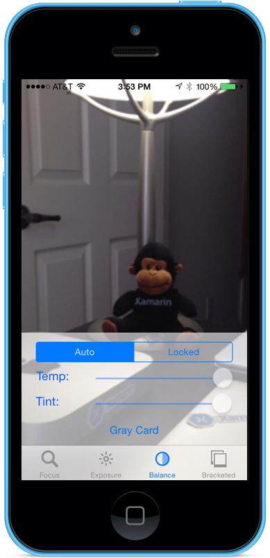](intro-to-manual-camera-controls-images/image19.png#lightbox)
1. Tap the Locked segment and drag the Temp and Tint sliders to adjust the white balance manually:

    [](intro-to-manual-camera-controls-images/image20.png#lightbox)
1. With the Locked segment still selected, place a physical gray card in front of the camera and tap the Gray Card button to adjust white balance to the Gray World:

    [](intro-to-manual-camera-controls-images/image21.png#lightbox)
1. Stop the application.

The above code has shown how to monitor the white balance settings when the camera is in the Automatic mode or use sliders to control the white balance when it is in the Locked mode.

## Bracketed Capture

The Bracketed Capture is based on the settings from the Manual Camera Controls presented above and allows the application to capture a moment in time, in a variety of different ways.

Simply stated, Bracketed Capture is a burst of still images taken with a variety of settings from picture to picture.

[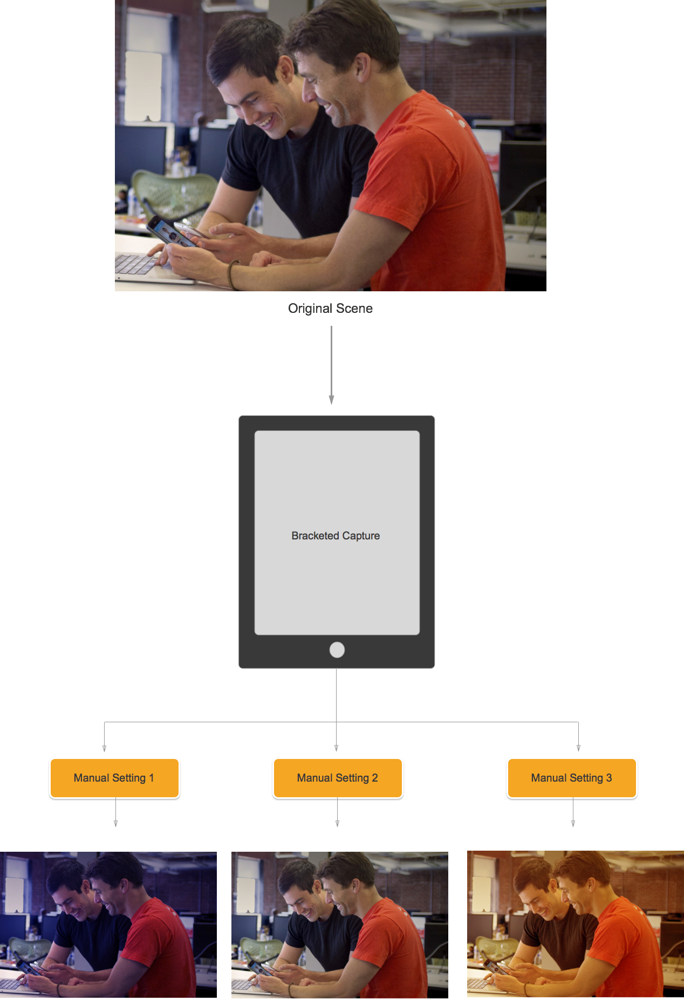](intro-to-manual-camera-controls-images/image22.png#lightbox)

Using the Bracketed Capture in iOS 8, an application can preset a series of Manual Camera Controls, issue a single command and have the current scene return a series of images for each of the manual presets.

### Bracketed Capture Basics

Again, Bracketed Capture is a burst of still images taken with varied settings from picture to picture. The types of Bracketed Capture available are:

- **Auto Exposure Bracket** – where all images have a varied Bias amount.
- **Manual Exposure Bracket** – where all images have a varied Shutter Speed (Duration) and ISO amount.
- **Simple Burst Bracket** – A series of still images taken in rapid succession.

### New Bracketed Capture Controls in iOS 8

All Bracketed Capture commands are implemented in the `AVCaptureStillImageOutput` class. Use the `CaptureStillImageBracket`method to get a series of images with the given array of settings.

Two new classes have been implemented to handle settings:

- `AVCaptureAutoExposureBracketedStillImageSettings` – It has one property,  `ExposureTargetBias`, used to set the bias for an auto exposure bracket.
- `AVCaptureManual`  `ExposureBracketedStillImageSettings` – It has two properties,  `ExposureDuration` and  `ISO`, used to set the shutter speed and ISO for a manual exposure bracket.

### Bracketed Capture Controls Do's and Don'ts

#### Do's

The following is a list of things that should be done when using the Bracketed Capture controls in iOS 8:

- Prepare the app for the worst-case capture situation by calling the  `PrepareToCaptureStillImageBracket` method.
- Assume that the sample buffers are going to come from the same shared pool.
- To release the memory that was allocated by a previous prepare call, call  `PrepareToCaptureStillImageBracket` again and send it an array of one object.

#### Don'ts

The following is a list of things that should not be done when using the Bracketed Capture controls in iOS 8:

- Don't mix Bracketed Capture settings types in a single capture.
- Don't request more than  `MaxBracketedCaptureStillImageCount` images in a single capture.

### Bracketed Capture Details

The following details should be taken into consideration when working with Bracketed Capture in iOS 8:

- Bracketed settings temporarily override the  `AVCaptureDevice` settings.
- Flash and still image stabilization settings are ignored.
- All images must use the same output format (jpeg, png, etc.)
- Video preview may drop frames.
- Bracketed Capture is supported on all devices compatible with iOS 8.

With this information in mind, let's take a look at an example of using Bracketed Capture in iOS 8.

### Bracket Capture Example

With the General AV Capture Setup code in place, a `UIViewController` can be added to the application's Storyboard and configured as follows:

[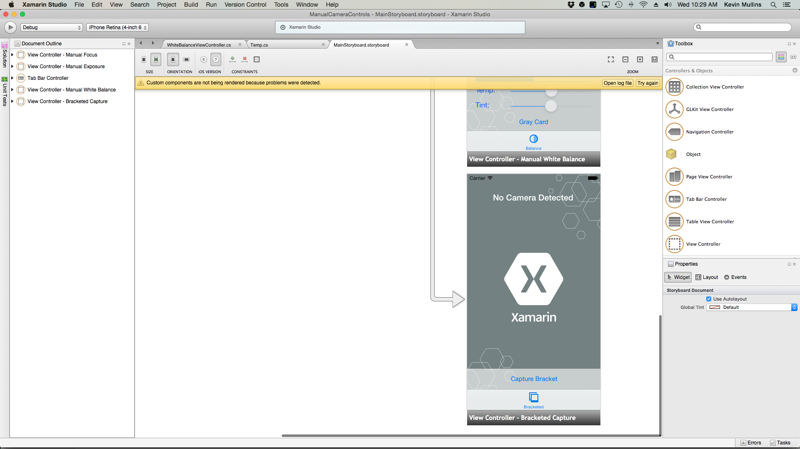](intro-to-manual-camera-controls-images/image23.png#lightbox)

The view contains the following main elements:

- A  `UIImageView` that will display the video feed.
- Three  `UIImageViews` that will display the results of the capture.
- A  `UIScrollView` to house the video feed and result views.
- A  `UIButton` used to take a Bracketed Capture with some preset settings.

Do the following to wire-up the view controller for Bracketed Capture:

1. Add the following using statements:

    ```csharp
    using System;
    using System.Drawing;
    using Foundation;
    using UIKit;
    using System.CodeDom.Compiler;
    using System.Collections.Generic;
    using System.Linq;
    using AVFoundation;
    using CoreVideo;
    using CoreMedia;
    using CoreGraphics;
    using CoreFoundation;
    using CoreImage;
    ```

1. Add the following private variables:

    ```csharp
    #region Private Variables
    private NSError Error;
    private List<UIImageView> Output = new List<UIImageView>();
    private nint OutputIndex = 0;
    #endregion
    ```

1. Add the following computed properties:

    ```csharp
    #region Computed Properties
    public AppDelegate ThisApp {
        get { return (AppDelegate)UIApplication.SharedApplication.Delegate; }
    }
    #endregion
    ```

1. Add the following private method to build the required output image views:

    ```csharp
    #region Private Methods
    private UIImageView BuildOutputView(nint n) {

        // Create a new image view controller
        var imageView = new UIImageView (new CGRect (CameraView.Frame.Width * n, 0, CameraView.Frame.Width, CameraView.Frame.Height));

        // Load a temp image
        imageView.Image = UIImage.FromFile ("Default-568h@2x.png");

        // Add a label
        UILabel label = new UILabel (new CGRect (0, 20, CameraView.Frame.Width, 24));
        label.TextColor = UIColor.White;
        label.Text = string.Format ("Bracketed Image {0}", n);
        imageView.AddSubview (label);

        // Add to scrolling view
        ScrollView.AddSubview (imageView);

        // Return new image view
        return imageView;
    }
    #endregion
    ```

1. Override the `ViewDidLoad` method and add the following code:

    ```csharp
    public override void ViewDidLoad ()
    {
        base.ViewDidLoad ();

        // Hide no camera label
        NoCamera.Hidden = ThisApp.CameraAvailable;

        // Attach to camera view
        ThisApp.Recorder.DisplayView = CameraView;

        // Setup scrolling area
        ScrollView.ContentSize = new SizeF (CameraView.Frame.Width * 4, CameraView.Frame.Height);

        // Add output views
        Output.Add (BuildOutputView (1));
        Output.Add (BuildOutputView (2));
        Output.Add (BuildOutputView (3));

        // Create preset settings
        var Settings = new AVCaptureBracketedStillImageSettings[] {
            AVCaptureAutoExposureBracketedStillImageSettings.Create(-2.0f),
            AVCaptureAutoExposureBracketedStillImageSettings.Create(0.0f),
            AVCaptureAutoExposureBracketedStillImageSettings.Create(2.0f)
        };

        // Wireup capture button
        CaptureButton.TouchUpInside += (sender, e) => {
            // Reset output index
            OutputIndex = 0;

            // Tell the camera that we are getting ready to do a bracketed capture
            ThisApp.StillImageOutput.PrepareToCaptureStillImageBracket(ThisApp.StillImageOutput.Connections[0],Settings,async (bool ready, NSError err) => {
                // Was there an error, if so report it
                if (err!=null) {
                    Console.WriteLine("Error: {0}",err.LocalizedDescription);
                }
            });

            // Ask the camera to snap a bracketed capture
            ThisApp.StillImageOutput.CaptureStillImageBracket(ThisApp.StillImageOutput.Connections[0],Settings, (sampleBuffer, settings, err) =>{
                // Convert raw image stream into a Core Image Image
                var imageData = AVCaptureStillImageOutput.JpegStillToNSData(sampleBuffer);
                var image = CIImage.FromData(imageData);

                // Display the resulting image
                Output[OutputIndex++].Image = UIImage.FromImage(image);

                // IMPORTANT: You must release the buffer because AVFoundation has a fixed number
                // of buffers and will stop delivering frames if it runs out.
                sampleBuffer.Dispose();
            });
        };
    }
    ```

1. Override the `ViewDidAppear` method and add the following code:

    ```csharp
    public override void ViewDidAppear (bool animated)
    {
        base.ViewDidAppear (animated);

        // Start udating the display
        if (ThisApp.CameraAvailable) {
            // Remap to this camera view
            ThisApp.Recorder.DisplayView = CameraView;

            ThisApp.Session.StartRunning ();
        }
    }

    ```

1. Save the changes the to code and run the application.
1. Frame a scene and tap the Capture Bracket button:

    [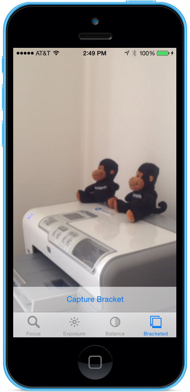](intro-to-manual-camera-controls-images/image24.png#lightbox)
1. Swipe right to left to see the three images taken by the Bracketed Capture:

    [](intro-to-manual-camera-controls-images/image25.png#lightbox)
1. Stop the application.

The above code has shown how to configure and take an Auto Exposure Bracketed Capture in iOS 8.

## Summary

In this article we have covered an introduction to the new Manual Camera Controls provided by iOS 8 and covered the basics of what they do and how they work. We have given examples of Manual Focus, Manual Exposure and Manual White Balance. Finally, we gave an example taking a Bracketed Capture using the previously discussed Manual Camera Controls

## Related Links

- [ManualCameraControls (sample)](/samples/xamarin/ios-samples/manualcameracontrols)
- [Introduction to iOS 8](~/ios/platform/introduction-to-ios8.md)
