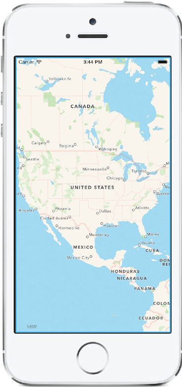
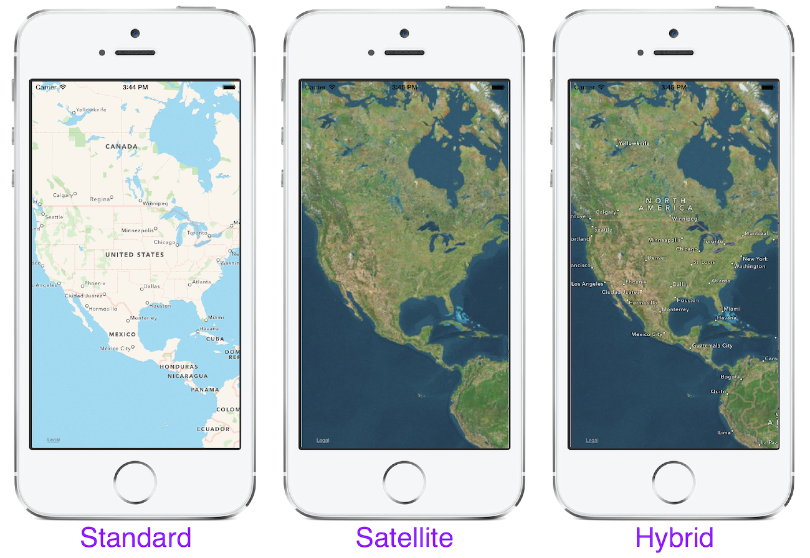
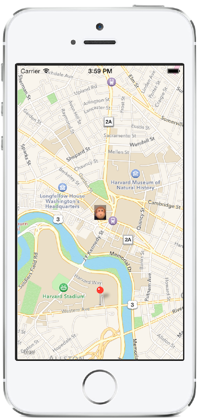
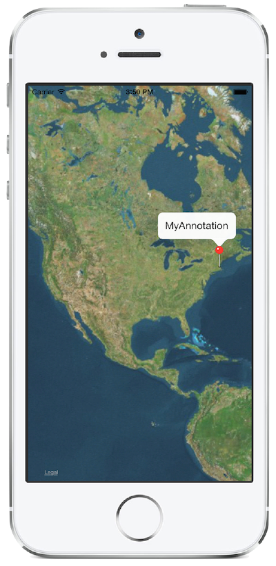
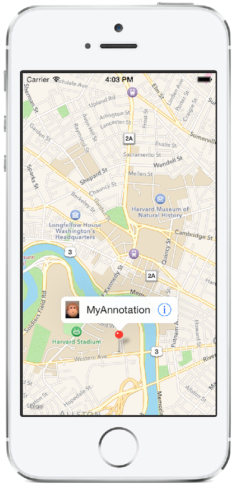
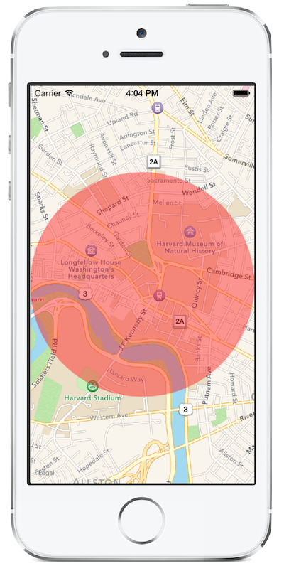

# Maps in Xamarin.iOS

Maps are a common feature in all modern mobile operating systems. iOS offers mapping support natively through the Map Kit framework. With Map Kit, applications can easily add rich, interactive maps. These maps can be customized in a variety of ways, such as adding annotations to mark locations on a map, and overlaying graphics of arbitrary shapes. Map Kit even has built-in support for showing the current location of a device.

## Adding a Map

Adding a map to an application is accomplished by adding an `MKMapView` instance to the view hierarchy, as shown below:

```csharp
// map is an MKMapView declared as a class variable
map = new MKMapView (UIScreen.MainScreen.Bounds);
View = map;
```

`MKMapView` is a `UIView` subclass that displays a map. Simply adding the map using the code above produces an interactive map:



## Map Style

`MKMapView` supports 3 different styles of maps. To apply a map style, simply set the `MapType` property to a value from the `MKMapType` enumeration:

```csharp
map.MapType = MKMapType.Standard; //road map
map.MapType = MKMapType.Satellite;
map.MapType = MKMapType.Hybrid;
```

The following screenshot show the different map styles that are available:



## Panning and Zooming

`MKMapView` includes support for map interactivity features such as:

- Zooming via a pinch gesture
- Panning via a pan gesture

These features can be enabled or disabled by simply setting the `ZoomEnabled` and `ScrollEnabled` properties of the `MKMapView` instance, where the default value is true for both. For example, to display a static map, simply set the appropriate properties to false:

```csharp
map.ZoomEnabled = false;
map.ScrollEnabled = false;
```

## User Location

In addition to user interaction, `MKMapView` also has built-in support for displaying the location of the device. It does this using the *Core Location* framework. Before you can access the user's location, you must prompt the user. To do this, create an instance of `CLLocationManager` and call `RequestWhenInUseAuthorization`.

```csharp
CLLocationManager locationManager = new CLLocationManager();
locationManager.RequestWhenInUseAuthorization();
//locationManager.RequestAlwaysAuthorization(); //requests permission for access to location data while running in the background
```

Note that in versions of iOS prior to 8.0, attempting to call `RequestWhenInUseAuthorization` will result in an error. Make sure to check the version of iOS before making that call if you intend to support versions prior to 8.

Accessing the user's location also requires modifications to **Info.plist**. The following keys relating to location data should be set:

- **NSLocationWhenInUseUsageDescription** - For when you are accessing the user's location while they are interacting with your app.
- **NSLocationAlwaysUsageDescription** - For when your app accesses the user's location in the background.

You can add those keys by opening **Info.plist** and selecting *Source* at the bottom of the editor.

Once you've updated **Info.plist** and prompted the user for permission to access their location, you can show the user's location on the map by setting the `ShowsUserLocation` property to true:

```csharp
map.ShowsUserLocation = true;
```

 

## Annotations

 `MKMapView` also supports displaying images, known as annotations, on a map. These can be either custom images or system-defined pins of various colors. For example, the following screenshot shows a map with a both a pin and a custom image:

 

### Adding an annotation

An annotation itself has two parts:

- The  `MKAnnotation` object, which includes model data about the annotation, such as the title and location of the annotation.
- The  `MKAnnotationView` , which contains the image to display and optionally a callout that is shown when the user taps the annotation.

Map Kit uses the iOS delegation pattern to add annotations to a map, where the `Delegate` property of the `MKMapView` is set to an instance of an `MKMapViewDelegate`. It is this delegate's implementation that is responsible for returning the `MKAnnotationView` for an annotation.

To add an annotation, first the annotation is added by calling `AddAnnotations` on the `MKMapView` instance:

```csharp
// add an annotation
map.AddAnnotations (new MKPointAnnotation (){
    Title="MyAnnotation",
    Coordinate = new CLLocationCoordinate2D (42.364260, -71.120824)
});
```

When the location of the annotation becomes visible on the map, the `MKMapView` will call its delegate's `GetViewForAnnotation` method to get the `MKAnnotationView` to display.

For example, the following code returns a system-provided `MKPinAnnotationView`:

```csharp
string pId = "PinAnnotation";

public override MKAnnotationView GetViewForAnnotation (MKMapView mapView, NSObject annotation)
{
    if (annotation is MKUserLocation)
        return null;

    // create pin annotation view
    MKAnnotationView pinView = (MKPinAnnotationView)mapView.DequeueReusableAnnotation (pId);

    if (pinView == null)
        pinView = new MKPinAnnotationView (annotation, pId);

    ((MKPinAnnotationView)pinView).PinColor = MKPinAnnotationColor.Red;
    pinView.CanShowCallout = true;

    return pinView;
}
```

### Reusing Annotations

To conserve memory, `MKMapView` allows annotation view's to be pooled for reuse, similar to the way table cells are reused. Obtaining an annotation view from the pool is done with a call to `DequeueReusableAnnotation`:

```csharp
MKAnnotationView pinView = (MKPinAnnotationView)mapView.DequeueReusableAnnotation (pId);
```

#### Showing Callouts

As mentioned earlier, an annotation can optionally show a callout. To show a callout simply set `CanShowCallout` to true on the `MKAnnotationView`. This results in the annotation's title being displayed when the annotation is tapped, as shown:

 

### Customizing the Callout

The callout can also be customized to show left and right accessory views, as shown below:

```csharp
pinView.RightCalloutAccessoryView = UIButton.FromType (UIButtonType.DetailDisclosure);
pinView.LeftCalloutAccessoryView = new UIImageView(UIImage.FromFile ("monkey.png"));
```

This code results in the following callout:

 

To handle the user tapping the right accessory, simply implement the `CalloutAccessoryControlTapped` method in the `MKMapViewDelegate`:

```csharp
public override void CalloutAccessoryControlTapped (MKMapView mapView, MKAnnotationView view, UIControl control)
{
    ...
}
```

### Overlays

Another way to layer graphics on a map is using overlays. Overlays support drawing graphical content that scales with the map as it is zoomed. iOS provides support for several types of overlays, including:

- Polygons - Commonly used to highlight some region on a map.
- Polylines - Often seen when showing a route.
- Circles - Used to highlight a circular area of a map.

Additionally, custom overlays can be created to show arbitrary geometries with granular, customized drawing code. For example, weather radar would be a good candidate for a custom overlay.

#### Adding an Overlay

Similar to annotations, adding an overlay involves 2 parts:

- Creating a model object for the overlay and adding it to the  `MKMapView` .
- Creating a view for the overlay in the  `MKMapViewDelegate` .

The model for the overlay can be any `MKShape` subclass. Xamarin.iOS includes `MKShape` subclasses for polygons, polylines and circles, via the `MKPolygon`, `MKPolyline` and `MKCircle` classes respectively.

For example, the following code is used to add an `MKCircle`:

```csharp
var circleOverlay = MKCircle.Circle (mapCenter, 1000);
map.AddOverlay (circleOverlay);
```

The view for an overlay is an `MKOverlayView` instance that is returned by the `GetViewForOverlay` in the `MKMapViewDelegate`. Each `MKShape` has a corresponding `MKOverlayView` that knows how to display the given shape. For `MKPolygon` there is `MKPolygonView`. Similarly, `MKPolyline` corresponds to `MKPolylineView`, and for `MKCircle` there is `MKCircleView`.

For example, the following code returns an `MKCircleView` for an `MKCircle`:

```csharp
public override MKOverlayView GetViewForOverlay (MKMapView mapView, NSObject overlay)
{
    var circleOverlay = overlay as MKCircle;
    var circleView = new MKCircleView (circleOverlay);
    circleView.FillColor = UIColor.Blue;
    return circleView;
}
```

This displays a circle on the map as shown:

 

## Local Search

iOS includes a local search API with Map Kit, which allows asynchronous searches for points of interest in a specified geographic region.

To perform a local search, an application must follow these steps:

1. Create  `MKLocalSearchRequest` object.
1. Create an  `MKLocalSearch` object from the  `MKLocalSearchRequest` .
1. Call the  `Start` method on the  `MKLocalSearch` object.
1. Retrieve the  `MKLocalSearchResponse` object in a callback.

The local search API itself provides no user interface. It doesn’t even require a map to be used. However, to make practical use of local search, an application needs to provide some way to specify a search query and display results. Additionally, since the results will contain location data, it will often make sense to show them on a map.

<a name="Adding_a_Local_Search_UI"></a>

### Adding a Local Search UI

One way to accept search input is with a `UISearchBar`, which provided by a `UISearchController` and will display results in a table.

The following code adds the `UISearchController` (which has a search bar property) in the `ViewDidLoad` method of `MapViewController`:

```csharp
//Creates an instance of a custom View Controller that holds the results
var searchResultsController = new SearchResultsViewController (map);

//Creates a search controller updater
var searchUpdater = new SearchResultsUpdator ();
searchUpdater.UpdateSearchResults += searchResultsController.Search;

//add the search controller
searchController = new UISearchController (searchResultsController) {
                SearchResultsUpdater = searchUpdater
            };

//format the search bar
searchController.SearchBar.SizeToFit ();
searchController.SearchBar.SearchBarStyle = UISearchBarStyle.Minimal;
searchController.SearchBar.Placeholder = "Enter a search query";

//the search bar is contained in the navigation bar, so it should be visible
searchController.HidesNavigationBarDuringPresentation = false;

//Ensure the searchResultsController is presented in the current View Controller
DefinesPresentationContext = true;

//Set the search bar in the navigation bar
NavigationItem.TitleView = searchController.SearchBar;
```

Note that you are responsible for incorporating the search bar object into the user interface. In this example, we assigned it to the TitleView of the navigation bar, but if you do not use a navigation controller in your application you will have to find another place to display it.

In this code snippet, we created another custom view controller – `searchResultsController` –  that displays the search results and then we used this object to create our search controller object. We also created a new search updater, which becomes active when the user interacts with the search bar. It receives notifications about searches with each keystroke and is responsible for updating the UI.
We will take a look at how to implement both the `searchResultsController` and the `searchResultsUpdater` later in this guide.

This results in a search bar displayed over the map as shown below:

 

### Displaying the Search Results

To display search results, we need to create a custom View Controller; normally a `UITableViewController`. As shown above, the `searchResultsController` is passed to the constructor of the `searchController` when it is being created.
The following code is an example of how to create this custom View Controller:

```csharp
public class SearchResultsViewController : UITableViewController
{
    static readonly string mapItemCellId = "mapItemCellId";
    MKMapView map;

    public List<MKMapItem> MapItems { get; set; }

    public SearchResultsViewController (MKMapView map)
    {
        this.map = map;

        MapItems = new List<MKMapItem> ();
    }

    public override nint RowsInSection (UITableView tableView, nint section)
    {
        return MapItems.Count;
    }

    public override UITableViewCell GetCell (UITableView tableView, NSIndexPath indexPath)
    {
        var cell = tableView.DequeueReusableCell (mapItemCellId);

        if (cell == null)
            cell = new UITableViewCell ();

        cell.TextLabel.Text = MapItems [indexPath.Row].Name;
        return cell;
    }

    public override void RowSelected (UITableView tableView, NSIndexPath indexPath)
    {
        // add item to map
        CLLocationCoordinate2D coord = MapItems [indexPath.Row].Placemark.Location.Coordinate;
        map.AddAnnotations (new MKPointAnnotation () {
            Title = MapItems [indexPath.Row].Name,
            Coordinate = coord
        });

        map.SetCenterCoordinate (coord, true);

        DismissViewController (false, null);
    }

    public void Search (string forSearchString)
    {
        // create search request
        var searchRequest = new MKLocalSearchRequest ();
        searchRequest.NaturalLanguageQuery = forSearchString;
        searchRequest.Region = new MKCoordinateRegion (map.UserLocation.Coordinate, new MKCoordinateSpan (0.25, 0.25));

        // perform search
        var localSearch = new MKLocalSearch (searchRequest);

        localSearch.Start (delegate (MKLocalSearchResponse response, NSError error) {
            if (response != null && error == null) {
                this.MapItems = response.MapItems.ToList ();
                this.TableView.ReloadData ();
            } else {
                Console.WriteLine ("local search error: {0}", error);
            }
        });

    }
}
```

### Updating the Search Results

The `SearchResultsUpdater` acts as a mediator between the `searchController`'s search bar and search results.

In this example we have to first create the search method in the `SearchResultsViewController`. To do this we must create an `MKLocalSearch` object and use it to issue a search for an `MKLocalSearchRequest`, the results are retrieved in a callback passed to the `Start` method of the `MKLocalSearch` object. The results are then returned in an `MKLocalSearchResponse` object containing an array of `MKMapItem` objects:

```csharp
public void Search (string forSearchString)
{
    // create search request
    var searchRequest = new MKLocalSearchRequest ();
    searchRequest.NaturalLanguageQuery = forSearchString;
    searchRequest.Region = new MKCoordinateRegion (map.UserLocation.Coordinate, new MKCoordinateSpan (0.25, 0.25));

    // perform search
    var localSearch = new MKLocalSearch (searchRequest);

    localSearch.Start (delegate (MKLocalSearchResponse response, NSError error) {
        if (response != null && error == null) {
            this.MapItems = response.MapItems.ToList ();
            this.TableView.ReloadData ();
        } else {
            Console.WriteLine ("local search error: {0}", error);
        }
    });

}
```

Then, in our `MapViewController` we'll create a custom implementation of `UISearchResultsUpdating`, which is assigned to the `SearchResultsUpdater` property of our `searchController` in the [Adding a Local Search UI](#Adding_a_Local_Search_UI) section:

```csharp
public class SearchResultsUpdator : UISearchResultsUpdating
{
    public event Action<string> UpdateSearchResults = delegate {};

    public override void UpdateSearchResultsForSearchController (UISearchController searchController)
    {
        this.UpdateSearchResults (searchController.SearchBar.Text);
    }
}
```

The implementation above adds an annotation to the map when an item is selected from the results, as shown below:

 

> [!IMPORTANT]
> `UISearchController` was implemented in iOS 8. If you wish to support devices earlier than this, then you will need to use `UISearchDisplayController`.

## Summary

This article examined the *Map* *Kit* framework for iOS. First, it looked at how the `MKMapView` class allows interactive maps to be included in an application. Then it demonstrated how to further customize maps using annotations and overlays. Finally, it examined the local search capabilities that were added to Map Kit with iOS 6.1, showing how to use perform location based queries for points of interest and add them to a map.

## Related Links

- [SearchController](https://github.com/xamarin/recipes/tree/master/Recipes/ios/content_controls/search-controller)
- [MapDemo (sample)](/samples/xamarin/ios-samples/mapdemo)