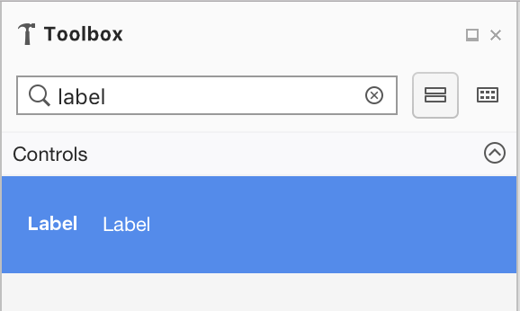
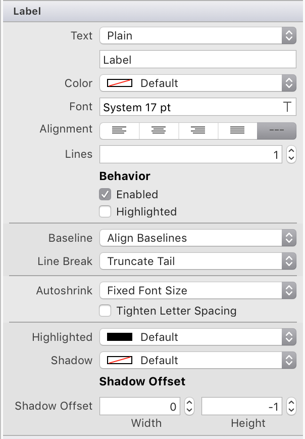
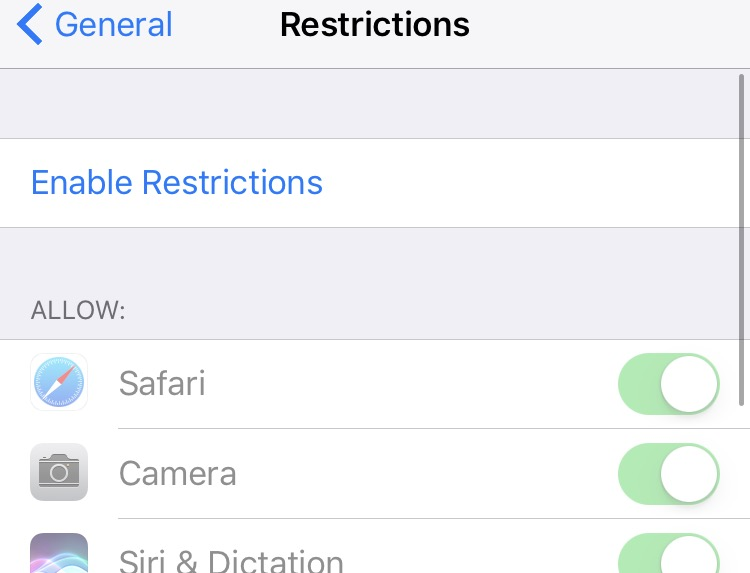
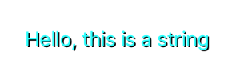

# Labels in Xamarin.iOS

The `UILabel` control is used for displaying single and multi-line, read only text.

## Implementing a Label

A new label is created by instantiating a [`UILabel`](xref:UIKit.UILabel):

```csharp
UILabel label = new UILabel();
```

### Labels and Storyboards

You can also add a Label to your UI when using the iOS Designer. Search for **Label** in the **Toolbox** and drag it to your view:



The following properties can be adjusted on the properties pad:



- **Text Context** – Plain or Attributed. Plain text allows you to set the [formatting attributes](#Formatting_Text_and_Label) on the entire string. Attributed texts allows you to set formatting to different characters or words in the string.
- **Color, Font, Alignment** – Formatting Attributes that can be applied to the label.
- **Lines** – Sets the number of lines that the label can span. Set this to 0 to allow the label to use as many lines as needed.
- **Behavior** – Can be set to either Enabled or Highlighted. Enabled is set by default, disabled text will be displayed in a lighter grey color. Highlighted is disabled by default and allows the label to be redrawn with a highlighted state when it is selected by a user.
- **Baselane and Line Break** –
  - Basline determines how the text will be positioned if the font sizes is different from the one specified.
  - Line Breaks determine how a string will be wrapped or truncated if it is longer than a single line.
- **Autoshrink** – Determines how the font sized will be minimized within a label, if necessary.
- **Highlighted, Shadow, Offset** – Allows you to set the Hightlighted and Shadow color, and the shadow offset.

## Truncating and Wrapping

For information on using the line breaks in iOS, refer to the [Truncate and Wrap text](https://github.com/xamarin/recipes/tree/master/Recipes/ios/standard_controls/labels/uilabel-truncate-wrap-text) recipe.

<a name="Formatting_Text_and_Label"></a>

## Formatting Text and Label

To format the string that you use in a label you can either set formatting attributes on the entire string or you can use attributed strings. The following examples show how to implement these:

```csharp
label = new UILabel(){
                Text = "Hello, this is a string",
                Font = UIFont.FromName("Papyrus", 20f),
                TextColor = UIColor.Magenta,
                TextAlignment = UITextAlignment.Center
            };
```

```csharp
label.AttributedText = new NSAttributedString(
                "This is some formatted text",
                font: UIFont.FromName("GillSans", 16.0f),
                foregroundColor: UIColor.Blue,
                backgroundColor: UIColor.White
            );
```

For more information on styling text using `NSAttributedString` refer to the [Style Text](https://github.com/xamarin/recipes/tree/master/Recipes/ios/standard_controls/text_field/style_text) recipe.

By default labels have the `Enabled` set to true, but it is possible to set it to disabled to give the user a hint that a certain control is disabled:

```csharp
label.Enabled = false;
```

This sets the label to a light grey color, as illustrated in the following example image of the Restrictions screen in iOS:



You can also set the Highlight and Shadow text colors to your label text for additional effects:

```csharp
label.Highlighted = true;
label.HighlightedTextColor = UIColor.Cyan;

label.ShadowColor = UIColor.Black;
label.ShadowOffset = new CoreGraphics.CGSize(1.0f, 1.0f);
```

Which displays the text like this:



For more information on changing the font of a UILabel, refer to the [Change The Font](https://github.com/xamarin/recipes/tree/master/Recipes/ios/standard_controls/labels/change_the_font) recipe.
