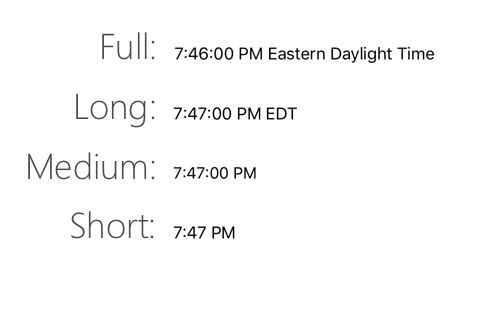
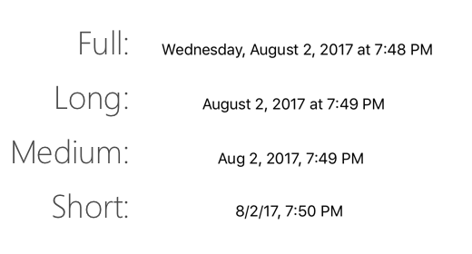

# Picker Control in Xamarin.iOS

The Picker control displays 'wheel-like' control that contains a scrollable list of values with the selected value being highlighted. Users rotate the wheel to select the option they want.

One specific user case for pickers it to set the date and / or time. To provide for this Apple has created a custom subclass of the UIPickerView class called UIDatePicker.

The article covers implementing and using the [Picker](#picker) and [Date Picker](#datepicker) controls.

<a name="picker" />

## Picker

### Implementing a Picker

A Picker is implemented by instantiating a new [`UIPickerView`](https://developer.xamarin.com/api/type/UIKit.UIPickerView/):

```csharp
UIPickerView pickerView = new UIPickerView(
                            new CGRect(
                                UIScreen.MainScreen.Bounds.X-UIScreen.MainScreen.Bounds.Width, UIScreen.MainScreen.Bounds.Height -230, 
                                UIScreen.MainScreen.Bounds.Width, 
                                180));
```


### Pickers and Storyboards

If you are using the iOS Designer to create your UI, the Picker can be added to your layout from the Toolbox:


### Working with Picker

Once you have created a Picker, whether in code or through storyboards, you'll need to assign a _model_ to it so that you can pass and interact with data;

```csharp
public override void ViewDidLoad()
{
    base.ViewDidLoad();

    var pickerModel = new PeopleModel(personLabel);

    personPicker.Model = pickerModel;
}
```

The code below shows an example of a model:

```csharp
public class PeopleModel : UIPickerViewModel
{
    public string[] names = new string[] {
            "Amy Burns",
            "Kevin Mullins",
            "Craig Dunn",
            "Joel Martinez",
            "Charles Petzold",
            "David Britch",
            "Mark McLemore",
            "Tom Opegenorth",
            "Joseph Hill",
            "Miguel De Icaza"
        };

    private UILabel personLabel;

    public PeopleModel(UILabel personLabel)
    {
        this.personLabel = personLabel;
    }

    public override nint GetComponentCount(UIPickerView pickerView)
    {
        return 2;
    }

    public override nint GetRowsInComponent(UIPickerView pickerView, nint component)
    {
        return names.Length;
    }

    public override string GetTitle(UIPickerView pickerView, nint row, nint component)
    {
        if (component == 0)
            return names[row];
        else
            return row.ToString();
    }

    public override void Selected(UIPickerView pickerView, nint row, nint component)
    {   
        personLabel.Text = $"This person is: {names[pickerView.SelectedRowInComponent(0)]},\n they are number {pickerView.SelectedRowInComponent(1)}";
    }

    public override nfloat GetComponentWidth(UIPickerView picker, nint component)
    {
        if (component == 0)
            return 240f;
        else
            return 40f;
    }

    public override nfloat GetRowHeight(UIPickerView picker, nint component)
    {
        return 40f;
    }
```

First you'll need to pass in some data to provide different options for a user to select. When possible try to keep this list as short as possible, or if necessary try to use more than one 'dial' (called *Components*):


To set the number of components, override the `GetComponentCount` method: 

```csharp
public override nint GetComponentCount(UIPickerView pickerView)
{
    return 2;
}
```

The return value signifies the number of dials your picker will have.

### Customizing Appearance
 
The appearance of the `UIPickerView` can be customized by using the `UIPickerView.UIPickerViewAppearance` class or by overriding the `UIPickerViewModel.GetView` and `UIPickerViewModel.GetRowHeight` methods in the `UIPickerViewModel`.


<a name="datepicker" />

## Date Picker

### Implementing a Date Picker

A Date Picker is implemented by instantiating a new [`UIDatePickerView`](https://developer.xamarin.com/api/type/UIKit.UIDatePicker/):

```csharp
UIPickerView pickerView = new UIPickerView(
                            new CGRect(
                                UIScreen.MainScreen.Bounds.X-UIScreen.MainScreen.Bounds.Width, UIScreen.MainScreen.Bounds.Height -230, 
                                UIScreen.MainScreen.Bounds.Width, 
                                180));
```


### Date Pickers and Storyboards

If you are using the iOS Designer to create your UI, the **Date Picker** can be added to your layout from the Toolbox. The following properties can be adjusted from the Properties Pad:


* **Mode** – The Date and Time mode. This can be date, time, date and time, or a countdown timer. 
* **Locale** – The locale of the date picker. Choose **Default** to set to the system default or set to any specific locale.
* **Interval** – Shows the increment in which the clock options will be displayed.
* **Date, Minimum Date, Maximum Date** – Sets the inital date the picker will display and constraints for the selectable dates.

### Configuring the DatePicker

You can limit the date range that a user can select from by using the `MinimumDate` and `MaximumDate` properties. The following code snippet shows an example of how to set the range between 60 years ago and today:

```csharp
var calendar = new NSCalendar(NSCalendarType.Gregorian);
var currentDate = NSDate.Now;
var components = new NSDateComponents();

components.Year = -60;

NSDate minDate = calendar.DateByAddingComponents(components, NSDate.Now, NSCalendarOptions.None);

datePickerView.MinimumDate = minDate;
datePickerView.MaximumDate = NSDate.Now;
```

Alternatively, you could also use .NET controls to set the minimum and maximum date range. For example:

```csharp
DatePicker.MinimumDate = (NSDate)DateTime.Today.AddDays (-7);
DatePicker.MaximumDate = (NSDate)DateTime.Today.AddDays (7);
```

You can also set the `MinuteInterval` property to set the interval at which the picker will display minutes. The following code snippet can be used to set the minutes selector to be set at intervals of 10.

```csharp
datePickerView.MinuteInterval = 10;
```

There are four modes that the Date Picker can be set to by using the [`UIDatePicker.Mode`](https://developer.xamarin.com/api/property/UIKit.UIDatePicker.Mode/) property. The list below shows an example of each one and how to implement it:

#### Time

The time mode displays the time with an hour and minute selector and an optional AM or PM designation. It is set with the `UIDatePickerMode.Time` Property. For example:

```csharp
datePickerView.Mode = UIDatePickerMode.Time;
```

The following image illustrates an example of this DatePicker mode:


#### Date

The date mode displays the date with a month, day, and year selector . It is set with the `UIDatePickerMode.Date` Property. For example:

```csharp
datePickerView.Mode = UIDatePickerMode.Date;
```

The following image illustrates an example of this DatePicker:


The order of the  selectors depends on the locale of the the `UIDatePicker`. By default this will be set to the system default. The image above shows the layout of the selectors in the `en_US` locale, but to change it to a Day|Month|Year layout, you could use the following code to set the locale:

```csharp
datePickerView.Locale = NSLocale.FromLocaleIdentifier("en_GB");
```


#### Date and Time

The date and time mode displays a shortend view of the date, the time in hours and minutes, and an optional AM or PM designation dependings on if a 12 or 24 hour clock is used. It is set with the `UIDatePickerMode.DateAndTime` Property. For example:

```csharp
datePickerView.Mode = UIDatePickerMode.DateAndTime;
```

The following image illustrates an example of this DatePicker:


As with [Date](#Date), the order of the selectors and the use of 12 or 24 hour clock depends on the locale of the the `UIDatePicker`.

#### Countdown Timer

The countdown timer mode displays hour and minute values. It is set with the `UIDatePickerMode.CountDownTimer` Property. For example:

```csharp
datePickerView.Mode = UIDatePickerMode.CountDownTimer;
```

The following image illustrates an example of this DatePicker:


You can use the `CountDownDuration` property to capture the value dispayed by the countdown date picker. For example, to add the countdown value to the current date, you could use the following code:

```csharp
var currentTime = NSDate.Now;
var countDownTimerTime = datePickerView.CountDownDuration;
var finishCountdown = currentTime.AddSeconds(countDownTimerTime);

dateLabel.Text = "Alarm set for:" + coundownTimeformat.ToString(finishCountdown);
```

#### Formatting 

The values of the Time, Date, and DateAndTime modes can be captured using the `Date` property on the UIDatePicker (for example: `datePickerView.Date`), which is of type NSDate. To format this date into something more human readable, use [`NSDateFormatter`](https://developer.xamarin.com/api/type/Foundation.NSDateFormatter/). The examples below show how to use some of the available properties on this class.

The `DateFormat` is set as a string to represent how the date should be displayed:

```csharp
NSDateFormatter dateFormat = new NSDateFormatter();
dateFormat.DateFormat = "yyyy-MM-dd";
```

The `TimeStyle` property sets a `NSDateFormatterStyle`:

```csharp
NSDateFormatter timeFormat = new NSDateFormatter();
timeFormat.TimeStyle = NSDateFormatterStyle.Short;
```

The fields for `NSDateFormatterStyle` display as follows:



The `DateStyle` property sets a `NSDateFormatterStyle`:

```csharp
NSDateFormatter dateTimeformat = new NSDateFormatter();
dateTimeformat.DateStyle = NSDateFormatterStyle.Long;
```

The fields for `NSDateFormatterStyle` display as follows:



You can then output the formatted NSDate to a string by using the following code:

```csharp
dateLabel.Text = dateTimeformat.ToString(datePickerView.Date);
```

## Related Links

- [PickerControl (sample)](https://developer.xamarin.com/samples/monotouch/PickerControl/)
