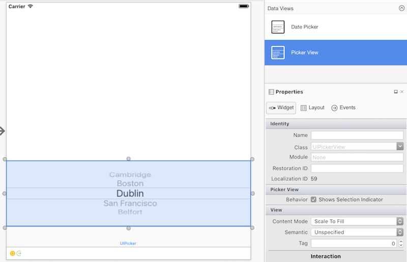
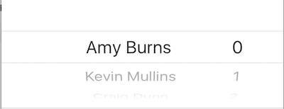
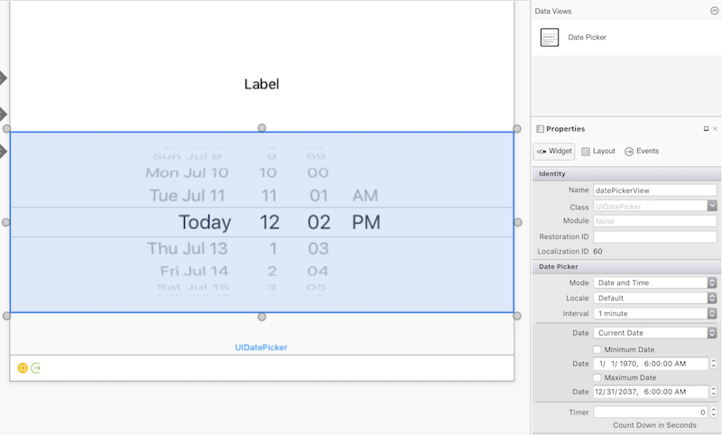
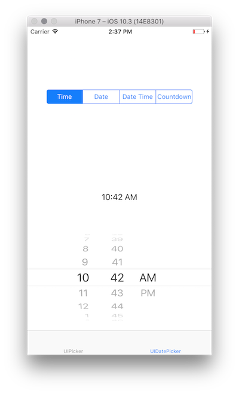
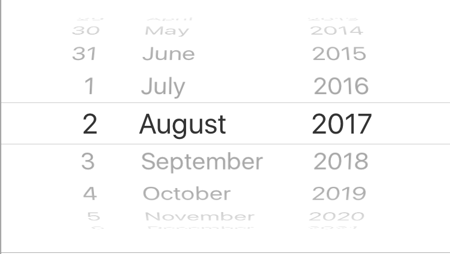
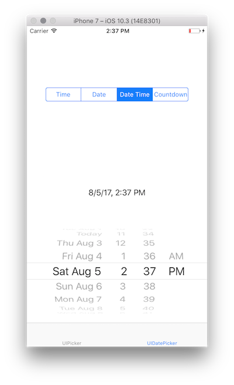
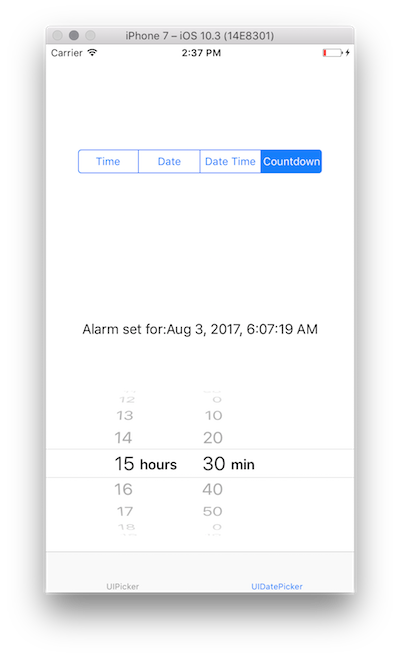

# Picker control in Xamarin.iOS

A [`UIPickerView`](xref:UIKit.UIPickerView)
makes it possible to pick a value from a list by scrolling individual
components of a wheel-like interface.

Pickers are frequently used to select a date and time; Apple provides the
[`UIDatePicker`](xref:UIKit.UIDatePicker)
class for this purpose.

The article describes how to implement and use the `UIPickerView` and
`UIDatePicker` controls.

## UIPickerView

### Implementing a picker

Implement a picker by instantiating a new `UIPickerView`:

```csharp
UIPickerView pickerView = new UIPickerView(
    new CGRect(
        UIScreen.MainScreen.Bounds.X - UIScreen.MainScreen.Bounds.Width, 
        UIScreen.MainScreen.Bounds.Height - 230,
        UIScreen.MainScreen.Bounds.Width,
        180
    )
);
```

### Pickers and storyboards

To create a picker in the **iOS Designer**, drag a **Picker View** from
the **Toolbox** to the design surface.



### Working with a picker control

A picker uses a _model_ to interact with data:

```csharp
public override void ViewDidLoad()
{
    base.ViewDidLoad();
    var pickerModel = new PeopleModel(personLabel);
    personPicker.Model = pickerModel;
}
```

The [`UIPickerViewModel`](xref:UIKit.UIPickerViewModel) 
base class implements two interfaces,
[`IUIPickerDataSource`](xref:UIKit.IUIPickerViewDataSource)
and [`IUIPickerViewDelegate`](xref:UIKit.IUIPickerViewDelegate),
which declare various methods that specify a picker's data and how it
handles interaction:

```csharp
public class PeopleModel : UIPickerViewModel
{
    public string[] names = new string[] {
            "Amy Burns",
            "Kevin Mullins",
            "Craig Dunn",
            "Joel Martinez",
            "Charles Petzold",
            "David Britch",
            "Mark McLemore",
            "Tom Opegenorth",
            "Joseph Hill",
            "Miguel De Icaza"
        };

    private UILabel personLabel;

    public PeopleModel(UILabel personLabel)
    {
        this.personLabel = personLabel;
    }

    public override nint GetComponentCount(UIPickerView pickerView)
    {
        return 2;
    }

    public override nint GetRowsInComponent(UIPickerView pickerView, nint component)
    {
        return names.Length;
    }

    public override string GetTitle(UIPickerView pickerView, nint row, nint component)
    {
        if (component == 0)
            return names[row];
        else
            return row.ToString();
    }

    public override void Selected(UIPickerView pickerView, nint row, nint component)
    {
        personLabel.Text = $"This person is: {names[pickerView.SelectedRowInComponent(0)]},\n they are number {pickerView.SelectedRowInComponent(1)}";
    }

    public override nfloat GetComponentWidth(UIPickerView picker, nint component)
    {
        if (component == 0)
            return 240f;
        else
            return 40f;
    }

    public override nfloat GetRowHeight(UIPickerView picker, nint component)
    {
        return 40f;
    }
```

A picker can have multiple columns, or _components_. Components partition
a picker into multiple sections, allowing for easier and more specific data
selection:



To specify the number of components in a picker, use the 
[`GetComponentCount`](xref:UIKit.UIPickerViewModel.GetComponentCount(UIKit.UIPickerView)) 
method.

### Customizing a picker's appearance

To customize the appearance of a picker, use the
[`UIPickerView.UIPickerViewAppearance`](xref:UIKit.UIPickerView.UIPickerViewAppearance)
class or override the [`GetView`](xref:UIKit.UIPickerViewModel.GetView(UIKit.UIPickerView,System.nint,System.nint,UIKit.UIView)) and [`GetRowHeight`](xref:UIKit.UIPickerViewModel.GetRowHeight(UIKit.UIPickerView,System.nint))
methods in the `UIPickerViewModel`.

## UIDatePicker

### Implementing a date picker

Implement a date picker by instantiating a `UIDatePicker`:

```csharp
UIPickerView pickerView = new UIPickerView(
    new CGRect(
        UIScreen.MainScreen.Bounds.X - UIScreen.MainScreen.Bounds.Width,
        UIScreen.MainScreen.Bounds.Height - 230,
        UIScreen.MainScreen.Bounds.Width,
        180
     )
);
```

### Date pickers and storyboards

To create a date picker in the **iOS Designer**, drag a **Date Picker** from
the **Toolbox** to the design surface.



### Date picker properties

#### Minimum and maximum date

[`MinimumDate`](xref:UIKit.UIDatePicker.MinimumDate) 
and [`MaximumDate`](xref:UIKit.UIDatePicker.MaximumDate) 
limit the range of dates available in the date picker. For example, the
following code constrains a date picker to the sixty years leading up to
the present moment:

```csharp
var calendar = new NSCalendar(NSCalendarType.Gregorian);
var currentDate = NSDate.Now;
var components = new NSDateComponents();
components.Year = -60;
NSDate minDate = calendar.DateByAddingComponents(components, currentDate, NSCalendarOptions.None);
datePickerView.MinimumDate = minDate;
datePickerView.MaximumDate = currentDate;
```

> [!TIP]
> It's possible to explicitly cast a `DateTime` to an `NSDate`:
>
> ```csharp
> DatePicker.MinimumDate = (NSDate)DateTime.Today.AddDays (-7);
> DatePicker.MaximumDate = (NSDate)DateTime.Today.AddDays (7);
> ```

#### Minute interval

The [`MinuteInterval`](xref:UIKit.UIDatePicker.MinuteInterval) 
property sets the interval at which the picker will display minutes:

```csharp
datePickerView.MinuteInterval = 10;
```

#### Mode

Date pickers support four 
[modes](xref:UIKit.UIDatePickerMode),
described below:

##### UIDatePickerMode.Time

`UIDatePickerMode.Time` displays the time with an hour and minute selector 
and an optional AM or PM designation:

```csharp
datePickerView.Mode = UIDatePickerMode.Time;
```



##### UIDatePickerMode.Date

`UIDatePickerMode.Date` displays the date with a month, day, and year
selector:

```csharp
datePickerView.Mode = UIDatePickerMode.Date;
```


The order of the selectors depends on the date picker's locale, which by
default uses the system locale. The image above shows the layout of the
selectors in the `en_US` locale, but the following changes the order to
Day | Month | Year:

```csharp
datePickerView.Locale = NSLocale.FromLocaleIdentifier("en_GB");
```



##### UIDatePickerMode.DateAndTime

`UIDatePickerMode.DateAndTime` displays a shortened view of the date, the
time in hours and minutes, and an optional AM or PM designation (depending
 on whether a 12 or 24 hour clock is used):

```csharp
datePickerView.Mode = UIDatePickerMode.DateAndTime;
```



As with [`UIDatePickerMode.Date`](#uidatepickermodedate), the order of
the selectors and the use of a 12 or 24 hour clock depends on the locale of
the date picker.

> [!TIP]
> Use the `Date` property to capture the value of a date picker in mode
> `UIDatePickerMode.Time`, `UIDatePickerMode.Date`, or
> `UIDatePickerMode.DateAndTime`. This value is stored as an `NSDate`.

##### UIDatePickerMode.CountDownTimer

`UIDatePickerMode.CountDownTimer` displays hour and minute values:

```csharp
datePickerView.Mode = UIDatePickerMode.CountDownTimer;
```



The `CountDownDuration` property captures the value of a date picker in
`UIDatePickerMode.CountDownTimer` mode. For example, to add the countdown
value to the current date:

```csharp
var currentTime = NSDate.Now;
var countDownTimerTime = datePickerView.CountDownDuration;
var finishCountdown = currentTime.AddSeconds(countDownTimerTime);

dateLabel.Text = "Alarm set for:" + coundownTimeformat.ToString(finishCountdown);
```

#### NSDateFormatter

To format an `NSDate`, use an
[`NSDateFormatter`](xref:Foundation.NSDateFormatter).

To use an `NSDateFormatter`, call its [`ToString`](xref:Foundation.NSDateFormatter.ToString(Foundation.NSDate)) 
method. For example:

```csharp
var date = NSDate.Now;
var formatter = new NSDateFormatter();
formatter.DateStyle = NSDateFormatterStyle.Full;
formatter.TimeStyle = NSDateFormatterStyle.Full;
var formattedDate = formatter.ToString(d);
// Tuesday, August 14, 2018 at 11:20:42 PM Mountain Daylight Time
```

##### DateFormat

The [`DateFormat`](xref:Foundation.NSDateFormatter.DateFormat)
property (a string) of an `NSDateFormatter` allows for a
customizable date format specification:

```csharp
NSDateFormatter dateFormat = new NSDateFormatter();
dateFormat.DateFormat = "yyyy-MM-dd";
```

##### TimeStyle

The [`TimeStyle`](xref:Foundation.NSDateFormatter.TimeStyle) 
property (an [`NSDateFormatterStyle`](xref:Foundation.NSDateFormatterStyle) 
of an `NSDateFormatter` specifies time formatting based on predetermined 
styles:

```csharp
NSDateFormatter timeFormat = new NSDateFormatter();
timeFormat.TimeStyle = NSDateFormatterStyle.Short;
```

Various `NSDateFormatterStyle` values display times as follows:

- `NSDateFormatterStyle.Full`: 7:46:00 PM Eastern Daylight Time
- `NSDateFormatterStyle.Long`: 7:47:00 PM EDT
- `NSDateFormatterStyle.Medium`: 7:47:00 PM
- `NSDateFormatterSytle.Short`: 7:47 PM

##### DateStyle

The [`DateStyle`](xref:Foundation.NSDateFormatter.DateStyle)
property (an `NSDateFormatterStyle`) of an `NSDateFormatter` specifies
date formatting based on predetermined styles:

```csharp
NSDateFormatter dateTimeformat = new NSDateFormatter();
dateTimeformat.DateStyle = NSDateFormatterStyle.Long;
```

Various `NSDateFormatterStyle` values display dates as follows:

- `NSDateFormatterStyle.Full`: Wednesday, August 2, 2017 at 7:48 PM
- `NSDateFormatterStyle.Long`: August 2, 2017 at 7:49 PM
- `NSDateFormatterStyle.Medium`: Aug 2, 2017, 7:49 PM
- `NSDateFormatterStyle.Short`: 8/2/17, 7:50 PM

> [!NOTE]
> `DateFormat` and `DateStyle`/`TimeStyle` provide different ways of
> specifying date and time formatting. The most recently set properties
> determine the date formatter's output.

## Related links

- [PickerControl (sample)](/samples/xamarin/ios-samples/pickercontrol)