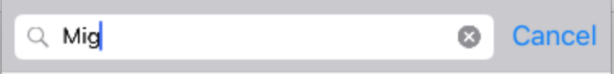
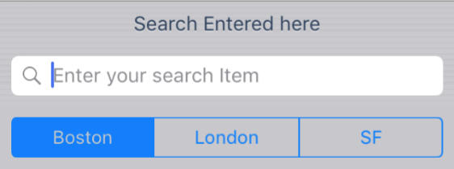
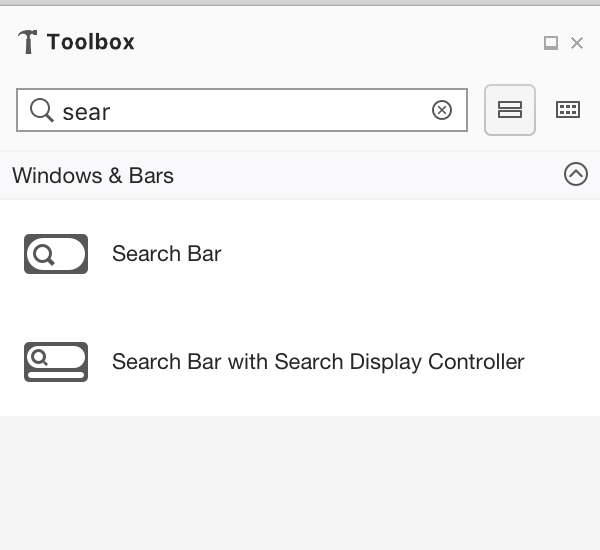
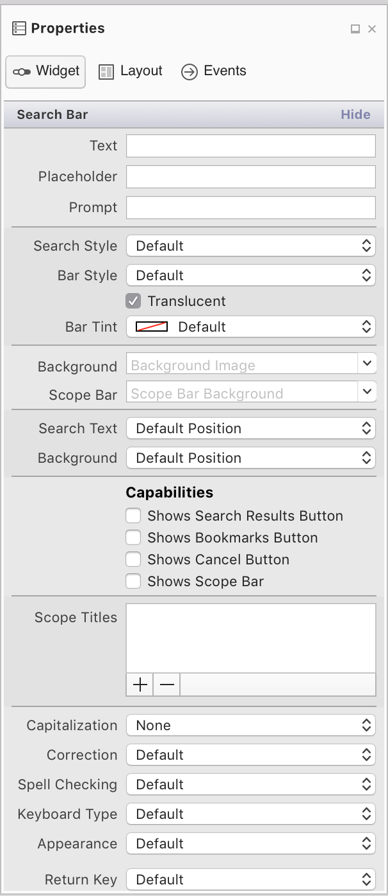
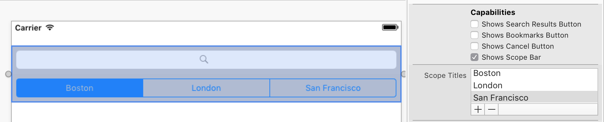

# Search Bars in Xamarin.iOS

The UISearchBar is used to search through a list of values. 

It contains three main components: 

- A field used to enter text. Users can utilize this to enter their search term.
- A clear button, to remove any text from the search field.
- A Cancel button, to exit the search function.



## Implementing the Search Bar

To implement the search bar  start by instantiating a new one:

```csharp
searchBar = new UISearchBar();
```

And then place it. The example below shows how to place it in the navigation bar or in the HeaderView of a Table:

```csharp
NavigationItem.TitleView = searchBar;

\\or

TableView.TableHeaderView = searchBar;
```

Setting properties on the Search bar:

```csharp
 searchBar = new UISearchBar(){
                Placeholder = "Enter your search Item",
                Prompt = "Search Entered here",
                ShowsScopeBar = true,
                ScopeButtonTitles = new string[]{ "Boston", "London", "SF" },
            };
```



Raise the `SearchButtonClicked` event when the search button is pressed. This will call your search logic:

```csharp
searchBar.SearchButtonClicked += (sender, e) => {
                Search ();
            };
```

For information on managing the presentation of the search bar and search results, refer to the [Search Controller ](https://github.com/xamarin/recipes/tree/master/Recipes/ios/content_controls/search-controller) recipe.

## Using the Search Bar in the Designer

The Designer offers two options for implementing a Search Bar in the designer

- Search Bar
- Search Bar with Search Display Controller (Deprecated)



Use the Property Panel to set properties on the search bar



These properties are explained below:

- **Text, Placeholder, Prompt** – These properties are used to suggest and instruct how users should use the search bar. For example, if your app displayed a list of stores you could use the prompt property to advise that users can "Enter a city, story name, or Zip Code"
- **Search Style** – You can set the search bar to either be **Prominent** or **Minimal**. Using the prominent will tint everything else on screen, except for the search bar, causing the focus to be drawn to the search bar. The minimal style search bar will blend in with its surroundings.
- **Capabilities** – Enabling these properties only displays the UI element. The functionality must be implemented for these by raising the correct event as detailed in the [Search Bar API docs](xref:UIKit.UISearchBar)
    - Shows Search Results / Bookmarks button – Shows a Search Results or Bookmarks icon on the search bar
    - Shows Cancel button – Allows users to exit out of the search function. It is recommended that this is selected.
    - Shows Scope Bar – This allows users to limit the scope of their search. For example, when searching in the music app the user can select whether they want to search Apple Music or their Library for a particular song or artist. To display various options, add an array of titles to the **ScopeBarTitles** property.
    

- **Text behavior** – These options are used to address how the user input is formatted when they are typing. Capitalization will set the start of each word or sentence, or every character as upper case. Correction and Spell Checking with prompt the user with suggested spellings of words as they type.
- **Keyboard** – Controls the keyboard style displayed for the input, and therefore what keys are available on the keyboard. This includes Number Pad, Phone Pad, Email, URL along with other options.
- **Appearance** – Controls the appearance style of the keyboard and will be either dark or light themed.
- **Return Key** – Change the label on the Return key to better reflect what action will be taken. Supported values include Go, Join, Next, Route, Done, and Search.
- **Secure** – Identifies whether the input is masked (such as for a Password input).

## Related Links

- [Search Controller](https://github.com/xamarin/recipes/tree/master/Recipes/ios/content_controls/search-controller)
