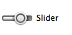
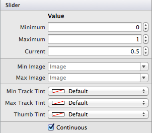
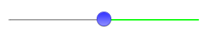
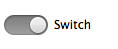
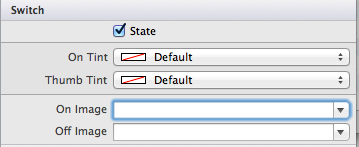
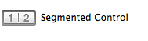
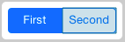
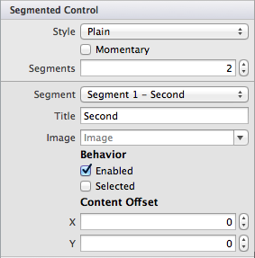

# Sliders, Switches, and Segmented Controls in Xamarin.iOS

<a name="Sliders"></a>

## Sliders

The slider control allows for simple selection of a numeric value within a range. The control defaults to a value between 
0 and 1 but these limits can be customized.

 [](slider-switch-segmented-controls-images/image25a.png#lightbox)

The following screenshot shows the properties that are editable in the Designer:

 [](slider-switch-segmented-controls-images/image25a.png#lightbox)

You can set these values in code as shown below, including wiring up a handler to display the currently selected value 
in a `UILabel` control:

```csharp
slider1.MinValue = -1;
slider1.MaxValue = 2;
slider1.Value = 0.5f; // the current value
slider1.ValueChanged += (sender,e) => label1.Text = ((UISlider)sender).Value.ToString ();
```

You can also customize the visual appearance of the slider by setting

```csharp
slider1.ThumbTintColor = UIColor.Blue;
slider1.MinimumTrackTintColor = UIColor.Gray;
slider1.MaximumTrackTintColor = UIColor.Green;
```

The customized slider looks like this:

 [](slider-switch-segmented-controls-images/image28a.png#lightbox)

> [!IMPORTANT]
> There is currently a [bug](https://stackoverflow.com/a/19496179) causing the `ThumbTint` to not 
render at run time as expected. You can add the following line of code **before** the code above as a 
workaround. [[Source](https://stackoverflow.com/a/21396794)]:
>
> `slider1.SetThumbImage(UIImage.FromBundle("thumb.png"),UIControlState.Normal);`
> 
> You can use any image, as it will be overridden, but make sure it is placed _in_ the Resources directory and is called in your code.

<a name="Switch"></a>

## Switch

iOS uses the `UISwitch` as a boolean input that may be represented by a radio-button on other platforms. The user can 
manipulate the control by moving the *thumb* between the **On/Off** positions.

 [](slider-switch-segmented-controls-images/image28a.png#lightbox)

The appearance of the switch can be customized in the **Properties Pad** of the designer, which 
will let you control the default state, **On/Off tint** colors and an **On/Off Image**. This is illustrated in the image below:

 [](slider-switch-segmented-controls-images/image29a.png#lightbox)

The properties of the switch can also be set in code, for example the code below will show a switch with the default 
value of `On`:

```csharp
switch1.On = true;
```

 <a name="Segmented_Controls"></a>

## Segmented Controls

A Segmented Control is an organized way to allow users to interact with a small number of options. It is laid out 
horizontally and each segment functions as a separate button. When using the Designer, the Segmented Control 
can be found under **ToolBox > Controls**, and should look like the following image:

 [](slider-switch-segmented-controls-images/segmentedcontrol.png#lightbox)

A unique feature of the Designer allows for each segment to be selected individually on the design surface, as illustrated below:

 [](slider-switch-segmented-controls-images/segmentedcontrolselection.png#lightbox)

This allows the Properties Pad to be used to more precisely control the properties of each segment. You can see the 
editable properties in the screenshot below:

 [](slider-switch-segmented-controls-images/segmentedcontrolproperties.png#lightbox)

It should be noted that the Segmented Control Style has been deprecated in iOS7, and therefore, adjusting options for this in an iOS7 application will have no effect.

## Related Links

- [Controls (sample)](/samples/xamarin/ios-samples/controls)
- [Alert Controller](https://github.com/xamarin/recipes/tree/master/Recipes/ios/standard_controls/alertcontroller)