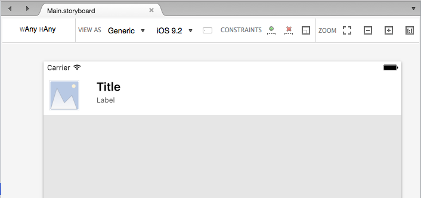
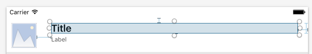
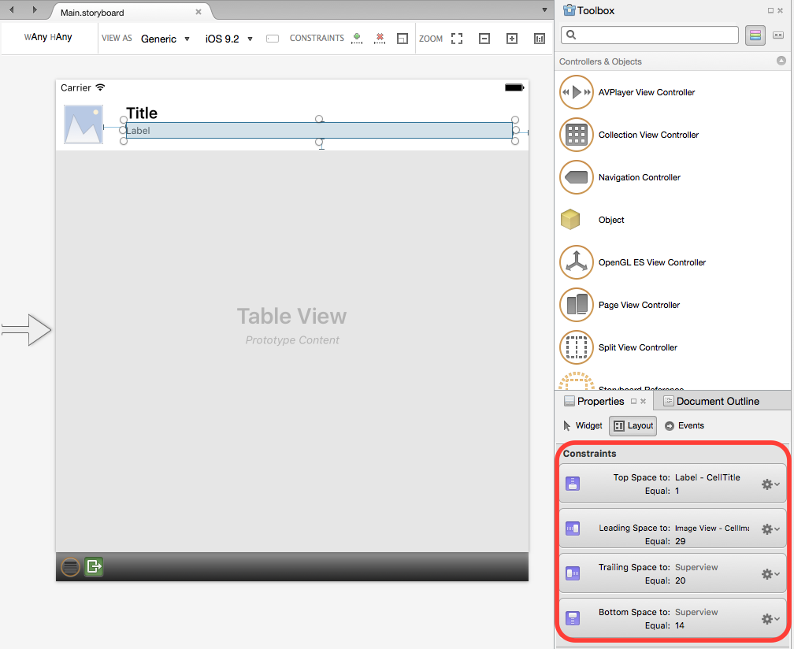
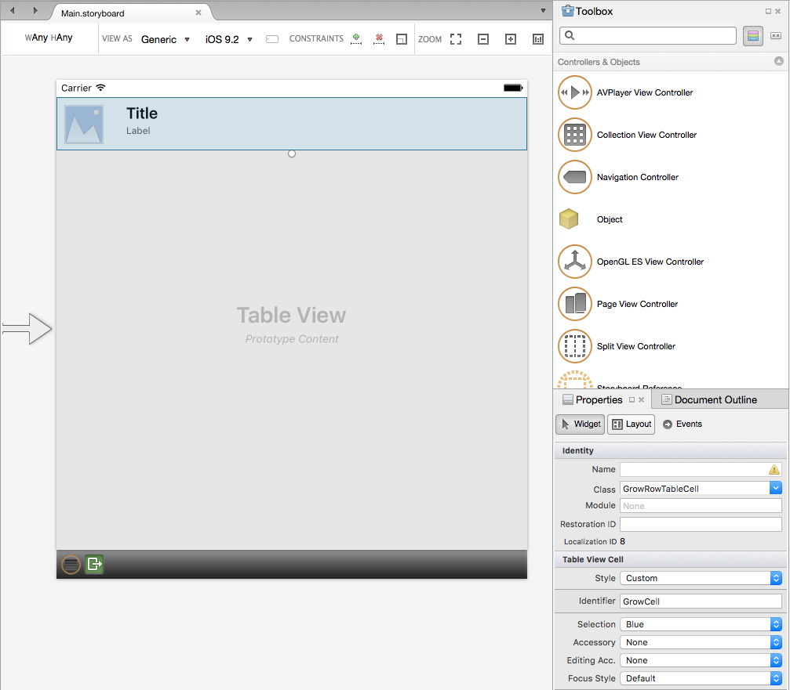
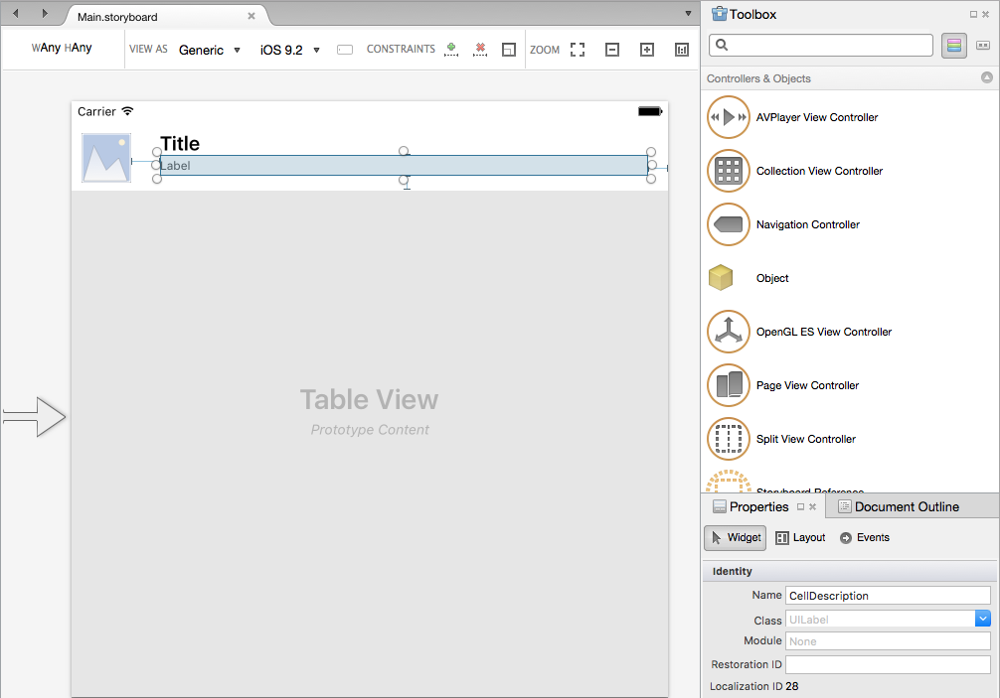
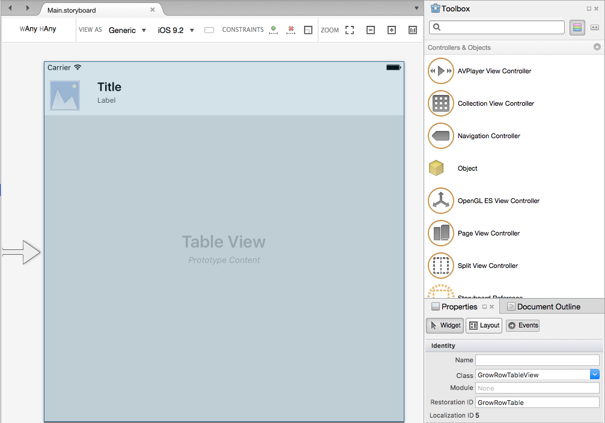

# Auto-Sizing Row Height in Xamarin.iOS
> [!WARNING]
> The iOS Designer was deprecated in Visual Studio 2019 version 16.8 and Visual Studio 2019 for Mac version 8.8, and 
> removed in Visual Studio 2019 version 16.9 and Visual Studio for Mac version 8.9.
> The recommended way to build iOS user interfaces is directly on a Mac running Xcode's Interface Builder. For more information, see [Designing user interfaces with Xcode](~/ios/user-interface/storyboards/index.md). 

Starting with iOS 8, Apple added the ability to create a Table View (`UITableView`) that can automatically grow and shrink the height of a given Row based on the size of its content using Auto Layout, Size Classes and Constraints.

iOS 11 has added the ability for rows to automatically expand. Headers, footers, and cells can now be automatically sized based on their content. However, if your table is created in the iOS Designer, Interface Builder, or if it has fixed row heights you must manually enable self sizing cells, as described in this guide.

## Cell Layout in the iOS Designer

Open the storyboard for the Table View that you want to have the Row's auto-resize for in the iOS Designer, select the Cell's *Prototype* and design the layout of the cell. For example:

[](autosizing-row-height-images/table01.png#lightbox)

For each element in the Prototype, add constraints to keep the elements in the correct position as the Table View is resized for rotation or different iOS Device screen sizes. For example, pinning the `Title` to the top, left and right of the Cell's *Content View*:

[](autosizing-row-height-images/table02.png#lightbox)

In the case of our example table, the small `Label` (under the `Title`) is the field that can shrink and grow to increase or decrease the Row height. To achieve this effect, add the following constraints to pin the left, right, top and bottom of the label:

[](autosizing-row-height-images/table03.png#lightbox)

Now that we have fully constrained the elements in the cell, we need to clarify which element should be stretched. To do this, set the **Content Hugging Priority** and **Content Compression Resistance Priority** as needed in the **Layout** section of the Properties Pad:

[](autosizing-row-height-images/table03a.png#lightbox)

Set the element that you want to expand to have a **lower** Hugging Priority value, and a **lower** Compression Resistance Priority value.

Next, we need to select the Cell Prototype and give it a unique **Identifier**:

[](autosizing-row-height-images/table04.png#lightbox)

In the case of our example, `GrowCell`. We'll use this value later when we populate the table.

> [!IMPORTANT]
> If your table contains more than one cell type (**Prototype**), you need to ensure each type has its own unique `Identifier` for Auto Row Resizing to work.

For each element of our Cell Prototype, assign a **Name** to expose it to C# code. For example:

[](autosizing-row-height-images/table05.png#lightbox)

Next, add a custom class for the `UITableViewController`, the `UITableView` and the `UITableCell` (Prototype). For example:

[](autosizing-row-height-images/table06.png#lightbox)

Finally, to make sure that all expected content is displayed in our label, set the **Lines** property to `0`:

[](autosizing-row-height-images/table06a.png#lightbox)

With the UI defined, let's add the code to enable Auto Row Height Resizing.

## Enabling Auto-Resizing Height

In either our Table View's Datasource (`UITableViewDatasource`) or Source (`UITableViewSource`), when we dequeue a Cell we need to use the `Identifier` that we defined in the designer. For example:

```csharp
public string CellID {
    get { return "GrowCell"; }
}
...

public override UITableViewCell GetCell (UITableView tableView, Foundation.NSIndexPath indexPath)
{
    var cell = tableView.DequeueReusableCell (CellID, indexPath) as GrowRowTableCell;
    var item = Items [indexPath.Row];

    // Setup
    cell.Image = UIImage.FromFile(item.ImageName);
    cell.Title = item.Title;
    cell.Description = item.Description;

    return cell;
}
```

By default, the Table View will be set for Auto-Resizing Row Height. To ensure this, the `RowHeight` property should be set to `UITableView.AutomaticDimension`. We also need to set the `EstimatedRowHeight` property in our `UITableViewController`. For example:

```csharp
public override void ViewWillAppear (bool animated)
{
    base.ViewWillAppear (animated);

    // Initialize table
    TableView.DataSource = new GrowRowTableDataSource(this);
    TableView.Delegate = new GrowRowTableDelegate (this);
    TableView.RowHeight = UITableView.AutomaticDimension;
    TableView.EstimatedRowHeight = 40f;
    TableView.ReloadData ();
}
```

This estimate doesn't have to be exact, just a rough estimate of the average height of each Row in the Table View.

With this code in place, when the app is run, each row will shrink and grow based on the height of the last Label in the Cell Prototype. For example:

[](autosizing-row-height-images/table07.png#lightbox)

## Related Links

- [GrowRowTable (sample)](/samples/xamarin/ios-samples/growrowtable)