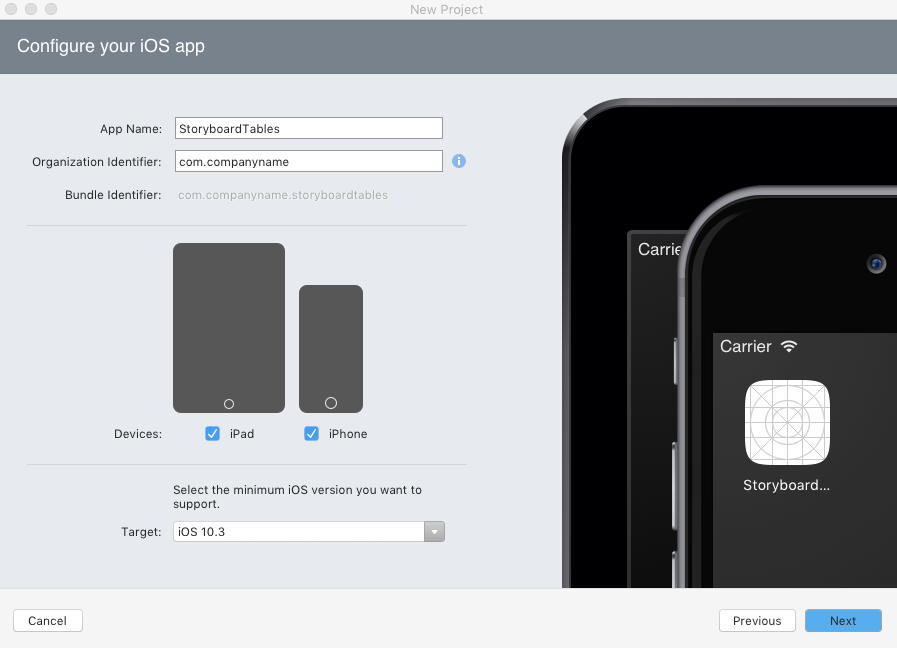
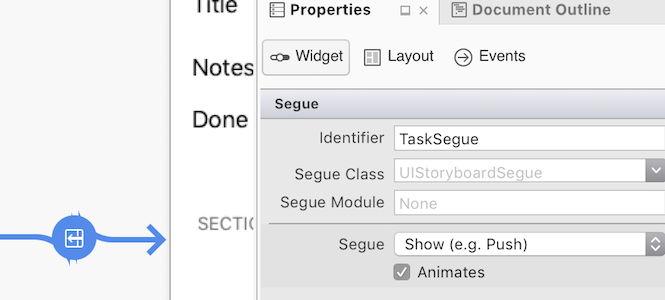
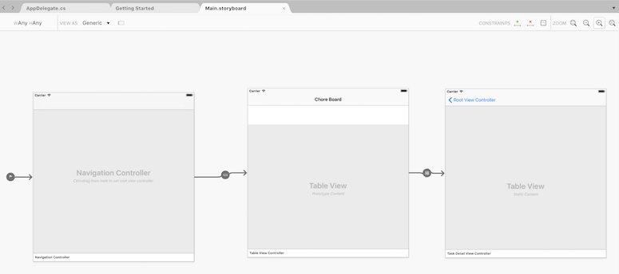
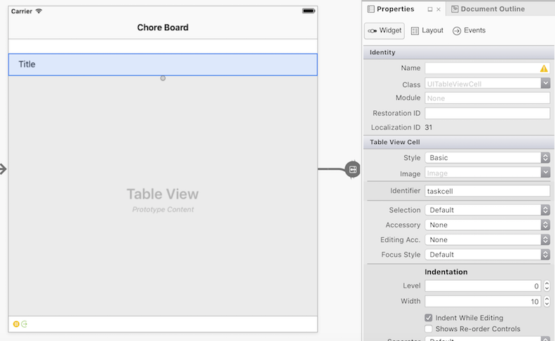
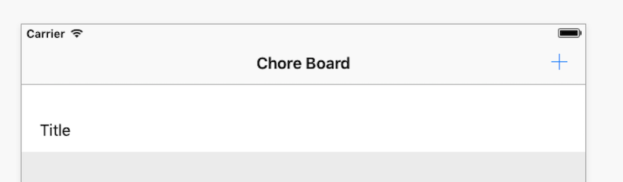
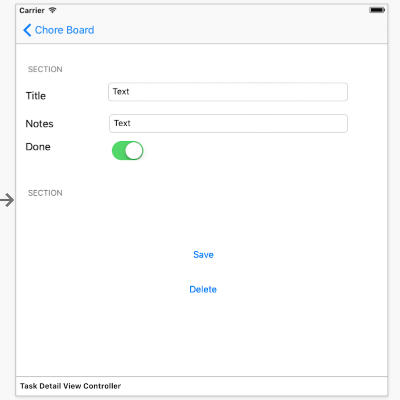
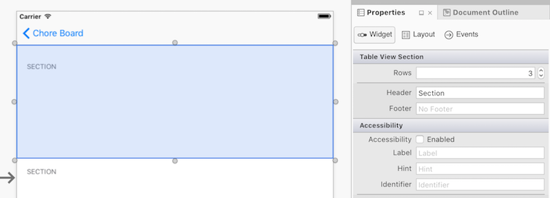
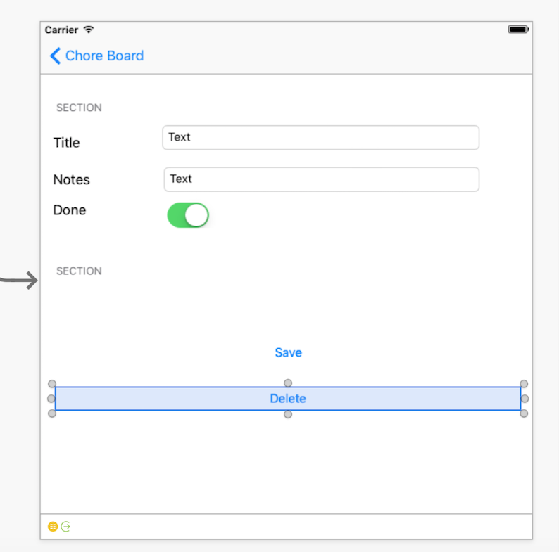

# Working with Tables in the iOS Designer

Storyboards are a WYSIWYG way to create iOS applications, and are supported inside Visual Studio on Mac and Windows. For more information on Storyboards, refer to the [Introduction To Storyboards](~/ios/user-interface/storyboards/index.md) document. Storyboards also allow you to edit the cell layouts *in* the table, which simplifies developing with tables and cells

When configuring properties of a table view in the iOS Designer, there are two types of cell content you can choose from: **Dynamic** or **Static** Prototype Content.

<a name="Prototype_Content"></a>

## Dynamic Prototype Content

A `UITableView` with prototype content is typically intended to display a list
of data where the prototype cell (or cells, as you can define more than one) are
re-used for each item in the list. The cells don’t need to be instantiated,
they are obtained in the `GetView` method by calling the `DequeueReusableCell` method of its `UITableViewSource`.

 <a name="Static_Content"></a>

## Static Content

`UITableView`s with static content allow tables to be designed right on the design surface. Cells can be dragged into the table and customized by changing properties and adding controls.

 <a name="Creating_a_Storyboard-driven_app"></a>

## Creating a Storyboard-Driven App

The StoryboardTable example contains a simple master-detail app that uses
both types of UITableView in a Storyboard. The remainder of this section
describes how to build a small to-do list example that will look like this when complete:

 [](creating-tables-in-a-storyboard-images/image13a.png#lightbox)

The user-interface will be built with a storyboard, and both screens will use
a UITableView. The main screen uses *prototype content* to layout the row,
and the detail screen uses *static content* to create a data-entry form
using custom cell layouts.

## Walkthrough

Create a new solution in Visual Studio using **(Create) New Project… > Single View App(C#)**, and call it _StoryboardTables_.

 [](creating-tables-in-a-storyboard-images/npd.png#lightbox)

The solution will open with some C# files and a `Main.storyboard` file already created. Double-click the `Main.storyboard` file to open it in the iOS Designer.

<a name="Modifying_the_Storyboard"></a>

## Modifying the Storyboard

The storyboard will be edited in three steps:

- First, layout the required view controllers and set their properties.
- Second, create your UI by dragging and dropping objects onto your view
- Finally, add the required UIKit class to each view and give various controls a name so they can be referenced in code.

Once the storyboard is complete, code can be added to make everything work.

<a name="Layout_The_View_Controllers"></a>

### Layout The View Controllers

The first change to the storyboard is deleting the existing Detail view and
replacing it with a UITableViewController. Follow these steps:

1. Select the bar at the bottom of the View Controller and delete it.
2. Drag a **Navigation Controller** and a **Table View Controller** onto the Storyboard from the Toolbox. 
3. Create a segue from the Root View Controller to the second Table View Controller that was just added. To create the segue, Control+drag *from the Detail cell* to the newly added UITableViewController. Choose the option  **Show** under  **Segue Selection**. 
4. Select the new segue you created and give it an identifier to reference this segue in code. Click on the segue and enter `TaskSegue` for the  **Identifier** in the  **Properties Pad**, like this:    
  [](creating-tables-in-a-storyboard-images/image16a.png#lightbox) 

5. Next, configure the two Table Views by selecting them and using the Properties Pad. Make sure to select View and not View Controller – you can use the Document Outline to help with selection.

6. Change the Root View Controller to be  **Content: Dynamic Prototypes** (the View on the Design Surface will be labelled  **Prototype Content** ):

    [](creating-tables-in-a-storyboard-images/image17a.png#lightbox)

7. Change the new **UITableViewController** to be  **Content: Static Cells**. 

8. The new UITableViewController must have its class name and
identifier set. Select the View Controller and type _TaskDetailViewController_ for the **Class** in the **Properties Pad** – this will create a new `TaskDetailViewController.cs` file in the Solution Pad. Enter the **StoryboardID** as _detail_, as illustrated in the example below. This will be
used later to load this view in C# code:  

    [](creating-tables-in-a-storyboard-images/image18a.png#lightbox)

9. The storyboard design surface should now look like this (the Root View Controller's navigation item title
has been changed to “Chore Board”):

    [](creating-tables-in-a-storyboard-images/image20a.png#lightbox)  

<a name="Create_the_UI"></a>

### Create the UI

Now that the views and segues are configured, the user interface elements
need to be added.

#### Root View Controller

First, select the prototype cell in the Master View Controller and set the **Identifier** as _taskcell_, as illustrated below. This will be used later in code to retrieve an instance of this UITableViewCell:

 [](creating-tables-in-a-storyboard-images/image22a.png#lightbox)

Next, you'll need to create a button that will add new tasks, as illustrated below:

[](creating-tables-in-a-storyboard-images/image23.png#lightbox)

Do the following: 

- Drag a **Bar Button Item** from the Toolbox to the _right hand side of the navigation bar_.
- In the **Properties Pad**, under **Bar Button Item** select  **Identifier: Add** (to make it a *+* plus button). 
- Give it a Name so that it can be identified in code at a later stage. Note that you will need to give the Root View Controller a Class Name (for example **ItemViewController**) to allow you to set the Bar button item's name.

#### TaskDetail View Controller

The Detail View requires a lot more work. Table View Cells need to be dragged
onto the view and then populated with labels, text views and buttons. The
screenshot below shows the finished UI with two sections. One section has three cells, three labels, two text fields and one switch, while the second section has one cell with two buttons:

 [](creating-tables-in-a-storyboard-images/image24a.png#lightbox)

The steps to build the complete layout are:

Select the table view and open the **Property Pad**. Update the following properties:

- **Sections**: _2_ 
- **Style**: _Grouped_
- **Separator**: _None_
- **Selection**: _No Selection_

Select the top section and under **Properties > Table View Section** change **Rows** to _3_, as illustrated below:

 [](creating-tables-in-a-storyboard-images/image29.png#lightbox)

For each cell open the **Properties Pad** and set:

- **Style**:  _Custom_
- **Identifier**: Choose a unique identifier for each cell (eg. “_title_”, “_notes_”, “_done_”).
- Drag the required controls to produce the layout shown in the screenshot (place **UILabel**, **UITextField** and **UISwitch** on the correct cells, and set the labels appropriately, ie. Title, Notes and Done).

In the second section, set **Rows** to _1_ and grab the bottom resize handle of the cell to make it taller.

- **Set the Identifier**: to a unique value (eg. “save”). 
- **Set the Background**:  _Clear Color_ .
- Drag two buttons onto the cell and set their titles appropriately (i.e. _Save_ and _Delete_), as illustrated below:

   [](creating-tables-in-a-storyboard-images/image30.png#lightbox)

At this point you may also want to set constraints on your cells and controls to ensure an adaptive layout.

### Adding UIKit Class and Naming Controls

There are a few final steps in creating our Storyboard. First we must give each of our controls a name under **Identity > Name** so they can be used in code later on. Name these as follows:

- **Title UITextField** : _TitleText_
- **Notes UITextField** : _NotesText_
- **UISwitch** : _DoneSwitch_
- **Delete UIButton** : _DeleteButton_
- **Save UIButton** : _SaveButton_

<a name="Adding_Code"></a>

## Adding Code

The remainder of the work will be done in Visual Studio on Mac or Windows with C#. Note that the property names used in code reflect those set in the walkthrough above.

First we want to create a `Chores` class, which will provide a way to get and set the value of ID, Name, Notes and the Done Boolean, so that we can use those values throughout the application.

In your `Chores` class add the following code:

```csharp
public class Chores {
    public int Id { get; set; }
    public string Name { get; set; }
    public string Notes { get; set; }
    public bool Done { get; set; }
  }
```

Next, create a `RootTableSource` class that inherits from `UITableViewSource`. 

The difference between this and a non-Storyboard table view is that the `GetView` method doesn’t need to instantiate any cells – `theDequeueReusableCell` method will always return an instance of the prototype cell (with matching identifier).

The code below is from the `RootTableSource.cs` file:

```csharp
public class RootTableSource : UITableViewSource
{
// there is NO database or storage of Tasks in this example, just an in-memory List<>
Chores[] tableItems;
string cellIdentifier = "taskcell"; // set in the Storyboard

    public RootTableSource(Chores[] items)
    {
        tableItems = items;
    }

public override nint RowsInSection(UITableView tableview, nint section)
{
  return tableItems.Length;
}

public override UITableViewCell GetCell(UITableView tableView, NSIndexPath indexPath)
{
  // in a Storyboard, Dequeue will ALWAYS return a cell, 
  var cell = tableView.DequeueReusableCell(cellIdentifier);
  // now set the properties as normal
  cell.TextLabel.Text = tableItems[indexPath.Row].Name;
  if (tableItems[indexPath.Row].Done)
    cell.Accessory = UITableViewCellAccessory.Checkmark;
  else
    cell.Accessory = UITableViewCellAccessory.None;
  return cell;
}
public Chores GetItem(int id)
{
  return tableItems[id];
}
```

To use the `RootTableSource` class, create a new collection in the `ItemViewController`’s constructor:

```csharp
chores = new List<Chore> {
      new Chore {Name="Groceries", Notes="Buy bread, cheese, apples", Done=false},
      new Chore {Name="Devices", Notes="Buy Nexus, Galaxy, Droid", Done=false}
    };
```

In `ViewWillAppear` pass the collection to the source and assign
to the table view:

```csharp
public override void ViewWillAppear(bool animated)
{
    base.ViewWillAppear(animated);

    TableView.Source = new RootTableSource(chores.ToArray());
}
```

If you run the app now, the main screen will now load and display a list of two tasks. When a task is
touched the segue defined by the storyboard will cause the detail screen to
appear, but it will not display any data at the moment.

To ‘send a parameter’ in a segue, override the `PrepareForSegue` method and set properties on the `DestinationViewController` (the `TaskDetailViewController` in this example). The Destination View Controller class will have been instantiated but is not yet displayed to the user – this means you can set properties on the class but
not modify any UI controls:

```csharp
public override void PrepareForSegue (UIStoryboardSegue segue, NSObject sender)
    {
      if (segue.Identifier == "TaskSegue") { // set in Storyboard
        var navctlr = segue.DestinationViewController as TaskDetailViewController;
        if (navctlr != null) {
          var source = TableView.Source as RootTableSource;
          var rowPath = TableView.IndexPathForSelectedRow;
          var item = source.GetItem(rowPath.Row);
          navctlr.SetTask (this, item); // to be defined on the TaskDetailViewController
        }
      }
    }
```

In `TaskDetailViewController` the `SetTask` method assigns its
parameters to properties so they can be referenced in ViewWillAppear. The
control properties cannot be modified in `SetTask` because may not
exist when `PrepareForSegue` is called:

```csharp
Chore currentTask {get;set;}
    public ItemViewController Delegate {get;set;} // will be used to Save, Delete later

public override void ViewWillAppear (bool animated)
    {
      base.ViewWillAppear (animated);
      TitleText.Text = currentTask.Name;
      NotesText.Text = currentTask.Notes;
      DoneSwitch.On = currentTask.Done;
    }

    // this will be called before the view is displayed
    public void SetTask (ItemViewController d, Chore task) {
      Delegate = d;
      currentTask = task;
    }
```

The segue will now open the detail screen and display the selected task
information. Unfortunately there is no implementation for the **Save** and **Delete**
buttons. Before implementing the buttons, add these methods to **ItemViewController.cs** to update the underlying data and close the detail screen:

```csharp
public void SaveTask(Chores chore)
{
  var oldTask = chores.Find(t => t.Id == chore.Id);
        NavigationController.PopViewController(true);
}

public void DeleteTask(Chores chore)
{
  var oldTask = chores.Find(t => t.Id == chore.Id);
  chores.Remove(oldTask);
        NavigationController.PopViewController(true);
}
```

Next, you'll need to add the button's `TouchUpInside` event handler to the `ViewDidLoad` method of **TaskDetailViewController.cs**. The `Delegate` property reference to the `ItemViewController` was created
specifically so we can call `SaveTask` and `DeleteTask`,
which close this view as part of their operation:

```csharp
SaveButton.TouchUpInside += (sender, e) => {
        currentTask.Name = TitleText.Text;
        currentTask.Notes = NotesText.Text;
        currentTask.Done = DoneSwitch.On;
        Delegate.SaveTask(currentTask);
      };

DeleteButton.TouchUpInside += (sender, e) => Delegate.DeleteTask(currentTask);
```

The last remaining piece of functionality to build is the creation of new
tasks. In **ItemViewController.cs** add a method that creates new tasks and opens
the detail view. To instantiate a view from a storyboard use the `InstantiateViewController` method with the `Identifier`
for that view - in this example that will be 'detail':

```csharp
public void CreateTask () 
    {
      // first, add the task to the underlying data
      var newId = chores[chores.Count - 1].Id + 1;
      var newChore = new Chore{Id = newId};
      chores.Add (newChore);

      // then open the detail view to edit it
      var detail = Storyboard.InstantiateViewController("detail") as TaskDetailViewController;
      detail.SetTask (this, newChore);
      NavigationController.PushViewController (detail, true);
    }
```

Finally, wire up the button in the navigation bar in **ItemViewController.cs**'s `ViewDidLoad` method to call it:

```csharp
AddButton.Clicked += (sender, e) => CreateTask ();
```

That completes the Storyboard example – the finished app looks like
this:

[](creating-tables-in-a-storyboard-images/image28a.png#lightbox)

The example demonstrates:

- Creating a table with Prototype Content where cells are defined for re-use to display lists of data. 
- Creating a table with Static Content to build an input form. This included changing the table style and adding sections, cells and UI controls. 
- How to create a segue and override the  `PrepareForSegue` method to notify the target view of any parameters it requires. 
- Loading storyboard views directly with the  `Storyboard.InstantiateViewController` method.

## Related Links

- [StoryboardTable (sample)](/samples/xamarin/ios-samples/storyboardtable)
- [Introduction to Storyboards](~/ios/user-interface/storyboards/index.md)