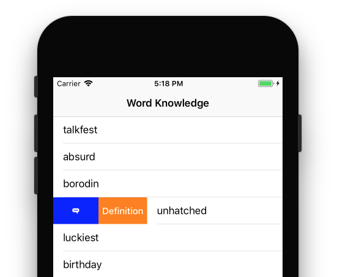
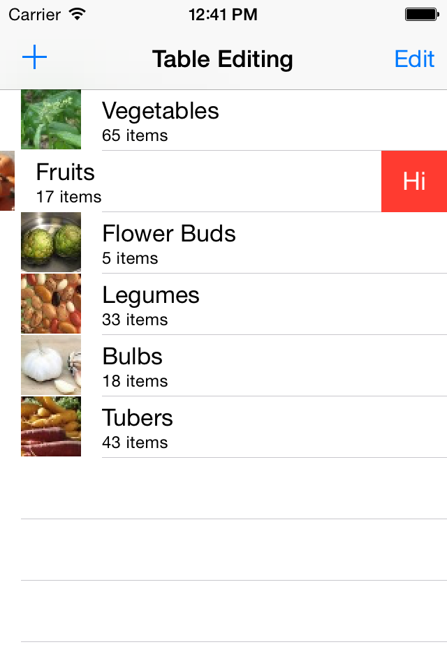

# Working with Row Actions in Xamarin.iOS

_This guide demonstrates how to create custom swipe actions for table rows with UISwipeActionsConfiguration or UITableViewRowAction_



iOS provides two ways to perform actions on a table: `UISwipeActionsConfiguration`
and `UITableViewRowAction`.

`UISwipeActionsConfiguration` was introduced in iOS 11 and is used to define a set of actions that should take place when the user swipes _in either direction_ on a row in a table view. This behavior is similar to that of the native Mail.app

The `UITableViewRowAction` class is used to define an action that will take
place when the user swipes left horizontally on a row in a table view.
For example, when editing a table, swiping left on a row displays a **Delete**
button by default. By attaching multiple instances of the `UITableViewRowAction`
class to a `UITableView`, multiple custom actions can be defined, each with its
own text, formatting and behavior.

## UISwipeActionsConfiguration

There are a three steps required to implement swipe actions with `UISwipeActionsConfiguration`:

1. Override `GetLeadingSwipeActionsConfiguration` and/or `GetTrailingSwipeActionsConfiguration` methods. These methods return a `UISwipeActionsConfiguration`.
2. Instantiate the `UISwipeActionsConfiguration` to be returned. This class takes an array of `UIContextualAction`.
3. Create a `UIContextualAction`.

These are explained in greater detail in the following sections.

### 1. Implementing the SwipeActionsConfigurations methods

`UITableViewController` (and also `UITableViewSource` and `UITableViewDelegate`) contain two methods: `GetLeadingSwipeActionsConfiguration` and `GetTrailingSwipeActionsConfiguration`, that are used to implement a set of swipe actions on a table view row. The leading swipe action refers to a swipe from the left hand side of the screen in a left-to-right language and from the right hand side of the screen in a right-to-left language.

The following example (from the [TableSwipeActions](/samples/xamarin/ios-samples/tableswipeactions) sample) demonstrates implementing the leading swipe configuration. Two actions are created from the contextual actions, which are explained [below](#create-uicontextualaction). These actions are then passed in to a newly initialized [`UISwipeActionsConfiguration`](#create-uiswipeactionsconfigurations), which is used as the return value.

```csharp
public override UISwipeActionsConfiguration GetLeadingSwipeActionsConfiguration(UITableView tableView, NSIndexPath indexPath)
{
    //UIContextualActions
    var definitionAction = ContextualDefinitionAction(indexPath.Row);
    var flagAction = ContextualFlagAction(indexPath.Row);

    //UISwipeActionsConfiguration
    var leadingSwipe = UISwipeActionsConfiguration.FromActions(new UIContextualAction[] { flagAction, definitionAction });

    leadingSwipe.PerformsFirstActionWithFullSwipe = false;

    return leadingSwipe;
}
```

<a name="create-uiswipeactionsconfigurations"></a>

### 2. Instantiate a `UISwipeActionsConfiguration`

Instantiate a `UISwipeActionsConfiguration` by using the `FromActions` method to add a new array of `UIContextualAction`s, as shown in the following code snippet:

```csharp
var leadingSwipe = UISwipeActionsConfiguration.FromActions(new UIContextualAction[] { flagAction, definitionAction })

leadingSwipe.PerformsFirstActionWithFullSwipe = false;
```

It's important to note that the order in which your actions display is dependent on how they are passed into your array. For example, the code above for leading swipes displays the actions as so:


For trailing swipes, the actions will be displayed as illustrated in the following image:


This code snippet also makes use of the new `PerformsFirstActionWithFullSwipe` property. By default, this property is set to true, meaning that the first action in the array will happen when a user swipes fully on a row. If you have an action that is not destructive (for example "Delete", this might not be ideal behavior and you should therefore set it to `false`.

<a name="create-uicontextualaction"></a>

### Create a `UIContextualAction`

The contextual action is where you actually create the action that will be displayed when the user swipes a table row.

To initialize an action you must provide a `UIContextualActionStyle`, a title, and a `UIContextualActionHandler`. The `UIContextualActionHandler` takes three parameters: an action, the view that the action was displayed in, and a completion handler:

```csharp
public UIContextualAction ContextualFlagAction(int row)
{
    var action = UIContextualAction.FromContextualActionStyle
                    (UIContextualActionStyle.Normal,
                        "Flag",
                        (FlagAction, view, success) => {
                            var alertController = UIAlertController.Create($"Report {words[row]}?", "", UIAlertControllerStyle.Alert);
                            alertController.AddAction(UIAlertAction.Create("Cancel", UIAlertActionStyle.Cancel, null));
                            alertController.AddAction(UIAlertAction.Create("Yes", UIAlertActionStyle.Destructive, null));
                            PresentViewController(alertController, true, null);

                            success(true);
                        });

    action.Image = UIImage.FromFile("feedback.png");
    action.BackgroundColor = UIColor.Blue;

    return action;
}
```

Various visual properties, such as the background color or image of the action can be edited. The code snippet above demonstrates adding an image to the action and setting its background color to blue.

Once the contextual actions have been created, they can use to initialize the `UISwipeActionsConfiguration` in the `GetLeadingSwipeActionsConfiguration` method.

## UITableViewRowAction

To define one or more custom row actions for a `UITableView`, you will need to
create an instance of the `UITableViewDelegate` class and override the
`EditActionsForRow` method. For example:

```csharp
using System;
using System.Collections.Generic;
using System.IO;
using Foundation;
using UIKit;

namespace BasicTable
{
    public class TableDelegate : UITableViewDelegate
    {
        #region Constructors
        public TableDelegate ()
        {
        }

        public TableDelegate (IntPtr handle) : base (handle)
        {
        }

        public TableDelegate (NSObjectFlag t) : base (t)
        {
        }

        #endregion

        #region Override Methods
        public override UITableViewRowAction[] EditActionsForRow (UITableView tableView, NSIndexPath indexPath)
        {
            UITableViewRowAction hiButton = UITableViewRowAction.Create (
                UITableViewRowActionStyle.Default,
                "Hi",
                delegate {
                    Console.WriteLine ("Hello World!");
                });
            return new UITableViewRowAction[] { hiButton };
        }
        #endregion
    }
}
```

The static `UITableViewRowAction.Create` method is used to create a new
`UITableViewRowAction` that will display a **Hi** button when the user swipes
left horizontally on a row in the table. Later a new instance of the `TableDelegate`
is created and attached to the `UITableView`. For example:

```csharp
TableDelegate tableDelegate;
...

// Replace the standard delete button with a "Hi" button
tableDelegate = new TableDelegate ();
table.Delegate = tableDelegate;

```

When the above code is run and the user swipes left on a table row,
the **Hi** button will be displayed instead of the **Delete** button that is displayed by default:

[](row-action-images/action01.png#lightbox)

If the user taps the **Hi** button, `Hello World!` will be written out to the
console in Visual Studio for Mac or Visual Studio when the application is run in the debug mode.

## Related Links

- [TableSwipeActions (sample)](/samples/xamarin/ios-samples/tableswipeactions)
- [WorkingWithTables (sample)](/samples/xamarin/ios-samples/workingwithtables)