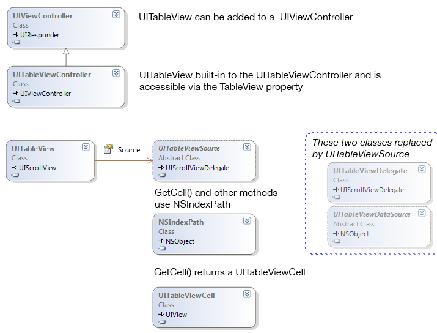

# Table Parts and Functionality in Xamarin.iOS

A UITableView can have a ‘grouped’ or ‘plain’ style, and consists of
the following parts:

- [Section Header](#Section_Header)
- [Cells](#Cells) (or rows, if you prefer)
- [Section Footer](#Section_Footer)
- [Index](#Index)
- [Editing mode](#Edit_Features) (includes ‘swipe to delete’ and drag handles to change row order) 

These screenshots show how section rows, headers, footers, edit controls and the index are displayed.

 

These parts are described in more detail below:

## Section Header

Cells can optionally be grouped into sections, labeled with a custom header, and/or labeled with a footer. The header can be set with a string value or a custom view can be
supplied to allow for a different layout or style.

## Cells

Cells are the main user interface element for a table. When implemented
correctly, cells are re-used for memory efficiency. There are four built-in cell styles, and you can create your own custom cells – either in code, or in the Designer when using Storyboards.

## Section Footer

The optional section footer can be set with a string value, or a custom view can be supplied to allow for a different layout or style. Section headers and footers
can be set independently.

## Index

The index appears as a strip of characters down the right edge of the table.
Touching or dragging on the index accelerates scrolling to that part of the
table. An index is optional but is recommended to help navigate long lists. An
index is not usually used with the Grouped style.

## Editing Mode

There are a couple of different editing features available:

- Swipe to delete individual cells.
- Entering Edit mode to reveal delete buttons on each row 
- Entering Edit mode to reveal re-ordering handles. 
- Inserting new cells (with animation).

The remainder of this document shows how to implement all these UITableView
features with Xamarin.iOS.

## Classes Overview

The primary classes used to display table views are shown here:

The purpose of each class is described below:

- **UITableView** – A view that contains a collection of cells inside a scrolling container. The table view typically uses the entire screen in an iPhone app but may exist as part of a larger view on the iPad (or appear in a popover). 
- **UITableViewCell** – A view that represents a single cell (or row) in a table view. There are four built-in cell types and it is possible to create custom cells both in C# or with iOS Designer. 
- **UITableViewSource** – Xamarin.iOS-exclusive abstract class that provides all the methods required to display a table, including row count, returning a cell view for each row, handling row selection and many other optional features. You  *must* subclass this to get a UITableView working. 
- **NSIndexPath** – Contains Row and Section properties that uniquely identify the position of a cell in a table. 
- **UITableViewController** – A ready-to-use UIViewController that has a UITableView hardcoded as its view and accessible via the TableView property. 
- **UIViewController** – If the table does not occupy the entire screen you can add a UITableView to any UIViewController with its Frame set appropriately. 

UITableViewSource replaces the following two classes, which are still
available in Xamarin.iOS but are not normally required:

- **UITableViewDataSource** – An Objective-C protocol that is modeled in Xamarin.iOS as an abstract class. Must be subclassed to provide a table with a view for each cell, as well as information about headers, footers and the number of rows and sections in the table. 
- **UITableViewDelegate** – An Objective-C protocol that is modeled in Xamarin.iOS as a class. Handles selection, editing features and other optional table features. 

In this document the examples all use UITableViewSource and ignore these two
classes. They are mentioned here because any Objective-C examples found in
Apple’s documentation will reference them, so it is useful to understand what
they do (and that you can use Xamarin.iOS’s UITableViewSource instead).

## Related Links

- [WorkingWithTables (sample)](/samples/xamarin/ios-samples/workingwithtables)