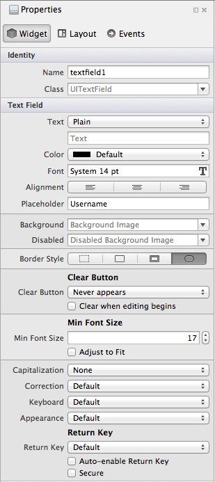
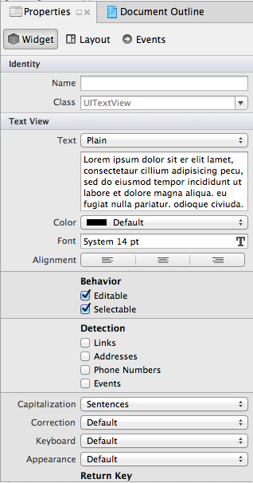

# Text Input in Xamarin.iOS

Accepting user text input is accomplished with the `UITextField` for single-line inputs and UITextView for multi-line editable text. You can drag either of these controls onto a screen and double-click to set the initial text.

The screenshots below show the icons for these controls, located in the Toolbox Pad in Visual Studio for Mac:

 [](text-input-images/image11a.png#lightbox)

 [](text-input-images/image13a.png#lightbox)

Once you have named the outlet and saved the Storyboard file, Visual Studio for Mac will update the `.designer.cs` partial class and you can add C# code that references the control to your class file. Each control has its own unique properties and events that can be accessed in your C# code.

 <a name="UITextField"></a>

## UITextField

The `UITextField` control is most often used to accept a single line of text input such as a username or password. Some of the options available for customizing the control are shown here:

 [](text-input-images/image15a.png#lightbox)

These controls are explained below:

- **Placeholder** – This is optional. If set, it is displayed when the text field is empty, usually to explain to the user what input is expected.
- **Clear Button** – This controls when the standard clear button (the grey circle with (X)) appears in the text field, as a way for the user to clear text quickly. It can be permanently hidden, permanently visible, or shown, depending on whether or not the field is being edited.
- **Min Font Size** and  **Adjust to Fit** – Allows the font size to be adjusted automatically to fit longer text and prevent truncation, but limited to no smaller than the specified size.
- **Capitalization** – Whether to automatically capitalize words, sentences or all input.
- **Correction** – Whether spell checking and suggestions are enabled.
- **Keyboard** – Controls the keyboard style displayed for the input, and therefore what keys are available on the keyboard. This includes Number Pad, Phone Pad, Email, URL along with other options.
- **Appearance** – Controls the appearance style of the keyboard and will be either dark or light themed.
- **Return Key** – Change the label on the Return key to better reflect what action will be taken. Supported values include Go, Join, Next, Route, Done, and Search.
- **Secure** – Identifies whether the input is masked (such as for a Password input).

If a UITextField called `textfield1` has been added to a screen with the designer, you can set or change its properties in C# as follows:

```csharp
textfield1.Placeholder = "type email here...";
textfield1.KeyboardType = UIKeyboardType.EmailAddress;
textfield1.ReturnKeyType = UIReturnKeyType.Send;
textfield1.MinimumFontSize = 17f;
textfield1.AdjustsFontSizeToFitWidth = true;
```

Xamarin.iOS provides enumerations where appropriate to make it easy to select the settings you want, such as the `UIKeyboardType` and `UIReturnKeyType` in the above code snippet.

### Display Text Programmatically

If you don’t want to design your screen with the designer or if you wish to dynamically add some text at runtime, you can create and display a UITextField programmatically in the `ViewDidLoad` method of a view controller like this:

```csharp
var frame = new CGRect(10, 10, 300, 40);
textfield1 = new UITextField(frame);
View.Add(textfield1);
```

 <a name="UITextView"></a>

## UITextView

The `UITextView` control can be used to display read-only text or to accept multiple-line text input. It has many of the same options as the `UITextField` (such as Capitalization, Correction, etc).

 [](text-input-images/image16a.png#lightbox)

Specific properties include:

- **Behavior** – Whether the text is editable or read-only.
- **Detection** – Detects and converts the inputted data into clickable elements such as phone numbers that can trigger a call, addresses that become links to Maps, URLs that open in Safari or dates and times that become events in Calendar.

If a UITextView has been added to a screen with the designer, you can set or change its properties like this:

```csharp
textview1.Text = "Lorem ipsum..."; // lots of text can go here
textview1.Editable = true;
textview1.DataDetectorTypes = UIDataDetectorType.PhoneNumber | UIDataDetectorType.Link;
```

## Related Links

- [Controls (sample)](/samples/xamarin/ios-samples/controls)