# Collection Views in Xamarin.iOS

_Collection Views allow content to be displayed using arbitrary layouts. They allow easily creating grid-like layouts out of the box, while also supporting custom layouts._

Collection Views, available in the `UICollectionView` class, are a
new concept in iOS 6 that introduce presenting multiple items on the screen using layouts. The patterns for providing data to a `UICollectionView` to create items and interact with those items follow the same delegation and data source patterns commonly used in iOS
development.

However, Collection Views work with a layout subsystem that is independent of
the `UICollectionView` itself. Therefore, simply providing a
different layout can easily change the presentation of a Collection View.

iOS provides a layout class called `UICollectionViewFlowLayout`
that allows line-based layouts such as a grid to be created with no additional
work. Also, custom layouts can also be created that allow any presentation you
can imagine.

## UICollectionView Basics

The `UICollectionView` class is made up of three different
items:

- **Cells** – Data-driven views for each item
- **Supplementary Views** – Data-driven views associated with a section.
- **Decoration Views** – Non-data driven views created by a layout

## Cells

Cells are objects that represent a single item in the data set that is being
presented by the collection view. Each cell is an instance of the `UICollectionViewCell` class, which is composed of three different
views, as shown in the figure below:

 [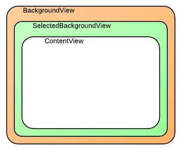](uicollectionview-images/01-uicollectionviewcell.png#lightbox)

The `UICollectionViewCell` class has the following properties for
each of these views:

- `ContentView` – This view contains the content that the cell presents. It is rendered in the topmost z-order on the screen.
- `SelectedBackgroundView` – Cells have built in support for selection. This view is used to visually denote that a cell is selected. It is rendered just below the  `ContentView` when a cell is selected.
- `BackgroundView` – Cells can also display a background, which is presented by the  `BackgroundView` . This view is rendered beneath the  `SelectedBackgroundView` .

By setting the `ContentView` such that it is smaller than the `BackgroundView` and `SelectedBackgroundView`, the `BackgroundView` can be used to visually frame the content, while the `SelectedBackgroundView` will be displayed when a cell is selected,
as shown below:

 [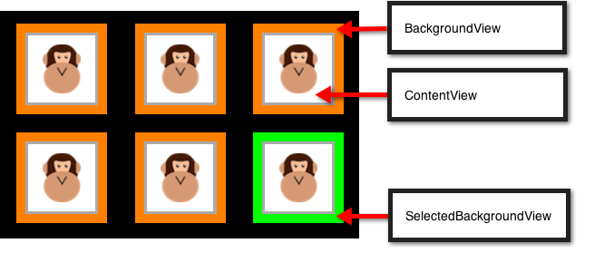](uicollectionview-images/02-cells.png#lightbox)

The Cells in the screenshot above are created by inheriting from `UICollectionViewCell` and setting the `ContentView`, `SelectedBackgroundView` and `BackgroundView` properties,
respectively, as shown in the following code:

```csharp
public class AnimalCell : UICollectionViewCell
{
        UIImageView imageView;

        [Export ("initWithFrame:")]
        public AnimalCell (CGRect frame) : base (frame)
        {
            BackgroundView = new UIView{BackgroundColor = UIColor.Orange};

            SelectedBackgroundView = new UIView{BackgroundColor = UIColor.Green};

            ContentView.Layer.BorderColor = UIColor.LightGray.CGColor;
            ContentView.Layer.BorderWidth = 2.0f;
            ContentView.BackgroundColor = UIColor.White;
            ContentView.Transform = CGAffineTransform.MakeScale (0.8f, 0.8f);

            imageView = new UIImageView (UIImage.FromBundle ("placeholder.png"));
            imageView.Center = ContentView.Center;
            imageView.Transform = CGAffineTransform.MakeScale (0.7f, 0.7f);

            ContentView.AddSubview (imageView);
        }

        public UIImage Image {
            set {
                imageView.Image = value;
            }
        }
}
```

 <a name="Supplementary_Views"></a>

## Supplementary Views

Supplementary Views are views that present information associated with each
section of a `UICollectionView`. Like Cells, Supplementary Views are
data-driven. Where Cells present the item data from a data source, Supplementary
Views present the section data, such as the categories of book in a bookshelf or
the genre of music in a music library.

For example, a Supplementary View could be used to present a header for a
particular section, as shown in the figure below:

 [](uicollectionview-images/02a-supplementary-view.png#lightbox)

To use a Supplementary View, it first needs to be registered in the `ViewDidLoad` method:

```csharp
CollectionView.RegisterClassForSupplementaryView (typeof(Header), UICollectionElementKindSection.Header, headerId);
```

Then, the view needs to be returned by using `GetViewForSupplementaryElement`, created by using `DequeueReusableSupplementaryView`, and inherits from `UICollectionReusableView`. The following code snippet will produce the SupplementaryView shown in the screenshot above:

```csharp
public override UICollectionReusableView GetViewForSupplementaryElement (UICollectionView collectionView, NSString elementKind, NSIndexPath indexPath)
        {
            var headerView = (Header)collectionView.DequeueReusableSupplementaryView (elementKind, headerId, indexPath);
            headerView.Text = "Supplementary View";
            return headerView;
        }

```

Supplementary Views are more generic than just headers and footers.
They can be positioned anywhere in the collection view and can be comprised of
any views, making their appearance fully customizable.

 <a name="Decoration_Views"></a>

## Decoration Views

Decoration Views are purely visual views that can be displayed in a `UICollectionView`. Unlike Cells and Supplementary Views, they are
not data-driven. They are always created within a layout's subclass and subsequently can change as the content’s layout. For example, a Decoration View could be used to present a
background view that scrolls with the content in the `UICollectionView`, as shown below:

 [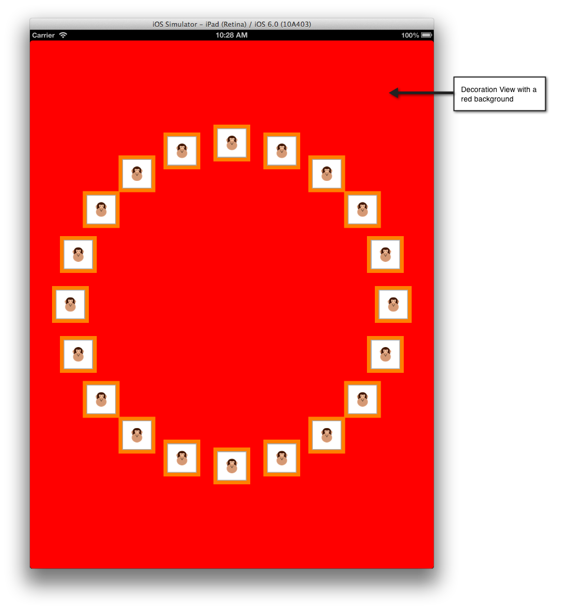](uicollectionview-images/02c-decoration-view.png#lightbox)

 The code snippet below changes the background to red in the samples `CircleLayout` class:

 ```csharp
 public class MyDecorationView : UICollectionReusableView
  {
    [Export ("initWithFrame:")]
    public MyDecorationView (CGRect frame) : base (frame)
    {
      BackgroundColor = UIColor.Red;
    }
  }
 ```

## Data Source

As with other parts of iOS, such as `UITableView` and `MKMapView`, `UICollectionView` gets its data from a *data source*, which is exposed in Xamarin.iOS via the **`UICollectionViewDataSource`** class. This class is responsible for providing content to the `UICollectionView` such as:

- **Cells** – Returned from  `GetCell` method.
- **Supplementary Views** – Returned from  `GetViewForSupplementaryElement` method.
- **Number of sections** – Returned from  `NumberOfSections` method. Defaults to 1 if not implemented.
- **Number of items per section** – Returned from  `GetItemsCount` method.

### UICollectionViewController
For convenience, the `UICollectionViewController` class is
available.This is automatically configured to be both the delegate, which is
discussed in the next section, and data source for its `UICollectionView` view.

As with `UITableView`, the `UICollectionView` class
will only call its data source to get Cells for items that are on the screen.
Cells that scroll off the screen are placed in to a queue for reuse, as the
following image illustrates:

 [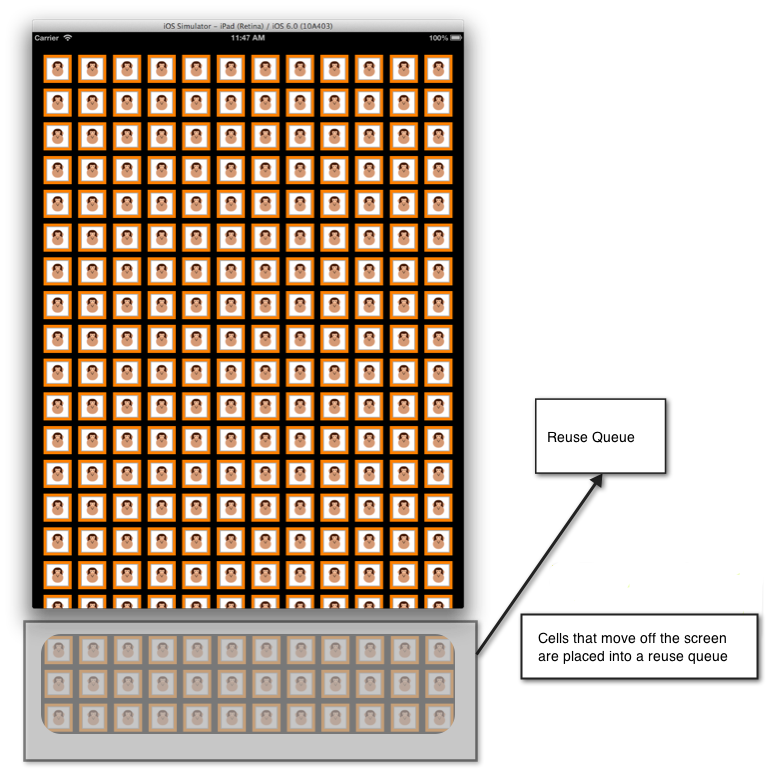](uicollectionview-images/03-cell-reuse.png#lightbox)

Cell reuse has been simplified with `UICollectionView` and `UITableView`. You no longer need to create a Cell directly in the data source if one isn’t available in the reuse queue, as Cells are registered with the system. If a Cell is not available when making the
call to de-queue the Cell from the reuse queue, iOS will create it automatically based upon the type or nib that was registered.
The same technique is also available for Supplementary Views.

For example, consider the following code which registers the `AnimalCell` class:

```csharp
static NSString animalCellId = new NSString ("AnimalCell");
CollectionView.RegisterClassForCell (typeof(AnimalCell), animalCellId);
```

When a `UICollectionView` needs a cell because its item is on the
screen, the `UICollectionView` calls its data source’s `GetCell` method. Similar to how this works with UITableView, this method is responsible for configuring a Cell from the backing data, which would be an `AnimalCell` class in this case.

The following code shows an implementation of `GetCell` that
returns an `AnimalCell` instance:

```csharp
public override UICollectionViewCell GetCell (UICollectionView collectionView, Foundation.NSIndexPath indexPath)
{
        var animalCell = (AnimalCell)collectionView.DequeueReusableCell (animalCellId, indexPath);

        var animal = animals [indexPath.Row];

        animalCell.Image = animal.Image;

        return animalCell;
}
```

The call to `DequeReusableCell` is where the cell will be either
de-queued from the reuse queue or, if a cell is not available in the queue,
created based upon the type registered in the call to `CollectionView.RegisterClassForCell`.

In this case, by registering the `AnimalCell` class, iOS will
create a new `AnimalCell` internally and return it when a call to
de-queue a cell is made, after which it is configured with the image contained
in the animal class and returned for display to the `UICollectionView`.

 <a name="Delegate"></a>

### Delegate

The `UICollectionView` class uses a delegate of type `UICollectionViewDelegate` to support interaction with content in the `UICollectionView`. This allows control of:

- **Cell Selection** – Determines if a cell is selected.
- **Cell Highlighting** – Determines if a cell is currently being touched.
- **Cell Menus** – Menu displayed for a cell in response to a long press gesture.

As with the data source, the `UICollectionViewController` is
configured by default to be the delegate for the `UICollectionView`.

 <a name="Cell_HighLighting"></a>

#### Cell HighLighting

When a Cell is pressed, the cell transitions into a highlighted state,
and it is not selected until the user lifts their finger from the
Cell. This allows a temporary change in the appearance of the cell before it is
actually selected. Upon selection, the Cell’s `SelectedBackgroundView` is displayed. The figure below shows the highlighted state just before the selection occurs:

 [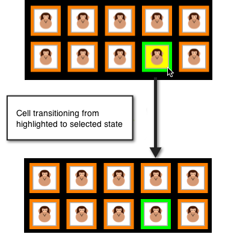](uicollectionview-images/04-cell-highlight.png#lightbox)

To implement highlighting, the `ItemHighlighted` and `ItemUnhighlighted` methods of the `UICollectionViewDelegate` can be used. For example, the following code
will apply a yellow background of the `ContentView` when the Cell is highlighted, and a white background when un-highlighted, as shown in the image above:

```csharp
public override void ItemHighlighted (UICollectionView collectionView, NSIndexPath indexPath)
{
        var cell = collectionView.CellForItem(indexPath);
        cell.ContentView.BackgroundColor = UIColor.Yellow;
}

public override void ItemUnhighlighted (UICollectionView collectionView, NSIndexPath indexPath)
{
        var cell = collectionView.CellForItem(indexPath);
        cell.ContentView.BackgroundColor = UIColor.White;
}
```

 <a name="Disabling_Selection"></a>

#### Disabling Selection

Selection is enabled by default in `UICollectionView`. To disable
selection, override `ShouldHighlightItem` and return false as shown
below:

```csharp
public override bool ShouldHighlightItem (UICollectionView collectionView, NSIndexPath indexPath)
{
        return false;
}
```

When highlighting is disabled, the process of selecting a cell is disabled as
well. Additionally, there is also a `ShouldSelectItem` method that
controls selection directly, although if `ShouldHighlightItem` is
implemented and returns false, `ShouldSelectItem` is not called.

 `ShouldSelectItem` allows selection to be turned on or off on an
item-by-item basis, when `ShouldHighlightItem` is not implemented. It
also allows highlighting without selection, if `ShouldHighlightItem`
is implemented and returns true, while `ShouldSelectItem` returns
false.

 <a name="Cell_Menus"></a>

#### Cell Menus

Each Cell in a `UICollectionView` is capable of showing a menu
that allows cut, copy, and paste to optionally be supported. To create an edit
menu on a cell:

1. Override  `ShouldShowMenu` and return true if the item should show a menu.
1. Override  `CanPerformAction` and return true for every action that the item can perform, which will be any of cut, copy or paste.
1. Override  `PerformAction` to perform the edit, copy of paste operation.

The following screenshot show the menu when a cell is long pressed:

 [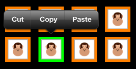](uicollectionview-images/04a-menu.png#lightbox)

 <a name="Layout"></a>

## Layout

`UICollectionView` supports a layout system that allows the
positioning of all its elements, Cells, Supplementary Views and Decoration
Views, to be managed independent of the `UICollectionView` itself.
Using the layout system, an application can support layouts such as the
grid-like one we’ve seen in this article, as well as provide custom
layouts.

 <a name="Layout_Basics"></a>

### Layout Basics

Layouts in a `UICollectionView` are defined in a class that
inherits from `UICollectionViewLayout`. The layout implementation is
responsible for creating the layout attributes for every item in the `UICollectionView`. There are two ways to create a layout:

- Use the built-in  `UICollectionViewFlowLayout` .
- Provide a custom layout by inheriting from  `UICollectionViewLayout` .

 <a name="Flow_Layout"></a>

### Flow Layout

The `UICollectionViewFlowLayout` class provides a line-based
layout that suitable for arranging content in a grid of Cells as we’ve
seen.

To use a flow layout:

- Create an instance of  `UICollectionViewFlowLayout` :

```csharp
var layout = new UICollectionViewFlowLayout ();
```

- Pass the instance to the constructor of the  `UICollectionView` :

```csharp
simpleCollectionViewController = new SimpleCollectionViewController (layout);
```

This is all that is needed to layout content in a grid. Also, when the
orientation changes, the `UICollectionViewFlowLayout` handles
rearranging the content appropriately, as shown below:

 [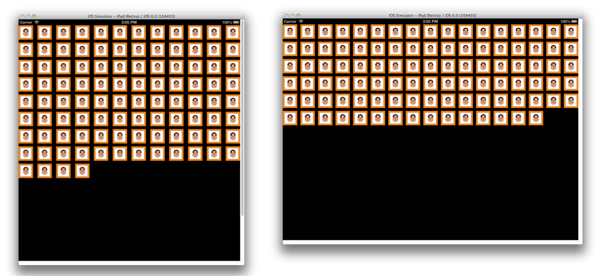](uicollectionview-images/05-layout-orientation.png#lightbox)

 <a name="Section_Inset"></a>

#### Section Inset

To provide some space around the `UIContentView`, layouts
have a `SectionInset` property of type `UIEdgeInsets`. For
example, the following code provides a 50-pixel buffer around each section of
the `UIContentView` when laid out by a `UICollectionViewFlowLayout`:

```csharp
var layout = new UICollectionViewFlowLayout ();
layout.SectionInset = new UIEdgeInsets (50,50,50,50);
```

This results in spacing around the section as shown below:

 [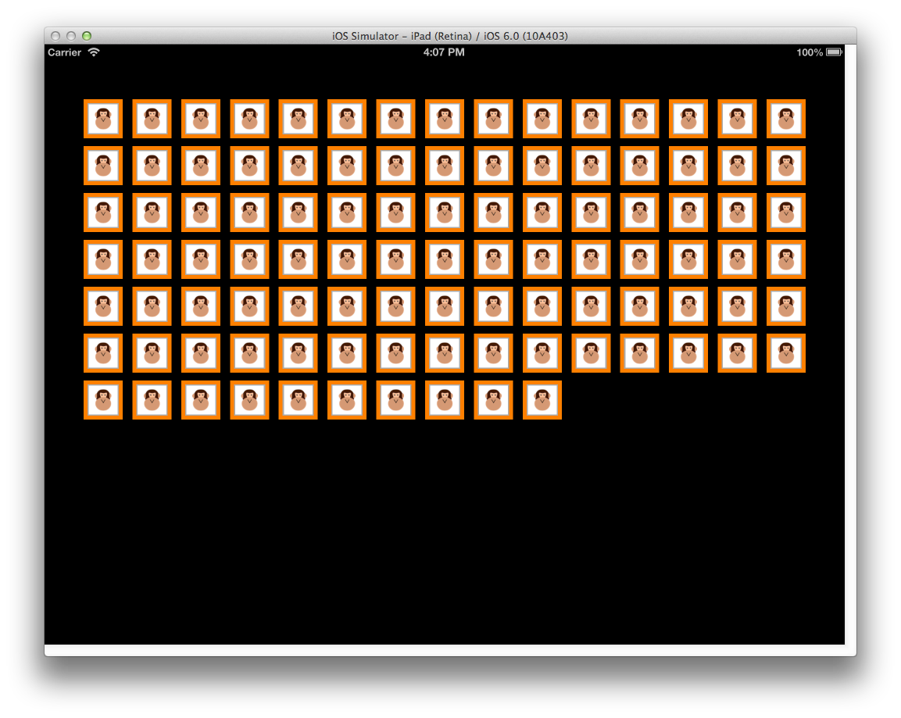](uicollectionview-images/06-sectioninset.png#lightbox)

 <a name="Subclassing_UICollectionViewFlowLayout"></a>

#### Subclassing UICollectionViewFlowLayout

In edition to using `UICollectionViewFlowLayout` directly, it can
also be subclassed to further customize the layout of content along a line. For
example, this can be used to create a layout that does not wrap the Cells into a
grid, but instead creates a single row with a horizontal scrolling effect, as
shown below:

 [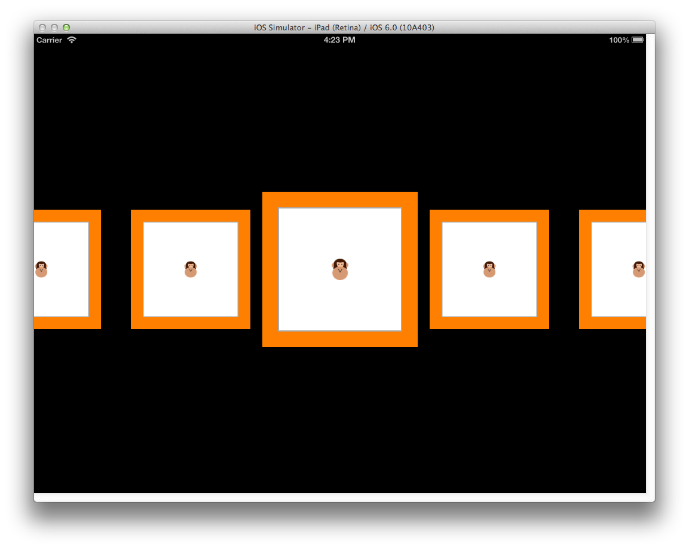](uicollectionview-images/07-line-layout.png#lightbox)

To implement this by subclassing `UICollectionViewFlowLayout`
requires:

- Initializing any layout properties that apply to the layout itself or all items in the layout in the constructor.
- Overriding  `ShouldInvalidateLayoutForBoundsChange` , returning true so that when bounds of the  `UICollectionView` changes, the layout of the cells will be recalculated. This is used in this case ensure the code for transformation applied to the centermost cell will be applied during scrolling.
- Overriding  `TargetContentOffset` to make the centermost cell snap to the center of the  `UICollectionView` as scrolling stops.
- Overriding  `LayoutAttributesForElementsInRect` to return an array of  `UICollectionViewLayoutAttributes` . Each  `UICollectionViewLayoutAttribute` contains information on how to layout the particular item, including properties such as its  `Center` ,  `Size` ,  `ZIndex` and  `Transform3D` .

The following code shows such an implementation:

```csharp
using System;
using CoreGraphics;
using Foundation;
using UIKit;
using CoreGraphics;
using CoreAnimation;

namespace SimpleCollectionView
{
  public class LineLayout : UICollectionViewFlowLayout
  {
    public const float ITEM_SIZE = 200.0f;
    public const int ACTIVE_DISTANCE = 200;
    public const float ZOOM_FACTOR = 0.3f;

    public LineLayout ()
    {
      ItemSize = new CGSize (ITEM_SIZE, ITEM_SIZE);
      ScrollDirection = UICollectionViewScrollDirection.Horizontal;
            SectionInset = new UIEdgeInsets (400,0,400,0);
      MinimumLineSpacing = 50.0f;
    }

    public override bool ShouldInvalidateLayoutForBoundsChange (CGRect newBounds)
    {
      return true;
    }

    public override UICollectionViewLayoutAttributes[] LayoutAttributesForElementsInRect (CGRect rect)
    {
      var array = base.LayoutAttributesForElementsInRect (rect);
            var visibleRect = new CGRect (CollectionView.ContentOffset, CollectionView.Bounds.Size);

      foreach (var attributes in array) {
        if (attributes.Frame.IntersectsWith (rect)) {
          float distance = (float)(visibleRect.GetMidX () - attributes.Center.X);
          float normalizedDistance = distance / ACTIVE_DISTANCE;
          if (Math.Abs (distance) < ACTIVE_DISTANCE) {
            float zoom = 1 + ZOOM_FACTOR * (1 - Math.Abs (normalizedDistance));
            attributes.Transform3D = CATransform3D.MakeScale (zoom, zoom, 1.0f);
            attributes.ZIndex = 1;
          }
        }
      }
      return array;
    }

    public override CGPoint TargetContentOffset (CGPoint proposedContentOffset, CGPoint scrollingVelocity)
    {
      float offSetAdjustment = float.MaxValue;
      float horizontalCenter = (float)(proposedContentOffset.X + (this.CollectionView.Bounds.Size.Width / 2.0));
      CGRect targetRect = new CGRect (proposedContentOffset.X, 0.0f, this.CollectionView.Bounds.Size.Width, this.CollectionView.Bounds.Size.Height);
      var array = base.LayoutAttributesForElementsInRect (targetRect);
      foreach (var layoutAttributes in array) {
        float itemHorizontalCenter = (float)layoutAttributes.Center.X;
        if (Math.Abs (itemHorizontalCenter - horizontalCenter) < Math.Abs (offSetAdjustment)) {
          offSetAdjustment = itemHorizontalCenter - horizontalCenter;
        }
      }
            return new CGPoint (proposedContentOffset.X + offSetAdjustment, proposedContentOffset.Y);
    }

  }
}
```

 <a name="Custom_Layout"></a>

### Custom Layout

In addition to using `UICollectionViewFlowLayout`, layouts can
also be fully customized by inheriting directly from `UICollectionViewLayout`.

The key methods to override are:

- `PrepareLayout` – Used for performing initial geometric calculations that will be used throughout the layout process.
- `CollectionViewContentSize` – Returns the size of the area used to display content.
- `LayoutAttributesForElementsInRect` – As with the UICollectionViewFlowLayout example shown earlier, this method is used to provide information to the  `UICollectionView` regarding how to layout each item. However, unlike the  `UICollectionViewFlowLayout` , when creating a custom layout, you can position items however you choose.

For example, the same content could be presented in a circular layout as
shown below:

 [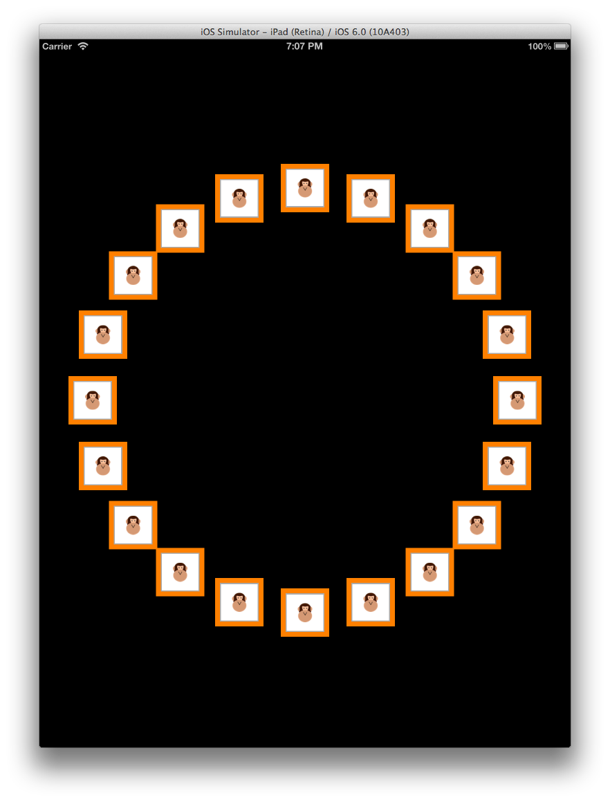](uicollectionview-images/08-circle-layout.png#lightbox)

The powerful thing about layouts is that to change from the grid-like
layout, to a horizontal scrolling layout, and subsequently to this circular
layout requires only the layout class provided to the `UICollectionView` be changed. Nothing in the `UICollectionView`, its delegate or data source code changes at
all.

## Changes in iOS 9

In iOS 9, the collection view (`UICollectionView`) now supports drag reordering
of items out of the box by adding a new default gesture recognizer and several new supporting methods.

Using these new methods, you can easily implement drag to reorder in your collection view
and have the option of customizing the items appearance during any stage of the reordering process.

[](uicollectionview-images/intro01.png#lightbox)

In this article, we'll take a look at implementing drag-to-reorder in a Xamarin.iOS
application as well as some of the other changes iOS 9 has made to the collection view control:

- [Easy Reordering of Items](#Easy-Reordering-of-Items)
  - [Simple Reordering Example](#Simple-Reordering-Example)
  - [Using a Custom Gesture Recognizer](#Using-a-Custom-Gesture-Recognizer)
  - [Custom Layouts and Reordering](#Custom-Layouts-and-Reording)
- [Collection View Changes](#collection-view-changes)

<a name="Easy-Reordering-of-Items"></a>

## Reordering of Items

As stated above, one of the most significant changes to the collection view in iOS 9 was the addition of easy drag-to-reorder functionality out of the box.

In iOS 9, the quickest way to add reordering to a collection view is to use a `UICollectionViewController`.
The collection view controller now has a `InstallsStandardGestureForInteractiveMovement` property, which adds a standard *gesture recognizer* that supports dragging to reorder items in the collection.
Since the default value is `true`, you only have to implement the `MoveItem` method of the `UICollectionViewDataSource` class to support drag-to-reorder. For example:

```csharp
public override void MoveItem (UICollectionView collectionView, NSIndexPath sourceIndexPath, NSIndexPath destinationIndexPath)
{
  // Reorder our list of items
  ...
}
```

<a name="Simple-Reordering-Example"></a>

### Simple Reordering Example

As a quick example, start a new Xamarin.iOS project and edit the **Main.storyboard** file. Drag a `UICollectionViewController` onto the design surface:

[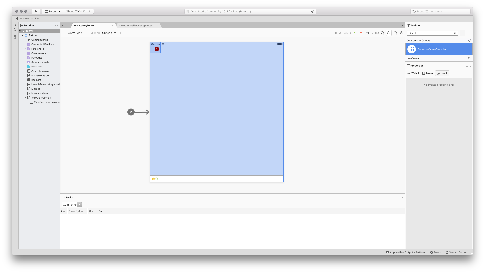](uicollectionview-images/quick01.png#lightbox)

Select the Collection View (It may be easiest to do this from the document outline). In the layout tab of the Properties Pad, set the following sizes, as illustrated in the screenshot below:

- **Cell Size**: Width – 60 | Height – 60
- **Header Size**: Width – 0 | Height – 0
- **Footer Size**: Width – 0 | Height – 0
- **Min Spacing**: For Cells – 8 | For Lines – 8
- **Section Insets**: Top – 16 | Bottom – 16 | Left – 16 | Right – 16

[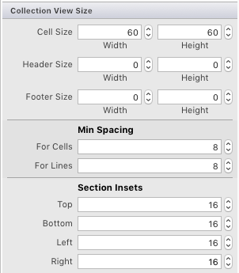](uicollectionview-images/quick04.png#lightbox)

Next, edit the default Cell:

- Change its background color to blue
- Add a label to act as the title for the cell
- Set the reuse identifier to **cell**

[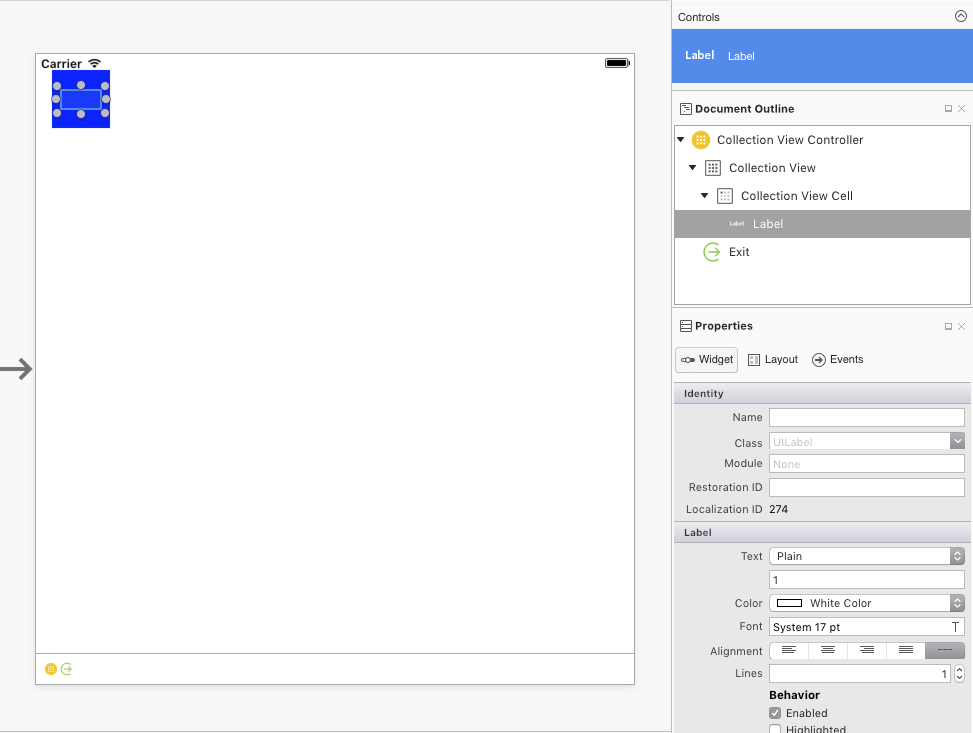](uicollectionview-images/quick02.png#lightbox)

Add constraints to keep the Label centered inside the cell as it changes size:

In the **Property Pad** for the _CollectionViewCell_ and set the **Class** to `TextCollectionViewCell`:

[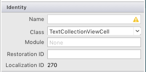](uicollectionview-images/quick05.png#lightbox)

Set the **Collection Reusable View** to `Cell`:

[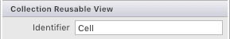](uicollectionview-images/quick06.png#lightbox)

Finally, select the Label and name it `TextLabel`:

[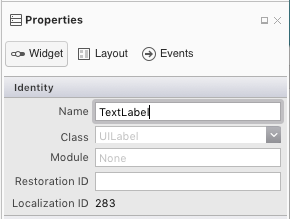](uicollectionview-images/quick07.png#lightbox)

Edit the `TextCollectionViewCell` class and add the following properties.:

```csharp
using System;
using Foundation;
using UIKit;

namespace CollectionView
{
  public partial class TextCollectionViewCell : UICollectionViewCell
  {
    #region Computed Properties
    public string Title {
      get { return TextLabel.Text; }
      set { TextLabel.Text = value; }
    }
    #endregion

    #region Constructors
    public TextCollectionViewCell (IntPtr handle) : base (handle)
    {
    }
    #endregion
  }
}
```

Here the `Text` property of the label is exposed as the title of the cell, so it can be set from code.

Add a new C# class to the project and call it `WaterfallCollectionSource`. Edit the file and make it look like the following:

```csharp
using System;
using Foundation;
using UIKit;
using System.Collections.Generic;

namespace CollectionView
{
  public class WaterfallCollectionSource : UICollectionViewDataSource
  {
    #region Computed Properties
    public WaterfallCollectionView CollectionView { get; set;}
    public List<int> Numbers { get; set; } = new List<int> ();
    #endregion

    #region Constructors
    public WaterfallCollectionSource (WaterfallCollectionView collectionView)
    {
      // Initialize
      CollectionView = collectionView;

      // Init numbers collection
      for (int n = 0; n < 100; ++n) {
        Numbers.Add (n);
      }
    }
    #endregion

    #region Override Methods
    public override nint NumberOfSections (UICollectionView collectionView) {
      // We only have one section
      return 1;
    }

    public override nint GetItemsCount (UICollectionView collectionView, nint section) {
      // Return the number of items
      return Numbers.Count;
    }

    public override UICollectionViewCell GetCell (UICollectionView collectionView, NSIndexPath indexPath)
    {
      // Get a reusable cell and set {~~it's~>its~~} title from the item
      var cell = collectionView.DequeueReusableCell ("Cell", indexPath) as TextCollectionViewCell;
      cell.Title = Numbers [(int)indexPath.Item].ToString();

      return cell;
    }

    public override bool CanMoveItem (UICollectionView collectionView, NSIndexPath indexPath) {
      // We can always move items
      return true;
    }

    public override void MoveItem (UICollectionView collectionView, NSIndexPath sourceIndexPath, NSIndexPath destinationIndexPath)
    {
      // Reorder our list of items
      var item = Numbers [(int)sourceIndexPath.Item];
      Numbers.RemoveAt ((int)sourceIndexPath.Item);
      Numbers.Insert ((int)destinationIndexPath.Item, item);
    }
    #endregion
  }
}
```

This class will be the data source for our collection view and provide the information for each cell in the collection.
Notice that the `MoveItem` method is implemented to allow items in the collection to be drag reordered.

Add another new C# class to the project and call it `WaterfallCollectionDelegate`. Edit this file and make it look like the following:

```csharp
using System;
using Foundation;
using UIKit;
using System.Collections.Generic;

namespace CollectionView
{
  public class WaterfallCollectionDelegate : UICollectionViewDelegate
  {
    #region Computed Properties
    public WaterfallCollectionView CollectionView { get; set;}
    #endregion

    #region Constructors
    public WaterfallCollectionDelegate (WaterfallCollectionView collectionView)
    {

      // Initialize
      CollectionView = collectionView;

    }
    #endregion

    #region Overrides Methods
    public override bool ShouldHighlightItem (UICollectionView collectionView, NSIndexPath indexPath) {
      // Always allow for highlighting
      return true;
    }

    public override void ItemHighlighted (UICollectionView collectionView, NSIndexPath indexPath)
    {
      // Get cell and change to green background
      var cell = collectionView.CellForItem(indexPath);
      cell.ContentView.BackgroundColor = UIColor.FromRGB(183,208,57);
    }

    public override void ItemUnhighlighted (UICollectionView collectionView, NSIndexPath indexPath)
    {
      // Get cell and return to blue background
      var cell = collectionView.CellForItem(indexPath);
      cell.ContentView.BackgroundColor = UIColor.FromRGB(164,205,255);
    }
    #endregion
  }
}
```

This will act as the delegate for our collection view. Methods have been overridden
to highlight a cell as the user interacts with it in the collection view.

Add one last C# class to the project and call it `WaterfallCollectionView`. Edit this file and make it look like the following:

```csharp
using System;
using UIKit;
using System.Collections.Generic;
using Foundation;

namespace CollectionView
{
  [Register("WaterfallCollectionView")]
  public class WaterfallCollectionView : UICollectionView
  {

    #region Constructors
    public WaterfallCollectionView (IntPtr handle) : base (handle)
    {
    }
    #endregion

    #region Override Methods
    public override void AwakeFromNib ()
    {
      base.AwakeFromNib ();

      // Initialize
      DataSource = new WaterfallCollectionSource(this);
      Delegate = new WaterfallCollectionDelegate(this);

    }
    #endregion
  }
}
```

Notice that `DataSource` and `Delegate` that we created above are set
when the collection view is constructed from its storyboard (or **.xib** file).

Edit the **Main.storyboard** file again and select the collection view and switch
to the **Properties**. Set the **Class** to the custom `WaterfallCollectionView` class that we defined above:

Save the changes you made to the UI and run the app.
If the user selects an item from the list and drags it to a new location, the
other items will animate automatically as they move out of the way of the item.
When the user drops the item in a new location, it will stick to that location. For example:

[](uicollectionview-images/intro01.png#lightbox)

<a name="Using-a-Custom-Gesture-Recognizer"></a>

### Using a Custom Gesture Recognizer

In cases where you cannot use a `UICollectionViewController` and must use a regular `UIViewController`, or if you wish to take more control over the drag-and-drop gesture, you can create your own custom Gesture Recognizer and add it to the Collection View when the View loads. For example:

```csharp
public override void ViewDidLoad ()
{
  base.ViewDidLoad ();

  // Create a custom gesture recognizer
  var longPressGesture = new UILongPressGestureRecognizer ((gesture) => {

    // Take action based on state
    switch(gesture.State) {
    case UIGestureRecognizerState.Began:
      var selectedIndexPath = CollectionView.IndexPathForItemAtPoint(gesture.LocationInView(View));
      if (selectedIndexPath !=null) {
        CollectionView.BeginInteractiveMovementForItem(selectedIndexPath);
      }
      break;
    case UIGestureRecognizerState.Changed:
      CollectionView.UpdateInteractiveMovementTargetPosition(gesture.LocationInView(View));
      break;
    case UIGestureRecognizerState.Ended:
      CollectionView.EndInteractiveMovement();
      break;
    default:
      CollectionView.CancelInteractiveMovement();
      break;
    }

  });

  // Add the custom recognizer to the collection view
  CollectionView.AddGestureRecognizer(longPressGesture);
}
```

Here we are using several new methods added to the collection view to implement and control the drag operation:

- `BeginInteractiveMovementForItem` - Marks the start of a move operation.
- `UpdateInteractiveMovementTargetPosition` - Is sent as the item's location is updated.
- `EndInteractiveMovement` - Marks the end of an item move.
- `CancelInteractiveMovement` - Marks the user canceling the move operation.

When the application is run, the drag operation will work exactly like the default
drag gesture recognizer that comes with the collection view.

<a name="Custom-Layouts-and-Reording"></a>

### Custom Layouts and Reordering

In iOS 9, several new methods have been added to work with drag-to-reorder and
custom layouts in a collection view. To explore this feature, let's add a custom layout to the collection.

First, add a new C# class called `WaterfallCollectionLayout` to the project. Edit it and make it look like the following:

```csharp
using System;
using Foundation;
using UIKit;
using System.Collections.Generic;
using CoreGraphics;

namespace CollectionView
{
  [Register("WaterfallCollectionLayout")]
  public class WaterfallCollectionLayout : UICollectionViewLayout
  {
    #region Private Variables
    private int columnCount = 2;
    private nfloat minimumColumnSpacing = 10;
    private nfloat minimumInterItemSpacing = 10;
    private nfloat headerHeight = 0.0f;
    private nfloat footerHeight = 0.0f;
    private UIEdgeInsets sectionInset = new UIEdgeInsets(0, 0, 0, 0);
    private WaterfallCollectionRenderDirection itemRenderDirection = WaterfallCollectionRenderDirection.ShortestFirst;
    private Dictionary<nint,UICollectionViewLayoutAttributes> headersAttributes = new Dictionary<nint, UICollectionViewLayoutAttributes>();
    private Dictionary<nint,UICollectionViewLayoutAttributes> footersAttributes = new Dictionary<nint, UICollectionViewLayoutAttributes>();
    private List<CGRect> unionRects = new List<CGRect>();
    private List<nfloat> columnHeights = new List<nfloat>();
    private List<UICollectionViewLayoutAttributes> allItemAttributes = new List<UICollectionViewLayoutAttributes>();
    private List<List<UICollectionViewLayoutAttributes>> sectionItemAttributes = new List<List<UICollectionViewLayoutAttributes>>();
    private nfloat unionSize = 20;
    #endregion

    #region Computed Properties
    [Export("ColumnCount")]
    public int ColumnCount {
      get { return columnCount; }
      set {
        WillChangeValue ("ColumnCount");
        columnCount = value;
        DidChangeValue ("ColumnCount");

        InvalidateLayout ();
      }
    }

    [Export("MinimumColumnSpacing")]
    public nfloat MinimumColumnSpacing {
      get { return minimumColumnSpacing; }
      set {
        WillChangeValue ("MinimumColumnSpacing");
        minimumColumnSpacing = value;
        DidChangeValue ("MinimumColumnSpacing");

        InvalidateLayout ();
      }
    }

    [Export("MinimumInterItemSpacing")]
    public nfloat MinimumInterItemSpacing {
      get { return minimumInterItemSpacing; }
      set {
        WillChangeValue ("MinimumInterItemSpacing");
        minimumInterItemSpacing = value;
        DidChangeValue ("MinimumInterItemSpacing");

        InvalidateLayout ();
      }
    }

    [Export("HeaderHeight")]
    public nfloat HeaderHeight {
      get { return headerHeight; }
      set {
        WillChangeValue ("HeaderHeight");
        headerHeight = value;
        DidChangeValue ("HeaderHeight");

        InvalidateLayout ();
      }
    }

    [Export("FooterHeight")]
    public nfloat FooterHeight {
      get { return footerHeight; }
      set {
        WillChangeValue ("FooterHeight");
        footerHeight = value;
        DidChangeValue ("FooterHeight");

        InvalidateLayout ();
      }
    }

    [Export("SectionInset")]
    public UIEdgeInsets SectionInset {
      get { return sectionInset; }
      set {
        WillChangeValue ("SectionInset");
        sectionInset = value;
        DidChangeValue ("SectionInset");

        InvalidateLayout ();
      }
    }

    [Export("ItemRenderDirection")]
    public WaterfallCollectionRenderDirection ItemRenderDirection {
      get { return itemRenderDirection; }
      set {
        WillChangeValue ("ItemRenderDirection");
        itemRenderDirection = value;
        DidChangeValue ("ItemRenderDirection");

        InvalidateLayout ();
      }
    }
    #endregion

    #region Constructors
    public WaterfallCollectionLayout ()
    {
    }

    public WaterfallCollectionLayout(NSCoder coder) : base(coder) {

    }
    #endregion

    #region Public Methods
    public nfloat ItemWidthInSectionAtIndex(int section) {

      var width = CollectionView.Bounds.Width - SectionInset.Left - SectionInset.Right;
      return (nfloat)Math.Floor ((width - ((ColumnCount - 1) * MinimumColumnSpacing)) / ColumnCount);
    }
    #endregion

    #region Override Methods
    public override void PrepareLayout ()
    {
      base.PrepareLayout ();

      // Get the number of sections
      var numberofSections = CollectionView.NumberOfSections();
      if (numberofSections == 0)
        return;

      // Reset collections
      headersAttributes.Clear ();
      footersAttributes.Clear ();
      unionRects.Clear ();
      columnHeights.Clear ();
      allItemAttributes.Clear ();
      sectionItemAttributes.Clear ();

      // Initialize column heights
      for (int n = 0; n < ColumnCount; n++) {
        columnHeights.Add ((nfloat)0);
      }

      // Process all sections
      nfloat top = 0.0f;
      var attributes = new UICollectionViewLayoutAttributes ();
      var columnIndex = 0;
      for (nint section = 0; section < numberofSections; ++section) {
        // Calculate section specific metrics
        var minimumInterItemSpacing = (MinimumInterItemSpacingForSection == null) ? MinimumColumnSpacing :
          MinimumInterItemSpacingForSection (CollectionView, this, section);

        // Calculate widths
        var width = CollectionView.Bounds.Width - SectionInset.Left - SectionInset.Right;
        var itemWidth = (nfloat)Math.Floor ((width - ((ColumnCount - 1) * MinimumColumnSpacing)) / ColumnCount);

        // Calculate section header
        var heightHeader = (HeightForHeader == null) ? HeaderHeight :
          HeightForHeader (CollectionView, this, section);

        if (heightHeader > 0) {
          attributes = UICollectionViewLayoutAttributes.CreateForSupplementaryView (UICollectionElementKindSection.Header, NSIndexPath.FromRowSection (0, section));
          attributes.Frame = new CGRect (0, top, CollectionView.Bounds.Width, heightHeader);
          headersAttributes.Add (section, attributes);
          allItemAttributes.Add (attributes);

          top = attributes.Frame.GetMaxY ();
        }

        top += SectionInset.Top;
        for (int n = 0; n < ColumnCount; n++) {
          columnHeights [n] = top;
        }

        // Calculate Section Items
        var itemCount = CollectionView.NumberOfItemsInSection(section);
        List<UICollectionViewLayoutAttributes> itemAttributes = new List<UICollectionViewLayoutAttributes> ();

        for (nint n = 0; n < itemCount; n++) {
          var indexPath = NSIndexPath.FromRowSection (n, section);
          columnIndex = NextColumnIndexForItem (n);
          var xOffset = SectionInset.Left + (itemWidth + MinimumColumnSpacing) * (nfloat)columnIndex;
          var yOffset = columnHeights [columnIndex];
          var itemSize = (SizeForItem == null) ? new CGSize (0, 0) : SizeForItem (CollectionView, this, indexPath);
          nfloat itemHeight = 0.0f;

          if (itemSize.Height > 0.0f && itemSize.Width > 0.0f) {
            itemHeight = (nfloat)Math.Floor (itemSize.Height * itemWidth / itemSize.Width);
          }

          attributes = UICollectionViewLayoutAttributes.CreateForCell (indexPath);
          attributes.Frame = new CGRect (xOffset, yOffset, itemWidth, itemHeight);
          itemAttributes.Add (attributes);
          allItemAttributes.Add (attributes);
          columnHeights [columnIndex] = attributes.Frame.GetMaxY () + MinimumInterItemSpacing;
        }
        sectionItemAttributes.Add (itemAttributes);

        // Calculate Section Footer
        nfloat footerHeight = 0.0f;
        columnIndex = LongestColumnIndex();
        top = columnHeights [columnIndex] - MinimumInterItemSpacing + SectionInset.Bottom;
        footerHeight = (HeightForFooter == null) ? FooterHeight : HeightForFooter(CollectionView, this, section);

        if (footerHeight > 0) {
          attributes = UICollectionViewLayoutAttributes.CreateForSupplementaryView (UICollectionElementKindSection.Footer, NSIndexPath.FromRowSection (0, section));
          attributes.Frame = new CGRect (0, top, CollectionView.Bounds.Width, footerHeight);
          footersAttributes.Add (section, attributes);
          allItemAttributes.Add (attributes);
          top = attributes.Frame.GetMaxY ();
        }

        for (int n = 0; n < ColumnCount; n++) {
          columnHeights [n] = top;
        }
      }

      var i =0;
      var attrs = allItemAttributes.Count;
      while(i < attrs) {
        var rect1 = allItemAttributes [i].Frame;
        i = (int)Math.Min (i + unionSize, attrs) - 1;
        var rect2 = allItemAttributes [i].Frame;
        unionRects.Add (CGRect.Union (rect1, rect2));
        i++;
      }

    }

    public override CGSize CollectionViewContentSize {
      get {
        if (CollectionView.NumberOfSections () == 0) {
          return new CGSize (0, 0);
        }

        var contentSize = CollectionView.Bounds.Size;
        contentSize.Height = columnHeights [0];
        return contentSize;
      }
    }

    public override UICollectionViewLayoutAttributes LayoutAttributesForItem (NSIndexPath indexPath)
    {
      if (indexPath.Section >= sectionItemAttributes.Count) {
        return null;
      }

      if (indexPath.Item >= sectionItemAttributes [indexPath.Section].Count) {
        return null;
      }

      var list = sectionItemAttributes [indexPath.Section];
      return list [(int)indexPath.Item];
    }

    public override UICollectionViewLayoutAttributes LayoutAttributesForSupplementaryView (NSString kind, NSIndexPath indexPath)
    {
      var attributes = new UICollectionViewLayoutAttributes ();

      switch (kind) {
      case "header":
        attributes = headersAttributes [indexPath.Section];
        break;
      case "footer":
        attributes = footersAttributes [indexPath.Section];
        break;
      }

      return attributes;
    }

    public override UICollectionViewLayoutAttributes[] LayoutAttributesForElementsInRect (CGRect rect)
    {
      var begin = 0;
      var end = unionRects.Count;
      List<UICollectionViewLayoutAttributes> attrs = new List<UICollectionViewLayoutAttributes> ();

      for (int i = 0; i < end; i++) {
        if (rect.IntersectsWith(unionRects[i])) {
          begin = i * (int)unionSize;
        }
      }

      for (int i = end - 1; i >= 0; i--) {
        if (rect.IntersectsWith (unionRects [i])) {
          end = (int)Math.Min ((i + 1) * (int)unionSize, allItemAttributes.Count);
          break;
        }
      }

      for (int i = begin; i < end; i++) {
        var attr = allItemAttributes [i];
        if (rect.IntersectsWith (attr.Frame)) {
          attrs.Add (attr);
        }
      }

      return attrs.ToArray();
    }

    public override bool ShouldInvalidateLayoutForBoundsChange (CGRect newBounds)
    {
      var oldBounds = CollectionView.Bounds;
      return (newBounds.Width != oldBounds.Width);
    }
    #endregion

    #region Private Methods
    private int ShortestColumnIndex() {
      var index = 0;
      var shortestHeight = nfloat.MaxValue;
      var n = 0;

      // Scan each column for the shortest height
      foreach (nfloat height in columnHeights) {
        if (height < shortestHeight) {
          shortestHeight = height;
          index = n;
        }
        ++n;
      }

      return index;
    }

    private int LongestColumnIndex() {
      var index = 0;
      var longestHeight = nfloat.MinValue;
      var n = 0;

      // Scan each column for the shortest height
      foreach (nfloat height in columnHeights) {
        if (height > longestHeight) {
          longestHeight = height;
          index = n;
        }
        ++n;
      }

      return index;
    }

    private int NextColumnIndexForItem(nint item) {
      var index = 0;

      switch (ItemRenderDirection) {
      case WaterfallCollectionRenderDirection.ShortestFirst:
        index = ShortestColumnIndex ();
        break;
      case WaterfallCollectionRenderDirection.LeftToRight:
        index = ColumnCount;
        break;
      case WaterfallCollectionRenderDirection.RightToLeft:
        index = (ColumnCount - 1) - ((int)item / ColumnCount);
        break;
      }

      return index;
    }
    #endregion

    #region Events
    public delegate CGSize WaterfallCollectionSizeDelegate(UICollectionView collectionView, WaterfallCollectionLayout layout, NSIndexPath indexPath);
    public delegate nfloat WaterfallCollectionFloatDelegate(UICollectionView collectionView, WaterfallCollectionLayout layout, nint section);
    public delegate UIEdgeInsets WaterfallCollectionEdgeInsetsDelegate(UICollectionView collectionView, WaterfallCollectionLayout layout, nint section);

    public event WaterfallCollectionSizeDelegate SizeForItem;
    public event WaterfallCollectionFloatDelegate HeightForHeader;
    public event WaterfallCollectionFloatDelegate HeightForFooter;
    public event WaterfallCollectionEdgeInsetsDelegate InsetForSection;
    public event WaterfallCollectionFloatDelegate MinimumInterItemSpacingForSection;
    #endregion
  }
}
```

This can be used class to provide a custom two column, waterfall type layout to the collection view.
The code uses Key-Value Coding (via the `WillChangeValue` and `DidChangeValue` methods)
to provide data binding for our computed properties in this class.

Next, edit the `WaterfallCollectionSource` and make the following changes and additions:

```csharp
private Random rnd = new Random();
...

public List<nfloat> Heights { get; set; } = new List<nfloat> ();
...

public WaterfallCollectionSource (WaterfallCollectionView collectionView)
{
  // Initialize
  CollectionView = collectionView;

  // Init numbers collection
  for (int n = 0; n < 100; ++n) {
    Numbers.Add (n);
    Heights.Add (rnd.Next (0, 100) + 40.0f);
  }
}
```

This will create a random height for each of the items that will be displayed in the list.

Next, edit the `WaterfallCollectionView` class and add the following helper property:

```csharp
public WaterfallCollectionSource Source {
  get { return (WaterfallCollectionSource)DataSource; }
}
```

This will make it easier to get at our data source (and the item heights) from the custom layout.

Finally, edit the view controller and add the following code:

```csharp
public override void AwakeFromNib ()
{
  base.AwakeFromNib ();

  var waterfallLayout = new WaterfallCollectionLayout ();

  // Wireup events
  waterfallLayout.SizeForItem += (collectionView, layout, indexPath) => {
    var collection = collectionView as WaterfallCollectionView;
    return new CGSize((View.Bounds.Width-40)/3,collection.Source.Heights[(int)indexPath.Item]);
  };

  // Attach the custom layout to the collection
  CollectionView.SetCollectionViewLayout(waterfallLayout, false);
}
```

This creates an instance of our custom layout, sets the event to provide the size
of each item and attaches the new layout to our collection view.

If we run the Xamarin.iOS app again, the collection view will now look like the following:

[](uicollectionview-images/custom01.png#lightbox)

We can still drag-to-reorder items as before, but the items will now change size
to fit their new location when they are dropped.

## Collection View Changes

In the following sections, we'll take a detailed look at the changes made to each class in the collection view by iOS 9.

### UICollectionView

The following changes or additions have been made to the `UICollectionView` class for iOS 9:

- `BeginInteractiveMovementForItem` – Marks the start of a drag operation.
- `CancelInteractiveMovement` – Informs the collection view that the user has canceled a drag operation.
- `EndInteractiveMovement` – Informs the collection view that the user has finished a drag operation.
- `GetIndexPathsForVisibleSupplementaryElements` – Returns the `indexPath` of a header or footer in a collection view section.
- `GetSupplementaryView` – Returns the given header or footer.
- `GetVisibleSupplementaryViews` – Returns a list of all visible header and footers.
- `UpdateInteractiveMovementTargetPosition` – Informs the collection view that the user has moved, or is moving, an item during a drag operation.

### UICollectionViewController

The following changes or additions have been made to the `UICollectionViewController` class in iOS 9:

- `InstallsStandardGestureForInteractiveMovement` – If `true` the new Gesture Recognizer that automatically supports drag-to-reorder will be used.
- `CanMoveItem` – Informs the collection view if a given item can be drag reordered.
- `GetTargetContentOffset` – Used to get the offset of a given collection view item.
- `GetTargetIndexPathForMove` – Gets the `indexPath` of a given item for a drag operation.
- `MoveItem` – Moves the order of a given item in the list.

### UICollectionViewDataSource

The following changes or additions have been made to the `UICollectionViewDataSource` class in iOS 9:

- `CanMoveItem` – Informs the collection view if a given item can be drag reordered.
- `MoveItem` – Moves the order of a given item in the list.

### UICollectionViewDelegate

The following changes or additions have been made to the `UICollectionViewDelegate` class in iOS 9:

- `GetTargetContentOffset` – Used to get the offset of a given collection view item.
- `GetTargetIndexPathForMove` – Gets the `indexPath` of a given item for a drag operation.

### UICollectionViewFlowLayout

The following changes or additions have been made to the `UICollectionViewFlowLayout` class in iOS 9:

- `SectionFootersPinToVisibleBounds` – Sticks the section footers to the visible collection view bounds.
- `SectionHeadersPinToVisibleBounds` – Sticks the section headers to the visible collection view bounds.

### UICollectionViewLayout

The following changes or additions have been made to the `UICollectionViewLayout` class in iOS 9:

- `GetInvalidationContextForEndingInteractiveMovementOfItems` – Returns the invalidation context at the end of a drag operation when the user either finishes the drag or cancels it.
- `GetInvalidationContextForInteractivelyMovingItems` – Returns the invalidation context at the start of a drag operation.
- `GetLayoutAttributesForInteractivelyMovingItem` – Gets the Layout Attributes for a given item while dragging an item.
- `GetTargetIndexPathForInteractivelyMovingItem` – Returns the `indexPath` of the item that is at the given point when dragging an item.

### UICollectionViewLayoutAttributes

The following changes or additions have been made to the `UICollectionViewLayoutAttributes` class in iOS 9:

- `CollisionBoundingPath` – Returns the collision path of two items during a drag operation.
- `CollisionBoundsType` – Returns the type of collision (as a `UIDynamicItemCollisionBoundsType`) that has occurred during a drag operation.

### UICollectionViewLayoutInvalidationContext

The following changes or additions have been made to the `UICollectionViewLayoutInvalidationContext` class in iOS 9:

- `InteractiveMovementTarget` – Returns the target item of a drag operation.
- `PreviousIndexPathsForInteractivelyMovingItems` – Returns the `indexPaths` of other items involved in a drag to reorder operation.
- `TargetIndexPathsForInteractivelyMovingItems` – Returns the `indexPaths` of items that will be reordered as a result of a drag-to-reorder operation.

### UICollectionViewSource

The following changes or additions have been made to the `UICollectionViewSource` class in iOS 9:

- `CanMoveItem` – Informs the collection view if a given item can be drag reordered.
- `GetTargetContentOffset` – Returns the offsets of items that will be moved via a drag-to-reorder operation.
- `GetTargetIndexPathForMove` – Returns the `indexPath` of an item that will be moved during a drag-to-reorder operation.
- `MoveItem` – Moves the order of a given item in the list.

## Summary

This article has covered the changes to collection views in iOS 9 and described how to implement them in Xamarin.iOS.
It covered implementing a simple drag-to-reorder action in a collection view;
using a custom Gesture Recognizer with drag-to-reorder; and how drag-to-reorder
affects a custom collection view layout.

## Related Links

- [iOS 9 Samples](/samples/browse/?products=xamarin&term=Xamarin.iOS%2biOS9)
- [Collection View Sample](/samples/xamarin/ios-samples/ios9-collectionview)
- [SimpleCollectionView (sample)](/samples/xamarin/ios-samples/simplecollectionview)
- [Events, Protocols and Delegates](~/ios/app-fundamentals/delegates-protocols-and-events.md)
- [Working with Tables and Cells](~/ios/user-interface/controls/tables/index.md)