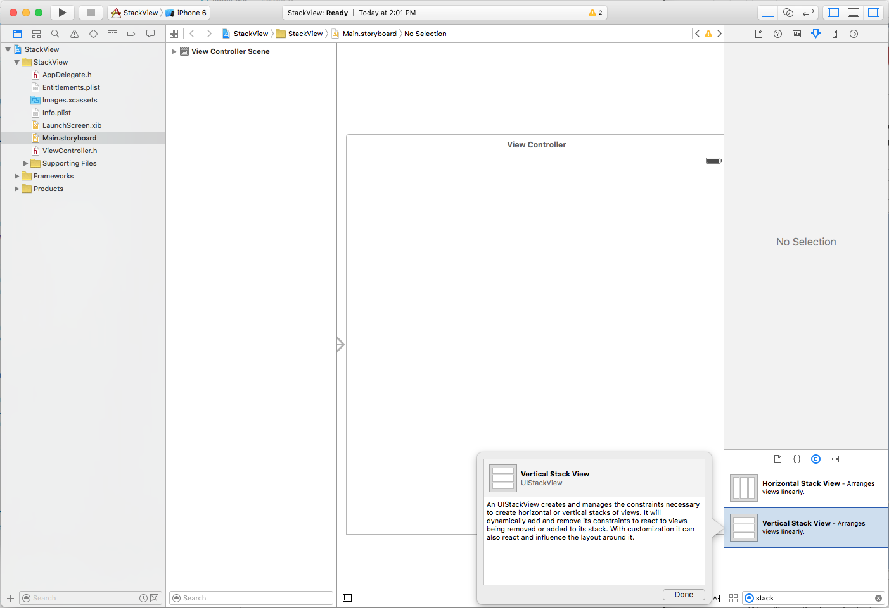
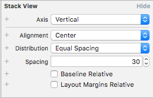
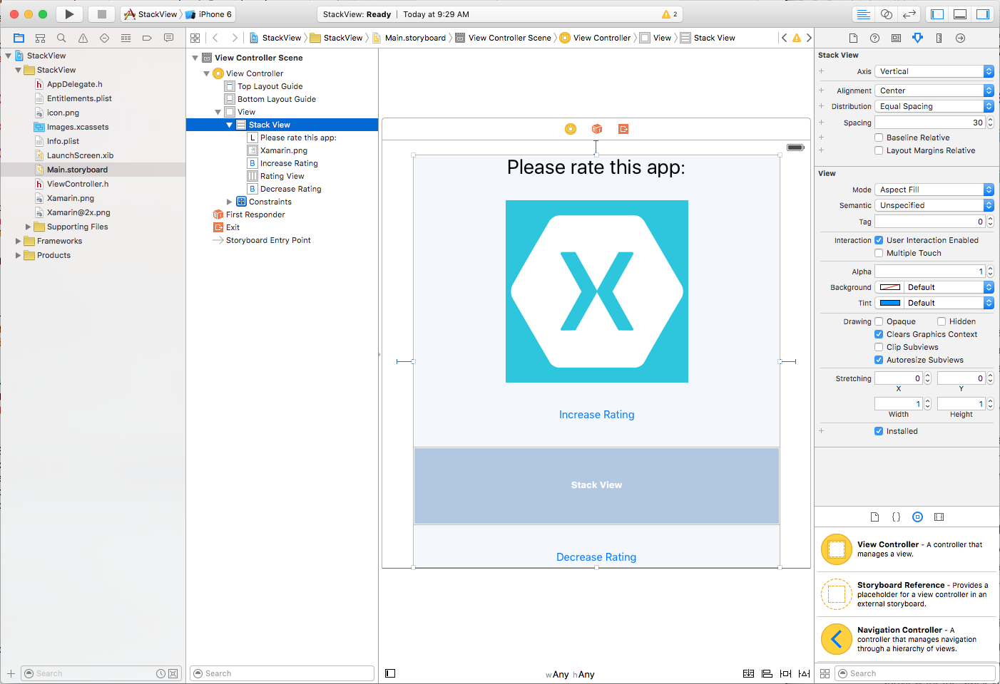
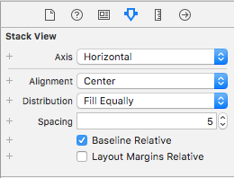
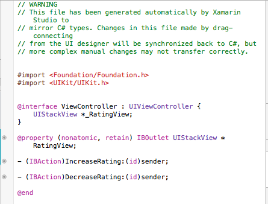

# Stack Views in Xamarin.iOS

_This article covers using the new UIStackView control in a Xamarin.iOS app to manage a set of subviews in either a horizontally or vertically arranged stack._

> [!IMPORTANT]
> Please note that while StackView is supported in the iOS Designer, you may encounter usability bugs when using the Stable channel. Switching the Beta or Alpha channels should alleviate this issue. We have decided to present this walkthrough using Xcode until the fixes required are implemented in the Stable channel.

The Stack View control (`UIStackView`) leverages the power of Auto Layout and Size Classes
to manage a stack of subviews, either horizontally or vertically, which dynamically
responds to the orientation and screen size of the iOS device.

The layout of all subviews attached to a Stack View are managed by it based on
developer defined properties such as axis, distribution, alignment and spacing:

[](uistackview-images/stacked01.png#lightbox)

When using a `UIStackView` in a Xamarin.iOS app, the developer can either define
the subviews either inside a Storyboard in the iOS Designer, or by adding and removing subviews in C# code.

This document consists of two parts: a quick start to help you implement your
first stack view, and then some more technical details about how it works.

> [!VIDEO https://youtube.com/embed/p3po6507Ip8]

**UIStackView video**

## UIStackView Quickstart

As a quick introduction to the `UIStackView` control, we are going to create a simple interface that allow the user to enter a rating from 1 to 5. We'll be using two Stack Views: one to arrange the interface vertically on the device's screen and one to arrange the 1-5 rating icons horizontally across the screen.

### Define the UI

Start a new Xamarin.iOS project and edit the **Main.storyboard** file in Xcode's Interface Builder. First, drag a single **Vertical Stack View** on the **View Controller**:

[](uistackview-images/quick01.png#lightbox)

In the **Attribute Inspector**, set the following options:

[](uistackview-images/quick02.png#lightbox)

Where:

- **Axis** – Determines if the Stack View arranges the subviews either **Horizontally** or **Vertically**.
- **Alignment** – Controls how the subviews are aligned within the Stack View.
- **Distribution** – Controls how the subviews are sized within the Stack View.
- **Spacing** – Controls the minimal space between each subview in the Stack View.
- **Baseline Relative** – If checked, the vertical spacing of each subview will be derived from it's baseline.
- **Layout Margins Relative** – Places the subviews relative to the standard layout margins.

When working with a Stack View, you can think of the **Alignment** as the **X** and **Y** location of the subview and the **Distribution** as the **Height** and **Width**.

> [!IMPORTANT]
> `UIStackView` is designed as a non-rendering container view and as such, it is not drawn to the canvas like other subclasses of `UIView`. So setting properties such as `BackgroundColor` or overriding `DrawRect` will have no visual effect.

Continue to layout the app's interface by adding a Label, ImageView, two Buttons and a Horizontal Stack View so that it resembles the following:

[](uistackview-images/quick03.png#lightbox)

Configure the Horizontal Stack View with the following options:

[](uistackview-images/quick04.png#lightbox)

Because we don't want the icon that represents each "point" in the rating to be stretched when it's added to the Horizontal Stack View, we've set the **Alignment** to **Center** and the **Distribution** to **Fill Equally**.

Finally, wire up the following **Outlets** and **Actions**:

[](uistackview-images/quick05.png#lightbox)

### Populate a UIStackView from Code

Return to Visual Studio for Mac and edit the **ViewController.cs** file and add the following code:

```csharp
public int Rating { get; set;} = 0;
...

partial void IncreaseRating (Foundation.NSObject sender) {

    // Maximum of 5 "stars"
    if (++Rating > 5 ) {
        // Abort
        Rating = 5;
        return;
    }

    // Create new rating icon and add it to stack
    var icon = new UIImageView (new UIImage("icon.png"));
    icon.ContentMode = UIViewContentMode.ScaleAspectFit;
    RatingView.AddArrangedSubview(icon);

    // Animate stack
    UIView.Animate(0.25, ()=>{
        // Adjust stack view
        RatingView.LayoutIfNeeded();
    });

}

partial void DecreaseRating (Foundation.NSObject sender) {

    // Minimum of zero "stars"
    if (--Rating < 0) {
        // Abort
        Rating =0;
        return;
    }

    // Get the last subview added
    var icon = RatingView.ArrangedSubviews[RatingView.ArrangedSubviews.Length-1];

    // Remove from stack and screen
    RatingView.RemoveArrangedSubview(icon);
    icon.RemoveFromSuperview();

    // Animate stack
    UIView.Animate(0.25, ()=>{
        // Adjust stack view
        RatingView.LayoutIfNeeded();
    });
}
```

Let's take a look at a few pieces of this code in detail. First, we use an `if` statements to check that there isn't more than five "stars" or less than zero.

To add a new "star" we load its image and set its **Content Mode** to **Scale Aspect Fit**:

```csharp
var icon = new UIImageView (new UIImage("icon.png"));
icon.ContentMode = UIViewContentMode.ScaleAspectFit;
```

This keeps the "star" icon from being distorted when it is added to the Stack View.

Next, we add the new "star" icon to the Stack View's collection of subviews:

```csharp
RatingView.AddArrangedSubview(icon);
```

You'll notice that we added the `UIImageView` to the `UIStackView`'s `ArrangedSubviews` property and not to the `SubView`. Any view that you want the Stack View to control its layout must be added to the `ArrangedSubviews` property.

To remove a subview from a Stack View, first we get the subview to remove:

```csharp
var icon = RatingView.ArrangedSubviews[RatingView.ArrangedSubviews.Length-1];
```

Then we need to remove it from both the `ArrangedSubviews` collection and the Super View:

```csharp
// Remove from stack and screen
RatingView.RemoveArrangedSubview(icon);
icon.RemoveFromSuperview();
```

Removing a subview from just the `ArrangedSubviews` collection takes it out of the Stack View's control, but does not remove it from the screen.

### Testing the UI

With all the required UI elements and code in place, you can now run and test the interface. When the UI is displayed, all of the elements in the Vertical Stack View will be equally spaced from top to bottom.

When the user taps the **Increase Rating** button, another "star" is added to the screen (up to a maximum of 5):

[](uistackview-images/intro01.png#lightbox)

The "stars" will be automatically centered and equally distributed in the Horizontal Stack View. When the user taps the **Decrease Rating** button, a "star" is removed (until none are left).

## Stack View Details

Now that we have a general idea of what the `UIStackView` control is and how it works, let's take a deeper look at some of its features and details.

### Auto Layout and Size Classes

As we saw above, when a subview is added to a Stack View its layout is totally controlled by that Stack View using Auto Layout and Size Classes to position and size the arranged views.

The Stack View will _pin_ the first and last subview in its collection to the **Top** and **Bottom** edges for Vertical Stack Views or the **Left** and **Right** edges for Horizontal Stack Views. If you set the `LayoutMarginsRelativeArrangement` property to `true`, then the view pins the subviews to the relevant margins instead of the edge.

The Stack View uses the subview's `IntrinsicContentSize` property when calculating the subviews size along the defined `Axis` (except for the `FillEqually Distribution`). The `FillEqually Distribution` resizes all subviews so that they are the same size, thus filling the Stack View along the `Axis`.

With the exception of the `Fill Alignment`, the Stack View uses the subview's `IntrinsicContentSize` property for calculating the view's size perpendicular to the given `Axis`. For the `Fill Alignment`, all subviews are sized so that they fill the Stack View perpendicular to the given `Axis`.

### Positioning and Sizing the Stack View

While the Stack View has total control over the layout of any subview (based on properties such as `Axis` and `Distribution`), you still need to position the Stack View (`UIStackView`) within its parent view using Auto Layout and Size Classes.

Generally, this means pinning at least two edges of the Stack View to expand and contract, thus defining its position. Without any additional constraints, the Stack View will automatically be resized to fit all of its subviews as follows:

- The size along its `Axis` will be the sum of all subview sizes plus any space that has been defined between each subview.
- If the `LayoutMarginsRelativeArrangement` property is `true`, the Stack Views size will also include room for the margins.
- The size perpendicular to the `Axis` will be set to the largest subview in the collection.

Additionally, you can specify constraints for the Stack View's **Height** and **Width**. In this case, the subviews will be laid out (sized) to fill the space specified by the Stack View as determined by the `Distribution` and `Alignment` properties.

If the `BaselineRelativeArrangement` property is `true`, the subviews will be laid out based on the first or last subview's baseline, instead of using the **Top**, **Bottom** or **Center**- **Y** position. These are calculated on the Stack View's content as follows:

- A Vertical Stack View will return the first subview for the first baseline and the last for the last. If either of these subviews are themselves Stack Views, then their first or last baseline will be used.
- A Horizontal Stack View will use its tallest subview for both the first and last baseline. If the tallest view is also a Stack View, it will use it's tallest subview as the baseline.

> [!IMPORTANT]
> Baseline Alignment does not work on stretched or compressed subview sizes as the baseline will be calculated to the wrong position. For Baseline Alignment, ensure that the subview's **Height** matches the Intrinsic Content View's **Height**.

### Common Stack View Uses

There are several layout types that work well with Stack View controls. According to Apple, here are a few of the more common uses:

- **Define the Size Along the Axis** – By pinning both edges along the Stack View's `Axis` and one of the adjacent edges to set the position, the Stack view will grow along the axis to fit the space defined by its subviews.
- **Define the Subview's Position** – By pinning to adjacent edges of the Stack View to it's parent view, the Stack View will grow in both dimensions to fit it's containing subviews.
- **Define the Size and Position of the Stack** – By pinning all four edges of the Stack View to the parent view, the Stack View arranges the subviews based on the space defined within the Stack View.
- **Define the Size Perpendicular the Axis** – By pinning both edges perpendicular to the Stack View's `Axis` and one of the edges along the axis to set the position, the Stack view will grow perpendicular to the axis to fit the space defined by its subviews.

### Managing the Appearance

The `UIStackView` is designed as a non-rendering container view and as such, it is not drawn to the canvas like other subclasses of `UIView`. Setting properties such as `BackgroundColor` or overriding `DrawRect` will have no visual effect.

There are several properties that control how a Stack View will arrange its collection of subviews:

- **Axis** – Determines if the Stack View arranges the subviews either **Horizontally** or **Vertically**.
- **Alignment** – Controls how the subviews are aligned within the Stack View.
- **Distribution** – Controls how the subviews are sized within the Stack View.
- **Spacing** – Controls the minimal space between each subview in the Stack View.
- **Baseline Relative** – If `true`, the vertical spacing of each subview will be derived from it's baseline.
- **Layout Margins Relative** – Places the subviews relative to the standard layout margins.

Typically you will use a Stack View to arrange a small number of subviews. More complex User Interfaces can be created by nesting one or more Stack Views inside each other (as we did in the [UIStackView Quickstart](#uistackview-quickstart) above).

You can further fine-tune the UIs appearance by adding additional constraints to the subviews (for example to control the Height or Width). However, care should be taken not to include conflicting constraints to those introduced by the Stack View itself.

### Maintaining Arranged Views and Sub Views Consistency

The Stack View will ensure that its `ArrangedSubviews` property is always a subset of its `Subviews` property using the following rules:

- If a subview is added to the `ArrangedSubviews` collection, it will automatically be added to the `Subviews` collection (unless it's already part of that collection).
- If a subview is removed from the `Subviews` collection (removed from display), it is also removed from the `ArrangedSubviews` collection.
- Removing a subview from the `ArrangedSubviews` collection does not remove it from the `Subviews` collection. So it will no longer be laid out by the Stack View, but will still be visible on screen.

The `ArrangedSubviews` collection is always a subset of the `Subview` collection, however the order of the individual subviews within each collection is separate and controlled by the following:

- The order of the subviews within the `ArrangedSubviews` collection determine their display order within the stack.
- The order of the subviews within the `Subview` collection determines their Z-Order (or layering) within the view back to front.

### Dynamically Changing Content

A Stack View will automatically adjust the layout of the subviews whenever a subview is added, removed or hidden. The layout will also be adjusted if any property of the Stack View is adjusted (such as its `Axis`).

Layout changes can be animated by placing them within an Animation Block, for example:

```csharp
// Animate stack
UIView.Animate(0.25, ()=>{
    // Adjust stack view
    RatingView.LayoutIfNeeded();
});
```

Many of the Stack View's properties can be specified using Size Classes within a Storyboard. These properties will be automatically animated is response to size or orientation changes.

## Summary

This article has covered the new `UIStackView` control (for iOS 9) to manage a set of
subviews in either a horizontally or vertically arranged stack in a Xamarin.iOS app.
It began with a simple example of using Stack Views to create a UI, and finished
with a more detailed look at Stack Views and their properties and features.

## Related Links

- [iOS 9 Samples](/samples/browse/?products=xamarin&term=Xamarin.iOS%2biOS9)
- [What's New in iOS 9.0](https://developer.apple.com/library/prerelease/ios/releasenotes/General/WhatsNewIniOS/Articles/iOS9.html)
- [UIStackView Reference](https://developer.apple.com/library/prerelease/ios/documentation/UIKit/Reference/UIStackView_Class_Reference/)
- [Introducing UIStackView (video)](https://university.xamarin.com/lightninglectures/introducing-uistackview-on-ios9)